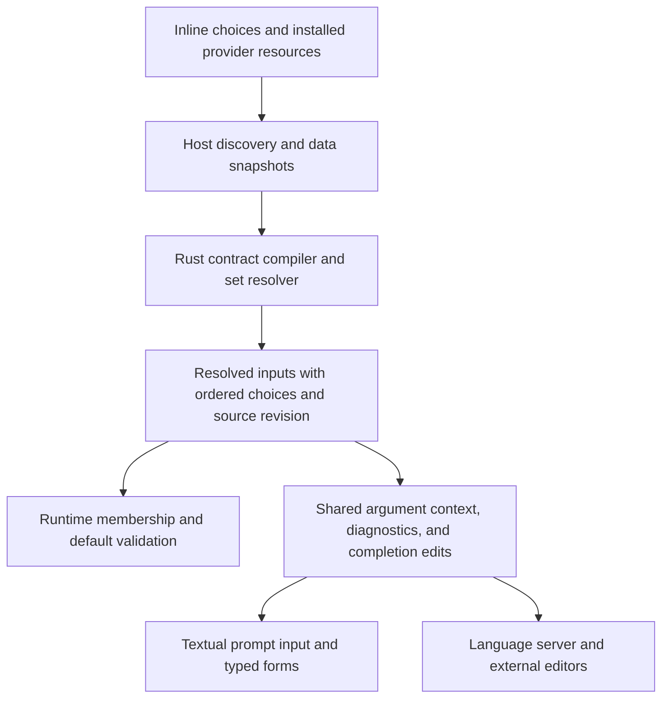

# Enum macro inputs: shared choice sets, faithful validation, and beautiful completion

Researcher: **cdx**. Independent report for the enum-input research swarm.

## Decision in brief

The feature is a good idea. Explicit finite choices make macros easier to discover, catch mistakes before execution, and give every frontend useful structured information. However, the inspected checkout **already implements `enum` with inline `choices`**. The missing work is reusable sets, preservation of choice metadata across catalogs, argument-value completion, and consistent validation. Treat this as completing and extending that contract, rather than adding a second enum system.

My recommendation is to keep `type: enum` and the existing `choices` spelling; allow `choices` to be either the existing list or a provider reference such as `choices: {use: builtin@models}`. Implement resolution and validation in Rust core, with Python discovering installed providers and supplying immutable data snapshots. TUI and LSP should consume the same resolved contract and the same completion edits.

There is one essential qualification: **the set of suggested models is not the set of strings accepted by `%model`**. A strict enum of known model selectors is useful, but cannot preserve the full directive language. Provide an explicit suggestion-only route for an ordinary `word` input when that is the author's intent. Do not turn the current completion menu into an authoritative model validator.

## Scope and evidence

I inspected the primary SASE checkout at `aeccf843574ee08293b8fbf71e8b56a676debaa4`, and the linked `sase-core` checkout at `2f16dc4a303badc8428abfa7d15aa96df30019ce`. The latter exactly matches the primary checkout's `sase-core-revision.txt`, so the backend observations are about the pinned implementation, not an unrelated newer branch. I also inspected `sase-nvim` at `09d81876bfe537e02af65c8599dd6ae11ca17d9b` and official LSP specification sources at `f8c4bc9834703b7317c98c8e8053a28fa4b6b997`.

All repository access used `sase repo open` where required. I did not read another swarm researcher's report, transcript, summary, or findings. Code inspection and isolated execution of actual Python modules support the findings below; this research did not change product code or run the full product verification gate.

### What exists, and what does not

| Area | Observed behavior | Implication |
| --- | --- | --- |
| Runtime input model | `InputType.ENUM`, `InputChoice(value, label)`, nonempty choice-list requirement, duplicate-value rejection, and exact membership validation already exist. | Extend the existing public contract. |
| Authored syntax | Shortform and longform inputs accept inline `choices`; choices may be scalar values or `{value, label}` mappings. | Preserve these forms and labels. |
| Typed forms | The TUI has an enum button that cycles through declared choices. | Existing forms need resolved sets; larger catalogs need search. |
| Rust frontmatter diagnostics | Enum declarations and defaults receive choice checks. | There is already a starting point for authoring diagnostics. |
| Rust catalog | Mobile input wire carries choices, and the native loader parses them. | Preserve that data instead of rediscovering it downstream. |
| Editor assist wire | `MacroInputHint` does not carry choices; `assist_entries_from_catalog` drops them. | The LSP lacks the metadata needed for enum argument completion and membership diagnostics. |
| Python catalog and TUI assist | `StructuredCatalogInput` and `MacroInputHint` omit choices too. | The TUI loses the same information on a different projection path. |
| Completion dispatch | The generic argument-value branch is currently bool-specific; enum resolves to a type hint. | Merely adding an enum branch in a widget is insufficient. |
| Invocation diagnostics | Rust `value_matches_input_type` falls through to `true` for enum. | Invalid enum invocation values may look valid in the editor while runtime rejects them. |
| Published authoring schemas | The workflow and config input schemas omit enum from their supported type lists and omit `choices`. | Fix schemas together with runtime, not as a later documentation cleanup. |
| Reuse | Existing parsing requires a list; there is no `choices.use` shared-provider contract. | This is the central new capability. |

Evidence: [runtime types and membership][S1], [input parsing][S2], [typed forms][S3], [Python structured catalog][S4], [Rust editor hints][C1], [catalog-to-assist projection][C2], [argument context][C3], [invocation diagnostics][C4], [Rust declaration checks][C5], and [workflow schema][S5]. These are implementation observations, not claims that all installation versions behave identically.

### Small reproductions that affect the design

I loaded the actual `models.py` and `input_binding.py` modules with `importlib`, using empty package stubs only to avoid initializing unrelated installed dependencies. There were no replacement implementations. The results were:

```text
Declared choice ""          -> direct validation accepts; binding produces mode=""
Declared choice "two words" -> direct validation accepts; binding produces mode="two words"
Declared choice "null"      -> direct validation accepts; binding produces no mode value
Choices ["fast"], default "turbo" -> binding without arguments produces mode="turbo"
```

This demonstrates four boundaries that a design must address. The existing enum does not enforce the requested word subtype; the invocation binder reserves the string `null`; declaration-time default checks differ from runtime binding; and a nonempty *list* does not imply nonempty *values*. The invalid-default observation is an isolated runtime-binding result, not a claim that an editor or an independent validation command would fail to report that declaration. Sources: [runtime model][S1], [binder][S6], [frontmatter default validation][C5].

## Is this the right abstraction?

Yes, for a closed vocabulary: modes, environments, output formats, strategies, effort levels, or other tokens whose meanings belong to the macro or its provider. A closed enum should promise that every successfully bound value is one of its choices. That promise supports validation, UI controls, documentation, and future web or CLI consumers.

Completion is broader. Model names, branch names, agents, paths, or arbitrary external identifiers often have useful suggestions without an exhaustive finite domain. For those, a catalog is assistance rather than a type restriction. Conflating the two produces a feature that looks convenient until it starts rejecting legitimate inputs.

This distinction follows established practice. JSON Schema's enum describes an explicit finite restriction; its reuse mechanism references separately identified schemas. Click supports both a closed `Choice` parameter and completion attached independently to other parameter types. The useful lesson is the separation of the validity contract from the suggestion mechanism, not wholesale adoption of either framework. [JSON Schema enum](https://json-schema.org/understanding-json-schema/reference/enum), [JSON Schema reuse](https://json-schema.org/understanding-json-schema/structuring), [Click choices](https://click.palletsprojects.com/en/stable/parameter-types/#choice), [Click custom completion](https://click.palletsprojects.com/en/stable/shell-completion/#overriding-value-completion).

### Why models need special care

The current model resolver first resolves aliases, handles explicit `provider/model`, consults the known-model map, and finally lets an unknown name fall back to the default provider. It does not impose exhaustive membership in a local model list. `%model` also supports effort-bearing selectors and quoted strings. The completion catalog includes known models, user and implicit aliases, advisory metadata, and `provider/` navigation rows; some providers are hidden from the picker. See [model routing][S7], [catalog construction][S8], and [model entry metadata][S9].

Consequently, copying completion rows into enum choices would have at least these defects:

- Rejecting a legitimate explicit provider/model string or newer model absent from local metadata.
- Rejecting effort-modified selectors unless their combinations happen to be enumerated.
- Accidentally accepting an unfinished `provider/` navigation row as a final choice.
- Treating a temporarily unavailable or hidden provider as a change to an input's type.
- Advertising labels or search aliases as accepted spellings without the resolver supporting them.

**Three different promises must be named separately:** a selector is known locally; its syntax and routing are accepted by SASE; the remote/provider harness can actually use it now. Offline metadata can establish the first, parts of the second, and never guarantee the third. Completion or validation must not make network model requests or consume an alias's round-robin selection to discover availability.

For authors who want a deliberately bounded menu, `builtin@models` should mean **known configured model selectors**, including supported alias spellings, with explicit documentation of this narrower contract. For authors who want the directive's open behavior, use a `word` input with suggestions and let the existing model-routing path interpret the value. A future semantic `model` input could add directive-equivalent local validation, but that is a separate design requiring a defined validity predicate; it should not be smuggled into enum membership.

## Proposed authoring contract

### Inline choices remain the simplest path

```yaml
input:
  mode:
    type: enum
    choices: [fast, thorough]
    default: fast
```

Keep the existing longform equivalent. Retain rich labels:

```yaml
input:
  environment:
    type: enum
    choices:
      - value: staging
        label: Staging
      - value: prod
        label: Production
```

Templates receive `prod`, never `Production`. Do not derive identifiers from labels. Labels may contain spaces; new reusable choice values follow the nonempty word contract. The existing exact, case-sensitive membership rule should remain; completion can match case-insensitively and insert the declared spelling.

### Share through an explicit `use` object

```yaml
input:
  model:
    type: enum
    choices:
      use: builtin@models
```

The compact version is equally readable:

```yaml
model: {type: enum, choices: {use: builtin@models}}
```

A plugin example:

```yaml
input:
  region:
    type: enum
    choices: {use: sase-deploy@regions}
```

These examples describe proposed syntax, not capabilities already available. Use the project's existing `<distribution>@<provider>` convention. Reserve `builtin`; normalize distribution identity according to the existing plugin resolver; apply the existing `plugins.required` rule to third-party references. Unknown providers, duplicates, malformed references, and missing required plugins are configuration errors. The existing project policy already requires non-builtin provider prefixes to correspond to required distributions; this proposal should conform to that policy instead of inventing another import mechanism.

Prefer `builtin@models` to `builtin@model_enum_values`: the shorter name describes the resource, while `choices` and `type: enum` already communicate its role. Do not make `type` itself a provider ref, overload an individual list string as an import, or introduce Python dotted names into author YAML.

Exactly one source is permitted: an inline list, `{use: ...}`, or the optional `{ref: ...}` form below. Do not silently combine provider values and extra list entries. Unknown mapping keys should fail with a targeted diagnostic. There is no arbitrary shell command, template expression, or network URL in a choice source.

### Local reuse: useful, but a separate optional increment

Cross-plugin reuse satisfies the stated shared-provider requirement without adding an author-managed registry. If recurring local duplication warrants it, add a small declarative block:

```yaml
enum_sets:
  deployments:
    choices: [staging, prod]

input:
  environment:
    type: enum
    choices: {ref: deployments}
```

Allow `enum_sets` in macro/workflow frontmatter and project/user configuration, with resolution from the nearest definition to project, then user configuration. Resolve names in the defining macro's environment, not whichever caller happens to invoke it. Within one scope, duplicate definitions fail; a nearer definition replaces a whole lower-priority set. Named sets contain a concrete list or direct provider reference, not another named-set reference, avoiding cycles in the first implementation. Explicit `use` references never get shadowed by local sets.

This form is a convenience proposal, **not required for the first release**. It should not delay the shared-provider contract and parity work. Avoid `local@...` or `project@...` pseudo-plugin namespaces: they conflict with the established required-plugin interpretation of non-builtin prefixes.

### Completion without membership restriction

Use a separate field so the author's intent is visible:

```yaml
input:
  model:
    type: word
    completion: {use: builtin@models}
```

This form recommends known selectors but does not claim they exhaust valid words. Inline enum choices automatically provide completion; an author should not have to repeat them under `completion`. Initially accept provider completion only for `word` inputs, where it has a clear demonstrated use. Do not add an all-types extensibility framework just because the field could someday support it.

This is the main requirement adjustment: **known-model restriction and full `%model` acceptance are different features**. The strict enum serves the former; the suggestion-only word input serves the latter's authoring experience. Preserve `%model` behavior rather than silently changing it to justify a finite catalog.

## Reliable semantics

### Declaration and binding

For new shared sets, require an ordered, nonempty sequence of unique, nonempty strings. Values must contain no Unicode whitespace. Do not trim, lowercase, or otherwise normalize values. Reject duplicate values even if they carry different labels; duplicate labels are allowed, with the raw value visible for disambiguation.

New shared sets should reject numeric, boolean, null, mapping, or sequence values where a string is required. Recommend quoting string spellings such as `"true"`, `"false"`, or `"42"`. YAML resolves some unquoted scalars to other types, and the current Python `str(True)` versus Rust boolean formatting can produce different spellings. Avoid language-dependent coercion in the new contract. [YAML scalar resolution](https://yaml.org/spec/1.2.2/#103-core-schema), [current Python choice parsing][S2], [current Rust scalar conversion][C5].

A non-null default must be a member after source resolution, before an input form opens or a workflow step executes. Revalidate computed values after ordinary macro/Jinja/substitution processing and before passing them to a template or step. Treat unresolved expressions as unknown in editor diagnostics; do not execute them to prove membership. Runtime remains authoritative.

Preserve existing omission/default/null semantics. YAML `default: null` is optional/pass-through, not an enum member; the word `null` is currently a reserved invocation sentinel, even when the declared choice is the string `"null"`. Reject that literal in new shared sets with a specific explanation until the parser/binder retains enough information to distinguish a literal from the sentinel. Do not use `default: ""` as a new shared-enum optionality convention.

For repeatable enum inputs, validate each element with the same set. Retain the existing final-positional-input rule. Repeating a value should remain legal unless a separately defined uniqueness rule requires otherwise; do not borrow agent-completion suppression of already selected names.

### Compatibility with the existing enum

The word-subtype requirement conflicts with current enum behavior: arbitrary scalar coercion, empty strings, and whitespace choices are already accepted in some runtime paths. **Do not silently tighten all old inline declarations in this feature.** Preserve their existing authoring shapes and labels through a compatibility adapter; make the new provider/shared-set contract strict from its introduction. Inline-to-shared conversion must diagnose values that need migration.

If the product wants every legacy inline enum to become a strict word enum, perform that as an explicit migration. Project policy requires a sunset flag for a deprecated compatibility branch, and both states need coverage. This report recommends no flag creation or behavior removal as part of the research. The first release can add sharing and parity without forcing that breaking change.

Invalid defaults, unusable sentinel choices, and cross-language coercion deserve explicit diagnostics and regression cases even where legacy input shapes remain accepted. Keeping a shape readable is not a reason to preserve contradictory frontend behavior.

### Missing or changing sources

Distinguish source states: resolved, unavailable, malformed, and stale. An empty result is not an unavailable provider, and an unavailable provider is not permission to accept any word.

For strict enums, runtime binding fails with a source-specific error if it cannot obtain the authoritative set. Other unrelated macros should remain usable; do not fail an entire interactive catalog because one macro has an unresolved source. An editor can show the last known choices with a stale marker or leave value completion empty with a concise diagnostic. It must not state that an unavailable set contains no allowed values or report every token as an invalid member.

For suggestion-only inputs, provider failure affects completion, not the underlying word constraint. This difference is a consequence of the declared contracts, not a special-case fail-open switch.

Resolve one immutable set revision for each invocation. Validate all its values and defaults against that revision; do not refresh between arguments or between validation and rendering. A later invocation may resolve a newer revision. Revalidate at final submission if the interactive form's revision differs from the current launch context, and explain removals instead of silently substituting a different value.

## Architecture and provider design

### Rust owns the common behavior

The project's backend boundary is decisive here: macro contracts, source-reference validation, set resolution, membership, defaults, argument context, serialization, diagnostics, matching, and accept edits are common behavior. Put them in `sase_core`. Python may discover distribution resources and collect provider/model metadata; it should pass typed data through a thin adapter instead of implementing another enum validator. Presentation remains in Textual and the LSP renderer.



Retain both an **authored choice source** and **resolved choices**. This distinction is essential for editing and saving macros: a provider-backed input must serialize back to `choices: {use: ...}`, not become a copied list of whichever models happened to exist when it was opened. Current prompt-frontmatter serialization writes the resolved inline tuple; it needs this additional source representation. See [serialization][S10].

A small conceptual wire is sufficient:

```text
ChoiceSource = InlineChoices | ProviderRef | LocalSetRef
Choice = {value, label?}
ResolvedChoiceSet = {source_id, revision, state, choices}
ResolvedInput = existing input metadata + choice_source? + choice_set?
```

Use the existing choice wire where possible. Per-choice descriptions can be added later if a concrete provider needs them; do not require every simple enum to carry a miniature schema. Keep typed set state distinct from an ordinary empty vector. Resource provenance and revision can live at set level rather than being duplicated on every choice.

### Start with data providers, not per-keystroke callbacks

Prefer declarative, versioned choice manifests shipped by installed plugins. SASE already discovers plugin resource modules/config files and exports their concrete locations to the Rust loader. Build on that resource transport, reserving a dedicated manifest basename/schema for choice sets if needed. Avoid scanning arbitrary macro files and guessing they are enum declarations. [LSP resource discovery][S11], [Rust catalog resources][C6].

The resource identity should include the owning distribution and provider slug; provider refs should not inherit the macro loader's unqualified first-wins shadowing. A plugin can publish several namespaced sets, and another plugin can reference them explicitly. Required-plugin validation and source provenance need to be available outside the completion widget too.

For `builtin@models`, the Python host already has an aggregate model metadata/catalog path and materializes JSON for the Rust LSP. Adapt that path, rather than querying each provider again for enum values. Construct authoritative known selectors from underlying metadata and supported aliases, **before presentation filtering**, then attach advisory/availability data for completion. Exclude provider navigation rows from strict membership. Do not remove choices because a provider was temporarily disabled or a row was hidden in the picker. [Existing model materialization][S11], [model catalog][S8].

If executable plugin providers are eventually necessary, define a separate bounded, versioned host protocol. Resolve asynchronously on refresh, cache by provider/distribution/config context, and publish data to Rust. Missing plugins, timeouts, malformed rows, unsupported versions, and oversized payloads must yield typed errors. Never invoke Python/plugin commands, shell expansion, or the network for each keystroke.

### Freshness is part of correctness

Cache by canonical project/definition scope, merged configuration revision, provider/distribution version, and source fingerprint. Avoid a single process-global cache keyed only by the enum name. Refresh when a relevant manifest, macro definition, config, or provider inventory changes; use existing catalog invalidation facilities where possible.

Publish complete snapshots atomically. Keep the last valid snapshot on refresh failure, with a state that consumers can display; do not publish a partially built list. Make context identity explicit when exporting to an external editor, since one editor may have multiple projects with different aliases or sources. Live availability affects UI detail and routing, not membership in a declared known-selector set.

The current LSP model path is a launch-materialized JSON file reread by completion requests. Rereading does not itself rebuild stale host data. Therefore “the server rereads the file” is not a freshness strategy; invalidation must also update the producer. [Host materialization][S11], [LSP model loading][C7].

## Completion and visual design

Beauty here comes from a small authoring vocabulary, a clear current input, stable rows, and precise edits. Preserve the current completion interaction and make the new metadata visible within it.

### TUI

When the active argument is enum, show only that input's choices, with the macro and input in a quiet header. Display the canonical value first; show a distinct human label beside it and the input description in the existing help area. Mark the default softly rather than inserting it without a deliberate selection. Show provider/source information in details, not in every ordinary row.

For example, a labeled menu could read:

```text
#deploy · environment
  staging   Staging
  prod      Production

Choose the deployment environment.
```

Use the existing keyboard acceptance/navigation behavior. Do not create a modal just to select an enum token. On an empty token, preserve declared order; with a prefix, prefer prefix matches, then existing fuzzy behavior where appropriate. Case-insensitive matching should still insert exact declared case. Changing the query should not cause arbitrary row reordering.

The cycling button is acceptable for a tiny existing form, but a model catalog is too large for repeated cycling. Reuse a searchable choice picker for larger resolved sets, keeping the value/label separation consistent with the prompt bar. Do not create an unrelated second model-picker implementation.

### Shared argument context

Support colon shorthand, named parenthesized arguments, ordinary positional parenthesized arguments, repeatable tails, standalone workflows, and document-local macros. The existing Rust context detector defaults a non-repeatable, unnamed parenthesized slot to argument-name completion; adding enum values requires addressing that ambiguity, not just mapping `enum` to the bool branch. See [argument detection][C3].

At a slot where both `mode=` and a positional value are legal, show clearly distinguished name and value candidates, with the active positional input identified. Once `name=` is present, complete only its value. A selected enum value must not convert the call to named syntax unexpectedly.

Determine replacements with the argument parser, not a separate regex. If the cursor is inside a partial value, replace the complete current value span, preserving subsequent arguments and punctuation. Preserve surrounding quotes when safe, otherwise use the shared argument serializer to quote/escape the chosen value. “Single word” still permits punctuation significant to macro syntax; membership values and their authored representation are different things. Test commas, equals, plus, quotes, backticks, and Unicode deliberately.

Respect literal/code-disabled regions. Do not execute nested macro or shell expressions to create suggestions. Do not suppress a valid enum value merely because it was selected for a different argument.

### External editors and LSP

Return ordinary completion items with explicit edits, canonical filter text, stable sort text, and human documentation. Use `EnumMember` for strict choices and `Value` for ordinary word suggestions. Keep labels independent of the inserted value. Capability-dependent adornments are optional; ordinary items must work without snippet support. Existing triggers already include `:`, `(`, `,`, and `=`, so enum does not inherently need a new trigger character. [Existing LSP triggers][C8], [existing model item rendering][C9].

LSP provides `filterText`, `sortText`, `textEdit`, `EnumMember`, and incomplete-list signaling. Its completion edit must contain the request position and stay on one line. Use the established position-encoding conversion, and test edits after a non-BMP character. If a result is truncated, return an incomplete list rather than claiming it exhausts the set. These protocol features suffice; no enum-specific protocol extension is needed. [Official LSP completion specification][L1], [position encoding][L2].

Distinguish argument-value completion from **definition authoring**. At an input's `choices.use` field, the LSP should complete available provider refs; at an invocation, it should complete resolved values. Missing source diagnostics should underline the definition's source field, while invalid supplied values should underline their own argument span. Hover should show the source, a short choice list or count, and the input description. For a large model set, avoid dumping every model into every hover or error message.

The inspected Neovim integration already uses standard LSP completion, including a native frontend and `nvim-cmp` capabilities. The feature should therefore live in server/core data and edits, with at most integration smoke tests in the plugin. No Lua model-enum resolver is justified. [Neovim LSP client][N1].

## Alternatives and tradeoffs

| Alternative | Benefit | Problem | Assessment |
| --- | --- | --- | --- |
| Keep `word`, add only suggestions | Small change; supports open model language. | No finite-membership guarantee or schema-driven choice forms. | Useful companion, insufficient alone. |
| `type: enum` with inline list only | Very simple, already implemented. | Duplicated plugin/model lists drift. | Preserve as the default simple case. |
| `type: builtin@models` | Compact custom-type appearance. | Blends syntax type, resource lookup, and provider behavior; obscures membership. | Avoid. |
| `choices: builtin@models` | Very compact. | Scalar shorthand is less explicit and harder to extend or diagnose. | Prefer `{use: ...}`. |
| Full JSON Schema inputs and `$ref` | Rich constraints and standard reuse. | Large migration; does not solve runtime model catalogs by itself. | Keep schema export compatible; defer schema-system replacement. |
| YAML anchors | Easy reuse inside a file. | Do not share across files/plugins; parser/export behavior leaks into authoring. | Allow naturally where supported, not the public reuse API. |
| Python import or shell callback in `choices` | Can generate anything. | Runtime execution, latency, environment coupling, and weak editor portability. | Avoid for the initial contract. |
| Generic semantic-type plugin system | Could unify agent/model/branch behavior. | Broader validation and lifecycle contract than this request needs. | Revisit only with multiple demonstrated domains. |
| Provider-backed enum plus shared Rust contract | Strong finite semantics, reuse, and frontend parity. | Requires deliberate data transport, invalidation, and compatibility work. | Recommended. |

## Requirements I would adjust

1. **Reframe the work as extending an existing enum.** Reuse `choices`, `InputChoice`, and current label support. Do not create a second `values` spelling just to match the initial wording.
2. **Make the strict/shared contract word-based, without silently breaking legacy inline choices.** New shared sets contain nonempty strings without whitespace; broader legacy shapes need an explicit migration if they are to be removed.
3. **Clarify the model promise.** `builtin@models` provides a finite known-selector set. Directive-equivalent acceptance uses word suggestions and existing routing, or a later semantic model type. Known, accepted, and currently executable are different guarantees.
4. **Include parity and authoring schemas in the acceptance criteria.** Completion that works only in one widget is not this feature; metadata, diagnostics, saves, forms, and external editors must agree.
5. **Keep labels.** They already exist and directly improve presentation. They never change membership or inserted tokens.
6. **Constrain provider execution.** Prefer declarative installed resources and host-produced snapshots; no per-keystroke generation, arbitrary commands, or network validation.
7. **Keep local registries and general semantic types optional.** They are useful extensions, but the stated cross-plugin reuse does not require shipping them immediately.

## Implementation sequence and acceptance criteria

This is a research recommendation, not an approved execution plan.

| Increment | Concrete result | Key validation |
| --- | --- | --- |
| 1. Preserve and align existing enum data | Choices survive Python catalog, Rust catalog, editor hint, and save projections; Rust owns enum membership/default semantics through bindings. | Inline/labeled/longform round trips, invalid invocation/default parity, legacy behavior fixtures. |
| 2. Shared source contract | `choices: {use: ...}` resolves explicit installed/builtin sets into an immutable Rust contract. | Missing/duplicate/malformed provider cases; plugin requirements; definition scope; source-preserving saves. |
| 3. Complete both frontends | TUI and LSP produce the same value candidates and accept edits for every supported argument form. | Golden document/cursor/candidate/edit fixtures plus stdio LSP and TUI acceptance checks. |
| 4. Model adapter and open suggestions | A known-selector enum and suggestion-only word input share model metadata without narrowing `%model`. | Exclude navigation rows; alias spellings; effort and unknown-model open-path cases; availability does not redefine membership. |
| 5. Polish and resource freshness | Authoring completion, searchable large forms, atomic refresh, and clear stale-source presentation. | Context/config changes; failing refresh; multiple projects; keyboard and external-editor smoke checks. |

Update `workflow.schema.json`, the config input schemas, frontmatter metadata, `docs/macros.md`, catalog/help rendering, and bindings together. Any new shared binding requires advancing SASE's `sase-core-revision.txt` past the implementing core commit and following the project's schema-version compatibility rules. The inspected pin currently matches the inspected core; no pin change is needed for this research.

The high-value test matrix includes empty sets/values, duplicate values, whitespace, quoted numeric/boolean spellings, literal `null`, omission and YAML null defaults, exact case, invalid defaults, labels differing from values, repeatable elements, special punctuation, local macro scope, UTF-16/non-BMP edits, cursor-in-middle replacement, and literal zones. Provider tests should cover unavailable versus empty sources, malformed snapshots, version mismatch, source revision changes, context-specific aliases, and provider rows that are navigation rather than values.

Use real contract tests rather than duplicating the validator in Python tests. The most useful parity invariant is: **after applying a shared enum completion edit, both runtime and editor accept the resulting argument as the same exact value under the same resolved set revision**. Schema validation, typed forms, and serialization should consume that contract too.

## Source ledger

The repository links below refer to exact inspected revisions. Official LSP source files were read from an opened checkout because the rendered specification page exposed only its navigation through the web reader. No peer research was used.

- [S1: Python input types, choice model, membership][S1]
- [S2: Choice parsing and input definitions][S2]
- [S3: Existing enum form control][S3]
- [S4: Structured catalog input model][S4]
- [S5: Workflow authoring schema][S5]
- [S6: Actual invocation binding and defaults][S6]
- [S7: Model routing and unknown-name fallback][S7]
- [S8: Model completion catalog construction][S8]
- [S9: Model entry wire metadata][S9]
- [S10: Prompt-frontmatter input serialization][S10]
- [S11: LSP host resource discovery and materialization][S11]
- [C1: Rust editor input hints][C1]
- [C2: Catalog-to-editor assist projection][C2]
- [C3: Argument context and type dispatch][C3]
- [C4: Invocation diagnostics][C4]
- [C5: Frontmatter choices, defaults, scalar conversion][C5]
- [C6: Rust macro catalog resource options][C6]
- [C7: LSP loading of materialized model data][C7]
- [C8: LSP server completion triggers][C8]
- [C9: LSP model completion rendering][C9]
- [N1: Neovim standard LSP integration][N1]
- [L1: Official LSP 3.17 completion source][L1]
- [L2: Official LSP 3.17 position encoding source][L2]

[S1]: https://github.com/sase-org/sase/blob/aeccf843574ee08293b8fbf71e8b56a676debaa4/src/sase/macro/models.py#L24
[S2]: https://github.com/sase-org/sase/blob/aeccf843574ee08293b8fbf71e8b56a676debaa4/src/sase/macro/loader_parsing.py#L109
[S3]: https://github.com/sase-org/sase/blob/aeccf843574ee08293b8fbf71e8b56a676debaa4/src/sase/ace/tui/widgets/typed_input_form.py#L142
[S4]: https://github.com/sase-org/sase/blob/aeccf843574ee08293b8fbf71e8b56a676debaa4/src/sase/macro/_catalog_models.py#L45
[S5]: https://github.com/sase-org/sase/blob/aeccf843574ee08293b8fbf71e8b56a676debaa4/src/sase/macros/workflow.schema.json#L9
[S6]: https://github.com/sase-org/sase/blob/aeccf843574ee08293b8fbf71e8b56a676debaa4/src/sase/macro/input_binding.py#L45
[S7]: https://github.com/sase-org/sase/blob/aeccf843574ee08293b8fbf71e8b56a676debaa4/src/sase/llm_provider/registry.py#L550
[S8]: https://github.com/sase-org/sase/blob/aeccf843574ee08293b8fbf71e8b56a676debaa4/src/sase/macro/_model_completion_catalog.py#L17
[S9]: https://github.com/sase-org/sase/blob/aeccf843574ee08293b8fbf71e8b56a676debaa4/src/sase/macro/_model_completion_entry.py#L51
[S10]: https://github.com/sase-org/sase/blob/aeccf843574ee08293b8fbf71e8b56a676debaa4/src/sase/macro/prompt_frontmatter.py#L417
[S11]: https://github.com/sase-org/sase/blob/aeccf843574ee08293b8fbf71e8b56a676debaa4/src/sase/integrations/macro_lsp.py#L469
[C1]: https://github.com/sase-org/sase-core/blob/2f16dc4a303badc8428abfa7d15aa96df30019ce/crates/sase_core/src/editor/wire.rs#L394
[C2]: https://github.com/sase-org/sase-core/blob/2f16dc4a303badc8428abfa7d15aa96df30019ce/crates/sase_core/src/editor/completion/assist_candidates.rs#L18
[C3]: https://github.com/sase-org/sase-core/blob/2f16dc4a303badc8428abfa7d15aa96df30019ce/crates/sase_core/src/editor/completion/trigger_context.rs#L241
[C4]: https://github.com/sase-org/sase-core/blob/2f16dc4a303badc8428abfa7d15aa96df30019ce/crates/sase_core/src/editor/diagnostics.rs#L504
[C5]: https://github.com/sase-org/sase-core/blob/2f16dc4a303badc8428abfa7d15aa96df30019ce/crates/sase_core/src/editor/frontmatter.rs#L877
[C6]: https://github.com/sase-org/sase-core/blob/2f16dc4a303badc8428abfa7d15aa96df30019ce/crates/sase_core/src/macro_catalog/types.rs#L63
[C7]: https://github.com/sase-org/sase-core/blob/2f16dc4a303badc8428abfa7d15aa96df30019ce/crates/sase_xprompt_lsp/src/server/catalogs.rs#L560
[C8]: https://github.com/sase-org/sase-core/blob/2f16dc4a303badc8428abfa7d15aa96df30019ce/crates/sase_xprompt_lsp/src/server/mod.rs#L157
[C9]: https://github.com/sase-org/sase-core/blob/2f16dc4a303badc8428abfa7d15aa96df30019ce/crates/sase_xprompt_lsp/src/lsp_convert.rs#L260
[N1]: https://github.com/sase-org/sase-nvim/blob/09d81876bfe537e02af65c8599dd6ae11ca17d9b/lua/sase/lsp.lua#L254
[L1]: https://github.com/microsoft/language-server-protocol/blob/f8c4bc9834703b7317c98c8e8053a28fa4b6b997/_specifications/lsp/3.17/language/completion.md
[L2]: https://github.com/microsoft/language-server-protocol/blob/f8c4bc9834703b7317c98c8e8053a28fa4b6b997/_specifications/lsp/3.17/types/position.md

## Recommended solution

**Extend the existing enum with `choices: [values...]` or `choices: {use: distribution@set}`, using `builtin@models` for a clearly documented finite set of known model selectors. Resolve one immutable contract in Rust and carry it through runtime binding, diagnostics, save serialization, TUI completion, typed forms, and standard LSP items. Add `word` plus `completion: {use: builtin@models}` when authors want model suggestions while preserving the open `%model` language.**

Ship inline-enum parity and shared providers before optional local registries or general semantic-type plugins. Preserve labels and legacy input shapes; make new shared values strict words; diagnose defaults and sentinel collisions; keep model availability separate from membership. This offers a small, readable authoring surface and a reliable implementation boundary, while leaving room for a genuinely semantic model type if a later use case requires it.
