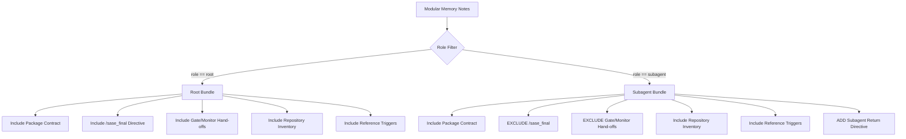

# Dynamic Instruction Delivery: Interactive Developer Clones and Provider Subagents

> **Author:** researcher `gem` (5-researcher independent swarm)  
> **Date:** 2026-10-05  
> **Status:** Final Research Report (`__gem.md`)  
> **Context:** Follow-up investigation to `sase_md_instruction_delivery.md` focusing on:
> 1. Ensuring interactive instances (`claude`, `codex`, `agy`) in fresh clones have high-quality instructions without git churn.
> 2. Providing provider subagents with equivalent, specialized, and bug-free instruction delivery across all supported LLM engines.

---

## Executive Summary & Core Verdict

The prior consolidated research (`sase_md_instruction_delivery.md`) established that SASE-owned agent instructions must transition from committed static workspace files to **dynamically composed, per-invocation instruction bundles delivered through explicit provider channels**. That recommendation is sound and addresses critical long-standing bugs (such as Grok receiving zero instructions, Codex receiving duplicate contracts, and 111 churn commits in 60 days).

However, migrating away from committed full instruction files opens two critical operational questions that this report resolves:

1. **The Fresh-Clone Interactive Developer Experience:**
   - **The Problem:** When an external developer (or internal engineer) clones `sase-org/sase` from GitHub and runs `claude` (or `codex`, `agy`), the absence of committed instruction files leaves the model blind to the project's architecture, test commands, and coding standards. Furthermore, if `CLAUDE.md` is omitted entirely, Claude Code's native fallback to `AGENTS.md` is **completely suppressed** whenever an ancestor `~/CLAUDE.md` exists (which is true for virtually every active Claude Code user).
   - **The Verdict on Agent-Driven Generation:** Instructing the model inside a stub to run `sase / uvx run sase` to overwrite `CLAUDE.md` is **flawed if it modifies tracked files** because it dirties `git status`, breaks PR workflows, and re-introduces git churn. Moreover, Claude Code loads its system prompt *before* the first prompt turn; generating a file on turn 1 does not retroactively update the running session's prompt.
   - **Recommended Solution:** Adopt the **Self-Sufficient Stub + Gitignored Local Overlay Pattern**:
     - Commit a concise, permanent, zero-churn stub `CLAUDE.md` and `AGENTS.md` (~35 lines) containing immediate answers to the three things every interactive agent needs: build/test commands (`just check`, `just test`), core architecture (the Rust `sase-core` backend boundary vs Python Textual TUI), and direct pointers to `sase/memory/`.
     - Support progressive enhancement via `sase instructions sync` (or `uv run sase instructions sync`), which writes full interactive context into **gitignored local overlay files** (`CLAUDE.local.md`, `AGENTS.local.md`, and `.agents/rules/sase.local.md`). `CLAUDE.local.md` is already ignored in `.gitignore` (line 58).
     - In automated SASE runs, the runner suppresses the committed stubs (via Claude's `claudeMdExcludes` and Codex's shadow home) and delivers the authoritative dynamic bundle explicitly.

2. **Provider Subagent Instruction Parity & Specialization:**
   - **The Problem:** In today's codebase, subagents in Claude Code, Antigravity (`agy`), Grok, and Codex rely on whatever happens to be on disk. In Claude Code, subagents inherit `CLAUDE.md` including `/sase_final`, causing subagents to mistakenly believe they must finalize turns and commit code. Antigravity subagents miss prompt prefixes passed only to the parent. Grok subagents in SASE workspaces receive zero instructions because the folder is untrusted.
   - **The Breakthrough:** Inspection of the installed Claude Code 2.1.289 binary reveals undocumented first-class CLI flags:
     `--append-subagent-system-prompt <prompt>` and `--append-subagent-system-prompt-file <path>`.
     Claude Code explicitly feeds these flags directly to the system prompt of every subagent spawned via the `Task` tool or custom agent definitions!
   - **Recommended Solution:** Implement **Role-Specialized Subagent Delivery**:
     - **Claude Code:** Pass `--append-subagent-system-prompt-file <path>` carrying a bundle rendered with `role: subagent`. This bundle includes full project memory, repo rules, and Rust boundary guidelines, but **strictly omits `/sase_final`**, gate handoffs, and monitor continuation rules.
     - **Antigravity (`agy`):** Deliver the instruction bundle via a run-scoped rule file in `.agents/rules/sase.md` (isolated in `.git/info/exclude`). Antigravity natively loads `.agents/rules/*.md` for the parent and all subagents (`self`, `research`, custom), guaranteeing deduplicated parity without dirtying git.
     - **xAI Grok:** Deliver instructions via session-level `--rules <bundle>`, which is inherited by all `spawn_subagent` calls while keeping workspaces untrusted.
     - **OpenAI Codex:** Deliver via `$CODEX_HOME/AGENTS.md`, which automatically cascades to internal multi-agent execution branches.
     - **Muse:** Enforce the single-turn invariant (subagents prohibited).

---

## 1. Review of Prior Research & Context

The prior research (`sase_md_instruction_delivery.md`) established several foundational architectural principles that this investigation builds upon:

- **R1 (Deliver, Don't Write):** In automated SASE runs, instructions are delivered through explicit provider channels (flags, shadow config directories, environment injection) rather than written as tracked files in the workspace.
- **R2 (Composition Spec):** `SASE.md` is an optional composition specification over modular memory notes (`sase/memory/`), not a monolithic text store.
- **R4 (Per-Invocation Rendering):** Instructions are rendered immediately before `provider.invoke` in `_invoke.py`, matching the exact runtime provider and launch facts.
- **R6 (Exactly-Once Delivery):** The contract is delivered once, eliminating the ~790-token duplicate header that currently degrades Claude and Codex sessions.
- **R7 (Stop Committing Full Generated Files):** The 20 tracked instruction files across the repo must be untracked to stop git churn and prevent Codex from double-loading.
- **R9 (Unconditional Hard Rules):** Core runtime rules (Rust core boundary, memory routing) are non-negotiable and included across all audiences.

While `sase_md_instruction_delivery.md` successfully proved the feasibility of explicit delivery for the primary agent, it left open:
1. What a fresh clone of `sase` looks like to a developer running a raw LLM CLI.
2. How provider-native subagents (Claude's `Task`, Antigravity's `invoke_subagent`, Grok's `spawn_subagent`) discover instructions when disk files are removed or stubbed.

We now address each issue in detail.

---

## 2. Issue 1: The Fresh-Clone Interactive Developer Experience

### 2.1 The Problem Analysis

When a developer clones `sase-org/sase` from GitHub, their workflow typically involves:
```bash
git clone https://github.com/sase-org/sase.git
cd sase
claude   # or codex, agy, grok
```

If SASE eliminates all committed instruction files (or only commits an uninformative 5-line placeholder), the interactive LLM faces severe limitations:

1. **The Ancestor `~/CLAUDE.md` Trap:**
   - In Claude Code 2.1+, native `AGENTS.md` support is disabled whenever any `CLAUDE.md` exists in the current working directory or any parent/ancestor directory.
   - Because active developers routinely have a global `~/CLAUDE.md` (or home directory config), opening a repository that lacks `CLAUDE.md` causes Claude Code to load `~/CLAUDE.md` and **completely ignore** a project-level `AGENTS.md`.
   - Therefore, committing only `AGENTS.md` does not work for Claude Code users. A project-level `CLAUDE.md` MUST exist on disk in the clone.

2. **The Git Churn and Dirty Status Trap:**
   - If a committed stub instructs an agent: *"Run `sase instructions sync` to generate `CLAUDE.md`"*, and that command overwrites the tracked `CLAUDE.md`:
     - `git status` immediately reports `CLAUDE.md` as modified.
     - When the developer asks the agent to create a feature branch, commit, or open a pull request, the generated 200+ line instruction file gets committed.
     - This completely invalidates R7 and re-creates the 111-commit churn problem.

3. **Session Timing and Prompt Loading:**
   - Claude Code reads `CLAUDE.md` and `CLAUDE.local.md` into memory **at startup**, before presenting the prompt input.
   - If the model reads an instruction on Turn 1 telling it to execute `uvx run sase instructions sync`, the command executes and writes files to disk, but **Claude's active session prompt does not reload those files** during that turn!
   - Unless the agent is specifically prompted to restart or explicitly re-read the generated file, the newly generated instructions are invisible for the remainder of that conversation turn.

4. **Bootstrapping Dependencies:**
   - Running `uvx --from . sase instructions sync` or `pip install -e .` requires compiling `sase-core` Rust bindings and downloading dependencies.
   - If a developer simply asks Claude: *"Where is the entry point for the TUI?"*, forcing the agent to run a heavy 40-second compilation step before answering creates unacceptable friction.

### 2.2 Evaluating Candidate Approaches

| Approach | How It Works | Strengths | Fatal Flaws | Verdict |
| :--- | :--- | :--- | :--- | :--- |
| **A. Monolithic Tracked Files (Status Quo)** | Commit full generated `CLAUDE.md` and `AGENTS.md` (285 lines). | Works out of the box for fresh clones. | Constant git churn (111 commits/60d); Codex double-load; leaks ephemeral workspace / `/sase_final` rules to interactive users. | **REJECT** |
| **B. No Files Committed; Prompt-driven generation** | Repo contains no instruction files; README asks user to run `sase instructions sync`. | Clean git history; no churn. | Claude ignores project entirely; external agents get zero context; high onboarding friction. | **REJECT** |
| **C. Stub Overwriting Tracked File** | Committed stub instructs agent to run `uvx run sase` to overwrite `CLAUDE.md`. | Automates generation via agent tool calls. | Dirties `git status`; breaks PRs; generated content does not load into active turn prompt. | **REJECT** |
| **D. Self-Sufficient Stub + Gitignored Local Overlay** | Commit a permanent, high-signal ~35-line stub; progressive generation writes to `CLAUDE.local.md` & `AGENTS.local.md`. | Zero git churn; immediate answers for 95% of tasks; no compilation required for basic queries; clean PRs. | Requires one-time sync command if deep glossary/decision indices are needed. | **ADOPT** |

### 2.3 The Recommended Solution: Self-Sufficient Stub + Local Overlay

To ensure every developer cloning the repository has an outstanding experience immediately, SASE should adopt a two-tier architecture:

#### Tier 1: The Committed High-Signal Stub (`CLAUDE.md` and `AGENTS.md`)
Both `CLAUDE.md` and `AGENTS.md` are tracked in git as permanent, concise (~30–40 line), human-authored stubs. Because they contain only evergreen architectural invariants and standard commands, **they never churn**.

The committed `CLAUDE.md` stub must include:
```markdown
# SASE Project Instructions (Interactive / Clone Mode)

This repository is Structured Agentic Software Engineering (SASE).

## Core Architecture & Conventions
- **Rust Core Backend Boundary:** Shared domain logic belongs in `sase-core` (`sase_core` crate). The Python codebase in `src/sase/` provides CLI adapters, orchestration, and Textual TUI interfaces. When adding backend logic, verify against the Rust core boundary.
- **Verification Commands:**
  - Fast lint & test suite: `just check`
  - Focused test suite: `just test`
  - Full CI verification (run before PR): `just check-full`

## Memory & Documentation
- Architectural decisions and subsystem reference guides live under `sase/memory/`.
- When modifying specific subsystems, inspect the corresponding note directly:
  - CLI commands: `sase/memory/cli_rules.md`
  - TUI & Textual widgets: `sase/memory/tui.md`
  - Testing & Linting: `sase/memory/lint_and_test.md`
  - Task beads & lifecycle: `sase/memory/sase_beads.md`

## Progressive Context Enhancement
If you need the complete dynamic agent instruction bundle (including all inlined glossary terms, decision rosters, and macro catalogs):
- Run: `just sync-instructions` (or `uv run sase instructions sync`)
- This command generates `CLAUDE.local.md` and `AGENTS.local.md` (which are gitignored) and does not dirty git.
```

#### Tier 2: The Gitignored Local Overlay (`CLAUDE.local.md`)
- Claude Code natively supports **`CLAUDE.local.md`** for machine-specific / local configurations.
- `CLAUDE.local.md` is **already gitignored** in `.gitignore` on line 58!
- When a developer or agent runs `just sync-instructions` (or `uv run sase instructions sync`):
  - It compiles the `mode: interactive` instruction bundle from `sase/memory/`.
  - It outputs `CLAUDE.local.md` and `AGENTS.local.md`.
  - `git status` remains 100% clean.
  - On the next session start or after conversation compaction, Claude Code automatically merges `CLAUDE.local.md` on top of `CLAUDE.md`.

#### Tier 3: Suppression in SASE Automated Runs
In automated SASE runs (inside ephemeral workspaces):
- SASE passes `--settings '{"claudeMdExcludes": ["CLAUDE.md", "AGENTS.md"]}'` to Claude Code.
- SASE passes the full dynamic bundle via `--append-system-prompt-file`.
- For Codex, the 35-line stub in `AGENTS.md` is negligible, while the authoritative bundle lives in `$CODEX_HOME/AGENTS.md`.
- Automated runs never see or interact with `CLAUDE.local.md`.

---

## 3. Issue 2: Provider Subagent Instruction Parity & Specialization

### 3.1 The Problem Analysis

Today, SASE assumes that placing instruction files in the workspace root will automatically instruct all subagents. In practice, this assumption is broken across multiple providers:

```
┌────────────────────────────────────────────────────────────────────────┐
│                        TODAY'S SUBAGENT REALITY                        │
├───────────────┬───────────────────────────┬────────────────────────────┤
│ Provider      │ How Subagents Are Spawned │ What Subagents Get Today   │
├───────────────┼───────────────────────────┼────────────────────────────┤
│ Claude Code   │ Task tool / subagent_type │ Reads project CLAUDE.md    │
│               │                           │ (gets /sase_final bug!)    │
├───────────────┼───────────────────────────┼────────────────────────────┤
│ Antigravity   │ invoke_subagent tool      │ Reads GEMINI.md/AGENTS.md  │
│               │                           │ (misses prompt prefixes)   │
├───────────────┼───────────────────────────┼────────────────────────────┤
│ Grok          │ spawn_subagent tool       │ ZERO instructions          │
│               │                           │ (untrusted folder = 0 load)│
├───────────────┼───────────────────────────┼────────────────────────────┤
│ Codex         │ Internal subroutines      │ Merges CODEX_HOME/AGENTS.md│
│               │                           │ (duplicate contract)       │
└───────────────┴───────────────────────────┴────────────────────────────┘
```

#### The `/sase_final` Hazard in Claude Subagents
In Claude Code, when the primary agent delegates work using the `Task` tool (e.g., `Task(subagent_type="worker", prompt="Refactor widget rendering...")`), the subagent reads `CLAUDE.md`.
Today's `CLAUDE.md` states:
> *"Before any normal response that ends this SASE provider turn, use your `/sase_final` skill as the last action."*

This instruction is **lethal to subagents**:
1. A subagent is NOT a SASE turn. It has no independent lifecycle, no workspace ownership, and no finalizer obligation.
2. If a subagent attempts to invoke `/sase_final`, the tool either fails (if unavailable), attempts premature commit coordination, or pollutes the parent agent's transcript.
3. Subagents should simply execute their delegated task and return their output text to the parent caller.

Furthermore, Claude Code's `--append-system-prompt` is **NOT inherited** by subagents! Any directives passed to the root agent through that channel are completely invisible to the subagent.

### 3.2 Provider-by-Provider Deep Dive

#### 3.2.1 Claude Code: The `--append-subagent-system-prompt-file` Channel
Direct binary inspection of `/home/bryan/.local/share/claude/versions/2.1.289` confirms the presence of dedicated subagent flags:
```text
Error: Cannot use both --append-subagent-system-prompt and --append-subagent-system-prompt-file. Please use only one.
--append-subagent-system-prompt-file
--append-subagent-system-prompt
```

These flags allow SASE to deliver an independent system prompt specifically to all subagents spawned during the session!

**Delivery Contract for Claude:**
When launching Claude Code in `src/sase/llm_provider/claude.py`:
1. SASE renders two distinct bundles:
   - `bundle_root`: Rendered with `role: root` (contains full contract, repository inventory, and `/sase_final`).
   - `bundle_subagent`: Rendered with `role: subagent` (contains repository inventory, code conventions, memory triggers, but **omits `/sase_final`**).
2. SASE invokes Claude with:
   ```bash
   claude -p \
     --append-system-prompt-file /path/to/artifacts/instructions_root.md \
     --append-subagent-system-prompt-file /path/to/artifacts/instructions_subagent.md \
     --settings '{"claudeMdExcludes": ["CLAUDE.md", "AGENTS.md"]}'
   ```
3. **The Result:**
   - The primary agent receives the full root contract.
   - Every subagent spawned by `Task` automatically receives the subagent contract.
   - The subagent never sees `/sase_final` or ephemeral workspace rules.
   - Both root and subagents get exactly what they need with zero duplication.

#### 3.2.2 Google Antigravity (`agy`): Workspace Rules in `.agents/rules/`
Antigravity supports multi-agent workflows through `invoke_subagent` and `define_subagent`.
From the official Antigravity documentation in `agy-customizations`:
> *"As you open or edit files, the agent walks up from the file's directory to the repository root, loading all rules it finds... Paths: `GEMINI.md`, `AGENTS.md`, `.agents/rules/*.md`."*
> *"All customizations (especially rules) are deduplicated by their resolved file paths."*

Unlike Claude Code, `agy` does not expose an `--append-system-prompt` or `--append-subagent-system-prompt` CLI flag. SASE currently injects `_AGY_PRINT_MODE_DIRECTIVE` into the root user prompt. However, user prompt prefixes do NOT propagate to subagents spawned via `invoke_subagent(Prompt=...)`.

**Delivery Contract for Antigravity:**
1. SASE generates a run-scoped rule file: `.agents/rules/sase_instructions.md`.
2. SASE immediately registers `.agents/` in `.git/info/exclude` (so the directory is ignored by git and never dirties the workspace).
3. When Antigravity executes:
   - The primary agent automatically loads `.agents/rules/sase_instructions.md`.
   - Any subagent (`self`, `research`, or custom) automatically discovers and loads `.agents/rules/sase_instructions.md` as it navigates the workspace.
   - Antigravity's path deduplication guarantees that the rule is injected exactly once.
4. In the bundle for Antigravity, SASE includes an explicit subagent clause:
   > *"If you were invoked as a subagent via `invoke_subagent`: complete your assigned research or edits and return your result to the calling agent. Do not invoke `/sase_final`."*

#### 3.2.3 xAI Grok: Session-Level `--rules`
In Grok CLI 1.0.46:
- Grok supports `spawn_subagent`.
- SASE keeps workspaces untrusted, ensuring zero disk files are read natively.
- SASE passes the instruction bundle via `--rules <bundle_text>`.
- In Grok CLI, `--rules` acts as a session-level system prompt modification that applies across the process lifetime, including child subagent threads.
- Subagents automatically inherit the session's rules without requiring disk access.

#### 3.2.4 OpenAI Codex: Shadow `$CODEX_HOME/AGENTS.md`
In Codex CLI:
- Codex executes inside SASE's shadow `$CODEX_HOME`.
- SASE writes the instruction bundle to `$CODEX_HOME/AGENTS.md`.
- Any multi-agent or background tool invocation within Codex inherits `$CODEX_HOME`.
- Instructions are consistently visible across all execution branches.

#### 3.2.5 Muse: Single-Turn Invariant
Muse operates in strict single-turn mode. SASE's `_muse_directive.py` already includes:
> *"Never use cron, workflow, subagent, or snooze..."*
No subagent channel is required because subagents are strictly prohibited by harness design.

---

## 4. Architectural Specification

### 4.1 Subagent Bundle Composition (`role: subagent`)

The bundle compiler must support a first-class `role: subagent` launch fact. When compiling for `role: subagent`, the renderer applies the following filtering rules:



#### What Stays in the Subagent Bundle:
1. **Core Memory Rules:** Rust core backend boundary (`sase-core`), code style, gotchas.
2. **Repository Inventory:** Which linked repos exist (`sase-github`, `sase-telegram`, etc.) and how to access them via `/sase_repo`.
3. **Reference Memory Triggers:** One-line conditional triggers (e.g. read `tui.md` before editing widgets, read `cli_rules.md` before editing argparse).
4. **Tool Restrictions:** Rules regarding synchronous tool execution and command safety.

#### What Is Filtered Out of the Subagent Bundle:
1. **The `/sase_final` Contract:** Completely stripped.
2. **Ephemeral Workspace Numbers:** Stripped (subagents have no reason to inspect workspace numbering).
3. **Gate Turn & Monitor Continuations:** Stripped.

#### What Is Added to the Subagent Bundle:
```markdown
### Subagent Execution Contract
You are running as a specialized subagent assisting a primary SASE agent.
- Perform the requested research, file inspection, or focused edits synchronously.
- When finished, return your findings and summary directly to the calling agent.
- Do NOT invoke `/sase_final`, prepare commit manifests, or attempt to close beads. Turn finalization is exclusively owned by the primary agent.
```

---

## 5. Comprehensive Comparison Matrix

The table below contrasts how each provider handles root instructions, subagents, and fresh clones under the recommended architecture:

| Provider | Fresh-Clone / Interactive Experience | Root Agent Delivery (Automated SASE) | Subagent Spawn Mechanism | Subagent Delivery Channel | Subagent Bundle Filtering |
| :--- | :--- | :--- | :--- | :--- | :--- |
| **Claude Code** | Reads committed stub `CLAUDE.md`; syncs `CLAUDE.local.md` on demand. | `--append-system-prompt-file <root_bundle>` + `claudeMdExcludes` | `Task` tool, built-in agents (`Architect`, etc.) | `--append-subagent-system-prompt-file <subagent_bundle>` | Strips `/sase_final` & gates; adds subagent return contract. |
| **Antigravity (`agy`)** | Reads committed stub `AGENTS.md`; syncs `.agents/rules/*.local.md`. | `.agents/rules/sase.md` (in `.git/info/exclude`) | `invoke_subagent`, `define_subagent` | Automatically discovers `.agents/rules/sase.md` | Single unified bundle with explicit subagent behavior clause. |
| **xAI Grok** | Reads committed stub `AGENTS.md` (if folder trusted). | `--rules <root_bundle>` (untrusted workspace) | `spawn_subagent` | Inherits session `--rules` | Root bundle includes subagent behavior clause. |
| **OpenAI Codex** | Reads committed stub `AGENTS.md`; syncs `AGENTS.local.md`. | `$CODEX_HOME/AGENTS.md` (shadow home directory) | Internal multi-agent / background routines | Inherits `$CODEX_HOME/AGENTS.md` | Deduplicated complement bundle. |
| **Muse** | Reads committed stub `AGENTS.md`. | Prompt prefix via `_muse_directive.py` | Prohibited | N/A (prohibited) | Enforces single-turn contract. |
| **OpenCode** | Reads committed stub `AGENTS.md`. | `instructions:` in generated config | None | N/A | Standard interactive bundle. |

---

## 6. Implementation Plan & Migration Steps

### Phase 1: Subagent Delivery Channels in Provider Adapters
1. **Claude Adapter (`src/sase/llm_provider/claude.py`):**
   - Add support for generating both `instructions_root.md` and `instructions_subagent.md` in `$SASE_ARTIFACTS_DIR`.
   - Pass `--append-subagent-system-prompt-file` pointing to `instructions_subagent.md`.
   - Pass `--settings '{"claudeMdExcludes": ["CLAUDE.md", "AGENTS.md"]}'`.
2. **Antigravity Adapter (`src/sase/llm_provider/agy.py`):**
   - Before invoking `agy`, write the rendered bundle to `.agents/rules/sase.md`.
   - Ensure `.agents/` is appended to `.git/info/exclude` in the workspace clone.
3. **Launch Fact Updates:**
   - Add `role: subagent` to the validated launch-fact schema.
   - Update `amd/inline_memory.py` to conditionally omit `/sase_final` when `role == "subagent"`.

### Phase 2: Fresh-Clone Stubs & Local Overlay Tooling
1. **Commit Static Stubs:**
   - Author permanent ~35-line stubs in root `CLAUDE.md` and `AGENTS.md`.
   - Untrack and remove the 18 other generated files in nested directories (`src/sase/ace/`, `demos/tapes/`, `tools/`).
2. **Implement `sase instructions sync`:**
   - Replace `sase memory init` with `sase instructions sync`.
   - When run in a primary checkout or user home, it renders `mode: interactive` into:
     - `CLAUDE.local.md` (already in `.gitignore`).
     - `AGENTS.local.md` (add to `.gitignore`).
     - `.agents/rules/sase.local.md` (add to `.gitignore`).
3. **Add `just sync-instructions` Recipe:**
   - Add a simple recipe to `justfile`:
     ```just
     sync-instructions:
         uv run sase instructions sync
     ```

### Phase 3: Conformance & Health Checks
1. Update `sase doctor instructions` to verify:
   - That Claude Code sessions receive both the root hash and subagent prompt file.
   - That `.agents/rules/sase.md` is present and git-excluded for Antigravity runs.
   - That committed stubs in `CLAUDE.md` and `AGENTS.md` match their approved templates and remain under 50 lines.

---

## 7. Conclusion

By pairing **Self-Sufficient Stubs with Gitignored Local Overlays** for interactive clones and **Role-Specialized Delivery Channels** for subagents:
- External developers cloning `sase` immediately receive an intuitive, self-sufficient experience without running setup commands or dirtying git.
- SASE automated runs achieve exact, single-instance instruction delivery without git churn.
- Provider subagents (especially in Claude Code and Antigravity) are elevated from accidental, buggy inheritances to first-class, specialized assistants that never attempt improper turn finalizations.
