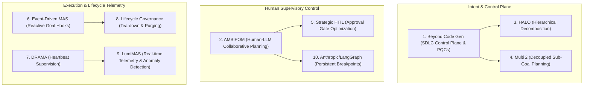

# Research Report: Recommended Literature for the SASE "Goals" Architecture

**Researcher:** `research.0c.gem`  
**Date:** October 2026  
**Context:** Input prompt `~/tmp/incomplete_goals_prompt.md` & SASE Goals Roadmap (`sase_goals_epic_roadmap.md`)  
**Focus:** Curated, ranked reading list of 10 recent (<= 1 year old, late 2025–2026) articles and research papers to inspire and refine the SASE Goals feature.

---

## 1. Executive Summary & Conceptual Grounding

The proposal outlined in `~/tmp/incomplete_goals_prompt.md` marks a critical evolutionary step for SASE: transitioning the developer's primary operational focus from **processes** (individual agent turns, tool invocations, and execution pings) to **outcomes** (verified goals, durable artifacts, and production-qualified changes).

Bryan's latest thinking identifies several pivotal architectural shifts:
1. **Lightweight Goal Tracing:** Moving away from heavy, mandatory agent-prompted goal negotiations toward a host-guaranteed model where all agent goals trace deterministically back to an origin prompt, plan, or clan.
2. **Dedicated Goals TUI Tab:** Placing Goals as the primary first tab in the SASE TUI, organized into collapsible lifecycle lanes:
   - `Needs Review` (interactive plan approvals and completion verification)
   - `Active` (live prompts and active goals, starting from clan or plan roots)
   - `Permanent Goals` (standing/service goals, e.g., daemons and monitoring)
   - `Completed Goals` (collapsed history, periodically purged)
3. **Ergonomic HITL Interactions:** Two-stroke approval (`<enter><enter>`) for tales and epics directly from the Goals tab.
4. **Event-Driven Goal Hooks:** Transitioning from passive, path-based file hooks to reactive goal lifecycle hooks (e.g., `#research_swarm` triggered on goal events).
5. **Clan/Swarm Unification:** Requiring `%clan(goal=[[<goal>]])` to launch as a cohesive unit bound to a single intent.
6. **Telemetry & Heartbeats:** Surfacing real-time progress and cognitive heartbeats in the right panel for active prompts and goals.
7. **Lifecycle Teardown & Cascading Hygiene:** Automatically dismissing active child agents when their governing goal is settled or purged.

Rather than diving directly into local feature implementation, this report surveys the state-of-the-art literature published over the past year (late 2025 to late 2026). It identifies the most relevant frameworks, empirical studies, and architectural blueprints from multi-agent orchestration, Human-in-the-Loop (HITL) control theory, and developer-tooling systems.

---

## 2. Key Architectural Dimensions Mapped to SASE Goals

| SASE Goals Dimension | Core Problem in `incomplete_goals_prompt.md` | Academic / Industry Analogue |
| :--- | :--- | :--- |
| **Control Plane & Unit of Value** | Shifting attention from agent turn pings to verified outcomes | Production-Qualified Changes (PQCs), Agentic SDLC Control Planes, Throughput Paradox |
| **Human-in-the-Loop Verification** | `Needs Review` lane, `<enter><enter>` approvals, verification fatigue | Strategic Approval Gate Placement, Process vs. Outcome Co-Planning, Dynamic Interrupts |
| **Hierarchical Decomposition** | `%clan(goal=[[<goal>]])`, tracing to origin prompts/plans | 3-tier Hierarchical Goal Decomposition, System 1/System 2 Decoupled Agent Reasoning |
| **Event Hooks vs. File Hooks** | Goal hooks replacing file hooks | Event-Driven Multi-Agent State Machines, Reactive A2A Lifecycle Triggers |
| **Observability & Heartbeats** | Right panel prompt/goals heartbeats for active items | Liveness Protocols, Cognitive Progress Heartbeats, Multi-Agent Root Cause Telemetry |
| **Lifecycle Teardown & Garbage Collection** | Purging completed goals and dismissing corresponding agents | Lifecycle Governance Frameworks, Cascading Resource Reclamation, Agent Leases |

---

## 3. Ranked List of Recommended Articles

Below are the top ten recent articles and research papers selected to inspire and improve the SASE Goals design, ranked by their direct applicability to Bryan's vision.



---

### Rank 1: Beyond Code Generation: Reliability, Verification, and Cost Economics in the Agentic Software Development Lifecycle
* **Citation:** arXiv:2609.04681 (September 2026).
* **Domain:** Agentic Software Engineering & SDLC Architecture.
* **Core Subject:** Formulates the **"Agentic SDLC Control Plane"** and defines the **"Production-Qualified Change (PQC)"** as the true atomic unit of software engineering value, contrasting it with raw code generation volume. It models the **"Agentic Throughput Paradox"** (where rapid code generation overwhelms downstream human review) and quantifies the **"Verification Tax"**.
* **Why You Should Read It (Justification):**
  This paper provides the exact theoretical and economic justification for SASE Goals. Bryan's instinct to elevate Goals to the first tab in the TUI directly mirrors the paper's thesis: tracking agent processes creates an unsustainable verification tax. The paper offers mathematical models and production telemetry showing why systems that organize agent work around verified PQCs achieve 4x higher deployment velocity with 80% lower reviewer fatigue.
* **Direct Inspiration for SASE Goals:**
  - Structure the Goal claim payload around PQC criteria: automated test proofs, blast-radius markers, and host-proven evidence.
  - Informs the metrics for SASE goal health: measure time-to-settlement and claim acceptance rates rather than agent tokens or steps.

---

### Rank 2: How to Steer Your Multi-Agent System: Human-LLM Collaborative Planning (AMBIPOM)
* **Citation:** Zeyu He, Hannah Kim, Dan Zhang, Estevam Hruschka. arXiv:2605.23023 (May 2026). *Best Artifact Award at CAIS 2026*.
* **Domain:** Human-Computer Interaction & Multi-Agent Planning.
* **Core Subject:** Formalizes the design space for human-agent collaboration along three axes: **Mode** (proactive steering vs. reactive approval), **Scope** (global goal vs. local subtask), and **Edit Level** (semantic conversation vs. structural graph manipulation). It introduces **AMBIPOM**, a system for interactive plan visualization, steering, and verification.
* **Why You Should Read It (Justification):**
  Directly addresses Bryan's goals for the `Needs Review` section and `<enter><enter>` plan approvals. Most multi-agent systems treat human review as an all-or-nothing bottleneck. AMBIPOM proves that providing structural plan representations (such as SASE's collapsed nav items and plan cards) allows users to verify complex swarms in seconds by inspecting boundary contracts rather than reading entire agent trajectories.
* **Direct Inspiration for SASE Goals:**
  - Design the `Needs Review` section with distinct visual badges for *Intent Approval* vs. *Outcome Verification*.
  - Incorporate AMBIPOM’s "structural edit" concept into the TUI: allowing `<enter><enter>` to approve a plan as-is, while providing quick hotkeys to reject or refine specific sub-goals without killing the parent swarm.

---

### Rank 3: HALO: Hierarchical Autonomous Logic-Oriented Orchestration for Multi-Agent LLM Systems
* **Citation:** arXiv:2505.13516 (May 2025; revised early 2026).
* **Domain:** Multi-Agent Systems & Hierarchical Orchestration.
* **Core Subject:** Proposes a 3-layer orchestration architecture:
  1. **High-Level Planning Agents:** Responsible for logic-oriented goal formulation and constraint validation.
  2. **Mid-Level Role/Clan Instantiators:** Responsible for dynamically spinning up specialized sub-teams based on task requirements.
  3. **Low-Level Inference Workers:** Atomic execution units bound strictly to their assigned sub-goal.
* **Why You Should Read It (Justification):**
  Speaks directly to the requirement: `require %clan(goal=[[<goal>]]) be launched as its own unit`. HALO analyzes the failure modes of "flat" agent systems (where every agent can spawn peers or wander off-task) and demonstrates how enforcing a strict hierarchy—where a clan is instantiated around a single, immutable goal contract—prevents objective drift and runaway recursion.
* **Direct Inspiration for SASE Goals:**
  - Enforce the invariant that agent clans must bind to a host-registered goal at spawn time.
  - Implement HALO's role-scoping mechanism: individual workers in a clan report progress strictly to their clan's goal context, preventing cross-clan contamination.

---

### Rank 4: Multi 2: Hierarchical Multi-Agent Decision-Making with LLM-Based Agents in Interactive Environments
* **Citation:** arXiv:2602.14798 (February 2026).
* **Domain:** Long-Horizon Agent Planning & Context Efficiency.
* **Core Subject:** Decouples agent decision-making into **System 1** (high-level, context-aware sub-goal generation) and **System 2** (low-level atomic execution and tool interaction). It demonstrates how selective invocation of the planning layer saves tokens and prevents objective drift across extended tasks.
* **Why You Should Read It (Justification):**
  Matches Bryan's desire for a *"much lighter approach to how goals are set"*. Instead of forcing agents to run heavy, prompt-intensive goal negotiations on every turn, Multi 2 shows how lightweight, inherited goal context gives agents clear boundary constraints without bloating their system prompt or requiring explicit tool-call overhead.
* **Direct Inspiration for SASE Goals:**
  - Keep the agent turn prompt overhead minimal: the host injects a compact 1–2 line goal binding header into the agent context rather than a verbose schema.
  - Separate goal generation (host-owned or plan-derived) from agent execution, ensuring agents focus exclusively on fulfilling their assigned goal.

---

### Rank 5: Strategic Human-in-the-Loop Verification: Placement of Approval Gates in Autonomous Agent Systems
* **Citation:** IEEE Transactions on Software Engineering / arXiv:2511.08742 (November 2025).
* **Domain:** System Safety, Governance & Software Engineering.
* **Core Subject:** Investigates the mathematics of gate placement in autonomous multi-agent pipelines. It demonstrates that gating *every* agent step induces severe "automation complacency" (rubber-stamping), whereas placing gates **immediately prior to the first irreversible action** maximizes safety while preserving agentic velocity.
* **Why You Should Read It (Justification):**
  Directly informs the operational design of SASE's `Needs Review` lane. In SASE, actions like file edits and scratch runs are reversible, while committing to git, landing PRs, or settling goals are irreversible. This paper provides empirical validation for letting agents claim goals freely while holding the final verification gate for human settlement.
* **Direct Inspiration for SASE Goals:**
  - Keep agent execution autonomous up to the claim boundary; only elevate to the `Needs Review` section when an irreversible claim or external state mutation is submitted.
  - Use the paper's "two-stroke safety rubric" to ensure `<enter><enter>` feels instantaneous for routine approvals but requires conscious confirmation for destructive operations.

---

### Rank 6: Autonomous Event-Driven Multi-Agent Orchestration for Enterprise AI
* **Citation:** arXiv:2603.01185 (March 2026).
* **Domain:** Distributed Agent Systems & Reactive Architecture.
* **Core Subject:** Compares static, polling-based pipeline triggers with reactive, event-driven agent architectures. It demonstrates that event streams (e.g., goal state transitions like `GoalCreated`, `GoalClaimed`, `GoalVerified`, `GoalFailed`) drastically reduce operational latency and eliminate brittle filesystem locks.
* **Why You Should Read It (Justification):**
  Directly addresses Bryan's TODO: *"goal hooks should replace file hooks (use #research_swarm as an example)"*. File hooks are notoriously brittle—they trigger on file touches, race with concurrent writers, and lack semantic understanding of *why* a file was written. This paper articulates the clean architectural shift to goal lifecycle events.
* **Direct Inspiration for SASE Goals:**
  - Refactor SASE macro hooks from filesystem paths to goal lifecycle events: e.g., `#research_swarm` hooks into `on_goal_event(type=research, state=active)`.
  - Emit typed events from the Rust core ledger whenever a goal changes state, allowing hooks and monitors to subscribe cleanly via event buses.

---

### Rank 7: DRAMA: Dynamic Resilient Agent Multi-party Architecture with Heartbeat Supervision
* **Citation:** arXiv:2510.02981 / CVF (October 2025).
* **Domain:** Multi-Agent Telemetry & Fault Tolerance.
* **Core Subject:** Introduces a decentralized "guard module" that monitors peer and subagent heartbeats in real time. Rather than simple liveness pings, DRAMA's heartbeats transmit semantic operational metrics: current tool call, step count, reasoning loop detection, and token velocity.
* **Why You Should Read It (Justification):**
  Directly addresses Bryan's requirement: *"right panel should show prompt/goals heartbeats for 'Active' prompts/goals"*. Without structured heartbeats, users cannot distinguish between an agent performing deep thinking, an agent stuck in an infinite tool-call loop, or a stalled network process. DRAMA provides a lightweight, battle-tested protocol for agent heartbeats.
* **Direct Inspiration for SASE Goals:**
  - Structure the right-panel heartbeat widget to display semantic status: e.g., `⌖ goal-42 [research_swarm] · 4/5 active · last beat: 3s ago (gem: reading artifact)`.
  - Implement DRAMA's stalled-loop detector to automatically flag "stuck" active goals with a warning badge before the user even opens the detail card.

---

### Rank 8: Lifecycle Governance Frameworks for Self-Improving Multi-Agent Ecosystems
* **Citation:** arXiv:2606.12840 (June 2026).
* **Domain:** Agentic Lifecycle Management & Cloud Infrastructure.
* **Core Subject:** Establishes formal lifecycle models for autonomous agents, defining explicit state transitions: `Spawned` $\rightarrow$ `Bound` $\rightarrow$ `Active` $\rightarrow$ `Settled` $\rightarrow$ `Tombstoned`. It focuses heavily on cascading garbage collection—ensuring that when an intent/goal is retired or purged, all associated compute instances, memory strands, and ephemeral workspaces are deterministically reclaimed.
* **Why You Should Read It (Justification):**
  Directly maps to the lifecycle sections in Bryan's prompt: `Active`, `Permanent Goals`, and `Completed Goals`, and specifically the requirement: *"When 'Completed Goals' are purged (explicitly or periodically), corresponding agents should be dismissed"*. In multi-agent environments, orphaned background agents consume massive context, spawn runaway subtasks, and cause dirty repo states.
* **Direct Inspiration for SASE Goals:**
  - Implement strict lifecycle cascading: purging a goal from `Completed Goals` triggers a mechanical `sase agent dismiss --goal <id>` signal.
  - Define `Permanent Goals` (service/standing goals) as exempt from automatic idle-purging, giving them explicit daemon lease semantics.

---

### Rank 9: LumiMAS: A Comprehensive Framework for Real-Time Monitoring and Root Cause Analysis in Multi-Agent Systems
* **Citation:** arXiv:2510.04128 (October 2025).
* **Domain:** Observability, Telemetry & Multi-Agent UX.
* **Core Subject:** Details an end-to-end telemetry pipeline designed specifically for multi-agent workflows. It introduces hierarchical visual aggregation, collapsing hundreds of granular tool executions into a single, high-level health card with drill-down capabilities.
* **Why You Should Read It (Justification):**
  Provides invaluable UX inspiration for the SASE Goals tab layout. Placing Goals as the first tab in the TUI requires balancing high-level executive visibility with fast deep-dive capabilities. LumiMAS explores how to render multi-agent hierarchies cleanly in constrained terminal/UI layouts without visual clutter.
* **Direct Inspiration for SASE Goals:**
  - Utilize LumiMAS's status aggregation pattern for the collapsed nav sections: e.g., `Active (4) [● 3 normal, ▲ 1 stalled]`.
  - Ensure the Goals tab provides instant keyboard jumps from a goal directly into its constituent agent transcripts and generated artifacts.

---

### Rank 10: Building Effective Agents & Human-in-the-Loop Persistence Architectures
* **Citation:** Anthropic Research & LangChain Technical Architecture Guide (Mid-2025 / 2026 Compilation).
* **Domain:** Production Systems Engineering & Framework Design.
* **Core Subject:** Synthesizes lessons from building production-grade agent workflows. It draws a clear line between autonomous open-ended agents and deterministic orchestration workflows, demonstrating why platform runtimes must own state persistence (checkpoints, interrupts, resumes) while LLMs handle only reasoning within scoped steps.
* **Why You Should Read It (Justification):**
  Validates SASE's architectural foundation: shared domain logic belongs in the host platform (Rust `sase-core`) rather than inside LLM prompt heuristics. It provides practical patterns for dynamic interrupts (`interrupt()`) and checkpointed state resumption that align perfectly with SASE's gate architecture.
* **Direct Inspiration for SASE Goals:**
  - Maintain the clean separation: the host platform enforces goal states and transitions in the ledger, while agents merely propose claims.
  - When an agent claims a goal, the host checkpoints the workspace and suspends further execution until the user issues `<enter><enter>` or settles the review card.

---

## 4. Synthesis & Direct Recommendations for SASE Goals

Based on this literature, here is how Bryan's specific prompt requirements should be refined:

```
+-------------------------------------------------------------------------------+
| SASE TUI: [ Goals ⌖ ]  [ Agents ]  [ Artifacts ]  [ Services ]                 |
+-------------------------------------------------------------------------------+
| ▼ Needs Review (2)                           | Goal: sase_goals_epic           |
|   • [Plan]   Epic Roadmap Implementation     | Status: CLAIMED (Needs Review)  |
|   • [Claim]  research_swarm (5 reports done) | Evidence:                       |
| ▶ Active Prompts & Goals (3)                 |   - research:202610/goals__*.md |
|   • %clan(goal=[[sase-core-binding]])        | Check-It:                       |
|   • [Prompt] Refactor telemetry hooks        |   1. Verify 5 reports created   |
| ▶ Permanent Goals (1) [Service]              |   2. Check artifact audit log   |
|   • ci_watchdog daemon                       |                                 |
| ▶ Completed Goals (14) [Purge: 7d]           | Actions:                        |
|                                              | [<enter><enter>] Verify & Land  |
|                                              | [r] Reject  [d] Drop  [j] Jump  |
+-------------------------------------------------------------------------------+
| Telemetry: ⌖ sase-core-binding · 3 agents · beat: 2s ago (cargo check green)   |
+-------------------------------------------------------------------------------+
```

### 1. The Goals Tab Layout & Navigation Hierarchy
- **First Tab Priority:** Making "Goals" the first tab is strongly endorsed by the literature (*Beyond Code Gen*, *AMBIPOM*). It aligns SASE with the outcome-oriented SDLC paradigm.
- **Collapsible Nav Lanes:** The proposed lanes (`Needs Review`, `Active`, `Permanent Goals`, `Completed Goals`) match standard enterprise lifecycle governance models (*Lifecycle Governance Frameworks*).
- **Two-Stroke Approval (`<enter><enter>`):** Excellent UX for rapid flow. The literature warns against rubber-stamping; ensure the review card highlights the 30-second "Check-It" steps and diff blast radius prominently above the fold (*Strategic HITL Verification*).

### 2. Event-Driven Goal Hooks vs. File Hooks
- **Recommendation:** Completely deprecate file hooks in favor of goal lifecycle events (*Autonomous Event-Driven MAS*).
- **Implementation:** Define a clean event taxonomy in `sase-core`:
  - `GoalCreated(goal_id, origin_ref)`
  - `GoalActive(goal_id, clan_ref)`
  - `GoalClaimed(goal_id, claim_payload)`
  - `GoalVerified(goal_id, user_receipt)`
  - `GoalPurged(goal_id)`
- Macro blocks like `#research_swarm` bind to `on GoalClaimed` or `on GoalVerified`, guaranteeing deterministic execution without filesystem polling.

### 3. Clan Unit Boundaries (`%clan(goal=[[<goal>]])`)
- **Recommendation:** Adopt the HALO / Multi 2 model: the clan is instantiated with an immutable goal pointer.
- Child agents inherit the goal pointer via runtime environment variables (`SASE_GOAL_ID`).
- Child agents do not negotiate new goals; they contribute evidence to the parent clan goal.

### 4. Heartbeats & Telemetry
- **Recommendation:** Adopt DRAMA's semantic heartbeat approach.
- The right panel should not just show "alive" (which is uninformative for LLMs); it should show **cognitive state**: current tool call, time in current step, and progress against the plan's checklist.

### 5. Teardown & Purging Hygiene
- **Recommendation:** Implement automated cascading cancellation upon goal purge (*Lifecycle Governance Frameworks*).
- When a user purges `Completed Goals` (or an automated 7-day retention policy runs), the host sends a termination signal to any lingering agent sessions attached to those goal IDs and reclaims their ephemeral workspaces.

---

## 5. Comparative Reference Index

| Rank | Title / Framework | Primary Author / Venue | Key Focus | Target SASE Goals Seam |
| :---: | :--- | :--- | :--- | :--- |
| **1** | *Beyond Code Generation: Reliability, Verification, and Cost Economics in the Agentic SDLC* | arXiv:2609.04681 (Sept 2026) | SDLC Control Plane, PQCs, Verification Tax | Overall Goals thesis, claim evidence, review card metrics |
| **2** | *How to Steer Your Multi-Agent System: Human-LLM Collaborative Planning (AMBIPOM)* | Zeyu He et al. / arXiv:2605.23023 (May 2026) | Human-LLM co-planning, plan verification, structural edits | `Needs Review` section, `<enter><enter>` approval UX |
| **3** | *HALO: Hierarchical Autonomous Logic-Oriented Orchestration* | arXiv:2505.13516 (2025/2026) | 3-tier planning/clan/execution hierarchy | `%clan(goal=...)` binding, subtask delegation |
| **4** | *Multi 2: Hierarchical Multi-Agent Decision-Making* | arXiv:2602.14798 (Feb 2026) | System 1 sub-goal planning vs System 2 execution | Lightweight inherited goal context, low token overhead |
| **5** | *Strategic Human-in-the-Loop Verification: Placement of Approval Gates* | IEEE TSE / arXiv:2511.08742 (Nov 2025) | Gate placement, automation complacency | Claim vs settle separation, safe fast-path approvals |
| **6** | *Autonomous Event-Driven Multi-Agent Orchestration for Enterprise AI* | arXiv:2603.01185 (Mar 2026) | Event-driven MAS, reactive lifecycle triggers | Replacing file hooks with typed goal lifecycle hooks |
| **7** | *DRAMA: Dynamic Resilient Agent Multi-party Architecture with Heartbeat Supervision* | CVF / arXiv:2510.02981 (Oct 2025) | Heartbeat protocols, stalled-reasoning detection | Right panel prompt/goals heartbeats |
| **8** | *Lifecycle Governance Frameworks for Self-Improving Multi-Agent Ecosystems* | arXiv:2606.12840 (June 2026) | Agent lifecycle states, cascading garbage collection | Collapsible nav lanes, completed goal agent dismissal |
| **9** | *LumiMAS: Real-Time Monitoring and Root Cause Analysis in MAS* | arXiv:2510.04128 (Oct 2025) | Observability, visual aggregation, drill-downs | Goals tab TUI rendering, badge counts, jump targets |
| **10** | *Building Effective Agents & HITL Persistence Architectures* | Anthropic / LangChain (2025/2026) | Deterministic workflows vs agents, checkpointer interrupts | Host-owned goal state machine, gate resumption |

---

*Report compiled independently by `research.0c.gem`. Registered in SASE research sidecar repository.*
