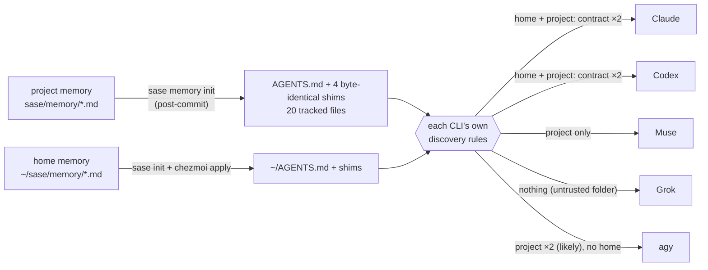
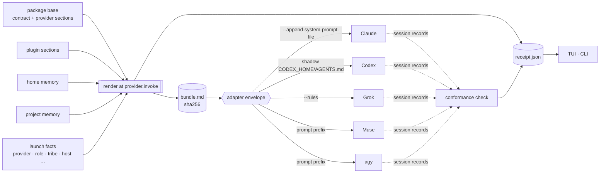
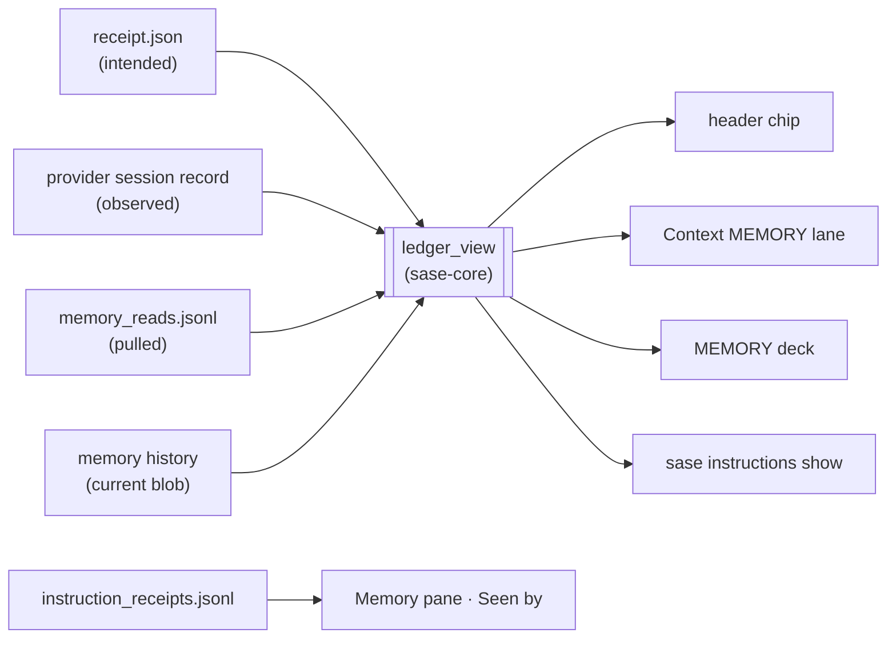

# Memory-Built Agent Instructions: What Each Provider Gets, and How You See It

**Date:** 2026-10-05 · **Builds on:**
`research:202610/sase_md_instruction_delivery/sase_md_instruction_delivery.md` (the
"prior report") · **sase checkout:** `1765b289be` · **CLIs:** Claude Code 2.1.289,
codex-cli 0.160.0, grok 1.0.46, Muse 1.4.2, agy 1.2.17

> **Questions:** (1) Once the prior report's recommendations ship, how exactly does each
> provider end up with the same (or better) instructions than today? (2) How do we track
> which memory was preloaded or injected for each SASE agent, and what is the best TUI
> experience for seeing it?

## Bottom line

1. **One bundle, many envelopes.** Right before each `provider.invoke`, SASE renders one
   Markdown **bundle** from memory. The shared sections are byte-identical for every
   provider. Only a small provider section differs: it holds today's adapter directive.
   What differs per provider is the *envelope*, meaning the channel that carries the
   bundle into the model's context. Today the content is already shared, but the envelopes
   are accidental: each CLI finds files by its own rules. So Grok gets nothing, Claude and
   Codex get the contract twice, and Muse and Grok miss the home layer.
2. **No provider gets less of what matters.** Grok goes from nothing to everything.
   Claude and Codex lose a duplicate contract (about 790 tokens) and a contradictory
   repository list. Muse and agy gain the home layer, and agy loses its likely double
   load. Two things get *narrower* and must be measured:
   - Claude's lazy loading of nested `AGENTS.md` files becomes a path trigger.
   - For Muse and agy, the bundle rides in the user message, because they have no
     system-prompt channel.
3. **Tracking is an instruction receipt.** Every invocation writes a receipt: which
   sections, from which memory notes, at which blob versions, delivered through which
   envelope, and what the provider's own session record shows actually arrived. Joining
   the receipt with the `memory_reads.jsonl` audit log that already exists gives a
   per-agent **memory ledger**. Each memory subject is listed as *inlined*, *offered*,
   *offered → read*, *read without a trigger*, *withheld*, or *foreign*.
4. **The TUI gives you four levels of detail.** They go from a quick glance down to the
   exact text:
   - an identity-header chip that stays quiet when delivery is correct and turns loud
     when it is wrong;
   - the existing Context-card MEMORY lane, upgraded;
   - a new **MEMORY deck** (`p` `y`) with **Receipt**, **Ledger**, and **Bundle** cards;
   - the memory-history pager, pinned to the exact version the agent saw.

   The Memory pane also gains a reverse view, **Seen by**.
5. **Build the meter before the engine.** Receipts can ship first in *observed* mode,
   reading today's provider records. The TUI then shows Claude and Codex's duplicate
   contract and Grok's empty context, and it shows the migration fixing each provider as
   that provider's flag flips.

## 1. Today vs. after

**Today:** files are generated ahead of time, and each CLI discovers them by its own
rules.



**After:** a bundle is rendered for each invocation, and each adapter delivers it
exactly once.



## 2. What "the same instructions" means: anatomy of a bundle

A bundle is an ordered list of **sections**. Each section has a stable id and a recorded
source. The table below is one Codex agent's bundle in the `sase` project. Token counts
come from `sase memory list` on this checkout.

```
┌─ bundle 7f3a91c · ≈4.6k tok ────────────── facts: provider=codex role=root host=athena ─┐
│ section              source                                        who gets it          │
│ ──────────────────── ───────────────────────────────────────────── ──────────────────── │
│ pkg.contract         package base (replaces both sase.md notes)    every agent          │
│ pkg.provider.codex   today's codex developer_instructions text     provider=codex only  │
│ pkg.repos            project + home repo config, one list, scoped  every agent          │
│ plugin.github        sase-github VCS rules                         vcs=github           │
│ home.refs            ~/sase/memory: obsidian, tailnet → triggers   every agent          │
│ proj.core            gotchas, rust_core_backend_boundary (inline)  every agent          │
│ proj.refs            cli_rules … tui → 10 triggers                 every agent ¹        │
│ proj.webs            decisions, glossary, task_types descriptors   every agent ¹        │
│ launch               bead / epic context, phase-worker rule        when facts match     │
└─────────────────────────────────────────────────────────────────────────────────────────┘
 ¹ R9 from the prior report: hard rules and baseline triggers are unconditional. A `when:`
   can only add text, or drop optional text for an audience.
```

So "same instructions" has a precise meaning. For a given agent, every provider would
receive the **same common bytes**, recorded as a `common_digest` that excludes
provider-conditional sections. Only the `pkg.provider.*` section differs. This holds in
Phase 1. Phase 3 audiences then vary content by *role* or *tribe*, never by provider.

Two contradictions disappear by construction. Today the contract exists twice:
`~/sase/memory/sase.md` (820 tokens) and `sase/memory/sase.md` (1,097 tokens). The two
copies even disagree on the linked-repository list (`chezmoi` versus six `sase-*`
repos). After the change, the contract is one package section, and the repository list
is one rendered list with each entry labeled by scope.

## 3. Provider by provider: what lands in the context window

In the diagrams below, `[B]` is the bundle, `░` marks a duplicate SASE copy, and `—`
means nothing.

### Claude (25% of runs)

```
                TODAY                                       AFTER
system prompt   Claude Code base                            Claude Code base
                + single-turn directive                     + [B] via --append-system-prompt-file
                                                              (directive is now section pkg.provider.claude)
first user msg  ~/CLAUDE.md  home + contract v1   3.9 KB    —  (claudeMdExcludes in --settings hides
 (instructions  ./CLAUDE.md  project + contract v2░ 17.3 KB     ~/CLAUDE.md and any ./CLAUDE.md)
  attachment)   MEMORY.md    Claude auto-memory    1.4 KB    MEMORY.md  (foreign; decide keep/disable)
subagents       full CLAUDE.md, incl. "use /sase_final" ✗    role=subagent render, no /sase_final  [verify]
nested files    lazy native load: tools/, src/sase/ace/, …  path triggers in [B] for every provider
```

The bytes in the left column are from a 2026-09-30 SASE Claude transcript in this
workspace. Its `instructions` attachment lists exactly those three files.

- **Better:**
  - The contract arrives once, with one repository list.
  - Instructions move from a user-message attachment into the system prompt.
  - Subagents stop being told to run `/sase_final`.
- **Watch:**
  - With `--resume`, Claude reuses its recorded system prompt (`--system-prompt-snapshot`
    is on by default) until compaction. A wait-continuation therefore *inherits* the
    first render, and the receipt should record the continuation as `inherited`.
  - The documented subagent channel (`--append-subagent-system-prompt-file`) does not
    appear in the 2.1.289 `--help` output. Verify that it exists before excluding
    `CLAUDE.md`. If it doesn't, fall back to `--agents` definitions.

### Codex (31%)

```
                TODAY                                       AFTER (end state: R7, files untracked)
developer       single-turn directive                       single-turn directive (or folded into [B])
user msg #0     "# AGENTS.md instructions for <cwd>"        "# AGENTS.md instructions for <cwd>"
                <INSTRUCTIONS> ~/AGENTS.md (home+contract)  <INSTRUCTIONS> shadow $CODEX_HOME/AGENTS.md = [B]
                --- project-doc --- ./AGENTS.md (proj+░)    --- project-doc --- only a foreign repo's own file

                INTERIM ("complement mode", before R7)
                <INSTRUCTIONS> shadow-home AGENTS.md = [B] minus sections the native ./AGENTS.md carries
                --- project-doc --- ./AGENTS.md (still tracked, loads natively)
```

A 2026-10-01 rollout shows the left column exactly: one `--- project-doc ---` marker,
and "SASE Final Declaration" twice.

Codex is the one major provider that **cannot** turn off project `AGENTS.md` discovery,
which is why the prior report's R7 (untrack the generated files) exists. The bundle is
about 18–21 KB, under Codex's 32 KiB default cap; it should fail loudly if it ever grows
past that.

### Grok (13%)

```
                TODAY                                       AFTER
system prompt   Grok base                                   Grok base + [B] via --rules
                (no SASE directive at all)                    (includes pkg.provider.grok)
native files    none: workspace untrusted,                  none: stay untrusted, never pass --trust
                prompt_context.json agents_md_files: []       (trust would reload AGENTS.md + CLAUDE.md ×2)
```

This is the largest change for any provider. `grok.py` injects no directive, no rules,
and no trust flag today, so Grok runs with **neither** memory nor the single-turn
contract.

### Muse (29%)

```
                TODAY                                       AFTER
user msg        [single-turn prefix]                        [single-turn prefix + [B]]
                --- User Prompt --- <prompt>                --- User Prompt --- <prompt>
native files    ./AGENTS.md (via --trust-workspace)         none: drop --trust-workspace ² (or R7)
home layer      — (--no-foreign-personal-context)           in [B]
```

² This is new since the prior report. Muse 1.4.2 documents `--trust-workspace` as
"Load this workspace's skills and rules". SASE deploys Muse skills to `~/.config/muse`,
so dropping the flag may be enough to suppress the native load *before* R7. Verify that
nothing else depends on it.

### agy (0.9%), Qwen and OpenCode (about 0%)

- **agy:** today it gets a print-mode prefix plus native `GEMINI.md` and `AGENTS.md`,
  which is a likely double load, and no home layer. After R7 it gets one prefix that
  carries `[B]`, with no native files.
- **Qwen and OpenCode:** the plugin-hook default (a prompt prefix) is enough. Stop
  generating `OPENCODE.md`, which nothing ever reads.

### The numbers

The bars count SASE-owned, memory-derived instruction tokens that reach each provider.
Each character is about 200 tokens. Adapter directives are excluded on both sides.

```
                0    1k   2k   3k   4k   5k   6k   7k   8k   9k
Claude  today   ███████████████████████▒▒▒▒                     5.3k   0.8k of it duplicate
Codex   today   ███████████████████████▒▒▒▒                     5.3k   0.8k of it duplicate
Muse    today   ██████████████████████┄                         4.4k   home layer missing
agy     today   ██████████████████████▒▒▒▒▒▒▒▒▒▒▒▒▒▒▒▒▒▒▒▒▒▒┄   8.7k   likely ×2, home missing
Grok    today   ┄┄┄┄┄┄┄┄┄┄┄┄┄┄┄┄┄┄┄┄┄┄┄                         0      everything missing
every   after   ███████████████████████                         ≈4.6k  + provider section ≈0.1k
                █ unique content   ▒ duplicate copy   ┄ content that should arrive but doesn't
```

How the numbers were derived:

- The 4.4k project and 0.97k home figures are `sase memory list` approximate tokens for
  `AGENTS.md` and `~/AGENTS.md`.
- The 0.8k duplicate is cld's measurement, cited in the prior report.
- The after total is 4.4k + 0.97k − 0.8k ≈ 4.6k.
- The agy ×2 load is documented by the vendor but not independently verified.
- Home-only content is small (about 0.2k). It carries the tailnet and Obsidian triggers
  and the chezmoi repo rule, which matter on the runs that need them.

### Parity matrix

The same information as a table, today → after.

| Content | Claude | Codex | Muse | Grok | agy |
| --- | --- | --- | --- | --- | --- |
| Runtime contract | 2 → **1** | 2 → **1** | 1 → 1 | 0 → **1** | 2? → **1** |
| Single-turn directive | ✓ → ✓ (§) | ✓ → ✓ (§) | ✓ → ✓ (§) | ✗ → **✓** | ✓ → ✓ (§) |
| Home layer | ✓ → ✓ | ✓ → ✓ | ✗ → **✓** | ✗ → **✓** | ✗ → **✓** |
| Project core, triggers, webs | ✓ → ✓ | ✓ → ✓ | ✓ → ✓ | ✗ → **✓** | 2? → **1** |
| Repository list | 2 conflicting → **1** | 2 conflicting → **1** | 1 → 1 | ✗ → **✓** | 1 → 1 |
| Nested path rules | lazy native → trigger | ✗ → **trigger** | ✗ → **trigger** | ✗ → **trigger** | lazy → trigger |
| Channel | user msg → **system** | user msg → user msg | user msg → user msg | — → **system** | user msg → user msg |
| Provider-native memory (foreign) | auto-memory `MEMORY.md` | — | — | `memory_v2_enabled: true` | — |

§ means the directive now lives in the bundle's provider section. **Bold** marks an
improvement.

The last row is a gap neither report has addressed until now. Claude's auto-memory is
loaded into SASE Claude runs, and Grok reports `memory_v2_enabled: true` in its
`prompt_context.json`. These are private channels that SASE memory review never sees.
The ledger below lists them as **foreign** so they are at least visible. Whether to
disable them is a separate decision.

## 4. Tracking: receipts, conformance, and the ledger

### The receipt (one per invocation)

Every provider invocation gets its own receipt: the main turn, declaration recovery,
conflict repair, and an `A || B` fallback. The renderer writes it at `provider.invoke`,
and the conformance step completes it after the run.

```jsonc
// $SASE_ARTIFACTS_DIR/instructions/00-codex.json
{
  "schema": 1,
  "invocation": { "seq": 0, "kind": "turn", "provider": "codex", "model": "gpt-5.5" },
  "facts": { "provider": "codex", "role": "root", "tribe": "research", "host": "athena",
             "origin": { "tribe": "macro:#research_swarm" } },
  "bundle": { "sha256": "7f3a91c…", "common_digest": "6c02e1…", "bytes": 18742,
              "tokens": 4610, "budget": "ok", "store": "~/.sase/instruction_bundles/7f3a91c….md" },
  "sections": [
    { "id": "proj.core.gotchas", "kind": "inline",  "source": "sase/memory/gotchas.md",
      "scope": "project", "blob_oid": "a1b2…", "tokens": 68 },
    { "id": "proj.ref.tui",      "kind": "trigger", "source": "sase/memory/tui.md",
      "scope": "project", "blob_oid": "c3d4…" },
    { "id": "proj.ref.dispatch", "kind": "trigger", "status": "withheld",
      "reason": "when: not { role: [monitor] }" }
  ],
  "delivery": { "envelope": "codex_shadow_home", "mode": "complement",
                "complement_of": "AGENTS.md@e91f…", "suppressed_native": [] },
  "conformance": { "source": "codex rollout", "bundle_copies": 1,
                   "native_sase_files": [], "foreign": [], "status": "ok" }
}
```

Storage follows patterns that already exist:

- **Bundle text.** Bundles are stored content-addressed in `~/.sase/instruction_bundles/`,
  like today's `~/.sase/instruction_snapshots/<oid>`. Most agents share a handful of
  bundles, so this deduplicates well.
- **Glance summary.** A summary goes into `agent_meta.json` as
  `instructions: {sha, status, counts}`. `enrich_agent_from_meta` already loads that file
  for every node, so the header chip costs no extra I/O.
- **Reverse index.** One compact line per invocation is appended to
  `~/.sase/projects/<p>/instruction_receipts.jsonl`, holding the agent, the artifacts
  dir, and the section ids with their blob oids. This answers "who saw note X?" without
  scanning artifact directories. History scans of that kind are the root cause of the
  athena resource spikes, so they must be avoided.
- **Old runs.** The receipt replaces `capture_instruction_snapshot`. For runs from before
  receipts, the TUI keeps reading the old `instruction_snapshot` and shows the
  "AGENTS.md as launched" row.

### Conformance: what each provider lets us observe

| Provider | Session record | What it shows | Status |
| --- | --- | --- | --- |
| Claude | transcript `attachment.type = "instructions"` and `"prompt_snapshot"` | Exact loaded files (path and content), and the full system prompt text, so the bundle hash can be checked exactly | **Verified** (2026-09-30 transcript) |
| Codex | rollout user message `# AGENTS.md instructions for <cwd>` | `<INSTRUCTIONS>` block plus `--- project-doc ---` sections | **Verified** (2026-10-01 rollout) |
| Grok | `prompt_context.json` | `agents_md_files` (native loads); whether `--rules` text is recorded needs a probe | Partly verified |
| Muse | `session.jsonl` (already parsed by `_muse_session_usage.py`) | The first user message carries the prefix | Per the prior report |
| agy | none (trajectories don't record rules) | Nothing to compare | Show `◌ unverifiable`, never `✓` |

### The ledger: intended × observed × pulled

The ledger joins three sources: the receipt (what SASE intended to send), conformance
(what the provider shows it loaded), and `memory_reads.jsonl` (what the agent pulled
during the turn). The read log is already matched to agents by `artifacts_dir` in
`ace/tui/memory_reads.py`. The join yields one row per memory subject, in one of the
states below.

| Glyph | State | Meaning |
| :---: | --- | --- |
| `●` | inlined | The body was in the bundle (core note, web descriptor, package section) |
| `◇` | offered | Its trigger line was in the bundle, and the agent never read it |
| `◆` | offered → read | Trigger in the bundle, and the agent read it (time and reason shown) |
| `◈` | read, unlisted | Read with no trigger in the bundle, e.g. a strand, a child note, or a followed link |
| `○` | withheld | Dropped for this audience by `when:` or a budget, with the reason |
| `⊘` | foreign | Loaded natively but not SASE-owned (Claude auto-memory, an upstream repo's `AGENTS.md`) |
| `‼` | duplicate | Conformance saw a SASE section more than once |
| `↻` | changed since | The note's current blob differs from the version the agent saw |



The join belongs in `sase-core`, as an `instructions::ledger_view` sibling of the
`finalizer::run_view` that feeds the FINAL deck. A CLI or web view must report the same
states as the TUI, so it passes the core-memory litmus test. Python only renders.

## 5. TUI design

The mockups in this section are illustrative. Hashes, times, model names, version
numbers, and counts are placeholders. Glyphs and colors are proposals.

### Principles

1. **Quiet when correct, loud when wrong.** On most runs the only sign is a muted chip.
   Duplicates, empty deliveries, and fallbacks get color and a node-row glyph.
2. **Each level of detail answers one question:**
   - the chip answers "was delivery OK?";
   - the lane answers "what did it lean on?";
   - the deck answers "exactly what, and why?";
   - the pager answers "what did that note say *then*?".
3. **Show what the agent saw, at the version it saw.** Every row is pinned to a blob.
4. **Reuse existing verbs.** These are `p`+letter, `Ctrl+J`/`Ctrl+K` cards, `(`/`)`
   blocks, `[n]` hints, version pins, splits, and `Z` zoom. No new modal and no new tab.

### Level 1: the identity-header chip and node rows

The chip goes on row 2 of the compact identity header, next to the tool-runs chip
(`_identity_header_compact.py`):

```
 codex · gpt-5.5 · 3 turns · auto                                        athena
 #research_swarm · ⚒ 4 runs · ❖ 4.6k · 9 in · 3/12 read · ✓1×
```

| Chip tail | Color | Meaning |
| --- | --- | --- |
| `✓1×` | muted green | Bundle observed exactly once, and no native SASE file loaded |
| `‼2×` | red | A SASE section arrived twice (today's Claude and Codex) |
| `∅` | red | Nothing delivered or observed (today's Grok) |
| `⟲ lkg` | amber | A render failed, so the last-known-good bundle was delivered |
| `◌` | grey | The provider can't be observed (agy) |

Node rows get a trailing `‼` or `∅` **only** on those red states. They join the existing
trailing glyphs in `format_agent_option` and must be added to `agent_render_key`.

### Level 2: the Context card MEMORY lane (exists today)

The lane's header becomes the ledger summary. Its launch row, today
"launch ◇ AGENTS.md", becomes the receipt line, and the read rows stay as they are:

```
 MEMORY  9 inlined · 12 offered · 3 read (2 offered, 1 unlisted) · 1 withheld
   launch ❖ bundle 7f3a91c · codex shadow home · ✓ once                          [4]
   10:44 ◆ tui.md → tui_perf.md      code   v3 · 5d    "before changing nav"     [5]
   10:47 ◈ glossary:stitch           code   v2 · 1mo   "need stitch vocabulary"  [6]
   10:58 ◆ lint_and_test.md          code   v18 · 2d   "before finishing turn"   [7]
```

`[4]` opens the MEMORY deck. The other hints keep their current behavior: they open the
pager at the pinned version.

### Level 3: the MEMORY deck (`p` `y`)

This is a fifth deck after MAIN, FILES, TOOLS, and FINAL. Its settings:

- **Name and key:** `MEMORY`, glyph `❖`, blurb "What this agent was told and looked
  up". The picker key is **`y`**: `m` is taken, every letter except `j k q p m f t n` is
  free, and `y` closes "memor**y**".
- **Model:** FINAL is the template to copy. It loads off-thread, has a no-I/O
  availability probe, and has an exhaustive `match` arm in each deck switch.
- **Layout:** three cards. They spread on one page when they fit and page otherwise, as
  every deck does.

**Card 1, Receipt: was it delivered right?** It holds one block per invocation, stepped
with `(` and `)`:

```
╭─ ❖ MEMORY · Receipt ─────────────────────────────────────────────────── 1/3 ─╮
│ INVOCATION  1 of 2 · turn · codex gpt-5.5 · 10:42:07          ( ) invocations│
│ BUNDLE      7f3a91c · common 6c02e1 · 4.6k tok / 18.7 KB · budget ✓          │
│ AUDIENCE    provider=codex  role=root  tribe=research ← #research_swarm      │
│             phase_worker=no  commit_method=pr  vcs=github  host=athena       │
│ ENVELOPE    shadow $CODEX_HOME/AGENTS.md · complement of ./AGENTS.md@e91f    │
│ OBSERVED    ✓ bundle once · native SASE files 0 · foreign 0                  │
│             codex rollout 2026-10-05T10-42-07                            [3] │
│ ▁▁ turn ✓ ▁▁ recovery ✓                                                      │
╰──────────────────────────────────────────────────────────────────────────────╯
```

**Card 2, Ledger: what did it know, and what did it use?**

```
╭─ ❖ MEMORY · Ledger ────────── 9 inlined · 12 offered · 3 read · 1 withheld ──╮
│ PACKAGE  sase (packaged base)                                                │
│  ●  runtime contract                                       1.1k              │
│  ●  provider: codex                                        0.1k              │
│ HOME  ~/sase/memory                                                          │
│  ◇  tailnet.md                    v6 · 3w     trigger                    [8] │
│  ◇  obsidian.md                   v4 · 2mo    trigger                    [9] │
│ PROJECT  sase/memory                                                         │
│  ●  gotchas.md                    v12 · 4d    68                        [10] │
│  ●  rust_core_backend_boundary    v5 · 9d     242                       [11] │
│  ●  decisions  (web · 24 strands) v31 · 1d ↻  1.7k                      [12] │
│  ◆  lint_and_test.md              v18 · 2d    read 10:58                [13] │
│  ◆  tui.md                        v3 · 5d     read 10:44                [14] │
│  ◈   └ tui_perf.md                v7 · 5d     read 10:44 · via link     [15] │
│  ◈  glossary:stitch               v2 · 1mo    read 10:47 · no trigger   [16] │
│  ◇  cli_rules.md, macros.md, … 6 more offered, unread                        │
│  ○  dispatch.md                   withheld    when: not role=monitor         │
│ FOREIGN                                                                      │
│  ⊘  none                                                                     │
│ ● inlined ◇ offered ◆ offered→read ◈ unlisted ○ withheld ⊘ foreign ↻ changed │
╰──────────────────────────────────────────────────────────────────────────────╯
```

Every `[n]` hint opens the memory-history pager pinned to the version the agent saw.
These pins already exist for reads (`MemoryVersionPin`). On a `↻` row, the pager opens
already comparing that version with now. This answers the most common debugging
question, "did it misbehave because it saw an old rule?", in two keystrokes.

**Card 3, Bundle: exactly what bytes did it see?** This is the stored render, with a
gutter showing each section's id. Deck search (`/`) and `Z` zoom work as they do on the
Reply card.

```
╭─ ❖ MEMORY · Bundle 7f3a91c · exact bytes delivered ──────────────────────────╮
│ pkg.contract    │ # SASE runtime contract                                    │
│                 │ Before any normal response that ends this SASE provider    │
│                 │ turn, use your /sase_final skill as the last action. …     │
│ pkg.repos       │ ## Repositories                                            │
│                 │ - sase-github (project): GitHub VCS and workspace provider │
│                 │ - chezmoi (home): dotfiles and global SASE config          │
│ proj.core.gotc… │ ## Code Conventions and Gotchas                            │
╰──────────────────────────────────────────────────────────────────────────────╯
```

**Containers answer "did they all get the same thing?"** On a clan or tribe summary
node, such as a research swarm spread across providers, the Receipt card becomes an
**audience strip**. When every member shares one `common_digest`, they received the same
instructions; only their provider sections differ:

```
 research.3n · 5 members · common 6c02e1 (4.4k) shared by all ✓
   cdx  codex   7f3a91c  ✓ once        grk  grok   0d77a2f  ✓ once
   cld  claude  91be004  ✓ once        mus  muse   55c1e9a  ✓ once
   gem  agy     e2a0b13  ◌ unverifiable
```

A natural workflow is to split the deck panels (`|`), with MAIN/Reply on one side and
MEMORY/Ledger on the other. You read what the agent did next to what it knew.

### Level 4: the reverse view, Memory pane "Seen by"

In Admin Center → Config → Memory, the note card gains one row, built from
`instruction_receipts.jsonl` and the read log:

```
 SEEN BY (7d)   inlined in 212 runs · offered to 198 · read by 14 · withheld from 9   [s]
```

`[s]` lists those agents, and selecting one jumps to it on the Agents tab with the
MEMORY deck open. When you edit a core note, the footer shows how far an edit reaches:
"core · inlined into every run (≈1.1k tok each)".

### Alternatives rejected

- **Grow the Context lane.** It is capped at 5 rows on purpose, and it sits on the hot
  path of every selection.
- **A modal.** You lose splits, so you can't compare against the Reply.
- **A new top-level tab.** Instructions are per-agent detail, and decks exist for that.
- **Show the raw bundle only.** It answers "what" but not "from which note, at which
  version, and was it used".

### CLI parity

The TUI and the CLI read the same Rust view, so they always agree.

- `sase instructions show <agent> [--json] [--bundle]` prints the receipt and ledger.
- `sase instructions render --as <agent|facts> [--diff]` is the prior report's preview.
  Adding `--diff` against an agent's receipt answers "would a retry see my fix?".
- `sase doctor instructions` runs conformance over recent runs, per provider.

Implementers should read the `cli_rules.md` memory before adding these.

## 6. How this fits the prior report's phases

| Prior phase | Tracking and UX work added to it |
| --- | --- |
| **0: stopgaps** | **Receipts in observed mode.** Build ledgers for today's file-based runs. `parse_amd_agents_document` maps the launched `AGENTS.md` into sections, and provider records give conformance. Ship the chip, the Receipt card, and the lane header. The TUI then *shows* `‼2×` on Claude and Codex and `∅` on Grok before anything changes. |
| **1: bundles and adapters** | The renderer writes intended receipts, and conformance completes them. Add the Ledger and Bundle cards, the content-addressed store, and the reverse index. As each per-provider flag flips, that provider's chips turn `✓1×`. |
| **2: untrack files** | Show legacy rows for pre-receipt runs. Add Memory pane "Seen by". |
| **3: audiences** | `○ withheld` rows with reasons, the clan audience strip, and `--matrix` previews. |

## 7. Open items to verify before building

1. **Claude subagent channel.** `--append-subagent-system-prompt-file` is absent from
   the 2.1.289 `--help`. Confirm that it exists, or plan on `--agents`, before excluding
   `CLAUDE.md`.
2. **Muse without `--trust-workspace`.** Confirm that it drops only workspace rules and
   skills.
3. **Grok `--rules` observability.** Check whether any session record carries the rules
   text. If none does, Grok conformance stays partial: native-load absence is verified,
   bundle presence is not.
4. **Foreign provider memory.** Decide whether SASE runs keep Claude auto-memory and
   Grok memory, disable them, or fold them into SASE memory.
5. **Vocabulary.** The `glossary:agent-instruction-file` definition becomes wrong. Add
   *Instruction Bundle* and *Instruction Receipt* terms, through `/sase_memory_write`,
   when Phase 1 lands.

## Evidence

**Measured on this checkout (2026-10-05):**

- `sase memory list`: `AGENTS.md` ≈ 4,370 tokens, `~/AGENTS.md` ≈ 966; core notes
  `sase.md` 1,097, `~/sase/memory/sase.md` 820; 10 project and 2 home reference
  triggers; 3 webs.
- A 2026-09-30 Claude SASE transcript in this workspace. Its `instructions` attachment
  lists `~/CLAUDE.md` (3,861 B), `./CLAUDE.md` (17,262 B), and `MEMORY.md` (AutoMem,
  1,392 B). Its `prompt_snapshot` attachments carry the system prompt, including the
  single-turn directive.
- Codex rollout `2026-10-01T00-32-21`: one `--- project-doc ---` marker, and "SASE
  Final Declaration" twice.
- Latest Grok `prompt_context.json`: `agents_md_files: []` and
  `memory_v2_enabled: true`. `src/sase/llm_provider/grok.py` contains no directive,
  rules, or trust flag.
- Installed `--help` output for each CLI:
  - Claude: `--append-system-prompt[-file]`, `--settings`,
    `--system-prompt-snapshot`, `--agents`.
  - Grok: `--rules`, `--system-prompt-override`.
  - Muse: `--trust-workspace` ("Load this workspace's skills and rules"),
    `--no-foreign-personal-context`.

**Code facts (sase `1765b289be`):**

- **Deck registry.** `ace/tui/widgets/decks/spec.py` `DECK_SPECS` (picker keys m, f, t,
  n); the reserved picker keys are in `titles.py:31`.
- **Context lane.** The MEMORY lane is `prompt_panel/_agent_memory_reads.py`, and its
  launch row comes from `_agent_memory_versions.py:260`.
- **Launch snapshot.** `axe/launch_evidence.py:166`, stored in
  `agent_meta.instruction_snapshot` and displayed only by that launch row.
- **Read log.** `memory/_read_log_models.py:53-87` (schema v3, including `blob_oid` and
  `included_blob_oids`), written to `~/.sase/projects/<p>/memory_reads.jsonl`.
- **Invocation points.** `llm_provider/_invoke.py:436`,
  `finalizers/declaration_recovery.py:83`, `finalizers/commit_repair_conflict.py:409`.
  The LLM hookspec is `llm_provider/_hookspec.py`.
- **Adapters:**
  - Codex shadow home: `codex.py:207-245`.
  - Muse prefix: `_muse_directive.py:62-128`.
  - agy prefix: `agy.py:71-75`.
  - Claude directive: `claude.py:50-58`.

**Carried from the prior report, not re-measured here:** run shares (7,007 runs), the
790-token duplication, agy's double load (vendor docs), and Codex's 32 KiB cap.
