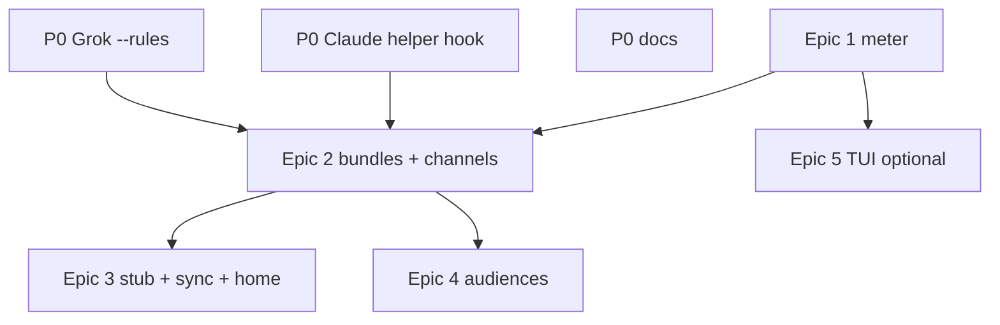

# Split Memory-Built Instruction Delivery Into Confirmable Epics

**Date:** 2026-10-05 · **Researcher:** grk · **Checkout:** this workspace · **CLIs:** Grok
1.0.46, Claude Code 2.1.x (installed `--help`)

> **Question:** Should the migration from committed agent instruction files to
> per-invocation, memory-built bundles be one piece of work or several epics, and if
> several, where are the cuts that a human can actually confirm?

**Prior reports reviewed (accepted as the architecture, with issues called out below):**

- `research:202610/sase_md_instruction_delivery/sase_md_instruction_delivery.md`
- `research:202610/instruction_bundles_provider_parity_and_memory_ledger.md`
- `research:202610/fresh_clone_bootstrap_and_native_subagent_instructions/fresh_clone_bootstrap_and_native_subagent_instructions.md`

Also used: `research:202610/agent_instructions_budgeted_router/agent_instructions_budgeted_router.md`
(budget ratchet only).

---

## Bottom line

**Split the work. File four epics and a small P0 tale cluster. Do not file one
mega-epic, and do not file one epic per provider.**

The three prior reports already agree on the destination: one bundle per provider
invocation, composed from memory, delivered through each adapter's explicit channel,
with a helper overlay for native subagents and a committed export stub for fresh clones.
That destination is still the right one. What those reports do *not* give you is a
work-breakdown you can close. They reuse "Phase 0–4" for three different piles of work,
mix a TUI product surface into the delivery engine, and attach behavioral metrics that
will keep an epic open forever.

The cuts below follow one rule: **an epic ends when you can run a short, mechanical
checklist and see the result without reading the agent's mind.** Shared code (the
renderer, the `DeliveryPlan` hook, the `sase instructions` CLI group) stays inside one
epic. Independent value (a Grok restore you can ship this week; a doctor that shows
today's duplicates; a fresh-clone stub; audience `when:` filters; a MEMORY deck) gets
its own bead.

```
P0 tales ──parallel──► Epic 1 meter
                         │
                         ▼
                      Epic 2 bundles + explicit delivery   ←── the migration
                         │
            ┌────────────┴────────────┐
            ▼                         ▼
     Epic 3 committed surface    Epic 4 audiences
            │                         │
            └────────────┬────────────┘
                         ▼
              Epic 5 MEMORY ledger TUI (optional)
```

Epic 5 is optional. Traits / `%tag` / a `SASE.md` composition DSL stay unfiled until a
real section needs them.

---

## Independent checks on this tree

These numbers are from this workspace, 2026-10-05, not copied from the prior reports.

| Claim | This tree |
| --- | --- |
| Tracked instruction files | **20** (`git ls-files` of `AGENTS.md` + four shims at root, `tools/`, `src/sase/ace/`, `demos/tapes/`) |
| Root `AGENTS.md` | **285 lines, 17,502 bytes** |
| Commits in 60 days touching root `AGENTS.md` | **112** (prior report said 111) |
| Nested unique content | `tools/` 81 lines, `src/sase/ace/` 48, `demos/tapes/` 4 |
| Grok in this workspace | `grok inspect`: **Project trusted: no**, **Project Instructions (0)** |
| This Grok session's `prompt_context.json` | `agents_md_files: []`; `memory_v2_enabled: false`; no `rules` field |
| This session's `system_prompt.txt` | 5,206 bytes of Grok harness text; **no** `SASE Final Declaration`, no `sase/memory` |
| `src/sase/llm_provider/grok.py` | No `--rules`, no `--trust`. Invoke argv is `--prompt-file /dev/stdin` plus session flags. |
| Installed Grok `--help` | `--rules <RULES>` appends to the system prompt |
| Installed Claude `--help` | `--append-system-prompt` is listed; `--append-subagent-system-prompt-file` is **not** a listed flag (one help paragraph mentions `--append-system-prompt[-file]`) |
| `sase instructions` | **Does not exist.** Closest command is `sase memory agent-docs list`. |
| `sase tmux-agent` | Launches raw `entry.argv` (`src/sase/tmux_agent/launch.py`) |
| Invoke boundary | `src/sase/llm_provider/_invoke.py` `provider.invoke` (~line 436); follow-ups at `finalizers/declaration_recovery.py:83` and `finalizers/commit_repair_conflict.py:409` |
| Launch snapshot | `capture_instruction_snapshot` (`axe/launch_evidence.py:166`) hashes **files on disk at workspace setup**, not what the CLI loaded |
| CI drift gate | `.github/workflows/ci.yml:57` and `master-gate.yml:135` run `sase init memory --no-commit` |
| Glossary | `glossary:agent-instruction-file` still says every shim in a directory has the same contents |
| `docs/agent_providers.md` "Instruction double-load" | Still says Grok loads `AGENTS.md` and `CLAUDE.md` |
| Deck picker | Existing decks `m/f/t/n`. Reserved keys in `titles.py`: `j, k, q, p`. The ledger report's MEMORY deck key `p` is reserved. |
| Feature flags | Epic scaffolding: a beta flag is removed before the epic lands (`sase/memory/sase_flags.md`) |

Grok is not instruction-*less* in a SASE run. This session still received the 51
`sase-*` skills, and `/sase_final`'s skill description is enough to remind a model to
declare. What is missing is the generated body: core notes, reference triggers, webs,
and the repo inventory. That distinction matters for P0 success criteria.

No in-progress epic currently owns this migration (`sase bead search` over instruction /
`AGENTS.md` / bundle terms returned no plan beads).

---

## Issues in the prior recommendations

The destination architecture (R1–R6, amended R7, R9–R14, two-slot delivery, export stub)
is sound. These are the places where following the reports *as a work plan* would hurt.

### 1. "Phase 0–4" is three different plans sharing one numbering scheme

The delivery report, the ledger report, and the bootstrap report each define Phase 0, 1,
and 2. The contents disagree (Claude helper fix is Phase 0 in the bootstrap report,
Phase 1 in the delivery report, and "add to prior phases" in the ledger report). Filing
epics named after those phases will send land agents to the wrong checklist.

Treat the reports as an architecture spec. Name epics after the **confirmable outcome**.

### 2. Untracking is no longer a correctness dependency for Codex

The delivery report's R7 rested on "Codex cannot suppress a present project
`AGENTS.md`." The bootstrap report (lead-verified with `codex debug prompt-input`)
showed `-c project_doc_max_bytes=0` drops project `AGENTS.md` and `AGENTS.override.md`
and keeps `$CODEX_HOME/AGENTS.md`.

Consequence for the split: **Epic 2 can deliver exactly-once for Codex while the full
files are still tracked.** Epic 3 (export stub, untrack, sync) is contributor UX, CI,
and fresh-clone behavior. It waits until Epic 2's Codex flag is on, and it is a
separate close.

The **complement mode** the delivery report invented for the Codex migration is leftover
from the false constraint. Building it is extra code that Epic 3 deletes. Skip it: turn
on shadow-home delivery and `project_doc_max_bytes=0` in the same flag flip.

### 3. "Helper finals go to 0" cannot close a Phase 0 that still ships `CLAUDE.md`

The bootstrap report's Phase 0 keeps native `CLAUDE.md` (which tells helpers to run
`/sase_final`) and appends a prohibition plus a PreToolUse hook. That is worth doing
this week. It is not a close gate of "0 helper-accepted declarations." Forks without
`agent_id` bypass the hook (still unverified). The mechanical zero is an Epic 2 Claude
exit criterion, after `claudeMdExcludes` is on.

P0's confirmable result is: the hook is present in the adapter `--settings`, a
general-purpose helper's `sase final` attempt is denied in a fixture, and the
actor-qualified sentence is in `sase/memory/sase.md`.

### 4. Retiring `sase/memory/sase.md` into a packaged base is a memory-architecture change

The delivery report folds this into Phase 1. Today that note is a `type: core` memory
file, edited through `/sase_memory_write`, inlined by `sase memory init`, and visible in
the Memory pane. Moving the contract into a package template changes review, init, and
the TUI in the same epic as Grok `--rules`. Keep the contract as a core note through
Epic 2. Revisit packaging once bundles are the live path.

### 5. Last-known-good at launch is needed after files go away, not before

While tracked `AGENTS.md` still exists, a render failure can fall back to native files.
A last-known-good store with notifications is a reliability feature with its own tests.
Put it in Epic 3, which is the first epic that can launch with no file to fall back to.

### 6. `sase-core` for the `when:` evaluator belongs in the audience epic

Launch-fact schema, `when:` maps, and LSP completion pass the rust-core litmus test.
They also require a `sase-core-revision.txt` pin bump. Epic 2 only needs `provider`,
`role` (`root`/`helper`), and `mode` (`sase`/`interactive`/`export`), which Python
already has at `_invoke.py`. Crossing the pin for a DSL delays the Grok restore.

The ledger report's `instructions::ledger_view` in `sase-core` is right for a TUI/CLI/web
parity surface (Epic 5). Epic 1 can join receipts in Python.

### 7. The MEMORY deck is a product epic, and its proposed picker key is taken

Receipts, a doctor check, and a quiet identity-header chip are the meter. A new deck
with Receipt / Ledger / Bundle cards, a reverse "Seen by" index, and CLI parity is weeks
of TUI + screenshot work. Folding it into every delivery phase makes every phase "not
done" until goldens land.

Concrete bug in the ledger mockup: it assigns the MEMORY deck to picker `p` `y`.
`DECK_PICKER_RESERVED_KEYS` in `src/sase/ace/tui/widgets/decks/titles.py` is
`{j, k, q, p}`. Pick a free key in Epic 5.

### 8. Grok final-declaration rate is a watch metric

The 60% → 26% split is the strongest *historical* signal that delivery matters. It is a
bad epic close gate: model mix, research vs code share, and skill-list reminders all
move it. Close on session records and doctor output. Chart the rate.

### 9. `sase instructions` collides with `sase memory agent-docs`

None of the three reports mention the existing `sase memory agent-docs list` inventory.
A second, unrelated command group will rot. Epic 1 owns one CLI group; later epics add
subcommands. Either promote `sase instructions` and make `agent-docs` a compatibility
alias, or put `render` / `show` / `sync` / `export` under `sase memory`. Read
`cli_rules.md` in that phase. Do not invent a third inventory.

### 10. The hidden Claude subagent flag needs a version guard as a deliverable

`--append-subagent-system-prompt-file` is absent from this install's `--help`. The
bootstrap report verified it on 2.1.289 with live markers. A provider CLI upgrade can
drop a hidden flag the way Grok's trust gate dropped native file loads. Epic 2's Claude
phase ships `sase doctor instructions` asserting the flag still parses, plus a documented
fallback (`--agents` with `omitClaudeMd`, or SubagentStart pointer).

### 11. Grok `--rules` observability is still the meter gap

This session's `prompt_context.json` has `agents_md_files` (good for "native load = 0")
and no rules field. `system_prompt.txt` exists and would be the place a `--rules` canary
should appear. **P0 must include a one-shot marker test** that greps `system_prompt.txt`
after a `--rules CANARY` invoke. If the canary is missing, Grok conformance stays
"native-empty verified, bundle presence unverifiable" and the meter must say so honestly
(the ledger report's `◌ unverifiable` for agy). Do not close a Grok restore on "we
passed `--rules`."

### 12. Globally deployed skills are a parallel instruction channel

Interactive neutralization of `/sase_final` in files (Epic 3, home layer) does not
remove the `/sase_final` skill from `~/.grok/skills` / Claude skill dirs. The bootstrap
report already saw a `grok -p` in `/tmp` announce a finalizer step for this reason.
Skill-template audiences are a follow-up, not an Epic 3 close blocker. Record it as a
known residual on Epic 3.

### 13. Plugin-repo delivery hooks and SessionStart hooks are scope traps

A required `llm_instruction_delivery` implementation in `sase-github` / `sase-telegram`
turns Epic 2 into a four-repo land. Default the hook to a prompt prefix in the host.
Plugin adapters opt in later.

A committed Claude SessionStart hook in public `.claude/settings.json` runs code for
every clone, including contributors with no `sase` on `PATH`. Keep it optional and out
of Epic 3's required path. `just install` + `sase instructions sync` is the required
refresh.

### 14. Feature flags cannot soak after the epic closes

`sase/memory/sase_flags.md`: a beta flag created for an epic is scaffolding, and the
epic removes it before land by deleting the Off branch. Per-provider flags are the right
*internal* rollout tool for Epic 2. The last phase of Epic 2 soaks, then makes explicit
delivery unconditional for Claude, Codex, Grok, and Muse, and closes the flag bead. A
long "Grok on, Claude off" soak happens *inside* Epic 2, not as a leftover flag.

### 15. Three audiences belong in the renderer data model in Epic 2

R14 (SASE root / native helper / interactive) is a renderer invariant. If Epic 2 only
builds a SASE-run blob, Epic 3 rewrites the renderer to drop `/sase_final` for
interactive/export. Epic 2 must render all three modes even if only `sase` and `helper`
are delivered live. Interactive/export bytes can wait to be *written to disk* until
Epic 3.

### 16. The budgeted-router 1,600-token project-layer cap is a parallel tale

The ledger "after" bundle is ~4.6k tokens. R8 applies the router ratchet to the
**project layer per audience**, not to the whole bundle. Hitting 100 lines / 1,600
tokens is generator work (roster density, one-line triggers) that `sase memory init`
can do today. It helps Claude/Codex/Muse immediately and makes `--rules` smaller. It
does not block Epic 2. File it as a tale if you want the shrink now; fold the per-audience
ratchet into Epic 4.

---

## Why splitting is advisable

A single epic that contains the renderer, five adapters, two-slot delivery, provenance,
conformance, untracking 20 files, a CI rewrite, chezmoi home files, a `when:` DSL in
sase-core, and a new TUI deck will have 10–14 phases. You will not be able to tell, on
a given week, whether "instruction delivery" is done. The land agent will be asked to
confirm Grok's restore, a fresh-clone stub, and a MEMORY deck in one close note.

Splitting is advisable because the seams already have different:

- **Verification methods.** Session greps vs `git status` vs `claude` in a tmp clone vs
  screenshot goldens vs a matrix budget check.
- **Repositories.** sase vs chezmoi vs (later) sase-core.
- **Failure domains.** A bad Claude exclude vs a bad export stub vs a bad `when:` that
  hides `/sase_final` from researchers.
- **User-visible value.** Grok can get instructions next week without waiting for
  `SASE.md` parsing.

What must stay together:

- Renderer + first live delivery of at least one provider. A renderer with no consumer
  is dead code.
- All four high-share adapters (Claude, Codex, Grok, Muse) in **one** epic, because they
  share the hook, the receipt schema, and the flag-removal close. One epic per provider
  would collide on `_invoke.py` and the CLI for months.
- `claudeMdExcludes` / `project_doc_max_bytes=0` in the **same flag flip** as that
  provider's explicit channel. Split those and you ship a silent empty context.

---

## Split criteria used

An epic is the right size when:

1. It produces a user-visible or operator-visible result you can confirm in under 15
   minutes with a written checklist.
2. Later epics consume a **stable interface** (receipt schema, `DeliveryPlan`,
   `sase instructions` subcommands, three-mode renderer), not a temporary complement
   path.
3. It is at most ~6 phases, mostly `medium`, matching recent sase epics (for example
   `plans/202610/tui_freeze_gc_heap.md`).
4. It can merge to master without requiring the next epic. Master with Epic 2 on and
   files still tracked is a valid, better world than today.

Tales (size `small`/`medium`, implement directly) are for P0 stopgaps that are a few
files and a fixture. Wrapping "pass `--rules`" in epic ceremony slows the only bug that
has been live since about 2026-09-10.

---

## Recommended program

### P0 — tales, not an epic (days, parallel with Epic 1)

Ship the observed-harm fixes that do not need a renderer. Launch as one medium tale or
three small ones. Prefer three, so a Claude hook failure does not roll back Grok.

| Tale | What lands | Confirm in 15 minutes |
| --- | --- | --- |
| **P0-grok** | `grok.py` passes current project `AGENTS.md` plus home `~/AGENTS.md` through `--rules`. Workspaces stay untrusted. Unique canary heading in the payload. | (1) `grok inspect` in a workspace still shows trusted: no, instructions: 0. (2) After one SASE Grok invoke, `system_prompt.txt` contains the canary. If it does not, the tale's close note records Grok as unverifiable-for-presence and still ships `--rules`. (3) Adapter unit test asserts `--rules` is on the argv and `--trust` is not. |
| **P0-claude-helpers** | `--append-subagent-system-prompt-file` with a packaged helper prohibition; `--settings` PreToolUse denials for `sase final` / `/sase_final` when `agent_id` is present. Native `CLAUDE.md` stays. Actor-qualified sentence added to `sase/memory/sase.md` via `/sase_memory_write`. | (1) Adapter test: subagent flag present, settings JSON contains the hook. (2) Fixture: a helper-shaped PreToolUse payload is denied; a root payload (no `agent_id`) is allowed. (3) `sase memory init --check` clean after the sentence edit. **Do not** require a 30-day helper-final count of 0. |
| **P0-docs** | Rewrite `docs/agent_providers.md` "Instruction double-load" to match Grok's trust gate. | `rg "loads both files" docs/agent_providers.md` is empty; the section describes untrusted workspaces and zero loads. |

**Out of P0:** doctor (Epic 1), excluding `CLAUDE.md` (Epic 2), untracking files (Epic 3),
stopping `OPENCODE.md`/`QWEN.md` generation (Epic 3).

---

### Epic 1 — Observed instruction meter

**Goal:** You can see what each recent SASE run actually loaded, using today's files and
today's provider records, before any delivery change.

**Why first:** The Grok hole lasted ~four weeks because nothing compared intent to
observation. Epic 2's per-provider flips are only safe if the meter already knows what
"duplicate" and "empty" look like.

**Depends on:** nothing. Parallel with P0.

**Size:** `large`. Suggested phases (all `medium`):

1. **`parsers`** — Normalize Claude transcript attachments (`instructions`,
   `prompt_snapshot`), Codex rollout `--- project-doc ---` blocks, Grok
   `prompt_context.json` + `system_prompt.txt`, Muse `session.jsonl` first user message,
   agy → `unverifiable`. Golden fixtures from real records (redact payloads).
2. **`cli`** — Introduce the one command group (`sase instructions` or an extension of
   `sase memory`). Subcommands in this epic: `show <agent>` and a `sase doctor
   instructions` check. Read `cli_rules.md`. Compatibility alias for
   `sase memory agent-docs`.
3. **`receipts-observed`** — Write an observed-mode receipt next to the existing
   `instruction_snapshot`: intended = files on disk (reuse
   `parse_amd_agents_document`), observed = parser output, status ∈
   `{ok, duplicate, empty, missing-home, unverifiable}`. Append
   `instruction_receipts.jsonl`. Keep the old snapshot for pre-receipt runs.
4. **`chip`** — Identity-header chip: quiet when `ok`, loud on `duplicate` / `empty`.
   Screenshot goldens. No new deck.

**Exit criteria (all mechanical):**

- `sase doctor instructions` over the last 7 days of sase-project runs reports, in JSON:
  Grok `empty` (native files 0), Claude `duplicate` (home + project contract), Codex
  `duplicate`, Muse `missing-home` or equivalent, agy `unverifiable`.
- `sase instructions show` of this Grok session prints `agents_md_files: []` and the
  snapshot paths.
- Selecting a known-duplicate Claude node in ACE shows the loud chip. `just check`
  includes the new screenshot nodes.
- Zero changes to provider argv. A flag-off Grok run still has no `--rules` from *this*
  epic (P0 may have added it; the meter still classifies native loads).

**You confirm by:** running doctor on athena, opening one Claude and one Grok node,
seeing ‼ vs ∅, and grepping `_invoke.py` for no new delivery calls.

**Stable interface produced:** receipt JSON schema v1, doctor check id, CLI group name.

---

### Epic 2 — Per-invocation bundles and explicit delivery

**Goal:** Claude, Codex, Grok, and Muse SASE runs receive one memory-built bundle
through an explicit channel. Native SASE full files are suppressed for those runs.
Helpers get a helper overlay. Tracked files remain in the repo.

This is the migration. Everything else is setup or cleanup.

**Depends on:** Epic 1 (meter must classify the before-state). P0-grok may already have
`--rules`; this epic replaces that payload with a real bundle.

**Size:** `xlarge` (plan it as an epic; do not grow it). Suggested phases:

1. **`renderer`** — Compose package + home + project layers from existing memory notes
   at the `_invoke.py` boundary (and both finalizer follow-ups). Three modes in the data
   model: `sase`, `helper`, `interactive`. Facts: `provider`, `role`, `mode`.
   `sase instructions render --as …` prints bytes + section map + sha256. Flag off:
   renderer is unused at invoke. **Keep `sase/memory/sase.md` as the contract source.**
2. **`delivery-plan`** — `DeliveryPlan` with `root` and `subagent` slots
   (`explicit` / `inherits-native` / `inherits-root` / `none`). Default for unknown
   providers: `inherits-native`. Write intended receipts. Export
   `SASE_INSTRUCTIONS_FILE` and `SASE_SUBAGENT_INSTRUCTIONS_FILE`. Wire the pointer
   sentence into the root overlay for `none` providers. Tests cover
   `declaration_recovery` and `commit_repair_conflict` re-invokes (R4).
3. **`grok-channel`** — `--rules` gets the `sase` bundle. Untrusted stays. Doctor
   asserts native files 0 and (if P0 proved it) canary/hash in `system_prompt.txt`.
   Flip this provider first; it is the highest harm and the simplest channel.
4. **`claude-channel`** — `--append-system-prompt-file` (root),
   `--append-subagent-system-prompt-file` (helper), `claudeMdExcludes` via `--settings`
   for workspace and home SASE files, PreToolUse guard from P0. Doctor: bundle hash
   once in `prompt_snapshot`; helper transcripts contain helper overlay section ids;
   native SASE files excluded. Version-guard: doctor fails if the subagent flag no
   longer parses. Fallback documented in the phase note.
5. **`codex-channel`** — Write the bundle as shadow `$CODEX_HOME/AGENTS.md` (neutral
   core + root overlay in `developer_instructions` as today). Set
   `project_doc_max_bytes=0` in the **same** flip. No complement mode. Doctor: one
   instruction block, no `--- project-doc ---` from SASE files. Conformance watches
   the undocumented suppress knob; if it breaks, the phase note already names "accept
   the stub double-load" as the fallback (stub does not exist yet; until Epic 3 the
   fallback is "leave the flag off").
6. **`muse-channel-and-unflag`** — Prompt-prefix the bundle on the existing
   `_muse_directive.py` path; keep it out of visible prompt history. Soak all four
   providers. Delete Off branches. Close the flag bead. agy / Qwen / OpenCode stay
   `inherits-native` (or prefix-by-default) as a **follow-up tale**, not a close
   blocker.

**Exit criteria:**

- With the epic landed (flags gone), `sase doctor instructions` on new runs for Claude,
  Codex, Grok, and Muse reports `bundle_copies=1` and `native_sase_full_files=0`.
- Grok: `agents_md_files: []` and the bundle hash or a stable section heading appears
  in `system_prompt.txt` (or the doctor row is explicitly `presence_unverifiable` *and*
  a unit test still proves `--rules` argv contains the bundle bytes).
- Muse first user-message prefix contains the home-layer trigger lines that today's
  Muse sessions lack.
- Claude helper fixture: helper overlay present, `/sase_final` absent from the helper
  render, PreToolUse denies `sase final`. After soak, a 7-day count of
  helper-accepted declarations on new runs is 0. (Pre-epic history stays.)
- `git ls-files '*AGENTS.md' '*CLAUDE.md'` still lists the 20 files. Memory edits still
  refresh them via `sase memory init`. Workspace `git status` is not dirtied by
  rendering.
- `sase instructions render --as role=helper` omits the final-declaration block;
  `--as mode=interactive` omits it too (bytes exist; files not yet switched).

**You confirm by:** doctor JSON before/after on one run per provider; `git ls-files`
still showing the 20 files; one Claude helper transcript; one Grok `system_prompt.txt`.

**Stable interface produced:** renderer API, three-mode bundles, `DeliveryPlan`, intended
receipts, `sase instructions render`.

**Decision record** (in this epic, not its own bead): "Instructions Are Rendered Per
Invocation And Delivered By Adapters", extending `adapters-normalize-harnesses`. Record
R1, R4, R6, R9, R10, R14, facts-first targeting, and the reopen conditions (provider
loses every explicit channel; conformance can no longer observe loaded context).

---

### Epic 3 — Committed export stub, sync, and home interactive render

**Goal:** A clone without SASE still gets a correct interactive stub. `just install`
fills gitignored full projections for Claude and Codex. Memory edits stop producing
instruction-file commits. Home `~/AGENTS.md` / `~/CLAUDE.md` stop ordering interactive
sessions to run `/sase_final`.

**Depends on:** Epic 2 landed for Claude and Codex (excludes/suppress must be live
before the committed file shrinks). Grok/Muse explicit delivery should be on so the stub
is a harmless native miss rather than their only copy.

**Size:** `large`. Suggested phases:

1. **`export-cli`** — `sase instructions export` writes a budgeted `mode: export`
   `AGENTS.md` (≤80 lines, no turn obligations, bootstrap clause, build/test,
   `gotchas` + `rust_core_backend_boundary`) and a two-line `CLAUDE.md` (`@AGENTS.md`
   plus `@.sase/instructions/claude.md`). `--check` mode. Replace the instruction
   half of CI's `sase init memory --no-commit` with `sase instructions export --check`
   **in the same change** that stops `sase memory init` from copying shims.
   `PROVIDER_SHIM_FILES` shrinks. Read `cli_rules.md`.
2. **`untrack-and-notes`** — Untrack full generated files. Gitignore
   `AGENTS.override.md` and keep `.sase/`. Delete `GEMINI.md`, `QWEN.md`, `OPENCODE.md`.
   Convert `tools/`, `src/sase/ace/`, `demos/tapes/` nested sets into path-scoped
   reference notes (triggers in every bundle; merge duplicated Symvision text into
   `symvision.md`). Update `glossary:agent-instruction-file` via `/sase_memory_write`.
   Workspace prep deletes projection paths.
3. **`sync`** — `sase instructions sync` is hermetic (R13): refuses SASE workspaces,
   refuses to overwrite a file without the generated header, `--if-stale` / `--check`,
   prints paths to read. `just agent-instructions` and `just install` call it.
   `sase tmux-agent` launches through the delivery hook with `mode: interactive`.
4. **`home-interactive`** — Open the chezmoi repo with `/sase_repo` and switch
   `~/AGENTS.md` / `~/CLAUDE.md` to `mode: interactive` home-memory renders. This phase
   is a second repository obligation on purpose; do not bury it.

**Last-known-good** lands here: once files are gone, a render failure at invoke uses
the last good bundle for that project+audience and notifies. Fail closed only if none
exists.

**Exit criteria:**

- Fresh clone, no `just install`, no SASE on `PATH`: `AGENTS.md` is the stub;
  `rg "/sase_final" AGENTS.md CLAUDE.md` is empty; `claude -p` in that clone (or a
  recorded prompt-input debug) sees the stub / `@AGENTS.md` import and not the SASE
  contract.
- After `just install` in a primary checkout: `git status` is clean;
  `.sase/instructions/claude.md` and `AGENTS.override.md` exist with the interactive
  heading; Claude import loads the gitignored file (already verified in prior
  research; regression-test it).
- A core-note edit + `sase memory init` does **not** change tracked `AGENTS.md` unless
  export notes changed. CI `export --check` is the drift gate.
- `sase tmux-agent --dry-run` for Claude/Codex/Grok shows delivery-hook argv, not a
  bare CLI.
- Home files (chezmoi apply on a test machine overlay) omit the final-declaration
  block.

**You confirm by:** a throwaway `git clone` + `rg`; `just install` + `git status`;
one memory-edit dry run; chezmoi diff.

**Known residual (do not block close):** globally installed SASE skills still describe
turn obligations in interactive sessions. File a follow-up tale for skill-template
audiences.

**Out of this epic:** SessionStart hooks (optional later), Grok shadow-home child spike.

---

### Epic 4 — Audiences and the budget ratchet

**Goal:** Launch facts can add or drop *optional* text. Hard rules and baseline
reference triggers stay in every render (R9). The router ratchet applies per audience.

**Depends on:** Epic 2 renderer. Can overlap Epic 3.

**Size:** `large`. Suggested phases:

1. **`facts-in-core`** — Closed launch-fact schema and declarative `when:` evaluator in
   `sase-core` (note frontmatter + shared evaluator). Unknown keys fail at check time.
   Pin `sase-core-revision.txt`. LSP completion is part of this phase if the binding
   is cheap; otherwise a follow-up tale.
2. **`first-conditionals`** — Lean monitor/gate renders (contract + hard rules, shorter
   trigger catalog). Phase-worker bead rule as a positive rule (drop the "unless your
   prompt forbids" hedge). Research vs code: `decisions` roster density. These are the
   measured uses from the delivery report; they prove the evaluator.
3. **`matrix-budget`** — `sase instructions check --matrix` renders reachable audiences
   and enforces the router ratchet on the **project layer** (≤100 lines / ≤1,600 tokens
   at 88 columns, or the current ratchet if already landed as a parallel tale). Hard
   rules present in every cell. Fail in CI / pre-commit, not at launch.

**`SASE.md` composition spec:** only if phase 2 hits a layout need that frontmatter
`when:` cannot express. Default is **no new Markdown DSL**. The delivery report already
called `SASE.md` optional; keep it that way. `corpus-before-mechanism` applies.

**Exit criteria:**

- `sase instructions check --matrix` is green in CI.
- Token count of a `role=monitor` render is strictly below `role=code` on this repo,
  and both contain the final-declaration block (monitors are SASE roots).
- `phase_worker=true` render contains `PROPOSED FOLLOW-UP` as a rule and omits "you
  can and SHOULD capture discovered follow-up work as sase task beads" as a command.
- A research-tribe render uses the compact decisions roster; a code render keeps
  baseline triggers. `when:` cannot drop `/sase_final` from a `mode=sase` root
  (regression test).

**You confirm by:** `sase instructions render --as role=monitor | wc` vs code; matrix
JSON in CI logs; one phase-worker fixture.

**Do not file in this epic:** `traits:` / `%tag` / prompt escape hatches.

---

### Epic 5 — MEMORY ledger TUI (optional)

**Goal:** The TUI answers "what did this agent know, at which blob, and did it use it?"
without opening doctor JSON.

**Depends on:** Epic 1. Becomes useful after Epic 2 (intended receipts have section ids
and blob oids). Independent of Epic 3 and 4.

**Size:** `large`. Only file this if you want the deck. Doctor + chip from Epic 1 are
enough to operate the migration.

Phases, if filed: ledger join (Python first, sase-core if CLI/TUI/web must match);
MEMORY deck on a **free** picker key; Bundle card with stored render; Memory pane
"Seen by"; `sase instructions show --bundle`. Screenshot goldens at both viewports.

**Exit criteria:** Opening a post-Epic-2 Claude node shows inlined / offered / read
rows pinned to blob oids; a `↻` row opens memory-history at that version; clan strip
on a research swarm shows a shared `common_digest`. Quiet when `ok`.

---

## What not to file

| Idea | Why it stays unfiled |
| --- | --- |
| One mega-epic named "instruction delivery" | Cannot close; mixed verification |
| One epic per provider | Shared hook/`_invoke.py` collisions; four lands of the same schema |
| Traits / `%tag` / `%trait` | No section yet needs a label that `provider`/`role`/`mode`/`tribe`/`macros` does not provide (`corpus-before-mechanism`) |
| `SASE.md` DSL as a prerequisite | Frontmatter `when:` is the authoring surface |
| agy / Qwen / OpenCode as close blockers | Combined ~1% of runs; inherit-native until a tale |
| Plugin-repo adapter work | Host default prefix |
| Required SessionStart hook | Public-repo code execution; optional later |
| Complement mode | Dead on arrival after `project_doc_max_bytes=0` |
| Packaging `sase.md` into a non-memory template in Epic 2 | Memory-architecture change on the Grok-restore critical path |

**Parallel tale, optional:** implement the budgeted-router roster densities on the
current `sase memory init` generator so today's Claude/Codex/Muse files shrink before
Epic 2. Independent, confirmable with `wc -l AGENTS.md` and `sase memory init --check`.

**Follow-up tales after Epic 3/4:** skill-template interactive audience; Grok
shadow-`$GROK_HOME` child spike if child volume grows; Codex v2
`subagent_developer_instructions` when `multi_agent_v2` is on; agy prefix + drop
`GEMINI.md` double load; fork `agent_id` verification for Claude.

---

## Sequencing and what you will see week by week



| After | What you can confirm without trusting a model |
| --- | --- |
| P0-grok | `system_prompt.txt` has the canary; `grok inspect` still untrusted |
| P0-claude | Hook fixture denies helper `sase final` |
| Epic 1 | `sase doctor instructions` prints today's ‼ and ∅ |
| Epic 2 | New Claude/Codex/Grok/Muse runs show `bundle_copies=1`; 20 files still tracked |
| Epic 3 | Fresh clone has a stub with no `/sase_final`; `just install` leaves `git status` clean |
| Epic 4 | Matrix check green; monitor render smaller than code render |
| Epic 5 | MEMORY deck matches doctor JSON |

Master is always shippable at each row.

---

## How this maps onto the prior phase tables

| Prior "phase" | Where it goes here |
| --- | --- |
| Delivery Phase 0 Grok `--rules` | P0-grok tale |
| Delivery Phase 0 doctor v1 | Epic 1 |
| Delivery Phase 0 drop OPENCODE/QWEN | Epic 3 |
| Delivery Phase 1 renderer + adapters + provenance | Epic 2 |
| Delivery Phase 2 untrack / sync / nested notes | Epic 3 |
| Delivery Phase 3 audiences / `when:` / sase-core | Epic 4 |
| Delivery Phase 4 labels | Unfiled |
| Ledger "meter before engine" | Epic 1, then Epic 5 |
| Ledger MEMORY deck / Seen by | Epic 5 |
| Bootstrap Phase 0 Claude helpers | P0-claude tale (hook + sentence); mechanical zero in Epic 2 |
| Bootstrap two-slot delivery | Epic 2 |
| Bootstrap export stub + sync + home | Epic 3 |
| Bootstrap Grok child spike / Codex v2 | Follow-up tales |

---

## Governance notes for whoever files the beads

- Create the four epic plans with `sase bead dep`: Epic 2 blocked on Epic 1; Epic 3 and
  Epic 4 blocked on Epic 2. P0 tales are independent.
- Create per-provider beta flags **inside Epic 2** with `sase flag new`, and remove them
  in Epic 2's last phase.
- Memory edits (actor-qualified sentence, glossary, path-scoped notes) go through
  `/sase_memory_write`.
- Chezmoi work is a phase of Epic 3, with `/sase_repo` on that checkout.
- Do not put ephemeral workspace paths in the plans.
- Watch metric, recorded on Epic 2's bead, not a close gate: Grok non-research
  final-declaration rate vs the ~60% pre-regression baseline.

---

## Evidence index

**This researcher, 2026-10-05:**

- `git ls-files` instruction files = 20; `wc -l -c AGENTS.md` = 285 / 17502;
  `git log --since='60 days ago' --oneline -- AGENTS.md` = 112.
- `grok inspect` in `sase_16`: trusted no, instructions 0. Grok 1.0.46.
- This session: `~/.grok/sessions/.../1ea075d1-.../prompt_context.json`
  `agents_md_files: []`; `system_prompt.txt` 5206 bytes, no SASE contract.
- `src/sase/llm_provider/grok.py` invoke argv (no `--rules` / `--trust`).
- Installed `grok --help` (`--rules`); installed `claude --help` (no listed
  `--append-subagent-system-prompt-file`).
- `sase instructions` missing; `sase memory agent-docs -h` present.
- `capture_instruction_snapshot` in `axe/launch_evidence.py:166`; invoke at
  `_invoke.py` ~436; finalizer follow-ups as cited.
- `tmux_agent/launch.py` uses `entry.argv`.
- CI `sase init memory --no-commit` at `ci.yml:57`, `master-gate.yml:135`.
- `DECK_PICKER_RESERVED_KEYS` includes `p`.
- `docs/agent_providers.md` double-load section still describes Grok loading both
  files.
- `sase/memory/glossary/agent-instruction-file.md` same-contents invariant.
- `sase bead search` / in-progress epic list: no owner for this migration.

**Carried from prior reports, not re-measured here:** 7,007-run provider shares; Claude
helper 13–15 `sase final` calls and 2 accepted declarations; Codex 0 spawns in 30 days;
`project_doc_max_bytes=0` marker test; Claude `@import` of gitignored files; 790-token
duplicate contract.

**Architecture accepted from prior reports, as amended by the issues section:** R1–R6,
amended R7, R8 as a per-audience project-layer ratchet, R9–R14, two-slot delivery,
export stub + sync, facts-first audiences, explicit channels over workspace file writes.
