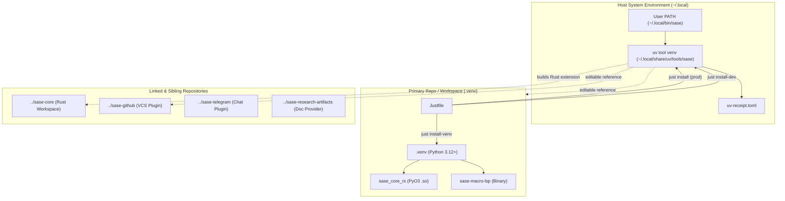
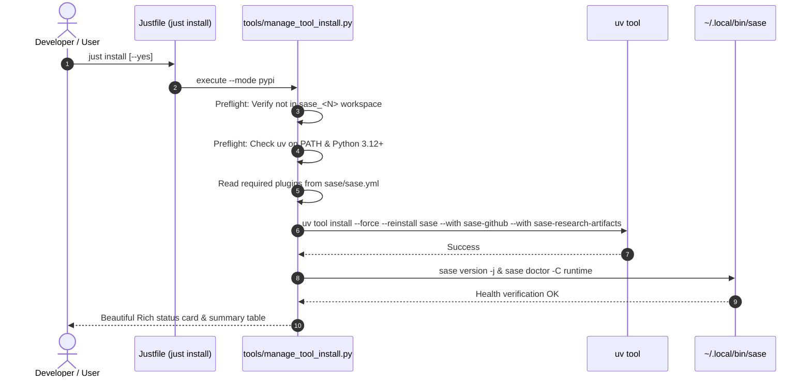
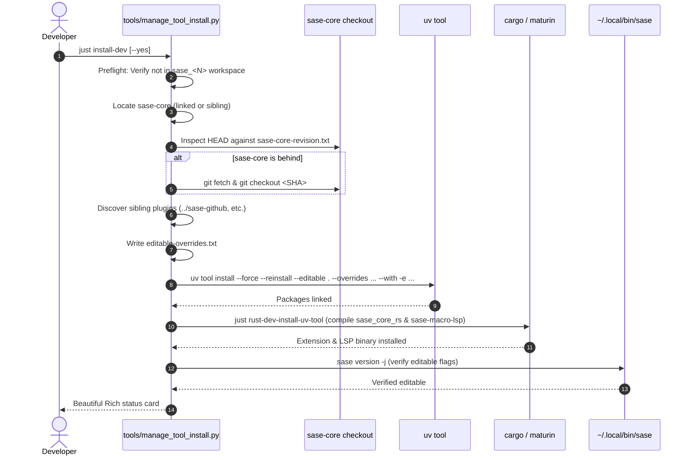
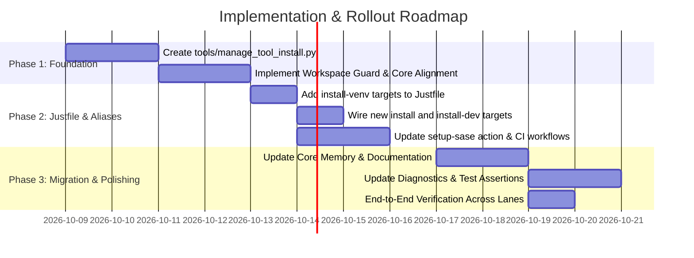

# Research Report: Designing `just install` (Prod) and `just install-dev` (Editable) with `sase-core` Integration

**Author:** Researcher `gem` (5-Researcher Swarm)  
**Date:** 2026-10-08  
**Target Repository:** `sase-org/sase`  
**Artifact ID / Scope:** `research:202610/just_install_prod_and_dev_redesign__gem.md`

---

## 1. Executive Summary

This research investigates the design, mechanics, and ramifications of introducing new `just install` (PyPI/production) and `just install-dev` (editable/development) commands to the SASE project, while renaming the existing local virtualenv recipes (`just install`, `just install-visual`, `just install-terminal-smoke`) to `just install-venv` and `just install-venv-*`.

### Key Conclusions
1. **The Core Proposal Solves a Genuine Cold-Start Void:**
   Today, `sase update --to dev|pypi` can switch an *already-functioning* installation between PyPI and editable checkouts. However, when SASE is not yet installed on the host, when an installation is corrupted, or when a developer has freshly cloned the repository, there is no top-level `just` command to bootstrap the system tool. Adding `just install` and `just install-dev` closes this critical bootstrapping gap.

2. **The Proposal Carries a Severe Architectural Hazard for SASE Agents:**
   SASE agents execute in ephemeral workspace clones (`sase_<N>`). Existing core memory notes (`lint_and_test.md`, `symvision.md`) instruct agents to run `just install` to repair workspace `.venv` drift. If `just install` is repurposed to run `uv tool install sase` on the host, an agent running `just install` will **mutate the user's global host environment** (overwriting their active development build with PyPI production) while **leaving the agent's workspace `.venv` untouched and broken**.

3. **Recommended Solution — Guarded Two-Tier Taxonomy:**
   We recommend proceeding with the rename and the new commands, subject to **three mandatory requirement adjustments**:
   - **Requirement Adjustment 1 (Workspace Guard):** `just install` and `just install-dev` MUST refuse execution when invoked inside an ephemeral SASE workspace (`sase_<N>` or `$SASE_AGENT` present), emitting an actionable error pointing to `just install-venv`.
   - **Requirement Adjustment 2 (Automated `sase-core` Pin Alignment):** `just install-dev` must not merely compile whatever is in `../sase-core`. It must verify that the `sase-core` checkout satisfies `sase-core-revision.txt` and the `pyproject.toml` version floor, automatically offering or executing clean checkout alignment.
   - **Requirement Adjustment 3 (Atomic Migration Across CI & Memory):** Update `.github/actions/setup-sase/action.yml`, the 50+ codebase references, doctor checks, and memory files simultaneously in a single coordinated landing.

---

## 2. Problem Statement & User Vision

The proposed workflow aims to achieve:
- **`just install`**: Reliably install `sase` from PyPI (production mode) into the user's environment.
- **`just install-dev`**: Reliably install `sase` from local editable checkouts (development mode) into the user's environment, automatically building and binding the appropriate `sase-core` checkout.
- **`just install-venv`** (and `just install-venv-visual`, `just install-venv-terminal-smoke`): Rename the existing `.venv`-targeting recipes to clarify that they target the repo-local virtual environment used for testing and linting, rather than the host CLI tool.
- **Design Goals**: Intuitive semantics, absolute reliability across environments, and beautiful, informative terminal feedback.

---

## 3. Technical Anatomy of SASE Installations

To evaluate this proposal, we must dissect how SASE is installed, executed, and resolved across different layers.



### 3.1 The Repo-Local Virtualenv Layer (`.venv`)
Inside a checkout of `sase` (whether the primary repository or an ephemeral agent clone `sase_<N>`), the task runner manages a local `.venv`:
- **Current `install` recipe:**
  ```just
  install: _venv
      @if [ -n "${SASE_CORE_WHEEL:-}" ]; then ...
      elif [ -d "{{ sase_core_dir }}" ] && command -v cargo > /dev/null 2>&1; then
          just rust-install "{{ venv_dir_abs }}";
      fi
      uv pip install --python {{ venv_bin }}/python --no-sources $(just _core-overrides-arg) -e ".[dev]"
      @just --set venv_dir "{{ venv_dir }}" _setup-required-plugins
  ```
- **Associated targets:**
  - `install-visual`: Installs `.[dev,visual]` dependencies into `.venv`.
  - `install-terminal-smoke`: Installs `.[dev,terminal-smoke]` dependencies into `.venv`.
  - `_setup`: Auto-validates `.venv` freshness via `tools/validate_test_environment` before running test/lint recipes (`just test`, `just check`).
- **Scope:** This virtual environment exists exclusively to run tests (`pytest`), linters (`ruff`, `mypy`), documentation builds (`mkdocs`), and development tools *inside that checkout*. It is not linked to `~/.local/bin/sase`.

### 3.2 The Host System Tool Layer (`uv tool`)
The end-user application is executed by running `sase` in an interactive shell. In SASE's architecture:
- SASE is canonically packaged as a `uv tool` at `~/.local/share/uv/tools/sase`.
- Console entry points (`sase`, `sase_bug`, `fakey`, etc.) are symlinked from `~/.local/bin/` into the tool venv.
- The installation state is governed by `~/.local/share/uv/tools/sase/uv-receipt.toml`.
- **Detection litmus test (`sase.uv_tool.detect`):** SASE runtime code verifies whether `sase` is running from a managed `uv tool` install (`sys.prefix == ~/.local/share/uv/tools/sase` and `uv-receipt.toml` exists). Features like `sase update`, `sase plugin install`, and `sase plugin update` fail fast if run outside a managed `uv tool`.

### 3.3 The Existing Mode-Switch Machinery (`sase update --to dev|pypi`)
SASE already contains sophisticated logic for toggling between PyPI and dev mode in `src/sase/mode_switch/`:
- **`sase update -t pypi`**:
  - Reinstalls clean registry wheels from PyPI via `uv tool install --force --reinstall sase --with <plugins>`.
  - Restores published wheels for `sase-core-rs` and official plugins.
- **`sase update -t dev`**:
  - Discovers local checkouts under the configured `dev_root` (default `~/projects/github` or linked repos).
  - Emits an editable overrides file (`sase.uv_tool.overrides`) lifting the published `sase-core-rs` version window.
  - Reinstalls `sase` and discovered plugins in editable mode: `uv tool install --force --reinstall --editable <path> --overrides <file> --with ...`.
  - Compiles the local Rust extension into the tool venv via `just rust-install-uv-tool`.
- **The Cold-Start Flaw:** `sase update` requires a functional `sase` binary on `PATH`. If `sase` has not yet been installed, or if the tool venv is corrupted, `sase update` cannot be invoked!

### 3.4 The `sase-core` Dependency & Revision Pinning
`sase` has a strict dependency on `sase-core-rs`, a PyO3 compiled native extension provided by the linked repository `sase-core`:
1. **PyPI Mode:** When installing from PyPI, `sase-core-rs` is fetched as a prebuilt binary wheel from PyPI matching the compatibility window in `pyproject.toml` (e.g., `sase-core-rs>=0.35.0,<0.36.0`).
2. **Dev Mode:** When installing from source, the published PyPI window must be overridden because local development often uses features in `sase-core` ahead of the published release.
3. **The Git Revision Pin (`sase-core-revision.txt`):**
   - In the SASE repo root, `sase-core-revision.txt` holds the authoritative 40-character git SHA of `sase-core` corresponding to the current SASE tree.
   - `sase/sase.yml` configures `repos.linked[sase-core]` with `revision_pin: sase-core-revision.txt`.
   - CI builds its test wheel from this exact SHA.
   - If a local developer's `sase-core` checkout is behind the floor required by `pyproject.toml`, `tools/validate_sase_core_rs_version` exits with code `3` (`EXIT_BEHIND`), which fails `rust-install` unless `SASE_ALLOW_STALE_CORE=1` is passed.

---

## 4. Comprehensive Critique of the Proposed Plan

Is renaming `just install` to `just install-venv` and introducing new `just install` / `just install-dev` commands a good idea?

### 4.1 The Conceptual Strengths
1. **Aligns with Standard Build-System Semantics:**
   In Unix conventions (`make install`, `cargo install`, `go install`), `install` places the software onto the system for daily use. Using `just install` to mean "install the SASE application onto this machine" is intuitive for newcomers and users cloning the repository.
2. **Harmonious Symmetry:**
   Pairing `just install` (production release from PyPI) with `just install-dev` (editable checkout from source) provides a clean, predictable mental model for how to install SASE on a machine.
3. **Unambiguous Virtualenv Targeting:**
   Renaming the `.venv` setup commands to `just install-venv`, `just install-venv-visual`, and `just install-venv-terminal-smoke` eliminates ambiguity. It is immediately obvious that these recipes target the local repository's testing environment.

### 4.2 The Critical Pitfalls & Blast Radius
Despite the conceptual appeal, adopting this change naively would introduce critical failures across the SASE agent architecture, CI pipelines, and developer workflows.

#### Hazard 1: The Ephemeral Workspace Agent Footgun (Highest Severity)
- SASE agents run inside ephemeral workspaces named `sase_<N>`.
- These workspaces are isolated git worktrees/clones with their own `.venv`.
- Core reference memories instruct agents:
  - `sase/memory/lint_and_test.md`: *"SASE agents run from ephemeral sase_<N> workspace clones that each own an isolated virtualenv, so you MAY need to run `just install` before `just check` — this workspace may have sat unused while pinned dependencies changed."*
  - `sase/memory/symvision.md`: *"Ephemeral `sase_<N>` workspaces may have drifted deps, so run `just install` first."*
- **What happens if an agent runs `just install` under the proposed change?**
  1. The agent executes `uv tool install sase` on the **host machine**.
  2. The user's active development build on the host is instantly clobbered and replaced with the PyPI release!
  3. The agent's workspace `.venv` is **never updated**, so the agent's tests still fail due to stale dependencies.
  4. The agent experiences unrecoverable confusion, while silently corrupting the human developer's outer environment.

#### Hazard 2: CI Pipeline Breakage
- `.github/actions/setup-sase/action.yml` defines:
  ```yaml
  inputs:
    install-recipe:
      description: Just recipe used to install SASE dependencies.
      required: false
      default: install
  ```
- It explicitly validates `case "$INSTALL_RECIPE" in install|install-visual) ;; *) echo "error: unsupported..."; exit 2 ;; esac`.
- Multiple GitHub workflows (`ci.yml`, `master-gate.yml`, `telemetry.yml`) rely on this action.
- If `install` in `Justfile` suddenly means `uv tool install sase`, CI runners will attempt to run `uv tool install` instead of setting up `.venv` for test execution, causing total CI failure across all pull requests.

#### Hazard 3: Codebase Remediation Strings and Tests
Over 50 references across the repository assume `just install` repairs the local virtual environment:
- `src/sase/core/rust.py`: `_PROJECT_INSTALL_HINT = "reinstall with \`just install\` (or \`just rust-install\` for an editable build against ../sase-core)"`
- `src/sase/doctor/checks_runtime_environment.py`: `"Run \`just install\` in this workspace, then \`sase core health -j\`."`
- `tools/validate_sase_core_rs`: `"Rebuild the extension: run \`just install\`."`
- `tests/test_justfile_lint.py`: Tests verifying `rust-install` and `install` recipe behavior.
- `tests/test_github_actions_setup_sase.py`: Asserts `just install SASE_CORE_WHEEL=...`.

### 4.3 Evaluation of Architectural Alternatives

| Approach | Mechanics | Pros | Cons / Risks |
| :--- | :--- | :--- | :--- |
| **Option A: Direct Rename (User Proposal)** | `just install` = PyPI tool<br>`just install-dev` = Editable tool<br>`just install-venv` = Local `.venv` | Clean, standard Unix names; symmetric. | **Dangerous for agents** in workspaces; breaks CI and 50+ code references unless guarded. |
| **Option B: Explicit Tool Scope Naming** | `just install` = Local `.venv`<br>`just install-tool` = PyPI tool<br>`just install-tool-dev` = Editable tool | Zero blast radius; 100% backward compatible; agents remain safe. | `install` still means venv; slightly less elegant naming. |
| **Option C: Guarded Two-Tier Architecture (Recommended)** | `just install` = PyPI tool (host only)<br>`just install-dev` = Editable tool (host only)<br>`just install-venv` = Local `.venv`<br>+ **Strict Workspace Guard** | Achieves the user's exact aesthetic vision while providing **foolproof protection** against agent/workspace clobbering. | Requires coordinated migration of CI, memory notes, and error hints. |

---

## 5. The Recommended Solution & Refined Architecture

We recommend adopting **Option C: The Guarded Two-Tier Architecture**.

### 5.1 Three Mandatory Requirement Adjustments
1. **Mandatory Workspace Guard:**
   `just install` and `just install-dev` must execute a preflight check. If the command is run from an ephemeral workspace directory (e.g. matching `sase_[0-9]+`) or if `SASE_AGENT` is defined in the environment, the command must **fail immediately with exit code 2**:
   ```
   [install] Refusing to mutate host uv-tool environment from an ephemeral agent workspace (sase_22).
   [install] To update the local virtual environment in this workspace, run:
   [install]   just install-venv
   ```
2. **Automated `sase-core` Revision Alignment in `install-dev`:**
   `just install-dev` must not blindly compile whatever branch happens to be checked out in `../sase-core`. It must:
   - Read `sase-core-revision.txt` from the SASE repo.
   - Inspect the `sase-core` checkout.
   - If `sase-core` is clean and behind the revision pin, automatically fetch and fast-forward or check out the pinned SHA.
   - If `sase-core` is dirty, warn the user and require confirmation (or `--yes`) before compiling dirty source into the global tool.
3. **Atomic Coordinated Migration:**
   Rename the CI action's default input from `install` to `install-venv`, update the case statement to accept `install-venv|install-venv-visual`, and update all memory files and diagnostic strings.

---

## 6. Detailed Design of `just install` and `just install-dev`

To ensure maintainability, reliability, and beauty, the complex logic should not be written as unreadable multi-line shell scripts inside `Justfile`. Instead, we design a dedicated standard-library Python utility: `tools/manage_tool_install.py`.

### 6.1 `just install` (Production / PyPI) Specification



#### Step-by-Step Flow:
1. **Workspace Safety Check:** Verify that `$PWD` is not inside an ephemeral workspace and `$SASE_AGENT` is unset.
2. **Environment Validation:** Verify `uv` is available on `PATH`. Verify Python 3.12+ runtime is available.
3. **Plugin Discovery:** Read `plugins.required` from `sase/sase.yml` (e.g., `sase-github>=0.2.5`, `sase-research-artifacts>=0.2.0`). Also include commonly expected integrations (`sase-telegram`).
4. **Tool Reinstallation:** Execute:
   ```bash
   uv tool install --force --reinstall sase \
       --with sase-github \
       --with sase-research-artifacts \
       --with sase-telegram
   ```
5. **Post-Install Verification:**
   - Verify `~/.local/bin/sase` exists and is executable.
   - Run `sase version -j` to confirm distribution versions and package health.
   - Run `sase doctor -C runtime` to confirm zero environment errors.
6. **Rendering:** Output a structured ANSI/Rich summary card.

---

### 6.2 `just install-dev` (Development / Editable) Specification



#### Step-by-Step Flow:
1. **Workspace Safety Check:** Enforce that the command is run from the primary repository, not an ephemeral workspace.
2. **`sase-core` Resolution & Revision Pin Enforcement:**
   - Locate `sase-core`: Check `sase/repos/linked/sase-core`, `../sase-core`, or `~/projects/github/sase-org/sase-core`. If absent, clone `https://github.com/sase-org/sase-core.git` into `../sase-core`.
   - Read `pinned_sha = Path("sase-core-revision.txt").read_text().strip()`.
   - Query `sase-core` HEAD commit:
     - If HEAD == pinned SHA: **Exact match (Green)**.
     - If clean and behind: Prompt (or auto with `--yes`) to run `git fetch && git checkout <pinned_sha>`.
     - If ahead: Run `tools/validate_sase_core_rs_version`. If status is `EXIT_AHEAD`, note that HEAD is ahead of the published window but valid for local dev.
     - If dirty: Warn that local uncommitted changes will be compiled into the system tool.
3. **Plugin Sibling Discovery:**
   - Check for sibling checkouts: `../sase-github`, `../sase-telegram`, `../sase-research-artifacts`.
   - If a sibling checkout exists with a `pyproject.toml`, inject it as an editable requirement: `--with --editable <path>`.
   - If a sibling checkout does not exist, inject it from PyPI: `--with <plugin>`.
4. **Editable Overrides Construction:**
   - Use `sase.uv_tool.overrides.write_editable_overrides()` to generate a temporary overrides file.
   - This ensures `sase-core-rs` is unconstrained during uv resolution so the published pyproject window does not conflict with the local build.
5. **Tool Reinstallation:**
   ```bash
   uv tool install --force --reinstall \
       --editable . \
       --overrides /tmp/editable-overrides.txt \
       --with --editable ../sase-github \
       --with --editable ../sase-research-artifacts \
       --with --editable ../sase-telegram
   ```
6. **Rust Core Artifact Compilation:**
   - Invoke `just rust-dev-install-uv-tool` (or `just rust-install-uv-tool`).
   - This executes `maturin develop` inside `../sase-core/crates/sase_core_py/` targeting `$(uv tool dir)/sase`, followed by compiling `sase-macro-lsp` and placing it in `$(uv tool dir)/sase/bin/sase-macro-lsp`.
   - Write `.sase-core-rs-source.json` into the tool venv to record source provenance.
7. **Post-Install Verification:**
   - Execute `~/.local/bin/sase version -j`.
   - Verify that `sase` and `sase-core-rs` report `"install_type": "editable"`.
   - Verify that the tool's python can import `sase_core_rs` without errors.

---

### 6.3 UX & Visual Presentation Specification

A key directive from the user is that this feature must be **beautiful**. Below is the exact layout and visual design rendered by `tools/manage_tool_install.py` using Rich formatting.

#### Execution Walkthrough: `just install-dev`
```text
┌─────────────────────────────────────────────────────────────────────────────┐
│                       SASE Tool Installation (Dev Mode)                     │
└─────────────────────────────────────────────────────────────────────────────┘

  [1/5] Preflight Checks
        ✓ Not running in ephemeral agent workspace
        ✓ Found uv 0.11.20 at /home/bryan/.local/bin/uv
        ✓ Python 3.14.7 runtime available
        ✓ Cargo 1.85.0 available

  [2/5] Resolving Dependencies & sase-core
        ✓ Primary checkout: /home/bryan/projects/github/sase-org/sase
        ✓ sase-core found: /home/bryan/projects/github/sase-org/sase-core
        ✓ sase-core revision: e8606a56 (matches sase-core-revision.txt)
        ✓ Sibling plugins found:
          • sase-github (editable: ../sase-github)
          • sase-research-artifacts (editable: ../sase-research-artifacts)
          • sase-telegram (editable: ../sase-telegram)

  [3/5] Installing Editable Tool via uv
        ✓ Wrote dependency overrides lifting sase-core-rs window
        ✓ Installed editable sase + plugins into ~/.local/share/uv/tools/sase

  [4/5] Building Rust Backend (sase-core)
        ✓ Compiled sase_core_rs (dev-update profile, ABI3 forward-compatible)
        ✓ Installed sase-macro-lsp into ~/.local/share/uv/tools/sase/bin

  [5/5] Verification & Health Check
        ✓ Verified ~/.local/bin/sase entrypoint
        ✓ Verified sase_core_rs import in tool python
        ✓ sase doctor runtime checks: OK=42, WARN=0, ERROR=0

┏━━━━━━━━━━━━━━━━━━━━━━━━━━━━━━━━━━━━━━━━━━━━━━━━━━━━━━━━━━━━━━━━━━━━━━━━━━━━━┓
┃                     SASE Development Install Successful                     ┃
┣━━━━━━━━━━━━━━━━━━━━━━━━━━━━━━━━━━━━━━━━━━━━━━━━━━━━━━━━━━━━━━━━━━━━━━━━━━━━━┫
┃  CLI Entrypoint:  ~/.local/bin/sase                                         ┃
┃  Tool Directory:  ~/.local/share/uv/tools/sase                              ┃
┃  Host Package:    sase v0.17.1 (editable: /home/bryan/projects/.../sase)    ┃
┃  Rust Backend:    sase-core-rs v0.37.0 (editable: commit e8606a56)         ┃
┃  Macro LSP:       sase-macro-lsp (installed & verified)                     ┃
┃  Active Mode:     Dev (Editable)                                            ┃
┗━━━━━━━━━━━━━━━━━━━━━━━━━━━━━━━━━━━━━━━━━━━━━━━━━━━━━━━━━━━━━━━━━━━━━━━━━━━━━┛
```

#### Execution Walkthrough: `just install` (Production Mode)
```text
┌─────────────────────────────────────────────────────────────────────────────┐
│                    SASE Tool Installation (Production Mode)                 │
└─────────────────────────────────────────────────────────────────────────────┘

  [1/4] Preflight Checks
        ✓ Not running in ephemeral agent workspace
        ✓ Found uv at /home/bryan/.local/bin/uv

  [2/4] Resolving Official Distributions
        • sase (PyPI latest)
        • sase-github (PyPI latest)
        • sase-research-artifacts (PyPI latest)
        • sase-telegram (PyPI latest)

  [3/4] Installing Tool via uv
        ✓ Installed sase from PyPI into ~/.local/share/uv/tools/sase

  [4/4] Verification & Health Check
        ✓ Verified entrypoints in ~/.local/bin
        ✓ Verified prebuilt sase_core_rs wheel
        ✓ sase doctor runtime checks: OK=42, WARN=0, ERROR=0

┏━━━━━━━━━━━━━━━━━━━━━━━━━━━━━━━━━━━━━━━━━━━━━━━━━━━━━━━━━━━━━━━━━━━━━━━━━━━━━┓
┃                     SASE Production Install Successful                      ┃
┣━━━━━━━━━━━━━━━━━━━━━━━━━━━━━━━━━━━━━━━━━━━━━━━━━━━━━━━━━━━━━━━━━━━━━━━━━━━━━┫
┃  CLI Entrypoint:  ~/.local/bin/sase                                         ┃
┃  Version:         0.17.1 (PyPI release)                                     ┃
┃  Active Mode:     Production (Managed Wheels)                               ┃
┗━━━━━━━━━━━━━━━━━━━━━━━━━━━━━━━━━━━━━━━━━━━━━━━━━━━━━━━━━━━━━━━━━━━━━━━━━━━━━┛
```

#### Error UX: Attempting `just install` in an Ephemeral Workspace
```text
┌─────────────────────────────────────────────────────────────────────────────┐
│                               ERROR: Guard Refusal                          │
└─────────────────────────────────────────────────────────────────────────────┘

  [!] Refusing to mutate host tool installation from an ephemeral workspace!

  Current directory is: /home/bryan/.../workspaces/sase-org/sase/sase_22
  Running 'just install' or 'just install-dev' here would overwrite the host
  machine's global SASE installation (~/.local/bin/sase).

  To install dependencies into this workspace's local virtual environment (.venv), run:
    just install-venv
```

---

## 7. Complete Implementation Blueprint

### 7.1 Proposed Justfile Changes

```just
# --- SASE System Tool Installation Targets ---

# Install SASE from PyPI (production mode) into the user's host environment (~/.local/bin/sase).
install *args:
    @python3 tools/manage_tool_install --mode prod {{ args }}

# Install SASE from local checkouts (editable development mode) with matching sase-core into ~/.local/bin/sase.
install-dev *args:
    @python3 tools/manage_tool_install --mode dev {{ args }}

# --- Repo Virtualenv (.venv) Targets ---

# Install in editable mode with dev dependencies into this checkout's .venv.
# Formerly named `just install`.
install-venv: _venv
    @if [ -n "${SASE_CORE_WHEEL:-}" ]; then \
        if [ ! -f "$SASE_CORE_WHEEL" ]; then \
            printf "error: SASE_CORE_WHEEL does not name a wheel file: %s\n" "$SASE_CORE_WHEEL" >&2; \
            exit 2; \
        fi; \
        printf "[install-venv] Installing prebuilt sase_core_rs wheel from %s.\n" "$SASE_CORE_WHEEL"; \
        uv pip install --python {{ venv_bin }}/python "$SASE_CORE_WHEEL"; \
    elif [ -d "{{ sase_core_dir }}" ] && command -v cargo > /dev/null 2>&1; then \
        printf "[install-venv] Installing local sase_core_rs from {{ sase_core_dir }} for local dev.\n"; \
        just --set venv_dir "{{ venv_dir }}" --set sase_core_dir "{{ sase_core_dir }}" rust-install "{{ venv_dir_abs }}"; \
    fi
    uv pip install --python {{ venv_bin }}/python --no-sources $(just _core-overrides-arg) -e ".[dev]"
    @just --set venv_dir "{{ venv_dir }}" _setup-required-plugins

# Install in editable mode with dev and visual-test dependencies into this checkout's .venv.
# Formerly named `just install-visual`.
install-venv-visual: _venv
    @if [ -n "${SASE_CORE_WHEEL:-}" ]; then \
        if [ ! -f "$SASE_CORE_WHEEL" ]; then \
            printf "error: SASE_CORE_WHEEL does not name a wheel file: %s\n" "$SASE_CORE_WHEEL" >&2; \
            exit 2; \
        fi; \
        printf "[install-venv-visual] Installing prebuilt sase_core_rs wheel from %s.\n" "$SASE_CORE_WHEEL"; \
        uv pip install --python {{ venv_bin }}/python "$SASE_CORE_WHEEL"; \
    elif [ -d "{{ sase_core_dir }}" ] && command -v cargo > /dev/null 2>&1; then \
        printf "[install-venv-visual] Installing local sase_core_rs from {{ sase_core_dir }} for local dev.\n"; \
        just --set venv_dir "{{ venv_dir }}" --set sase_core_dir "{{ sase_core_dir }}" rust-install "{{ venv_dir_abs }}"; \
    fi
    uv pip install --python {{ venv_bin }}/python --no-sources $(just _core-overrides-arg) -e ".[dev,visual]"

# Install in editable mode with dev and real-terminal smoke-test dependencies into this checkout's .venv.
# Formerly named `just install-terminal-smoke`.
install-venv-terminal-smoke: _venv
    @if [ -n "${SASE_CORE_WHEEL:-}" ]; then \
        if [ ! -f "$SASE_CORE_WHEEL" ]; then \
            printf "error: SASE_CORE_WHEEL does not name a wheel file: %s\n" "$SASE_CORE_WHEEL" >&2; \
            exit 2; \
        fi; \
        printf "[install-venv-terminal-smoke] Installing prebuilt sase_core_rs wheel from %s.\n" "$SASE_CORE_WHEEL"; \
        uv pip install --python {{ venv_bin }}/python "$SASE_CORE_WHEEL"; \
    elif [ -d "{{ sase_core_dir }}" ] && command -v cargo > /dev/null 2>&1; then \
        printf "[install-venv-terminal-smoke] Installing local sase_core_rs from {{ sase_core_dir }} for local dev.\n"; \
        just --set venv_dir "{{ venv_dir }}" --set sase_core_dir "{{ sase_core_dir }}" rust-install "{{ venv_dir_abs }}"; \
    fi
    uv pip install --python {{ venv_bin }}/python --no-sources $(just _core-overrides-arg) -e ".[dev,terminal-smoke]"
```

### 7.2 Architecture of `tools/manage_tool_install.py`

The helper script should be implemented in `tools/manage_tool_install.py`:
- **Standard Library Dependency:** Written to require only Python 3.10+ standard library (`subprocess`, `pathlib`, `shutil`, `re`, `argparse`, `sys`, `os`, `json`), with optional Rich fallback. This allows it to run before any virtual environment is created.
- **Core Modules & Classes:**
  - `WorkspaceGuard`: Detects `re.search(r"sase_\d+", str(Path.cwd()))` or `os.environ.get("SASE_AGENT")` and halts immediately with exit code 2.
  - `CorePinManager`: Reads `sase-core-revision.txt`, queries `git rev-parse HEAD` in `../sase-core`, runs `tools/validate_sase_core_rs_version`, and handles git alignment.
  - `UvToolRunner`: Dispatches `uv tool install` with appropriate flags, editable directories, and overrides.
  - `InstallVerifier`: Spawns the newly installed `~/.local/bin/sase` with `version -j` and asserts installation integrity.

### 7.3 Codebase Migration Checklist

| Component | File Path | Required Modification |
| :--- | :--- | :--- |
| **CI Action** | `.github/actions/setup-sase/action.yml` | Change `default: install` to `default: install-venv`; update case match to `install-venv\|install-venv-visual`. |
| **CI Action Test** | `tests/test_github_actions_setup_sase.py` | Update assertions from `just install SASE_CORE_WHEEL=...` to `just install-venv ...`. |
| **CI Workflows** | `.github/workflows/ci.yml`, `telemetry.yml` | Update `install-recipe: install-visual` to `install-recipe: install-venv-visual` if named. |
| **Reference Memory** | `sase/memory/lint_and_test.md` | Change *"run `just install` before `just check`"* to `just install-venv`. |
| **Reference Memory** | `sase/memory/symvision.md` | Change *"run `just install` first"* to `just install-venv`. |
| **Decisions Memory** | `sase/memory/decisions/guarded-recipes.md` | Update references to `just install` to `just install-venv`. |
| **Rust Loader** | `src/sase/core/rust.py` | Update `_PROJECT_INSTALL_HINT` to point to `just install-venv`. |
| **Doctor Checks** | `src/sase/doctor/checks_runtime_environment.py` | Update next-step remediation text to `just install-venv`. |
| **Doctor Tests** | `tests/doctor/test_checks_runtime.py` | Update test assertions to match `just install-venv`. |
| **Documentation** | `docs/development.md`, `README.md` | Document `just install-venv` for contributors; document `just install` and `just install-dev` for CLI users. |

---

## 8. Phased Implementation Roadmap

To eliminate transition risk, the implementation should be executed in three disciplined phases:



### Phase 1: Implement `tools/manage_tool_install.py`
- Build the Python CLI with comprehensive unit tests in `tests/test_manage_tool_install.py`.
- Verify the Workspace Guard refuses runs when mock environment paths match `sase_\d+`.
- Verify `sase-core` pin checking, warning, and alignment against `sase-core-revision.txt`.

### Phase 2: Justfile Restructuring & CI Parity
- Add `install-venv`, `install-venv-visual`, `install-venv-terminal-smoke` alongside the existing targets.
- Wire `install` and `install-dev` to call `tools/manage_tool_install.py`.
- Update `.github/actions/setup-sase/action.yml` to support `install-venv`.

### Phase 3: Memory, Doctor, and Documentation Cutover
- Update `sase/memory/lint_and_test.md`, `symvision.md`, and `decisions/guarded-recipes.md`.
- Update error strings in `src/sase/core/rust.py` and `src/sase/doctor/`.
- Update tests asserting the old string (`tests/test_core_rust.py`, `tests/doctor/test_checks_runtime.py`).
- Validate the full suite via `sase tool run check`.

---

## 9. Final Recommendation

1. **Adopt the plan with the Workspace Guard:** Renaming the local virtualenv targets to `just install-venv*` and introducing `just install` (PyPI) and `just install-dev` (editable) creates a clean, elegant taxonomy.
2. **Never compromise on workspace isolation:** The Workspace Guard is not an optional enhancement — it is a hard prerequisite to prevent autonomous agents from destroying developer workstation configurations.
3. **Automate `sase-core` alignment:** In `just install-dev`, verifying and binding the exact revision from `sase-core-revision.txt` ensures that dev installs are hermetic, reproducible, and impervious to subtle C-ABI or binding drift.
