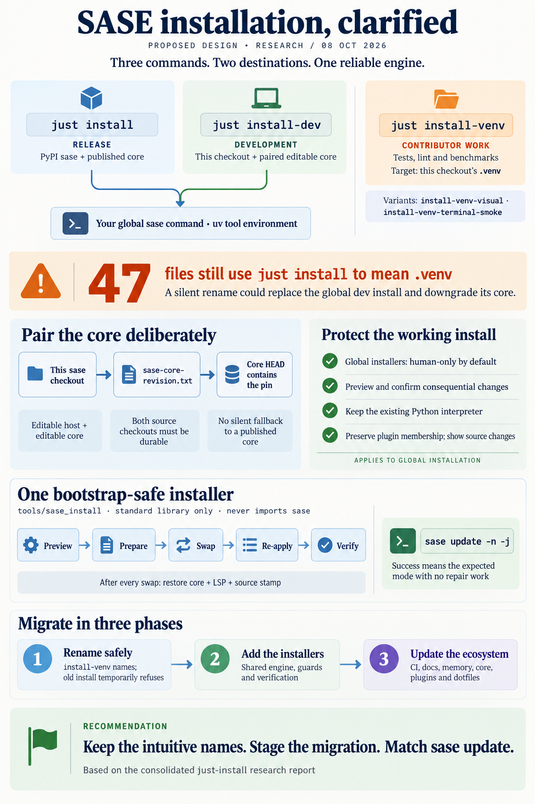

# `just install` (PyPI), `just install-dev` (this checkout + paired core), `just install-venv` (the checkout's venv)

> **Research query:** How should sase add `just` commands that reliably install sase from
> PyPI (`just install`) and from a dev/editable install with the appropriate sase-core
> checkout (`just install-dev`), after renaming today's venv `just install*` recipes to
> `just install-venv*` (likely requiring memory-file updates)? Is this plan a good idea,
> would a different approach be better, and which requirement adjustments are justified?
> End with a recommended solution that is intuitive, reliable, and beautiful.



## Bottom line

**Yes: build this, keep your names, and make the change in phases rather than as one
rename.** Several conventions define `install` as "put the program where I run it from":
the GNU standard targets, `cargo install`, `pipx install`, and `uv tool install`. Today
`just install` means "build this checkout's `.venv`". Even `just --list` currently
describes it as `install  # distribution instead.` because only the last comment line is
shown.

There is also a real gap behind the request. Nothing in the repo answers "make my `sase`
command run *this* checkout plus a matching sase-core." That has to work even when the
installed `sase` is broken, which is exactly when you reinstall. Today the gap is filled
outside the repo by the chezmoi `install_sase_github` / `install_sase_google` scripts
(`acei`, `aceii`), and those scripts have drifted.

Why not a rename: `just install` is [load-bearing](#what-exists-today), and everywhere it
means "repair the `.venv`":

- 47 tracked files in this repo
- the CI setup action's default recipe
- the `sase.yml` tool catalog
- doctor and runtime remedy strings
- two memory notes and a generated skill
- Rust triage remedies in sase-core

If the meaning flips silently, an agent following a stale hint would replace the global
editable `sase`, which every agent and the scheduler import, with PyPI wheels. It would
also downgrade `sase-core-rs` from a 0.37.0 local build to a 0.35.x wheel.

**The recommendation in brief:**

- **[Three public names](#recipe-surface).** `install`, `install-dev`, and `install-venv`
  (plus two venv variants), grouped together in `just --list`.
- **[One engine](#pipeline-with-one-engine-and-two-modes).** The two global installers
  are thin recipes over a single bootstrap-safe, stdlib-only tool. It:
  - [runs only for humans, not agents](#safety-contract);
  - shows a preview and asks for confirmation before consequential changes;
  - refuses sources that SASE may delete or reset;
  - chooses the core with the same "checkout contains `sase-core-revision.txt`"
    [rule](#core-pairing-rule-for-install-dev) `sase update` uses;
  - leaves **exactly the install shape `sase update` maintains**, so the two tools
    [never undo each other's work](#what-this-consolidation-adds-beyond-the-five-reports).
- **[Three phases](#migration-plan).** First the rename with a loud placeholder for
  `just install`, then the installers, then the cross-repo cleanup.

## Critique of the plan

### What the plan gets right

- **The verb.** A newcomer who types `just install` expects a working `sase` on `PATH`.
  Building a dev venv is a different job: what GitHub's "Scripts to Rule Them All" calls
  bootstrap/setup.
- **The gap is real.** Bootstrap from nothing, repair a broken install, and "run *this*
  checkout" are all unserved inside the repo.
- **Renaming the venv recipe costs little,** because `_setup` already heals `.venv` on
  every `check` and `test`.

### What is wrong or missing as specified

| # | Problem | Severity |
| --- | --- | --- |
| P1 | **The meaning of the most-used recipe flips.** Old hints keep circulating: transcripts, Rust strings pinned by `sase-core-revision.txt`, already-installed sase versions that print the old remedy, and agent habits. Following one would replace the global editable `sase` and downgrade the core. | High |
| P2 | **`install-dev` from a `sase_<N>` workspace** makes the global `sase` import code from a directory other agents reset and check out to other commits. [Finding 4](#what-this-consolidation-adds-beyond-the-five-reports) shows the core path has the same problem. | High |
| P3 | **"The appropriate sase-core checkout" is undefined.** The code uses three rules today. | Medium |
| P4 | **A second engine drifts from `sase update`.** [Finding 1](#what-this-consolidation-adds-beyond-the-five-reports) makes this concrete: a "correct-looking" dev install gets "repaired" on the next update. | Medium |
| P5 | **Plugins.** uv's `--with` *replaces* the injected set, so a plain `uv tool install --force sase` silently drops your plugins. A plugin that isn't published (`bugyi-chops`) can't resolve from PyPI. | Medium |
| P6 | **Interpreter downgrade** if the installer pins `--python` ([finding 2](#what-this-consolidation-adds-beyond-the-five-reports)). | Medium |
| P7 | **The repo family splits.** The plugin repos also use `just install` to mean their venv (cld), and sase-core prints one remedy string for every repo. | Low–Medium |

### Would I take a different approach

I considered four alternatives and kept your names:

- `install-tool` / `install-tool-dev` with no rename (cld, gem). Zero risk, but the
  backwards default stays forever, and "tool" is uv jargon.
- grk's dispatcher, `just install pypi|dev|venv`, where bare `just install` prints status.
- Wrapping `sase update --to …`.
- Doing nothing and documenting `uv tool install`.

The stale-hint danger is better handled by making a wrong `just install` **loud and
self-correcting** (see the [safety contract](#safety-contract)) than by avoiding the
obvious name. From grk's dispatcher, keep the good part: `-n` shows your current install
and the planned change.

### Rejected alternatives

| Alternative | Why not |
| --- | --- |
| No rename; `install-tool` / `install-tool-dev` | The backwards default stays forever, and "tool" is uv jargon. It is the fallback only if outside automation can't be migrated. |
| grk's dispatcher (`just install pypi\|dev\|venv`) | Bare `install` wouldn't install, it hides `dev` from completion, and it adds a second grammar. Its status idea becomes `-n`. |
| Thin recipes that call `sase update --to …` | Can't bootstrap (refuses outside a uv-tool install), uses `dev_root` rather than this checkout, and behaves differently depending on the installed version. |
| Port the chezmoi script into the Justfile as shell | Untestable, and the three copied venv recipes already show this file's shell drifting. |
| PyPI wheel into `.venv` (`install-venv-prod`) | `just check` would test the release instead of the checkout (mus). |
| Editable core in the receipt (cdx) | Every receipt rebuild re-runs an uncached maturin build, and it diverges from `sase update`'s shape. |
| Exact pin by default, in an installer-owned checkout | Detached checkouts fight `sase update`'s fast-forward and your in-progress core work. With the 6-hourly pin bump, "contains the pin" gives almost the same result. |

## What exists today

_Every fact in this table was verified._

| Fact | Evidence | Consequence |
| --- | --- | --- |
| The three venv recipes are copy-pasted and have drifted: only `install` runs `_setup-required-plugins`. | `Justfile:181`, `:205`, `:258` | Consolidate them into one `_install-venv EXTRAS` and decide the plugin drift deliberately. |
| `_setup` heals `.venv` before `check`, `test`, and `lint`; the default recipe is `just --list`. | `Justfile:60`, `:94` | Few people type the venv install by hand, so a longer name is cheap. The list is the user interface. |
| `just --list` shows the last comment line, so `install` reads `# distribution instead.` and the `rust-*` entries are similarly garbled. | live `just --list` | Use `[doc('…')]`. |
| The CI action defaults `install-recipe: install`, allows only `install\|install-visual`, and pins **just 1.50.0**. `ci.yml` and `telemetry.yml` pass `install-visual` four times. | `.github/actions/setup-sase/action.yml:11`, `:20`, `:62` | mus's claim that "CI never calls bare `just install`" is wrong. A silent flip would make every PR's CI install PyPI sase into the runner's tool environment. just 1.50 also rules out `[arg(flag)]`, which arrived in 1.53. |
| The tool catalog has `install: argv [just, install]`. | `sase/sase.yml:244` | Rename the catalog key. ToolRun duration history restarts under the new name. |
| Remedy strings say `just install` in `core/rust.py:35`, doctor (`checks_runtime_environment.py:114`, `:144`, `:164`; `checks_providers.py:209`), the query facades, `_prepare_completion.py:226`, and `tools/validate_sase_core_rs`, `setup_required_plugins`, and `check_bead_note_migration`. | `git grep` | They need context-aware wording, not just a find-and-replace. |
| Doctor says "Run `just install` in this workspace" whenever the active import root differs from the current checkout. | `checks_runtime_environment.py:154-164` | That is the *normal* state in an agent workspace. The advice is already misleading, and it becomes dangerous after the flip. |
| sase-core's Rust code prints `just install` in 5 triage remedies (`extractors/environment.rs`), `verdict.rs:254`, and `bead/jsonl.rs:920` ("run `just install` to update sase-core"). | linked sase-core | Needs a cross-repo change plus a pin bump. The bead message would become actively wrong: it would install an *older* published core. |
| Memory: `lint_and_test.md` (recipe block, long-commands list, and "you MAY need to run `just install` before `just check`") and `symvision.md` ("run `just install` first"). Skill source `src/sase/macros/skills/sase_monitor.md:113`. Decision `guarded-recipes`: "`test` and `install` are never guarded". | `sase memory read` | Update the notes and skill through `/sase_memory_write`. Decision records are immutable. |
| `sase update -t dev\|pypi` reconstructs the package set from `uv-receipt.toml` and lifts the core version window with an overrides file. It clones and fetches under `update.dev_root`, and it **refuses to run** unless sase was installed with `uv tool` and has a receipt. | `mode_switch/plan.py`, `uv_tool/detect.py`, `sase update --help` | It cannot bootstrap a fresh or broken install, and it never installs "this checkout". |
| Three different "which core?" rules: CI builds *exactly* the pin. `sase update` requires the core to *contain* the pin (`core_pin.core_contains_revision`). The venv recipes ignore the pin and only enforce the pyproject floor, fast-forwarding a clean checkout that is behind. | `docs/rust_backend.md`, `dev_update/core_pin.py`, `Justfile:974-1067` | The installer must pick one rule. |
| The published window is `sase-core-rs>=0.35.0,<0.36.0`; the core checkout is 0.37.0; the pin is `e8606a5`; your primary core's HEAD is `e411a39` (pin + 1). | `pyproject.toml:48`, core `Cargo.toml` | Dev installs must lift the window. An automated job moves the pin to core HEAD every 6 hours, so "contains the pin" is usually almost the same as "is the pin". |
| The `rust-*-uv-tool` recipes exit 0 when the tool environment is missing. | `Justfile:1069-1079` | The installer must treat that as an error. |
| **Your live install:** editable sase plus 4 editable plugins (`sase-github`, `sase-telegram`, `sase-research-artifacts`, and `bugyi-chops` from `bbugyi200`); an unconstrained `sase-core-rs` override; CPython 3.14.7; editable core 0.37.0; the LSP in the tool's `bin/`; no source stamp. | `~/.local/share/uv/tools/sase/` | This is the shape `install-dev` must reproduce. |
| The chezmoi `install_sase_github` script has a fatal sync gate and puts the scheduler (axe) into maintenance mode. But it installs `--with-editable "sase-core-rs @ …"` *and then* runs `rust-install-uv-tool`, so the core is built twice. It runs `cargo install sase-macro-lsp` into `~/.cargo/bin`, which leaves a stale copy that shadows the right one after a switch to PyPI. Its hard-coded plugin set lacks `sase-research-artifacts` and `bugyi-chops`. | chezmoi `home/bin/executable_install_sase_github`, `aliases.sh:17-18` | This script is the real dev installer today. Retire it into `install-dev --sync`. |

## What this consolidation adds beyond the five reports

These findings come from my own verification. Some of them reverse recommendations in
individual reports.

1. **The dev install must leave an *editable* core, built the way `sase update` builds
   it.** `src/sase/main/update_routing.py:90-100` says that "a dev (editable) host always
   pairs with the editable sase-core-rs build, so a wheel-installed core is a clobbered
   environment." The next `sase update` then "repairs" it. Two proposals would produce
   that clobbered state:
   - cld's cached-wheel swap;
   - grk's `rust-install-uv-tool`, which installs a non-editable cached wheel whenever
     the wheel cache has a match.

   cdx's proposal (put an editable core in the uv receipt) would make every rebuild from
   the receipt run an uncached maturin build. Use `rust-dev-install-uv-tool` (or prebuild
   consumption), which is the shape your live install has now.
2. **Never pass `--python` to an existing tool install.** Your live tool environment runs
   CPython 3.14.7. I ran an isolated probe with uv 0.12.23, using temporary `UV_TOOL_DIR`
   and `UV_TOOL_BIN_DIR`:
   - `uv tool install --force --reinstall` kept the existing interpreter;
   - adding `--python 3.13` rebuilt the environment on 3.13.

   cld, gem, and mus all pass `--python 3.12` on every run, which would silently
   downgrade you.
3. **`--force --reinstall` deletes everything uv does not own.** In the same probe, a
   stamp file in the tool environment's root did not survive a reinstall. Your live tool
   environment has no `.sase-core-rs-source.json` at all, and `rust-dev-install` never
   writes one (only `rust-install` does). So the core, the LSP binary, and the source
   stamp must be re-applied *after* every uv swap. The stamp gap also has to be fixed
   before "verify the pairing" can be a real check.
4. **The global `sase` loads its Rust core from inside the sase-core checkout.** In the
   tool environment, `sase_core_rs.pth` points at
   `~/projects/github/sase-org/sase-core/crates/sase_core_py/python`. The
   `sase_core_rs.abi3.so` there was rewritten at 16:50 today, about 1.5 hours after the
   tool's core metadata was written (15:16). This works as designed:
   `prebuild_consumer.py:98-107` copies the extension to that location, and
   `maturin develop` writes there for this mixed Python/Rust layout. It has two
   consequences:
   - the source-lifetime guard must cover the core path, not only the sase checkout;
   - `install-venv` in your primary checkout is not fully isolated from the global tool,
     because its `rust-install` fallback (when the wheel cache has no match) runs
     `maturin develop --release` against the same checkout.
5. **`sase update --to dev` itself can produce the clobbered state.**
   - The mode switch installs the core with `just rust-install-uv-tool`
     (`mode_switch/plan.py:259`).
   - The day-to-day dev update uses `just rust-dev-install-uv-tool`
     (`dev_update/_plan_reconcile.py:102`).

   When the mode switch finds a matching cached wheel, it installs that non-editable
   wheel, so the very next `sase update` "repairs" it again. The new installer should
   follow the dev-update shape, and the mode switch should be aligned to match.

## Changes to your requirements

1. **"Install" means your `uv tool` environment,** the one `sase update` and the plugin
   commands manage. It does not mean `.venv`, pip, or pipx. `just install` reproduces
   exactly what INSTALL.md tells users to do.
2. **The global installers are human-only.** They exit 2 when `SASE_AGENT` is set, unless
   `SASE_GLOBAL_INSTALL_BYPASS='<reason>'` is set. They confirm consequential changes.
   Record this in a new decision.
3. **`install-dev` installs *this* checkout as it is on disk,** and only if both it and
   its core are durable (outside the SASE workspace root). Installing an arbitrary
   `REF`, and "canonical clones under `dev_root`", remain `sase update --to dev`'s job.
4. **"Appropriate sase-core" means the resolved checkout's HEAD contains this tree's
   `sase-core-revision.txt`.** There is never a silent fallback to a published core.
   Without `cargo`, `install-dev` fails with "install rustup, or use `just install`".
5. **The plugin set is preserved;** the mode applies to the whole set (see
   [where the reports disagreed](#where-the-reports-disagreed-and-how-i-resolved-it)).
6. **The result must match what `sase update` maintains,** checked mechanically:
   `sase update -n -j` must report the expected mode and no repair work.
7. **The interpreter is preserved.** `--python` is passed only on a fresh install, or
   when you ask for it.
8. **The migration covers every consumer,** not just memory: CI, the tool catalog,
   doctor and runtime remedies (made context-aware), the sase-core strings, the plugin
   repos, and the chezmoi scripts.
9. **The rename lands with a loud placeholder,** never as a silent flip.
10. **Unchanged:** `uv tool install sase` stays the documented path for people who don't
    have a checkout.

**Non-goals:**

- `just uninstall` (it's one `uv tool uninstall` line)
- side-by-side `sase` and `sase-dev` installs (cdx)
- an editable core in the receipt
- automatic shell, provider, or completion setup
- Windows support for these recipes (they stay POSIX, like the rest of the Justfile)

## Recommended design

### Recipe surface

I prototyped this layout with just 1.58. It uses only `[group]`, `[doc]`, and
`[positional-arguments]`, all of which predate CI's pinned just 1.50.

```text
[install]
install *args               # Install the latest sase release from PyPI as your `sase` command
install-dev *args           # Install this checkout + its paired sase-core as your `sase` command
install-venv                # Set up this checkout's .venv for tests, lint, and benchmarks
install-venv-terminal-smoke # install-venv + real-terminal smoke-test deps
install-venv-visual         # install-venv + visual-snapshot test deps
```

```just
sase_install := "uv run --no-project --quiet --python '>=3.12' " + justfile_directory() / "tools/sase_install"

[group('install')]
[doc('Install the latest sase release from PyPI as your `sase` command')]
[positional-arguments]
install *args:
    @{{ sase_install }} pypi "$@"

[group('install')]
[doc('Install this checkout + its paired sase-core as your `sase` command')]
[positional-arguments]
install-dev *args:
    @{{ sase_install }} dev --sase-core-dir "{{ sase_core_dir }}" "$@"

[group('install')]
[doc("Set up this checkout's .venv for tests, lint, and benchmarks")]
install-venv: (_install-venv "dev")
# install-venv-visual / install-venv-terminal-smoke: (_install-venv "dev,visual") etc.
```

- **Core location.** The Justfile's `sase_core_dir` is passed in, so its carefully
  workspace-scoped lookup order stays the only source of truth.
- **Flags.** These are parsed by the tool's argparse through `*args`, because just 1.50
  has no `[arg(flag)]`. They mirror `sase update`: `-n/--dry-run`, `-y/--yes`,
  `-q/--quiet`, `-v/--verbose`, `-j/--json`.
  - `install` also takes `--version X` and `--with PKG`.
  - `install-dev` also takes `--core PATH`, `--with PKG`, `--keep-plugin-sources`,
    `--sync`, and `--force`.
- **`--sync`** reproduces acei's fatal sync gate. It fast-forwards the sase, core, and
  plugin checkouts and aborts before changing anything if one is dirty or has diverged.
  Without `--sync`, `install-dev` never pulls.
- **Existing recipe names stay.** `rust-install-uv-tool` and `rust-dev-install-uv-tool`
  keep their names, because installed sase versions call them by name. Give them `[doc]`
  and a `[group('rust')]` while you're there.

### Semantics

| | `just install` | `just install-dev` | `just install-venv*` |
| --- | --- | --- | --- |
| Target | uv tool environment (`$(uv tool dir)/sase`) | uv tool environment | `./.venv` (or the configured `venv_dir`) |
| sase from | PyPI: latest, or `--version` | `-e` this Justfile directory, as on disk | `-e .[dev…]` |
| Core from | the release's dependency metadata (a wheel) | resolved `sase_core_dir`, pin contained, **editable**, built with `rust-dev-install-uv-tool` | unchanged: `SASE_CORE_WHEEL`, or the local build |
| Plugins | receipt set, all from PyPI; unpublished editable plugins stay editable, with a warning | receipt set; editable where a durable sibling or linked checkout exists, otherwise PyPI | `plugins.required` (today's behavior) |
| Needs | `uv` (Rust is not needed on wheel platforms) | `uv`, `git`, `cargo` | unchanged |
| Repeat run | no-op when already current (`✓ already installed`) | no-op when the receipt and core source identity match | unchanged |
| Guards | agent refusal; confirm consequential changes | agent refusal; confirm; durable-source check (sase **and** core) | none, as `guarded-recipes` intends |

Python edits in a dev install take effect immediately. Rust edits need a rebuild:
re-running `just install-dev` or `sase update` is the documented path. An editable core
also picks up any rebuild of that checkout
([finding 4](#what-this-consolidation-adds-beyond-the-five-reports)), so the summary line
should say exactly that.

### Safety contract

- **Agent refusal (exit 2):**
  `✗ just install won't run inside a SASE agent — it replaces the global sase every agent and the scheduler run.`
  It is followed by two remedy lines:
  - to repair this workspace: `just install-venv`
  - if the user asked for a global reinstall: propose it with `/sase_gate`

  This also neutralizes stale `just install` hints from the Rust triage strings and older
  binaries.
- **Durable source (exit 2, `install-dev`):** refuse when the sase root or the core root
  resolves under the SASE workspace state root. Print the exact command to run from the
  durable checkout: `just -f ~/projects/github/sase-org/sase/Justfile install-dev`.
- **Consequential-change prompt:** the plan panel marks a mode flip, a retarget, a
  downgrade, or plugin changes with ⚠ and asks `[y/N]`. With no TTY and no `-y`, it
  prints the plan and exits 2. A human typing an old `just install` while on a dev build
  sees `sase-core-rs 0.37.0 local → 0.35.x PyPI ⚠ downgrade` before anything happens.
- **Exit codes match `sase update`:** 0 = success or no-op, 1 = failure, 2 = refusal or
  usage error, 130 = interrupted.

### Core pairing rule for install-dev

```text
pin  := <this checkout>/sase-core-revision.txt  (working tree, 40-hex; missing/malformed → ✗)
core := --core PATH | SASE_CORE_DIR | Justfile sase_core_dir (linked → sibling ../sase-core)
1. core missing           → plan row "clone sase-org/sase-core (HTTPS) → ../sase-core", default branch
2. pin object missing     → git fetch; still missing → ✗ "pin not on the core remote"
3. pin ⊄ HEAD, clean+behind → plan row "fast-forward sase-core <a> → <b>" (existing refresh tool)
4. pin ⊄ HEAD otherwise   → ✗ with two exact remedies (pull/switch the core, or --core PATH)
5. pin ⊆ HEAD             → ✓ "sase-core e411a39 (pin e8606a5 + 1)"; dirty → ⚠ row, allowed
then: validate_sase_core_rs_version (window note when ahead) → build → check_sase_core_rs_bindings
```

`SASE_ALLOW_STALE_CORE=1` remains the explicit escape hatch for bisects. A pair produced
that way never gets the normal "healthy" success line (cdx).

### Pipeline with one engine and two modes

```text
preflight ─► plan ─► confirm ─► prepare ─► lock ─► swap ─► re-apply ─► verify ─► restart ─► summary
```

1. **Preflight.** Agent and durable-source guards; check that `uv`, `git`, and `cargo`
   are present; read the existing receipt and its interpreter with stdlib `tomllib`.
2. **Plan.** Compute mode, sources, the plugin set, and the ⚠ rows. `-n` stops here. It
   doubles as the "what am I running?" view grk wanted.
3. **Prepare.** Before changing anything, do the fallible work: core refresh and pin
   check, and the prebuild cache lookup. Write restore metadata in the mode-switch
   backup style.
4. **Lock.** Take the same code-swap lock `sase update` uses (`~/.sase/locks/code-swap-v2.lock`).
5. **Swap.** Run
   `uv tool install --force --reinstall <host> <reconstructed --with …> --overrides <file>`.
   The argv must be *identical* to `sase.uv_tool.commands.build_reinstall_set` for the
   same inputs; a parity test with fixture receipts enforces this. Pass no `--python`
   unless this is a fresh install.
6. **Re-apply.** For dev: run `just rust-dev-install-uv-tool` (or consume the prebuild).
   It must **fail**, not exit 0, if the tool environment is missing. Install the LSP into
   the tool's `bin/`. Write the source stamp *last*, after fixing `rust-dev-install` to
   emit it.
7. **Verify.** Run from a neutral cwd with `PYTHONPATH` unset, using the tool's
   interpreter directly:
   - sase and core import from the expected roots;
   - `sase core health -j` passes;
   - the bindings check passes against this tree;
   - the stamp equals the identity captured before the build;
   - `sase version -j` reports an editable host whose `source_root` is this checkout;
   - `sase lsp --version` works;
   - `sase update -n -j` reports the expected mode with **no repair or reconcile work**.

   `sase doctor` is only a suggested next step, because provider authentication is not
   install health.
8. **Restart.** Restart the scheduler through the newly installed `sase`, only if it was
   running.
9. **Failure.** Exit 1, name the failed step, and print the exact restore command. Don't
   claim rollback that wasn't implemented and tested (cdx).

**Engine location:** `tools/sase_install`, an extensionless stdlib script like its
neighbors `setup_required_plugins` and `sase_core_wheel_cache`. It must **not import
`sase`**, because cld confirmed that `sase.uv_tool` pulls in `rich`, `yaml`, and the
config stack. It calls the existing tools as subprocesses: `refresh_linked_checkout`,
`validate_sase_core_rs_version`, `_sase_core_source_identity.py`, `sase_core_wheel_cache`,
and `check_sase_core_rs_bindings`. Test it with unit tests for the plan and guards, the
receipt parity test, and a slow hermetic integration test under temporary `UV_TOOL_DIR`
and `UV_TOOL_BIN_DIR`.

### What it looks like

Follow `sase update`'s visual language: a rounded panel, `✓ ⠼ ○` step rows with
durations, plain append-only lines when stderr is not a TTY, and `-j` for JSON. The
versions and timings below are illustrative.

```text
╭─ just install-dev · your `sase` → this checkout (editable) ─────────────────────╮
│ sase           ~/projects/github/sase-org/sase        master @ 3412a9f · clean  │
│ sase-core-rs   ~/projects/github/sase-org/sase-core   master @ e411a39          │
│                contains pin e8606a5 (sase-core-revision.txt) · +1 commit         │
│ plugins        sase-github ✎  sase-telegram ✎  sase-research-artifacts ✎        │
│                bugyi-chops ✎                         ✎ editable sibling checkout │
│ python         3.14.7 (kept)                                                     │
│ target         ~/.local/share/uv/tools/sase          currently: dev @ 0ac86ad    │
╰──────────────────────────────────────────────────────────────────────────────────╯
```

```text
╭─ just install-dev ──────────────────────────────────────────────────╮
│ ✓ Preflight              uv 0.12.23 · cargo · pin ok          0.3s │
│ ✓ Prepare sase-core      prebuild hit · e411a39               0.2s │
│ ✓ Code-swap lock         1 agent runner warned                0.0s │
│ ✓ Install package set    uv tool · 5 editable                 8.2s │
│ ✓ Install core + LSP     sase-core-rs 0.37.0 (editable)       0.9s │
│ ✓ Verify                 health · bindings · update agrees    1.4s │
│ ✓ Restart scheduler      pid 41210 → 41388                    2.0s │
╰──────────────────────────────────────────────────────── 13.0s ─╯
✓ sase now runs this checkout (3412a9f) with sase-core e411a39 (pin e8606a5 + 1)
  Python edits are live · after Rust edits: just install-dev · back to the release: just install
```

The mode flip from [P1](#what-is-wrong-or-missing-as-specified), made visible:

```text
╭─ just install · your `sase` → PyPI ──────────────────────────────────────────╮
│ sase           dev 0.17.1 (editable)  →  0.17.1   PyPI                        │
│ sase-core-rs   0.37.0 local build     →  0.35.4   PyPI   ⚠ downgrade          │
│ sase-github    editable               →  0.4.2    PyPI                        │
│ bugyi-chops    editable               →  stays editable · not on PyPI         │
│ ⚠ Replaces your editable install from ~/projects/github/sase-org/sase.        │
╰───────────────────────────────────────────────────────────────────────────────╯
Install? [y/N]
```

If an activated `.venv` shadows the newly installed tool on `PATH`, say so and print the
managed executable's path (cdx). Never edit shell startup files.

### Relationship to sase update

- **`just install*`** bootstraps or repairs, and makes your `sase` run *this* checkout.
  It works when `sase` is missing or broken.
- **`sase update`** handles day-to-day pulls and reinstalls.
- **The handoff is checked mechanically** in
  [step 7](#pipeline-with-one-engine-and-two-modes).
- **Later convergence:**
  1. `sase update --to dev` runs `just install-dev -y` in the dev checkout instead of its
     own core step. That leaves one engine for building a dev install and fixes
     [finding 5](#what-this-consolidation-adds-beyond-the-five-reports).
  2. Each plugin repo gets its own `just install-dev`, meaning "inject this checkout,
     editable, into the global tool."

## Where the reports disagreed and how I resolved it

| Question | Positions | Resolution |
| --- | --- | --- |
| **Command surface** | cdx, cld, gem, and mus: the flat names you asked for. grk: `just install` = status dispatcher plus `install pypi\|dev\|venv`, with hyphenated aliases. | **Flat names.** A zero-argument `install` should install. A dispatcher hides `dev` from recipe tab-completion and `--list`, and it doubles the grammar. |
| **Agent guard** | cld, grk, gem: refuse when `SASE_AGENT` is set. mus: leave the recipes unguarded and print a banner. cdx: silent. | **Refuse with exit 2 unless an explicit bypass variable is set.** mus conflated two mechanisms. `guarded-recipes` is about *routing* runs through `sase tool run`; this is a guard against *mutating the host*. |
| **Confirmation** | cld: preview and confirm every run. grk: confirm on mode switch. gem: confirm when the core is dirty. | **Confirm only consequential changes:** mode flip, retarget to another checkout, downgrade, plugin removal or conversion, or a dirty core. Fresh installs and same-mode refreshes don't prompt. With no TTY, a consequential change, and no `-y`: print the plan and exit 2. |
| **Ephemeral source** | cdx, cld: refuse a source under the managed workspace root. gem: refuse when the cwd matches `sase_\d+`, for both installers. grk: no check. | **`install-dev` only.** Check the *resolved path* against the workspace state root (`workspace_provider/store.py::_default_state_root`), for the sase source **and** the core path. A human's PyPI install from a workspace leaves no reference to it, so allow it. |
| **Which core** | cdx: explicit path, then an associated checkout containing the pin, then an installer-owned checkout at the exact pin. cld: checkout containing the pin by default, `--core pin` for an exact-pin worktree, `--core pypi`. grk: contains the pin; fast-forward if clean and behind; fail if dirty and behind. gem: exact pin, running `git checkout <sha>` in your checkout. mus: the pin, falling back to the published floor when there's no checkout or toolchain. | **"HEAD contains the pin," as `sase update` requires,** using the Justfile's `sase_core_dir`. **Reject mus's fallback:** dev installs fail closed rather than silently using a published core. **Reject gem's checkout:** it would detach your branch, and `sase update` skips detached checkouts (`dev_update/_plan_roots.py:163-164`: "checkout is detached"). **Defer exact-pin builds** (see [open questions](#open-questions-for-you)). |
| **How the core is installed** | cdx: editable core requirement in the receipt plus an `-e` override (its probe validated the resolver). cld: build first, swap in a cached wheel after uv. grk: `rust-install-uv-tool`. gem: `rust-dev-install-uv-tool`. | **gem's choice, for cdx's reason (stay in agreement with `sase update`):** `rust-dev-install-uv-tool` or prebuild consumption, giving an editable core ([finding 1](#what-this-consolidation-adds-beyond-the-five-reports)). Build the artifacts before the swap where the prebuild cache allows. |
| **Plugins** | cdx: keep each plugin's source; don't convert. cld: the receipt decides; dev makes plugins with a sibling checkout editable; PyPI keeps unpublished plugins editable. grk: receipt plus `plugins.required`. gem: `plugins.required` plus a hard-coded `sase-telegram`. mus: `--with`. | **The receipt decides membership; the mode decides source,** matching `sase update --to` (cld). A dev host with released plugins, or the reverse, is the mixed state most likely to break. `--keep-plugin-sources` opts out (cdx). A fresh install puts in only the host and suggests any missing `plugins.required`. **Reject the hard-coded set.** |
| **Engine** | cdx, cld, grk, gem: one standalone tool under `tools/`. mus: delegate to `sase update`. grk: delegate PyPI to `sase update --to pypi` when the install is healthy. cdx: move shared policy into `sase_core`. | **One bootstrap engine, no delegation,** so behavior never depends on which sase happens to be installed. After the swap, call the *newly installed* `sase` for health checks, mode recognition, and restart. It must run without the Rust binding it installs, so the Rust-core-boundary rule does not apply. Keep its pin rule tested against `dev_update/core_pin.py`. |
| **What `install-dev` targets** | All but mus: the uv tool environment. mus: with no argument, a bannered alias of `install-venv`; with a `REF`, materialize sase@REF. | **The uv tool environment.** mus's no-argument form recreates the ambiguity the rename exists to remove. Defer `REF`. |
| **Scheduler restart** | cld, grk: restart if it was running. cdx: no incidental restarts. | **Restart if it was running,** as `sase update` and `acei` already do. Otherwise the scheduler keeps running the swapped-out code. Shell, provider, and completion setup stay out of scope. |
| **Old variant names** | mus: deprecated forwarding wrappers. cld: a placeholder for bare `install` only. grk: a hidden alias until memory catches up. | **Private forwarding wrappers** for `install-visual` and `install-terminal-smoke` for one release. A loud placeholder for bare `install` until phase 2. |
| **The `guarded-recipes` decision** | gem, mus: edit it. grk: update its example. cld: it is immutable; write a new record. | **New record.** Accepted decision records are immutable, and its claim stays true of the venv recipe it meant. |
| **Sequencing** | grk: new capability first, under temporary names. cld: rename plus placeholder first. mus, gem: one cutover commit. | **cld's order.** The placeholder fails loudly. Capability-first would create temporary public names that later have to be retired. |

## Migration plan

**Phase 1: rename (sase, one mostly mechanical PR)**

- `install*` → `install-venv*`, implemented through `_install-venv EXTRAS`.
  - Add the group and `[doc]` attributes.
  - Decide the `_setup-required-plugins` drift for the variants.
  - Keep `[private]` forwarding wrappers named `install-visual` and
    `install-terminal-smoke` for one release.
  - Bare `install` becomes a **placeholder that exits 2** and prints the new names, until
    phase 2.
- CI: the setup action's default becomes `install-venv`, and its allowlist becomes
  `install-venv|install-venv-visual`. Update `ci.yml` and `telemetry.yml`.
- Rename the `sase.yml` catalog key to `install-venv`.
- Update tests: `test_github_actions_setup_sase.py`, `test_justfile_lint.py`,
  `test_justfile_sase_core_dir.py`, `tests/doctor/test_checks_runtime.py`,
  `test_core_rust.py`, and the `test_inline_memory.py` snapshot.
- Make the remedies **context-aware.** One helper picks `sase update`,
  `just install-dev`, or `just install-venv` from how the running sase is installed
  (`uv_tool.detect`, `install_type`). Doctor's "import root differs" warning should
  suggest `.venv/bin/sase` or `just install-venv` for testing this checkout, never a
  global reinstall.
- Update `rust-install`'s "Then rerun `just install`" message.
- Docs: CONTRIBUTING, README, `development.md`, `rust_backend.md`, `tool.md`,
  `monitors.md`, the perf and mobile runbooks. Add an "Installing from a checkout"
  section to INSTALL.md.
- Memory, through `/sase_memory_write`, then `sase memory init`:
  - `lint_and_test.md`: all three sites;
  - `symvision.md`;
  - the skill source `sase_monitor.md`, then redeploy it from a landed revision;
  - a **new** decision record, `global-install-is-human-only`.
  - Leave `guarded-recipes`, historical research reports, and transcripts untouched.

**Phase 2: the installers (sase).** Add `tools/sase_install` and its tests, and replace
the placeholder. Fix `rust-dev-install` so it writes the source stamp and so its
`-uv-tool` variant fails when the tool environment is missing. Align the mode switch's
core step with `rust-dev-install-uv-tool`.

**Phase 3: cross-repo.**

- **sase-core:**
  - triage remedies → `just install-venv`;
  - `bead/jsonl.rs` → "`sase update` (or `just install-dev` from your sase checkout)";
  - then bump the pin.
- **Plugin repos:** `install-venv` becomes the canonical name, with `install` kept as a
  `[private]` alias for one release.
- **chezmoi:** `acei` becomes
  `just -f ~/projects/github/sase-org/sase/Justfile install-dev --sync -y`, and `aceii`
  becomes the same command, with the Google plugins carried by the receipt. Remove the
  `~/.cargo/bin/sase-macro-lsp` copy.

## Acceptance tests

- **PyPI installs:** a fresh PyPI install without Rust; an exact `--version`; dev → PyPI
  with every editable-core override removed and the unpublished plugin kept editable;
  PyPI → dev with sibling plugins converted.
- **Fresh dev install with no core checkout:** clones the sibling, installs a core
  containing the pin, and leaves editable host and core.
- **The update and plugin handoff:**
  - `sase update -n -j` immediately after `install-dev` plans **no** core repair;
  - after a `sase plugin install` or update in dev mode, the local editable core is still
    in place. This is unverified risk: the unconstrained override could let uv pick a
    PyPI wheel.
- **Interpreter and stamp:** an existing 3.14 environment stays on 3.14; the source stamp
  is present and matches after the swap.
- **Guards:** the agent refusal and its bypass; workspace refusal for the sase root
  *and* the core root; a non-TTY consequential change without `-y` exits 2.
- **Core states:** dirty core allowed with ⚠; dirty and behind fails; missing `cargo`
  fails closed; a failed build leaves the old install untouched.
- **Repeat runs and rebuilds:** a second `install-dev` does no native work; a dirty Rust
  edit at the same HEAD triggers a rebuild.
- **Other:** PATH shadowing by an active `.venv`; paths with spaces; two concurrent
  installers serialize on the lock.
- **Unchanged venv lanes:** CI's `SASE_CORE_WHEEL`, visual, and terminal-smoke lanes,
  the tool catalog, and all repair hints still prepare `.venv` after the rename.

## Open questions for you

1. **Plugin conversion in `install-dev`.** I recommend matching `sase update --to dev`:
   plugins with a sibling checkout become editable, with `--keep-plugin-sources` to opt
   out. cdx preferred keeping each plugin's source by default. Which do you want?
2. **Exact-pin builds.** Do you want an exact-pin mode (`--core pin`) in v1 for CI
   parity and bisects? It needs provenance tracking so `sase update` doesn't silently
   move the core off the pin. I'd defer it; `SASE_ALLOW_STALE_CORE` covers bisects today.
3. **Fresh-install plugins.** Should a fresh `just install` also add this project's
   `plugins.required`? I recommend installing only the host and printing a suggestion,
   since the runtime required-plugins gate already exists.
4. **Isolating the global core.** Should the global tool's core stop being editable, for
   example by installing an immutable wheel, so that `.venv` builds and prebuild copies
   into the checkout can't change it live
   ([finding 4](#what-this-consolidation-adds-beyond-the-five-reports))? That changes
   `update_routing`'s contract, so it is a separate decision, not part of this feature.

## Recommended solution

1. **Keep your names.** `just install` installs from PyPI, `just install-dev` installs
   this checkout plus its paired sase-core, and
   `just install-venv` / `install-venv-visual` / `install-venv-terminal-smoke` set up the
   checkout's venv. Group them under `[group('install')]` with `[doc]` one-liners that
   name the destination.
2. **[One engine](#pipeline-with-one-engine-and-two-modes).** Implement the two global
   installers as thin recipes over a bootstrap-safe, stdlib-only `tools/sase_install`
   that never imports `sase`. It shares argv with `sase.uv_tool.commands` (enforced by a
   parity test) and mirrors `sase update`'s flags, visuals, and exit codes.
3. **[Safety first](#safety-contract).**
   - Refuse to run inside agents, with an explicit bypass.
   - Confirm consequential changes; fail closed without a TTY.
   - Refuse ephemeral sase *or core* sources for `install-dev`.
   - Never pass `--python` to an existing environment.
4. **[Pair the core](#core-pairing-rule-for-install-dev) the way `sase update` does:**
   the resolved checkout's HEAD contains `sase-core-revision.txt`; fast-forward only when
   the checkout is clean and behind; fail closed otherwise. Never fall back to a
   published core.
5. **Produce `sase update`'s dev shape exactly:**
   - the receipt-reconstructed package set with the unconstrained core override;
   - an editable core built by `rust-dev-install-uv-tool` or the prebuild cache;
   - the LSP in the tool's `bin/`;
   - a source stamp written last.

   Prove it with core health, the bindings check, a stamp match, and a
   `sase update -n -j` that plans no repair. Restart the scheduler if it was running.
6. **[Ship in three phases](#migration-plan).** The rename with a loud placeholder and
   context-aware remedies; then the installers; then sase-core strings, plugin repos, and
   retiring `acei`/`aceii`. Record the human-only rule as a new decision rather than
   editing `guarded-recipes`.

The result: `just install` finally means what everyone assumes, `just install-dev`
replaces the drifting dotfile scripts with a reproducible install that `sase update`
agrees with, and `just install-venv` honestly names the contributor loop.

## Sources

_Consolidated report · 2026-10-08 · merges the cdx, cld, grk, mus, and gem reports with
independent verification · sase @ `3412a9f1bd` · sase-core pin `e8606a5` · primary
sase-core checkout @ `e411a39`_

- **Researcher reports in this directory:**
  - `__cdx.md`: uv resolver/receipt probe, source-lifetime and update-preservation
    contracts
  - `__cld.md`: blast-radius census, chezmoi audit, just 1.50 constraints, guardrails
  - `__grk.md`: dispatcher alternative, capability-first rollout
  - `__mus.md`: `smoke/pypi` as a reliability blueprint, flag-day framing
  - `__gem.md`: cold-start framing, agent-workspace hazard
- **Verified locally for this report:**
  - `Justfile`, `.github/actions/setup-sase/action.yml`, `sase/sase.yml`,
    `src/sase/mode_switch/plan.py`, `src/sase/dev_update/{core_pin,_plan_reconcile,prebuild_consumer}.py`,
    `src/sase/main/update_routing.py`, `src/sase/uv_tool/{overrides,commands}.py`,
    `src/sase/doctor/checks_runtime_environment.py`, `tools/require_tool_run`,
    `sase update --help`, and `just --list`;
  - the live `~/.local/share/uv/tools/sase/` (receipt, `pyvenv.cfg`, `sase_core_rs.pth`,
    dist-info) and the core checkout's in-tree extension;
  - linked sase-core (`bead/jsonl.rs`, `tool_run/triage/*`, `Cargo.toml` profiles);
  - chezmoi `executable_install_sase_github` and `aliases.sh`;
  - memory: `decisions:guarded-recipes`, `lint_and_test.md`, `symvision.md`;
  - an isolated uv 0.12.23 probe (temporary `UV_TOOL_DIR`/`UV_TOOL_BIN_DIR`) showing
    interpreter preservation without `--python`, interpreter replacement with it, and
    root-file loss on `--force --reinstall`;
  - a just 1.58 prototype of the `[group('install')]` listing.
- **External:**
  - [GNU standard Makefile targets](https://www.gnu.org/software/automake/manual/html_node/Standard-Targets.html)
  - [GitHub "Scripts to Rule Them All"](https://github.blog/engineering/scripts-to-rule-them-all/)
  - [uv tools concepts](https://docs.astral.sh/uv/concepts/tools/) and
    [CLI reference](https://docs.astral.sh/uv/reference/cli/)
  - [maturin local development](https://www.maturin.rs/local_development)
  - [just attributes](https://just.systems/man/en/attributes.html)
