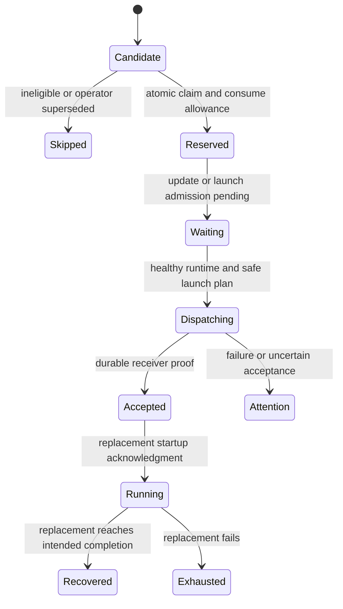

# Recovering SASE agents after a live runtime update

Independent research by **cdx** · 2026-10-09

## Judgment

**Yes: automatic recovery is a good idea for confirmed runtime skew, provided it is a bounded, host-owned recovery operation that preserves evidence.** It should be a safety net alongside making live updates safer. I would not implement a general “error string matched, dismiss, submit the prompt” rule.

The important distinction is between replacing a broken SASE process and repeating an agent's work. The first can repair mixed imports. The second can duplicate edits, external actions, launches, or finalizers. A reliable design has to address both.

I recommend **at most one automatic replacement per logical launch unit**, restricted initially to SASE-owned import failures with independent evidence of a runtime update and a healthy replacement runtime. Reuse the semantic prompt reconstruction behind `,x`, but introduce a non-destructive recovery execution path. Retain the old attempt, replace its visible active row only after the new launch is durably accepted, and notify the user with an explanation, preserved evidence, replacement identity, and an explicit retry limit.

This report contains proposed behavior, not implemented code. I independently inspected the local SASE checkout and the linked Rust core, checked primary documentation, and ran a disposable import-skew experiment. I did not consult any peer report, peer transcript, or peer finding. I did not inspect the individual failed agents' logs; therefore the precise failure stage and affected count remain unverified.

## 1. What the source establishes

Research baseline: SASE commit `6f6754f97db91a80c105b52d7719f31c29814173`; linked `sase-core` commit `6df3bed385c2fcfc3a807edaccc4ad19b673e371`. References below point to these inspected revisions unless explicitly identified as history.

### The reported symbol was deliberately removed

Local Git history shows that commit `9fd8a081f45689655249b7bf6ed7b561de65b8bf`, authored on October 9, removed `auto_launch_prefix` from `sase.monitor.continuation_delivery`. Its callers were migrated to structural inheritance of the live autonomy record. The parent revision still had a deferred import of that helper inside `run_agent_runner_refresh._reconcile_prompt_with_live_auto_state`, as well as an import in monitor followup code. [Removal](https://github.com/sase-org/sase/commit/9fd8a081f45689655249b7bf6ed7b561de65b8bf), [historical refresh caller](https://github.com/sase-org/sase/blob/d7c495855154f1e3ff62beec3a16e56cd8b9de86/src/sase/axe/run_agent_runner_refresh.py#L109).

That provides a concrete mechanism: an old caller remains loaded in memory while a later import reads a newer module that no longer exports the old helper. The inverse is possible too: a newly loaded caller requests a new symbol from an older module already cached in memory. Python checks its module cache before loading modules. [Python import cache](https://docs.python.org/3.12/reference/import.html#the-module-cache).

**Inference:** the supplied error is strongly consistent with this specific live-update boundary. It is not proof of which caller failed. In particular, the historical refresh caller makes a failure before provider execution plausible; the exact traceback is needed to distinguish that from a later continuation failure.

The current code has migrated the relevant imports. A fresh process should resolve a coherent current pair of modules if installation has finished successfully. The right health check is whether the **current caller and runtime** work together—not whether the removed helper can still be imported.

### SASE already has partial defenses

| Existing seam | Observed behavior | Implication |
| --- | --- | --- |
| `axe/source_skew.py` | Snapshots the source revision in process memory; explains an import/attribute exception chain when the checkout HEAD changed; preloads the SDD, bead, selected post-gate modules, and selected plugin entry points. | Reuse this evidence model, but persist it and narrow it before authorizing recovery. The explanation is a heuristic, not a replay-safety decision. |
| `axe/run_agent_runner_refresh.py` | Re-execs after a blocking dependency wait when the editable source identity changed; restores one-shot prompt/name/macro inputs and reconciles live autonomy. | A good safe-boundary precedent. It covers a dependency wait, not every later update or necessarily an update during a runner-capacity wait. |
| `dev_update/code_swap_lock.py` | Writer lock protects the swap against short blocking readers; long-lived agent readers are advisory. | Recovery should wait for the writer to finish, without holding a lock for an agent's entire lifetime. |
| `dev_update/code_swap_guarded_exec.py` | A bootstrap executed by filename waits for the lock before importing SASE, then execs a fresh command. | An existing model for keeping a recovery launcher out of stale imported code. |
| `axe/run_agent_runner_errors.py` | Records error summary and traceback in a failed marker; matching provider retry configuration prints advice to relaunch. | Runner failures are observable, but this layer does not automatically relaunch them. |
| `axe/run_agent_exec_retry.py` | Handles provider execution retries, waits, quotas, fallback models, workspace preservation, and optional fresh children. | This has useful handoff primitives, but different policy and failure boundaries. |

Sources: [source-skew defenses](https://github.com/sase-org/sase/blob/6f6754f97db91a80c105b52d7719f31c29814173/src/sase/axe/source_skew.py), [refresh](https://github.com/sase-org/sase/blob/6f6754f97db91a80c105b52d7719f31c29814173/src/sase/axe/run_agent_runner_refresh.py), [swap locking](https://github.com/sase-org/sase/blob/6f6754f97db91a80c105b52d7719f31c29814173/src/sase/dev_update/code_swap_lock.py), [guarded bootstrap](https://github.com/sase-org/sase/blob/6f6754f97db91a80c105b52d7719f31c29814173/src/sase/dev_update/code_swap_guarded_exec.py), [runner error recording](https://github.com/sase-org/sase/blob/6f6754f97db91a80c105b52d7719f31c29814173/src/sase/axe/run_agent_runner_errors.py), [provider retry loop](https://github.com/sase-org/sase/blob/6f6754f97db91a80c105b52d7719f31c29814173/src/sase/axe/run_agent_exec_retry.py).

A subtle issue: top-level imports in `run_agent_runner.py` occur before its protected `main` execution. A crash there may never create `done.json`. Also, a source-skew crash can damage the error-reporting path itself. Observing only clean failed markers will miss some of the failures this feature targets. [Runner entry point](https://github.com/sase-org/sase/blob/6f6754f97db91a80c105b52d7719f31c29814173/src/sase/axe/run_agent_runner.py#L14).

### The existing restart is stronger than dismissal

`agent/relaunch_prompt.py` already contains `prepare_kill_and_edit_prompt`, which handles forced name reuse, serial session attachment, role suffixes, phase associations, and clan membership. The TUI captures and reconstructs the exact selected prompt before dismissal and uses a cleanup barrier to prevent late old cleanup from racing the new launch. [Prompt reconstruction](https://github.com/sase-org/sase/blob/6f6754f97db91a80c105b52d7719f31c29814173/src/sase/agent/relaunch_prompt.py#L101), [TUI flow and barrier](https://github.com/sase-org/sase/blob/6f6754f97db91a80c105b52d7719f31c29814173/src/sase/ace/tui/actions/agent_workflow/_entry_relaunch.py#L246).

The CLI restart planner shares that rewrite, but it has a narrower input contract: it requires a raw prompt, refuses multi-segment/fanout prompts and container names, and injects a reusable identity when needed. Its executor snapshots a recovery bundle, stops or dismisses the row, **wipes reserved name state**, and launches from home. The wipe can remove original artifact directories and dismissed bundles and can stop live artifacts in its related closure. A preserved prompt/metadata bundle is not a complete preservation of the run's evidence. [CLI planning](https://github.com/sase-org/sase/blob/6f6754f97db91a80c105b52d7719f31c29814173/src/sase/agent/_restart_planning.py), [execution](https://github.com/sase-org/sase/blob/6f6754f97db91a80c105b52d7719f31c29814173/src/sase/agent/_restart_execute.py), [wipe contract](https://github.com/sase-org/sase/blob/6f6754f97db91a80c105b52d7719f31c29814173/src/sase/agent/names/_wipe.py#L49), [wipe execution](https://github.com/sase-org/sase/blob/6f6754f97db91a80c105b52d7719f31c29814173/src/sase/agent/names/_wipe_execute.py#L46).

**Do not implement this by calling the current CLI restart executor for every match.** Share its read-only preflight and identity semantics where appropriate; add an explicit recovery mode that supersedes one failed attempt without erasing its evidence or touching sibling work.

### Fresh-process retry infrastructure is useful but insufficient

`run_agent_retry_spawn.py` carries original prompt, transcript, plan, role, model/provider, workspace, and retry ancestry into a detached child. It reconciles `%auto` with the live record and links the old attempt to the child. However, it is invoked inside the running provider retry loop, depends on mutable in-process state, transfers a live parent's workspace claim, and falls back to in-process retry when spawning fails. It also builds a continuation/fork prompt rather than reproducing `,x` replay. [Retry handoff](https://github.com/sase-org/sase/blob/6f6754f97db91a80c105b52d7719f31c29814173/src/sase/axe/run_agent_retry_spawn.py).

A runtime-skew recovery must work after the parent has died, including home-mode runs and failures before the provider loop. It must never fall back to repeating the operation inside the known-skewed process. Keep its budget separate from provider retries so the two mechanisms cannot independently relaunch the same failed attempt.

### A small experiment corroborated the mechanism

I created two disposable modules. The old caller lazily imported `auto_launch_prefix`; after importing the caller, I replaced both source files with a compatible new pair using a different function. Calling the old in-memory caller produced `ImportError: cannot import name 'auto_launch_prefix'`, even after `importlib.invalidate_caches()`. A fresh Python subprocess returned `current-compatible-pair`.

This verifies the mixed-generation mechanism, not the exact incident or production recovery. No SASE source was changed. In-place reload is also unsuitable: external references and existing class instances can retain old definitions, and extension modules have additional reload limits. [Python reload caveats](https://docs.python.org/3.12/library/importlib.html#importlib.reload).

## 2. Explicit adjustments to the requirements

1. **Change “restart exactly once when a pattern matches” to “attempt at most one automatic replacement when the match and safety checks pass.”** Literal exactly-once process creation cannot be promised by a check-then-spawn sequence across crashes. Use durable deduplication and receiver adoption; when acceptance is uncertain, report uncertainty rather than launch another possible duplicate. A failed preflight need not start anything.
2. **Make the budget belong to the original logical launch unit/turn.** It survives host restarts, name reuse, provider retry children, and repeated detection. A serial session's later independent turn can have its own budget; the session is not limited to one recovery forever. A replacement does not acquire a new automatic-recovery allowance for the same original request.
3. **Preserve intent and the selected concrete unit rather than promising literal prompt-byte identity.** `,x` already rewrites identity. Live autonomy choices and launch metadata must survive too. Show the exact rewritten prompt and an explanation of metadata changes. Do not rewrite the task body or add model fallback merely because the runtime failed.
4. **Treat dismissal as a presentation result, not deletion.** Keep the original attempt, traceback, logs, transcript, launch inputs, and workspace evidence. Dismiss/supersede its default inbox row after replacement acceptance. Never use a broad name wipe as automatic cleanup.
5. **Restrict initial automatic replay to work proven safe to repeat.** Before provider/workflow execution, an unchanged submission is generally the appropriate repair. After execution began, preserving files does not prove that external actions are safe to repeat. Use an existing explicit continuation/checkpoint when available; otherwise leave the failure visible with a prepared manual relaunch. This is a deliberate safety restriction, not silently retrying fewer errors.
6. **Make notifications thorough on opening and concise in the inbox.** One understandable summary, with a structured recovery report and precise actions, is more useful than dumping a traceback into a toast.
7. **Add runtime coherence prevention to the scope of the design.** Recovery should not be the only support for updating while agents run. Use fresh imports at safe boundaries now and immutable runtimes as the long-term fix.

AWS's idempotency guidance supports the durable request-key/adoption pattern; its retry guidance emphasizes that a failed call may already have caused side effects and that retries should be bounded and coordinated at one layer. Applying those principles to SASE is a design inference, not an assertion that arbitrary agent tools are idempotent. [Idempotent API design](https://aws.amazon.com/builders-library/making-retries-safe-with-idempotent-APIs/), [retry and jitter guidance](https://aws.amazon.com/builders-library/timeouts-retries-and-backoff-with-jitter/).

## 3. Detection policy: narrow patterns plus independent evidence

A pattern is a candidate classification, never authorization by itself. All automatic cases need:

- A terminal failure of a concrete SASE agent runner, with process identity proving the old runner is gone and cleanup has settled. A failed marker alone can precede process exit.
- A fatal exception chain attributable to SASE runtime code or an explicitly registered SASE plugin runtime, not the user's program, test output, prompt, tool transcript, or ordinary provider response.
- An independently observed relevant runtime-generation change, not merely the word “update” in an error or a recent unrelated repository commit.
- A compatible current runtime that passes a bounded fresh-process preflight after the update writer finishes.
- A reconstructable single launch unit, unchanged ownership, an unused recovery allowance, and a safe replay/continuation boundary.

### Candidate patterns and exclusions

| Candidate | Decision | Additional evidence |
| --- | --- | --- |
| `ImportError: cannot import name '…' from 'sase.…'` | **Initial allowlist family.** Include the reported `auto_launch_prefix` incident without special-casing that symbol as the whole policy. | Relevant generation changed; runtime traceback; fresh current caller imports successfully; safe stage. |
| Same missing-export error for a registered plugin module | Support when plugin provenance is available; otherwise diagnose only initially. | The particular plugin changed, its import origin belongs to the recorded plugin runtime, and the current compatible plugin/host pair loads. |
| `ModuleNotFoundError: No module named 'sase.…'` or known plugin submodule | Eligible after the same evidence gates. | Distinguish an old cached caller referencing a moved module from a truly missing dependency or broken new install. |
| `AttributeError: module 'sase.…' has no attribute '…'` | A conservative extension after import-error rollout. | Target is a module and access site is a known runtime API boundary; object-model attribute errors stay excluded. |
| `sase_core_rs is importable but does not expose binding '…'` | Conditional, initially observation-only until core-generation evidence exists. | Old loaded extension/new Python mismatch; fresh extension has the binding and passes the current wire/version checks. If fresh still lacks it, restart will not help. |
| Runtime API `TypeError`, e.g. unexpected keyword/missing argument | Diagnose initially. Add only named, structured compatibility cases with fixtures. | Broad TypeError matching would classify ordinary application bugs as update skew. |
| `SyntaxError`, circular/partially-initialized import messages, undefined symbols or ABI loader errors | Diagnose initially. | These often indicate a broken release, dependency failure, or import cycle. A narrowly identified interrupted swap may later qualify; do not generalize from the exception class. |
| `NameError`, arbitrary `AttributeError`, `ValueError`, assertions, failing tests | **No automatic recovery under this policy.** | Usually defects in the task or runtime; a source update somewhere is not enough. |
| HTTP 429/5xx, context overflow, provider timeout/auth/quota | **Use existing provider policy.** | Avoid a second retry engine and unexpected additional paid attempts. |
| SIGTERM/user kill, explicit cancellation, rejected plan, intentional stop, completed gate/monitor handoff | **Never resurrect.** | Operator intent and existing lifecycle ownership take precedence. |
| OOM/SIGKILL, timeout, disappeared PID, disk full, permission failures | **No import-skew restart by default.** | A fresh process can repeat resource exhaustion; missing process state is not evidence of skew. |
| Commit/publish/finalizer error, gate answer dispatch, accepted plan publication, uncertain continuation delivery | **No raw prompt replay.** | Reconcile the specific operation's durable receipt/checkpoint first. |

`ImportError` includes `ModuleNotFoundError`; exception serialization should retain the most specific type. Traverse chained causes/contexts with a bound and cycle detection. Match known message shapes at the fatal diagnostic boundary, with bounded text and explicit module-origin attribution. Namespace prefixes alone are inadequate: a user project can have confusing names, and logs can contain copied tracebacks.

### Runtime identity must become durable

Persist at launch, before booting mutable SASE imports, a `runtime_generation` record containing host source/build identity, installation mode, Python executable/runtime location, core extension build identity, and registered plugin distribution identities/import origins. For editable installs, HEAD is useful but insufficient: dirty source changes, reinstalling a core wheel without changing HEAD, and plugin-only updates must be distinguishable. Use a generation manifest/build fingerprint rather than mtimes as identity.

Persist an update journal event with old/new generation and successful installation status. Publish a generation as healthy only when the host/core/plugin compatibility check succeeds. A failed update must not become permission to restart everything.

The existing source-skew snapshot is process-local and focused on the host checkout. Extend it into structured error evidence with at least exception type, target module/symbol, causal chain, failure stage, boot generation, observed current generation, and error fingerprint. Preserve human traceback text as an attachment.

For already running legacy agents with no boot-generation record, an update journal overlapping their actual lifetime plus an exact known SASE traceback at a provably pre-execution site can support a constrained migration classifier. **Missing stage or ownership evidence means no automatic replay.** On installation, watch new failures and reconcile unfinished recovery records; do not sweep years of historical failures merely because they match a string. An explicit historical recovery sweep can be a later operator action.

## 4. Recommended architecture

### Put decisions in Rust; keep process operations in the host

Shared eligibility, exception classification, generation comparison, recovery-budget transitions, and lineage policy belong in `sase_core`. Python should collect observed facts, execute bounded subprocesses, persist through established stores, launch, and publish notifications. The TUI renders state and exposes controls. This follows the project's required Rust backend boundary; a web/mobile/CLI frontend must see the same decision.

Add a thin facade and typed wire contract for recovery decisions. Update PyO3 registration and the host's `sase-core-revision.txt` pin when implementation lands. Keep schema evolution additive where compatible; do not let the recovery path itself require an unavailable newer binding and then recurse indefinitely. The core's existing continuation delivery state machine provides a precedent for reserved identity, dispatching, receiver proof, and attention on ambiguous ownership. Reuse those concepts rather than pretending every recovery is a monitor. [Core continuation delivery](https://github.com/sase-org/sase-core/blob/6df3bed385c2fcfc3a807edaccc4ad19b673e371/crates/sase_core/src/continuation/delivery.rs).

### One host recovery reconciler, independent of the TUI

Use an event-triggered service job with a bounded reconciliation backstop, compatible with the existing SASE service/AXE infrastructure. Do not scan all logs on every TUI refresh, and do not require the TUI to be open.

The dying process can publish evidence, but must not be the only component responsible for recovery. A fresh host worker—launched through the guarded, minimal bootstrap—reconciles candidates. A long-lived Python scheduler can itself retain old imports; asking that stale scheduler to import the new recovery implementation defeats the purpose. Either restart the relevant host worker after update or have it delegate processing to a fresh, generation-identified subprocess.

The host process supervisor should associate launch identity with exit status and a bounded fatal stderr diagnostic for pre-`main` failures. Prefer an early structured bootstrap error envelope. A recovery record must still be possible when normal `done.json`/notification writing failed. If the origin or terminal state cannot be established, report it and stop.

Use an index of pending failure candidates, explicit pulses, and capped reconciliation batches. The current configuration already uses filesystem triggers and quiet-time backstops for agent wait resolution. This is a pattern to follow, not a reason to put recovery inside wait checks. [Existing scheduler configuration](https://github.com/sase-org/sase/blob/6f6754f97db91a80c105b52d7719f31c29814173/src/sase/default_config.yml#L1370).

### Durable operation identity and state

Key recovery by the **original concrete launch-unit ID**, with host/project scope and `kind=runtime_refresh`, not display name, error text, or PID. Store it outside an old attempt directory that a manual wipe could remove. A provider retry descendant retains this original launch identity and the same runtime-recovery allowance.

Suggested record fields, not an existing schema:

```json
{
  "schema_version": 1,
  "recovery_id": "runtime-refresh:<original-unit-id>",
  "original_unit_id": "<stable-id>",
  "failed_attempt_id": "<immutable-attempt-id>",
  "reason_code": "runtime_import_skew",
  "failure_fingerprint": "<normalized-diagnostic-digest>",
  "boot_generation": "<generation-id>",
  "replacement_generation": "<healthy-generation-id>",
  "allowance_consumed": true,
  "state": "reserved",
  "launch_request_id": "<deterministic-recovery-request-id>",
  "replacement_attempt_id": null,
  "notification_id": null,
  "evidence_ref": "<durable-record-reference>"
}
```

State transitions:



`Waiting` carries a bounded deadline and distinguishes update wait from ordinary capacity/dependency wait. A child can be accepted/queued before it is running; the notification must reflect that. A planned request is not a successful spawn, and a running child is not a recovered task.

The atomic reservation consumes the one allowance before mutation. Reconciliation resumes **the same operation**; it never creates a fresh recovery ID after an exception. Preflight before reservation can be repeated as read-only observation. A definitely unspawned error can only be retried if it remains the same deduplicated launch operation and no second physical agent attempt is created; keep that transport distinction out of the user's retry count. Ambiguous spawn acceptance moves to attention.

Existing direct typed launches persist request IDs, plan digests, input context, and per-unit admission receipts. Use this durable funnel where suitable, extending its recovery provenance and acceptance reconciliation as needed. Its existence is not evidence that all local spawn crash windows are already exactly-once. [Typed launch bundle](https://github.com/sase-org/sase/blob/6f6754f97db91a80c105b52d7719f31c29814173/src/sase/agent/direct_typed_launch.py#L37), [admission journal/receipts](https://github.com/sase-org/sase/blob/6f6754f97db91a80c105b52d7719f31c29814173/src/sase/agent/launch_admission_store.py).

### Order operations to retain a useful failure

1. Confirm concrete failed identity and process death, including process start token and owned scope state. Wait for shutdown/cleanup to settle rather than killing anything merely because `done.json` appeared.
2. Resolve and validate the precise prompt and launch context, classify the failure, verify replay safety, wait for update completion, and probe the current runtime. Give the probe an explicit timeout. Do not import/run the removed old helper as the probe.
3. Atomically reserve the one recovery allowance while rechecking old ownership and absence of a manual replacement, cancellation, existing retry child, or competing recovery.
4. Persist complete recovery evidence and a prepared single-unit launch request before changing the old row. Refuse if that durable write cannot be made.
5. Reserve the new attempt identity and transfer logical ownership under a compare-and-swap that requires the expected failed owner. Retain old physical evidence. A manual relaunch winning this race cancels the automatic operation.
6. Reuse standard dependency, queue, provider-enable, project, workspace-occupancy, and launch validation. Never bypass holds or capacity. Do not inherit the recovery worker's current project or autonomy.
7. Obtain durable child acceptance/identity and startup acknowledgment as appropriate. Publish old-to-new linkage, then archive the old default inbox row and retire only its superseded failure alert.
8. Emit the recovery notification through a durable outbox. Reconcile delivery failure without launching again. Track eventual replacement completion or failure; the latter exhausts the allowance and requests attention.

Name ownership and evidence history must no longer be conflated. Preserve the same user-facing logical name when possible, with a new immutable attempt ID. Registry rebuilding and lookup must understand superseded attempts so retained history cannot re-reserve the name. This needs a deliberate domain change; directly deleting an index entry is insufficient if a rebuild rediscovers its historical artifacts.

If that ownership change is too large for the first increment, launch a distinctly named recovery attempt with explicit lineage instead. Clearly label it as the same work and test wait resolution. That is a smaller evidence-preserving compromise than secretly wiping the old name, but it is less faithful to `,x` and should be called out in the product behavior.

### Workspace and side-effect safety

Failure shutdown can pin a workspace for a visible failed run. Dismissal releases it; ordinary launch preparation can change or recreate a checkout. Therefore “edits are preserved” must be supported by an explicit preservation mode and ownership proof, not assumed from the restart prompt. [Shutdown workspace hold](https://github.com/sase-org/sase/blob/6f6754f97db91a80c105b52d7719f31c29814173/src/sase/axe/run_agent_runner_lifecycle.py#L112).

For pre-execution failure, ordinary workspace preparation may be appropriate if no prior owned work exists. For later failures, retain the workspace claim until a verified handover, or preserve an inspectable snapshot before releasing it. Do not reset/reclone a dirty workspace as recovery cleanup, and do not consume the retry worker's workspace.

An automatic agent replay is not globally idempotent. A prompt might send mail, launch a deployment, write a report without overwrite, or submit a finalizer before the runtime fails. Existing receipts for finalization, gate execution, monitor delivery, and launch requests must be inspected at their own boundary. A successfully settled operation is repaired/projected, not repeated. An uncertain operation requires attention. An agent continuation can inspect existing edits, but a prose reminder does not prove duplicate external actions are impossible.

Launch-time macro expansion can itself execute shell substitutions such as `$()`, before a provider ever starts. A safe pre-execution replay therefore also needs frozen evaluated inputs or an explicit replay-safe macro policy. Do not equate an absent provider call with proof that bootstrap performed no external actions. This is especially relevant when reopening a raw prompt causes its macros to expand again.

**Initial safe-stage policy:** auto-replay only `bootstrap/dependency_wait/pre_execution` failures where host lifecycle evidence proves no provider or workflow effectful step ran. Do not infer safety from an absent transcript alone. Extend to later stages only when a typed continuation/checkpoint explicitly identifies what remains and relevant host side effects are reconciled. Research/read-only work can later have an explicit replay-safe launch capability, but should not be classified as safe merely from natural-language task wording.

## 5. What should be equivalent to `,x` and submit

Share a headless launch specification that both manual and automatic relaunch can consume. Extract only runtime-neutral logic from the TUI; never instantiate Textual widgets or synthesize keypresses in the recovery job.

Preserve:

- The selected concrete unit's raw task and local macro inputs; distinguish authored/raw, submitted, expanded, and execution prompts.
- Exact session/clan membership, role suffix, phase/bead association, project/VCS/workspace context, and origin provenance.
- Model/provider and explicit effort/queue choices; freeze the effective selection where mutable aliases would unexpectedly change it, and report that choice.
- Live autonomy selection, especially a user turning auto approval off while the failed agent waited. Never restore launch-time `%auto` over the live record.
- The intended tab, hidden state, original dependencies, holds, applicable finalizer selection, and dispatch destination if/when remote recovery is supported.

Do not replay an original fanout/repeat container when one child failed. Reconstruct that child's concrete unit, or refuse with an explanation. Do not restart a clan/session container or relaunch healthy siblings. A session root that already has live continuation work is a reconciliation case, not an invitation to repeat the entire session.

Validate prompt equality at the semantic boundary: task body unchanged, identity rewrite explained, effective metadata equivalent. Add shared fixtures covering the actual TUI path and headless recovery. A single generic `sase run <raw_prompt>` is not sufficient for historical rows, implicit context, one-shot macro inputs, or live metadata.

Wait/watch infrastructure already follows `retried_as_timestamp` in a concrete retry chain, and core scanning indexes retry metadata. Reuse consistent linkage and update actual dependency resolution as well as display. A transient recovery should present as pending/queued work, never as success; a second failure becomes terminal attention. Test named, timestamp/ref-based, session, and clan waits independently. [Wait-watch chain handling](https://github.com/sase-org/sase/blob/6f6754f97db91a80c105b52d7719f31c29814173/src/sase/agent/wait_watch/_classify.py#L171), [Rust scan wire](https://github.com/sase-org/sase-core/blob/6df3bed385c2fcfc3a807edaccc4ad19b673e371/crates/sase_core/src/agent_scan/wire.rs).

Start with local agents. A remote machine must detect and own recovery of its own runtime, with a globally unambiguous original unit identity; local runtime skew does not authorize remote re-execution. Federation acceptance uncertainty should remain under the existing operation-receipt policy.

## 6. Notification and visual design

The experience should communicate: **SASE noticed, made one careful recovery attempt, preserved the evidence, and will stop if it fails again.** It should feel calm and accountable.

### Inbox summary

Example copy, after child startup acknowledgment:

> ↻ Restarted `research.47.cdx` after a SASE update · attempt 1/1  
> A runtime import failed across the update. The replacement is running with the same task and model. The failed attempt is saved.

Before startup, say **“Replacement queued”** or **“Waiting for update to finish”**. Do not say “recovered” at `Popen` success. If generation attribution is incomplete, say “suspected runtime mismatch” in the diagnostic; do not describe a merely correlated update as proven cause.

Use a single recognizable recovery glyph where the surface supports it, the established neutral/info accent while recovery runs, and warning/error prominence only when action is required. Do not mark the actual agent task green until it completes. Text communicates the state independently of color. Keep the row in its existing tab and preserve keyboard focus; never mount or overwrite the user's prompt input.

### Opened report

A compact summary followed by structured facts provides the thoroughness the user requested:

```text
SASE agent restart                                      1 / 1

research.47.cdx · same task · same model · running

Why
  A SASE runtime import failed after the installed source changed.
  ImportError: cannot import name 'auto_launch_prefix' from
  'sase.monitor.continuation_delivery'

What SASE did
  Confirmed the failed runner had exited.
  Checked the replacement runtime after the update completed.
  Relaunched the selected agent's prompt once.
  Saved the original failure and linked the replacement attempt.

Continuity
  Original attempt       <timestamp / immutable ID>
  Replacement            <timestamp / immutable ID>
  Runtime                <old generation> → <new generation>
  Provider / model       <recorded selection>
  Session / project      <recorded context>
  Prompt                 Task unchanged; identity metadata refreshed
  Workspace              <verified preservation or fresh preparation>

Limit
  No further automatic runtime restart for this launch.
```

Only render checks actually completed. If the original never started provider execution, say so; if work may already have occurred, describe the verified continuation and its limits. Include full traceback, exact submitted/relaunch prompt, operation timeline, original/new metadata, and workspace evidence as attachments or report details. Avoid exposing environment secrets; structured recovery inputs should be allowlisted rather than a full environment dump.

Desired actions are **Open replacement**, **Inspect failure**, **View relaunch prompt**, and **Stop replacement**. Stopping targets the exact accepted child identity and suppresses any further automated resurrection. Opening a dismissed original must resolve through preserved attempt identity, not the name now owned by the child.

There is already a generic `ViewReport` notification with validated structured blocks and live-report/inline-snapshot fallback, plus `JumpToAgent` and file attachments. Use this existing report surface for the first implementation. Multiple bespoke action buttons require presentation/action plumbing; they are a desired enhancement, not assumed capabilities of today's report schema. [Structured report loader](https://github.com/sase-org/sase/blob/6f6754f97db91a80c105b52d7719f31c29814173/src/sase/notifications/report.py), [block builders](https://github.com/sase-org/sase/blob/6f6754f97db91a80c105b52d7719f31c29814173/src/sase/chops/report.py), [existing completion actions](https://github.com/sase-org/sase/blob/6f6754f97db91a80c105b52d7719f31c29814173/src/sase/axe/run_agent_runner_finalize.py#L416).

### Failure, grouping, and delivery

If the replacement fails, send **“Automatic restart failed; no further retry”**, with both errors, generations, preserved context, and manual recovery options. If launching fails, say **“Restart could not be started”** and keep the useful failure visible. If acceptance is uncertain, explain exactly that and offer inspection; never encourage blind immediate relaunch.

Use deterministic notification/event IDs keyed to recovery identity and transition. Persist notification delivery separately from launch; retrying notification delivery must not trigger a second agent. Existing notification `dedup_key`/upsert can avoid multiple rows, but repeated upserts append corroboration; reconciliation must not append a duplicate occurrence on every poll. [Notification upsert](https://github.com/sase-org/sase/blob/6f6754f97db91a80c105b52d7719f31c29814173/src/sase/notifications/store.py#L200).

For several failures caused by the same runtime update, retain a complete per-agent report while grouping interruptive presentation into one update incident: “4 agents restarted after the SASE update; 1 needs attention.” Add per-agent outcomes as actual events arrive. Do not hide an exhausted failure in a cheerful aggregate. Reuse plus-one/corroboration for distinct occurrences, with explicit outcome details; an append-only count alone is not a current recovery-status report.

The generic report action currently is not classified as an error merely from its body tone. Ensure exhausted/launch-uncertain recovery notifications participate in the shared attention/error classification across TUI, CLI, and mobile, rather than relying on a red heading inside `ViewReport`. [Priority classification](https://github.com/sase-org/sase/blob/6f6754f97db91a80c105b52d7719f31c29814173/src/sase/notifications/priority.py).

## 7. Preventing the failure is better than repeatedly repairing it

| Approach | Strength | Cost / limitation | Recommendation |
| --- | --- | --- | --- |
| More eager imports and temporary compatibility exports | Can reduce a known incident quickly. | Incomplete across plugins/lazy paths; eager imports can add startup cost and import side effects; compatibility exports can preserve obsolete semantics. | Tactical help only. Do not restore old autonomy behavior blindly. |
| Re-exec at safe pre-execution boundaries | Already partly implemented; obtains a coherent interpreter before meaningful work. | Needs one-shot input and identity preservation; cannot replay a live effectful operation safely. | Extend and harden now, including admission waits. |
| Shared lock held for every agent's lifetime | Prevents source mutation beneath agents. | Long runs block updates, directly conflicting with the desired workflow. | Reject. Use short bootstrap/swap locks instead. |
| In-place reload/cache deletion | Appears cheap. | Does not rebind every old reference or safely refresh extension modules and active objects. | Reject for automatic repair. |
| Immutable runtime generation per process | Prevents mixed source, extension, plugin and dependency generations; new launches can use the update immediately. | Requires generation packaging, retention, launcher changes, and compatibility discipline for shared stores. | Preferred long-term foundation. |
| One-shot host recovery | Repairs residual unexpected skew; actionable evidence. | Replaying work and crash-safe ownership are real complexity; does not make arbitrary tasks idempotent. | Build the constrained safety net alongside prevention. |

An immutable runtime can be a per-generation environment backed by frozen host/plugin packages and a compatible core wheel, with a launcher pointer selecting the generation for new processes. Merely switching a symlink to a still-mutable source directory or copying only the main `sase` package does not freeze dependencies. Existing processes keep the old generation until they and their monitors/gates no longer need it; retention must use durable ownership, not just the original agent PID.

This lets agents survive an update naturally rather than all switching immediately. At a continuation/safe boundary, use the current healthy generation through a fresh process. Shared durable data schemas need additive/backward-compatible migration while old and new generations coexist. Record the generation on every process/attempt so notifications and diagnostics can explain what actually ran.

No automatic recovery should install packages, roll back releases, or run global install recipes. If the fresh-runtime health check fails, the right outcome is a clear installation/compatibility diagnostic and a prepared agent prompt, not spending the one retry on the same broken environment.

## 8. Validation and rollout

The valuable tests are behavior and crash invariants, not tests that merely assert a regex exists.

- **Known incident:** keep a caller loaded, change its dependency/caller source pair, fail with the supplied missing-export shape, then verify one fresh child and preserved old evidence. Also test both old-caller/new-module and new-caller/cached-old-module directions.
- **Classifier negatives:** matching text in user prompts, provider transcripts, subprocess/test failures, and quoted logs must not restart the agent. Unchanged generation, unrelated plugin updates, broken current installs, cancellation, successful handoffs, OOM, and ordinary application exceptions remain excluded.
- **Early crash:** fail a top-level runtime import before `main`, with no `done.json`; correlate supervisor evidence and produce one candidate. No correlation means attention, not inferred permission.
- **Replay stages:** pre-execution failures restart; post-tool/finalizer/gate dispatch failures do not raw-replay. Test completed and uncertain external/host operations explicitly.
- **Durability:** two workers see the same failure; a crash after reservation, before spawn, immediately after spawn, before receiver acknowledgment, and after acknowledgment before notification. A host restart never grants a new allowance or produces duplicate child processes.
- **User race:** manual `,x`, dismissal, cancellation, name reassignment, or a newer session turn occurs during automatic preparation. The exact identity fence protects the user's new work.
- **Continuity:** same semantics as manual prompt reopening for named/unnamed launches, aliases, session members/roots, clans, local macros, live auto-off, selected model/effort, queue weight, tab, home mode, and concrete children of fanout/repeat launches. Verify unsupported cases are explicit refusals.
- **Workspace:** dirty files/untracked files and held claims survive the selected recovery mode; no cleanup mutation reaches siblings or unrelated workspaces.
- **Dependency semantics:** consumers stay pending through recovery, follow the accepted successor, observe its real eventual outcome, and do not interpret the failed predecessor as success.
- **Notifications:** one actual delivery per transition, report fallback when live evidence is unavailable, correct queued/running/recovered wording, accessible status, valid jump/stop identities, grouped incidents without swallowed attention, and no prompt-widget interruption.
- **Performance:** bounded worker batches, incremental/indexed reads, capped logs/exception chains, subprocess timeout, ordinary capacity admission, and no blocking work on the Textual event loop.

Existing tests around source skew, runner refresh, restart planning/execution, retry-spawn lifecycle, and runner workspace holds provide fixtures to extend. Rust classification/state/ownership tests and binding round trips are required too. This report did not run the production test suite because it changed no product code; the disposable experiment is the only executed behavioral verification.

A sensible introduction is observation-only first: persist classifier decisions and reasons, then compare candidate decisions with real failures. Enable automatic recovery for the strict pre-execution import-skew family after the evidence and crash tests pass. Expand individual pattern families based on witnessed recoveries and negative fixtures. Do not broaden to “all ImportError/AttributeError” just to improve apparent recovery counts.

Use a permanent user preference such as `agent_recovery.enabled` if users should be able to disable automatic replay, with the maximum fixed at one for this policy. The observed mode can be an operational rollout choice. A temporary beta flag is only appropriate when an unfinished implementation must be exposed under the project's feature-flag rules; a lasting preference should not be disguised as a removable flag. After validation, enabled by default for proven-safe cases matches the user's stated intent.

Measure classified candidates, eligibility/refusal reasons, accepted replacements, startup failures, exhausted attempts, successful eventual task completions, duplicate prevention, launch uncertainty, and notification delivery delays. A false-positive recovery matters more than a high restart rate. Bound a same-generation failure burst, share/cache healthy-generation preflight where appropriate, and let normal queue admission plus modest persisted jitter avoid a restart stampede. Thresholds should come from observation, not unexplained constants.

## 9. Recommended solution

Implement **one durable host-owned recovery operation for a confirmed SASE runtime mismatch**, initially limited to fatal SASE import failures at a proven pre-execution boundary. Persist runtime-generation and failure-stage evidence early, launch the recovery worker with fresh imports after update completion, and require a healthy compatible current runtime before spending the one allowance.

Share the prompt reconstruction and validation semantics behind `,x`; use a **non-destructive replacement mode** with a new immutable attempt ID, preserved logical identity, preserved evidence, coherent dependency linkage, and exact ownership checks. Keep failure history available and archive the old default row only once replacement acceptance is established. Coordinate with provider retries and host operation receipts so the same failure cannot be relaunched twice or repeat a settled action.

Notify through the existing structured report surface with concise inbox copy, full causal evidence, the exact replacement status, preserved inputs, and a clear **1/1** limit. A second failure or uncertain acceptance becomes visible attention with no further automatic restart.

In parallel, strengthen fresh-process entry at safe boundaries and move toward **immutable runtime generations** so updating SASE while agents run is supported by construction. Automatic recovery then becomes the reliable, understandable exception path—not the mechanism on which every live update depends.
