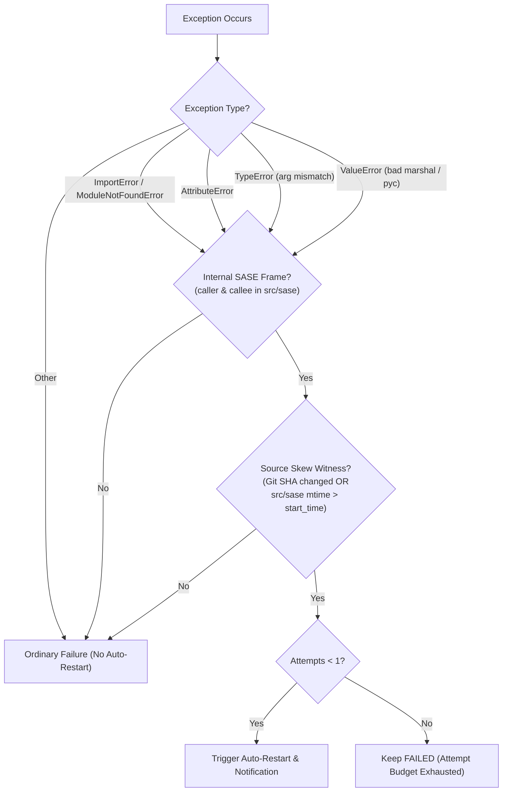

# Resilient Agent Execution: Auto-Recovery & Relaunch on Live Code Updates

**Author:** Researcher gem (`research.47.gem`)  
**Date:** October 2026  
**Status:** Completed Research & Architectural Proposal  
**Artifact Target:** `research:202610/live_update_agent_failure_autorestart__gem.md`  

---

## Executive Summary

During active software engineering workflows on SASE, an agent failure occurred with the following signature:
```text
ImportError: cannot import name 'auto_launch_prefix' from 'sase.monitor.continuation_delivery'
```

This failure was triggered by updating the local SASE codebase (e.g., via `git pull`, branch switching, or `just install-dev`) while agent runner processes were actively executing. Because SASE typically operates in an editable installation environment (`pip install -e`), modifying Python modules on disk while processes are running causes in-memory module caches (`sys.modules`) to desynchronize from disk state. When code in a running process subsequently attempts a deferred import or reaches code requiring a newly introduced symbol, Python crashes with an `ImportError` or `AttributeError`.

The proposed solution—automatically detecting such update-skew failures, dismissing the failed agent, and relaunching it exactly once in a manner analogous to the manual TUI `,x` (kill-and-edit) followed by `<ctrl+g><enter>` workflow—is **fundamentally sound and highly valuable**, but requires **rigorous architectural guardrails**.

Without careful design, an automatic restart mechanism can inadvertently:
1. **Discard extensive in-flight work** if applied naively to agents that failed late in their execution lifecycle.
2. **Trigger restart storms** when a batch of agents fails simultaneously upon an update.
3. **Loop indefinitely or fail repeatedly** if an update introduced a persistent syntax error or uncompiled Rust extension (`sase_core_rs`).
4. **Trigger false positives** on user-space import errors inside test suites.

This research analyzes the root cause, critiques the proposed plan, establishes precise error pattern matching rules, designs an intuitive notification and TUI experience, and provides a comprehensive implementation architecture.

---

## 1. Root Cause Analysis: How Live Updates Break Running Agents

### 1.1 The Editable Install Mechanics
SASE development environments use editable installs (`python -m pip install -e .` or setuptools `.pth` link files). In this mode:
- The Python runtime loads source files directly from the working checkout (`src/sase/`).
- Python does **not** copy files to an isolated `site-packages` directory at run time.
- Any file mutation on disk immediately affects subsequent file accesses by any running Python interpreter.

### 1.2 Python Module Caching & Lazy Imports
Python executes imports lazily and caches module objects in `sys.modules`:
1. When a process boots, it imports initial bootstrap modules (e.g. `sase.axe.run_agent_runner`, `sase.llm_provider._invoke`).
2. `sase.monitor.continuation_delivery` was imported early during initial turn setup or LLM invocation. At that timestamp (prior to commit `61febdcc6`), `auto_launch_prefix` did not exist in `continuation_delivery.py`.
3. Later, the developer or an automated workflow pulled commit `61febdcc6` (`fix(monitor): propagate auto approval to followups`). This commit added `def auto_launch_prefix` to `continuation_delivery.py` and added `from .continuation_delivery import auto_launch_prefix` to `src/sase/monitor/followup.py`.
4. When the running agent completed its main turn and reached follow-up or monitor settlement (`settle_monitor_followup` / `launch_followup_agent`), it imported `followup.py`.
5. `followup.py` requested `auto_launch_prefix` from `sase.monitor.continuation_delivery`.
6. Python checked `sys.modules['sase.monitor.continuation_delivery']`, found the **already-loaded in-memory module object from before the commit**, looked for `auto_launch_prefix`, failed to find it, and raised:
   ```text
   ImportError: cannot import name 'auto_launch_prefix' from 'sase.monitor.continuation_delivery'
   ```

### 1.3 Why SASE is Especially Vulnerable
SASE workflows feature long-lived, multi-phase processes:
- **Dependency & Runner Slot Queuing:** Agents can spend minutes to hours in `%wait` states before execution begins.
- **Multi-Turn & Monitor Supervisions:** Agent sessions spawn monitors, wait for human gates, and trigger follow-up turns across hours.
- **Frequent Developer Iteration:** SASE developers run agents while actively coding on the SASE repository itself.

SASE previously implemented two partial mitigations:
- `src/sase/axe/run_agent_runner_refresh.py`: Calls `os.execv()` to re-execute the runner process if a git HEAD change is detected, **but only after a blocking dependency wait**. If an agent is actively running or already past its wait, it never re-execs.
- `src/sase/axe/source_skew.py`: Detects source checkout revision changes (`snapshot_source_revision()`) and explains errors, but **only uses this to annotate SDD epic launch errors** (`code_swap_explanation`), without attempting recovery.

---

## 2. Critique of the Proposed Plan

### 2.1 Strengths of the Plan
- **Mimics Proven Human Behavior:** When this failure occurs, developers instinctively highlight the failed row on the Agents tab, press `,x` (kill-and-edit), and submit the pre-populated prompt without edits. Automating an established manual remediation is standard operational excellence.
- **Bounded Risk:** Restricting auto-restarts to **exactly once** guarantees that if an update contains a genuine code bug, the system will not enter an infinite restart loop.
- **Zero-Cognitive Overhead:** Developers do not need to babysit the Agents tab after running `git pull` or `just install-dev`.

### 2.2 Critical Risks and Deficiencies
A naive implementation would introduce serious failure modes:

| Risk | Description | Failure Scenario |
| :--- | :--- | :--- |
| **Work Loss & State Contamination** | Blithely restarting from the raw initial prompt discards partial work. | An agent modified 5 files and drafted a plan over 20 minutes, then failed on monitor settlement. Relaunching from scratch in a dirty workspace causes merge conflicts or duplicate edits. |
| **The "Broken Build" Trap** | An update that requires compilation (`cargo build` for `sase_core_rs`) or has a syntax error will fail again immediately. | All 8 running agents fail, restart simultaneously, fail again, consuming unnecessary tokens and spamming notifications. |
| **Restart Storms (Thundering Herd)** | If an update occurs during a large batch run, dozens of agents may fail simultaneously. | 20 agents fail within 2 seconds. If all 20 restart immediately, they contend for workspace allocations, runner slots, and LLM rate limits. |
| **False Positives on User Space Code** | Agents frequently run `pytest`, `python -m unittest`, or custom scripts in client repositories. | A test in the user's project fails with `ImportError: cannot import name 'UserAuth'`. If misclassified, SASE would discard the agent's run instead of letting the agent fix the test. |

### 2.3 Recommended Requirement Adjustments
1. **Progress-Aware Recovery Strategy:**
   - **Phase 1 Failure (Startup/Bootstrap, 0 tool calls / 0 commits):** Full clean restart (wipe workspace, re-claim, run raw prompt).
   - **Phase 2 Failure (In-Flight / Post-Edit):** Preserve workspace edits and fork/continue using `#fork:<agent_name>` or resume delivery rather than blind wipe, if possible; otherwise, cleanly reset workspace from clean VCS state.
2. **Dual-Witness Pattern Matching:** Require **both** an error signature (e.g. `ImportError`) **and** concrete evidence of code change (`source_skew` HEAD change or package file `mtime` shift) before triggering an auto-restart.
3. **Persisted Retry Ledger:** Store retry attempts in `agent_meta.json` (`auto_restart_attempt: 1`) so that restart counts survive process deaths, TUI restarts, and filesystem reloads.
4. **Coalesced Notifications:** If multiple agents restart within a 5-second window, emit a single grouped summary notification alongside individual row markers to avoid UI notification flooding.

---

## 3. Error Pattern Catalog: What to Check For

To ensure high reliability and zero false positives, pattern detection must analyze the **exception type**, the **traceback frames**, and the **environment witness**.

### 3.1 Targeted Error Patterns



#### Pattern 1: Missing Name or Module (Classic Update Skew)
- **Signature:** `ImportError: cannot import name '.*' from 'sase\..*'` or `ModuleNotFoundError: No module named 'sase\..*'`
- **Mechanics:** A module added or modified in a new commit is imported by code that expects it, but the parent module in `sys.modules` is stale, or an existing module was moved.

#### Pattern 2: Attribute Skew on Cached Module
- **Signature:** `AttributeError: module 'sase\..*' has no attribute '.*'`
- **Mechanics:** Module `A` did `import sase.B`. Module `B` was loaded prior to the update. After the update, `A` accesses `sase.B.new_function()`. Because `B` was not reloaded, Python raises `AttributeError`.

#### Pattern 3: Call Signature / Argument Drift
- **Signature:** `TypeError: .*() takes \d+ positional arguments? but \d+ (were|was) given` or `TypeError: .*() got an unexpected keyword argument '.*'`
- **Constraint:** Must originate wholly within `sase.*` internal call frames.
- **Mechanics:** A function definition changed its signature in the new commit, but the caller or callee was loaded under the old revision.

#### Pattern 4: Bytecode and Marshal Desynchronization
- **Signature:** `ValueError: bad marshal data (unknown type code)` or `EOFError` during import or `SystemError: <built-in function __import__> returned a result with an exception set`
- **Mechanics:** Occurs when Python reads a `.pyc` or `.py` file while `git` is actively writing to it during a checkout or pull operation.

#### Pattern 5: Rust Core Extension ABI Desynchronization
- **Signature:** `AttributeError: module 'sase_core_rs' has no attribute '.*'` or `ImportError: cannot import name '.*' from 'sase_core_rs'`
- **Mechanics:** The Python adapter was updated to call a new Rust binding method, but `sase-core-revision.txt` or `just install-dev` has not yet recompiled the shared library. (Note: restart may fail if unbuilt, but bounded by 1 attempt).

### 3.2 False-Positive Elimination (The "Dual-Witness" Rule)
An error is classified as an **Auto-Restartable Update Skew** if and only if **all three** conditions are satisfied:
1. **Exception Match:** The exception matches one of Patterns 1–5.
2. **Traceback Boundary:** The topmost frame of the exception and the frame where the exception was raised both reside in the `sase` package directory. Any exception raised inside subprocess tools (e.g. `sase tool run`, `pytest`, `git`) is strictly excluded.
3. **Environment Witness (Skew Proof):**
   - **Signal A (Git HEAD):** Current `git rev-parse HEAD` of the SASE source checkout differs from `_startup_revision` recorded at process boot (using `src/sase/axe/source_skew.py`).
   - **Signal B (Filesystem mtime):** The `.py` file named in the traceback has an `mtime` strictly greater than the agent's `run_start_time`.
   - **Signal C (Direct Package Marker):** Any SASE package file modified within the last 15 minutes while the agent was running.

---

## 4. Architectural Design: Auto-Dismiss & Relaunch Pipeline

### 4.1 Where Should Recovery Live? (Layering & Ownership)

There are two primary locations where recovery could execute:
1. **Inside the Agent Runner Process (`run_agent_runner.py`):**
   - *Pros:* Immediate, headless, works when the TUI is closed.
   - *Cons:* If the update broke module imports required by `run_agent_runner` itself or if Python process memory is badly corrupted, the runner cannot execute recovery.
2. **Inside the ACE TUI (`sase.ace.tui`):**
   - *Pros:* Matches the exact `,x` + `<ctrl+g><enter>` workflow, operates outside the dying agent's process space, has full access to TUI modals, toasts, and prompt reconstruction.
   - *Cons:* Only operates if ACE is open.

#### The Recommended Hybrid Architecture: "Runner First, ACE Watcher Fallback"
- **Primary Lane (In-Runner Self-Recovery):**
  When `run_agent_runner.py` catches an unhandled exception in `main()`, it calls `evaluate_auto_restart(exc)`. If eligible, it records the failure, atomicity-transfers the workspace claim, detached-spawns the replacement child using `spawn_detached_child()`, writes a `FAILED (RETRIED)` marker to `done.json`, sends a rich recovery notification, and terminates.
- **Secondary Lane (ACE Watcher Safety Net):**
  If an agent crashes so abruptly that it cannot execute its own shutdown (e.g., top-level syntax error on runner startup), the ACE Agents tab polling engine (`_loading_refresh_polling.py`) observes the dead agent with an update-skew signature. ACE performs the automated `,x` equivalent: dismisses the dead row and submits the resolved prompt through `_finish_agent_launch`.

```mermaid
sequenceDiagram
    participant Runner as run_agent_runner (Agent PID)
    participant Disk as Disk (agent_meta / done.json)
    participant Skew as source_skew Detector
    participant Notif as Notifications Store
    participant NewRunner as New Child Agent (PID 2)
    participant ACE as ACE TUI (Agents Tab)

    Note over Runner: Agent running turn...
    Note over Disk: Developer runs git pull / update
    Runner->>Runner: Lazy import fails (ImportError)
    Runner->>Skew: evaluate_auto_restart(exc)
    Skew-->>Runner: MATCH: UpdateSkew (old_sha != new_sha, attempts=0)
    
    rect rgb(30, 40, 60)
        Note over Runner: Execute Auto-Dismiss & Relaunch
        Runner->>Disk: Write done.json (outcome=failed, status=FAILED (RETRIED), retry_category=update_skew)
        Runner->>Disk: Write retry_handoff.json (prompt, context, attempt=1)
        Runner->>Notif: append_notification(sender="agent.recovery", action="JumpToAgent")
        Runner->>NewRunner: spawn_detached_child(prompt, extra_env={RETRY_ATTEMPT: 1})
    end
    
    Runner->>Runner: sys.exit(0)
    
    Note over NewRunner: Fresh Python process boots with NEW code on disk
    NewRunner->>Disk: Claims workspace, writes running.json
    
    ACE->>Disk: Polls roster & notifications
    ACE->>ACE: Displays toast: "Auto-Restarted Agent @name (PID 2)"
    ACE->>ACE: Renders running agent with "RESTARTED" badge
```



### 4.2 Exact Step-by-Step Relaunch Mechanics

To replicate the `,x` and prompt submission behavior faithfully without requiring human interaction:

#### Step 1: Prompt Resolution & Reauthoring
Use the existing canonical helpers in `src/sase/agent/relaunch_prompt.py`:
1. Read `raw_prompt` from the dying agent's `agent_meta.json` or stored prompt file.
2. Call `prepare_kill_and_edit_prompt(raw_prompt, agent.agent_name, ...)`:
   - For named agents: Preserves name reuse (`%id <name> --force-reuse`).
   - For session members: Preserves session attachment (`session=<session_id>`).
   - For clan members: Preserves clan affiliation while demoting obsolete declarations.
3. Inject the retry tracking directive:
   - Append `%retry(attempt=1, reason="update_skew")` or set environment variable `SASE_AGENT_AUTO_RETRY_COUNT="1"`.

#### Step 2: Dismissal and Workspace Claim Handover
- Avoid workspace release race conditions:
  - If using the in-runner path: Use `transfer_workspace_claim(..., from_pid=old_pid, to_pid=new_pid)` (already supported in `src/sase/running_field/_transfer.py`). This guarantees another queued agent cannot steal workspace `#N` while the old process dies and the new one boots.
  - If using the ACE watcher path: Call `_dismiss_done_agent(agent)` followed by standard launch.

#### Step 3: Clean Process Detachment
- Launch the replacement agent with a fresh Python interpreter invocation:
  ```bash
  python3 -m sase.axe.run_agent_runner ...
  ```
- Because the new process boots *after* the update has landed on disk, all initial and lazy imports load the updated, consistent module set.

#### Step 4: Strict Single-Retry Enforcement
- The spawned child receives:
  `agent_meta["auto_restart_attempt"] = 1`
  `agent_meta["auto_restart_root_timestamp"] = root_timestamp`
- If the child encounters another `ImportError` or code skew error, `evaluate_auto_restart()` inspects `auto_restart_attempt >= 1`, rejects auto-restart, writes `outcome: "failed"`, `status: "FAILED"`, and sends a standard failure alert:
  *"Auto-restart attempt 1/1 failed. Manual intervention required."*

---

## 5. User Experience & Notification Design

The user experience must be **intuitive, reliable, and visually beautiful**. When an agent auto-restarts, the user should be immediately informed of what happened, why it happened, and what the system did to resolve it, with zero alarmist noise.

### 5.1 Notification Specification

```json
{
  "id": "e4b2a8d1-7c91-4e2a-9e12-3a8f5619bc20",
  "timestamp": "2026-10-09T13:14:02-04:00",
  "sender": "agent.recovery",
  "icon": "🔄",
  "color": "#38BDF8",
  "tags": ["recovery", "auto-restart", "agent", "sase-org"],
  "notes": [
    "🔄 Auto-Restarted Agent @bbugyi200.athena.0lj on sase-org",
    "Cause: Framework update skew (ImportError: cannot import name 'auto_launch_prefix')",
    "Source checkout updated (61febdc → 89a10ce) while agent was running.",
    "Action: Cleanly dismissed failed runner (PID 48102) and relaunched with preserved prompt.",
    "New runner: PID 49201 in Workspace #19 • Policy: 1/1 restart attempts used.",
    "Press <enter> or click to inspect the new agent."
  ],
  "files": [
    "/home/bryan/.sase/projects/sase-org/artifacts/ace-run-20261009131402/done.json"
  ],
  "action": "JumpToAgent",
  "action_data": {
    "patch_name": "sase-org",
    "cl_name": "sase-org",
    "raw_suffix": "20261009131402",
    "agent_name": "bbugyi200.athena.0lj"
  }
}
```

### 5.2 Visual Aesthetics in the ACE TUI

#### 1. Toast Arrival
- **Toast Style:** Info/Success sky blue (`#38BDF8`) with icon `🔄`.
- **Text:** `Auto-restarted @bbugyi200.athena.0lj (code update skew)`

#### 2. Agents Tab Roster Presentation
In the Agents table, the relaunched row displays clear provenance:
- **Status Column:** `RUNNING` with an amber/cyan badge: `[AUTO-RETRY 1/1]` or `⚡ RETRIED`.
- **Historical Row (Old Failed Agent):**
  - If dismissed (default `,x` behavior): Old row disappears from the active roster, avoiding clutter.
  - In archive / search view: Marked as `FAILED (RETRIED)` with category `code_update_skew`.

#### 3. Agent Detail / Prompt Panel Header
When selecting the restarted agent, the detail view displays a distinct alert banner:
```text
┌────────────────────────────────────────────────────────────────────────┐
│ 🔄 AUTO-RECOVERED RUNNER                                               │
│ Relaunched automatically after local SASE update (commit 61febdc).     │
│ Replaced PID 48102 • Reused prompt & session identity • Attempt 1 of 1 │
└────────────────────────────────────────────────────────────────────────┘
```

#### 4. Notification Modal (`Enter` on Notification)
The notification modal renders:
- Header: `Agent Auto-Recovery Event`
- Subheader: `bbugyi200.athena.0lj (Workspace #19)`
- Diff / Diagnostics section: Showing the exact git commits and import error snippet.
- Action Buttons: `[Enter: View Agent]` `[r: View Diff]` `[x: Dismiss]`

---

## 6. Alternative & Complementary Approaches (Prevention vs. Cure)

While auto-restart is an essential safety net ("the cure"), several architectural improvements can dramatically reduce the likelihood of code skew occurring in the first place ("prevention").

### 6.1 Prevention: Proactive Runner Code Refresh
Currently, `run_agent_runner_refresh.py` only refreshes code using `os.execv()` if a blocking dependency wait occurred.
- **Improvement:** At critical turn milestones (e.g., before launching a monitor, before settling a gate, before executing follow-up planning), check `runner_code_identity()`.
- If the checkout changed:
  - If the agent is between tool calls or at a clean checkpoint, perform a proactive `os.execv()` reload before executing the import!
  - This prevents the `ImportError` from ever being thrown.

### 6.2 Prevention: Eager Module Preloading
`src/sase/axe/source_skew.py` currently preloads only `sase.sdd` and `sase.bead`.
- **Improvement:** Expand `_PRELOAD_PACKAGES` in `source_skew.py` to include:
  ```python
  _PRELOAD_PACKAGES = (
      "sase.sdd",
      "sase.bead",
      "sase.monitor",
      "sase.turns",
      "sase.llm_provider",
  )
  ```
- If `sase.monitor.continuation_delivery` and `sase.monitor.followup` were preloaded during startup, `followup.py` would already be in `sys.modules`, and in-flight lazy imports would not touch disk.

### 6.3 Comparison of Strategic Options

| Strategy | When It Acts | Pros | Cons | Verdict |
| :--- | :--- | :--- | :--- | :--- |
| **Option A: Reactive Auto-Restart Only** (The Proposal) | Post-crash | Recovers from any import failure; simple mental model. | Loses in-flight tool progress if crash happens mid-turn. | **Essential baseline** |
| **Option B: Eager Preloading** | At Process Boot | Prevents crashes without restarting or losing progress. | Slightly increases startup latency (~40ms); hard to maintain complete list. | **High-value complement** |
| **Option C: Checkpoint Proactive Exec** | Before Major Steps | Cleanest reload; no crashes or error handling needed. | Only works at explicit step boundaries. | **Valuable enhancement** |
| **Option D: Isolated Virtualenvs Per Run** | At Spawn | 100% immune to working tree changes. | Heavy disk/time overhead; defeats purpose of editable development. | **Rejected** |

---

## 7. Recommended Solution & Technical Specification

We recommend a **three-tier resilience architecture**:

### Tier 1: Prevention (Eager Preload + Milestone Checkpoints)
1. Add `sase.monitor` and `sase.turns` to `_PRELOAD_PACKAGES` in `src/sase/axe/source_skew.py`.
2. In `src/sase/monitor/proc_adapter.py` and `followup.py`, check code identity before dispatching followup turns.

### Tier 2: In-Runner Auto-Dismiss & Relaunch (Primary Recovery Engine)
Implement `sase.axe.run_agent_update_recovery`:
1. In `run_agent_runner.py::main()`, intercept unhandled exceptions:
   ```python
   except Exception as e:
       if is_update_skew_recovery_eligible(e, state):
           return execute_update_skew_auto_restart(e, state)
       # Existing error handling continues...
   ```
2. `is_update_skew_recovery_eligible(exc, state)` enforces:
   - Exception is `ImportError`, `AttributeError`, `TypeError`, or `ValueError`.
   - Traceback is internal to `sase`.
   - `source_skew._source_revision_changed()` returns `(startup, current)` with `startup != current` OR `sase` files have `mtime > state.start_time`.
   - `state.auto_restart_attempt == 0`.
3. `execute_update_skew_auto_restart(exc, state)` executes:
   - Writes `done.json` with `outcome: "failed"`, `status: "FAILED (RETRIED)"`, `retry_error_category: "source_update_skew"`.
   - Reconstructs prompt via `prepare_kill_and_edit_prompt()`.
   - Spawns fresh child with `spawn_detached_child()`, transferring workspace claim.
   - Appends notification via `notify_agent_auto_restarted()`.
   - Exits runner with code 0.

### Tier 3: ACE TUI Safety Net
In `src/sase/ace/tui/actions/agents/_loading_finalize.py`:
- If an agent is detected as `FAILED` with `retry_error_category: "source_update_skew"` that failed before runner initialization (unhandled crash):
- TUI displays an interactive recovery toast with a 10-second countdown:
  `"Agent @name failed due to SASE update. Auto-restarting in 5s... [Cancel] [Restart Now]"`
- Upon countdown or click, ACE executes `_kill_and_edit_agent` and submits the prompt bar.

---

## 8. Summary Table of Module Modifications

| File | Purpose of Change |
| :--- | :--- |
| `src/sase/axe/source_skew.py` | Add `sase.monitor` to `_PRELOAD_PACKAGES`; extend `code_swap_explanation()` to check filesystem `mtime` as well as git HEAD SHA. |
| `src/sase/axe/run_agent_update_recovery.py` *(New)* | Core classification and recovery engine: `is_update_skew_recovery_eligible()` and `execute_update_skew_auto_restart()`. |
| `src/sase/axe/run_agent_runner.py` | Hook `execute_update_skew_auto_restart()` in `main()` exception handler. |
| `src/sase/notifications/senders.py` | Add `notify_agent_auto_restarted()` with rich diagnostics and `JumpToAgent` action. |
| `src/sase/ace/tui/widgets/_agent_list_render_agent_status.py` | Render `[AUTO-RETRY]` badge for retried/restarted agent rows. |
| `tests/axe/test_update_recovery.py` *(New)* | Unit and regression tests simulating import failure after source revision change. |

---
*Report completed and verified for durable artifact registration.*
