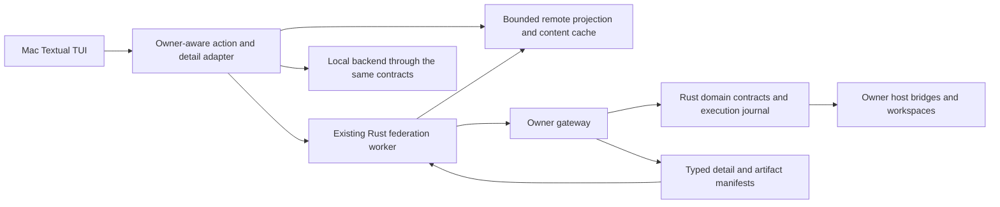

# Making a MacBook the SASE controller: remote Agents-tab parity

Independent research by **cdx**, 2026-10-09. This report investigates the current implementation and proposes an architecture; it does not implement or deploy changes. No other researcher's report, transcript, or findings were consulted.

**My conclusion is that the MacBook is a sensible controller, but the present remote view is not close enough to complete Agents-tab parity to become the only operational interface.** Continue the existing authenticated fleet architecture rather than inventing another transport. Make the Mac TUI a cached reader and route every execution-state change to the machine that owns the agent. Add `%d`, an explicitly scoped machine-sync command, complete detail manifests, and a shared action contract. Use a server-side TUI through SSH/tmux as an immediate fallback and as the parity reference while finishing the native Mac experience.

If “main driver on my MacBook” only means using the Mac's keyboard and screen, I would first try SSH/tmux and defer most of this development. If it means a native Mac SASE process with an integrated local/remote view and locally browsable data, the fuller implementation below is justified. Those are materially different products.

**Evidence and limits.** I inspected the local SASE checkout at `d7c495855154f1e3ff62beec3a16e56cd8b9de86` and the linked sase-core checkout at `d1275df2d06c0001fb5c7090d92e103b6e5d6fd4`, opened through `sase repo open`. I read dispatch, directive, artifact, TUI performance, and tailnet reference memory through the audited memory command. I also checked primary documentation for SSH, tmux, Tailscale Serve, and Textual workers. Repository evidence is cited below as S1–S15; these are source observations at those revisions, not guarantees about installations currently running on any machine.

I did not contact or benchmark the MacBook, athena, or apollo; enroll machines; launch agents; or modify application code. Small local probes exercised source functions with synthetic responses. An initial probe used the shell's Python 3.11 and stopped on the project's newer syntax; rerunning with SASE's Python 3.14.7 succeeded. This matters only to the probe environment, not to the proposed architecture. Resource targets below are proposed acceptance criteria, not measurements.

**What already exists.** Remote support is considerably more than a launch-only prototype. [S1–S7]

- A controller enrolls a target using a one-use bootstrap bundle, stores a credential, and pins the target's installation identity. Tailnet membership alone does not authorize SASE operations.
- The Rust gateway serves authenticated fleet hello, summary, catalog, batch, detail, ranged content, project eligibility, invalidation events, launch, mutation, and attention endpoints. Fleet contract schema v7 and fleet protocol v3 are distinct version surfaces.
- A local Rust federation worker handles HTTP clients, concurrent hosts, deadlines, per-host failure backoff, cache fallback, and Unix-socket IPC. Python supplies configuration and a facade; Textual receives projected rows.
- Local and remote agents already share the Agents list. Machine grouping, derived machine tabs, session/clan topology, authored tabs, status chips, owner capacity/weight, freshness, and host diagnostics are implemented.
- Remote `x`, `R`, and `F` reach journaled owner-side stop, retry, and fork operations when the selected row advertises the relevant capability. Exact instance identities and resource revisions protect mutations from acting on a replacement run.
- Remote pending questions/gates reconcile through the durable local notification inbox. Responses execute on the owner. Attention inventory already separates cache reads from its slower 60-second network cadence.
- Portable remote launch preflight, provisional launch rows, uncertain-outcome recovery, same-key mutation recovery, quarantine, and version-skew reporting already exist.

The important limitation is that a remote row is a viewer projection, not a local agent with its filesystem paths filled in. Preserving that distinction is correct. Several missing features result from code still assuming those local paths.

**Four gaps confirmed by local probes.** [S3–S6]

| Probe | Observed result | Implication |
| --- | --- | --- |
| Scan `%dispatch:athena example`, `%d:athena example`, and `%d(athena) example` | The full directive routes to athena; both short forms return no dispatch selection | `%d` must be implemented in routing as well as completion/normalization |
| Pass a catalog-shaped content metadata object to `_content_handle_for` | No handle is returned | The remote viewer cannot open normal catalog rows without detail hydration |
| Pass a federation response whose first host reports “handle missing” and whose second host returns valid content | `_first_host_payload` raises the first host's error | A healthy owner can be obscured by an unrelated host |
| Read growing output `abc`, poll at EOF, append `def`, and poll again with the same handle/revision | The final read remains empty; only two transport calls occur | Caching an empty growing EOF range prevents later output from appearing |

The content wiring problem has a precise cause. `ResolvedAgentSummaryWire.content` is `ContentMetadataWire`: counts, kinds, lengths, and support flags. Actual `content_handles` exist in `ResolvedAgentDetailWire`. The TUI row adapter carries the summary metadata into `fleet_content`, while `_remote_content.py` searches it for `handles`/`content_handles` and takes the first one. In the audited fleet refresh/action path I found no remote detail hydration that supplies those handles. A local projected-record hydration routine exists, but it hydrates the local record path rather than this fleet detail contract. A command-availability test constructs a remote row with synthetic handles, so it does not establish compatibility with real gateway output. [S3–S5, S12]

The multi-host failure has another precise cause. `RemoteContentClient` sends `content_range_sync` without an owner selector; the worker's read path fans out across configured hosts; `_first_host_payload` consumes `hosts[0]`. Installation order, rather than resource ownership, can decide the result. Scoped transport and response attribution must be part of the fix, not just a search for the first successful payload. [S4, S7]

For growing content, immutable chunk caching is useful only for established byte ranges. An empty read at the current end is a statement about one observation, not a permanent chunk. Bypass or revalidate that cached tail, distinguish append growth from replacement/truncation, and retain a content generation separate from lifecycle/action revision. The modal also decodes each chunk independently with UTF-8 replacement; a multibyte character split across ranges needs an incremental decoder. [S4]

**The actual parity surface is larger than stop/retry/fork.** The table is an operation-family inventory derived from command applicability, help/keymaps, handlers, wire types, and gateway capability production. “Gap” includes actions hidden by applicability and actions whose local implementation assumes unavailable paths. This is a scope inventory, not an assertion that every combination was tested end to end. [S3–S15]

| Local Agents-tab operation or data family | Current remote support | Work needed for the requested outcome |
| --- | --- | --- |
| Select, query, group, fold, switch tabs, split/zoom decks, search visible content | Shared presentation exists | Exercise the same controls with hydrated remote data; expose partial query results and stable owner-qualified selection |
| Launch from prompt/editor, target picker, `%tab` | Dispatch exists; source restrictions apply | `%d` parity, clear owner context, portable inputs, and consistent launch outcomes |
| Retry with `R` | Remote retry exists | Match local **edit-before-relaunch** behavior: local `R` opens the original prompt for editing, whereas remote `R` directly submits a retry |
| Fork / continuation with `F`; from session, clan, tribe, proc, or monitor | Remote concrete agent-turn fork exists | Preserve local scope and context semantics; remote monitor/proc capabilities currently do not supply equivalent forks |
| Stop running agent | Implemented for capable agent-turn rows | Verify exact-target races, replacement instances, stopped rows, and lost responses |
| Stop monitor or named proc; cancel pending gate | Rows can be served; lifecycle capability production is agent-turn-only | Typed owner operations for those resource kinds, including their stop/cancel state transitions |
| Cleanup/dismiss terminal row, session, clan, group, or panel | Remote stop deliberately does not dismiss | Owner-side dismissal/archive contract and identical scope expansion; separate optional viewer-only hiding |
| Save/dismiss marked agents; restore dismissed agents | Local stores and archive restoration machinery | Owner archive listing and revival, host-qualified marks, metadata/content preservation |
| Mixed local/remote bulk actions | Stop partitioning exists, with separate remote and local cleanup paths | One reviewable scope, per-owner submissions and per-target receipts; partial success must be visible |
| Kill and edit; kill/edit last accepted launch | Hidden for remote selection | Durable stop/relaunch barrier, raw prompt fetch, owner-qualified last-launch record, edited prompt submission |
| Change name, tribe, authored agent tab | Name/tribe actions hidden; tab move code skips remote rows | Owner mutations with session/clan inheritance; aliases stay viewer-local |
| Toggle `%auto` while agent is running | Remote approve action is for pending attention | Distinguish auto-mode mutation from answering a gate; transport authoritative auto state |
| Start work waiting for an agent, edit waits/beads/time/capacity/priority, run now | Initial dispatch rejects `%wait`, `%queue`, `%clan`, `%hold`; wait editor assumes local artifacts | Same-owner scheduling semantics and owner metadata mutations; define cross-owner dependencies separately |
| Answer question, approve/reject/review gates | Question/gate attention implemented | Audit all local gate options/actions, previews, cancellation and failed-execution resume/restart; “approve” alone is insufficient proof |
| Privileged gate terminal authentication | Separate remote sudo flow is documented | Reuse the existing reviewed SSH handoff; verify it is reachable from remotely owned attention rather than inventing password transport |
| Context/raw prompt, reply/output, conversation blocks, prior attempts | Summary data plus incomplete separate content modal | Owner detail manifest, all turns/attempts, normal Main deck and metadata pager; no first-handle shortcut |
| Files deck, per-file diffs, committed changes, attached plan, opened linked/external repos | Selected response/output/diff paths can become handles | Stable per-file/card metadata, commit/plan/opened-repo detail, authenticated reads for referenced artifacts |
| Tools deck: provider LLM Calls and SASE ToolRuns | No complete fleet contract for these detail datasets | Distinguish the two datasets; fetch normalized records and implement owner-side ToolRun stop |
| FINAL deck, declaration/finalizer outcomes, output variables | Not supplied by current fleet detail schema | Typed finalizer/read data and lazy logs/variables with provenance |
| Metadata pager, artifact files picker, attempt view | Remote commands are hidden | Shared detail providers rather than local path reads; preserve picker, paging and history behavior |
| Open/edit chat or focused deck in `$EDITOR`; open attachments externally | Remote chat action substitutes a modal; artifact action hidden | Local materialization for viewing/editing a copy; explicit owner writeback or SSH editor for persistent changes |
| Copy prompt/name/reference/chat path/file path/ToolRun ID; follow links | Some display copies exist; several path copies hidden | Owner-aware references and local cached paths with labels; audited link resolution must retain owner context |
| Jump to related Patch, source workspace, primary/linked workspace tmux | Hidden for remote rows | Owner-qualified Patch/workspace handles and interactive SSH/tmux handoff |
| Revert agent commits across primary, linked and opened external repos | Hidden for remote selection | Owner-generated preview and confirmation-bound execution; return individual repo outcomes/conflicts |
| Toggle read/unread; bulk acknowledge and jump to unread completion | Remote manual toggle hidden | Deliberately define viewer acknowledgment semantics, revision keys and new-completion behavior |
| Full history, hidden-node finder, dismissed/history browsing | Owner has explicit `history` catalog scope; normal TUI catalog uses presentation scope | Explicit remote history pagination and archive/hidden scopes; preserve completeness signals and cancellability |

There are two especially easy semantic mismatches to miss. First, local `R` is an editing workflow, not merely “run again.” Second, local `e` opens a chat file in the editor, while remote `e` currently tries to open a bounded content modal. Both use familiar keys but provide different outcomes. Complete parity means preserving those workflows, not just assigning a remote endpoint to each key. [S13]

Workflow Python/bash/parallel step rows are currently not served as agents. Thus even a remote session's member count can differ from the owner's local TUI. They should be transportable **nodes** with explicit kinds and owner references, without being incorrectly counted as agent runners. The explicit history scope already exists in Rust, so older history is not a wholly new backend project; however, the TUI's normal query omits that scope and cursor continuation stays within a scoped snapshot. Pagination alone cannot turn presentation scope into history. Dismissed identities remain filtered, requiring an archive/revival API rather than merely selecting history. [S1, S5, S8]

**Critique of the requested approach.** Keeping expensive agents, workspaces, provider processes, compilation, and automation on the server is a good fit. A small controller can stay interactive while large execution histories grow elsewhere. Existing identity, enrollment, worker, gateway, and receipt machinery makes this practical without a distributed scheduler rewrite.

The biggest underestimated cost is semantic coverage. The Agents tab is simultaneously an agent controller, session browser, artifact viewer, approval surface, editor launcher, workspace terminal launcher, and multi-repository VCS front end. Finishing all of those is a substantial product effort. Server ownership should reduce complexity, but synchronizing writable agent trees would increase it: PIDs, process groups, absolute paths, workspaces, credentials, and lifecycle markers describe one machine. A copied marker must never grant the Mac permission to kill a local process or mutate a local checkout. Reintroducing the retired agents-sync import architecture would be particularly ill suited to this task.

Slow data is acceptable; stale authority is not. A Mac sleeping for hours can retain useful transcripts, but cached capabilities/status must be revalidated by the owner before a command executes. A cached “RUNNING” row does not prove the process remains live, and a successful local submission does not prove a remote effect settled. Offline navigation and offline mutation are different requirements.

Manual-only refresh reduces background requests, but it also hides questions and completed work until you remember to refresh. The existing low-frequency attention inventory is a useful exception: it can remain active without fetching every transcript. Offer an honest strict-manual mode, with visible last-contact age and an explicit indication that pending work may be undiscovered. In the default lightweight mode, a small attention poll is preferable to silent starvation.

The Mac also needs a supported packaged SASE/Rust runtime, not just agent API access. Prefer compatible wheels over recurrent local core builds, and keep host automation optional. Disable unneeded local scheduler routines/service procs through the machine overlay instead of starting the entire server workload on a controller. The Mac controller does not need to expose its own gateway unless other machines will control agents on it. These are deployment choices to verify, not assumptions about the present setup.

**Requirement adjustments I recommend explicitly.** None of these removes an operation family from eventual native parity.

| Original requirement | Proposed clarification/change | Reason |
| --- | --- | --- |
| EVERY local agent operation works remotely | Require equivalent user-visible results for every supported node/action/status/scope combination; allow SSH for interactive terminal/editor authentication | A remote workspace is not a Mac path; terminal access necessarily runs on the owner |
| ALL data can sync/display | Every user-visible dataset and retained artifact must be discoverable and fully fetchable on demand; bulk offline snapshots are optional and bounded/resumable | Completeness of access does not require eagerly keeping the entire fleet archive in RAM or on disk |
| Slow or exclusively manual sync is acceptable | Default to manual bulk data sync plus low-frequency attention; offer strict manual as an explicit policy | Approval discovery is small but operationally important; strict manual must make its latency visible |
| Manually specify `%dispatch`/`%d` | Keep explicit dispatch for fresh launches; retry/fork/kill-edit from a remote row automatically retain that row's owner | Otherwise a remote restart can accidentally launch on the Mac; this owner retention does not introduce automatic load balancing |
| EVERY operation with remote agents | Guarantee same-owner scheduling/dependency workflows first; treat cross-owner waits/clans/holds and migration as separate explicit scope | Cross-owner dependencies need failure semantics, not name substitution; same-owner parity must still be completed |
| Reliable operations | Require owner validation, durable receipts, uncertain-state recovery, and explicit partial outcomes; do not promise immediate success while disconnected | A network can lose a response after an effect happened; replay must not create a second launch |
| Read/unread state matches local use | Store reading/selection/folds/marks per viewer, keyed by owner and completion revision; owner controls actual dismissal/archive | Reading on the Mac should not silently erase actionable history on the server |

“ALL data” here means data the local TUI exposes, including full prompts, responses, attempts, plans, finalizer evidence, generated artifacts, and links. It does not mean transferring private credentials or copying arbitrary server files. Missing retained bytes must be shown as missing/unavailable with a reason, rather than presented as an empty deck. If persistent owner-side transcript editing is considered part of exact parity, provide it through SSH editing or a version-checked writeback API; viewing/editing a cached copy is not the same operation.

**Alternatives worth considering.**

| Approach | Fit for the Mac's resources | Coverage and tradeoff | Judgment |
| --- | --- | --- | --- |
| Run SASE TUI on athena, connect with SSH/tmux | Only terminal rendering and SSH run on the Mac | Owner-local agent operations already work; local Mac files/clipboard integration and disconnected browsing need separate handling; agents on a second owner still depend on federation support | Best immediate solution if a native Mac process is optional |
| Native Mac TUI using existing fleet gateway/worker | Bounded projections and selected content can stay cheap | Integrated local/multi-owner view and cached browsing; requires the parity work in this report | Recommended durable architecture for the stated native-controller goal |
| Mirror `~/.sase`, workspaces, or marker trees with rsync/SSHFS/shared storage | Scanning and decoding history can burden the Mac | Appears to satisfy file access while confusing process ownership, path identity, mutability and locks; does not implement remote control | Reject as the control architecture |
| Add a generic SSH “run arbitrary SASE command” tunnel per key | Low initial implementation effort | Useful escape hatch; quoting, contract drift, error reporting and idempotency become repeated frontend concerns | Use only typed interactive handoffs; do not make it the main mutation transport |
| Build a separate web controller or central distributed scheduler | Could reduce Mac execution work | Adds a second UI or new execution topology before solving the current parity contract | Unnecessary for this request |

SSH's `-t` requests a terminal for remote screen-based programs, and tmux sessions can survive disconnection and be reattached. That makes an owner-hosted TUI a credible bridge, not a speculative replacement UI. The practical cost is network dependence and server-side editor context, with local clipboard behavior needing an explicit solution. [OpenSSH manual](https://man.openbsd.org/ssh.1), [tmux manual](https://man.openbsd.org/tmux.1).

Keep the current gateway on loopback and expose it privately with Tailscale Serve. Tailscale documents Serve as tailnet access to a local service and notes that tailnet access rules still apply; preserve SASE's own enrollment authorization on top. There is no need to publish the gateway through Funnel for this workflow. [Tailscale Serve documentation](https://tailscale.com/docs/features/tailscale-serve).

**The recommended native architecture.** Keep one authoritative owner for each execution resource. Add a unified backend interface whose transport varies by owner, while the TUI's actions and decks consume the same typed models.

The shared domain contracts belong in `sase_core`: action validation, scope resolution, identities, schemas, capability decisions, safe detail projection, reconciliation, and cache policy that other frontends must share. Gateway HTTP and filesystem/process observation belong in the gateway/owner adapter. Python remains glue to existing host execution facilities; it must not become a second copy of Rust domain policy. Textual owns selection, navigation, layout, local editor launching and UI feedback. New binding usage also requires advancing SASE's `sase-core-revision.txt` pin. [S2]

Reuse the existing stop/retry/fork receipts rather than replacing them with a second command queue. Expand their typed action surface where appropriate and use dedicated typed resources for gates, procs, ToolRuns, reverts and editable content. A UI-neutral action inventory should state action ID, node kinds, eligible state, scope, owner target, required capability, payload, preview requirement and result. Both local execution and gateway dispatch consume this contract. The command palette/keymaps then derive applicability and explanations from it. This avoids maintaining one list of remote prohibitions indefinitely.

The goal is equivalent domain behavior, not HTTP for every local action. Local operations can use the Rust binding plus existing Python host bridges; remote operations use gateway routes that call the same decision layer and owner bridges. Rendering a deck, copying already cached text, folding, or marking rows should not require a network round trip.

**Complete read data without a full-state mirror.** Extend lazy detail beyond a summary plus a handful of paths. Return an owner-generated manifest identifying decks, cards, blocks, turns/attempts, files, tool datasets, finalizer results and linked artifacts. Each resource carries stable identity, title, kind/MIME, byte length, content generation/digest and access state. Normalized structured data should use versioned wires; large bytes use opaque range handles. The manifest enumerates all resources while selected cards fetch actual bytes.

The gateway currently derives handles from response, output, diff, question response, and session output paths, and constrains them to the artifact root. An `Artifact` handle kind in the enum does not make every produced artifact discoverable: the audited candidate builder does not enumerate arbitrary generated files, sidecar plans, finalizer files or ToolRun datasets. Build authenticated artifact-provider reads for those other roots with their own authorization and audited consumption; do not weaken the canonical artifact-root check to permit arbitrary paths. [S4, S6]

Use a dedicated remote read-model namespace keyed by installation ID, project and resource identity. Do not write fetched `running.json`/`done.json` equivalents into the local execution inventory. A browser-compatible local file adapter can materialize immutable content into the cache for `$EDITOR` or external viewers while preserving an explicit remote identity and preventing writes from being mistaken for owner changes.

Keep metadata/projection caching separate from content caching. The current federation response cache has defaults of 256 entries and 4 MiB and rewrites its serialized cache on successful reads; it is a useful bounded response cache, not a complete offline artifact store. Putting all transcripts into it would evict useful catalogs and scale repeated persistence work. Add a disk byte cache for verified immutable content, a small metadata index, a configurable disk budget and a bounded in-memory render window. Resumable full-agent or machine downloads can pin content outside ordinary eviction. [S7]

Content cache keys include owner, exact resource, content generation and range. Validate chunk digest, returned owner/handle, requested revision, offset and length; validate a whole-object digest when available. Resume incomplete downloads, maintain incremental UTF-8 decoding, and invalidate changed/truncated live files. Live reads refresh only the visible tail; terminal files become immutable. All displayed panes state whether they are fully loaded, partial, cached, stale, missing or still syncing.

References and paths also need ownership. Identical agent names and workspace numbers on athena and apollo must remain distinct. Carry an owner-qualified reference context through copy, link following, prompts, Patch jumps and opened-repo navigation. Exposing an owner-path label for the user is different from treating that string as a local Mac filesystem path. Referenced content reads should retain SASE's audit trail even when bytes come from a controller cache.

**A manual synchronization operation with precise semantics.** Add a configurable `sync_selected_machine` command, available from the Agents tab, command palette, Refresh panel and selected Machines row. I suggest the default leader key `,s`, which is unused in the audited default leader map; validate it against the full registry and user overrides before implementation. Do not repurpose `R`, since it already means retry on Agents. Update `src/sase/default_config.yml`, keymap models/registry, palette applicability, help and bindings tests together. [S3, S9]

Resolve the target from the selected remote row or explicit machine-tab/banner. On a named tab spanning owners, do not infer the target from the tab title: use the selected row or a small machine picker. Resolve the selected alias to pinned installation ID at submission time and retain that identity throughout the operation. With local selection, ask for an explicit remote target through the picker instead of implicitly syncing the entire fleet.

A normal sync refreshes the chosen owner's inventory/topology, attention, summary metadata and manifests needed by visible/selected nodes, then downloads the selected node's visible cards and missing content. It reports what was refreshed and what remains lazy. A separate option, “Download complete agent data” or a bulk machine snapshot, walks every retained resource to completion in a resumable durable proc. This gives ALL data an access path without making every sync fetch all transcripts.

Use the existing `catalog_hosts` operation for selected-host catalog reads and add equivalent scoped detail/content/attention reads. The current manual `r` refresh calls the general fleet refresh; it is not selected-machine sync. Full history should request the existing history scope explicitly, page it, and indicate remaining pages. If a row/page cap or byte budget is reached, show partial state and offer continuation; never silently relabel it complete. [S5, S7–S9]

Coalesce requests per owner. A new result updates that owner's cache atomically without erasing other machines. Reuse snapshot-bound cursors, refresh invalidation generation and selection checks. On interruption, keep the last good snapshot and downloaded bytes. Do not delete absent rows from an incomplete page sequence; reconcile explicit tombstones or a completed authoritative snapshot.

Freshness policies should be configuration, not ad hoc timer changes:

- **Strict manual:** startup and navigation use cache only. No periodic network polling, including attention; explicit sync, content open and mutations are deliberate network work. Show that attention discovery is manual.
- **Lightweight default:** cached startup; attention about once per minute; selected/active owner metadata on a longer configurable cadence or explicit sync; selected-card content on demand. No full transcript sweep.
- **Live selected owner:** optional faster metadata/visible-tail refresh while that owner is being watched, stopping when it is no longer selected.

The existing fleet refresh does summary cache reads but non-cache catalog/follow/attention calls; `cache_only=False` invokes remote reads even when a cache entry exists unless failure backoff intervenes. Therefore a manual policy must govern every call site, including startup, tab switch, notification polling and post-action refresh. A global UI timer setting alone is insufficient. The attention implementation already offers a good template for separate cache and network cadences. [S5, S7, S10]

**Reliable actions despite slow synchronization.** For a mutation, the viewer captures owner, exact target, action/resource revision and a stable operation key in a durable intent. The owner validates authorization, current identity, capabilities and relevant preconditions, then executes through its existing bridge. Receipts return accepted/pending/settled/failed with per-target evidence. The Mac presents “stop requested” or “retry accepted” until settlement; it does not claim success because a proc was submitted.

Preserve same-key recovery. If the request reached the owner but its response was lost, retry observation/submission with the original key and fingerprint. An unresolved action after the acceptance window is uncertain; do not invent a new key automatically. Gateway/controller restart must retain enough execution intent and outcome evidence to reconcile the operation. Exactly-once external effects cannot be established merely by storing an admission receipt; test the crash boundary between side effect and settled receipt and make each action's recovery explicit.

Long-lived live content and transient liveness should not invalidate unrelated metadata edits. Separate action-relevant revisions from feed cursors and content generations. For an outdated dismiss/name/wait request, fetch the authoritative current state and either perform the same explicitly scoped intent under a safe precondition or return a typed conflict. Do not silently stop whatever agent currently has the same display name.

Bulk operations are independent owner transactions, not a distributed atomic transaction. Resolve/freeze the local scope, show hosts and target kinds, partition by owner, execute each with stable keys, and retain all outcomes. A failed host must not hide successes elsewhere. Retrying a partially completed bulk action targets unresolved original keys, not the entire set afresh. Owner-side session/clan expansion should have a versioned membership snapshot or reviewable expansion so that new members do not unexpectedly join destructive cleanup.

For reverts, use an owner-produced preview containing exact commits/repositories/base state and a preview token or digest. After confirmation, revalidate that preview on the owner. Report individual repository failure/conflict states rather than promising atomic rollback across repositories. Likewise, kill-and-edit holds the replacement launch until the stop/cleanup barrier settles, preserving the local workflow's existing name-reuse protections. [S11, S13]

Interactive workspace access should use a typed owner-side resolver and the configured `ssh-target`, followed by SSH/tmux with safe argv handling. The target chooses the workspace associated with the selected exact agent, including opened linked/external repositories; the controller does not reconstruct that from `workspace_num`. Remote sudo already has an enrollment-aware reviewed terminal flow with detached execution and ledger finalization. Reuse it where the relevant remote gate type permits it. [S14]

**How I would sequence implementation.** These are proposed delivery stages, not an approved implementation plan or a claim of completed work.

1. **Establish the parity contract and reference fixture.** Inventory the command registry/help/handlers by resource kind, status and single/session/clan/tribe/panel/marked scope. Capture a representative local owner dataset: active, waiting, failed, completed and dismissed agents; multi-turn session; monitor; gate; named proc; workflow steps; LLM calls; ToolRuns; finalizers; output variables; plans, files and commits. Compare remote results to this dataset. SSH/tmux remains the operational fallback.
2. **Repair the existing read path and add the small ergonomics.** Add `%d` across parser/scanner/editor contract; hydrate detail; route content to its actual owner; fix live EOF caching and decoding; choose among all handles; add selected-machine sync and strict-manual policy. This stage creates a usable remote browser but must not be described as full parity.
3. **Complete all detail/read data.** Add the deck/card/block manifest and providers for prompts, attempts, workflows, tools, finalizers, variables, opened repos and indexed artifacts. Wire them into normal decks, metadata pager, copy/link flows and editor materialization; expose remote history and archives explicitly.
4. **Complete execution and lifecycle workflows.** Add owner-side rename/tribe/tab/auto/wait/queue/dismiss/revive; monitor/proc/gate/ToolRun actions; edited retry and kill-edit barriers; full gate options and recovery; reverts and scoped bulk outcomes; workspace SSH handoffs. Enable remote same-owner wait/queue/clan launch semantics as their tests land.
5. **Qualify on the actual Mac before making it primary.** Measure cached startup, idle CPU/RSS, network traffic and key latency with production-sized history. Test sleep/wake, network loss, offline owner and stale credentials alongside complete action/data parity. Tune measured bottlenecks, then move normal use to the Mac.

For `%d`, changing only `_DIRECTIVE_ALIASES` is insufficient: `scan_dispatch_directive` first returns early unless the literal `%dispatch` occurs. Correct that gate, retain literal/fenced/disabled-region protection, reject combined full/short duplicates, and make the target picker replace either spelling. Set the Rust editor directive metadata alias to `d`, provide the same machine completions and update documentation. Canonical stored prompts can continue using `%dispatch`. Exercise short/full colon and parenthesized syntax, duplicate aliases, disabled regions, fenced examples, reserved `local`, invalid target and V1 conflict detection. [S15]

Do not quietly remove all V1 dispatch restrictions at once. Same-owner `%wait` and `%queue` can reasonably execute on the target once portable preflight and dependency identity are correct. Same-owner clans can be target-side launch units. Cross-owner holds/waits require their own event/outage contract; they are not needed to move the keyboard and TUI to a Mac. Portable launch attachments also deserve their own manifest/upload path: a screenshot or local file must be uploaded explicitly and verified, not embedded as a Mac absolute path.

**Validation that would make the result trustworthy.** Establish action coverage from the shared inventory, then test outcomes against both local and remote adapters. Add a contract-level integration test using real gateway summary/detail shapes so synthetic `fleet_content={handles: ...}` fixtures cannot mask missing wiring.

The highest-value scenarios are:

- Two enrolled owners with identical agent names, workspace numbers and project names; choose the second owner and verify content, retry, stop, copy/reference and terminal access never route to the first.
- A resource replaced between selection and stop; the old exact instance must not stop its successor.
- Request accepted/effect executed followed by dropped response; retry with the same key yields one effect. Test controller, worker and gateway restart at that boundary.
- EOF polling followed by append, UTF-8 split at the chunk boundary, file truncation/replacement, digest mismatch, interrupted download and resume; all expected bytes appear once and corrupt bytes are rejected.
- Manual sync of athena with apollo offline; no apollo network request and no loss of its cached rows. Switch selection/tab during sync; the result updates cache without jumping the user.
- Full history beyond seven days and 200 completed rows, pagination beyond the current TUI's normal page budget, dismissed revival, hidden nodes, incomplete feeds and missing retained artifact content; completeness is never inferred from absence.
- Every gate type/action, failed option recovery, remote terminal authentication, monitor/proc stop, live ToolRun stop, finalizer failures and multi-repo revert conflicts.
- Marked/group/session/clan cleanup with mixed local and remote targets, one owner failing, and owner membership changing after preview; outcomes stay attributable and reviewable.
- Local and remote `R` both allow prompt editing; `F` retains context; kill-edit never launches before old cleanup settles; non-dispatch fresh prompts remain local.
- Strict manual startup/tab navigation and idle operation generate zero automatic network traffic; explicit sync/content open/actions still work. Lightweight attention stays on its independent cadence.

Performance validation should use the project's existing trace/watchdog/profile tooling, measure on the actual Mac, and preserve its key-to-paint p95 target below 16 ms where feasible. Initially budget one coalesced metadata sync per owner and a small bounded number of content transfers, with explicit cache sizes and no O(full archive) startup. Treat CPU/RSS/disk/network limits as measured budgets; no numerical claim about a MacBook is justified from this source audit. Textual documents that most UI functions are not thread-safe and recommends `call_from_thread` or posted messages for thread-worker updates; preserve SASE's additional requirement that slow work not block the serial message pump even when it awaits a thread. [S10], [Textual workers documentation](https://textual.textualize.io/guide/workers/).

**Source index.** Repository links identify the exact revisions read locally. The report's conclusions and design choices are my inferences from this evidence.

| ID | Primary evidence |
| --- | --- |
| S1 | [SASE remote-dispatch runbook](https://github.com/sase-org/sase/blob/d7c495855154f1e3ff62beec3a16e56cd8b9de86/docs/remote_dispatch.md): enrollment, launch restrictions, fleet rows, actions, version behavior |
| S2 | [Rust backend boundary and pin](https://github.com/sase-org/sase/blob/d7c495855154f1e3ff62beec3a16e56cd8b9de86/docs/rust_backend.md), project/linked-core agent instructions |
| S3 | [Command applicability](https://github.com/sase-org/sase/blob/d7c495855154f1e3ff62beec3a16e56cd8b9de86/src/sase/ace/tui/commands/_availability_agents.py), [Agents help](https://github.com/sase-org/sase/blob/d7c495855154f1e3ff62beec3a16e56cd8b9de86/src/sase/ace/tui/modals/help_modal/agents_main_sections.py): remote exclusions and operation families |
| S4 | [Remote content action](https://github.com/sase-org/sase/blob/d7c495855154f1e3ff62beec3a16e56cd8b9de86/src/sase/ace/tui/actions/agents/_remote_content.py), [content client](https://github.com/sase-org/sase/blob/d7c495855154f1e3ff62beec3a16e56cd8b9de86/src/sase/dispatch/content.py), [content modal](https://github.com/sase-org/sase/blob/d7c495855154f1e3ff62beec3a16e56cd8b9de86/src/sase/ace/tui/modals/remote_content_modal.py): handle selection, first-host response, cache and decoding |
| S5 | [Fleet refresh](https://github.com/sase-org/sase/blob/d7c495855154f1e3ff62beec3a16e56cd8b9de86/src/sase/ace/tui/actions/agents/_fleet_refresh.py), [row adapter](https://github.com/sase-org/sase/blob/d7c495855154f1e3ff62beec3a16e56cd8b9de86/src/sase/ace/tui/models/_fleet_agents_rows.py), [detail wire](https://github.com/sase-org/sase-core/blob/d1275df2d06c0001fb5c7090d92e103b6e5d6fd4/crates/sase_core/src/fleet_contract/resolution.rs) |
| S6 | [Gateway content enumeration and path boundary](https://github.com/sase-org/sase-core/blob/d1275df2d06c0001fb5c7090d92e103b6e5d6fd4/crates/sase_gateway/src/fleet_reads/content.rs), [content metadata/handle wires](https://github.com/sase-org/sase-core/blob/d1275df2d06c0001fb5c7090d92e103b6e5d6fd4/crates/sase_core/src/fleet_contract/content.rs) |
| S7 | Federation worker [state/fanout](https://github.com/sase-org/sase-core/blob/d1275df2d06c0001fb5c7090d92e103b6e5d6fd4/crates/sase_gateway/src/federation_worker/imp/state.rs), [remote reads/backoff](https://github.com/sase-org/sase-core/blob/d1275df2d06c0001fb5c7090d92e103b6e5d6fd4/crates/sase_gateway/src/federation_worker/imp/remote_hosts.rs), [cache](https://github.com/sase-org/sase-core/blob/d1275df2d06c0001fb5c7090d92e103b6e5d6fd4/crates/sase_gateway/src/federation_worker/imp/cache.rs), [defaults](https://github.com/sase-org/sase-core/blob/d1275df2d06c0001fb5c7090d92e103b6e5d6fd4/crates/sase_gateway/src/federation_worker/mod.rs) |
| S8 | [Owner snapshot scopes](https://github.com/sase-org/sase-core/blob/d1275df2d06c0001fb5c7090d92e103b6e5d6fd4/crates/sase_gateway/src/fleet_reads/snapshot.rs), [catalog/history contract](https://github.com/sase-org/sase-core/blob/d1275df2d06c0001fb5c7090d92e103b6e5d6fd4/crates/sase_core/src/fleet_contract/catalog.rs), [presentation selection](https://github.com/sase-org/sase-core/blob/d1275df2d06c0001fb5c7090d92e103b6e5d6fd4/crates/sase_core/src/fleet_presentation.rs) |
| S9 | [Default configuration/keymaps](https://github.com/sase-org/sase/blob/d7c495855154f1e3ff62beec3a16e56cd8b9de86/src/sase/default_config.yml), [Refresh panel](https://github.com/sase-org/sase/blob/d7c495855154f1e3ff62beec3a16e56cd8b9de86/src/sase/ace/tui/actions/refresh_panel.py) |
| S10 | [Attention refresh policy](https://github.com/sase-org/sase/blob/d7c495855154f1e3ff62beec3a16e56cd8b9de86/src/sase/ace/tui/actions/agents/_remote_attention.py), [auto refresh surfaces](https://github.com/sase-org/sase/blob/d7c495855154f1e3ff62beec3a16e56cd8b9de86/src/sase/ace/tui/actions/event_refresh/_auto_refresh_surfaces.py); audited `tui_perf.md` reference memory |
| S11 | [Rust mutation contract](https://github.com/sase-org/sase-core/blob/d1275df2d06c0001fb5c7090d92e103b6e5d6fd4/crates/sase_core/src/fleet_mutation.rs), [owner capability producer](https://github.com/sase-org/sase-core/blob/d1275df2d06c0001fb5c7090d92e103b6e5d6fd4/crates/sase_gateway/src/fleet_reads/resolution.rs), [remote action adapter](https://github.com/sase-org/sase/blob/d7c495855154f1e3ff62beec3a16e56cd8b9de86/src/sase/ace/tui/actions/agents/_remote_lifecycle.py), [bulk cleanup routing](https://github.com/sase-org/sase/blob/d7c495855154f1e3ff62beec3a16e56cd8b9de86/src/sase/ace/tui/actions/agents/_kill_all_actions.py) |
| S12 | [Synthetic remote command tests](https://github.com/sase-org/sase/blob/d7c495855154f1e3ff62beec3a16e56cd8b9de86/tests/test_command_availability_agents_fleet.py), [content tests](https://github.com/sase-org/sase/blob/d7c495855154f1e3ff62beec3a16e56cd8b9de86/tests/test_dispatch_content.py): useful unit coverage, incomplete real-shape/EOF/multi-owner coverage |
| S13 | [Local retry editing](https://github.com/sase-org/sase/blob/d7c495855154f1e3ff62beec3a16e56cd8b9de86/src/sase/ace/tui/actions/agent_workflow/_entry_relaunch.py), [shared retry routing](https://github.com/sase-org/sase/blob/d7c495855154f1e3ff62beec3a16e56cd8b9de86/src/sase/ace/tui/actions/_base_workflow.py), [local/remote chat behavior](https://github.com/sase-org/sase/blob/d7c495855154f1e3ff62beec3a16e56cd8b9de86/src/sase/ace/tui/actions/agents/_panel_detail.py), [revert flow](https://github.com/sase-org/sase/blob/d7c495855154f1e3ff62beec3a16e56cd8b9de86/src/sase/ace/tui/actions/agents/_revert.py) |
| S14 | [Remote sudo flow](https://github.com/sase-org/sase/blob/d7c495855154f1e3ff62beec3a16e56cd8b9de86/docs/sudo.md), [workspace tmux implementation](https://github.com/sase-org/sase/blob/d7c495855154f1e3ff62beec3a16e56cd8b9de86/src/sase/ace/tui/actions/agents/_panel_tmux.py) |
| S15 | [Directive alias table](https://github.com/sase-org/sase/blob/d7c495855154f1e3ff62beec3a16e56cd8b9de86/src/sase/macro/_directive_types.py), [dispatch scan fast gate](https://github.com/sase-org/sase/blob/d7c495855154f1e3ff62beec3a16e56cd8b9de86/src/sase/macro/_directive_scan.py), [Rust editor directive metadata](https://github.com/sase-org/sase-core/blob/d1275df2d06c0001fb5c7090d92e103b6e5d6fd4/crates/sase_core/src/editor/directive/metadata.rs) |

**Recommended solution.** Use athena as the initial execution owner and the MacBook as a native cached controller, completing the existing gateway/federation system in stages. Add `%d` and `,s` selected-machine sync, preserve low-frequency attention as an opt-out, hydrate every Agents deck through a complete owner manifest, and route all mutating operations through shared Rust contracts with owner-side execution and durable recovery. Keep SSH/tmux for interactive workspace/editor access and as the immediate full local-operation fallback. Accept lazy/manual data transfer, retain same-owner scheduling parity, explicitly defer cross-owner scheduling, and make complete action/data parity plus measured Mac responsiveness the release gate. If you do not need a native Mac SASE process or offline browsing, stop at an SSH/tmux-hosted TUI instead; it achieves the operational goal with far less new machinery.
