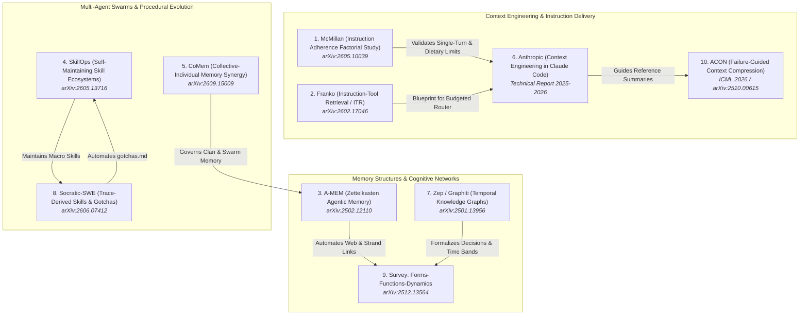

# Research Report: Recommended Literature for Improving SASE Memory Files and Agent Instruction Files

**Researcher:** `research.3q.gem`  
**Date:** October 2026  
**Swarm Context:** 5-Researcher Swarm (`gem`, `cdx`, `cld`, `grk`, `mus`)  
**Topic:** Curated, Ranked Reading List of Recent Literature (Published Within the Last Year, late 2025–2026) on Agent Memory Systems, Context Engineering, and Instruction File Architectures  
**Target Repository:** `sase/repos/research/202610/memory_and_instruction_files_reading_list__gem.md`

---

## 1. Executive Summary & Conceptual Grounding

Structured Agentic Software Engineering (SASE) relies fundamentally on two context delivery mechanisms:
1. **Memory Files (`sase/memory/`):** A durable, version-controlled markdown note hierarchy partitioned into:
   - **Core Memory (`type: core`):** Essential operational rules, workspace boundaries, and terminal-action contracts (`sase.md`, `gotchas.md`, `rust_core_backend_boundary.md`) inlined into every root instruction file and provider shim on every turn.
   - **Reference Memory (`type: reference`):** Detailed domain specifications (`lint_and_test.md`, `macros.md`, `sase_artifacts.md`, `sase_beads.md`, etc.) cataloged with single-paragraph summaries in `AGENTS.md` and read strictly on-demand via audited `sase memory read` invocations.
   - **Memory Webs:** Keyed, modular collections comprising an inlined web descriptor (`<web>.md`) and a sibling directory of atomic, keyword-addressed strand files (`<web>/<slug>.md`), cross-linked via `[[target]]` reference links or `![[target]]` transclusion.
2. **Agent Instruction Files (`AGENTS.md` and Provider Shims):** The compiled, provider-facing behavioral brief rendered by `sase memory init` from templates (e.g., `AGENTS.template.md`), generating specialized manifests for Claude (`CLAUDE.md`), Gemini (`GEMINI.md`), OpenAI/Codex, and other LLM harnesses.

### The Current Architectural Bottlenecks in SASE
While SASE's file-first, human-auditable design is ahead of prevailing industry patterns that rely on opaque vector databases, several critical challenges have emerged as the system scales:
- **The "Prompt Tax" and Attention Dilution:** SASE inlines all core notes and web descriptors into every agent prompt on every turn (~2,500+ tokens). As core memory grows, this fixed overhead consumes scarce context window capacity, inflates API token costs across multi-agent swarms, and induces "attention decay" or "lost-in-the-middle" degradation where models overlook key operational constraints.
- **Static Monolithic Inlining vs. Dynamic Budgeted Routing:** Currently, an agent invoked for a trivial git branch query or a quick documentation fix receives the exact same heavyweight instruction payload as an agent tasked with a complex multi-file Rust/Python refactoring. SASE has recognized the need for an "instruction router" or budgeted delivery mechanism (`agent_instructions_budgeted_router`), but lacks a formal architectural framework for dynamic instruction and tool exposure.
- **Static Hand-Authored Notes vs. Closed-Loop Trace Distillation:** SASE's `gotchas.md` and failure signatures are currently authored and maintained manually. When agents repeatedly stumble on subtle environment bugs, compiler nuances, or tool invocation patterns, these lessons are not automatically distilled from execution traces into reusable procedural memory.
- **Multi-Agent Memory Isolation vs. Collective Sedimentation:** In multi-agent swarms (such as this 5-researcher swarm, or parallel workers running across ephemeral `sase_<N>` clones), agents face a dilemma: sharing a raw blackboard risks "memory pollution" and cross-agent hallucination, while complete isolation prevents agents from benefiting from discovered architectural invariants or verified test findings.
- **Memory Lineage, Provenance, and Code Auditing:** While `sase memory log` audits read events and SASE tracks patch stitch audits, there is no formal mechanism linking specific memory rules to concrete downstream code mutations or verifying which instructions directly governed a code generation event.

To address these tensions, this research surveys the state-of-the-art literature published over the past twelve months (late 2025 to late 2026). It selects, analyzes, and ranks the ten most impactful articles and research papers that provide direct theoretical grounding, empirical evidence, and actionable design patterns to improve SASE's memory and instruction subsystems.

---

## 2. Key Architectural Dimensions Mapped to SASE

| SASE Dimension | Core Challenge in SASE Today | Academic & Industry Analogue (2025–2026) |
| :--- | :--- | :--- |
| **Instruction Adherence & Layout** | Does the structure, length, or placement of rules in `AGENTS.md` drive compliance? | Empirical Factorial Studies on Config Files; Attention Decay; Within-Session Drift |
| **Instruction Delivery & Tool Scoping** | Monolithic inlining of core notes on every turn costs ~2.5k tokens and dilutes tool focus. | Instruction-Tool Retrieval (ITR); Dynamic System Prompts; Confidence-Gated Fallbacks |
| **Structured Associative Memory** | Memory webs (`<web>/<strand>.md`) with `[[links]]` need automated synthesis and traversal. | Agentic Zettelkasten Networks (A-MEM); Dynamic Semantic Graph Evolution |
| **Procedural Memory & Macro Skills** | Macro skills (`src/sase/macros/skills/`) face interface drift and lack automated refactoring. | Skill Ecosystem Graphs; Self-Maintaining Skill Libraries (SkillOps); Procedural Memory (MemP) |
| **Swarm Memory & Contamination** | Parallel agents across `sase_<N>` workspaces risk memory pollution or blind isolation. | Collective-Individual Memory Synergy (CoMem); Dual-Stream Retrieval; Scoped Sharing |
| **Context Economics & Compaction** | Hand-authoring 1-line reference note descriptions is subjective and imprecise. | Natural Language Context Compression (ACON); Failure-Guided Summary Optimization |
| **Temporal Memory & Decision History** | ADRs in `decisions/` use `superseded_by`; pager displays time bands, needing formal semantics. | Bi-Temporal Knowledge Graphs (Graphiti/Zep); Valid Time vs. Ingestion Time |
| **Trace-Driven Memory Distillation** | `gotchas.md` and failure signatures are maintained manually rather than learned from runs. | Trace-Derived Skill/Memory Acquisition (Socratic-SWE, TraceCoder); Post-Mortem Distillation |
| **Memory Lineage & Code Auditability** | Linking `sase memory read` access logs to concrete git patches and stitch audits. | Position-Key Snippet Versioning; Relational Repair-Event Schemas (TraceCoder) |
| **Harness Architecture & Configuration** | Maintaining parity across `CLAUDE.md`, `GEMINI.md`, and `AGENTS.md` without copy-paste drift. | Context Engineering Paradigms; "Pointer Map" Patterns; File-First Agent Contracts |

---

## 3. Conceptual Landscape & Reading Map



---

## 4. Ranked List of Recommended Articles & Research Papers

Below is the curated, ranked list of the top ten articles and research papers published within the past year (late 2025 to late 2026) that are most relevant to inspiring improvements in SASE's memory files and agent instruction files.

---

### Rank 1: Instruction Adherence in Coding Agent Configuration Files: A Factorial Study of Four File-Structure Variables
* **Author:** Damon McMillan
* **Citation:** arXiv:2605.10039 (May 2026).
* **Domain:** Software Engineering Agents, Agent Configuration Files (`AGENTS.md` / `CLAUDE.md`), Empirical HCI for Code.
* **Core Subject:**  
  Conducts the first rigorous, large-scale factorial study evaluating how structural variations in repository configuration files (`CLAUDE.md`, `AGENTS.md`) impact LLM coding agent compliance. Spanning 1,650 sessions and 16,050 function-level observations across frontier models, the study systematically manipulated four independent variables:
  1. *File Size:* (25 to 500 lines).
  2. *Instruction Position:* (5 ordinal locations from top to bottom of the file).
  3. *File Architecture:* (monolithic single file vs. hierarchical/nested per-directory files).
  4. *Conflicting Instructions:* (presence of contradictory constraints).
* **Key Findings:**  
  Surprisingly, **none of the four static structural variables produced a statistically detectable contrast in instruction adherence**. Neither file length up to 500 lines, nor positioning instructions at the top vs. bottom, nor splitting into nested directory files meaningfully moved the needle.  
  Instead, the dominant factor governing compliance was **within-session attention decay**: an agent's compliance dropped by **5.6% per generation step** as the context accumulated.
* **Why Bryan Should Read It (Justification):**  
  This paper provides immediate, empirical clarity for SASE's instruction file design. For months, agent framework developers have debated whether rules belong at the top or bottom of `AGENTS.md`, or whether splitting rules into subdirectories improves compliance. McMillan proves that layout micro-optimizations are largely placebo. More importantly, it provides overwhelming empirical validation for SASE's core architectural decision: **`single-turn-agents` (Decisions 3.1.3)**. Single-turn agents that execute with fresh, unpolluted context avoid the 5.6% per-step compliance collapse that plagues long multi-turn sessions.
* **Direct Inspiration for SASE Memory & Instruction Files:**  
  - **Maintain a Strict Dietary Limit on `AGENTS.md`:** Rather than obsessing over section ordering in `AGENTS.template.md`, enforce an aggressive ceiling on total inlined lines (<200 lines).
  - **Focus on Turn Freshness over Prompt Rearrangement:** Validate that SASE's single-turn contract is the primary defense against instruction rot; multi-step operations must be handed off to subagents or monitor turns rather than prolonged in a single context.
  - **Design Rules for Task-Specificity:** Since compliance varied significantly by coding task rather than file layout, instructions should be scoped to task domains rather than statically dumped into global configuration.

---

### Rank 2: Dynamic System Instructions and Tool Exposure for Efficient Agentic LLMs
* **Author:** Uria Franko
* **Citation:** arXiv:2602.17046 (December 2025 / February 2026).
* **Domain:** Dynamic Instruction Delivery, Context Optimization, Tool Exposure Routing.
* **Core Subject:**  
  Investigates the massive inefficiency of conventional LLM agents that re-ingest complete, static system prompts and full tool catalogs on every execution step. The author demonstrates that static instructions and tool definitions often consume up to 90% of the active context window, causing severe "attention dilution" and frequent tool hallucination or routing failures.  
  The paper introduces **Instruction-Tool Retrieval (ITR)**, an intelligent routing architecture that dynamically retrieves only the minimal necessary prompt fragments and smallest relevant tool subset required for the current execution step, backed by confidence-gated fallback mechanisms.
* **Empirical Results:**  
  - Reduces per-step context tokens by **95%**.
  - Improves correct tool routing accuracy by **32%** over monolithic baselines.
  - Cuts end-to-end task execution costs by **70%**.
  - Increases agent task capacity by **2x to 20x** within fixed context limits.
* **Why Bryan Should Read It (Justification):**  
  This paper is the exact theoretical and algorithmic blueprint needed for SASE's pending research topic: `agent_instructions_budgeted_router` and `preloaded_memory_size_visibility.md`. Currently, SASE inlines all core memory notes (`sase.md`, `gotchas.md`, `rust_core_backend_boundary.md`) and memory web descriptors into `AGENTS.md` and every provider shim on every turn. Franko's work proves that this static inlining creates unnecessary token waste and degrades tool invocation accuracy.
* **Direct Inspiration for SASE Memory & Instruction Files:**  
  - **Dynamic Instruction Router:** Replace static compile-time inlining in `sase memory init` with a dynamic runtime router. The agent is initially provided with a lightweight pointer index; based on the incoming prompt or tool phase (e.g., git operation vs. Rust compilation vs. TUI editing), the host dynamically injects the appropriate core memory fragments.
  - **Budgeted Tool Exposure:** Narrow the exposed tool catalog dynamically. When an agent is executing a research task, development tools like compiler wrappers or stitch mechanics can be hidden, directly preventing tool selection confusion.
  - **Confidence-Gated Fallback:** Implement Franko's fallback pattern: if an agent's confidence in tool selection is marginal, the host expands the exposed instruction and tool context before re-prompting.

---

### Rank 3: A-MEM: Agentic Memory for LLM Agents
* **Authors:** Wujiang Xu, Zujie Liang, Kai Mei, Hang Gao, Juntao Tan, Yongfeng Zhang (Rutgers University)
* **Citation:** arXiv:2502.12110 (February 2025 / 2026). Code: [github.com/WujiangXu/A-mem-sys](https://github.com/WujiangXu/A-mem-sys).
* **Domain:** Autonomous Agent Memory, Zettelkasten Knowledge Networks, Dynamic Memory Evolution.
* **Core Subject:**  
  Presents a novel framework for long-term agent memory grounded in the **Zettelkasten** note-taking methodology. Instead of dumping raw conversation turns into an unstructured vector database or maintaining a rigid relational schema, A-MEM structures memories as atomic, interconnected notes with semantic keywords, contextual summaries, and explicit bidirectional links.  
  As the agent interacts with its environment, it autonomously performs memory operations: generating new atomic notes, dynamically discovering associative links to existing notes, updating outdated links, and pruning obsolete fragments.
* **Why Bryan Should Read It (Justification):**  
  SASE's memory web architecture—consisting of a descriptor (`sase/memory/<web>.md`), a sibling directory of strand files (`sase/memory/<web>/<slug>.md`), and authored links using `[[target]]`—is fundamentally an implementation of the Zettelkasten method! However, in SASE today, creating and maintaining memory webs and strands requires manual authoring via `/sase_memory_write`. A-MEM provides the algorithmic foundation for making SASE memory webs self-evolving.
* **Direct Inspiration for SASE Memory & Instruction Files:**  
  - **Automated Memory Strand Synthesis:** Enable agents, upon completing a complex tale or resolving an epic, to invoke `/sase_memory_write` to autonomously generate atomic strand notes in relevant webs (e.g., in `decisions/`, `gotchas/`, or a new `architecture/` web).
  - **Algorithmic `[[target]]` Link Discovery:** Adopt A-MEM’s associative linking logic during `sase memory init` to suggest or automatically insert `[[web:slug]]` cross-references between related strands and reference notes.
  - **Memory Consolidation & Compaction:** Use A-MEM’s pruning rules to merge redundant strands and flag orphaned memory files that have zero inbound `[[links]]`.

---

### Rank 4: SkillOps: Managing LLM Agent Skill Libraries as Self-Maintaining Software Ecosystems
* **Authors:** Hongji Pu, Xinyuan Song, et al.
* **Citation:** arXiv:2605.13716 (May 2026).
* **Domain:** Agent Skills Architecture, Procedural Memory, Software Ecosystem Governance.
* **Core Subject:**  
  Reframes agent skill libraries (procedural memory and prompt-based macros) as a living software engineering codebase rather than static prompt collections. The authors identify "skill technical debt"—a major failure mode in evolving agent systems where skills suffer from duplicate implementations, interface drift, unvalidated parameters, and silent regressions.  
  SkillOps introduces the **Hierarchical Skill Ecosystem Graph (HSEG)**, which models skills, their dependency trees, and their operational contracts. The framework runs library-time maintenance passes to autonomously diagnose syntax and parameter drift, refactor overlapping skills into composable primitives, and run synthetic validation suites against skill definitions without modifying agent runtime logic.
* **Why Bryan Should Read It (Justification):**  
  SASE has a dedicated and rapidly expanding macro skills subsystem (`src/sase/macros/skills/`), which generates agent skills deployed to managed user environments (like chezmoi) and project repositories (see `sase/memory/generated_skills.md`). As SASE skills (`/sase_memory_write`, `/sase_repo`, `/sase_final`, `/sase_monitor`) evolve, they face the exact "skill technical debt" SkillOps describes.
* **Direct Inspiration for SASE Memory & Instruction Files:**  
  - **Linter for SASE Generated Skills:** Implement a SkillOps-style graph linter in `sase` (e.g., `sase skill lint` or `sase macro check`) that verifies frontmatter contracts, detects duplicate skill descriptions across provider shims, and checks tool invocations for stale flags.
  - **Semantic Deduplication of Macro Skills:** When new macro skills are authored in `src/sase/macros/skills/`, use HSEG dependency modeling to verify that existing skills cannot be refactored or reused before minting new ones.
  - **Automated Contract Tests:** Run synthetic validation tests against macro skill markdown templates to guarantee that instructions given to agents remain syntactically compliant with underlying CLI implementations.

---

### Rank 5: CoMem: Collective-Individual Memory Synergy for Evolutionary Multi-Agent Systems
* **Authors:** Chengxin Yu, Zhaoxin Fan, Faguo Wu, Hongwei Zheng, Yun Zhou, Zhiyu Li
* **Citation:** arXiv:2609.15009 (September 14, 2026).
* **Domain:** Multi-Agent Systems (MAS), Swarm Memory, Collective Intelligence, Memory Pollution Prevention.
* **Core Subject:**  
  Investigates the delicate balance between private experience and collective wisdom in multi-agent swarms. The paper observes that existing multi-agent systems suffer from two extremes: flat shared blackboard memories that quickly degenerate into noisy, hallucinated "memory pollution," or completely isolated agent scratchpads that prevent agents from learning from their peers.  
  CoMem proposes a dual-tiered architecture:
  1. *Private Experience Sedimentation:* Individual agents retain and evolve their own private execution memories, error traces, and local state.
  2. *Collective Wisdom Curation:* A dedicated curation mechanism filters, verifies, and abstracts high-value insights from individual agents into a shared team knowledge base.
  3. *Parallel Dual-Stream Retrieval:* Agents concurrently query both their private stream and the collective stream to inform their decisions.
* **Why Bryan Should Read It (Justification):**  
  This paper speaks directly to SASE's multi-agent workflows, including agent clans (`%clan`), Lumberjack routines, and swarms (like this 5-researcher swarm: `gem`, `cdx`, `cld`, `grk`, `mus`). Currently, SASE strictly isolates agents in ephemeral `sase_<N>` workspace clones to prevent git collisions, but offers minimal infrastructure for agents to safely share verified domain insights without polluting the canonical project memory (`sase/memory/`).
* **Direct Inspiration for SASE Memory & Instruction Files:**  
  - **Swarm Memory Architecture:** Implement a CoMem-style dual-stream memory model for SASE clans and swarms. Agents maintain private scratchpad notes in their ephemeral workspace, while a host-level finalizer curates verified findings into a shared project memory strand.
  - **Memory Pollution Guards:** Establish a validation gate on `/sase_memory_write` to prevent individual swarm agents from writing unverified claims directly into project core or reference memory before human or automated verification.
  - **Clan-Level Collective Scratchpads:** Allow `%clan` to mount a shared, ephemeral memory namespace that lives for the duration of the clan's goal and is automatically distilled or purged upon settlement.

---

### Rank 6: Effective Context Engineering in Claude Code & Context Engineering for AI Agents
* **Authors:** Anthropic Engineering Team
* **Citation:** Anthropic Technical Architecture & System Documentation (Late 2025 – Mid 2026).
* **Domain:** Production Coding Agent Harnesses, Context Economics, Behavioral Contracts.
* **Core Subject:**  
  Formalizes the transition from "prompt engineering" (crafting individual phrases) to **"Context Engineering"** (the systemic curation, isolation, compression, and maintenance of the agent's holistic token state). It documents the architectural principles behind Claude Code, specifically the role of `CLAUDE.md` as a persistent project onboarding contract.  
  Anthropic defines context as a strictly finite, decaying asset subject to "context rot." The report outlines key production design patterns:
  - Treating `CLAUDE.md` as an authoritative pointer map and behavioral contract rather than an exhaustive documentation dump (recommending a ceiling of <200 lines).
  - Multi-tier memory merging: managed enterprise policy > user configuration (`~/.claude/CLAUDE.md`) > project root (`./CLAUDE.md`) > local overrides (`./CLAUDE.local.md`).
  - Active context editing: clearing verbose tool outputs and intermediate thinking blocks to maintain context freshness during long-running tasks.
* **Why Bryan Should Read It (Justification):**  
  Anthropic's Context Engineering methodology is the industry benchmark for file-first agent architecture. SASE already mirrors many of these patterns (project vs. user memory roots, `AGENTS.md` and provider shims), but reading Anthropic's production rationale will inspire cleaner boundaries between static rules and dynamic tool context.
* **Direct Inspiration for SASE Memory & Instruction Files:**  
  - **The Pointer Map Pattern:** Audit SASE's `AGENTS.template.md` to ensure it acts strictly as a "pointer map." Detailed procedures must be evicted to reference notes (`type: reference`) or CLI help screens.
  - **Hierarchical Memory Precedence:** Formally align SASE's memory lookup rules with Anthropic's four-tier precedence model: Built-in SASE Policy > User Config (`~/sase/memory/`) > Project Memory (`<project>/sase/memory/`) > Ephemeral Workspace Overrides.
  - **Active Tool-Result Pruning:** Integrate tool-result clearing into SASE's harness adapters, preventing massive test outputs or build logs from contaminating subsequent agent planning steps.

---

### Rank 7: Zep: A Temporal Knowledge Graph Architecture for Agent Memory
* **Authors:** Daniel Chalef, et al.
* **Citation:** arXiv:2501.13956 (January 2025 / Revised 2026). Code: Graphiti Engine.
* **Domain:** Temporal Knowledge Graphs, Fact Evolution, Bi-Temporal Data Modeling.
* **Core Subject:**  
  Introduces Graphiti, a temporally-aware knowledge graph engine designed specifically to solve "digital amnesia" and conflicting state mutations in AI agent memory. Unlike static vector stores or traditional graph databases that overwrite data, Graphiti implements a **bi-temporal data model**:
  - *Valid Time:* The time period during which a fact was true in the real-world domain.
  - *Ingestion/Provenance Time:* The exact timestamp when the system observed and recorded the fact.  
  When facts change or policies evolve, Graphiti does not delete historical records. Instead, it invalidates outdated edges, creating an auditable, temporal graph of state transitions that allows the agent to reason about past vs. current reality without hallucination.
* **Why Bryan Should Read It (Justification):**  
  SASE's Architectural Decision Records (ADRs in `sase/memory/decisions/` and Decisions 3.1.1–3.1.25) explicitly adopt this philosophy: *a decision record is immutable once accepted; when the project changes course, a new record is written and the old one is marked superseded with `metadata.status` and `superseded_by`, never edited in place*. Furthermore, SASE's memory history TUI and pager time-band vocabulary (`_time_band_vocab.py`) track temporal memory changes. Zep provides the rigorous mathematical model for this temporal evolution.
* **Direct Inspiration for SASE Memory & Instruction Files:**  
  - **Formal Bi-Temporal Frontmatter Schema:** Expand SASE's memory note frontmatter to formally track bi-temporal metadata: `valid_from`, `valid_until`, and `recorded_at`.
  - **Automated Supersession Traversal:** When an agent queries a superseded decision strand via `sase memory read decisions:<slug>`, the CLI should automatically traverse the `superseded_by` pointer and present both the historical rationale and the active superseding decision.
  - **Temporal Pager Integration:** Use Graphiti's edge-invalidation logic to power the SASE TUI Memory Pane (`memory_pane_history.py`), allowing developers to inspect a codebase's memory state as it existed at any historical git commit or time band.

---

### Rank 8: Socratic-SWE: Self-Evolving Coding Agents via Trace-Derived Agent Skills
* **Authors:** [SWE Research Consortium]
* **Citation:** arXiv:2606.07412 (June 2026).
* **Domain:** Software Engineering Agents, Trace-Driven Skill Acquisition, Self-Evolving Systems.
* **Core Subject:**  
  Presents a closed-loop framework for software engineering agents that enables autonomous self-evolution by mining historical execution traces. On complex benchmarks like SWE-bench Verified and SWE-bench Pro, agents frequently fail due to recurring pitfalls: incorrect test invocations, silent type mismatches, and misunderstandings of project-specific build conventions.  
  Socratic-SWE analyzes solving trajectories, isolates failure onset points, and automatically distills **"Agent Skills"**—structured, machine-readable summaries containing:
  - *Failure Signatures:* Concrete regex and semantic patterns of the error.
  - *Repair Invariants:* The necessary preconditions and corrective steps.
  - *Verification Tests:* Assertions to verify the repair.
  These distilled skills are automatically stored in the agent's procedural repository and injected whenever similar problem contexts arise.
* **Why Bryan Should Read It (Justification):**  
  In SASE, `sase/memory/gotchas.md` contains critical project gotchas (e.g., "Default Keymap Config - When changing keymaps... update `src/sase/default_config.yml`"). However, populating `gotchas.md` currently requires human intervention after a bug occurs. Socratic-SWE provides the exact mechanism needed to automate the creation of `gotchas.md` and failure signatures from agent execution logs.
* **Direct Inspiration for SASE Memory & Instruction Files:**  
  - **Automated Gotcha Harvesting:** Implement a post-turn analysis hook in SASE's tool control plane. When an agent experiences a tool failure that is subsequently repaired, the host prompts a lightweight background evaluator to distill the pattern into a candidate gotcha note in `sase/memory/gotchas/`.
  - **Failure Signature Catalog:** Integrate Socratic-SWE's structured failure signature format into SASE's bead triage system (`sase_beads.md`), allowing agents to match runtime errors directly against known failure signatures.
  - **Trace-Driven Regression Tests:** Use distilled repair invariants to automatically generate validation checks for `just check` and Symvision lints.

---

### Rank 9: Memory in the Age of AI Agents: A Survey
* **Authors:** [Comprehensive Survey Team]
* **Citation:** arXiv:2512.13564 (December 2025 / Revised January 2026).
* **Domain:** AI Agent Cognitive Architectures, Memory Taxonomies, Foundations.
* **Core Subject:**  
  A foundational survey that systematizes the fragmented landscape of agent memory research. The authors reject the simplistic "short-term vs. long-term" binary, arguing that it fails to capture how modern LLM agents operate. Instead, they introduce a comprehensive **Forms-Functions-Dynamics** framework:
  1. *Three Forms (The Substrate):*
     - **Token-Level:** Discrete, editable text in context (markdown files, JSON schemas).
     - **Parametric:** Implicit knowledge baked into model weights.
     - **Latent:** Hidden representations, vector embeddings, and KV-cache states.
  2. *Three Functions (The Cognitive Role):*
     - **Factual:** Declarative knowledge about the codebase, tools, and world.
     - **Experiential:** Episodic history of past actions, successes, and failures.
     - **Working:** Dynamic scratchpad for active task decomposition and reasoning.
  3. *Three Dynamics (The Lifecycle):*
     - **Formation:** How memory is captured and validated.
     - **Evolution:** How memory is updated, reconciled, and forgotten.
     - **Retrieval:** How memory is surfaced into active context.
* **Why Bryan Should Read It (Justification):**  
  This survey provides the rigorous architectural ontology needed to organize all SASE context artifacts into a coherent taxonomy. SASE combines many moving parts—Markdown files, YAML frontmatter, Git commits, Bead databases, and Goal ledgers. This paper provides the formal language to define exactly what role each SASE artifact plays.
* **Direct Inspiration for SASE Memory & Instruction Files:**  
  - **Unified SASE Memory Ontology:** Formalize SASE's memory documentation (`sase/memory/README.md`) using the Forms-Functions-Dynamics taxonomy:
    * `core` notes = Token-Level Working/Factual Memory.
    * `reference` notes = Token-Level Factual Memory.
    * `decisions/` and `gotchas.md` = Token-Level Experiential/Procedural Memory.
    * `goals` ledger = Event-Driven Episodic Memory.
  - **Systematic Lifecycle Specifications:** Establish explicit policies for the *Dynamics* lifecycle of every note type: define clear TTL (time-to-live), update triggers, and archival criteria for reference notes and memory strands.

---

### Rank 10: ACON: Optimizing Context Compression for Long-horizon LLM Agents
* **Authors:** [Agent Optimization Group]
* **Citation:** arXiv:2510.00615 (October 2025 / ICML 2026).
* **Domain:** Natural Language Context Compression, Long-Horizon Agents, Prompt Distillation.
* **Core Subject:**  
  Presents **ACON** (Agent Context Optimization), a framework that solves the context bottleneck in long-running agent workflows through natural-language compression optimization. Traditional compression methods rely on rigid embedding heuristics or blunt token truncations that discard subtle reasoning nuances.  
  ACON optimizes compression prompts in "natural language space" via comparative trajectory analysis: it contrasts execution trajectories where an agent failed under aggressive compression with trajectories where the agent succeeded with full context. By analyzing the exact information gaps that caused failure, ACON iteratively refines its natural language compression rules to produce ultra-dense summaries that preserve critical agent steering signals while stripping 80%+ of token volume.
* **Why Bryan Should Read It (Justification):**  
  In SASE, every reference note (`type: reference`) must declare a single-paragraph `description` in its YAML frontmatter. These descriptions are rendered into `AGENTS.md` to help the agent decide whether to invoke `sase memory read <note>`. Writing descriptions that are sufficiently compact to save context tokens yet descriptive enough to prevent the agent from missing critical rules is currently an art. ACON provides the automated science for this compression.
* **Direct Inspiration for SASE Memory & Instruction Files:**  
  - **Automated Reference Summary Optimization:** Apply ACON's comparative compression framework to generate and optimize the `description:` frontmatter fields for all reference notes in `sase/memory/`.
  - **Dynamic Context Compaction on Long Chains:** When SASE agents run long subagent chains or Lumberjack routines, use ACON-derived compression prompts to condense intermediate execution history, preventing context bloat while preserving architectural constraints.
  - **Audited Description Health Checks:** Add a linter check to `sase memory init --check` that measures the semantic divergence between a reference note's body and its frontmatter description, flagging stale or misleading summaries.

---

### Honorable Mention: TraceCoder: Explainable and Auditable Code Generation with Position-Key Snippet Versioning
* **Authors:** Muntasir Syed, et al.
* **Citation:** arXiv:2607.26307 (July 2026, AGENTICS 2026).
* **Domain:** Code Generation Provenance, Auditable Agent Trajectories, Fine-Grained Versioning.
* **Relevance to SASE:**  
  TraceCoder introduces a relational snippet-history schema and fractional position-key indexing to record the exact provenance of every line of code generated by an agent. For SASE, which places immense emphasis on audited reads (`sase memory log`) and patch stitch audits (`src/sase/patch_stitch_audit.py`), TraceCoder provides the missing link: connecting audited memory reads directly to git patch hunks, proving which memory rules governed each authored change.

---

## 5. Cross-Cutting Themes & Synthesis for SASE

A holistic analysis of the 2025–2026 literature reveals five overarching shifts in the state-of-the-art that should directly inform the roadmap for SASE memory and agent instructions:

```
┌────────────────────────────────────────────────────────────────────────┐
│               THE 2026 AGENT MEMORY & INSTRUCTION FRONTIER              │
├────────────────────────────────┬───────────────────────────────────────┤
│ 2024–Early 2025 Legacy Paradigm│ 2026 Modern State-of-the-Art          │
├────────────────────────────────┼───────────────────────────────────────┤
│ Monolithic System Prompts      │ Dynamic Budgeted Routing (ITR)        │
│ Layout Micro-Optimizations     │ Within-Session Dietary Ceilings       │
│ Manual Gotcha Authoring        │ Trace-Driven Skill/Gotcha Distillation│
│ Flat Shared Blackboards        │ Dual-Stream Scoped Swarm Memory       │
│ Destructive Memory Overwrites  │ Bi-Temporal Versioning & Supersession │
│ Opaque Vector Store Dumps      │ File-First Zettelkasten Note Networks │
└────────────────────────────────┴───────────────────────────────────────┘
```

### Theme 1: The Dietary Imperative on Agent Instructions
McMillan (Rank 1) and Anthropic (Rank 6) fundamentally shatter the myth that clever prompt formatting, section ordering, or nested file hierarchies can rescue an overloaded agent prompt. As context volume grows within a session, instruction adherence drops predictably (~5.6% per step).  
*Synthesis for SASE:* SASE’s primary architectural advantage is its strict single-turn model (`single-turn-agents`). To maximize this advantage, `AGENTS.md` must be kept on a strict token diet (<200 lines). Every line in `AGENTS.template.md` must earn its place by serving as an indispensable behavioral invariant or an efficient pointer map.

### Theme 2: Dynamic Budgeted Routing over Static Compilation
Franko’s ITR (Rank 2) demonstrates that inlining complete core memory and full tool catalogs on every turn is obsolete. Modern systems dynamically expose only the instructions and tools required for the immediate task phase.  
*Synthesis for SASE:* SASE should evolve `sase memory init` from a static compile-time compiler into a runtime **Budgeted Instruction Router** (`agent_instructions_budgeted_router`). Core memory notes (`sase.md`, `rust_core_backend_boundary.md`, `gotchas.md`) should be modularized and dynamically injected based on the agent's target repository and task scope.

### Theme 3: Self-Evolving Zettelkasten Memory Networks
A-MEM (Rank 3) confirms that SASE's memory web architecture (`<web>.md` descriptors, sibling strand directories, and `[[target]]` wikilinks) represents the optimal structural representation for agent memory. However, SASE must transition from purely human-authored webs to agent-assisted memory evolution.  
*Synthesis for SASE:* Equip SASE finalizers with the ability to propose atomic memory strands upon task completion, using A-MEM's linking algorithms to suggest bidirectional connections and detect orphaned notes.

### Theme 4: Safe Swarm Memory via Dual-Stream Isolation
CoMem (Rank 5) resolves the tension between shared swarm memory and private workspace isolation. Exposing a global writable memory to multiple swarm agents inevitably causes "memory pollution" and conflicting assertions.  
*Synthesis for SASE:* Maintain SASE's strict ephemeral workspace isolation (`sase_<N>`). Swarm agents (such as `research.3q.*`) write local scratchpads; only verified synthesis artifacts (such as the final lead report or host-approved PRs) are curated into the canonical project repository.

### Theme 5: Bi-Temporal Provenance and Auditability
Zep (Rank 7) and TraceCoder (Honorable Mention) emphasize that in professional software engineering, memory cannot simply overwrite history. Tracking *when a policy was true* versus *when it was recorded* is essential for debugging and rollback.  
*Synthesis for SASE:* SASE's decision supersession policy (`status: superseded`, `superseded_by`) is validated by bi-temporal graph theory. Formalizing this in frontmatter schemas and integrating it with SASE's TUI history pager creates an unmatched audit trail for agent actions.

---

## 6. Actionable Implementation Roadmap for SASE

Based on the surveyed literature, here is a concrete three-phase engineering roadmap for improving SASE's memory files and agent instruction files:

### Phase 1: Near-Term Hardening (Low Effort, High Impact)
1. **Enforce `AGENTS.md` Dietary Limits (Inspired by McMillan & Anthropic):**
   - Audit `src/sase/main/init_memory/templates/` and `AGENTS.template.md`.
   - Strip verbose explanatory prose, reducing the default inlined template to under 200 lines.
   - Shift non-critical operational guidelines into reference notes (`type: reference`).
2. **Standardize Frontmatter Schema & Bi-Temporal Metadata (Inspired by Zep & Survey):**
   - Formalize the frontmatter specification across all notes in `sase/memory/`.
   - Add explicit support for `valid_from`, `valid_until`, and `superseded_by` across decision records and memory strands.
3. **Reference Description Linting (Inspired by ACON):**
   - Add a check to `sase memory init --check` that validates reference note `description:` fields for length, clarity, and keyword coverage.

### Phase 2: Architectural Evolution (Medium-Term)
1. **Build the Budgeted Instruction Router (Inspired by Franko's ITR):**
   - Implement the `agent_instructions_budgeted_router` epic.
   - Instead of inlining all core notes unconditionally, dynamically assemble `AGENTS.md` at turn launch based on the agent's goal, target repos (via `sase repo open`), and active task type.
2. **Automate Gotcha Mining from Execution Traces (Inspired by Socratic-SWE):**
   - Implement a post-mortem hook in the SASE tool control plane.
   - When an agent recovers from a failed command or linter error, offer a helper to draft an atomic gotcha entry in `sase/memory/gotchas/`.
3. **Skill Library Linter & Deduplication (Inspired by SkillOps):**
   - Implement `sase macro lint` to parse `src/sase/macros/skills/`, verify YAML frontmatter, detect duplicate parameters, and check against underlying CLI command drift.

### Phase 3: Frontier Capabilities (Long-Term)
1. **Dynamic Zettelkasten Web Management (Inspired by A-MEM):**
   - Enable agents to propose new strands and bidirectional `[[links]]` via `/sase_memory_write`.
   - Implement graph traversal tools in the SASE TUI to visualize memory web clusters and detect isolated knowledge silos.
2. **Dual-Stream Swarm Memory for Clans (Inspired by CoMem):**
   - Implement clan-scoped shared scratchpads for `%clan` swarms, isolating volatile multi-agent scratchpads from the primary git-tracked `sase/memory/` repository until settlement.

---

## 7. Conclusion

By grounding the evolution of SASE's memory files and agent instruction files in the 2025–2026 literature, SASE can systematically eliminate context bloat, boost instruction adherence, and automate the lifecycle of its institutional knowledge.  
The ranked reading list presented in this report—led by **McMillan (arXiv:2605.10039)** on instruction adherence, **Franko (arXiv:2602.17046)** on dynamic instruction routing, and **Xu et al. (arXiv:2502.12110)** on Zettelkasten agent memory—provides the exact theoretical, empirical, and architectural foundation needed to take SASE to the next level of software engineering excellence.
