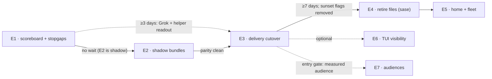

---
audio:
  edition: brief
  duration_s: 272.72
  chapter_count: 3
  episode_id: splitting-the-memory-built-instruction-migration-into-epics-1b72e1
---

# Splitting the Memory-Built Instruction Migration Into Epics: Consolidated Report

> **Research query:** How, if at all, should the migration of all existing agent
> instruction files to instructions that SASE constructs dynamically from its memory
> files right before launching each SASE agent be split into multiple epics? Building on
> the three prior research reports (SASE.md instruction delivery, instruction bundles with
> provider parity and the memory ledger, and fresh-clone bootstrap with native-subagent
> instructions) and calling out any issues in them, end with a recommended set of epics
> that have clear completion/exit criteria and easily confirmed, verifiable results, or a
> justification for not splitting the work.

<div class="listen">

♫ **Brief audio edition** · 5 min · 3 chapters · [Narration
script](memory_built_instruction_migration_epics_narration.md)

</div>


## Bottom line

**Split the work into five core epics, run in order, plus two optional ones.** Draw the
lines at the points where you need to watch real runs before taking the next step. Don't
split by provider or by report.

| # | Epic | Changes agent behavior? | Phases | You can stop here because… |
| ---: | --- | --- | ---: | --- |
| E1 | [**Instruction scoreboard and stopgaps**](#e1-instruction-scoreboard-and-stopgaps) | Grok roots and Claude helpers only | 4 | The two measured harms are fixed, and you can see every delivery bug. |
| E2 | [**Instruction bundles in shadow mode**](#e2-instruction-bundles-in-shadow-mode) | No | 4 | — (this epic only prepares E3) |
| E3 | [**Explicit delivery cutover**](#e3-explicit-delivery-cutover) | Yes, for every major provider | 6 | **Every SASE agent's instructions are built from memory at launch.** |
| E4 | [**Retire committed full instruction files (sase repo)**](#e4-retire-committed-full-instruction-files-in-the-sase-repo) | No (files, CI, humans) | 5 | — |
| E5 | [**Home layer and fleet rollout**](#e5-home-layer-and-fleet-rollout) | Interactive sessions only | 3 | **No full render of the instructions is committed or deployed anywhere.** |
| E6 | *Optional:* [TUI instruction visibility](#e6-tui-instruction-visibility) | No | 4–5 | — |
| E7 | *Conditional:* [audiences](#e7-audiences) (`when:`, launch facts, budgets) | Yes | 3–4 | — |

1. **Why split: real runs, not size.** Epics in this repo finish in hours. The median
   time to close is 3.3 h for epics with 1–4 phases and 19 h for 9 or more. An epic
   launch also assigns every phase and the land agent at once, so **an epic cannot pause
   for days to watch production.** SASE's flag rules point the same way: a `beta` flag
   must be removed before its epic lands. This program has two points where you should
   watch real runs before going on: after the stopgaps (E1), and after the delivery
   switch (E3). Those points become [epic boundaries](#the-forces). The other two
   boundaries keep unlike things apart: E2 separates rendering from delivering, and E5
   separates your personal environment from the repo.
2. **Build the yardstick first.** E1's first deliverable is one read-only command, an
   instruction scoreboard. Every later exit criterion is a specific change in its output,
   plus a `git ls-files` count or a scripted fresh clone. You confirm an epic with two or
   three commands and compare them with
   [the expected table](#the-yardstick-and-what-it-should-show-after-each-epic).
3. **One fix can ship as soon as you approve it.** Bead **`sase-1gj`** already exists
   (READY): "Grok SASE runs load zero instruction files since ~2026-09-10". None of the
   [five researchers](#about-this-report) noticed it. Fold it into
   [E1's Grok phase](#e1-instruction-scoreboard-and-stopgaps). Its suggested fix has two
   flaws (see [issue 1](#issues-in-the-three-prior-reports)), so don't launch it as
   written.
4. **The [prior reports'](#the-request-and-the-three-prior-reports) architecture
   holds.** That architecture is: render one bundle per invocation, deliver it through
   explicit channels, use two delivery slots (root and helper), and commit only an export
   stub. Fifteen issues change the plan
   ([details](#issues-in-the-three-prior-reports)). The biggest five:
   - R-delivery's Grok stopgap would send the contract twice and still omit the
     single-turn directive.
   - Its "one epic, a flag per provider, then measure compliance" conflicts with SASE's
     flag rules.
   - No report scopes the Memory History and validator code that reads the tracked
     files.
   - Claude's auto-memory gives each agent memories that depend on which workspace
     number it landed in. This session loaded `sase_12`'s index of 15 notes.
   - The "lean monitor and gate render" audience targets turns that never call a
     provider.
5. **"All existing instruction files" means 35 generated files in four places.** They are
   `sase` (20), home (5), `bob-cli` (5), and `actstat` (5). The hand-written guides in
   linked repos, such as `sase-core`'s, are repo-owned and **out of scope**. Epic
   `sase-165` made that choice on purpose on 2026-09-22.

A lighter plan with three epics (E1; E2+E3; E4+E5) is
[viable](#the-alternatives). It gives up the shadow-mode check and mixes the home change
into the repo change.

## The request and the three prior reports

The request: migrate every existing agent instruction file so that SASE builds each SASE
agent's instructions from memory files right before it launches. The requester mostly
accepts three earlier reports, referred to below by these labels:

- [SASE.md and per-invocation delivery](../sase_md_instruction_delivery/sase_md_instruction_delivery.md)
  (**R-delivery**);
- [provider parity and the memory ledger](../instruction_bundles_provider_parity_and_memory_ledger.md)
  (**R-ledger**);
- [fresh-clone bootstrap and native subagents](../fresh_clone_bootstrap_and_native_subagent_instructions/fresh_clone_bootstrap_and_native_subagent_instructions.md)
  (**R-fresh**).

The request asks for issues in those reports, a decision on whether to split the work
into epics, and a recommended set of epics. Each epic needs completion criteria the
requester can easily confirm.

## Issues in the three prior reports

The architecture holds. These issues change the plan, roughly in order of impact. The
last column says where the [recommended epics](#recommended-epics) absorb each one.

| # | Report | Issue | Consequence if followed as written | Fix (epic) |
| ---: | --- | --- | --- | --- |
| 1 | R-delivery Phase 0, and `sase-1gj` | The Grok stopgap pipes "project instructions **plus the home layer**" into `--rules`, but both files carry the full SASE contract. It also adds no single-turn directive, and Grok gets none today. `sase-1gj` adds `GROK_CLAUDE_AGENTS_ENABLED=0`, which R-delivery itself showed is ineffective. | Grok would get the contract twice, which is the same bug the reports diagnose in Claude and Codex, and it would still miss the directive. | E1.2: `--rules` carries the Grok directive plus the project `AGENTS.md` **once**. The home layer arrives through the bundle in E3 (home-only content is about 0.2k tokens). |
| 2 | R-delivery Phase 1, R-ledger §6 | "One epic, a feature flag per provider", followed by a compliance comparison | Under `sase_flags`, a `beta` flag must be deleted before its epic lands. Because epics can't wait for days, the flags die before the measurement exists. | E3 ships explicit delivery **on by default**, with a per-provider **`sunset`** flag that keeps the legacy path reachable. Each flag's removal bead is triaged after the soak. |
| 3 | All three | **Nothing scopes the code that reads the tracked files.** That includes the Rust Memory History instruction subjects and shim folding, the sase-1ev.9 INSTRUCTIONS rail, the "AGENTS.md as launched" row, `capture_instruction_snapshot`, the memory-init tracking validators, the CI `sase init memory --no-commit` step, the Memory panel publish action, and `/sase_memory_write` step 4. | Untracking would end subject histories abruptly. Validators would reject ignored files, and init would bring the retired files back. | E4.4 is a cross-repo phase that covers the history surfaces and the pin move. E4.1 retires producers and validators together and adds an idempotence check. |
| 4 | R-ledger §3 | Claude auto-memory is treated as merely "foreign", with the decision deferred. | It is **nondeterministic**: what an agent knows depends on which `sase_<N>` it got. No other provider sees it, and memory review never does. That contradicts "same instructions for every agent". | E3.3: turn it off in SASE runs (the switch exists in 2.1.289). File one `memory` task bead to harvest the 11 non-empty directories. Treat Grok memory v2 (enabled in about half of sessions, empty so far) the same way. |
| 5 | R-delivery use case 4 and Phase 3 | The "lean monitor and gate renders" audience | Monitor and gate turns never call a provider. The agent turn *after* one is an ordinary root turn, and it needs the full contract. | Drop it. E7 is left with a thin corpus, so it stays behind a measured entry gate. |
| 6 | R-delivery R7 | Its "decisive fact" was that Codex can't suppress project files. R-fresh refuted it: `-c project_doc_max_bytes=0` works, and cdx re-probed it offline. | The interim "complement mode" design for Codex becomes dead code. R7 still holds for audience and churn reasons. | Build no complement mode. Codex switches with `project_doc_max_bytes=0` in E3. agy, and Muse if its trust spike fails, stay on legacy delivery until E4 switches each one **atomically** with its stub. |
| 7 | R-delivery, R-fresh | "Exactly once" and "no SASE-owned native file" are stated as absolutes, yet R-fresh deliberately lets Muse and agy load the stub. | The acceptance criteria contradict each other. | Use these invariants instead: one full render per provider attempt for the right actor; no second *full* projection; a declared stub is allowed and its cost measured; a resumed session records `inherited`; helpers are judged against the helper contract (cdx). |
| 8 | R-delivery R8 | A ≤1,600-token project-layer budget, but today's project render is about 4.4k tokens | Deduplication saves only about 0.8k. The rest needs roster and trigger rewrites, which are content work. | E2 records the baseline, and E3 ships without truncation. A ratchet goes in E7, or in a separate parallel tale on today's generator. |
| 9 | R-delivery `when:` example | `not: { tribe: [research] }` on the TUI note drops lint and TUI triggers for researchers. | Researchers can edit code; this session is a researcher run. That breaks R9 ("baseline triggers are unconditional"). | E7 may vary only optional density. A matrix test asserts that baseline triggers are present for every audience. |
| 10 | R-ledger Phase 0 | Ships the header chip, Receipt card, and lane header in "observed mode", on a data model that Phase 1 replaces | TUI work (visual snapshots, performance budgets) gets done twice. | E1 is CLI only. The TUI is built once, in E6, on the final manifest schema. |
| 11 | R-ledger | Calls the per-invocation record a **receipt**, and proposes `sase doctor instructions` | Clashes with glossary **Receipt** and its decision record. `doctor` has no subcommands. | Call it an *instruction manifest*. Add a `sase instructions` group (absorbing `memory agent-docs`) plus a doctor `-C instructions` deep-check group. Read `cli_rules` first. |
| 12 | All three | Success criteria such as "Grok's rate recovers toward 60%", "Explore direct reads fall to 1.5%", and "112 commits → ~0" | A land agent can't check these when it lands. Epics would either never close or close on faith. | Every epic below separates **exit criteria** (fixtures, probes, one command) from **watch metrics** (read during the soak). |
| 13 | R-delivery, R-fresh | "Retire `sase/memory/sase.md` into the package base" is described as a memory-architecture change, and the root-only sentence as a memory edit. | Both overstate the cost. The note is already generated from a packaged template. | E1.4 edits the template. E2's compiler reads the template directly and ignores the generated notes as superseded input. E4 stops projecting them. |
| 14 | R-delivery, R-fresh | The scope is described as the "20 tracked files". | `bob-cli`, `actstat`, and home also have generated sets. Without a disposition, linked-repo guides would be swept up too. | E1 records an ownership inventory with one of four outcomes per surface (cdx). E5 handles the other projects. |
| 15 | R-delivery | Composition in Python and the evaluator in Rust, decided by report and not by plan | A phase worker reading the Rust-boundary rule cold may start porting 7k lines, or may create a dual path. | Each plan states its split ([resolution](#rust-and-python-boundary)). |

Smaller items, absorbed as tests or plan notes:

- **Latency.** R-fresh measured about 2 s per render, and rendering would now happen on
  every invocation. E2 caches renders by input digest, and warm p95 must stay under a
  budget you set (about 250 ms is suggested).
- **Privacy.** Sending the home layer to Grok, Muse, and agy shares tailnet and Obsidian
  details with more vendors. E3's decision record says yes or no to this on purpose.
- **Codex shadow home.** Write private regular files, and don't follow the inherited
  `AGENTS.md` or `AGENTS.override.md` symlinks (cdx). Otherwise SASE could overwrite your
  real global file.
- **Exclude scope.** `claudeMdExcludes` must name exact SASE-owned paths. A broad glob
  would hide the `CLAUDE.md` in linked repos under `sase/repos/` (cld).
- **Muse prefix.** Interrupt reconstruction must never nest a second bundle (cld).
- **Remote dispatch.** Render on the *target* host, and refuse a mismatched protocol
  version.
- **Skills.** Globally deployed skills still assert turn obligations in interactive
  sessions. Record this as a known gap of E5, not a blocker (grk).

## Should you split at all

### The forces

| Force | What it implies |
| --- | --- |
| Two behavior changes need **days of real runs** before the next step: E1's stopgaps and E3's channel switch. Epic launches assign every phase at once, and `beta` flags die with their epic. | Each wait becomes an epic boundary. Behavior-changing epics use `sunset` kill switches. |
| **Blast radius.** A renderer bug reaches 100% of agents, including the agents that would fix it. | Ship the renderer in **shadow mode** first, as its own epic. Check that its output matches today's before anything depends on it. |
| **Different ways of checking.** Session-record parsing, `git status` and fresh clones, `chezmoi apply` on three machines, TUI snapshots, matrix budgets | One epic per kind of check keeps each epic's closing note honest. |
| **Cross-repo work.** `sase-core` (pin moves), `chezmoi` (home files), `bob-cli` and `actstat` (re-init) | Keep each cross-repo step inside one phase. Keep your personal environment out of the repo epic. |
| **Memory-edit authorization** | Smaller plans make it practical to name every memory change. |
| **Epic size in this repo.** Median 5 phases, maximum 20. Time to close rises about 6× from 1–4 phases to 9+, while abandonment does not. | Size alone doesn't forbid one big epic; the waits and the checks do. Aim for 3–6 phases. |
| **Shared infrastructure** (compiler, manifest, `DeliveryPlan` hook) | Don't split by provider. Providers are phases inside E3. |

### The alternatives

| Option | Verdict |
| --- | --- |
| **One epic** (about 22 phases) | **Reject.** It is longer than any epic this repo has run, it has no room for the two waits, and it breaks the flag rules. One failure blocks everything, and its closing note would have to confirm a Grok fix, a fresh clone, and a TUI deck at once. |
| **One epic per provider** | **Reject as the main cut.** Each one needs the compiler, manifest, and hook first, so a shared-infrastructure epic appears anyway. They would then fight over `_invoke.py`, the hook, and the CLI. |
| **One epic per report** | **Reject.** The reports split by *question*, not by dependency, and their "Phase 0–2" numbers name different work. |
| **Tales instead of an E1 epic** (grk) | **Fine for Grok alone, if you want it today.** Triage `sase-1gj` with the corrected fix from issue 1. E1 still needs the scoreboard and the Claude helper fix, so the epic stays and loses one phase. |
| **Three epics** (E1; E2+E3; E4+E5) | **A viable lighter plan.** You lose the shadow-mode checkpoint, and the home-environment change rides with the repo change. Choose it if writing and approving plans bothers you more than the risk of a renderer bug reaching every agent. |
| **Five core epics with soak boundaries, plus optional E6 and E7** | **Recommended.** |

### Splitting rules

**Keep together** in one epic and one phase or change:

- a provider's explicit delivery and its native-file suppression; split them and you get
  a double or empty context;
- an unsuppressible provider's switch and the replacement of its stub (agy);
- the compiler and its manifest;
- a Rust change and its pin move;
- a CLI rename and its docs.

**Keep apart:**

- observing from changing (E1's scoreboard comes first; E2 comes before E3);
- runtime changes from committed-file changes (E3 before E4);
- repo changes from your home environment (E4 before E5);
- anything speculative from anything measured (E7 waits behind a gate).

## The yardstick and what it should show after each epic

E1.1 builds `sase instructions verify` (the name is a proposal; follow `cli_rules`). It
is also registered as doctor deep-check group `instructions`. It reads **each
provider's own session records**, never what SASE wrote:

- Claude transcript `instructions` and `prompt_snapshot` attachments, plus
  `subagents/agent-*.jsonl`;
- Codex rollouts;
- Grok `prompt_context.json` and `system_prompt.txt`;
- Muse `session.jsonl`.

agy records nothing, so it shows `◌` (unverifiable). The command reads only the newest
runs for each provider: history scans are what caused athena's resource spikes. It
prints a table and `-j` JSON.

**Baseline, which E1 must reproduce** (values from the reports and the lead's checks):

```
provider contract home project directive native-SASE-full foreign      helpers
claude      2×     ✓     ✓        ✓          2           auto-memory  gp: root contract, 13–15 `sase final`/30d, 2 accepted; Explore: nothing
codex       2×     ✓     ✓        ✓          2           —            0 spawns/30d
muse        1×     ✗     ✓        ✓          1           —            0 spawns
grok        0      ✗     ✗        ✗          0           memory-v2½   4/706 children: nothing
agy         ◌      ✗     ◌        ✓          ◌ (likely 2) —           —
```

**If the scoreboard shows all green on day one, the scoreboard is wrong.** That is E1's
first exit criterion. gem's proposed baseline ("Grok 1×, Muse 1×") would fail it.

**Target after each epic** (columns not shown stay the same):

| After | Claude | Codex | Muse | Grok | agy | Also |
| --- | --- | --- | --- | --- | --- | --- |
| E1 | helpers: helper template present; covered `sase final` attempts denied | — | — | contract 1×, project ✓, directive ✓, still untrusted | — | baseline and after JSON attached to the epic |
| E2 | — | — | — | — | — | new **manifest coverage** column at 100%, plus an intended-vs-observed diff per section |
| E3 | bundle 1×, home ✓, native 0, auto-memory off | same | same, or legacy if its spike failed | same, home ✓ | legacy (declared) | helper bundle ids on Claude helpers |
| E4 | unchanged | unchanged | stub only, if it was legacy | unchanged | prefix bundle + stub | `git ls-files` instruction files: **20 → 2** |
| E5 | unchanged | unchanged | unchanged | unchanged | unchanged | home has no turn obligations; `bob-cli` and `actstat` go **5 → 2** each |

## Recommended epics

Every plan carries the [checklist](#checklist-for-every-epic-plan). Sizes use the SASE
scale. *Probes* are tiny real agent runs (`xsmall` exists for "launching SASE agents
only to observe their output while testing a SASE agent feature").

### E1 Instruction scoreboard and stopgaps

**Goal.** Show today's delivery bugs with one command, and stop the two measured harms:
Grok roots get nothing, and Claude helpers submit their parent's declaration.

**Entry:** none.

| Phase | Size | Depends on | Scope |
| --- | --- | --- | --- |
| E1.1 `scoreboard` | medium | — | Observed-mode parsers for each provider, with redacted fixture tests. Fingerprints: contract heading, home H1, project H1, directive marker. Helper rows: Claude helper `sase final` attempts and acceptances; child counts for Codex, Grok, and Muse. A foreign column. Bounded scans, `-j`, and the doctor group. Fold `sase memory agent-docs list` into the new group. Record the **ownership inventory**: each of the 35 generated and ~10 hand-written surfaces is *migrate*, *projection*, *repo-owned*, or *deferred*, with a reason. |
| E1.2 `grok-root` (absorbs `sase-1gj`) | small | — | `--rules` = the Grok single-turn directive plus the workspace `AGENTS.md` text **once**, in SASE-managed projects only. Never pass `--trust`. Drop `GROK_CLAUDE_AGENTS_ENABLED`. Run a canary probe: if `system_prompt.txt` or `prompt_context.json` doesn't show the rules text, Grok's presence is reported as `unverifiable`, and an adapter test proves the argv carries it. |
| E1.3 `claude-helpers` | medium | — | A packaged helper template via `--append-subagent-system-prompt-file`. A PreToolUse guard in per-run `--settings` that denies `sase final (context\|prepare\|submit)` and root-only skills when the hook input has `agent_id`. Probe whether forks carry `agent_id`. A version guard that fails if the hidden flag stops parsing. Native `CLAUDE.md` stays (R-fresh). |
| E1.4 `record` | small | E1.1–E1.3 | Add the actor-qualified root-only sentence to `memory-sase.template.md`. Rewrite `docs/agent_providers.md` "Instruction double-load". Write the decision record **"Native Helpers Return; Only Roots Declare"**. Attach baseline and after scoreboard JSON to the epic. Close `sase-1gj` as superseded. |

**Exit criteria (checked at landing):**

- [ ] The scoreboard fixtures reproduce
      [the baseline above](#the-yardstick-and-what-it-should-show-after-each-epic). A
      live run over recent history shows Claude 2×, Codex 2×, Muse home ✗, and Grok 0.
- [ ] A Grok probe shows contract 1×, project ✓, and directive ✓ (or a declared
      `unverifiable` plus the argv test), and `agents_md_files: []`.
- [ ] A Claude probe: the root spawns one general-purpose helper and one Explore
      helper, and each tries `sase final submit`. Both attempts are denied, and both
      helper transcripts contain the helper-template marker. The root can still submit.
- [ ] Fork and other-provider helper limits are listed by capability, not hidden.
- [ ] The inventory records a disposition for every surface.

**Confirm it yourself (about 10 minutes, after deployment):**

```bash
sase instructions verify --since 24h            # Grok row flips 0 → 1×
sase instructions verify -p claude --helpers    # denied attempts, zero accepted helper declarations
```

**Watch for at least 3 days:** Grok's non-research final-declaration rate (60% before
the regression, 26% after); Claude helper `sase final` attempts, and accepted helper
declarations, which should be 0.

**Rollback:** revert the adapter argv. No committed instruction file changes.

**Memory edits to name in the plan:** the new decision record. The template sentence is
a code change, but it regenerates every generated instruction file.

### E2 Instruction bundles in shadow mode

**Goal.** Render and record the bundle for **every** invocation without delivering it,
and show that it matches today's files.

**Entry:** E1 has landed. No wait is needed, because nothing in E2 changes behavior.

| Phase | Size | Depends on | Scope |
| --- | --- | --- | --- |
| E2.1 `manifest-wire` | medium | — | The instruction-manifest schema in `sase-core`. It covers source identity (scope, section id, digest, blob), bundle identity (compiler version, ordered sections, required or optional, exact-bytes digest, `common_digest`), delivery identity (actor, parent, invocation, attempt, and session ids, CLI version, channel), and observation status. Binding, round-trip tests, pin move. |
| E2.2 `compiler` | medium–large | E2.1 | Layers: package (contract from the existing template, plus today's four adapter directives as provider sections), plugin (only if a plugin contributes text today), home, project, launch. Deduplicate by section id. **Root, helper, interactive, and export overlays.** Facts: `actor` (`sase_root`\|`native_helper`\|`interactive`), `purpose`, `mode` (`runtime`\|`interactive`\|`export`), execution `provider`, `project`, `host`, `vcs`. The host sets them; project content can never promote a helper to root. Cache by input digest. Record a budget **baseline** without truncating. `sase instructions render --as <agent\|facts>`. |
| E2.3 `invocation-hook` | medium | E2.2 | Render at `_invoke.py` after the provider is resolved, and in both finalizer follow-ups. Write `instructions/NN-<provider>.{md,json}` and a content-addressed store. Add an `agent_meta` summary and `SASE_INSTRUCTIONS_FILE`. Add an **architecture test** that no `provider.invoke` call bypasses the hook. Keep `capture_instruction_snapshot` running in parallel. |
| E2.4 `parity` | medium | E2.3, E1.1 | The scoreboard compares manifests with what was observed, section by section. A parity test for the `sase`, `bob-cli`, and `actstat` fixtures: the bundle contains every section of the root and home files, and the contract exactly once. |

**Exit criteria:**

- [ ] `diff <(sase instructions render --as provider=codex) <(sase instructions render --as provider=grok)`
      shows only the provider section.
- [ ] Rendering as root, helper, and interactive: only the root render contains the
      final-declaration contract.
- [ ] The architecture test passes, and fixtures cover the ordinary, declaration-recovery,
      conflict-repair, and fallback-to-another-provider routes.
- [ ] The parity test passes in CI for all three projects. Rendering never changes
      tracked files.
- [ ] Warm render p95 is within budget, and the manifest records it. Identical inputs
      give byte-identical output.
- [ ] The scoreboard's *observed* columns are unchanged from E1.

**Confirm it yourself:**

```bash
sase instructions render --as <recent-agent-name> | head -40
sase instructions verify --coverage --since 24h    # manifest coverage N/N
```

**Rollback:** disable the hook. Nothing reads manifests yet.

**Memory edits:** none. **Rust:** E2.1 moves the pin.

### E3 Explicit delivery cutover

**Goal.** Every major provider gets the bundle **exactly once** through its explicit
channel, SASE-owned full native files are suppressed, and Claude helpers get the helper
bundle. **This completes your stated goal for SASE agents.**

**Entry:** E1 has had at least 3 days of runs and its readout is acceptable. E2's parity
check is clean.

| Phase | Size | Depends on | Scope |
| --- | --- | --- | --- |
| E3.1 `spikes` | small (+ xsmall probes) | — | Can Muse run safely without `--trust-workspace`? Does Grok record the `--rules` text anywhere? Do `claudeMdExcludes` exact paths cover home, workspace, and nested files while sparing `sase/repos/**`? A `codex debug prompt-input` fixture for `project_doc_max_bytes=0`. Check the auto-memory switch with a probe. |
| E3.2 `delivery-plan` | medium | E3.1 | An `llm_instruction_delivery` hook returning a `DeliveryPlan` with `root` and `subagent` slots, each declaring a status (`explicit`\|`inherits-native`\|`inherits-root`\|`none`). Unknown or plugin providers default to `inherits-native` (legacy). Per-provider **`sunset`** flags, each with tests for both states. On a render failure, use legacy delivery for that one invocation and notify you. On `%dispatch`, render on the target host and refuse mismatched protocol versions. |
| E3.3 `claude` | medium | E3.2 | Root bundle via `--append-system-prompt-file`, with the directive folded in. The helper bundle replaces E1's template, and the guard stays. Exact-path `claudeMdExcludes`. Auto-memory off in SASE runs. Wait-continuations record `inherited`, because the system-prompt snapshot is reused. |
| E3.4 `codex-grok` | medium | E3.2 | **Codex:** the shadow `$CODEX_HOME/AGENTS.md` becomes a private file holding the neutral core plus home. `developer_instructions` carries the root overlay and directive (v1 children copy it, and the actor-qualified sentence covers them). Add `project_doc_max_bytes=0` in SASE-managed projects only, and fail loudly over 32 KiB. **Grok:** `--rules` carries the full root bundle, replacing E1.2. Grok memory v2 is decided alongside auto-memory. |
| E3.5 `muse-agy` | medium | E3.2 | **Muse:** prompt-prefix delivery. Drop `--trust-workspace` if E3.1 passed; otherwise Muse declares `inherits-native` until E4. Test that interrupt reconstruction never nests a second bundle. **agy, Qwen, OpenCode:** declared `inherits-native` until E4. |
| E3.6 `conformance` | small | E3.3–E3.5 | The scoreboard asserts each bundle id appears exactly once per invocation and per helper. Decision record **"Instructions Are Rendered Per Invocation And Delivered By Adapters"**: R1, R4, R6, R9, R10, R14, the Rust/Python split, the home-layer privacy decision, the foreign-memory decision, and when to reopen. |

**Exit criteria:**

- [ ] Probes since landing: Claude, Codex, Grok, and Muse (unless declared legacy) show
      bundle 1×, contract 1×, home ✓, and full native SASE files 0. agy shows declared
      legacy.
- [ ] Claude helper transcripts, including Explore, carry the helper bundle id and never
      the root's. Covered helper finalize attempts are denied.
- [ ] Turning each sunset flag off restores E1's after-state for that provider: tests for
      both states, plus one live probe.
- [ ] Re-rendering a finished agent reproduces its manifest hash.
- [ ] Tests show a linked repo's `CLAUDE.md` is not excluded, a foreign repo's
      `AGENTS.md` still loads, and `~/.codex/AGENTS.md` is byte-identical after a run.

**Confirm it yourself:**

```bash
sase instructions verify --since <landing>      # every major row: 1× / ✓ / ✓ / 0
sase instructions verify -p claude --helpers     # helper bundle ids, no root ids
sase flag list | grep instruction                # the sunset kill switches
```

**Watch for at least 7 days:** final-declaration rate per provider, against E1's
readout; memory trigger reads per run (`memory_reads.jsonl`), against baseline. For
Claude, the instructions moved from a user message to the system prompt. Then answer
each flag's removal bead: **Remove**, or disable one provider and fix its adapter.

**Rollback:** `sase flag disable <provider-flag>` on each execution host.

**Memory edits:** the decision record. File one `memory` task bead through
`/sase_new_task` to harvest the auto-memory notes.

### E4 Retire committed full instruction files in the sase repo

**Goal.** Stop committing full renders. Fresh clones get a correct stub, developers get
a gitignored interactive projection, and everything that read the old files keeps
working.

**Entry:** E3's sunset flags are **removed**. After this epic, "flag off" would leave a
provider with only the stub. Every execution host also runs E3's code.

| Phase | Size | Depends on | Scope |
| --- | --- | --- | --- |
| E4.1 `export-and-producers` | medium | — | `sase instructions export`: a `mode: export` stub of at most 80 lines with the bootstrap clause, plus a two-line `CLAUDE.md`. `--check` replaces the instruction half of CI's `sase init memory --no-commit`, in the **same change** that stops `sase memory init` writing full files and that updates its tracking validators. Add an idempotence test: running init and memory maintenance twice never recreates a retired file. |
| E4.2 `sync-and-lkg` | medium | E4.1 | `sase instructions sync` (R13). It is hermetic, refuses workspaces, writes only gitignored files that carry its own header, and supports `--if-stale` and `--check`. Add `just agent-instructions`, call it from `just install`, and gitignore `AGENTS.override.md`. Workspace prep deletes projection paths. Add the **last-known-good store** that now replaces the legacy fallback. |
| E4.3 `nested-and-shims` | medium | E4.1 | Turn `tools/`, `src/sase/ace/`, and `demos/tapes/` into path-scoped reference notes, and merge the duplicate Symvision text. Delete `GEMINI.md`, `QWEN.md`, `OPENCODE.md`, and the nested copies, and update `PROVIDER_SHIM_FILES`. **Switch agy (and Muse, if it was legacy) to prefix delivery in this same change.** |
| E4.4 `history-surfaces` | medium (crosses `sase-core`) | E4.1 | Update the Memory History instruction subjects for the stub era. The launch row reads manifests, and legacy rows stay for old runs. Retire `capture_instruction_snapshot`. Update the Memory panel publish action and the `sase init` inventory. Move the pin. |
| E4.5 `docs-and-memory` | small | E4.1–E4.4 | Rewrite `glossary:agent-instruction-file` and add the terms *Instruction Bundle* and *Instruction Manifest*. Update `/sase_memory_write` step 4 (template, land, deploy), `docs/init.md`, `docs/agent_providers.md`, `docs/memory.md`, and CONTRIBUTING. |

**Exit criteria:**

- [ ] `git ls-files | grep -cE '(^|/)(AGENTS|CLAUDE|GEMINI|QWEN|OPENCODE)\.md$'` prints
      `2`.
- [ ] CI fails if `AGENTS.md` is over budget or mentions `/sase_final`. A deliberate drift
      is caught *before* any step regenerates it.
- [ ] Scripted fresh clone (`HOME=$(mktemp -d)`, no SASE): `codex debug prompt-input`
      shows the stub and its bootstrap clause, and no turn obligations.
- [ ] After `just install`, Codex sees the interactive render through
      `AGENTS.override.md`, Claude sees it through the import, and `git status` is clean.
      A user-owned override is left alone and reported.
- [ ] Editing a reference note's body changes the next bundle but no tracked file.
- [ ] Memory History opens the root `AGENTS.md` history across the stub boundary. New
      agents show a bundle id; old agents show the legacy snapshot.
- [ ] Edit-under-scope probe: an agent editing under `src/sase/ace/` makes the audited
      read of its path note. If not, keep that native file and record the exception.
- [ ] The scoreboard is unchanged from E3, except that agy (and Muse, if it was legacy)
      now loads the stub only.

**Confirm it yourself:**

```bash
git ls-files | grep -cE '(^|/)(AGENTS|CLAUDE|GEMINI|QWEN|OPENCODE)\.md$'   # 2
sase instructions export --check && wc -l AGENTS.md                         # ≤ 80
git clone -q <repo> /tmp/fc && cd /tmp/fc && just install && git status --short   # empty
```

**Watch for 30 days:** commits touching `AGENTS.md`, against the 112 in 60 days before;
they should fall to near zero.

**Rollback:** restore the previous delivery version or use the last-known-good path.
A flag can no longer do it.

**Memory edits:** the three nested sets and their new path-scoped notes, `symvision.md`,
the glossary term plus two new terms, and the skill template.

### E5 Home layer and fleet rollout

**Goal.** Your interactive sessions and your other SASE projects stop carrying turn
obligations and full renders.

**Entry:** E4 has landed. The home-file phase depends only on E3, because SASE runs have
excluded or replaced the home files since then.

| Phase | Size | Scope |
| --- | --- | --- |
| E5.1 `home` (chezmoi, through `/sase_repo`) | medium | `~/AGENTS.md` and `~/CLAUDE.md` become `mode: interactive` renders of home memory. Delete the home `GEMINI.md`, `QWEN.md`, and `OPENCODE.md`. Replace the hostname `.tmpl` switch with the `host` fact. Land in chezmoi first, then apply on athena, apollo, and mac. |
| E5.2 `projects` | small | `bob-cli` and `actstat` adopt export and sync through `sase init`. Check the scoreboard for their runs. |
| E5.3 `interactive-launch` | medium | `sase tmux-agent` launches through the delivery hook with `mode: interactive`. Docs. |

**Exit criteria:**

- [ ] On every execution host, after `chezmoi apply`:
      `grep -c "SASE Final Declaration" ~/AGENTS.md ~/CLAUDE.md` prints 0, and the
      other three home copies are gone.
- [ ] `bob-cli` and `actstat` each track 2 instruction files, and their SASE runs score
      1× / ✓ / ✓ / 0.
- [ ] A `sase tmux-agent` launch writes a manifest with `mode: interactive`.
- [ ] Probe: an interactive `claude -p --model haiku` in `~` is asked "should you run
      `/sase_final` before ending?" and answers no.

**Known gap, not a blocker:** globally deployed skills still describe turn obligations.
That is a follow-up task for skill-template audiences.

### E6 TUI instruction visibility

*Optional epic.*

**Entry:** E3 has landed, so the manifest schema is stable. It can run alongside E4 and
E5.

**Scope.** R-ledger's design, renamed: a Rust `ledger_view` joining manifest, observed
loads, `memory_reads.jsonl`, and current blob. Also an identity-header chip (quiet when
OK; `‼` and `∅` are loud), the upgraded Context MEMORY lane, a **MEMORY deck on picker
letter `y`** with Manifest, Ledger, and Bundle cards, a repairable
`instruction_manifests.jsonl` reverse index for the Memory pane's **Seen by**, and
`sase instructions show`.

**Exit:**

- [ ] `sase instructions show -j <agent>` equals the deck's data in a test.
- [ ] Visual snapshots exist for each chip state.
- [ ] The `tui` memory's performance budgets hold, with no synchronous history scan on
      selection.
- [ ] A missing or corrupt index rebuilds without changing any manifest.
- [ ] Old runs are never shown as proven deliveries.

### E7 Audiences

*Conditional epic.*

**Entry gate.** At least two conditionals whose value is *measured* by joining E2/E3
manifests with `memory_reads.jsonl`. Likely candidates: the phase-worker bead rule as a
positive rule, commit-method text, and decision-roster density for research runs. **Not**
monitor or gate renders, and never a rule that removes baseline triggers.

**Scope:**

- the launch-fact schema and declarative `when:` evaluator in `sase-core`, with LSP
  validation;
- `when:` in note frontmatter;
- `sase instructions check --matrix` with per-audience budgets ratcheted from E2's
  baseline;
- the first conditionals;
- a `SASE.md` composition spec **only if** a project needs layout that notes can't
  express (`corpus-before-mechanism`).

**Exit:**

- [ ] The matrix check is green in CI.
- [ ] Every audience contains the hard rules and baseline triggers (the R9 test).
- [ ] An over-budget fixture fails.
- [ ] Token changes per audience are recorded in manifests.
- [ ] Turning a spec off returns the fixed E2/E3 render.

## Sequence and calendar



What you actually do:

1. **Now:** approve E1. Its Grok and Claude phases start right away.
2. **E1 lands:** approve E2 immediately.
3. **About 3 days later, E2 has landed and parity is clean:** read the E1 watch metrics,
   then approve E3.
4. **About 7 days after E3:** answer the flag-removal beads, then approve E4.
5. **E4 lands:** approve E5. Approve E6 any time after E3, and E7 only when its gate is
   met.

Each epic should take hours to implement. **The calendar is set by the two waits and by
your reviews:** about two to three weeks for E1–E5. Write each plan after the previous
epic lands, so it can use that epic's evidence.

## What should not be an epic

| Item | Form | Trigger |
| --- | --- | --- |
| Removing E3's sunset flags | Their flag beads (FlagTriage) | After E3's wait |
| Harvesting Claude auto-memory notes | One `memory` task bead | E3.3 lands |
| Shrinking the project layer toward 1.6k tokens on today's generator | Optional parallel tale | Any time; confirm with `wc -l AGENTS.md` |
| Grok child channel (shadow `$GROK_HOME/rules`, OAuth caveat) | Spike task | Grok helper sessions above about 2% for two weeks on the scoreboard |
| Muse and agy child channels; Codex `multi_agent_v2` helper override | Spike tasks | Usage appears, or v2 is enabled |
| `traits:` labels; a prompt escape hatch | Task, then an E7 follow-up | A section needs a label no fact provides |
| Optional Claude SessionStart and git refresh hooks | Task | Interactive staleness proves annoying |
| `sase/memory` for `sase-core` and other linked repos | Separate decision | You want their guides backed by memory |

## Checklist for every epic plan

1. **Memory edits by file.** Phase workers may edit only what the approved plan names.
2. **The Rust/Python split** for the epic, and whether `sase-core-revision.txt` moves.
3. **Flag kind.** Behavior changes get `sunset` kill switches. Use `beta` only for
   scaffolding the epic itself removes.
4. **Exit criteria and watch metrics kept separate.** Each criterion names the command,
   test, or probe that proves it.
5. **The scoreboard change** the epic must produce, plus an acceptance record attached
   to the epic. The record holds revisions, CLI versions, commands run, and before and
   after JSON.
6. **CLI shape per `cli_rules`.** No `sase doctor <subcommand>`.
7. **Cross-repo phases** opened through `/sase_repo`, each with its own commit
   obligation. Deploy generated skills only from landed source.
8. **No workspace paths** in plan files.

## Where the five researchers disagreed

| Question | Positions | Resolution and basis |
| --- | --- | --- |
| How many epics | cdx 6 (4 core); cld 5 + 2 optional; grk P0 tales + 4 + 1 optional; mus 6; gem 5 | **5 core + 2 optional.** The boundaries follow the two waits and the two separations above. |
| Stopgaps: epic or tales | grk: tales. cdx, cld, gem: in E1. mus: inside later epics. | **E1 phases with no dependencies on each other**, so the Grok fix doesn't wait for the scoreboard. `sase-1gj` is folded in. |
| Scoreboard: own epic, and TUI chip in E1? | grk: own epic with a TUI chip. mus: own epic. cdx, cld, gem: with the stopgaps, CLI only. | **With the stopgaps, CLI only.** A chip built on the observed-mode model would be thrown away (issue 10). |
| Shadow compiler separate from delivery? | cdx, cld, mus: yes. grk, gem: no ("a renderer with no consumer is dead code"). | **Yes.** Shadow mode isn't dead code. It renders on every invocation, writes manifests, and is checked against what providers actually loaded. That is the parity proof E3 needs. |
| Flags | gem: a flag table spanning epics. mus: per-provider flags held through a 2-week window. grk: per-provider `beta` flags, waiting inside E2. cld: one `sunset` flag. | **Per-provider `sunset` flags in E3** (Claude, Codex, Grok, Muse). These are the only kind the rules let outlive the epic. Rollback is one `sase flag disable` per host and provider. gem's and mus's tables break the rules. |
| Complement mode | mus, gem: keep it for Codex. grk, cld: obsolete. | **None** (issue 6). |
| Where the home layer goes | cld: its own epic. cdx, grk: inside the retirement epic. mus: a separate gate. | **E5, together with the other projects and `tmux-agent`.** It needs `chezmoi apply` checked on every execution host, which a land agent can't do. |
| Retiring `sase.md` | cld, mus, gem: E2. grk: keep it through delivery. cdx: treat it as superseded input. | **cdx** (issue 13). |
| Last-known-good render | R-delivery and mus: from the start. grk: once files are gone. | **E3:** on a render failure, use the legacy native path for that one invocation and notify you (the files still exist). **E4:** a last-known-good store keyed by actor, project, and provider; it never substitutes across actors (cdx). |
| Lean monitor/gate audience | grk, gem, mus, R-delivery: keep. cld: doesn't exist. | **Drop it** ([lead verified](#what-the-lead-verified), issue 5). |
| Export stub size | R-fresh, cld, gem: ≤80 lines. mus: ≤15. | **≤80 lines, enforced, aiming for about 40.** 15 lines can't hold the bootstrap clause, build and test commands, and the two core conventions. |
| Exit windows | mus: 30-day helper counts. gem: "100 consecutive invocations", "<50 ms deck". | **Check at landing; anything that needs days becomes a watch metric.** |
| MEMORY deck key | grk: `p` is taken. R-ledger: `p` `y`. | **R-ledger is right** (verified). |

### Rust and Python boundary

The decision record `decisions:rust-core-required` and the
`rust_core_backend_boundary` core memory put shared, deterministic domain behavior in
`sase-core`. cdx wants the new compiler's selection, ordering, and serialization in Rust
from the start. The other four researchers, and R-delivery, keep composition in Python.

**Recommendation:**

- **E2: the manifest schema goes in `sase-core` from day one.** That means serde wire
  types, a binding, a round-trip test, and a pin move. The schema is the contract that
  E3's conformance, E4's history row, E6's ledger, and E7's evaluator all consume, so
  defining it once avoids moving it later. **Markdown composition stays in Python.** The
  memory renderer it draws on is entirely Python today, and so far only Python code
  needs the composition (launch and CLI preview).
- **E4:** `memory_history/subjects.rs` for the stub era.
- **E6:** the `ledger_view`, which CLI and TUI must agree on.
- **E7:** the fact schema and the `when:` evaluator. Python composition calls them per
  section.

Reopen this choice if a non-Python front end, such as the editor or a web view, needs to
preview a render. Then move composition into Rust at that point, rather than keeping two
copies. Record the split in E3's decision record.

## What the lead verified

Everything here was checked on 2026-10-05 against sase `235e9ba0c9`, Claude Code
2.1.289, and grok 1.0.46. The reports' other numbers are carried over and labeled in the
[evidence index](#evidence-index).

| Claim | Result | Bearing on the split |
| --- | --- | --- |
| A bead already tracks the Grok zero-load bug | **Yes, `sase-1gj`.** It is READY, size `large`, and was filed by `research.3n.cld`. Its suggested fix includes `GROK_CLAUDE_AGENTS_ENABLED=0`, which R-delivery showed has no effect on a top-level `CLAUDE.md`. | Fold it into E1.2 with a corrected fix. Close it as superseded when E1 lands. |
| Grok passes no rules, trust flag, or directive | **Yes.** `grok.py` has no `--rules`, no `--trust`, and no directive. All 148 Grok `prompt_context.json` files since 2026-10-03 have `agents_md_files: []`. | The E1 baseline must show Grok at 0. |
| Grok has its own memory | `memory_v2_enabled` is **true in 77 and false in 71** of those 148 files. The memory is keyed per project, and every `MEMORY.md` is empty so far. R-ledger said "true" and grk said "false"; both were looking at a sample. | A second foreign channel to decide on in E3. Low urgency. |
| Claude loads the contract twice | **Yes, first-hand.** This session's injected context holds `~/CLAUDE.md` and the workspace `CLAUDE.md`. Both have the SASE Memory, Repositories, and Final Declaration sections, and their repository lists conflict. | The E1 baseline must show Claude at 2×. |
| Claude auto-memory changes with the workspace | **Yes, first-hand.** This session's system prompt includes the auto-memory instructions and `sase_12`'s `MEMORY.md` index (15 notes). There are 46 workspace-keyed directories; 11 are non-empty. Claude 2.1.289 has the `autoMemoryEnabled` setting and the `CLAUDE_CODE_DISABLE_AUTO_MEMORY` variable (found in the binary's strings, not tested by behavior). | Decide in E3. A switch exists, so no research spike is needed. |
| Claude's subagent flag is hidden | **Yes.** `--append-subagent-system-prompt-file` is not in `claude --help`. R-fresh's live marker tests showed it works. | E1 and E3 need a version guard. |
| Monitor and gate turns call a provider | **No.** Nothing under `src/sase/monitor/` or `src/sase/gate_turn/` calls `invoke_agent`, `provider.invoke`, or `run_agent_runner`. | Drop the "lean monitor/gate" audience. |
| Root invocation sites | `_invoke.py:436`, `declaration_recovery.py:83`, `commit_repair_conflict.py:409` | E2 needs an architecture test that no invocation bypasses the render hook. |
| How the contract note is made | `sase/memory/sase.md` is **generated** from `src/sase/main/init_memory/templates/memory-sase.template.md`. `/sase_memory_write` refuses direct edits to it: "change its template in the generator instead". | E1's root-only sentence is a template edit. "Retiring `sase.md` into the package base" is cheap, because the contract text is already package-owned. |
| Phase workers editing memory | `/sase_memory_write` allows it only when "an approved plan you are implementing names the change in its steps". | Each epic plan must list its memory edits, file by file. |
| Who renders today | Python only. `src/sase/memory`, `src/sase/amd`, and `src/sase/main/init_memory` never import `sase_core_rs`. `sase-core` has `memory_history/subjects.rs`, which builds `instructions:<scope>/<dir>` subjects from the git history of `agents_path` and folds shims together by blob equality. | E4 must change Rust. Writing the composer in Rust would be new work, not reuse ([resolution](#rust-and-python-boundary)). |
| CLI shapes | `sase instructions` does not exist. **`sase memory agent-docs list`** already lists `AGENTS.md`, shims, and reference status. `sase doctor` has **no subcommands**; it selects checks with `-C ID_OR_GROUP` and deep checks with `-D`. | Use one command group and fold `agent-docs` into it. Make "instructions" a doctor check group, not `sase doctor instructions`. |
| Name collision | `sase/memory/glossary/receipt.md` exists (tool-run receipts). | Call the per-invocation record an **instruction manifest**. |
| MEMORY deck key | `DECK_PICKER_RESERVED_KEYS = {j, k, q, p}`. `p` *opens* the Agents-tab deck picker. The decks use `m f t n`. | grk's objection is wrong. R-ledger's `p` `y` means "press `p`, then `y`", and `y` is free. |
| Flag mechanics | `sase flag disable <key>` saves a per-machine choice in `~/.sase/feature_flags.json`. | A kill switch is one command per execution host: athena, apollo, and mac. |
| Epic mechanics | An epic launch "preassigns every phase bead and the land bead". Plans declare `phases:` with `depends_on`. | You cannot wait days between phases inside one epic. |
| Epic sizes | Since 2026-07-01: 744 epics with phases. Median 5 phases, p90 9, max 20. Median hours to close: 3.3 (1–4 phases), 5.8 (5–8), 19.3 (9+). About 12–14% are still open in every size bucket. | Epics finish in hours. Splitting costs your approval time, not throughput. Keep each epic at 3–6 phases. |
| Inventory | Generated (memory-backed): `sase` 20, `~` 5, `bob-cli` 5, `actstat` 5 = **35**. Hand-written (per cld): `sase-core` 3, three plugin repos 2 each, `sase-github` 1. | E4 covers `sase`; E5 covers home, `bob-cli`, and `actstat`. Linked-repo guides are out of scope. |
| Churn | `git log --since='60 days ago' -- AGENTS.md`: **112** commits. There are 20 tracked instruction files. | This is the baseline E4 should drive toward zero. |

## About this report

_Lead consolidation · 2026-10-05._ This report merges the
[cdx](memory_built_instruction_migration_epics__cdx.md),
[cld](memory_built_instruction_migration_epics__cld.md),
[grk](memory_built_instruction_migration_epics__grk.md),
[mus](memory_built_instruction_migration_epics__mus.md), and
[gem](memory_built_instruction_migration_epics__gem.md) reports with new verification by
the lead.

- **Structure:** mostly cld's: the soak-boundary argument, scoreboard, issue list, and
  plan checklist.
- **From cdx:** the "exactly once" invariants, actor/purpose facts, retiring producers
  and validators, the difference between source retirement and rollback, and
  acceptance records.
- **From grk:** the stopgaps can be tales, the CLI collision with `agent-docs`, the
  hidden-flag version guard, the Grok canary, and the skills gap.
- **From mus:** dual-write shadow mode, freezing the `mode` namespace, and the budget
  baseline before any gate.
- **From gem:** the self-hosting risk.

**Corrected or rejected:**

- gem: its baseline, its flag lifecycle, its rollback-from-git-history, and its
  unmeasurable exit criteria.
- mus: the 30-day exit window, the 15-line stub, Codex complement mode, and E6 bundling
  Rust, TUI, and audiences together.
- grk: the deck-key objection, and the Grok stopgap that adds the home layer.

## Evidence index

**Lead verification (2026-10-05):**

- **Beads**
  - `sase bead read sase-1gj` (READY; its suggested fix as quoted).
  - `sase bead read sase-165` (sase-core guide, shims, repo-open hint; 7 phases closed).
  - `sase bead search` for instruction, `AGENTS.md`, `CLAUDE.md`, subagent, grok, and
    auto-memory: no other open owner.
- **Epic statistics:** `sase bead list -s all -n 0 -f json` (7,010 beads); a phase count
  for each epic created since 2026-07-01; created-to-closed hours.
- **Rules**
  - `sase memory read`: `sase_flags.md` (beta and sunset lifecycle), `sase_beads.md`
    (an epic launch preassigns all phases and the land bead), `sase_sizes.md`.
  - `decisions:rust-core-required`, `decisions:corpus-before-mechanism`,
    `decisions:single-turn-agents`.
  - `src/sase/macros/skills/sase_memory_write.md:20-51` (authorization; generated notes
    refuse edits).
- **Code**
  - `grep` of `src/sase/monitor` and `src/sase/gate_turn`: no provider invocation.
  - `provider.invoke(` sites: `_invoke.py:436`, `declaration_recovery.py:83`,
    `commit_repair_conflict.py:409`.
  - `grok.py`: no rules, trust flag, or directive.
  - `init_memory/templates/memory-sase.template.md`.
  - `decks/titles.py:31`, `decks/spec.py` (picker keys m, f, t, n), and
    `default_config.yml:750`.
  - CI `ci.yml:57`, `master-gate.yml:135`.
- **sase-core:** `memory_history/subjects.rs` (module doc; `instructions:{scope}/{dir}`).
  No `sase_core_rs` import in the Python memory renderers.
- **CLIs**
  - `claude --help` (2.1.289; no subagent flag listed); strings in the Claude binary
    (`autoMemoryEnabled`, `CLAUDE_CODE_DISABLE_AUTO_MEMORY`).
  - `sase doctor -h`, `sase memory agent-docs -h`, `sase flag -h`; `sase instructions`
    is absent.
- **Grok:** 148 `prompt_context.json` files since 2026-10-03 (`agents_md_files` always
  empty; `memory_v2_enabled` 77 true and 71 false); `~/.grok/memory-v2/**/MEMORY.md`
  (empty indexes).
- **Claude auto-memory:** 46 workspace-keyed directories, 11 non-empty (15 notes in
  `sase_12`), and this session's own injected context.
- **Inventory:** `git ls-files` in `sase` (20), `bob-cli` (5), and `actstat` (5), opened
  with `sase repo open`; `ls ~` (5); `git log --since='60 days ago' -- AGENTS.md` (112).
- **Infrastructure:** `sase project list` (three enabled projects); an example epic plan
  frontmatter (`phases:` with `depends_on`).

**Carried from the researchers or the prior reports, not re-measured:**

- run shares (7,007 runs) and the 790-token duplicate;
- Grok's final-declaration rates (60% and 26%);
- the Claude helper counts (13–15 `sase final`, 2 accepted) and Explore read rates;
- Claude subagent channel tests and the Codex `project_doc_max_bytes=0` probe (R-fresh;
  cdx re-probed it offline);
- the roughly 2 s render time;
- the hand-written linked-repo file counts (cld);
- Codex v1 child inheritance of `developer_instructions` (cdx's source read, via
  R-fresh).
