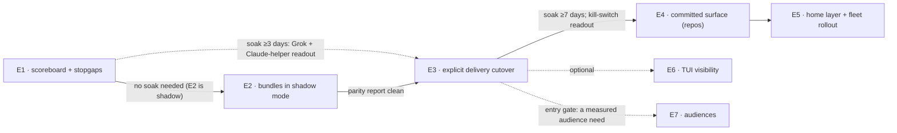

# Splitting the Memory-Built Instruction Migration Into Epics

**Researcher:** cld · **Date:** 2026-10-05 · **sase checkout:** `235e9ba0c9` · **CLIs:**
Claude Code 2.1.289, codex-cli 0.160.0, grok 1.0.46

**Builds on** (read through `sase artifact read`):

- `research:202610/sase_md_instruction_delivery/sase_md_instruction_delivery.md`, called
  **R-delivery** below;
- `research:202610/instruction_bundles_provider_parity_and_memory_ledger.md`, called
  **R-ledger**;
- `research:202610/fresh_clone_bootstrap_and_native_subagent_instructions/fresh_clone_bootstrap_and_native_subagent_instructions.md`,
  called **R-fresh**.

> **Question.** You want to migrate every agent instruction file so that SASE builds
> each agent's instructions from memory files right before launch. You accept the three
> reports above "for the most part". Should this work be split into several epics, each
> with clear exit criteria and results you can easily confirm? If so, how? Also: what is
> wrong with the three reports?

## Bottom line

1. **Split it, by seam rather than by provider.** I recommend **five core epics run in
   order**, with two soak windows between them. After those come **two optional epics**
   that start only once an entry gate is met. Neither "one big epic" nor "one epic per
   provider" works (see [§3](#3-should-you-split-at-all)).

   | # | Epic | Changes agent behavior? | Phases |
   | ---: | --- | --- | ---: |
   | E1 | **Instruction scoreboard and stopgaps** | Grok root and Claude helpers only | 4 |
   | E2 | **Instruction bundles in shadow mode** | No | 4 |
   | E3 | **Explicit delivery cutover** (root and helper slots) | Yes, every provider | 6 |
   | E4 | **The committed surface in SASE-managed repos** | No (files and humans) | 5 |
   | E5 | **Home layer and fleet rollout** | Interactive sessions only | 3 |
   | E6 | *Optional:* TUI instruction visibility | No | 5 |
   | E7 | *Conditional:* audiences (`when:`, launch facts, `SASE.md`) | Yes | 4 |

2. **Build the yardstick first.** E1's first deliverable is one command, an *instruction
   scoreboard*. For recent runs it prints, per provider: how many copies of the SASE
   contract arrived, whether the home and project layers arrived, how many SASE-owned
   native files loaded, and what helpers got. Every later epic's exit criterion is
   written as a specific change in that output, plus a `git ls-files` count. That makes
   the results easy to confirm: you run one command and compare it with a table in this
   report ([§5](#5-the-yardstick-the-instruction-scoreboard)).

3. **Why split: soak time, not size.** Recent SASE epics land in hours. The median time
   to done is 3.7 h for epics with 1–4 phases and 21 h for epics with 9 or more, and
   big epics are not abandoned more often than small ones. What a single epic *cannot*
   do is wait several days of real runs before taking its next step. SASE's flag rules
   also forbid a beta flag from outliving its epic. This program has two points where
   you should look at real behavior before going further:
   - after the stopgaps (E1);
   - after every provider switches channels (E3).

   Those two points become epic boundaries.

4. **There are three natural stopping points:**
   - **After E1**, the measured harm has stopped.
   - **After E3**, every SASE agent's instructions are built from memory at launch. That
     is your stated goal for SASE agents.
   - **After E5**, no generated instruction file in any of your repos is a full render
     any more.

   E6 and E7 are optional. E7 should wait until the bundle records show a concrete
   audience worth building for (`decisions:corpus-before-mechanism`).

5. **The three reports have real problems** ([§2](#2-issues-with-the-prior-research)).
   The most important:
   - **R-delivery's Grok stopgap would recreate the double-contract bug in Grok.** It
     pipes "project instructions plus the home layer" into `--rules`, and both files
     carry the full SASE contract.
   - **Its "feature flag per provider" inside one epic conflicts with SASE's flag
     rules.**
   - **No report scopes the Memory History instruction subjects.** They are built in
     sase-core from the git history of the tracked files. sase-1ev.9 just shipped an
     INSTRUCTIONS rail on top of them, and untracking or deleting the files changes
     them.
   - **Claude auto-memory is keyed to the numbered workspace.** It is "foreign memory"
     (R-ledger), and also **nondeterministic**: 35 auto-memory files sit in 8 of 46
     workspace directories, so a Claude agent sees different "memories" depending on
     which `sase_<N>` it lands in.
   - **The "lean monitor and gate render" audience doesn't exist at the provider
     boundary.** Monitor and gate turns never call a provider.

## 1. What I checked

I re-verified the parts of the three reports that drive the split, and added an
inventory the reports lacked.

| Check | Result |
| --- | --- |
| Grok still loads nothing? | **Yes.** Of 106 Grok `prompt_context.json` files written since 2026-10-04, all 106 have `agents_md_files: []` (103 primary, 3 subagent). `grok.py` still passes no `--rules`, no trust flag, and no directive. |
| Claude still gets the contract twice? | **Yes.** This very session's injected context contains `~/CLAUDE.md` (sections "SASE Memory", "Repositories", "SASE Final Declaration") *and* the workspace `CLAUDE.md` (the same three sections, with a different repository list). |
| Claude adapter argv | `claude.py:427-442`: `--append-system-prompt _SINGLE_TURN_DIRECTIVE`, no `--settings`, no subagent prompt flag. Wait continuations loop with `--resume` inside one invocation. |
| Invocation sites | `invoke_agent` is called from `workflows/crs.py`, `workflows/mentor.py`, `macro/workflow_executor_steps_prompt.py`, `ace/handlers/workflow_handlers.py`, `main/query_handler/_standalone_steps.py`, and `axe/fix_hook_runner.py`. `provider.invoke` is called directly at `_invoke.py:436`, `finalizers/declaration_recovery.py:83`, and `finalizers/commit_repair_conflict.py:409`. |
| Size of the generator being replaced | About 7,000 lines across `src/sase/amd/` and `src/sase/main/init_memory/`. 51 source files and 83 test files reference `AGENTS.md` or the shim constants. |
| Who else consumes tracked instruction files | `sase-core` `memory_history/subjects.rs` (instruction subjects plus the shim fold); `ace/tui/.../_agent_memory_versions.py` (the "AGENTS.md as launched" row); `axe/launch_evidence.py` (`capture_instruction_snapshot`); the Memory panel publish action (`memory_panel_publish.py:40` runs `sase memory init --no-commit`); CI `ci.yml:57` and `master-gate.yml:135`; `/sase_memory_write` step 4. |
| Instruction files across repos | See [issue 7](#7-the-scope-is-45-files-in-9-repos-not-20-files-in-one) |
| Claude auto-memory | 46 workspace-keyed `~/.claude/projects/*sase-workspaces*/memory/` dirs. 8 are non-empty, holding 35 notes; `sase_12` alone has 15 (for example `land-agent-lost-phase-commit.md`, `stale-core-binding-crash-rootcause.md`). |
| Epic sizes in this repo | 744 epics created since 2026-07-01 with phases: median 5 phases, p90 9, max 20. Median hours to `done`: 3.7 (1–4 phases), 6.8 (5–8), 21.2 (9+). The share still in progress is about 12–14% in every bucket. |
| `sase doctor` CLI shape | No subcommands. It is `sase doctor [-C ID_OR_GROUP] [-D] [-j] …`; deep checks live in `doctor/checks_deep_*.py`. |
| Glossary | **Receipt** is already defined: a tool-run receipt, governed by the `receipts-prove-before-they-skip` decision. |
| Flag rules (`sase_flags` memory) | A `beta` flag is epic scaffolding that "the epic removes … before it lands". `sunset` (default on) is the kind for keeping a deprecated branch reachable. |
| Memory-write authorization | A phase worker may edit memory only when "an approved plan you are implementing names the change in its steps". |

## 2. Issues with the prior research

Ordered by how much each one changes the plan. "Fix" says how the
[recommended epics](#6-recommended-epics) absorb it.

### High

#### 1. R-delivery's Grok stopgap would duplicate the contract and still omit the directive

R-delivery's Phase 0, step 1 says: "Pass the current rendered project instructions plus
the home layer through `--rules`". Both `~/AGENTS.md` and the project `AGENTS.md` carry
the full SASE contract: the memory section, the repositories list, and the final
declaration. That is exactly the roughly 790-token duplication the report diagnoses in
Claude and Codex, and this session's own context shows both copies. Grok also receives
**no single-turn directive** today (R-ledger §3), and the Phase 0 step does not add one.

**Fix (E1.2).** `--rules` carries the Grok single-turn directive plus the project
`AGENTS.md` text **once**. Grok gets the home layer in E3, through the bundle, which
deduplicates by construction. Home-only content is about 200 tokens (R-ledger), so
deferring it costs little and avoids a throwaway "home minus contract" renderer.

#### 2. "One epic, a feature flag per provider" conflicts with SASE's flag rules

R-delivery wants per-provider flags plus a before-and-after compliance measurement. Under
`sase_flags`:

- a `beta` flag is scaffolding that the epic deletes before it lands;
- a land agent can't wait days for compliance data.

So per-provider beta flags either get removed before the measurement exists, or they
violate the rule.

**Fix (E3.2).** E3 ships explicit delivery **on by default**. One `sunset` flag keeps
the legacy native-file branch reachable as a kill switch, and its flag bead is removed
after the post-E3 soak. Per-provider fallback, if one provider regresses, is a code
change to that adapter's `DeliveryPlan`, not a flag.

#### 3. Untracking breaks Memory History, and no report scopes it

`sase-core/crates/sase_core/src/memory_history/subjects.rs` derives
`instructions:<scope>/<dir>` subjects from the git lineages of each `agents_path` and its
shim paths. It folds shims by blob equality and counts "diverged" rows. The UI built on
it includes:

- the `CLAUDE.md ≡ AGENTS.md` / `⚠ diverged` chip (`docs/memory_history.md:96-99`);
- sase-1ev.9's new INSTRUCTIONS rail (`d854842e89`).

R-delivery Phase 2 and R-fresh Phase 2 delete the shims and nested sets and replace the
root file with a stub. Neither lists these consumers. Afterwards, nested subjects end,
shim folding has nothing to fold, and the root subject's history switches content
abruptly. R-ledger covers only the per-agent launch row.

**Fix (E4.4).** A dedicated phase updates the Rust subjects for the stub era and points
the launch row at bundle manifests. It retires `capture_instruction_snapshot` and moves
the `sase-core-revision.txt` pin. This is the epic's cross-repo phase.

#### 4. Claude auto-memory is nondeterministic, not merely "foreign"

R-ledger lists Claude auto-memory as a foreign channel and defers the decision. The
memory directory is keyed by the workspace path, so each of the 46 `sase_<N>`-style
directories has its own. Today 8 of them hold 35 notes, and `sase_12` alone has 15.
Some are real project knowledge, such as `land-agent-lost-phase-commit.md` and
`stale-core-binding-crash-rootcause.md`. Consequences:

- A Claude agent's context depends on which workspace number it was assigned.
- No other provider ever sees those notes.
- SASE memory review never sees them.

That defeats "same instructions for every agent", which is the point of this migration.

**Fix (E3.3).** Decide inside E3, rather than leaving it open: disable Claude auto-memory
in SASE runs through the adapter's per-run settings. The exact knob needs a spike on
2.1.289. Separately, file one `memory` task bead to harvest the 35 notes into SASE memory
or discard them.

#### 5. Phase workers can't edit memory unless the plan names each change

`/sase_memory_write` allows edits only when the approved plan "names the change in its
steps". In the 2026-08-14 triage note on `sase-lq`, the owner wrote that memory edits
"cannot be worked unattended". This program edits a lot of memory:

- the generated `sase/memory/sase.md` and its home twin (retired into the package base);
- `glossary:agent-instruction-file`, plus new Instruction Bundle and Instruction
  Manifest terms;
- the three nested `AGENTS.md` sets (converted to path-scoped notes);
- `symvision.md` (absorbing `tools/AGENTS.md`'s Symvision text);
- two new decision records;
- the `/sase_memory_write` skill's "run `sase memory init` to regenerate `AGENTS.md`,
  the provider shims" step.

An epic plan that says "update docs and memory" will stall or file memory beads.

**Fix.** Each epic plan below lists its memory changes explicitly. Copy those lists into
the plan files ([§8](#8-checklist-for-each-epic-plan)).

### Medium

#### 6. The "lean monitor and gate render" audience targets turns that never call a provider

R-delivery ranks "lean renders by role" as use case 4 ("monitor and gate turns, about
12.5% of runs per cld, need the contract, not the full trigger catalog"). It lists these
renders first among Phase 3's conditionals. But:

- `monitor/member.py:140-141` and `gate_turn/member.py:74-75` create turns with
  `turn_kind` and `agent_session_role` set to `monitor` or `gate`;
- neither `src/sase/monitor/` nor `src/sase/gate_turn/` calls `invoke_agent` or
  `provider.invoke`;
- the glossary defines a monitor turn as "a tool result arriving" and a gate turn as
  "the human's move".

If the 12.5% counted the agent turns that *follow* a monitor or gate, those are ordinary
root turns that must declare, and they need the full contract.

**Fix.** Drop this audience. Without it, the remaining case for E7's general `when:`
machinery is research-vs-code density, the phase-worker bead rule, and commit-method
text. The root/helper split and provider sections are handled in code in E2 and E3.
That is a thin corpus, so E7 stays behind a measured entry gate.

#### 7. The scope is 45 files in 9 repos, not 20 files in one

| Kind | Repo | Tracked files |
| --- | --- | --- |
| Generated from memory | `sase` | 20 (root 5; `tools/`, `src/sase/ace/`, `demos/tapes/` each 1 hand-written `AGENTS.md` + 4 copies) |
| Generated from memory | home via `chezmoi` | 5 (`~/AGENTS.md` + 4 copies) |
| Generated from memory | `bob-cli` | 5 |
| Generated from memory | `actstat` | 5 |
| Hand-written, not memory-backed | `sase-core` | 3 (117-line `AGENTS.md` + two one-line `@AGENTS.md` imports) |
| Hand-written | `sase-telegram`, `sase-listen`, `sase-research-artifacts` | 2 each |
| Hand-written | `sase-github` | 1 (`CLAUDE.md` only) |
| — | `sase-nvim` | 0 |

The reports cover `sase` and home. `bob-cli` and `actstat` are enabled SASE projects
with their own generated files. Their runs get bundles automatically once E3 lands, but
their committed files need the E4 tooling (E5.2).

The hand-written linked-repo files are a different case. Agents launched by SASE never
run with those repos as their working directory; they reach them mid-turn through
`sase repo open`, which already prints: "Read …/AGENTS.md before working in this repo;
it is not loaded automatically from here." Treat them as **repo-owned** (R-delivery's
layer table) and leave them **out of scope**. If you want `sase-core` rules in memory,
give it its own `sase/memory` later.

#### 8. "Instruction receipt" collides with an existing glossary term

The glossary's **Receipt** is a tool-run receipt: "the machine-local proof that one named
Tool Catalog entry produced one settled Tool Run…". A decision record governs it
(`receipts-prove-before-they-skip`). R-ledger's per-invocation `receipt.json` would give
the same word a second meaning in the same TUI.

**Fix.** Call the per-invocation record an **instruction manifest**, store it as
`instructions/NN-<provider>.json`, and keep **bundle** for the rendered text.

#### 9. `sase doctor instructions` doesn't fit the doctor CLI

`sase doctor` has no subcommands. It selects checks with `-C <id|group>`, and slow,
read-only scans are `-D` deep checks. Scanning session logs is a deep check: R-ledger
itself warns that history scans caused athena's resource spikes.

**Fix.** Use one owner-facing command, the scoreboard (proposed:
`sase instructions verify`). Register it with doctor as an `instructions` deep-check
group. Keep the static lint (`sase instructions check`) separate. Both follow the
`cli_rules` memory: sorted options, and a short alias for every long option.

#### 10. Rendering on every invocation needs a latency budget

R-fresh records about 2 s per `sync` render (cld E18). R-delivery renders before every
`provider.invoke`, including declaration recovery and conflict repair. That is roughly
230 runs a day, plus follow-ups.

**Fix (E2.2, E2 exit).** Cache renders by input digest: the memory tree OIDs, home
memory, config, facts, and package version. Record the render time in the manifest, and
make "warm p95 under a budget you choose" (I suggest 250 ms) an exit criterion.

#### 11. R-ledger's Phase-0 TUI work would be thrown away

R-ledger ships the header chip, Receipt card, and lane header in Phase 0, on an
"observed mode" data model that parses the launched `AGENTS.md` into sections. Phase 1
then replaces that model with real bundles. The TUI is the most expensive surface to
build and test (visual snapshots, performance budgets).

**Fix.** Put a CLI-only scoreboard in E1. Build the TUI once, in E6, on the final
manifest schema.

#### 12. The Rust boundary must be decided in the plan, not discovered in review

The `rust_core_backend_boundary` core memory and `decisions:rust-core-required` push
shared logic into `sase-core`. The generator being replaced is about 7,000 lines of
Python. R-delivery splits the work: schema and evaluator in Rust, composition in
Python. R-ledger puts the ledger join in Rust. A phase worker or land agent reading the
boundary rule cold could start porting the renderer.

**Fix.** Each epic plan states the split:

- E2 renders in Python and writes a versioned manifest.
- E4.4 is the only Rust work in the core program (Memory History).
- E6 adds the manifest wire and ledger view in Rust.
- E7 puts the fact schema and `when:` evaluator in Rust.

Record the decision in E3's decision record.

#### 13. The success criteria are post-landing metrics, not exit criteria

Some of the reports' success criteria can only be measured after days of real runs:

- "Grok's final-declaration rate recovers";
- "Explore's direct-read rate falls toward 1.5%";
- "112 commits in 60 days → near zero".

A land agent can't check these.

**Fix.** Every epic below separates **exit criteria**, which can be checked when the epic
lands with fixtures, a probe run, or one command, from **watch metrics**, which you read
during the soak window.

### Low

| # | Issue | Fix |
| ---: | --- | --- |
| 14 | **Privacy expansion.** Delivering the home layer to every provider sends tailnet hosts and users, Obsidian paths, and the chezmoi layout to xAI (Grok), Google (agy), and Muse's vendor. Today only Anthropic and OpenAI runs see it. | Make it a conscious yes in E3's plan. A `provider`-conditional home section is possible later. |
| 15 | **Complement mode is mostly obsolete.** R-fresh showed `-c project_doc_max_bytes=0` suppresses Codex project files, so Codex no longer needs R-delivery's complement mode. | Complement mode remains only for agy, and for Muse if the `--trust-workspace` spike fails (E3.5). |
| 16 | **More invocation paths than the reports name.** Mentors, CRS, fix hooks, workflow prompt steps, and standalone steps all go through `invoke_agent`. The two finalizers bypass it. | E2.3 adds an architectural test that every `provider.invoke` call site goes through the render-and-deliver hook. |
| 17 | **Grok child sessions may be rising.** There were 3 of 106 since 2026-10-04, against 4 of 706 over 30 days (R-fresh). The sample is tiny. | The scoreboard counts helper sessions per provider. The Grok child spike stays deferred, with a numeric trigger. |
| 18 | **`claudeMdExcludes` globs can hide repo-owned files.** Linked checkouts live under the workspace (`sase/repos/linked/<repo>/`) with their own `CLAUDE.md`. A broad `**/CLAUDE.md` exclude would hide `sase-core`'s rules. | Exclude exact SASE-owned paths only. Add a test that a linked repo's `CLAUDE.md` is not excluded. |
| 19 | **Muse's prefix shares a path with reconstructed context.** Muse wraps the prompt "at the top, so the interrupt path's reconstructed context … also carry the directive" (`muse_provider.py:308-311`). With a roughly 20 KB bundle in the prefix, a reconstruction must not nest a second copy. | Add an E3.5 test, and let the scoreboard count copies per Muse session. |

### What the reports get right, and what this plan keeps

Kept as they are:

- per-invocation rendering and adapter delivery (R1, R4);
- facts, not `%tag`;
- exactly-once delivery as a tested invariant (R6);
- hard rules that can't be made conditional (R9);
- two-slot delivery with root-only enforcement (R10, R11);
- a generated, budgeted export stub with a bootstrap clause and gitignored interactive
  projections (R12, R13);
- three audiences that never mix turn obligations (R14).

R-fresh's correction also helps the split. Codex can suppress project files, so
explicit delivery (E3) **no longer depends on untracking** (E4) for Claude, Codex, or
Grok, which together make up about 69% of runs. That decoupling is what lets E3 and E4
be separate epics.

## 3. Should you split at all?

### The forces

| Force | What it implies |
| --- | --- |
| Two behavior changes need **days of real runs** before the next step: E1's stopgaps and E3's channel switch | A land agent can't wait days, so each soak window is an epic boundary |
| Flag rules: `beta` flags die with their epic; `sunset` flags keep a legacy branch reachable | One sunset kill switch per behavior-changing epic, removed after its soak |
| **Blast radius.** A renderer bug affects 100% of agents | Ship the renderer in **shadow mode** (render and record, don't deliver) as its own epic, so you can check parity before anything depends on it |
| **Cross-repo work.** `sase-core` (pin moves), `chezmoi` (home files), `bob-cli` and `actstat` (re-init) | Keep each cross-repo hop inside one phase, and keep your personal environment (home files) out of the repo-surface epic |
| **Memory-edit authorization** | Smaller plans make it practical to name every memory change |
| Epic size in this repo: median 5 phases, p90 9, max 20; time to done grows about 3× from 1–4 phases to 9+, while abandonment does not | Size alone doesn't forbid one big epic. Soak and verification do. Keep each epic at 3–6 phases |
| Shared infrastructure: renderer, manifest, `DeliveryPlan` hook | Don't split by provider. Providers are phases inside E3 |

### The alternatives

| Option | Verdict |
| --- | --- |
| **One epic** (about 22 phases) | **Reject.** Longer than any epic this repo has run (max 20). It has no room for the two soak windows and can't satisfy the flag rules. One failure blocks everything. |
| **Per provider** (a Claude epic, a Codex epic, …) | **Reject as the primary cut.** Each would need the renderer, manifest, and hook first, so a shared-infrastructure epic appears anyway. They would then fight over the same adapter hook and flag. Per-provider staging belongs in E3's phase order. |
| **Per report** (delivery, ledger, fresh clone) | **Reject.** The reports cut by *question*, not by dependency. Their phases interleave: R-fresh's Phase 0 Claude fix belongs before R-delivery's renderer, and R-ledger's TUI belongs after both. |
| **Three epics** (E1; E2+E3; E4+E5) | **A viable lighter alternative.** You lose the shadow-mode checkpoint between rendering and delivering, and the home-environment change rides with the repo change. Choose this if plan overhead bothers you more than a renderer bug reaching every agent. |
| **Seams with soak boundaries** (E1–E5, plus optional E6 and E7) | **Recommended.** |

### Splitting rules applied

**Keep together**, never in separate epics:

- one provider's explicit delivery and its native-file suppression (otherwise double or
  zero delivery);
- the renderer and its manifest;
- a Rust change and its pin move;
- a CLI rename and its docs.

**Keep apart:**

- observation from behavior change (E1.1 versus the rest; E2 versus E3);
- agent-runtime changes from committed-file changes (E3 versus E4);
- repo changes from your home environment (E4 versus E5);
- anything speculative from anything measured (E7 behind a gate).

## 4. Dependency graph



Implementation time is hours per epic. **Calendar time is dominated by the two soak
windows**, so the core program is roughly two to three weeks of mostly waiting and
watching.

## 5. The yardstick: the instruction scoreboard

E1.1 builds this command; I propose `sase instructions verify`. It reads each
provider's own session records, never what SASE wrote:

- Claude transcripts: the `instructions` and `prompt_snapshot` attachments, plus
  `subagents/agent-*.jsonl`;
- Codex rollouts;
- Grok `prompt_context.json` and the session's system-prompt file;
- Muse `session.jsonl`.

agy records nothing, so it shows `◌`. Scans are bounded to the newest runs per provider.

**Baseline, which E1 must reproduce.** Values come from the three reports and my
rechecks. The layout is illustrative.

```
provider  contract  home  project  directive  native-SASE  helpers
claude       2×      ✓      ✓         ✓           2         gp: root contract, 13–15 `sase final`/30d; Explore: nothing
codex        2×      ✓      ✓         ✓           2         0 spawns/30d
muse         1×      ✗      ✓         ✓           1         0 spawns
grok         0       ✗      ✗         ✗           0         children: nothing
agy          ◌       ✗      ◌         ✓           ◌ (likely 2)
```

If the scoreboard shows this table all green on day one, the scoreboard is wrong. That
is E1's first exit criterion.

**Target state after each epic.** Columns not shown are unchanged.

| After | Claude | Codex | Muse | Grok | agy | Also |
| --- | --- | --- | --- | --- | --- | --- |
| E1 | helpers: helper prompt plus guard | — | — | contract 1×, project ✓, directive ✓ | — | baseline saved as an artifact |
| E2 | — | — | — | — | — | new column **manifest coverage = 100%**, and an intended-vs-observed diff |
| E3 | 1×, home ✓, native 0, bundle id 1× | same | same (home ✓) | same (home ✓) | prefix bundle, native = complement | helper bundle ids for Claude helpers |
| E4 | unchanged | unchanged | unchanged | unchanged | native = stub only | `git ls-files` instruction files: 20 → 2 |
| E5 | unchanged | unchanged | unchanged | unchanged | unchanged | home files have no turn obligations; `bob-cli` and `actstat`: 5 → 2 each |

## 6. Recommended epics

Sizes use SASE's scale. Probes are tiny agent runs per provider; SASE's `xsmall` size is
meant for "launching SASE agents only to observe their output while testing a SASE agent
feature".

### E1 — Instruction scoreboard and stopgaps

**Goal.** See today's delivery bugs in one command, and stop the two harms that are
measured: Grok gets nothing, and Claude helpers submit their parent's declaration.

| Phase | Size | Scope |
| --- | --- | --- |
| E1.1 scoreboard | medium | `sase instructions verify` in observed mode: per-provider parsers with fixture tests. Fingerprints are the contract heading, the home H1, the project H1, and the directive marker. Helper rows: Claude helper `sase final` attempts; Codex, Grok, and Muse child counts. Bounded scans; `-j` JSON output. Register it as a doctor deep-check group. |
| E1.2 Grok root stopgap | small | `--rules` = the Grok single-turn directive plus the workspace `AGENTS.md` text once, only in SASE-managed projects. Never `--trust`. Verify that Grok's session system-prompt record carries the rules text; if it doesn't, scoreboard evidence for Grok comes from probes. |
| E1.3 Claude helper channel | medium | A packaged helper template through `--append-subagent-system-prompt-file`. A PreToolUse guard through per-run `--settings` that denies `sase final (context\|prepare\|submit)` and root-only skills when the hook input has `agent_id`. Probe whether forks carry `agent_id`. Native `CLAUDE.md` stays for now (R-fresh). |
| E1.4 record and document | small | An actor-qualified root-only sentence in the generated contract template. Rewrite `docs/agent_providers.md` "Instruction double-load". Write decision record **"Native Helpers Return; Only Roots Declare"**. Attach baseline and after scoreboard JSON to the epic as artifacts. |

**Memory changes to name in the plan:** the contract template sentence (it regenerates
every generated instruction file), and the new decision record.

**Out of scope:** any committed-file deletion, including `QWEN.md` and `OPENCODE.md`. R-delivery's
Phase 0 deletes those, but deletion touches Memory History, so it waits for E4. Also out
of scope: home-layer delivery to Grok, and any TUI work.

**Exit criteria, checkable at landing:**

- [ ] Fixture tests reproduce the baseline per provider. A live run over the last 24 h
      shows Claude 2×, Codex 2×, Muse home ✗, and Grok 0.
- [ ] A Grok probe after E1.2 shows contract 1×, project ✓, directive ✓, and
      `agents_md_files: []` (still untrusted).
- [ ] A Claude probe: a root agent spawns one general-purpose helper and one Explore
      helper. Each tries `sase final submit`, and both are denied. Both helper
      transcripts contain the helper template marker.
- [ ] Baseline and after scoreboard JSON are attached to the epic bead.

**How you confirm it:**

```bash
sase instructions verify --since 24h      # Grok row flips 0 → 1×
sase instructions verify -p claude --helpers   # helper rows: denied attempts, no accepted helper declarations
```

**Watch for at least 3 days:**

- Grok's non-research final-declaration rate, against 60% before the regression and 26%
  after it;
- Claude helper `sase final` attempts, which should be 0;
- helper-accepted declarations, which should be 0.

**Rollback:** revert the adapter argv. Neither change touches committed files.

### E2 — Instruction bundles in shadow mode

**Goal.** Render the per-invocation bundle and record it for **every** invocation,
without delivering it yet. That proves the renderer's parity with today's files.

| Phase | Size | Scope |
| --- | --- | --- |
| E2.1 package base | medium | Move the generated contract (`sase/memory/sase.md` and the home `~/sase/memory/sase.md`) into packaged sections with stable ids. `sase memory init` keeps producing today's `AGENTS.md` from those sections, verified by golden tests. |
| E2.2 renderer | large | Layers: package, home, project, launch. A plugin layer only if a plugin contributes text today. Dedupe by section id. Root and helper overlays (R-fresh). A minimal closed fact set: `mode`, `provider` (execution), `role` (`root`\|`helper`), `host`, `project`, `vcs`. Cache by input digest. `sase instructions render --as <agent\|facts>`. |
| E2.3 invocation hook | medium | Render at `_invoke.py` after provider resolution, and in both finalizer follow-ups. Write `instructions/NN-<provider>.{md,json}` (the bundle and the **manifest**), a content-addressed store, an `agent_meta.instructions` summary, and `SASE_INSTRUCTIONS_FILE`. Keep `capture_instruction_snapshot` running in parallel until E4. Add an architectural test that no `provider.invoke` bypasses the hook. |
| E2.4 intended vs observed | medium | The scoreboard compares manifests with observed loads, per section. Parity test: for the `sase`, `bob-cli`, and `actstat` fixtures, the bundle contains every section of the root and home files, and the contract exactly once. |

**Memory changes to name:** retire `sase/memory/sase.md` and the home twin into the
package base.

**Rust:** none. Renderer and manifest stay in Python, with a versioned manifest schema.

**Exit criteria:**

- [ ] `diff <(sase instructions render --as codex) <(sase instructions render --as grok)`
      shows only the provider section.
- [ ] After a day of normal use, manifest coverage is N/N invocations, including
      declaration recovery and conflict repair.
- [ ] The parity test passes in CI for all three projects.
- [ ] The scoreboard's *observed* columns are unchanged from E1's after-state.
- [ ] Warm render p95 is within budget (suggested: 250 ms); the manifest records it.

**How you confirm it:**

```bash
sase instructions render --as <a-recent-agent-name> | head -40
sase instructions verify --coverage --since 24h
```

**Rollback:** disable the hook. Nothing reads manifests yet.

### E3 — Explicit delivery cutover (root and helper slots)

**Goal.** Every provider gets the bundle **exactly once** through its explicit channel,
and SASE-owned native files are suppressed. This completes your stated goal for SASE
agents.

| Phase | Size | Scope |
| --- | --- | --- |
| E3.1 spikes | small (+ xsmall probes) | Is Muse without `--trust-workspace` safe? Does Grok record the `--rules` text? Does `claudeMdExcludes` cover `~/CLAUDE.md`, the workspace files, and the nested sets, while sparing `sase/repos/**`? A `codex debug prompt-input` fixture for `project_doc_max_bytes=0`. Which knob disables Claude auto-memory? |
| E3.2 delivery hook and kill switch | medium | A `llm_instruction_delivery` hookspec returning a `DeliveryPlan` with `root` and `subagent` slots and a declared status (`inherits-native`\|`inherits-root`\|`none`). One **sunset** flag that keeps legacy native delivery reachable, with tests for both states. |
| E3.3 Claude | medium | Root bundle through `--append-system-prompt-file`, with the directive folded in. Helper bundle replaces E1's template. Exact-path excludes. Auto-memory disabled in SASE runs ([issue 4](#4-claude-auto-memory-is-nondeterministic-not-merely-foreign)). |
| E3.4 Codex and Grok | medium | Codex: shadow-home `AGENTS.md` = neutral core; `developer_instructions` = root overlay plus directive; `project_doc_max_bytes=0` in SASE-managed repos. Grok: `--rules` = full root bundle, replacing E1.2. |
| E3.5 Muse and agy | medium | Prompt-prefix delivery. Muse drops `--trust-workspace` if E3.1 passed, else uses complement mode. agy uses complement mode until E4. Test that interrupt reconstruction never nests a second bundle. |
| E3.6 conformance by hash | small | The scoreboard asserts the bundle id exactly once per invocation and per helper. Decision record **"Instructions Are Rendered Per Invocation And Delivered By Adapters"**, which also records the Rust/Python split and the home-layer privacy decision. |

**Memory changes to name:** the decision record. A `memory` task bead for harvesting
auto-memory, filed through `/sase_new_task`.

**Exit criteria:**

- [ ] For invocations since landing, Claude, Codex, Grok, and Muse show bundle 1×,
      contract 1×, home ✓, and native SASE files 0. agy shows `◌`, with the prefix
      visible in argv.
- [ ] Claude helper transcripts, including Explore, carry the helper bundle id and never
      the root bundle id.
- [ ] Turning the flag off restores E1's after-state: tests for both states, plus one
      live probe.
- [ ] Re-rendering a finished agent reproduces its manifest hash.
- [ ] A linked repo's `CLAUDE.md` is not excluded (test).

**How you confirm it:**

```bash
sase instructions verify --since <landing>   # every row 1× / ✓ / ✓ / 0
sase instructions verify -p claude --helpers    # helper rows show helper bundle ids
```

**Watch for at least 7 days:**

- final-declaration rate per provider, against the E1 readout;
- reads of memory triggers per run (`memory_reads.jsonl`) against baseline. For Claude
  the channel moved from a user message to the system prompt.

Then answer the kill-switch flag bead: remove the flag, or fall back for one adapter.

### E4 — The committed surface in SASE-managed repos

**Goal.** Stop committing full renders. Fresh clones get a correct stub, and developers
get a gitignored interactive projection. Every surface that read the old files keeps
working.

| Phase | Size | Scope |
| --- | --- | --- |
| E4.1 export stub | medium | `sase instructions export`: `mode: export`, seeded from the existing `AGENTS.minimal.template.md`, at most 80 lines, with the bootstrap clause. Plus a two-line `CLAUDE.md`. `--check` in CI next to the `sase init memory --no-commit` steps. `sase memory init` stops writing full files. |
| E4.2 interactive sync | medium | `sase instructions sync` (R13): hermetic; writes gitignored `.sase/instructions/*.md` and `AGENTS.override.md`; refuses workspaces; digest header; `--if-stale`; never overwrites a file without its generated header. Add `just agent-instructions` and a `just install` hook. Workspace prep deletes projection paths. |
| E4.3 nested sets and shims | medium | Convert the `tools/`, `src/sase/ace/`, and `demos/tapes/` files into path-scoped reference notes (`paths:` frontmatter, which yields a trigger line in every bundle). Merge the Symvision text. Delete `GEMINI.md`, `QWEN.md`, `OPENCODE.md`, and the nested copies. Update `PROVIDER_SHIM_FILES`. |
| E4.4 history surfaces | medium (crosses `sase-core`) | Memory History instruction subjects for the stub era (`subjects.rs`). The launch row reads manifests; legacy rows stay for old runs. Retire `capture_instruction_snapshot`. Update the Memory panel publish action and the `sase init` inventory. Move the pin. |
| E4.5 docs, memory text, prefix switch | small | Rewrite `glossary:agent-instruction-file` and add *Instruction Bundle* and *Instruction Manifest*. Update `/sase_memory_write` step 4, `docs/init.md`, `docs/agent_providers.md`, `docs/memory.md`, and CONTRIBUTING. Switch agy (and Muse, if it was in complement mode) to full prefix delivery. |

**Memory changes to name:** the three nested sets and their new path-scoped notes,
`symvision.md`, the glossary term and two new terms, and the skill text.

**Exit criteria:**

- [ ] `git ls-files | grep -E '(^|/)(AGENTS|CLAUDE|GEMINI|QWEN|OPENCODE)\.md$'` prints
      exactly `AGENTS.md` and `CLAUDE.md`.
- [ ] CI fails if `AGENTS.md` exceeds its budget or mentions `/sase_final`.
- [ ] Scripted fresh clone (`HOME=$(mktemp -d)`, no SASE installed):
      `codex debug prompt-input` shows the stub and its bootstrap clause.
- [ ] After `just install`, `codex debug prompt-input` shows the interactive render
      through `AGENTS.override.md`, and `git status` is clean.
- [ ] Editing a reference note's body and running `sase memory init` changes no
      instruction file.
- [ ] Memory History still opens root `AGENTS.md` history across the stub boundary.
      New agents' launch rows show a bundle id; old agents' rows show the legacy
      snapshot.
- [ ] The scoreboard is unchanged from E3, and agy's native load is the stub only.

**How you confirm it:**

```bash
git ls-files | grep -cE '(^|/)(AGENTS|CLAUDE|GEMINI|QWEN|OPENCODE)\.md$'   # 2
sase instructions export --check && wc -l AGENTS.md
```

**Watch for 30 days:** commits that touch `AGENTS.md`, against a baseline of 112 in 60
days. They should drop to near zero.

### E5 — Home layer and fleet rollout

**Goal.** Your interactive sessions and your other SASE projects stop carrying turn
obligations and full renders.

| Phase | Size | Scope |
| --- | --- | --- |
| E5.1 home files | medium (`chezmoi` repo, through `/sase_repo`) | `~/AGENTS.md` and `~/CLAUDE.md` become `mode: interactive` renders of home memory. Delete the home `GEMINI.md`, `QWEN.md`, and `OPENCODE.md`. Replace the hostname `.tmpl` switch with the `host` fact. Confirm SASE runs are unaffected; they have excluded or replaced the home files since E3. |
| E5.2 other projects | small | `bob-cli` and `actstat` adopt export and sync through `sase init`, and the scoreboard is checked for their runs. |
| E5.3 interactive launches | medium | `sase tmux-agent` goes through the delivery hook with `mode: interactive`. Docs. |

**Memory changes to name:** home memory notes, if any are retired or reworded.

**Exit criteria:**

- [ ] `grep -c "SASE Final Declaration" ~/AGENTS.md ~/CLAUDE.md` prints 0, and the home
      `GEMINI.md`, `QWEN.md`, and `OPENCODE.md` are gone.
- [ ] In `bob-cli` and `actstat`, `git ls-files` shows 2 instruction files each. Their
      SASE runs score 1× / ✓ / ✓ / 0.
- [ ] A `sase tmux-agent` launch writes a manifest with `mode: interactive`.
- [ ] Probe: an interactive `claude -p --model haiku` in `~`, asked "should you run
      `/sase_final` before ending?", answers no.

### E6 (optional) — TUI instruction visibility

**Entry:** E3 has landed, so the manifest schema is stable.

**Scope:** R-ledger's TUI design, renamed:

- a Rust `InstructionManifestWire` and `ledger_view`, with a pin move;
- the identity-header chip and red-state node glyphs;
- the upgraded Context MEMORY lane;
- a MEMORY deck with **Manifest**, Ledger, and Bundle cards;
- the Memory pane's **Seen by** view, backed by an `instruction_manifests.jsonl` reverse
  index;
- `sase instructions show`.

**Exit criteria:**

- [ ] Visual snapshots for each chip state.
- [ ] The TUI performance budgets in the `tui` memory hold.
- [ ] `sase instructions show -j <agent>` equals the deck's data.
- [ ] The deck picker key is unreserved at implementation time.

### E7 (conditional) — Audiences

**Entry gate:** at least two conditionals whose value is *measured* from E2/E3 manifests
joined with `memory_reads.jsonl`. Examples: research runs never open the
lint and TUI triggers; phase workers get the bead rule as a rule. Not lean monitor or
gate renders ([issue 6](#6-the-lean-monitor-and-gate-render-audience-targets-turns-that-never-call-a-provider)).

**Scope:**

- the launch-fact schema and `when:` evaluator in `sase-core`, with LSP validation;
- `when:` in note frontmatter;
- `sase instructions check --matrix` with per-audience budgets in CI;
- the first conditionals;
- a `SASE.md` composition spec **only if** a project needs layout or prose that notes
  can't express.

**Exit criteria:**

- [ ] The matrix check is green in CI.
- [ ] Every audience contains the hard rules and the baseline triggers (the R9 test).
- [ ] The token change per audience is recorded in manifests.

## 7. What should not be an epic

| Item | Form | Trigger |
| --- | --- | --- |
| Removing E3's sunset kill switch | Its own flag bead (FlagTriage) | After the E3 soak |
| Harvesting the 35 Claude auto-memory notes | One `memory` task bead | E3.3 lands |
| Grok child channel (shadow `$GROK_HOME/rules`, with OAuth `auth.json` caveats) | Spike task | Grok helper sessions above about 2% for two weeks (scoreboard) |
| Muse and agy child channels; Codex `multi_agent_v2` helper override | Spike tasks | Usage appears, or v2 is enabled |
| `traits:` labels and a prompt escape hatch | Task, then E7 follow-up | A section needs a label no fact provides |
| Giving `sase-core` and other linked repos their own `sase/memory` | Separate epic, if ever | You want their rules memory-backed |
| Raising the export stub's budget for outside contributors | Task | Real outside contributors appear |

## 8. Checklist for each epic plan

When you or a planner write the plan files, each should state:

1. **Memory changes, by file**, so phase workers are authorized (issue 5).
2. **The Rust/Python split** for the epic, and whether the `sase-core-revision.txt` pin
   moves (issue 12).
3. **Flag kind.** Behavior-changing epics use a sunset kill switch; never a beta flag
   that outlives the epic (issue 2).
4. **Exit criteria and watch metrics, kept separate.** Each exit criterion names the
   command or test that proves it (issue 13).
5. **The scoreboard delta** the epic must produce ([§5](#5-the-yardstick-the-instruction-scoreboard)).
6. **CLI shape** per the `cli_rules` memory: sorted options and short aliases. No
   `sase doctor <subcommand>` (issue 9).
7. **Cross-repo phases** opened through `/sase_repo`, each with its own commit
   obligation.
8. **No workspace paths** in plan files (core memory 1.1.2).

## Evidence

**Re-measured for this report (2026-10-05):**

- **Grok.** 106 `prompt_context.json` files newer than 2026-10-04: all
  `agents_md_files: []`, 103 `primary` and 3 `subagent`. `grep` of
  `src/sase/llm_provider/grok.py`: no `--rules`, trust flag, or directive.
- **Claude.**
  - `claude.py:427-442` argv.
  - This session's injected context holds both `~/CLAUDE.md` and the workspace
    `CLAUDE.md`, each with the SASE Memory, Repositories, and Final Declaration
    sections.
  - 46 workspace-keyed auto-memory directories; 8 non-empty, holding 35 notes; 15 in
    `sase_12`.
- **Invocation sites.** `grep` for `invoke_agent(` and `provider.invoke(` in `src/sase`,
  excluding tests: the paths are listed in [§1](#1-what-i-checked).
- **Monitor and gate.** `src/sase/monitor/member.py:140-141` and
  `src/sase/gate_turn/member.py:74-75`. Neither package references `invoke_agent`,
  `provider.invoke`, or `run_agent_runner`.
- **Generator and coupling.**
  - `wc -l` over `src/sase/amd/*.py` and `src/sase/main/init_memory/*.py`: 6,960 lines.
  - 51 `src/sase` files and 83 test files reference `AGENTS.md` or the shim constants.
  - `src/sase/amd/constants.py` (`PROVIDER_SHIM_FILES`).
  - `src/sase/amd/templates/AGENTS.minimal.template.md` exists.
- **History consumers.**
  - `sase-core` `crates/sase_core/src/memory_history/subjects.rs` (module doc, and
    subject ids `instructions:{scope}/{dir}`);
  - `docs/memory_history.md:96-99`;
  - commit `d854842e89` (sase-1ev.9);
  - `src/sase/axe/launch_evidence.py:166-262`;
  - `src/sase/ace/tui/widgets/prompt_panel/_agent_memory_versions.py:268-319`;
  - `src/sase/ace/tui/modals/memory_panel_publish.py:40`;
  - `.github/workflows/ci.yml:57`; `.github/workflows/master-gate.yml:135`;
  - `src/sase/macros/skills/sase_memory_write.md:44-51`.
- **Inventory.** `git ls-files` in `sase`, and in `sase-core`, `sase-telegram`,
  `sase-github`, `sase-listen`, `sase-research-artifacts`, `sase-nvim`, `bob-cli`, and
  `actstat`, each opened with `sase repo open`. The home files were listed with `ls ~`.
  - `sase-core`'s `CLAUDE.md` is a one-line import that differs from its 117-line
    `AGENTS.md`.
  - `sase repo open sase-core` printed the "not loaded automatically from here" notice.
  - `git log --since=2026-08-06 -- AGENTS.md`: 112 commits.
- **Epic statistics.** `sase bead list -s all -n 0 -f json`:
  - 744 epics since 2026-07-01 with at least one phase.
  - Phase counts: median 5, p90 9, max 20.
  - Median hours to `done`: 3.7, 6.8, and 21.2 for epics with 1–4, 5–8, and 9+ phases.
  - Share still in progress: 14%, 12%, and 12%.
- **Rules and terms.**
  - `sase memory read`: `sase_flags.md`, `sase_beads.md`, `sase_sizes.md`,
    `cli_rules.md`;
  - `glossary:receipt` and `glossary:agent-instruction-file`;
  - `decisions:adapters-normalize-harnesses` and
    `decisions:corpus-before-mechanism`.
- **Other.**
  - `sase doctor --help`.
  - `sase bead read sase-lq`: the Grok double-load task, canceled in triage on
    2026-08-14. Its note says memory edits "cannot be worked unattended".

**Carried from the prior reports, not re-measured:**

- run shares (7,007 runs);
- the 790-token duplicate;
- Grok's final-declaration rates of 60% and 26%;
- Claude helper `sase final` counts (13–15) and the 2 accepted helper declarations;
- Codex `project_doc_max_bytes=0` behavior;
- Claude subagent channel tests;
- the Codex 32 KiB cap;
- the roughly 2 s `sync` render time.
