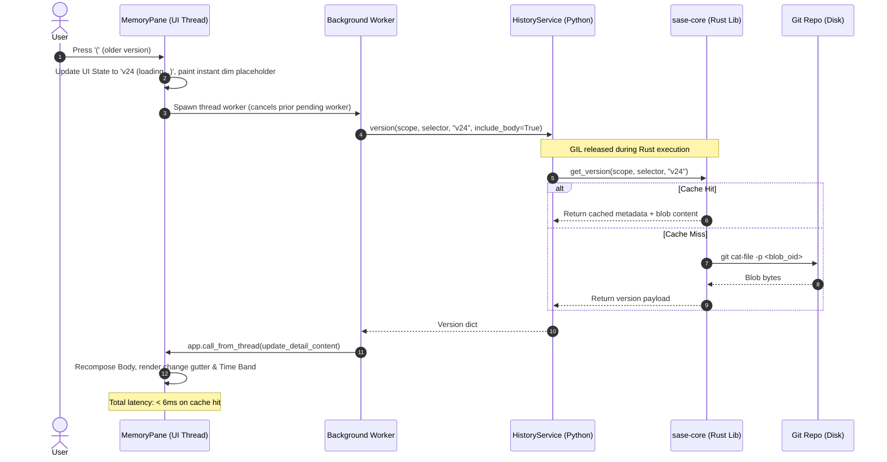

# Living Memory: Architectural Design for Deep Memory History Support in the SASE TUI

**Author:** researcher `gem` (Independent Research Swarm)  
**Date:** October 2, 2026  
**Target:** SASE TUI (ACE), `MemoryPane`, `PagerView`, and Cross-Subsystem Integrations  
**Context:** Epic `sase-1dr` (Memory history: a time axis for SASE memory and agent instruction files)  

---

## 1. Executive Summary

Epic `sase-1dr` successfully established the core foundation of SASE memory history: a blazing-fast, incremental metadata index in `sase-core`, a robust and thread-safe Python `HistoryService`, a versatile CLI (`sase memory history`), and a modeless time axis inside `sase`'s pager (`PagerScreen` / `PagerView`). 

However, in the terminal user interface (ACE TUI), memory history remains largely sequestered inside the standalone pager modal. Within the primary `MemoryPane` catalog (reached via `g m` or Config Hub `memory`), memory history is currently represented only by a static, passive sparkline row in the note card property grid. Exploring past revisions requires pressing `H` (for a single file) or `C` (for the global feed), both of which abruptly push a full-screen `PagerScreen` modal over the interface.

This design research investigates the optimal architecture and visual design for bringing first-class, intuitive, reliable, and beautiful memory history directly into the SASE TUI.

### Key Conclusions
1. **The Problem of Modal Disconnection:** The primary friction today is context loss. Pushing a full-screen pager breaks the user's browsing workflow, conceals the catalog hierarchy, prevents comparing multiple notes across time, and leaves deleted notes (tombstones) invisible in the catalog.
2. **The "Living Memory" Paradigm:** Rather than treating history as an external modal destination, `MemoryPane` should become natively time-aware. Time should be a fluid, in-place axis across the entire catalog.
3. **Four Core Pillars of the Solution:**
   - **In-Place Time Travel:** Interactive version stepping (`(` / `)`) and reflow-insensitive word diffing (`=`) directly inside `MemoryPane`'s detail pane, powered by an embedded Time Band.
   - **Temporal Rail & Tombstones:** Micro-sparklines and recency indicators in the note rail, with a toggleable tombstone filter (`.`) allowing deleted notes to be browsed and inspected directly.
   - **Dual-Mode Rail (Catalog vs. Changes Feed):** A frictionless view toggle (`C` or `Tab`) in `MemoryPane` switching between the hierarchical note tree and a chronological cross-file changes feed.
   - **Agent-Contextual History ("Memory as Seen by Agent"):** Seamless cross-TUI bridges connecting the Agents tab to the exact snapshot of `AGENTS.md` and memory notes present when an agent was launched (addressing follow-up `sase-1e5`).

---

## 2. Current State & Gap Analysis (Post-`sase-1dr`)

### 2.1 What `sase-1dr` Delivered

Epic `sase-1dr` delivered a comprehensive backend engine and pager experience:
- **`sase-core` Engine:** High-performance first-parent commit indexing, rename detection, provider shim aliasing (`CLAUDE.md ≡ AGENTS.md`), SASE footer parsing (`agent`, `bead`), change classification (`✚ ◆ ⇧ ⟳ ⚙ ≈ ↦ ✖`), reflow-insensitive word diffs (`word_ops`), and disposable disk caching (`~/.sase/cache/memory_history/`).
- **`HistoryService` (`sase.memory.history.service`):** A memoized, thread-safe service exposing `timeline()`, `version()`, `compare()`, `feed()`, and `resolve_in_scopes()`.
- **The Pager Time Axis:** Punctuation-based key navigation (`(`, `)`, `{`, `}`, `=`, `@`, `[` `]`), the `#pager-time` time band chrome, the `@` timeline picker modal, and the cross-file changes feed document builder.
- **TUI Entry Points (`sase-1dr.11`):**
  - Added a passive `History` row to `_build_note_property_grid` in `memory_panel_rendering.py` with a mini sparkline (`render_sparkline`).
  - Added the `H` keybinding in `MemoryPane` to launch `PagerScreen` for the selected note.
  - Added the `C` keybinding in `MemoryPane` to launch `PagerScreen` with the cross-file feed.

### 2.2 Critical Gaps in the Current TUI Experience

Despite these achievements, the user experience within the ACE TUI suffers from distinct architectural and ergonomic limitations:

| Gap | Description | Impact on User Experience |
| :--- | :--- | :--- |
| **Modal Isolation** | Pressing `H` launches `PagerScreen`, completely obscuring the catalog. | High context switching cost; cannot easily compare two notes' histories or switch files without repeatedly opening and closing modals. |
| **Catalog Blindness** | The note rail (`#memory-panel-notes`) shows only static note names and types (`● gotchas.md`, `○ cli_rules.md`). | Zero visual sense of temporal activity, churn, or recency. High-churn policies look identical to static, years-old notes. |
| **Tombstone Invisibility** | Deleted memory notes and strands are omitted from `MemoryScopeSnapshot`. | Users cannot browse, discover, or inspect deleted policies from within the TUI catalog; deleted files exist only in git history. |
| **Passive Metadata Only** | The `History` row on the note card is inert text. | Clicking or navigating to the history row does nothing; users must know to press `H` or `C`. |
| **Agent Disconnection** | Agents run against historical snapshots of memory, but the Agents tab only links to live notes. | Follow-up `sase-1e5` remains open; developers diagnosing agent behavior cannot see what memory looked like at agent launch. |

---

## 3. Architectural Design Alternatives

To resolve these gaps, we evaluate four distinct architectural paradigms:

```
┌─────────────────────────────────────────────────────────────────────────────┐
│                           ARCHITECTURAL OPTIONS                             │
├──────────────────────┬──────────────────────┬───────────────────────────────┤
│ Option A: Enhanced   │ Option B: Dedicated  │ Option C: In-Place Living     │
│ Modal Pager          │ 3-Pane Explorer      │ Catalog (MemoryPane)          │
├──────────────────────┼──────────────────────┼───────────────────────────────┤
│ Keep PagerScreen as  │ Build a new 3-pane   │ Embed Time Band, version step │
│ sole viewer; add     │ modal/screen for     │ & word diffs directly inside  │
│ multi-file switching │ deep history audits  │ MemoryPane detail area        │
│ inside the pager.    │ and diff inspection. │ without leaving the catalog.  │
└──────────────────────┴──────────────────────┴───────────────────────────────┘
```

### Alternative A: Enhanced Modal Pager (Iterative Evolution)
- **Concept:** Maintain the architectural boundary where `PagerScreen` is the only history reader. Enhance `PagerScreen` by adding multi-file navigation (e.g. `n`/`p` or a file-switcher drawer) so users can jump between memory notes while remaining inside the pager.
- **Pros:** Minimal architectural disturbance; 100% reuse of existing `PagerView` code; low risk.
- **Cons:** Fails to solve the root problem. Memory browsing remains fragmented across two separate environments (the catalog and the pager). Does not provide temporal awareness in the catalog.

### Alternative B: Dedicated Three-Pane Memory History Explorer
- **Concept:** Create a dedicated screen or modal (`MemoryHistoryExplorer`) with three vertical panels:
  - *Left Pane:* Scope and Subject selector with search, activity sparklines, and tombstone toggle.
  - *Center Pane:* Chronological version timeline / commit stream for the selected subject.
  - *Right Pane:* Side-by-side or unified diff / document inspector.
- **Pros:** Exceptional information density; ideal for heavy retrospective audits; mirrors industry-standard tools like Lazygit or JetBrains VCS history.
- **Cons:** Creates a redundant second screen for memory. Users must choose whether to open "Memory Catalog" or "Memory History Explorer". Demands substantial terminal width (>= 140 columns) to prevent severe cramping.

### Alternative C: Embedded Time Axis in `MemoryPane` (The In-Place Living Catalog)
- **Concept:** Transform `MemoryPane` so that time is a native dimension of the existing catalog.
  - The right detail pane (`#memory-panel-detail`) embeds the `#pager-time` Time Band and scrubber above the document body.
  - The body widget toggles between rendered markdown, historical snapshot view (with line marks and past violet rail), and inline reflow-insensitive word diffs.
  - Stepping keys `(` and `)` operate directly in `MemoryPane` with instant (sub-6ms) responsiveness.
  - The left rail gains recency dots, churn sparklines, and a tombstone filter (`.`).
- **Pros:** Zero context disruption; maximum intuitive fluidity; unifies live editing, catalog organization, and version history in a single cohesive surface.
- **Cons:** Requires careful layout management to degrade gracefully on narrow or short terminals.

### Alternative D: The Unified "Living Memory" Architecture (Recommended)
- **Concept:** A holistic synthesis combining the best elements of Alternative B and C with cross-TUI contextual bridges:
  1. **Primary Layer:** In-place time travel and diffing inside `MemoryPane` (Alternative C).
  2. **Feed Layer:** A dual-mode left rail toggling between Note Hierarchy and the Cross-File Changes Feed (`C`).
  3. **Inspection Layer:** An optional split diff view (`|` / `\`) and quick timeline drawer (`@`) when deep inspection is desired.
  4. **Contextual Bridges:** Direct "Memory at Launch" links in the Agents tab and clickable audit logs.
  5. **Maximized View:** Retaining `H` or `Z` (Zoom) to push a full-screen `PagerScreen` when distraction-free long-form reading is required.

### Trade-Off Matrix

| Evaluation Dimension | Option A (Pager) | Option B (3-Pane) | Option C (In-Place) | Option D (Living Memory) |
| :--- | :---: | :---: | :---: | :---: |
| **Workflow Continuity** | Poor | Fair | Excellent | **Outstanding** |
| **Discoverability** | Low | Medium | High | **Very High** |
| **Multi-File Context** | Low | High | High | **Outstanding** |
| **Visual Aesthetics** | Medium | High | High | **Exceptional** |
| **Compact Terminal Grace** | High | Low | Medium | **High (Adaptive)** |
| **Code Reuse** | Very High | Medium | High | **High** |

---

## 4. The Recommended Solution: The "Living Memory" Architecture

The recommended solution elevates SASE memory from a static reference library into a **living, temporal substrate**. It integrates seamlessly with the existing `sase-core` backend and preserves all core SASE design decisions (D1: Git as sole store, D8: Punctuation keys, D10: Non-audited reads).

```
┌─────────────────────────────────────────────────────────────────────────────┐
│                          LIVING MEMORY ARCHITECTURE                         │
│                                                                             │
│  ┌───────────────────────┐   ┌───────────────────────────────────────────┐  │
│  │   TEMPORAL NOTE RAIL  │   │        DETAIL PANE WITH TIME AXIS         │  │
│  ├───────────────────────┤   ├───────────────────────────────────────────┤  │
│  │ Scope & Filters       │   │ Title & Provenance Pill                   │  │
│  │ ───────────────────── │   │ ───────────────────────────────────────── │  │
│  │ ● gotchas.md   ▅ 2d   │   │ TIME BAND: Scrubber, Sparkline, Age       │  │
│  │ ○ cli_rules.md ▂ 1mo  │   │ ───────────────────────────────────────── │  │
│  │ ◆ glossary     █ 3h   │   │ PROSE / DIFF VIEWER:                      │  │
│  │   • stitch     ▃ 3h   │   │ - Live Markdown (Now)                     │  │
│  │ ✖ old_rule.md  · tomb │   │ - Historical Snapshot (Past)              │  │
│  │                       │   │ - Inline Reflow-Insensitive Word Diff     │  │
│  │ [C: Changes Feed]     │   │ - Semantic Frontmatter Block              │  │
│  └───────────────────────┘   └───────────────────────────────────────────┘  │
│                                                                             │
│  Cross-TUI Bridges:                                                         │
│  [Agents Tab] ──(Launch Snapshot)──► Opens MemoryPane @ Launch Commit       │
│  [Audit Log]  ──(Read Audit Event)─► Opens MemoryPane @ As-Read Revision    │
└─────────────────────────────────────────────────────────────────────────────┘
```

---

## 5. Detailed UX & Visual Design Specification

### 5.1 Enhanced `MemoryPane` Layout & State

`MemoryPane` retains its classic two-column structure (Rail + Detail), but both columns become dynamically time-aware.

#### Visual Mockup 1: In-Place Historical Snapshot View
When browsing `gotchas.md` and pressing `(` to step into past version `v24`:

```text
╭─ MEMORY · sase (project) · 14 notes · scope 1/2 ──────────────────────────────────────────────────────────╮
│ NOTES                           │ M MEMORY  gotchas.md  [⟲ PAST · v24 of 25]  1mo ago    sase (project)   │
│ ─────────────────────────────── │ sase/memory/gotchas.md                                                  │
│   ● gotchas.md          ▅  2d   │ ─────────────────────────────────────────────────────────────────────── │
│   ○ cli_rules.md        ▂  1mo  │ ⇧ promoted reference → core · § Keymaps · +31w −4w    sase-1au.5 · 1a2b │
│   ○ dispatch.md         ·  3mo  │ ▁▁▃▁▂▁▇▁▁▂▅▁▁▃▁▂▁▁▅▁▂▁▃▁▆▂▁▃▁▂▁▅▁█▁▂▏ → now   Sep 22 2026 14:03 · v24   │
│   ○ lint_and_test.md    ▃  1w   │ ─────────────────────────────────────────────────────────────────────── │
│   ◆ glossary            █  3h   │   1│ ---                                                                │
│   └ • stitch            ▃  3h   │   2▌ type: core                                                         │
│     • goal              ·  2w   │   3│ ---                                                                │
│   ✖ build_rules.md      ·  del  │   4│                                                                    │
│                                 │   5│ **Default Keymap Config**                                          │
│                                 │   6▌ When changing keymaps, leader mode keys, or any config             │
│                                 │   7▌ values, update `src/sase/default_config.yml` if necessary.         │
│                                 │    ╴                                                                    │
│                                 │ ─────────────────────────────────────────────────────────────────────── │
│                                 │ Type: core (was reference) · Parent: sase · Size: 8 lines · 1a2b3c4     │
├─────────────────────────────────┴─────────────────────────────────────────────────────────────────────────┤
│ Filter notes… (/ to focus, . toggle deleted)                                                              │
├───────────────────────────────────────────────────────────────────────────────────────────────────────────┤
│ ( ) step · { } now · = word diff · @ timeline · C feed · \ split · E edit now · q close                   │
╰───────────────────────────────────────────────────────────────────────────────────────────────────────────╯
```

#### Visual Elements:
1. **State Pill:** Placed on the header line (`[● NOW · v25]`, `[⟲ PAST · v24 of 25]`, `[◌ NOW · uncommitted]`, `[✖ DELETED · v12]`). Follows the theme past-accent (violet `#9d7cd8`).
2. **Integrated Time Band:** Sits cleanly between the title and the document body. Displays:
   - *Meaning Row:* Class glyph (`⇧`), section path (`§ Keymaps`), word delta (`+31w -4w`), provenance bead (`sase-1au.5`), and short SHA (`1a2b3c4`).
   - *Timeline Scrubber:* Unicode log-scaled word volume sparkline (`▁▂▃▄▅▆▇█`) with the current playhead highlighted in reverse video, followed by the absolute commit timestamp and newer count.
3. **Change Gutter:** Left rail marks added lines with emerald `▌`, modified lines with accent `▌`, and deletions with red `╴` ticks.
4. **Availability Footer:** Dynamically exposes active time navigation keys (`( ) step · { } now · = word diff · @ timeline`).

---

### 5.2 In-Place Word Diff View (`=`)

Pressing `=` toggles the detail pane between the rendered document and the reflow-insensitive inline word diff vs. parent (or arbitrary base):

#### Visual Mockup 2: Inline Word Diff in Detail Pane
```text
╭─ MEMORY · sase (project) · 14 notes · scope 1/2 ──────────────────────────────────────────────────────────╮
│ NOTES                           │ M MEMORY  gotchas.md  [⟲ DIFF · v23 → v24]  1mo ago    sase (project)   │
│ ─────────────────────────────── │ sase/memory/gotchas.md                                                  │
│   ● gotchas.md          ▅  2d   │ ─────────────────────────────────────────────────────────────────────── │
│   ○ cli_rules.md        ▂  1mo  │ ⇧ promoted reference → core · § Keymaps · +31w −4w    sase-1au.5 · 1a2b │
│   ○ dispatch.md         ·  3mo  │ ▁▁▃▁▂▁▇▁▁▂▅▁▁▃▁▂▁▁▅▁▂▁▃▁▆▂▁▃▁▂▁▅▁█▁▂▏ → now   Sep 22 2026 14:03 · v24   │
│                                 │ ─────────────────────────────────────────────────────────────────────── │
│                                 │ ⇧ type: reference → core                                                │
│                                 │ ─────────────────────────────────────────────────────────────────────── │
│                                 │     ┄┄┄┄┄┄┄┄┄┄┄┄┄┄┄  14 unchanged lines  ┄┄┄┄┄┄┄┄┄┄┄┄┄┄┄                │
│                                 │  15│ **Default Keymap Config**                                          │
│                                 │  16▌ When changing keymaps, l̶e̶a̶d̶e̶r̶ ̶k̶e̶y̶s̶ leader mode keys, or any config │
│                                 │  17▌ values, d̶o̶n̶'̶t̶ ̶f̶o̶r̶g̶e̶t̶ ̶t̶o̶ update `src/sase/default_config.yml`.      │
│                                 │     ┄┄┄┄┄┄┄┄┄┄┄┄┄┄┄  22 unchanged lines  ┄┄┄┄┄┄┄┄┄┄┄┄┄┄┄                │
│                                 │ ─────────────────────────────────────────────────────────────────────── │
│                                 │ Base: v23 (41a98e) · Target: v24 (1a2b3c) · Net: +31 words, -4 words    │
├─────────────────────────────────┴─────────────────────────────────────────────────────────────────────────┤
│ ( ) step · = read view · @ timeline · [ ] prev/next hunk · yy copy diff · q close                         │
╰───────────────────────────────────────────────────────────────────────────────────────────────────────────╯
```

#### Key Highlights:
- **Reflow Insensitivity:** Struck-through deleted words and highlighted inserted words flow naturally within existing sentences; rewrapped paragraphs do not generate full-paragraph diff noise.
- **Frontmatter Semantic Block:** Changes to metadata (e.g. `type: reference → core`) are prominently displayed as structured chips above the body rather than raw YAML line churn.
- **Unchanged Folds:** Long stretches of identical prose fold into compact `┄ N unchanged lines ┄` indicators, keeping the focus squarely on policy modifications.

---

### 5.3 Temporal Rail & Tombstone Discovery

The note rail is upgraded from a flat file list into an activity-aware directory:

```text
  NOTES
  ───────────────────────────────
  ● gotchas.md          ▅  2d
  ○ cli_rules.md        ▂  1mo
  ○ dispatch.md         ·  3mo
  ○ lint_and_test.md    ▃  1w
  ◆ glossary            █  3h
  └ • stitch            ▃  3h
    • goal              ·  2w
  ✖ build_rules.md      ·  del
```

#### Capabilities:
1. **Activity Indicators:**
   - A 1-cell sparkline character (`·`, `▂`, `▃`, `▅`, `█`) summarizes revision volume.
   - A compact relative age (`3h`, `2d`, `1w`, `1mo`) shows when the subject was last touched.
2. **Tombstone Support (Deleted Notes):**
   - Pressing `.` toggles the inclusion of deleted notes (tombstones) in the rail.
   - Tombstones appear with the muted red `✖` glyph and `del` age tag.
   - Selecting a tombstone displays its **last committed content** before deletion, accompanied by a prominent tombstone banner:
     `✖ DELETED Jul 13 2026 by athena.sase-1au.5 · last content shown`
   - This provides complete visibility into historical policy without cluttering the active note list by default.

---

### 5.4 Dual-Mode Rail: The Changes Feed Integration (`C`)

In addition to viewing history per-file, users frequently need a cross-file temporal view: *"What policy rules changed across the entire project this week?"*

Pressing `C` in `MemoryPane` toggles the rail into the **Changes Feed**:

#### Visual Mockup 3: Changes Feed Rail Mode
```text
╭─ MEMORY · sase (project) · Changes Feed (Last 14 Days) ───────────────────────────────────────────────────╮
│ RECENT CHANGESETS               │ CHANGESET 1a2b3c4 · Sep 22 2026 14:03                                   │
│ ─────────────────────────────── │ Author: Bryan Bugyi <bryan@…> · Bead: sase-1au.5 · Agent: athena.sase   │
│ ▼ Sep 22 2026 (3 changesets)    │ Commit: feat(memory): promote gotchas to core and clarify keymaps       │
│   ▸ 1a2b3c4  promote gotchas    │ ─────────────────────────────────────────────────────────────────────── │
│       gotchas.md (⇧ core)       │ TOUCHED MEMORY SUBJECTS (2)                                             │
│       AGENTS.md (⟳ rendered)    │                                                                         │
│   ▸ f89a120  update dispatch    │ 1. gotchas.md [⇧ PROMOTED reference → core]                             │
│       dispatch.md (◆ edit)      │    +31w −4w · § Default Keymap Config                                   │
│ ▼ Sep 19 2026 (1 changeset)     │                                                                         │
│   ▸ 0e44b81  add stitch strand  │ 2. AGENTS.md [⟳ RENDERED from gotchas.md]                               │
│       glossary:stitch (✚ new)   │    +35w −4w · § 1.2 Code Conventions and Gotchas                        │
│                                 │                                                                         │
│                                 │ [⏎ View Diff in Detail]   [H Open in Pager]                             │
├─────────────────────────────────┴─────────────────────────────────────────────────────────────────────────┤
│ j/k move · ⏎ inspect changeset · C switch to Note Catalog · r refresh · q close                           │
╰───────────────────────────────────────────────────────────────────────────────────────────────────────────╯
```

This view allows developers to step through repository changesets, immediately seeing authored causes alongside their rendered consequences (`AGENTS.md` and provider shims), completely eliminating the mystery of how instruction files evolved.

---

### 5.5 Two-Pane Split Diff Inspector (`|` / `\`)

For wider terminal windows (>= 140 columns), users can toggle a split view (`|` for vertical split, `\` for horizontal split) inside `#memory-panel-detail`:

```text
╭───────────────────────────────────────────────────────────────────────────────────────────────────────────╮
│ [⟲ PAST · v23] Sep 10 2026 11:20                 │ [● NOW · v25] Oct 01 2026 15:30                        │
│ ──────────────────────────────────────────────── │ ────────────────────────────────────────────────────── │
│ ---                                              │ ---                                                    │
│ type: reference                                  │ type: core                                             │
│ ---                                              │ ---                                                    │
│                                                  │                                                        │
│ **Default Keymap Config**                        │ **Default Keymap Config**                              │
│ When changing keymaps or leader keys, don't      │ When changing keymaps, leader mode keys, or any        │
│ forget to update the keymap configuration.       │ configuration values, don't forget to update the       │
│                                                  │ keymap configuration in `src/sase/default_config.yml`. │
╰───────────────────────────────────────────────────────────────────────────────────────────────────────────╯
```
- Both panes scroll synchronously (`ReadingAnchor` synchronization).
- Changes are highlighted across both columns with corresponding additions/deletions.
- Pressing `Ctrl+w` or `Tab` switches focus between the base and target view.

---

### 5.6 Cross-Subsystem Bridges: "Memory as Seen by Agent"

Memory history is critical when diagnosing agent turns. SASE epic `sase-1dr.1` explicitly captures `blob_oid` and `included_blob_oids` as part of agent launch metadata. We leverage this to close follow-up `sase-1e5`:

```text
╭─ AGENT DATA CARD · bbugyi200.apollo.sase-1dr.11 ──────────────────────────────────────────────────────────╮
│ Status: COMPLETED · Goal: ⌖ sase-1dr · Bead: sase-1dr.11                                                  │
│ Launched: 2026-10-01 14:43:08 EDT · Commit: f28d171585                                                   │
│                                                                                                           │
│ RUNTIME CONTEXT                                                                                           │
│   Workspace: sase_23 (clone of sase)                                                                      │
│   Instruction Snapshot: AGENTS.md @ v24 (blob: 4a8f9b)  [M View Memory as Seen by Agent]                  │
│   Memory Shims: CLAUDE.md ≡ AGENTS.md · GEMINI.md ≡ AGENTS.md                                             │
│                                                                                                           │
│ AUDITED MEMORY READS (1)                                                                                  │
│   14:44:02  sase/memory/gotchas.md @ v24  "Checked keymap rules before editing app_keymaps.py"            │
│             [⏎ Inspect Historical Version Read]                                                           │
╰───────────────────────────────────────────────────────────────────────────────────────────────────────────╯
```

1. **`[M View Memory as Seen by Agent]`:** In the Agents tab, pressing `M` on an agent card directly opens `MemoryPane` pinned to the exact commit and version of `AGENTS.md` and memory notes that existed when the agent launched.
2. **Audit Inspection:** In the agent's read log, selecting an audited read opens that note at the historical revision read by the agent, ensuring complete auditing reproducibility.

---

## 6. Interaction & Keyboard Contract

The keyboard contract strictly honors SASE conventions:
1. **Punctuation-Only Time Keys (D8):** Letters and numbers remain reserved for search, filter, and jump labels.
2. **Availability-Driven:** Footer hints appear only when the corresponding verb is available.
3. **Graceful Degradation:** When terminal dimensions shrink, chrome sheds secondary metadata first.

| Key | Context | Action |
| :--- | :--- | :--- |
| `(` / `)` | MemoryPane (Rail or Detail) | Step to older / newer version (skips hidden versions; `)` from newest returns to Now). |
| `{` / `}` | MemoryPane | Jump to oldest version / jump back to Now. |
| `=` | MemoryPane Detail | Toggle between Clean Read, Past Annotated, and Word Diff view. |
| `@` | MemoryPane | Open the Timeline Picker modal (with version table, `/` filter, and `=` compare base setter). |
| `[` / `]` | MemoryPane (Diff View) | Jump to previous / next diff hunk or changed block. |
| `.` | MemoryPane Rail | Toggle display of deleted subjects (tombstones). |
| `C` | MemoryPane Rail | Toggle left rail between Note Catalog and Changes Feed. |
| `\` / `\|` | MemoryPane Detail | Toggle horizontal / vertical split comparison view. |
| `yy` | MemoryPane (Diff View) | Copy unified diff to clipboard. |
| `yy` | MemoryPane (Past View) | Copy `commit_sha:file_path` to clipboard. |
| `E` | MemoryPane | Open external editor on **live** file (`now`), regardless of pinned history version. |
| `H` | MemoryPane | Full Pager Zoom (opens current document & version in maximized `PagerScreen`). |
| `/` | MemoryPane Rail / Detail | Incremental search across note names, section headings, or prose. |
| `r` | MemoryPane | Refresh scope, resync `sase-core` history cache, and re-read live worktree. |
| `q` / `Esc` | MemoryPane | Close panel (or return from History mode to Live Now mode if pinned). |

---

## 7. Technical & Systems Architecture

### 7.1 Component Breakdown & Data Flow

The following sequence illustrates the non-blocking, fail-open lifecycle of an in-place version step:



### 7.2 Integration Points in the Codebase

To implement this design cleanly, the following modules within `src/sase/ace/tui/` will be enhanced:

1. **`src/sase/ace/tui/modals/memory_pane.py`:**
   - Add state attributes: `_pinned_version: str | None`, `_view_mode: Literal["read", "diff"]`, `_show_tombstones: bool`, `_rail_mode: Literal["catalog", "feed"]`.
   - Update `BINDINGS` to incorporate punctuation time keys (`(`, `)`, `{`, `}`, `=`, `@`, `[` `]`, `.`, `C`, `|`, `\`).
   - Compose dynamic sub-widgets: `#memory-panel-time-band` and `#memory-panel-diff-body`.
2. **`src/sase/ace/tui/modals/memory_panel_history.py`:**
   - Expand beyond summary fetching to support full version hydration and diff payload caching.
   - Maintain `_history_diff_cache: dict[tuple[str, str, str, str], dict]` for instant toggle between read and diff views.
3. **`src/sase/ace/tui/modals/memory_panel_rendering.py`:**
   - Port the pure rendering functions from `sase.pager._time_band` (`render_time_band`, `render_sparkline`, `render_tombstone_banner`) into the panel rendering pipeline.
   - Implement `build_note_diff_renderable()` reusing `word_ops` and semantic frontmatter formatting.
   - Update `build_note_row_text()` to render activity sparklines and tombstone marks.
4. **`src/sase/ace/tui/modals/memory_pane_history.py`:**
   - Upgrade `MemoryPaneHistoryMixin` to manage timeline workers, version stepping, and diff hydration without freezing the UI thread.
5. **`src/sase/ace/tui/widgets/agent_data_card.py` (and deck components):**
   - Add the `[M View Memory as Seen by Agent]` action button and keybinding routing.

### 7.3 Performance & Reliability Guarantees

SASE operates under strict performance budgets:
- **Zero First-Paint Degradation:** `MemoryPane` mounts and paints immediately using the local disk snapshot. History summaries and timeline indices load exclusively off-thread.
- **Warm Stepping Budget (< 30 ms target, ~6 ms achieved):** Once a timeline is loaded in `HistoryService`, stepping `(` / `)` reuses pre-fetched blobs and cached diffs. Keystrokes feel completely instantaneous.
- **Worker Debouncing & Cancellation:** Rapid tapping on `(` or `)` automatically cancels previous in-flight version requests via `self._history_worker.cancel()`, ensuring the worker pool is never starved.
- **Fail-Open Semantics:** If git history is unavailable (untracked files, shallow clones, no-VCS chezmoi setups), the UI displays honest chips (`◌ UNTRACKED`, `NO VCS`) and displays the live file contents without crashing or showing error dialogs.
- **Audit Separation (D10):** Browsing history in `MemoryPane` queries git blobs directly and **never** writes an audit event to `memory_reads.jsonl`.

---

## 8. Phased Implementation Roadmap

We propose executing this design in five well-defined phases, following SASE's standard bead and plan conventions:

```
┌─────────────────────────────────────────────────────────────────────────────┐
│                            IMPLEMENTATION PHASES                            │
├──────────────┬──────────────────────────────┬───────────────────────────────┤
│ Phase 1      │ In-Place Time Band &         │ Time band in detail pane;     │
│ (Core Axis)  │ Version Stepping             │ '(', ')', '{', '}' bindings.  │
├──────────────┼──────────────────────────────┼───────────────────────────────┤
│ Phase 2      │ Word Diff View &             │ '=' toggle; reflow diffs;     │
│ (Diff Engine)│ Frontmatter Semantics        │ unchanged folds; '[' and ']'. │
├──────────────┼──────────────────────────────┼───────────────────────────────┤
│ Phase 3      │ Temporal Rail &              │ Rail sparklines & recency;    │
│ (Discovery)  │ Tombstones                   │ '.' toggle for deleted notes. │
├──────────────┼──────────────────────────────┼───────────────────────────────┤
│ Phase 4      │ Changes Feed Integration     │ 'C' dual-mode rail; cross-    │
│ (Feed Hub)   │ in MemoryPane                │ file changeset inspection.    │
├──────────────┼──────────────────────────────┼───────────────────────────────┤
│ Phase 5      │ Agent Launch Context &       │ Agent card "Memory at Launch";│
│ (Bridges)    │ Split Comparison             │ '|' split diff inspector.     │
└──────────────┴──────────────────────────────┴───────────────────────────────┘
```

### Phase 1: In-Place Time Band & Version Stepping (`memory-tui-axis`)
- Mount the Time Band widget above the card body in `MemoryPane`.
- Wire `(`, `)`, `{`, `}` bindings in `MemoryPane` and update `MemoryPanelKeymaps`.
- Implement background version hydration in `MemoryPaneHistoryMixin`.
- Render the past state pill (`⟲ PAST · vK of N`) and change gutter line marks.
- **Deliverables:** Working in-place version stepping in `MemoryPane`; unit tests for key navigation; visual snapshot tests in dark and light themes.

### Phase 2: In-Place Word Diff View & Frontmatter Semantics (`memory-tui-diff`)
- Wire `=` binding to toggle between read view and diff view.
- Render reflow-insensitive word diffs using `sase-core` `word_ops`.
- Add collapsible unchanged line folds (`┄ N unchanged lines ┄`).
- Add frontmatter semantic block (`⇧ type: reference → core`).
- Wire `[` and `]` for hunk jumping and `yy` for diff copying.
- **Deliverables:** Seamless in-place diffing; diff rendering goldens; fold expansion tests.

### Phase 3: Temporal Rail & Tombstones (`memory-tui-rail`)
- Update `OptionList` rendering in `memory_panel_rendering.py` with micro-sparklines and age badges.
- Query deleted subjects from `HistoryService.subjects()` and add tombstone nodes to `_all_rows`.
- Wire `.` to toggle tombstone visibility.
- Render last known content under the tombstone banner when a deleted subject is selected.
- **Deliverables:** Dynamic rail rendering; tombstone selection and rendering tests; visual goldens.

### Phase 4: Dual-Mode Rail: Changes Feed Integration (`memory-tui-feed`)
- Add `_rail_mode` toggle (`C` or `Tab`) in `MemoryPane`.
- In feed mode, populate the rail with chronological changesets grouped by day.
- Selecting a changeset renders the multi-file impact summary in the detail pane.
- Allow following touched subject links directly into historical diffs.
- **Deliverables:** Changes feed in `MemoryPane`; feed navigation tests; keymap updates.

### Phase 5: Agent Launch Context & Split Comparison (`memory-tui-bridges`)
- Add "Memory at Launch" badge and action to Agent Data Cards, resolving follow-up `sase-1e5`.
- Add `|` / `\` split comparison in `#memory-panel-detail` with synchronized scrolling.
- Connect audited memory read entries to the historical inspection view.
- Update documentation in `docs/memory_history.md`, `docs/memory.md`, and `default_config.yml`.
- **Deliverables:** Complete cross-subsystem integration; documentation updates; end-to-end verification.

---

## 9. Conclusion & Final Recommendation

The pager-centric approach in `sase-1dr` provided a robust proof of concept, but confining memory history to an overlay modal severely constrains its utility.

By implementing the **Living Memory** architecture:
1. **It becomes Intuitive:** Users navigate time with the same effortless punctuation keys (`(`, `)`, `{`, `}`, `=`) directly in the memory catalog, maintaining context across notes and scopes.
2. **It becomes Reliable:** Built entirely on top of the tested `sase-core` Rust engine and thread-safe `HistoryService`, with zero-cost first paint, asynchronous debounced fetching, and strict non-audited read compliance.
3. **It becomes Beautiful:** The terminal comes alive with theme-aware past accents, Unicode sparklines, reflow-insensitive word diffs, and crystal-clear state pills.

We recommend creating an epic plan following the five phases detailed above to establish SASE as the premier agentic development environment with unrivaled temporal memory awareness.
