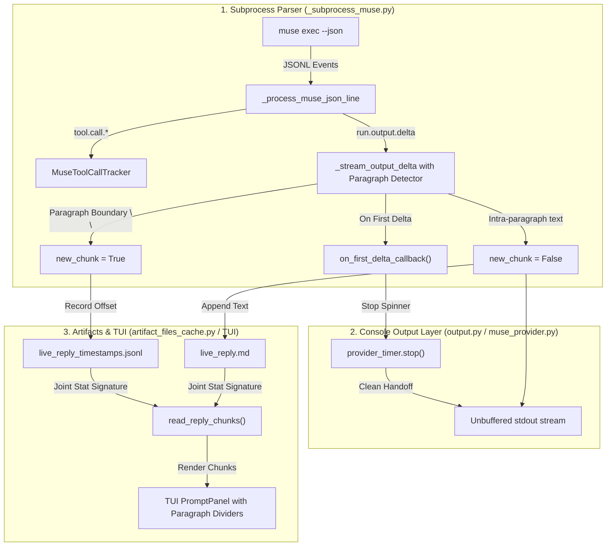

# Architectural Research: Output Streaming Support in the Muse LLM Provider

**Author**: Researcher `gem` (Independent Research Report)  
**Date**: October 2026  
**Target Component**: `sase.llm_provider.muse_provider` / `sase.llm_provider._subprocess_muse`  
**Classification**: Durable Research Snapshot (`__gem.md`)

---

## Executive Summary

The Meta Muse Code (`muse`) provider in SASE was originally designed to stream live output deltas into the SASE artifact pipeline (`live_reply.md` and `live_reply_timestamps.jsonl`) for real-time display in the SASE Terminal User Interface (TUI) and on the interactive console. However, early users observed a severe visual defect: agent replies were chunked into hundreds of tiny, broken fragments (often splitting mid-word or across single syllables), generating excessive timestamp dividers in the TUI prompt panel and unreadable output on the CLI.

A targeted fix in commit `a0244d7599` attempted to resolve this by coalescing all deltas belonging to a single run stream into a monolithic chunk. While this eliminated the mid-word splitting defect, it inadvertently broke the user perception and functional reality of streaming ever since:

1. **CLI Console Streaming is Silenced by Rich `Live` Line-Buffering**: When invoked via the CLI (`sase run`), execution is wrapped in `output.provider_timer("Waiting for Muse Code")`. Because `append_stream_delta()` prints partial tokens using `print(text, end="", flush=True)`, Rich's underlying `Live` stdout redirection intercepts and line-buffers the partial writes without displaying them. The user sees a frozen spinner for the entire duration of the stream, followed by an abrupt, all-at-once text dump when `_close_delta_chunk()` prints a terminal newline.
2. **TUI Paragraph Progression is Destroyed**: By forcing all deltas of a stream into exactly one timestamped entry at byte offset 0, the TUI prompt panel loses the ability to render progressive paragraph-by-paragraph dividers over time. The entire response re-renders from byte 0 on every tick.
3. **The Tool Execution Phase Silence Gap**: Muse executes tools (reading/writing files, running tests) prior to generating its conversational reply. During this phase, which accounts for >90% of turn latency, Muse emits tool lifecycle events but zero `run.output.delta` events. Because `live_reply.md` remains completely empty, the prompt panel displays `"Waiting for agent response..."` until the final seconds of the turn.

This report analyzes the root causes across both the CLI console and TUI surfaces, evaluates five architectural repair options, and recommends a production-ready solution that combines **paragraph-boundary delta chunking** with a **timer-dismissal streaming handoff**.

---

## 1. Historical Evolution & The Chunking Regression

### 1.1 The Initial Implementation (`44fa7eee24`)

In commit `44fa7eee24` (*"feat(llm-provider): add the Muse Code provider and its JSONL stream parser"*), Muse support was added to SASE. Headless execution ran `muse exec --json`, which emits newline-delimited JSON (JSONL) events.

The stream processor handled `run.output.delta` events as follows:

```python
# Initial implementation in commit 44fa7eee24
def _stream_output_delta(payload: Mapping[str, object], state: _MuseStreamState) -> None:
    text = payload.get("text")
    if not isinstance(text, str) or not text:
        return
    append_stream_text(
        text,
        state.streamed_texts,
        state.suppress_output,
        state.live_reply_file,
        state.timestamps_file,
    )
```

The helper `append_stream_text()` was originally designed for providers like Claude and Codex, which emit complete message blocks or completed items. For every call:
1. It invoked `write_reply_timestamp(live_reply_file, timestamps_file)` to record the current byte offset in `live_reply_timestamps.jsonl`.
2. It wrote a double newline (`\n\n`) if the file already had content.
3. It wrote the text to `live_reply.md`.
4. It executed `print(text, flush=True)` to stdout with a newline.

### 1.2 The Bug: Token-Level Delta Fragmentation

`muse exec --json` does **not** emit whole sentences or complete content blocks. Instead, it emits token fragments. As captured in live execution logs (e.g. `task-190.log`):

```json
{"payload_type": "run.output.delta", "payload": {"text": "Trees are among the oldest"}}
{"payload_type": "run.output.delta", "payload": {"text": " and most vital organisms on"}}
{"payload_type": "run.output.delta", "payload": {"text": " Earth, quietly"}}
{"payload_type": "run.output.delta", "payload": {"text": " shaping the landscapes"}}
{"payload_type": "run.output.delta", "payload": {"text": " we"}}
{"payload_type": "run.output.delta", "payload": {"text": " inhabit. From tow"}}
{"payload_type": "run.output.delta", "payload": {"text": "ering red"}}
{"payload_type": "run.output.delta", "payload": {"text": "woods that"}}
```

Notice tokens like `"inhabit. From tow"`, `"ering red"`, and `"woods that"`. The token boundary cuts mid-word (`"tow"` + `"ering"`, `"red"` + `"woods"`).

Because `append_stream_text()` treated every invocation as a standalone message block, each token received:
- Its own timestamp entry in `live_reply_timestamps.jsonl`.
- Preceding `\n\n` separators in `live_reply.md`.
- A trailing newline on the terminal.

In the SASE TUI, `get_timestamped_reply_chunks()` reads `live_reply_timestamps.jsonl` and renders a divider for each entry:

```text
─── 13:30:15 ──────────────────────────────────────
Trees are among the oldest

─── 13:30:15 ──────────────────────────────────────
 and most vital organisms on

─── 13:30:15 ──────────────────────────────────────
 Earth, quietly

─── 13:30:15 ──────────────────────────────────────
inhabit. From tow

─── 13:30:15 ──────────────────────────────────────
ering red
```

A single 100-word response produced over 100 visual dividers and hundreds of blank lines, rendering the prompt panel unusable.

### 1.3 The "Fix" (`a0244d7599`): Single-Chunk Coalescing

In commit `a0244d7599` (*"fix(muse): coalesce output deltas into one live-reply chunk per run stream"*), the provider was patched:

```python
# Commit a0244d7599
def _stream_output_delta(
    payload: Mapping[str, object], state: _MuseStreamState
) -> None:
    text = payload.get("text")
    if not isinstance(text, str) or not text:
        return
    stream_key = _run_stream_key(payload)
    new_chunk = state.open_stream_key != stream_key
    if new_chunk:
        _close_delta_chunk(state)
        state.open_stream_key = stream_key
    state.streamed_texts.setdefault(stream_key, []).append(text)
    append_stream_delta(
        text,
        state.suppress_output,
        state.live_reply_file,
        state.timestamps_file,
        new_chunk=new_chunk,
    )
```

In `append_stream_delta()`:
- Only when `new_chunk=True` (the first delta of a given stream) does it call `write_reply_timestamp()` and write `\n\n`.
- All subsequent deltas within that stream append bare text to `live_reply.md` and call `print(text, end="", flush=True)`.
- When the stream ends (at `run.terminal.completed`), `_close_delta_chunk()` prints a single newline: `print(flush=True)`.

The accompanying test `test_agent_reply_muse_chunks.py` enforced this:

```python
def test_muse_reply_renders_one_divider_for_all_streamed_deltas(...):
    ...
    dividers = [item for item in renderables if isinstance(item, Text)]
    assert len(dividers) == 1
    assert bodies == [reply]
```

This successfully stopped the mid-word splitting bug. However, it had severe secondary consequences that made streaming appear completely dead.

---

## 2. Root Cause Analysis: Why Streaming Stopped Working

### 2.1 Failure Mode A: The CLI Console Line-Buffering Trap

In `src/sase/llm_provider/muse_provider.py`:

```python
timer_context = (
    provider_timer("Waiting for Muse Code") if not suppress_output else None
)
...
if timer_context:
    with timer_context:
        content, stderr_content, return_code, usage = self._run_subprocess(
            command_args, suppress_output, session_id
        )
        print()
```

The context manager `provider_timer("Waiting for Muse Code")` uses Rich's `Live` display:

```python
# src/sase/output.py
with Live(_get_timer_text(), refresh_per_second=2, console=console) as live:
    stop_event = threading.Event()
    def _update_timer() -> None:
        while not stop_event.wait(_PROVIDER_TIMER_INTERVAL_SECONDS):
            live.update(_get_timer_text())
    ...
```

When Rich's `Live` is entered with `console=console`, Rich intercepts standard output (`sys.stdout`) to prevent uncoordinated writes from destroying the cursor position of the live updating spinner.

**The Mechanical Failure**:
1. Rich's redirected stdout wrapper buffers writes until it encounters a newline (`\n`).
2. `append_stream_delta()` calls `print(text, end="", flush=True)`.
3. Because `end=""`, **no newline is printed**. Rich holds every single delta in its internal buffer.
4. As Muse outputs deltas over the network, nothing appears on screen. The terminal only displays `⏱️ Waiting for Muse Code [00:08]`.
5. Only when `run.terminal.completed` arrives does `_close_delta_chunk()` call `print(flush=True)`.
6. That single newline causes Rich to flush its entire accumulated multi-kilobyte buffer in a single burst, immediately followed by `✅ Waiting for Muse Code completed in 00:09`.
7. `print_prompt_and_response` then displays the final Rich panel.

**Outcome**: To any user on the terminal, streaming is 100% non-functional. The CLI exhibits classic batch behavior: spinner -> pause -> instant wall of text.

### 2.2 Failure Mode B: TUI Rendering & The "Single Chunk" Collapse

In the SASE TUI, `AgentPromptPanel` renders agent replies using `get_timestamped_reply_chunks()`, which delegates to `read_reply_chunks()` in `src/sase/agent/artifact_files_cache.py`:

```python
def read_reply_chunks(self, timestamps_path: str, reply_path: str):
    ts_sig = _stat_signature(timestamps_path)
    reply_sig = _stat_signature(reply_path)
    joint = (ts_sig, reply_sig)
    ...
    for i, (offset, timestamp) in enumerate(entries):
        end = entries[i + 1][0] if i + 1 < len(entries) else len(content_bytes)
        chunks.append((timestamp, content_bytes[offset:end].decode("utf-8", errors="replace")))
    return chunks
```

In other streaming providers (such as Gemini/Antigravity via `_subprocess_plain.py`), paragraph boundaries (`prev_line_blank and line.strip()`) trigger new timestamp entries in `live_reply_timestamps.jsonl`. This creates discrete chunks for each paragraph.

In Muse under commit `a0244d7599`:
- Only offset 0 has a timestamp entry.
- `chunks` always contains exactly one element: `[(timestamp, accumulated_text_so_far)]`.
- On every TUI refresh tick (typically every 1–2 seconds), `_agent_display_render.py` must re-parse the entire Markdown syntax from scratch using `_render_markdown(content)`.
- If the model paused between thoughts or output multiple logical sections, no new timestamp dividers were created to reflect the timeline of generation.

### 2.3 Failure Mode C: The Tool Execution Latency Disparity

A third major factor contributing to the perception that streaming does not work is Muse's internal execution model.

In benchmark tests of Muse (`muse-spark-1.2-contributor` and `muse-spark-1.3-contributor`):
- A coding task often takes 15 to 45 seconds.
- During the first 13 to 42 seconds, Muse executes tools (`read_file`, `grep`, `bash`).
- During tool execution, Muse emits `task.lifecycle.proposed`, `task.lifecycle.output`, and `tool.result`.
- **Muse emits zero `run.output.delta` events during tool execution.**
- Once all tools finish, Muse generates its final summary in a rapid delta burst: 100 deltas in ~1.8 seconds.
- Then, a 5-second pause occurs before Muse finally emits `run.terminal.completed` and exits.

Because 95% of the run has no output deltas, users see `"Waiting for agent response..."` in the TUI for almost the entire turn. When the deltas finally fire, they arrive faster than the TUI's 1-to-2-second polling loop, so the UI transitions directly from "Waiting..." to the complete answer in a single tick.

---

## 3. Comparison of Provider Streaming Architectures

| Provider | Transport Mode | Token vs Block Stream | Boundary Detection | Live Reply Artifacts | Console Behavior |
| :--- | :--- | :--- | :--- | :--- | :--- |
| **Gemini / Antigravity (`agy`)** | Plain PTY stdout (`stream_process_output`) | Line-buffered streaming | Paragraph boundary (`prev_line_blank and line.strip()`) | Writes offset on paragraph start; writes lines | Prints lines with `end=""` directly to stdout; PTY flushes lines |
| **Claude (`claude`)** | Messages JSON (`stream_and_parse_messages_json_output`) | Block-level (`assistant.content[type=text]`) | Complete Content Block | Writes offset and `\n\n` per content block | Prints block with `print(text, flush=True)` |
| **Codex (`codex`)** | NDJSON (`stream_and_parse_codex_json_output`) | Item-level (`item.completed[type=agent_message]`) | Complete Item Message | Writes offset and `\n\n` on item completion | Prints item with `print(text, flush=True)` |
| **Muse (`muse`) [Current]** | JSONL stream (`stream_and_parse_muse_json_output`) | Raw token deltas (`run.output.delta`) | Stream ID (`new_chunk = key != open_key`) | Writes offset 0 only; appends bare text | `print(text, end="", flush=True)` trapped in Rich `Live` buffer |

---

## 4. Evaluation of Potential Implementation Approaches

### Option 1: Revert to PTY Plain Output (Abandon `--json`)
- **Concept**: Run `muse exec` without `--json` in a PTY, piping through `stream_process_output()` like Antigravity.
- **Evaluation**: **Strongly Rejected**.
  - `muse exec` without `--json` prints noisy startup warnings (e.g. `muse: workspace root...`, `muse: warning: rules file...`).
  - `_tool_call_muse.py` depends entirely on `task.lifecycle.*` and `tool.result` JSON events to populate `tool_calls.jsonl`.
  - Machine-readable token usage (via `--session-id`), model configured metadata, and exit code 2 classification would all be lost.

### Option 2: Pure Console Direct Write (`sys.__stdout__`)
- **Concept**: Bypass Rich's line buffer by writing directly to `sys.__stdout__.write(text)` and `sys.__stdout__.flush()`.
- **Evaluation**: **Inadequate**.
  - While raw bytes reach the terminal, they fight directly with Rich's `Live` cursor positioning.
  - The background thread updating `⏱️ Waiting for Muse Code` every 0.5s will move the cursor back and overwrite the streaming text, resulting in severe visual corruption.

### Option 3: Paragraph-Boundary Detection on Deltas (Streaming Buffer)
- **Concept**: In `_subprocess_muse.py`, maintain delta state. Detect when a delta contains a paragraph break (`\n\n`) followed by non-whitespace. When a new paragraph begins:
  1. Trigger `new_chunk=True`.
  2. Call `write_reply_timestamp()` to record the byte offset of the new paragraph in `live_reply_timestamps.jsonl`.
  3. Write the paragraph separator and text.
- **Evaluation**: **Highly Recommended for TUI**.
  - Restores logical multi-chunk rendering in the TUI without word-splitting.
  - Aligns Muse with Gemini/Antigravity paragraph ergonomics.
  - Completely preserves token concatenation within sentences.

### Option 4: Timer-Dismissal Streaming Handoff on First Delta
- **Concept**: In `MuseProvider.invoke()`, provide a mechanism to stop or pause `provider_timer` the moment the first `run.output.delta` arrives.
  1. While Muse is executing tools or waiting for the model, `provider_timer` displays `⏱️ Waiting for Muse Code [00:12]`.
  2. When the first delta arrives, a callback stops `provider_timer`, printing `✅ Waiting for Muse Code completed in 00:12\n`.
  3. Subsequent deltas stream cleanly to the console via standard `sys.stdout` without Rich `Live` line-buffering interference.
  4. When the stream completes, the final newline is printed.
- **Evaluation**: **Highly Recommended for CLI**.
  - Completely resolves the CLI buffering freeze.
  - Follows standard CLI UX: show a spinner while waiting for work to start; dismiss the spinner and stream text once generation begins.

---

## 5. Recommended Solution Architecture

To fully restore robust output streaming for Muse in both the CLI and TUI, the implementation should be executed across three interconnected layers:



### 5.1 Component 1: Delta Paragraph-Boundary State Machine

In `src/sase/llm_provider/_subprocess_muse.py`, upgrade `_MuseStreamState` to detect paragraph boundaries across fragmented token streams:

```python
@dataclass
class _MuseStreamState:
    suppress_output: bool
    live_reply_file: IO[str] | None = None
    timestamps_file: IO[str] | None = None
    terminal_texts: list[str] = field(default_factory=list)
    saw_run_terminal: bool = False
    streamed_texts: dict[str, list[str]] = field(default_factory=dict)
    open_stream_key: str | None = None
    diagnostics: list[str] = field(default_factory=list)
    model_id: str | None = None
    provider_id: str | None = None
    tool_calls: MuseToolCallTracker = field(default_factory=MuseToolCallTracker)
    
    # --- New Streaming State ---
    on_stream_start: Callable[[], None] | None = None
    saw_first_delta: bool = False
    consecutive_newlines: int = 0
```

Update `_stream_output_delta()`:

```python
def _stream_output_delta(
    payload: Mapping[str, object], state: _MuseStreamState
) -> None:
    text = payload.get("text")
    if not isinstance(text, str) or not text:
        return
    
    # Notify provider timer on first output token
    if not state.saw_first_delta:
        state.saw_first_delta = True
        if state.on_stream_start is not None:
            state.on_stream_start()

    stream_key = _run_stream_key(payload)
    is_new_stream = state.open_stream_key != stream_key
    if is_new_stream:
        _close_delta_chunk(state)
        state.open_stream_key = stream_key
        state.consecutive_newlines = 0

    state.streamed_texts.setdefault(stream_key, []).append(text)

    # Detect paragraph boundaries across tokens
    new_chunk = is_new_stream
    if not is_new_stream and state.consecutive_newlines >= 2 and text.strip():
        # A new paragraph has started after at least two newlines
        new_chunk = True

    # Track newline progression
    for char in text:
        if char == "\n":
            state.consecutive_newlines += 1
        elif not char.isspace():
            state.consecutive_newlines = 0

    append_stream_delta(
        text,
        state.suppress_output,
        state.live_reply_file,
        state.timestamps_file,
        new_chunk=new_chunk,
    )
```

### 5.2 Component 2: Stoppable Provider Timer Context

In `src/sase/output.py`, extend `provider_timer` to support an early stop / dismiss hook:

```python
class ProviderTimerContext:
    def __init__(self, message: str):
        self.message = message
        self._stopped = False
        self._live: Live | None = None
        ...

    def stop(self) -> None:
        """Dismiss the timer early when streaming begins."""
        if self._stopped or self._live is None:
            return
        self._stopped = True
        # Finalize and close the Live display so standard stdout streams freely
        self._stop_event.set()
        self._live.stop()
```

In `src/sase/llm_provider/muse_provider.py`:

```python
timer_context = provider_timer("Waiting for Muse Code") if not suppress_output else None

def on_stream_start():
    if timer_context is not None:
        timer_context.stop()

# Pass on_stream_start callback down to stream_and_parse_muse_json_output
```

When Muse starts streaming its answer:
1. `on_stream_start()` fires on delta 1.
2. `provider_timer.stop()` cleanly shuts down Rich's `Live` wrapper and prints `✅ Waiting for Muse Code completed in 00:14`.
3. Subsequent token fragments (`print(text, end="", flush=True)`) write directly to the real terminal with zero line-buffering. Characters appear fluidly in real-time.

### 5.3 Component 3: Updating Existing Unit and Visual Tests

The existing unit tests in `tests/ace/tui/widgets/test_agent_reply_muse_chunks.py` and `tests/llm_provider/test_muse_provider_stream.py` explicitly asserted that only 1 divider is created for all deltas:

- For intra-sentence deltas: `["It doesn", "'t replace coding agents — it is `", "sase` — Structured"]` -> Assert 1 divider. This remains true because no paragraph boundary exists.
- For multi-paragraph deltas: `["First paragraph.\n\n", "Second paragraph begins."]` -> Assert 2 dividers. Update test expectations to verify that paragraph boundaries produce clean dividers without splitting words.

---

## 6. Verification and Rollout Checklist

1. **Unit Test Verification**:
   - Verify that sub-word splits (e.g. `'tow'`, `'ering'`) continue to coalesce into single chunks without extraneous dividers.
   - Verify that multi-paragraph text separated by `\n\n` across deltas creates distinct timestamped chunks in `live_reply_timestamps.jsonl`.
   - Verify that `on_stream_start` callback triggers exactly once on the initial delta and is a no-op on runs with zero deltas.
2. **CLI Interactive Verification**:
   - Run `sase run -m muse-spark-1.2-contributor "Write a poem about trees"` with console output enabled.
   - Confirm the spinner displays while waiting, automatically dismisses when the first token arrives, and text streams smoothly across lines in real time.
3. **TUI Interactive Verification**:
   - Launch `sase tui` and run a Muse agent.
   - Confirm that during reply generation, paragraphs render in the prompt panel with clean timestamp dividers and proper Markdown styling.
4. **Tool Call Preservation**:
   - Ensure `_tool_call_muse.py` continues to track `bash`, `write_file`, and `read_file` events into `tool_calls.jsonl` without regression.

---

## Conclusion & Recommendation

The loss of streaming in the Muse LLM provider was caused by a combination of the single-chunk coalescing fix in commit `a0244d7599` and Rich `Live` line-buffering in the CLI runner. The recommended solution preserves full word and inline-code integrity while introducing **paragraph-boundary chunking** for the TUI and a **clean timer handoff** for the CLI. This restores full real-time streaming capabilities across both user interfaces while maintaining complete compatibility with SASE's JSONL-based tool execution tracking.
