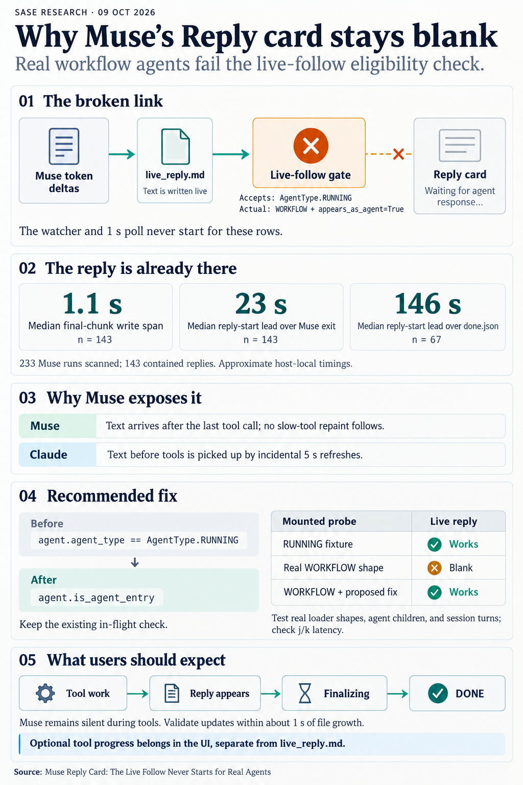

# Muse Reply Card: The Live Follow Never Starts for Real Agents

> **Research query:** Why does no text appear in a Muse sase agent's "Reply" card until the agent completes? Research Muse reply streaming to help figure out how to fix this.



## Bottom line

**The sase-1fu live-reply follow is dead code for almost every real agent. Muse is
simply the provider where nothing else hides that.** None of the four researchers found
this.

- **[The gate](#the-gate-step-by-step).** `is_live_reply_agent()` only accepts rows with
  `agent_type == AgentType.RUNNING`.
- **Real agents fail it.** The TUI loader builds every workflow-wrapped `ace(run)`
  agent as `AgentType.WORKFLOW` with `appears_as_agent=True`. That covers both the
  anonymous `tmp_…` workflow and the `gh` VCS workflow.
- **What follows from that:**
  - The Reply body is never wrapped in a live-reply region.
  - `configure_live_reply_follow()` returns early.
  - Neither the watcher route nor the 1 s poll backstop has a source to follow.
- **Why the old tests missed it.** The mounted regression test builds a RUNNING agent
  by hand, so it passes.
- **Why the card stays blank.** The Reply card repaints only through incidental full
  re-renders:
  - The 5 s slow-tool tick, which runs only while a tool call is pending.
  - Roster-relevant marker writes.
  - Selection changes.
- **[Why Muse and not Claude](#what-muse-actually-emits---agreed-context).** Claude writes text *before* its tool calls, so the
  slow-tool tick happens to repaint it. Muse writes its reply only *after* its last
  tool call (the `/sase_final` Bash call). Nothing is pending then, so nothing repaints
  until the step-completion or `done.json` markers land. That is exactly "no text until
  the agent completes."

**Evidence that settles it:**

| Check | Result |
| --- | --- |
| Real loader, running `research.0r.final` row | `type=WORKFLOW`, `appears_as_agent=True`, `status=RUNNING` → `is_live_reply_agent=False`. Its workflow child (`step_type=agent`) is also `False`. |
| Every loaded Muse row since 10-05 | All `AgentType.WORKFLOW`; none `RUNNING` |
| Mounted probe, RUNNING-shaped agent (what the test builds) | Follow configured; reply painted while running |
| Mounted probe, WORKFLOW + `appears_as_agent` (what production loads) | **Follow not configured; nothing painted** (watcher event + forced poll, 4 s wait) |
| Same, with the gate changed to `agent.is_agent_entry` | Follow configured; reply painted while running |
| Reply on disk before completion (143 non-empty Muse runs since 10-05) | Last reply chunk starts p50 **23 s** before Muse exits and p50 **146 s** before `done.json` |

**Fix:** a one-line predicate change plus a regression test that uses the production row
shape (see [Recommended Fix](#recommended-fix)).

**What the fix will not change:** Muse sends no text during tool phases. All four
reports agree on this, and so does the prior study. After the fix, the card will still
say "Waiting for agent response..." during tool work. The reply will then appear about
3 s after `/sase_final`, which is tens of seconds to minutes before DONE. If you want
progress visible during tool work, that is a separate presentation feature ([Step 2](#show-activity-during-the-silent-tool-phase)).

## The Gate Step by Step

`src/sase/ace/tui/widgets/prompt_panel/_live_reply_follow.py:210`:

```python
def is_live_reply_agent(agent: Agent) -> bool:
    if agent.agent_type != AgentType.RUNNING or not agent_row_is_in_flight(agent):
        return False
    return not (agent.is_workflow_child and agent.step_type in ("bash", "python"))
```

This is what happens for a real running agent (`WORKFLOW`, `appears_as_agent=True`,
`status=RUNNING`):

1. `_update_display_impl` takes the "AGENT REPLY section for running agents" branch
   (`_agent_display_render.py:593`).
   - That branch **does** read `live_reply.md`, so any full re-render shows the
     current text.
   - At line 625, `is_live_reply_agent(agent)` is `False`, so the parts are added
     **without** a `live_reply_region` wrapper.
2. `AgentPromptPanel.update_display` (`prompt_panel/__init__.py:156`) then calls
   `configure_live_reply_follow`.
   - `_selected_live_reply_agent` returns `None`, so the method returns at line 294.
   - The region check at that line would fail anyway.
3. `_live_reply_source` therefore stays `None`, which disables both refresh paths:
   - `live_reply_path_matches()` is `False`, so the watcher route
     (`event_refresh/_watcher.py:122`) drops reply writes.
   - `maybe_probe_live_reply_drift()` (called from `_event_countdown.py:53`) returns
     immediately.
4. The only repaints left are incidental. The slow-tool tick (`__init__.py:36`, 5 s)
   calls `refresh_slow_tool_metadata_from_cache` → `_update_display_impl`
   (`_agent_display.py:289–295`), but only while
   `slow_tool_sources_have_pending(agent)` is true.

That leaves the TUI in the same state the 10-03 study called "Defect 1", for exactly
the agents users watch.

The predicate the gate should have used already exists. `Agent.is_agent_entry`
(`models/agent.py:566`) accepts three kinds of row:

- `RUNNING` rows;
- `WORKFLOW` rows with `appears_as_agent`;
- workflow children with `step_type == "agent"`.

It excludes clan containers, monitors, gates, and named procs.

**When this started.** Muse runs were already workflow-wrapped on 10-01: 15 of 50 that
day, and 46 of 54 on 10-09. The follow landed on 10-03 (`2307212bcd`). So it has never
worked for these agents; this is not a later regression. The other Muse runs, mostly
epic phase workers such as `bob-cli-5s.N`, have no `workflow_state.json`. They probably
load as `RUNNING` and may follow correctly; I did not verify that.

**Not a stale process.** The running TUI (`python -m sase tui`, editable install)
started at 15:43 UTC on 10-09, after every sase-1fu commit.

## The Reply Sits on Disk Long Before Completion

My scan covered every `runtime=muse` run directory since 10-05: 233 directories, 143
with a non-empty `live_reply.md`. Mtimes and ISO timestamps are host-local, so these
are approximate.

| Interval | n | p10 | p50 | p90 |
| --- | --- | --- | --- | --- |
| `final_submission.json` → last reply chunk starts | 130 | 1.8 s | 2.7 s | 14.1 s |
| Last chunk generation span (start → last write) | 143 | — | 1.1 s | 3.8 s |
| Last chunk start → Muse exits (`run_metadata.json` mtime) | 143 | 11 s | **23 s** | 62 s |
| Last chunk start → `done.json` | 67 | 71 s | **146 s** | 546 s |

**Worked example: the `research.0r.mus` run from this dispatch** (UTC):

| Time | Event |
| --- | --- |
| 21:42:14.8 | `/sase_final` accepted |
| 21:42:16.8 | Reply chunk starts |
| 21:42:18.2 | Reply fully written |
| ~21:42:30 | Muse exits |
| 21:42:39–21:44:25 | Host commit and finalizers run |
| 21:44:26 / :28 | `prompt_step_main.json` and `workflow_state.json` written |
| 21:45:03 | `done.json` written |

The finished reply was on disk for about 2 min 45 s while the card showed the
placeholder. The first roster-relevant marker write after the reply lands is the
step-completion write, so a full re-render picks the text up only at what the user sees
as "completion."

So a working follow would show Muse's reply for the whole post-`/sase_final` window.
Without it, the timing of the first marker write decides when the text appears.

## What Muse Actually Emits - Agreed Context

These points hold regardless of the bug above:

- **The CLI streams token deltas over a PIPE.** Live probes on `1.4.4-R5419.1` saw 141
  deltas (cdx), 63 (grk), and 46 (mus). PTY, `stdbuf`, and pipe buffering are ruled
  out.
- **SASE's parser writes them live.** cdx observed 74 growth observations of
  `live_reply.md` before process exit. mus saw the file grow every 0.5 s. Each delta
  goes through `append_stream_delta` and is flushed unconditionally.
- **There is no text during tool phases.** The evidence comes from grk's 344-dir
  corpus, mus's tool probes, and the prior study (0 of 109,416 tool-call turns carried
  text).
  - My scan found 46 reply chunks that started more than 30 s before a run's last
    tool. I inspected them, and they are the **final replies of earlier provider
    invocations in the same run**: declaration or conflict-repair re-prompts such as
    "Declaration accepted…" or "Conflict repair complete…". They are not narration
    between tools.
- **Handoff turns legitimately end with no reply.** grk found 109 of 344 runs with an
  empty `live_reply.md`, 105 of them `interrupted` (plan, monitor, or handoff).
- **Checked-in fixtures look one-shot only because the answers are one word.** The
  `R708.1`/`R3401.1` fixtures each contain a single `run.output.delta` (`bravo`, `DONE`).
  That reflects short answers, not a CLI that refuses to stream (grk). mus suspected an
  older CLI; current builds stream long answers.

## Recommended Fix

### Fix the gate

**Step 1: Fix the gate (this is the bug)**

In `src/sase/ace/tui/widgets/prompt_panel/_live_reply_follow.py`:

```python
def is_live_reply_agent(agent: Agent) -> bool:
    if not agent.is_agent_entry or not agent_row_is_in_flight(agent):
        return False
    return not (agent.is_workflow_child and agent.step_type in ("bash", "python"))
```

The three render call sites import this function, so all of them pick up the change:

- `_agent_display_render.py:500`
- `_agent_display_render.py:625`
- `_agent_display_agent_session_render.py:211`

`_selected_live_reply_agent` then resolves the selected `appears_as_agent` row to
itself, and session containers to their current turn.

This is presentation-only TUI state, so it stays in this repo; no `sase_core` change is
needed.

**Tests:**

- Parametrize `tests/ace/tui/test_live_reply_follow_mounted.py` (or add a sibling) over
  these row shapes:
  - `RUNNING`;
  - `WORKFLOW` + `appears_as_agent`;
  - workflow child `step_type="agent"`;
  - a session-container current turn.
- Assert that `panel._live_reply_source is not None` and that the reply paints before
  terminal.
- Better: build the row with the **real loader** from an on-disk fixture
  (`agent_meta.json` + `workflow_state.json`), so a future change to the row shape
  fails the test.
- Add a unit table test for `is_live_reply_agent` that covers each shape, plus the
  exclusions: clan container, monitor, gate, and bash/python step.

My temporary probe (since deleted) followed the existing mounted test's pattern and
showed the gate change is sufficient.

**Perf and rollout:**

- The follow will now run for every selected workflow-backed agent, Claude included,
  not just the rare RUNNING rows. Its design already fits the `tui_perf` rules: 0.3 s
  throttle, off-thread collection, region-only replacement, and no roster dirtying.
  Still, check j/k latency with `SASE_TUI_PERF=1` while a streaming agent is selected.
- This turns on user-visible behavior that was dormant. Check `sase_flags.md` to decide
  whether a short-lived default-on rollback flag is warranted.

**Manual check after restarting the TUI:**

1. Select a running Muse agent.
2. Run `tail -f <artifacts>/live_reply.md`.
3. The Reply card should update within about 1 s of the file growing after
   `/sase_final`, well before the row turns DONE.

### Show activity during the silent tool phase

**Step 2 (optional UX): show activity during Muse's silent tool phase**

grk's shape is the right one: when the live region is empty and `tool_calls.jsonl` has
entries, render a dim status line in the placeholder. It would show the last tool name,
running/completed state, elapsed time, and optionally the latest
`task.lifecycle.status` message. It reads the slow-tool sources the TUI already caches.

**Do not write progress lines into `live_reply.md`**, which is what mus's Fix 1 and
gem's Solution 1 propose. Three reasons:

- For running and DONE agents, the TUI renders `get_timestamped_reply_chunks()` before
  any response file (`_agent_display_render.py:534ff`).
- Muse runs have no `response.md` (0 of 344, per grk). Progress lines would therefore
  become permanent reply content with extra timestamp dividers.
- It would break the contract that `live_reply.md` holds assistant text only.

The prior study's Phase 4 is another option: reasoning summaries from the Muse session
log as a separate progress surface.

### Lower priority hardening

**Step 3 (hardening, lower priority)**

- **Log why the follow was rejected.** Record a bounded trace reason whenever
  `configure_live_reply_follow` returns early: no target, no region, hint mode, pinned,
  or context mismatch. cdx proposed this. A one-line "no target: agent_type=WORKFLOW"
  would have surfaced this bug immediately.
- **Bounded-prefix snapshots (cdx).** Accept the append-only prefix that was actually
  read instead of rejecting any change made during the read. This matters more once
  [Step 1](#fix-the-gate) makes the follow run on long Claude and Muse streams. cdx's reproduction (0
  of 10 snapshots accepted with a 40 ms injected read delay) shows the mechanism. Real
  reads are usually fast enough that a retry every 0.3 s eventually wins.
- **Mirror terminal text into `live_reply.md` when no deltas arrived (grk).** This
  covers delta-less terminals and schema drift, where the card would otherwise stay
  empty while running and the solo DONE view would be empty too.
- **Refresh the fixtures.** Re-capture a `1.4.4` long-answer fixture with many deltas,
  so tests stop implying Muse emits a single `DONE`.

### Not recommended

| Option | Why not |
| --- | --- |
| PTY or `stdbuf` wrappers | Transport is proven fine. |
| Re-draining `stream_json_lines` | Already fixed in `392983091d`. |
| Migrating to MSP (`muse serve`) | Doesn't touch the TUI gate. |
| Changing Muse event parsing | The parser already writes deltas live. |
| Prompting Muse to narrate before tools | Ignored by the model: gem's probe 3 and cld's probe in the prior study. |
| Raising global refresh frequency | Violates `tui_perf` rules and works around the bug instead of fixing it. |

## Where the Four Reports Stand

| Report | Main claim | Verdict |
| --- | --- | --- |
| **cdx** | The snapshot collector can starve: it rejects every snapshot while writes continue | **The mechanism is real, but it is not the cause.** It only matters *while* bytes are being written. The final reply finishes writing in p50 1.1 s (p90 3.8 s), and the collector succeeds once writes stop. A blank card lasting 23–146 s needs a different cause. Keep it as hardening ([Step 3](#lower-priority-hardening)). cdx's advice to measure "setup rejection reasons" pointed in the right direction. |
| **grk** | Muse is silent until after its tools. The reply streams for 1–2 s and "races `done.json` and the DONE rebuild" | **The first half is correct and has good corpus evidence. The race is refuted:** the reply sits on disk for minutes before `done.json` ([The Reply Sits on Disk Long Before Completion](#the-reply-sits-on-disk-long-before-completion)). grk's tool-aware placeholder is the right shape for Step 2. |
| **mus** | Same root cause as grk. "No Muse-specific gate" in the TUI, so the display path is cleared | **Partly right.** There is no *Muse-specific* gate. But the provider-agnostic `AgentType.RUNNING` gate disables the follow for every workflow-backed agent. Muse is just where it shows. The live CLI probes are good evidence that transport works. |
| **gem** | Same as mus. Recommends writing tool progress into `live_reply.md` | **Probe transcripts look illustrative, not captured.** For example, `"model_id": "meta/gemini-2.5-flash"` and compact sequence numbers; the "3-minute session" in Probe 4 has no source. Do not cite them. The claim that the final artifacts stay pristine is **wrong for the TUI**: Muse has no `response.md`, and the DONE view renders `live_reply.md` chunks first ([Recommended Fix](#recommended-fix)). |

**Shared blind spot.** All four took the mounted test as proof that the follow works.
None of them checked which `AgentType` real agents load as. cdx's demonstrated failure
needs continuous writes, and grk's race needs completion within about a second. The
artifact timing rules out both as the main cause.

### Disagreements Resolved

| Question | Positions | Resolution |
| --- | --- | --- |
| Is the TUI display path cleared? | mus, gem: yes. grk: mostly. cdx: unproven | **No.** The `AgentType.RUNNING` gate disables the follow for production rows ([The Gate Step by Step](#the-gate-step-by-step), mounted probe). |
| Does the reply race `done.json`? | grk: yes, a 1–2 s window | **No.** p50 146 s from reply start to `done.json`; p50 23 s to Muse exit ([The Reply Sits on Disk Long Before Completion](#the-reply-sits-on-disk-long-before-completion)). |
| Is snapshot starvation the cause? | cdx: candidate | **No for this symptom.** Writes stop within seconds, and starvation cannot last minutes. Kept as hardening. |
| Is the fix to project tool events into `live_reply.md`? | mus, gem: yes. grk: no, use a TUI placeholder | **TUI placeholder,** and only as an optional Step 2. Writing to the file pollutes the DONE view. Neither option fixes the reported bug. |
| Does Muse emit mid-run text? | all: no | **Confirmed.** Apparent mid-run chunks are earlier invocations' final replies ([What Muse Actually Emits](#what-muse-actually-emits---agreed-context)). |
| What caused the double `byte_offset: 0` rows in the `research.0r.mus` run? | grk: a "truncated retry" | **Probably the researcher's own probe.** No `attempts/` directory exists, and no product code truncates `live_reply.md` outside `snapshot_attempt`. mus reports running SASE's parser in-process with a misdirected `SASE_ARTIFACTS_DIR`, which would write into its own run's reply. It was 1 of 47 multi-chunk runs. Lesson for future probes: unset `SASE_ARTIFACTS_DIR` before calling the parser from inside an agent. |

## Open Questions

- **Do RUNNING-typed Muse agents follow correctly?** Epic phase workers without
  `workflow_state.json` probably load as `RUNNING` rows, possibly inside clan or
  session containers. Spot-check one after [Step 1](#fix-the-gate).
- **Should the post-reply window be labelled?** After Step 1, a Muse reply will sit
  visibly "complete" for 20 s to minutes while the row still says RUNNING (reminder
  child runs, then host finalizers). Labelling it "finalizing…" is cosmetic, but may
  head off "is it stuck?" reports.

## Sources

_Consolidated report · 2026-10-09 · sase `master` @ `7c01ba47f7` · Muse Code
`1.4.4-R5419.1`_

Sources: four independent reports in this directory (`__cdx`, `__grk`, `__mus`, `__gem`),
the prior consolidated study
[`muse_live_reply_streaming`](../muse_live_reply_streaming/muse_live_reply_streaming__final.md)
(2026-10-03, which led to epic sase-1fu), and my own verification. I loaded live
agent rows through the real TUI loader. I ran a mounted Textual reproduction and
scanned 233 Muse run directories.

**Code at `7c01ba47f7`:**

- `src/sase/ace/tui/widgets/prompt_panel/`: `_live_reply_follow.py`,
  `_agent_display_render.py`, `_agent_display_agent_session_render.py`, `__init__.py`,
  `_agent_display.py`
- `src/sase/ace/tui/models/agent.py` (`is_agent_entry`)
- `src/sase/ace/tui/models/agent_session_members.py`
- `src/sase/ace/tui/widgets/_agent_detail_deck_source.py`,
  `src/sase/ace/tui/widgets/_agent_detail_display.py`
- `src/sase/ace/tui/actions/_event_countdown.py`,
  `src/sase/ace/tui/actions/event_refresh/_watcher.py`
- `src/sase/agent/status_buckets.py`
- `src/sase/llm_provider/_subprocess_artifacts.py`, `_subprocess_muse.py`
- `src/sase/axe/run_agent_exec_attempts.py`

**Tests and fixtures:**

- `tests/ace/tui/test_live_reply_follow_mounted.py` (builds `AgentType.RUNNING`)
- `tests/llm_provider/fixtures/muse_exec_*.jsonl`

**Live checks on 2026-10-09:**

- `load_all_agents()` row classification
- Temporary three-variant mounted probe (deleted)
- Artifact timing scan of 233 Muse run dirs under
  `~/.sase/projects/*/artifacts/ace-run/202610/`
- Process start time of the running TUI

**Reports:** the four peer reports in this directory, and the prior
`202610/muse_live_reply_streaming/muse_live_reply_streaming__final.md`.
