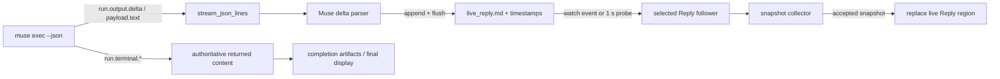

# Muse Reply streaming: live probes and a snapshot starvation failure

Researcher: **cdx**  
Date: **2026-10-09**  
Scope: independent investigation of the SASE Muse agent Reply card remaining empty until completion. No peer report or peer transcript was consulted. This report proposes diagnostic and implementation work; it does not apply a product fix.

## Findings and recommendation

**The installed Muse CLI and SASE's current Muse parser both stream successfully. A reproducible failure exists in the Reply follower: it can discard every snapshot during continuous writes and accept its first snapshot only after writing stops.** That failure matches the reported symptom, but I have not demonstrated that it is the cause in Bryan's actual running TUI.

Start by observing whether the affected agent's `live_reply.md` grows before the agent completes. If it grows, concentrate on the TUI follower and its imported revision, selected source, and snapshot rejection conditions. If it stays empty, investigate that particular invocation's provider output and artifact environment. Avoid changing Muse event names or switching transports based only on the symptom: a live Meta-model probe produced the exact events SASE expects.

My preferred code improvement is a **bounded read of an append-only prefix**, so a writer appending more text cannot invalidate readable earlier text. Add a continuous-write mounted regression test with controlled read latency. The existing mounted regression pauses the producer between batches, which gives the collector the quiet interval it requires.

## Evidence and limits

The SASE checkout inspected was `7c6039f1e68483cbc1a206e7745a32830c4429db`. The linked sase-core checkout was `6df3bed385c2fcfc3a807edaccc4ad19b673e371`; SASE's CI pin was `844b6c1d5cf82cf7a909c3164f2b4a4faca2fcaf`. No code in either repository was changed.

The installed executable was `/home/bryan/.local/bin/muse`, reporting **Muse Code 1.4.4 (1.4.4-R5419.1)**. The official SDK mirror opened through `sase repo open gh:meta-models/muse-code-sdk` was at `8b77bffea9a482b59177a174777f3c1c7d882fd1`; its `publish-anchor.json` also identified host version 1.4.4.

| Experiment | Observed result | What it establishes |
| --- | --- | --- |
| Credential-free `muse exec --json --provider echo` | One `run.output.delta`, followed by `run.terminal.completed`; exit 0 | Current CLI still emits the expected envelope vocabulary; echo alone cannot prove incremental model output |
| Real Meta-model call, `muse-spark-1.3`, minimal effort, prose answer | **141 deltas**; first at **1.640 s**, last at **4.718 s**, terminal at **4.796 s**; 2,143 terminal characters; exit 0 | The installed Meta provider emits text over time before completion |
| Real Meta-model call read by `stream_and_parse_muse_json_output(..., suppress_output=True)` | First observed nonempty `live_reply.md` at **1.809 s**; **74 nonempty growth observations while the subprocess was alive**; completion at **9.227 s**; live and returned text both 4,677 characters; one timestamp; exit 0 | SASE's actual parser flushes readable live artifacts before process exit, including with console output suppressed |
| Existing mounted Reply-card and follower tests | **7 passed in 14.28 s** | Current source works for its tested selected-agent, paused-producer scenarios |
| Collector with writer appending every 5 ms and an injected 40 ms read delay | **0 accepted / 10 rejected** during writes; accepted immediately after writes stopped | Current collector has a deterministic starvation failure under these conditions |

All timing is receiver-side monotonic elapsed time. Live model probes used small isolated temporary directories, no foreign personal context, disabled reminders, and disabled web tools. The prose probes disabled shell and writes and used `--no-session-log`. They therefore do not recreate a production agent's full trusted workspace, reminders, retries, tool sequence, selected-session state, or concurrent host load.

An additional untrusted-workspace tool/commentary probe produced a textless terminal event and no tool execution. It did not establish commentary behavior and is excluded from the successful streaming evidence. Initial exploratory invocations with effort `none` were rejected as CLI usage errors; the successful model probes used `minimal`.

Most importantly, I did not capture the affected production TUI's imported revision, follower state, or artifact-growth timeline. The demonstrated failure is a candidate with a mechanism and reproduction, not a diagnosis of that specific process.

## How the reply reaches the card



The relevant current-source behavior is:

- `MuseProvider` invokes `muse exec --json`, names the workspace/model/session, and uses stdout/stderr pipes. `MUSE_NO_AUTO_UPDATE=1` keeps the invocation stable. [Provider invocation and subprocess](https://github.com/sase-org/sase/blob/7c6039f1e68483cbc1a206e7745a32830c4429db/src/sase/llm_provider/muse_provider.py#L323).
- The shared stream reader uses nonblocking **descriptor byte reads**, incremental UTF-8 decoding, complete JSONL record dispatch, and bounded work per loop. It does not intentionally wait for process exit or use a buffered `readline()` loop for this parser. [Stream reader](https://github.com/sase-org/sase/blob/7c6039f1e68483cbc1a206e7745a32830c4429db/src/sase/llm_provider/_subprocess_stream.py#L151).
- `run.output.delta` calls `_stream_output_delta`; its `payload.text` is appended to the live file and flushed. Deltas belonging to one run stream form one timestamped chunk. `run.terminal.*` supplies authoritative returned text, without appending that full text on top of the deltas. [Muse parser](https://github.com/sase-org/sase/blob/7c6039f1e68483cbc1a206e7745a32830c4429db/src/sase/llm_provider/_subprocess_muse.py#L252), [append/flush helper](https://github.com/sase-org/sase/blob/7c6039f1e68483cbc1a206e7745a32830c4429db/src/sase/llm_provider/_subprocess_artifacts.py#L136).
- `SASE_ARTIFACTS_DIR` determines the files the parser opens. Without it, the parser can return a correct final answer without creating live files. The TUI independently resolves the selected agent's artifact directory. These two paths must agree. [Artifact opening](https://github.com/sase-org/sase/blob/7c6039f1e68483cbc1a206e7745a32830c4429db/src/sase/llm_provider/_subprocess_artifacts.py#L33), [TUI resolution](https://github.com/sase-org/sase/blob/7c6039f1e68483cbc1a206e7745a32830c4429db/src/sase/ace/tui/models/artifact_files.py#L34).
- The current Reply follower handles watch events and a one-second stat backstop, throttling collection to roughly 0.3 seconds. It replaces the current live region and publishes through the Main document sink. It does not require an agent-list rebuild. [Follower](https://github.com/sase-org/sase/blob/7c6039f1e68483cbc1a206e7745a32830c4429db/src/sase/ace/tui/widgets/prompt_panel/_live_reply_follow.py#L253), [document publication](https://github.com/sase-org/sase/blob/7c6039f1e68483cbc1a206e7745a32830c4429db/src/sase/ace/tui/widgets/prompt_panel/__init__.py#L172).

The console's Rich `FileProxy` deliberately does not flush every fragment, to avoid inserting terminal newlines mid-word. **That does not delay `live_reply.md`: the file flush is separate and unconditional when the file is open.** A console-buffering change is therefore a poor first fix for this card symptom.

## Concrete failure: continuous writes prevent a stable snapshot

`_collect_live_reply_snapshot()` records both file signatures, reads the timestamped chunks and the tail-cache text, records both signatures again, and raises `_ReplyChangedDuringRead` if **either signature differs**. Each signature contains modification time and size. [Collector, lines 159–179](https://github.com/sase-org/sase/blob/7c6039f1e68483cbc1a206e7745a32830c4429db/src/sase/ace/tui/widgets/prompt_panel/_live_reply_follow.py#L159).

The controller catches that exception and schedules another attempt. It never publishes the rejected readable prefix. A writer that changes the file during each collection attempt can therefore keep the card at its initial placeholder until the stream ends. [Retry path](https://github.com/sase-org/sase/blob/7c6039f1e68483cbc1a206e7745a32830c4429db/src/sase/ace/tui/widgets/prompt_panel/_live_reply_follow.py#L497).

This is particularly relevant to Muse's many small deltas: the live receiver probe observed intervals frequently around 22 ms. A collector delayed by scheduling, storage, locks, or a larger reply can overlap an append even though readable text is available. `read_reply_chunks()` also reads the entire reply file whenever its joint signature changes; the collector then asks for live text as well. The existing code does not measure how often a candidate is discarded. [Chunk/cache reader](https://github.com/sase-org/sase/blob/7c6039f1e68483cbc1a206e7745a32830c4429db/src/sase/agent/artifact_files_cache.py#L221).

The reproduction below deliberately injects latency. That proves the failure mechanism; it does not prove that real reads on this host take 40 ms.

### Reproduction against unchanged source

Run from a SASE checkout with its development environment:

```bash
.venv/bin/python - <<'PYPROBE'
import json, tempfile, threading, time
from pathlib import Path
from unittest.mock import patch
from sase.agent.artifact_files_cache import get_global_cache
from sase.ace.tui.widgets.prompt_panel._live_reply_follow import (
    _LiveReplySource, _collect_live_reply_snapshot, _ReplyChangedDuringRead,
)

with tempfile.TemporaryDirectory(dir='.') as folder:
    root = Path(folder).resolve()
    reply = root / 'live_reply.md'
    timestamps = root / 'live_reply_timestamps.jsonl'
    reply.write_text('first ')
    timestamps.write_text(json.dumps({
        'byte_offset': 0, 'timestamp': '2026-10-09T00:00:00+00:00',
    }) + '\n')
    source = _LiveReplySource(
        (), (), 1, 'merged', None, str(reply), str(timestamps),
    )
    stop = threading.Event()

    def write():
        with reply.open('a') as stream:
            while not stop.is_set():
                stream.write('delta ')
                stream.flush()
                stop.wait(0.005)

    writer = threading.Thread(target=write)
    writer.start()
    cache = get_global_cache()
    original = cache.read_reply_chunks

    def delayed(*args):
        result = original(*args)
        time.sleep(0.04)
        return result

    accepted = rejected = 0
    with patch.object(cache, 'read_reply_chunks', side_effect=delayed):
        try:
            for _ in range(10):
                try:
                    _collect_live_reply_snapshot(source)
                    accepted += 1
                except _ReplyChangedDuringRead:
                    rejected += 1
        finally:
            stop.set()
            writer.join()
        after = _collect_live_reply_snapshot(source)
    print(accepted, rejected, bool(after.live_text))
PYPROBE
```

Observed output: `0 10 True`. The file contained 480 bytes after writing stopped. The experiment uses the real collector and cache; it does not mount the TUI or alter production files.

### Suggested correction

Build a snapshot of a **known prefix**, rather than requiring the entire append-only file to remain unchanged:

1. Open the reply and timestamp files and capture file identity and bounded lengths.
2. Read no more than those lengths. Parse complete timestamp records only; use offsets that fall within the consumed reply prefix.
3. Accept growth beyond the captured reply length. Continue rejecting replacement, truncation, or invalidated attempt/source identity.
4. Associate the applied snapshot with the prefix actually consumed, so a subsequent stat probe still detects bytes appended meanwhile. Do not label an old prefix with a newer file signature and accidentally skip its suffix.
5. Preserve UTF-8 boundaries and record cache offsets using bytes actually consumed. Do not read arbitrarily past the captured bound while storing an earlier offset.
6. Keep UI application on the event loop, file work off-thread, the existing throttle, and all selection/generation checks.

Simply deleting the before/after check is less defensible: retries rotate/truncate these files, timestamp offsets span multiple chunks, and source changes need explicit protection. A bounded prefix provides a meaningful consistency contract without asking a live writer to stop.

Purely presentation controller changes can stay in SASE's Textual code. Shared file snapshot/offset normalization needed by other frontends should be implemented in `sase_core` with a binding and corresponding SASE revision-pin update, following the repository's Rust boundary.

## Other conditions to rule out in the affected TUI

**Imported code can be stale.** The selected-reply follower was added in `2307212bcd` on October 3; mounted Muse coverage arrived in `7b39db7b67` on October 4; the empty-placeholder correction is `e1fa79db96`, also October 4. An editable checkout advancing on disk does not replace modules already imported by a long-lived TUI. The existing Update panel/restart indication and `stale_running_code.py` were designed for this condition. A clean restart is a useful diagnostic before assuming the current source is executing. [Stale-code detector](https://github.com/sase-org/sase/blob/7c6039f1e68483cbc1a206e7745a32830c4429db/src/sase/ace/tui/stale_running_code.py#L61).

**Follower setup can return without registering a source.** `configure_live_reply_follow()` requires the Agents tab, the canonical `agent-prompt-panel` source widget, an unpinned attempt, a normal non-hint document, a current render context, matching selection, an in-flight concrete agent, and a matching live region already in the document. If `_build_live_reply_source()` finds no artifact directory, setup returns with no source and the polling backstop has nothing to follow. Record the rejection reason instead of inferring it from the card. [Setup predicates](https://github.com/sase-org/sase/blob/7c6039f1e68483cbc1a206e7745a32830c4429db/src/sase/ace/tui/widgets/prompt_panel/_live_reply_follow.py#L273).

**Activity and identity gates can prevent application.** The follower intentionally defers while navigation is active or prompt input is active. It also revalidates selection, generation, attempt mode, current turn, and presence of the matching region after asynchronous work. A stuck gate or continually changing render generation could reject every candidate. A session container must resolve the current concrete turn's artifact directory, rather than an older turn. These are hypotheses to measure in the affected selection, not demonstrated failures. [Application gates](https://github.com/sase-org/sase/blob/7c6039f1e68483cbc1a206e7745a32830c4429db/src/sase/ace/tui/widgets/prompt_panel/_live_reply_follow.py#L519).

**Missing watcher events alone should be recoverable.** Current source also probes the selected files once per second. Investigate missing source setup, inactive probing, or rejected collection if watch events are absent; globally increasing agent refresh frequency is unlikely to fix those conditions.

**Final-answer success does not prove live-file success.** `_capture_run_terminal()` records returned text without requiring any delta to have arrived. A provider invocation with missing live artifacts, missing deltas, or an unrecognized event can still produce a final answer. The parser ignores unrelated payload types and does not preserve a full raw stdout transcript. Capture per-invocation event counts and timestamps if the live file is empty.

## Diagnostic sequence for a production reproduction

Use one selected affected agent and one exact artifact directory; do not infer the directory from a session container's older turn.

| Observation before completion | Next action |
| --- | --- |
| `live_reply.md` is absent or remains zero bytes | Verify the runner's `SASE_ARTIFACTS_DIR`; capture/count actual `run.output.delta` events and their first/last arrival times |
| Raw Muse deltas arrive but live file is empty | Compare parser/runtime revision, event shape, opened file path, and invocation cycle |
| Live file grows while Reply stays empty | Inspect follower source, import revision, setup rejection, activity gates, snapshot rejection count, and successful apply count |
| Snapshot collection succeeds but the displayed card stays empty | Inspect region replacement count, selection/generation validation, Main document sink publication, and visible deck |
| Reselecting the same active agent reveals already-written text | Strongly favors a follower/subscription/application problem; record which setup/apply path changes |
| The file itself receives text only at the end | Different case from a stale card: assess the actual model/effort/tool invocation and when it first emits public answer text |

Add bounded trace fields rather than dumping full prompts/replies: selected and target identities, resolved paths, generation, setup/gate reason, byte count, snapshot start/end duration, change-during-read count, replacement count, applied-prefix length, and first successful publication time. This distinguishes an idle writer from a reader that is discarding available text.

## Verification to add and existing checks

Executed successfully:

```bash
.venv/bin/pytest -q \
  tests/ace/tui/test_live_reply_follow_mounted.py \
  tests/ace/tui/widgets/test_live_reply_follow.py \
  tests/ace/tui/widgets/test_agent_reply_muse_chunks.py
```

Result: **7 passed in 14.28 s**. No screenshot goldens were changed.

The existing mounted test uses a fake JSONL subprocess, sends a batch, then waits on filesystem gates before the next batch and terminal. It verifies watcher routing, polling fallback, one divider, no duplicate terminal text, and updates before completion. That is valuable coverage but leaves the continuous-write case untested. [Mounted regression](https://github.com/sase-org/sase/blob/7c6039f1e68483cbc1a206e7745a32830c4429db/tests/ace/tui/test_live_reply_follow_mounted.py#L154).

For the fix, add a deterministic continuous emitter and gate terminal completion separately. Ensure the Reply card publishes **at least two increasing prefixes while the writer remains active**, even when collection takes longer than an inter-delta interval. Cover missing watcher notifications, files created after selection, source changes during a read, pinned/hint modes, session current-turn selection, truncation between attempts, and split UTF-8 boundaries. Use synchronization barriers where possible, so assertions do not depend on a lucky sleep interval.

## What the official Muse SDK changes, and what it does not

The official MSP cookbook exposes streaming through `item/delta`, keyed by item identity, and final authoritative content through `item/completed`; turn completion is a separate event. Its example is backed by a canned transcript. This is a different transport from `muse exec --json`, whose live output still used `run.output.delta` in the installed-version probes. Migrating to `muse serve` may be appropriate for richer session integration, but it is a larger change and cannot repair a TUI that rejects every readable snapshot. [Official streaming cookbook](https://meta-models.github.io/muse-code-sdk/next/cookbook/stream-a-turns-answer/), [official delta schema](https://meta-models.github.io/muse-code-sdk/next/generated/msp/types/itemdeltaparams/).

The SDK mirror is public primary material and identifies itself as generated/mirrored developer-preview content. Its docs inform an alternative architecture; the measured installed CLI and locally read SASE implementation are the primary evidence for the present failure. [SDK mirror and provenance](https://github.com/meta-models/muse-code-sdk/tree/8b77bffea9a482b59177a174777f3c1c7d882fd1).
