# Harness Engineering in Practice: Critiquing SASE Against OpenAI's Agent-First Systems Paradigm

**Research question:** In February 2026, Ryan Lopopolo published *"Harness engineering: leveraging Codex in an agent-first world"*, detailing OpenAI's five-month experiment building a ~1M-LOC production software product with zero lines of manually written code. The essay defines "harness engineering" as the discipline of designing the environment—the constraints, feedback loops, documentation, and tooling—that guides an AI agent to produce reliable, high-quality software. How does SASE measure up against the standards, best practices, and hard-earned learnings of OpenAI's harness engineering framework? Where does SASE excel or pioneer complementary paradigms, where does it run into structural friction or architectural bottlenecks, and what actionable improvements can SASE adopt to reach the next order of magnitude in autonomous agent velocity?

**Scope:** `sase` repository at workspace `#23` (commit tree `8b0c65476` / master). Analyzed components: SASE Core memory and memory webs (`sase/memory/`), `AGENTS.md` and provider shims (`GEMINI.md`, `CLAUDE.md`, `OPENCODE.md`), the `docs/` architectural corpus (covering architecture, memory, beads, axe scheduler, ace TUI, telemetry, tool control plane, mentors, and completion), the Symvision linter rules, TUI screenshot tooling, and the foundational decision records (`decisions:single-turn-agents`, `decisions:host-owned-completion`, `decisions:gates-never-block`, `decisions:check-full-is-explicit`, `decisions:triage-annotates-does-not-change-exit-codes`). Evaluated against the primary text of Lopopolo (2026) and the accompanying `lopopolo/harness-engineering` field guide.

---

## 1. Executive Summary

OpenAI's *Harness Engineering* essay outlines a fundamental transformation in software engineering: when AI coding agents generate all code, human engineers no longer write implementations. Instead, their sole function is to **design environments, specify intent, and build feedback loops** that keep agents productive, constrained, and aligned with organizational quality standards. The primary scarce resource in this paradigm is not compute or code volume, but **human time and attention**.

SASE (Structured Agentic Software Engineering) is one of the most sophisticated real-world realizations of an agentic operating system in existence today. A rigorous side-by-side critique reveals that SASE and OpenAI's harness engineering share profound foundational convictions, yet arrive at diametrically opposed operating models on key architectural axes:

| Architectural Dimension | OpenAI Harness Engineering | SASE Operating Model | Strategic Assessment |
| :--- | :--- | :--- | :--- |
| **Philosophical North Star** | "Humans steer. Agents execute." 0 lines of manual code; maximize velocity via high-throughput agent loops. | "Host mediates. Agents declare." Strict determinism, provenance, and single-turn sandboxing. | Both reject human manual coding as the bottleneck, but OpenAI optimizes for raw flow while SASE optimizes for auditability and verification. |
| **Context Strategy** | "Give Codex a map, not a 1,000-page manual." ~100-line `AGENTS.md` as Table of Contents; progressive disclosure into `docs/`. | Layered memory: Core memory inlined into ~330-line `AGENTS.md`; reference memory and memory webs on-demand via `sase memory read`. | SASE pioneered on-demand memory webs, but bloats its root instruction shims with inlined core text and under-indexes its extensive `docs/` tree. |
| **Environmental Sensors** | Ephemeral per-worktree application boot, headless Chrome DevTools (DOM, screenshot, video), per-worktree LogQL/PromQL observability. | Ephemeral numbered workspaces (`sase_<N>`), tmux-driven `sase screenshot` for TUI, shared host-level SQLite telemetry store. | SASE has excellent TUI sensors, but lacks per-workspace application telemetry and headless browser/video validation harnesses. |
| **Architectural Guardrails** | Strict domain layering (Types → Config → Repo → Service → Runtime → UI); custom lints injecting remediation instructions into errors. | Rust backend boundary (`rust-core-required`), Symvision symbol scoping, two-speed verification (`just check`). | SASE enforces symbol usage and language boundaries well, but lacks structural layer dependency linters and inline agent remediation in linter output. |
| **Execution & Merge Model** | Multi-hour autonomy, Ralph Wiggum agent-to-agent review loops, minimal merge gates, rapid autonomous PR merges. | Single-turn turns (`single-turn-agents`), host-owned completion (`host-owned-completion`), gate shells (`gates-never-block`), TUI Patch review. | SASE prevents runaway token burns and unverified merges, but human gatekeeping and single-turn boundaries create severe velocity bottlenecks. |
| **Anti-Entropy & Hygiene** | Continuous automated "garbage collection" agents scanning golden principles, updating quality scores, and auto-merging refactor PRs. | Scheduled AXE routines for operational housekeeping; manual task beads (`bug`, `flake`, `memory`) for technical debt. | SASE falls into the trap of reactive, manual debt tracking rather than deploying continuous, proactive refactoring agents. |

SASE has built extraordinary primitives—ephemeral workspaces, memory webs, the Rust core boundary, the tool control plane, and bead-driven execution graphs. However, to evolve from a "disciplined agent runner" to a "high-throughput autonomous harness", SASE must address five key friction points: (1) context bloat in its root instruction files, (2) the absence of proactive anti-entropy garbage-collection agents, (3) human review bottlenecks in the Patch lifecycle, (4) lack of per-workspace telemetry sensors for agents, and (5) reliance on prose rules rather than compiler-enforced structural invariants.

---

## 2. Theoretical Framework: The Five Pillars of Harness Engineering

Lopopolo's thesis is grounded in the metaphor of horse tack: the model is the horse (a capable, general-purpose black box), while the harness (the bit, reins, blinders, and track) provides the control, sensors, and environmental guidance necessary to direct that horsepower toward reliable outcomes. Harness engineering focuses on two external levers—**context** and **tools**—supported by five core operational pillars:

```mermaid
flowchart TD
    subgraph Pillar1["1. Context Architecture"]
        A["Map, Not Encyclopedia<br/>(~100-line AGENTS.md)"] --> B["Progressive Disclosure<br/>(docs/ as System of Record)"]
        B --> C["Mechanical Doc Linters &<br/>Doc-Gardening Agents"]
    end

    subgraph Pillar2["2. Legibility & Sensors"]
        D["Bootable per-Worktree App"] --> E["Observability Stack<br/>(PromQL / LogQL / Traces)"]
        E --> F["Multimodal Sensors<br/>(DOM, Screenshots, Video)"]
    end

    subgraph Pillar3["3. Architectural Guardrails"]
        G["Invariants over Micromanagement"] --> H["Strict Domain Layering<br/>(Forward-Only Edges)"]
        H --> I["Actionable Linter Errors<br/>(Inline Remediation Steps)"]
    end

    subgraph Pillar4["4. Autonomous Throughput"]
        J["Ralph Wiggum Review Loop<br/>(Agent-to-Agent)"] --> K["Single-Prompt Lifecycle<br/>(Repro -> Fix -> Test -> Merge)"]
        K --> L["Low-Friction Merge Philosophy<br/>('Corrections Cheap, Waiting Expensive')"]
    end

    subgraph Pillar5["5. Anti-Entropy & Hygiene"]
        M["Golden Principles in Repo"] --> N["Continuous Garbage Collection<br/>(Automated Refactoring PRs)"]
        N --> O["Versioned Quality Scores<br/>(Domain Health Tracking)"]
    end

    Pillar1 --> Central["Harness Engineering:<br/>Agent-First Scaffolding"]
    Pillar2 --> Central
    Pillar3 --> Central
    Pillar4 --> Central
    Pillar5 --> Central
```



1. **Context Architecture (Progressive Disclosure)**: Rejecting monolithic prompt manuals. An agent instruction file must be a lean table of contents (~100 lines) pointing to modular, versioned domain documentation in `docs/`. Context must be disclosed progressively rather than dumped into the initial prompt.
2. **Environmental Legibility (Observability Sensors)**: Making the running application directly inspectable to agents. This requires per-worktree isolated execution, headless browser/DOM inspection, screenshot/video capture for proof of bug fixes, and queryable local telemetry (LogQL/PromQL) allowing agents to satisfy nonfunctional constraints (e.g. latency, memory bounds).
3. **Architectural Guardrails (Mechanical Invariants)**: Centrally enforcing strict architectural boundaries (e.g. unidirectional domain layering, typed boundary parsing) through deterministic linters, while giving agents autonomy within those boundaries. Linter errors must double as instructions, teaching the agent how to fix violations.
4. **Autonomous Throughput (Agent-to-Agent Loops)**: Overcoming human QA bottlenecks by empowering agents to review their own work, solicit peer agent reviews, iterate through test failures, and merge short-lived PRs autonomously.
5. **Anti-Entropy & Garbage Collection**: Recognizing that agents naturally replicate suboptimal patterns ("AI drift"). Combating this not through sporadic human cleanup, but via continuous background agents that sweep the codebase against "golden principles" and open small, auto-merging refactoring PRs.

---

## 3. Deep-Dive Critique: SASE vs. The Five Pillars

### 3.1 Pillar 1: Context Architecture and Knowledge Management

#### The Standard
OpenAI tried the "one big AGENTS.md" approach and documented four fatal failure modes:
1. **Context Crowding**: A giant manual crowds out task descriptions, code diffs, and relevant documentation.
2. **Guidance Dilution**: When every rule is presented as critical, the agent pattern-matches locally instead of navigating intentionally.
3. **Instant Rot**: Monolithic manuals become unmaintained graveyards of stale instructions.
4. **Verification Failure**: Monolithic text cannot be mechanically verified for freshness, cross-link integrity, or code synchronization.

OpenAI solved this by shrinking `AGENTS.md` to roughly 100 lines, treating it strictly as a map/table of contents, structuring the repo's knowledge into `docs/` (`design-docs/`, `exec-plans/`, `product-specs/`, `references/`), and deploying a recurring "doc-gardening" agent alongside CI linters to keep the docs synchronized with code.

#### SASE's Current State
SASE recognized the problem of context exhaustion early and engineered an advanced memory subsystem (`sase memory`):
- **Memory Web Architecture**: Keyed collections (`glossary`, `decisions`, `task_types`) where descriptor notes are indexed, but individual strand bodies (e.g. `glossary:stitch`, `decisions:single-turn-agents`) are kept out of context until explicitly read via `sase memory read`.
- **Reference Memory**: Files under `sase/memory/*.md` with `type: reference` are listed by one-line descriptions and read on demand.
- **Audited Reads**: Every memory access is logged with an attributable reason (`-r "<reason>"`), giving the host visibility into agent context acquisition.

#### The Critique & Gaps
Despite these innovations, SASE suffers from several critical context management defects:

1. **The "Front-Door Monolith" Persists**: SASE's generated `AGENTS.md` (and identical provider shims `GEMINI.md`, `CLAUDE.md`, `OPENCODE.md`, `QWEN.md`) is **330 lines and over 17 KB**. SASE inlines all Core Memory (`sase`, `gotchas`, `rust_core_backend_boundary`), 10 reference memory summaries, 24 decision record abstracts, 50+ glossary term tokens, and task type definitions into *every single agent turn*. This burns tens of thousands of tokens per session before the agent reads a single line of task prompt or code.
2. **The `docs/` Disconnect**: SASE possesses an extraordinarily rich, 40-file technical documentation suite in `docs/` (`architecture.md`, `axe.md`, `beads.md`, `telemetry.md`, `tool.md`, etc.). However, `AGENTS.md` does **not** map `docs/` for progressive disclosure. It points agents exclusively to `sase/memory/`. As a result, agents frequently operate in ignorance of architectural specifications documented in `docs/` unless a human explicitly mentions them or a memory note cross-references them.
3. **Provider Shim Duplication**: SASE maintains separate provider instruction files (`GEMINI.md`, `CLAUDE.md`, `OPENCODE.md`) that contain verbatim duplicate copies of `AGENTS.md` instead of being lightweight wrappers or leveraging unified native configuration.
4. **Lack of Automated Doc-Gardening**: While SASE has a bead category for stale memory (`task_type: memory`), it relies entirely on human discovery or agent stumbling. There are no automated background agents verifying that memory strands or `docs/` stay synchronized with AST changes in `src/`.

---

### 3.2 Pillar 2: Environmental Legibility and Observability Sensors

#### The Standard
In Lopopolo's framework, an agent cannot fix what it cannot see. To liberate human engineers from manual testing and QA:
- Every git worktree is equipped with a bootable instance of the application.
- Chrome DevTools Protocol is wired into the runtime, enabling DOM snapshots, interactive UI navigation, and screenshot/video recording.
- An ephemeral local observability stack (OTel logs, traces, PromQL, LogQL) runs alongside the worktree, allowing agents to test nonfunctional requirements (e.g., verifying that service startup takes <800ms, or that database query latency conforms to p95 thresholds).
- Agents record video proof of both the failure reproduction and the verified resolution before opening a pull request.

#### SASE's Current State
- **Workspace Isolation**: SASE provides world-class repository isolation through numbered ephemeral workspaces (`sase_<N>`). Each workspace is an independent clone where changes can be made and tested without contaminating the primary checkout or sibling runs.
- **TUI Visual Sensors**: SASE features `sase screenshot`, a sophisticated headless visual testing harness. It boots a tmux session, drives Textual keypresses (`-p/--press`), waits for UI settling via regexes (`-w/--wait-for`), signals the live process via `SIGUSR2` to dump an SVG, and rasterizes it to PNG via `resvg_py`. Visual snapshot goldens (`just test-visual`, `just fix-tui-screenshots`) prevent UI regression.
- **Local Telemetry Infrastructure**: SASE contains an embedded SQLite telemetry engine (`~/.sase/telemetry/metrics.sqlite`) backed by Rust core bindings, collecting counter, gauge, and histogram deltas.

#### The Critique & Gaps
1. **Host-Centric vs. Workspace-Centric Observability**: SASE's telemetry is designed for the long-lived service host and background daemon monitoring, not as an ephemeral, per-workspace sandbox for the agent. An agent in `sase_23` cannot query an isolated LogQL or PromQL endpoint for the commands it just ran to verify latency, query count regressions, or trace spans.
2. **Missing Multimodal Web/Gateway Sensors**: While SASE's TUI screenshot engine is exceptional, SASE is expanding into mobile gateways, web integrations, and sidecar plugins (`sase-telegram`, `sase-github`). There is no native headless browser integration, CDP harness, or DOM inspection tool for web-facing surfaces.
3. **No Video/Dynamic Proof of Resolution**: SASE verifies outcomes through static exit codes (`ToolRun`) and PNG visual snapshots. It lacks the ability to capture dynamic video proof demonstrating a reproduced flaw and its subsequent remediation.

---

### 3.3 Pillar 3: Architectural Guardrails and Mechanical Invariants

#### The Standard
OpenAI's philosophy separates central governance from local autonomy: "Enforce boundaries centrally, allow autonomy locally."
- Rigid domain layering: Within any domain, dependencies flow strictly forward across fixed layers (`Types → Config → Repo → Service → Runtime → UI`). Cross-cutting concerns enter strictly through explicit `Providers`.
- Mechanical enforcement: Enforced not by code review comments, but by custom AST linters and structural tests.
- **Actionable Linter Errors**: Error messages are written specifically for agents, injecting remediation instructions directly into the context stream when a rule is violated.
- Taste invariants: Enforcing structured logging, boundary data validation (e.g. Zod), and strict file-size limits.

#### SASE's Current State
- **Rust Core Backend Boundary**: SASE enforces a strict architectural boundary (`rust_core_backend_boundary` / `docs/rust_backend.md`). Domain logic, heavy data operations, bead storage, and search belong in Rust (`sase_core` crate in `sase-core`), exposed via PyO3 bindings (`sase_core_rs`). Python is strictly reserved for presentation (TUI), CLI orchestration, and glue.
- **Symvision Linter**: SASE integrates `symvision`, an AST linter that detects unused public symbols and enforces private function scoping (`_`-prefix cannot be imported across files).
- **Two-Speed Verification**: SASE enforces `just check` as the standard fast gate for agents, reserving `just check-full` for explicit CI/release runs (`decisions:check-full-is-explicit`).

#### The Critique & Gaps
1. **Absence of Domain Layer Dependency Linters**: SASE's Python layer in `src/sase/` spans CLI, TUI, Axe, service host, and integrations. However, there is no structural AST linter enforcing strict directional dependencies between these internal packages (e.g., forbidding `ace` from importing internal CLI runner details, or requiring all cross-subsystem calls to pass through typed provider interfaces). Architectural rules are documented in `docs/architecture.md`, but rely on human review or conventions to avoid entanglement.
2. **Generic Error Messages Without Remediation Injections**: While Symvision produces clear diagnostic categories (e.g., dead symbols), most lint checks in SASE (`ruff`, `mypy`, `pytest`) output standard compiler diagnostics. SASE does not enrich linter errors with agent-actionable remediation playbooks (e.g., "Violated boundary rule X: To fix this, import through `sase.providers` and register your service in `sase.yml`").
3. **Permissive Data Boundaries**: SASE frequently uses untyped dictionaries, raw JSON strings, or open YAML dictionaries across module boundaries, rather than enforcing strict validation schemas (like Pydantic, msgspec, or dataclasses with structural validators) at every external boundary.

---

### 3.4 Pillar 4: Autonomous Throughput, Merge Philosophy, and Completion Governance

#### The Standard
In an environment where agent generation throughput is high:
- **"Waiting is expensive; corrections are cheap."**
- Pull requests are short-lived, with minimal blocking human merge gates.
- Ralph Wiggum Loops: Agents self-review, spawn peer review agents, respond to automated review comments, and iterate until the change passes all checks.
- End-to-end autonomy: Single prompts can drive a feature from bug reproduction to test verification, PR creation, and automated merging.
- Human engineers review PRs optionally or by exception, managing at the level of acceptance criteria and system health.

#### SASE's Current State
SASE is built around a fundamentally conservative completion philosophy:
- **Single-Turn Agents (`decisions:single-turn-agents`)**: An agent run is strictly one provider turn. Agents cannot run infinite self-healing loops, sleep, or wait for background processes. Long work must be handed off mechanically to `sase monitor`, workflows, or follow-up turns.
- **Host-Owned Completion (`decisions:host-owned-completion`)**: Agents are forbidden from committing code, creating branches, or opening PRs. An agent only submits a declaration of completed work. Bounded host finalizers independently verify postconditions before any commit or state change is committed.
- **Gates Never Block (`decisions:gates-never-block`)**: If an agent needs user input, it creates an interaction gate and terminates immediately. It does not pause or wait.
- **Patches and Mentors**: SASE structures PR-sized changes as local `Patch` records. AXE runs automated `Mentors` (Python style checker, security reviewer, etc.) that attach structured comments to the Patch.

#### The Critique & Gaps
This is the area of greatest tension between SASE and OpenAI's framework:

```
OpenAI Harness Engineering                     SASE Operating Model
┌──────────────────────────────┐              ┌──────────────────────────────┐
│  Agent-Driven Autonomy Loop  │              │    Host-Owned Governance     │
│                              │              │                              │
│   Prompt -> Multi-Hour Run   │              │   Prompt -> Single Turn Run  │
│              │               │              │              │               │
│     Self & Peer Reviews      │              │    Finalizer Declaration     │
│              │               │              │              │               │
│     Autonomous Fix Loops     │              │    Host Independent Checks   │
│              │               │              │              │               │
│     Automerge to Trunk       │              │  Human TUI Gate / Approval   │
└──────────────────────────────┘              └──────────────────────────────┘
```

1. **The Human Attention Bottleneck**: In SASE, Mentors run automatically, but **a human must open the TUI (ACE), inspect the Patch, accept comments, and manually trigger an apply agent**. This directly violates Lopopolo's central finding: human review cannot keep pace with agent throughput. By placing a human in the critical path for every Patch, SASE caps its organizational throughput.
2. **High Friction in Single-Turn Sandboxing**: SASE's single-turn rule prevents runaway agent costs and hallucinated drift. However, it imposes heavy friction when an agent encounters a trivial test failure or lint error during `just check`. Instead of a rapid, 30-second internal correction loop, the agent must either squeeze the fix into its remaining turn or declare failure, forcing the host to spin up an entirely new agent turn with renewed workspace setup and context loading.
3. **Conservative Merge Philosophy**: SASE's merge and commit workflows require heavy verification receipts (`receipts-prove-before-they-skip`). While this prevents broken commits on master, it treats corrections as expensive and waiting as cheap—the exact inversion of OpenAI's high-velocity throughput thesis.

---

### 3.5 Pillar 5: Anti-Entropy and Continuous Garbage Collection

#### The Standard
Coding agents are pattern-matching engines: they will replicate bad patterns, dead code, and inconsistent conventions just as easily as good ones. OpenAI found that having humans spend 20% of their time (e.g. every Friday) manually cleaning up "AI slop" was unscalable.
Their solution:
- Encode "golden principles" directly in the repo.
- Run background Codex tasks as **continuous garbage collection**: recurring agents scan the codebase for deviations, update domain quality grades (`QUALITY_SCORE.md`), and open targeted refactoring PRs that can be reviewed in under a minute and automerged.
- Continuously pay down technical debt in micro-increments.

#### SASE's Current State
- **AXE Scheduler**: SASE possesses an industrial-grade background scheduler (AXE) running orchestrated routines across multiple cadences (5-second hooks, 10-second waits, 5-minute checks, 1-hour housekeeping).
- **Housekeeping Jobs**: AXE routinely reaps temporary files, checks disk pressure, and aggregates error digests.
- **Task Beads for Debt**: SASE maintains a git-backed issue ledger (`sase bead`) where technical debt, CI failures, and bugs are logged as typed beads (`task_type: bug`, `flake`, `ci`, `memory`).

#### The Critique & Gaps
1. **Operational Housekeeping vs. Code Hygiene**: AXE's housekeeping routine (`src/sase/axe/routines/housekeeping.py`) manages OS-level and workspace resources (temp files, stale locks, disk space). **It contains zero agentic code garbage collection.** AXE does not spawn agents to refactor duplicated helpers, migrate deprecated APIs, remove dead test fixtures, or align code with newly established conventions.
2. **Reactive Rather Than Proactive Debt Remediation**: SASE tracks debt reactively through Beads. When an agent spots an issue, it creates a task bead (`/sase_new_task`). But beads sit in the backlog until a human schedules an epic or launches an agent. SASE lacks the proactive, autonomous "scan-and-remedy" loop that continuously keeps code entropy at bay.
3. **No Tracked Architectural Quality Scores**: SASE tracks line test coverage (`coverage_contexts.toml`), but has no qualitative architectural scorecards (such as OpenAI's `QUALITY_SCORE.md`) assessing domain cohesion, boundary compliance, or dependency purity across subsystems.

---

## 4. Synthesis: Comparative Scorecard

Evaluating SASE against the OpenAI Harness Engineering benchmark:

| Capability / Benchmark | OpenAI Benchmark | SASE Implementation | Grade | Gap Analysis / Rationale |
| :--- | :--- | :--- | :---: | :--- |
| **Context Map & Progressive Disclosure** | ~100-line `AGENTS.md` table of contents; deep structured docs. | Layered memory webs, but ~330-line inlined `AGENTS.md` and unmapped `docs/`. | **B** | Excellent on-demand strand retrieval (`sase memory read`), but initial context shim is unnecessarily bloated. |
| **Environmental Sandboxing** | Isolated bootable git worktree per change. | Numbered ephemeral workspaces (`sase_<N>`) with atomic claims. | **A+** | SASE's workspace isolation is best-in-class, fully automated, and leak-free. |
| **Observability & Sensors** | Headless Chrome CDP, DOM snapshots, PromQL/LogQL per worktree. | Tmux-driven `sase screenshot` for TUI; host-level SQLite metrics. | **B+** | TUI visual capture is superb; lacks per-workspace web/CDP and telemetry sandbox for agents. |
| **Architectural Boundaries** | Unidirectional domain layering; custom AST boundary lints. | Rust core backend boundary (`sase_core_rs`); Symvision symbol linting. | **B+** | Rust boundary is rock solid; Python internal package layering lacks mechanical enforcement. |
| **Remediation in Linter Errors** | Custom linter errors contain agent instructions and fix steps. | Standard ruff/mypy/pytest output; Symvision has fix guidance. | **C+** | Error messages largely assume human intuition rather than injecting agent-oriented repair recipes. |
| **Autonomous Review Loops** | Ralph Wiggum agent-to-agent reviews; automerge. | Mentors generate Patch comments; human reviews in TUI. | **B-** | Mentors are automated, but human gatekeeping in TUI prevents high-throughput velocity. |
| **Completion Governance** | Host-steered agent self-merges; short-lived PRs. | Host-owned completion; strict finalizers; single-turn sandbox. | **A-** | Exceptional attribution, safety, and provenance, but introduces significant coordination overhead. |
| **Continuous Garbage Collection** | Background agents continuously refactoring slop against golden rules. | AXE operational housekeeping; reactive manual task beads. | **C** | Housekeeping is purely operational/OS-level; lacks automated code-hygiene agents. |

---

## 5. Actionable Takeaways & Recommendations for SASE

To bridge the gap between SASE's rigorous host-governed architecture and OpenAI's high-velocity harness engineering paradigm, SASE should implement the following targeted enhancements:

### 5.1 Slim the Front Door: Refactor `AGENTS.md` to a True 100-Line Map
- **Eliminate Inlined Core Memory**: Stop inlining the full text of `sase`, `gotchas`, and `rust_core_backend_boundary` into `AGENTS.md`, `CLAUDE.md`, and `GEMINI.md`. Convert them into standard reference memory notes read on demand.
- **De-duplicate Decision and Glossary Indexes**: Remove the 24 inline decision summaries and 50+ glossary definitions from the root instructions. Provide a single, compact entry point:
  ```markdown
  ## SASE Knowledge Map
  - Architecture & Subsystems: `docs/architecture.md` (read via `/sase_doc`)
  - Key Decisions: `sase memory read decisions:<name>`
  - Domain Concepts: `sase memory read glossary:<term>`
  - Reference Rules: `sase memory read <rule>.md`
  ```
- **Index `docs/` in AGENTS.md**: Treat `docs/` as the primary architectural system of record alongside `sase/memory/`. Teach agents that subsystem deep-dives (`docs/axe.md`, `docs/beads.md`, `docs/tool.md`) exist and should be queried progressively.
- **Unify Provider Shims**: Replace the repetitive ~330-line provider files (`GEMINI.md`, `CLAUDE.md`, `OPENCODE.md`, `QWEN.md`) with a lightweight 5-line pointer that includes or links to the unified `AGENTS.md`.

### 5.2 Build Autonomous Code Garbage Collection into AXE
- **Introduce `Lumberjack` Code-Gardening Jobs**: Expand AXE's `housekeeping` routine to include scheduled LLM-driven code janitor jobs.
- **Automated Refactoring Scans**: Configure background jobs that periodically:
  1. Scan for dead memory references or undocumented CLI flags.
  2. Detect duplicated helper functions across `src/sase/` and propose extraction into shared utilities.
  3. Scan for untyped boundary data shapes and propose typed data structures.
- **Auto-Merging Low-Risk Patches**: Allow AXE to automatically merge pure-hygiene Patches (documentation fixes, dead symbol deletions, formatting alignment) that pass `just check` without requiring manual human review in ACE.

### 5.3 Implement Structural Layer Linters with Remediation Injections
- **Enforce Python Package Layering**: Introduce an architectural dependency linter (e.g. via `pytest-archon` or a custom AST visitor in `tests/`) that strictly enforces forward-only dependency flow within SASE:
  ```text
  sase_core_rs (Rust) → sase.core (Python) → sase.services → sase.axe / sase.cli → sase.ace (TUI)
  ```
- **Inject Actionable Fix Instructions**: Customize linter and test output so that when an invariant is violated, the error output prints explicit remediation commands tailored for the agent. For example:
  ```text
  ERROR: Architectural Boundary Violation in src/sase/cli/run.py
  Direct import of 'sase.ace.tui' inside CLI runner is forbidden.
  REMEDIATION: Pass events via the service bus or use `sase.providers.tui_bridge`.
  See docs/architecture.md#system-boundary for approved patterns.
  ```

### 5.4 Expand Environmental Sensors to Ephemeral Workspace Telemetry
- **Workspace-Scoped Metric Sandboxes**: When an agent runs tests or commands via `sase tool run` in workspace `sase_<N>`, create an ephemeral SQLite telemetry database or local trace file dedicated to that workspace.
- **Expose Verification Queries to Agents**: Add CLI helpers such as `sase tool metrics --last` or `sase tool trace --assert-latency "<500ms"` so agents can mechanically verify performance criteria before submitting their finalizer declaration.
- **Multimodal Visual Extension**: Extend `sase screenshot` beyond Textual TUI to support headless browser capture (via Playwright or CDP) for projects and sidecars that expose web interfaces or HTTP services.

### 5.5 Create an Autonomous Fast-Track Lane in Host Completion
- **Tiered Completion Verification**: While preserving host-owned completion for critical changes, introduce an **Autonomous Fast-Track Lane** for low-risk changes:
  - If a Patch touches only non-core files (e.g. tests, documentation, research, or bead notes) and passes all Mentor checks with zero errors and warnings, allow the host to finalize and commit the change automatically without blocking on human TUI intervention.
- **Close the Mentor Review Loop**: Enable agents to autonomously consume mentor review comments from the Patch, apply the fixes, and re-trigger mentor evaluation within a single multi-stage workflow, mirroring the Ralph Wiggum loop while maintaining host auditability.

---

## 6. Conclusion

OpenAI's *Harness Engineering* framework demonstrates that building software with zero lines of human-written code requires shifting engineering focus from writing syntax to constructing rigid guardrails, transparent sensors, and high-velocity feedback loops.

SASE is remarkably close to this ideal: its ephemeral workspace isolation, Rust-backed core boundary, tool control plane, and memory web architectures are arguably more sophisticated and attribution-conscious than the ad-hoc scripts used in early agent setups. However, SASE's velocity remains throttled by human-in-the-loop review bottlenecks, single-turn sandboxing friction, and front-door context bloat.

By adopting progressive disclosure in its instruction shims, automating anti-entropy code garbage collection through AXE, introducing structural AST linters with embedded remediation instructions, and establishing an autonomous fast-track merge lane for low-risk Patches, SASE can combine its world-class auditability with the blistering velocity of the agent-first paradigm.
