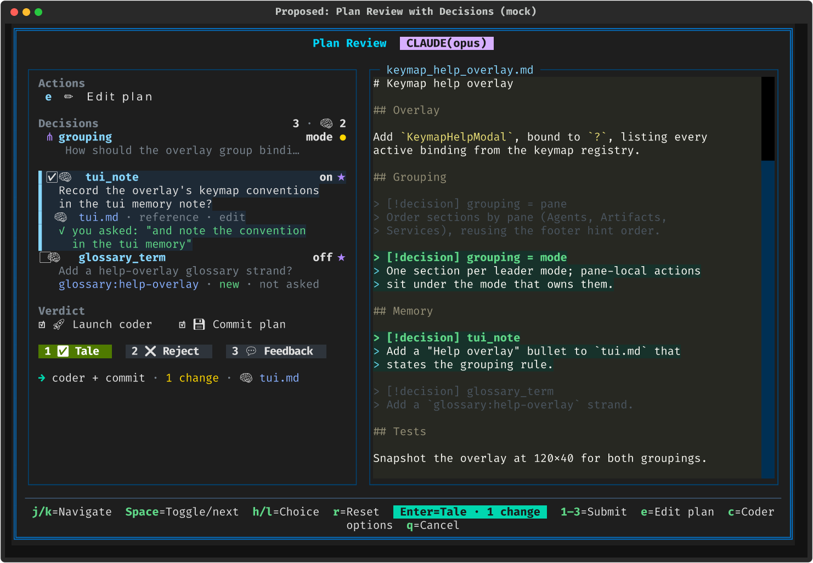
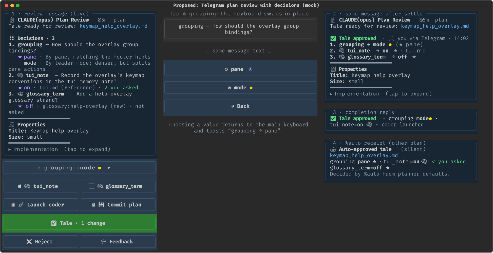
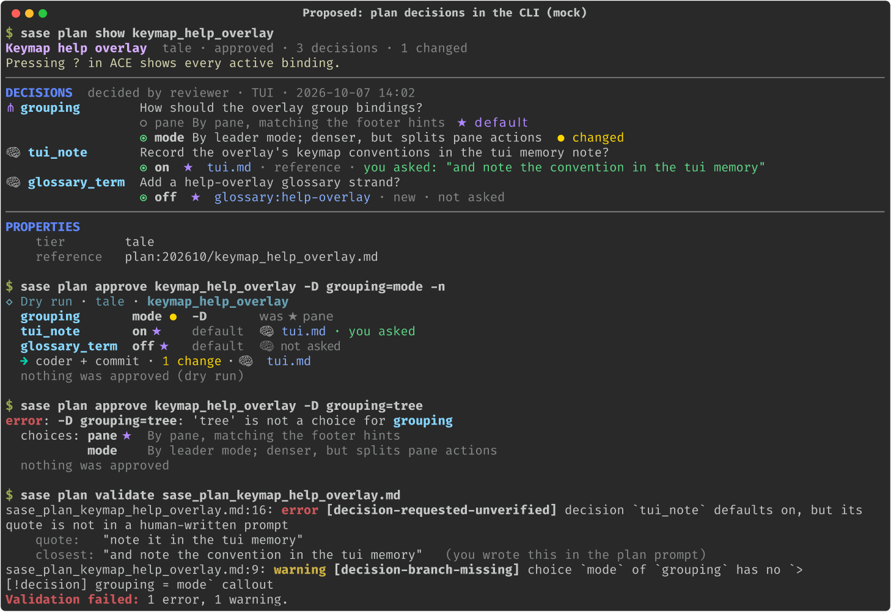

# Plan Decisions, Reviewed: One Experience Across ACE, Telegram, and the CLI

> **Research query:** Sase plans (tales and epics) should be able to embed gate options
> in their frontmatter. Two uses drive this: memory changes planned behind explicit human
> gates that default to on only when the user asked for them, and plan-shaping questions
> the planner can leave open so the coder implements whatever the reviewer picks. The
> accepted baseline is `plan_frontmatter_decisions.md`. What is the best possible UX
> across the TUI, Telegram, and the CLI, so that the feature is intuitive, reliable, and
> beautiful?


## Bottom line

The baseline is settled and I keep it. A plan declares up to five typed, defaulted
**Plan Decisions** in a `decisions:` map. The host compiles them onto the existing
`approve` option, and the approved plan records each answer. This report designs the
experience around that model. The whole design follows from one sentence:

> **Approve as shown.**

Every surface shows the decisions next to the plan with their current values filled
in. You can change a value without submitting anything. The primary action (Enter in
ACE, the green button in Telegram, a bare `sase plan approve`, and `%auto`) approves
exactly the values on display. Accepting the planner's defaults stays one keystroke or
one tap.

These are the ten choices that make it work. The first five are UX, the last five
reliability.

1. **One shared Decision Sheet with one summary sentence, both built in sase-core.**
   Every surface renders the same record and the same words, for example
   `→ coder + commit · grouping=mode ● · 🧠 tui.md`. The TUI, Telegram, the CLI, the
   `%auto` receipt, and the Android client (through the mobile gateway) therefore
   cannot drift apart.
2. **ACE: a Decisions section above a compact, docked Verdict.** Unfocused rows take two
   lines. The focused row expands to show the full question, every choice with its
   consequence, and the planner's reason. Space, `h`, and `l` change values, `r`/`R`
   reset, and **Enter never changes a value; it always approves as shown.** Focusing a
   decision scrolls the plan to the prose it selects.
3. **Telegram: the review message is the form.** The message text is a static
   question sheet. The inline keyboard holds the live answers: toggles flip in place,
   and a choice opens a radio sub-keyboard in place. The primary button reads
   **✅ Tale · defaults**, or **✅ Tale · 1 change** once you change something. There is
   no step wizard and no extra message. When the gate settles, the message is edited
   once to show the answers.
4. **CLI: `sase plan approve -D id=value`.** Every approval prints a decision card,
   bad values fail before anything happens, and there are no interactive prompts.
5. **One visual language everywhere.**
   - `☑️`/`⬜` mark a toggle, `◉` a choice, `★` the default, a gold `●` a changed value,
     and `🧠` a memory consent.
   - The decision **id** is its one name on every surface. It is what you see in ACE
     and Telegram and what you type in `-D`.
   - The full question (`ask`) is always one glance away.
6. **Compile decisions into the plan options' raw `input_schema`, not declared
   `inputs`.** Declared inputs would make ACE open its input panel and Telegram start
   its step wizard on every approval. ACE also needs one fix: the `decision_*` names
   must join its host-collected set ([wire shape](#changes-to-the-accepted-baseline), C1).
7. **Resolve defaults and verify memory quotes before the receipt is computed.** An
   omitted value and an explicit default then produce the same accepted decision on
   every surface.
8. **Freeze the whole decision definition for a review**, including the `ask` wording.
   Plan prose can still be edited. Changing a question goes through feedback.
9. **Bind each submission to the review revision that surface displayed.** Today a
   stale Telegram card can approve a plan that was edited after the card was sent.
10. **Add a silent `%auto` receipt.** On this host about 75% of plan approvals are
    automatic, and auto-resolved gates currently create no notification at all. For
    most plans the receipt is the only part of this feature you will ever see, so it
    needs the same design care as the review.

The rest of this report covers [the shared language](#the-shared-design-language),
[authoring](#authoring-the-planners-side), [ACE](#ace-tui), [Telegram](#telegram),
[the CLI](#cli), [`%auto` and what happens after approval](#auto-notifications-and-after-approval),
the [reliability contract](#reliability-contract), and how I
[resolved the disagreements](#where-the-reports-disagreed-and-the-resolution).

## Changes to the accepted baseline

You agreed with every recommendation in `plan_frontmatter_decisions.md`. The changes
below refine it, and each one is flagged for you.

| # | Baseline said | This report says | Why |
| --- | --- | --- | --- |
| C1 | Compile decisions into "declared, non-required inputs" and settle the wire shape during the gate phase | **Raw `input_schema` properties named `decision_<id>`, plus `payload.decisions`. ACE's plan modal treats every `decision_*` name as host-collected.** | Declared inputs are always collected by ACE's panel and by Telegram's step flow ([verified](#what-the-code-and-data-say)). |
| C2 | The `approve` command fills in defaults | **Resolve defaults and verify quotes before the receipt identity is computed** | The receipt digests the submitted inputs as they arrive. Without this, "Approve as shown" from Telegram and Enter in ACE would record different identities for the same answers (`cdx`). |
| C3 | Freeze ids, kinds, keys, and memory scope; the `ask` wording may still change | **Freeze the entire definition, including the `ask` wording, choice labels, and `why`** | Changing "Record the convention?" to "Skip the convention?" inverts a yes/no answer without changing its id. The rail would also show the frozen wording while the document showed the edited one (`cdx`). |
| C4 | Telegram: "Approve as shown" plus "Change decisions", which opens the step flow | **The decisions sit on the main keyboard, and edits happen in place** | The step flow sends a new message for every input, shows no defaults, has no Back button, makes you type yes/no, and its Skip deletes the value ([verified](#what-the-code-and-data-say)). |
| C5 | Grammar: `ask`, `choices`, `default`, `memory`, `requested` | **Add an optional `why:` field and optional branch callouts** (`> [!decision] grouping = mode`) | Without `why:`, a reviewer sees what the default is but not why it was chosen. Callouts mark the prose each answer selects, which the review can highlight and the coder can follow precisely (`cld`). |
| C6 | "`%auto` notification lists the decisions" | **A new silent receipt notification** for auto-approved plans that have decisions | Auto-resolved gates are created with no notification id today, so no such notification exists ([verified](#what-the-code-and-data-say)). |
| C7 | (not covered) | **Every surface submits the review revision it displayed. A mismatch is refused as stale.** | The receipt binds to whatever request hash is current at submit time, not the one the reviewer saw (`cdx`, [verified](#what-the-code-and-data-say)). |
| C8 | Choice glyph `◆`; changed marker `•` | **Choices use `◉`, and changes use a gold `●`** | `◆` already marks Task beads and epic phases. The gold `●` is ACE's existing changed marker in the Config pane. |

## What the code and data say

The table below combines facts the reports agreed on with my own checks against sase
`6e2bc57726` and sase-telegram `d335fb8`. Facts marked ✱ are new in this report or
correct a peer report.

| Fact | Where | Design consequence |
| --- | --- | --- |
| ✱ In ACE, declared `inputs` are always assigned to the input panel. The host-collected set filters **only raw schema properties**, and any property it does not filter sets `requires_panel`, so Enter opens a YAML box. | `gate_input_panel_model.py` (`_assign_fields`, `_raw_properties`, `requires_panel` at line 82) | Declared inputs cannot be hidden by marking them host-collected (`grk`'s approach). A raw schema hides them only once `decision_*` joins the plan modal's host-collected set (`cld` missed this step). |
| ✱ Telegram's `pending_fields` reads declared `inputs` only, so raw schema properties never start the step flow. | sase-telegram `gate_inputs.py:49` | With a raw schema, Telegram's ✅ submits immediately, and the dedicated decision keyboard owns collection. |
| Telegram's step flow: one new message per input, defaults not shown, no Back, `bool` needs a typed reply, and **Skip deletes the key**. | `gate_inputs.py` (`skip_step`), `gate_response.py` | This flow is unsuitable for decisions. Improve it separately for custom gates. |
| The Telegram plan card dumps **every** top-level frontmatter key, so `decisions:` would appear as raw YAML. | `formatting.py` `_ordered_plan_properties` | Strip `decisions` from the properties card and render a dedicated sheet. |
| When a gate settles, Telegram sends a generic "✅ Gate plan/<id> answered with approve, commit" and never edits the review message text. | `gate_completions.py` | Edit the review message once to show the answers. |
| ✱ Auto-resolved gates are created with `notification_id = None`. | `notification_gates/service.py` `_start_gate_creation` | No `%auto` notification exists today. The receipt is new work. |
| ✱ The receipt's `request_hash` is read from the **current** envelope at submit time, and `input_identity` digests the inputs as submitted, with no defaults filled in. Accepted in-gate edits increment `review_revision`. | `decision.py:163-166`, `edits.py:193` | Hence C2 (normalize first) and C7 (bind to the displayed revision). |
| The plan modal's rail is `width: 42`. Below 100 columns it docks to the bottom at 48% height. Verdict controls are 3-row Buttons, and "Commit plan file to the plans sidecar" wraps. The section title is the literal `"Decision"`. | `styles.tcss:1766-1771, 2089-2095`; `plan_approval_modal.py:166`; snapshot `plan_gate_tale_five_controls_120x40.png` | Use a compact Verdict, an accordion of decision rows, and rename the section to **Verdict**. |
| Gate keys: `j`/`k`, Space, Enter (priority, so it always submits the primary branch), `ctrl+s`, `i`, Tab. Static keys: `e`, `c`, `d`, `q`, Esc, `y`/`Y`, `g`/`G`, `ctrl+d`/`ctrl+u`. **`h`, `l`, ←/→, `r`, and `R` are free.** | `default_config.yml:577-585`; `plan_approval_gate_data.py` | The new keys fit without conflict. Enter can never edit a value. |
| ✱ Glyphs already in use: `◆` = Task bead (`bead_type_presentation.py:52`) and epic phases (`_plan_display_rendering.py:219`); `⋔` = gate turn (`gate_turn/state.py:19`); `★` = the primary branch in `sase gate show` (`cli_show.py:268`); `◉`/`○` = selected segment (`agent_grouping_modal.py:76`); gold `●` = modified (`config_pane_rendering.py:246`); `🎛️` = launch-control notifications. `🧠` is unused. | — | Choices use `◉` (radio semantics). `★` keeps its "what happens if you do nothing" meaning. Do not use `◆`, `⋔`, or `🎛`. |
| Shared bool parsing accepts `true/false/yes/no/on/off/1/0`. | `macro/models.py:203` | `-D` reuses it; no surface invents its own rules. |
| `sase plan approve` has `-n -k -m -P -p -w`, and `-D` is free. (`-D` on `sase gate answer` means `--no-detach`, but that is a different command.) | `sase plan approve -h` | Adopt `-D/--decide`. |
| Telegram `callback_data` is 1–64 bytes. Button `style` (`success`/`danger`/`primary`) is honoured by clients released after 9 Feb 2026. | `callback_data.py`; [python-telegram-bot docs](https://docs.python-telegram-bot.org/en/stable/telegram.inlinekeyboardbutton.html) | Use short tokens with server-side state, and make the primary button green. |
| ✱ There is a fourth client: the mobile gateway and Android app render notifications and run gate actions through sase-core wire records. | `docs/mobile_gateway.md`; `integrations/_mobile_notification_side_effects.py` | This strengthens the case for a Decision Sheet in sase-core. Until Android renders it, it must not offer "as shown". |

**Who actually reviews plans.** I recounted the retained gate bundles
(`~/.sase/interaction_requests`, 2026-09-01 to 2026-10-07):

| Source | Tale | Epic | Total |
| --- | --- | --- | --- |
| `auto_resolution` (`%auto`) | 144 | 75 | **219 (75.5%)** |
| ACE (`tui`) | 42 | 12 | 54 |
| `plan_response` (`sase plan approve` route) | 12 | 5 | 17 |
| Telegram | 0 | 0 | **0** |

✱ **None of the 290 retained plan responses came through Telegram.** Retention may
undercount, but the order of importance is clear: the **`%auto` receipt and the
archived plan** come first, **ACE** second, the **CLI** third, and **Telegram** last.
Telegram still deserves a good design, because a one-tap approval on the go is a real
use case and the current card would show raw YAML. But it should not set the
architecture. Its controls should mirror ACE's, not invent their own.

## The shared design language

### The Decision Sheet (sase-core)

Every surface renders one record. sase-core builds it from `payload.decisions` plus the
current draft, the answers, and the verdict. This follows the Rust-boundary litmus test:
the TUI, Telegram, the CLI, and Android must all show the same thing, so the sheet
belongs in sase-core.

```text
DecisionSheet
  count: 3      memory_count: 2      changed_count: 1      review_revision: 4
  rows[]:
    id, kind (toggle|choice), ask, why?,
    choices[{key, label}], default, value, changed,
    memory?{selectors[], resolved[{note, scope: project|home, type: core|reference|web, exists}],
            provenance: asked|not_asked|quote_not_found, quote?}
  summary(form=short|full, verdict=coder+commit|coder|commit|epic) -> str
```

### Vocabulary and glyphs

| Term / glyph | Meaning | Notes |
| --- | --- | --- |
| **Decisions** | The plan's open choices, as a section title | The same word on all surfaces |
| **Verdict** | Tale/Epic, Reject, and Feedback | Renamed from ACE's current "Decision" heading |
| `☑️` / `⬜` | A toggle that is yes / no | The same glyphs as the AND toggles: anything that shows them flips with Space |
| `◉` (row) · `◉`/`○` (options) | A choice; the selected and unselected options | Radio semantics, following GOV.UK (radios for one-of-many, checkboxes for on/off) |
| `★` | The planner's default: what Enter, ✅, and `%auto` take | It already means "the primary branch" in `sase gate show` |
| gold `●` | Changed from the default | Never colour alone: expanded rows, sub-keyboards, and the CLI also show `★ default` |
| `🧠` | A memory consent | Always paired with the note selector in text, so it survives terminals without emoji |
| `you asked` / `not asked` / `⚠ quote not found · off` | Where a memory default came from | Never phrase it as "verified consent" ([why](#memory-consent-show-the-evidence-not-a-seal)) |
| `core` · `reference` · `new` | The note's type and status | `core` is warning-coloured and reads "loaded every turn" |
| `yes` / `no` | Display words for toggle values | Asks are questions, so they take yes/no. YAML stays `true`/`false`, and the CLI accepts the shared bool spellings. |

### One summary sentence

sase-core renders the sheet as one sentence in two forms.

- **Full**: `→ coder + commit · grouping=mode ● · keep_shim=yes · 🧠 tui.md`.
  - **Order:** the verdict effect, then each choice and non-memory toggle in author
    order, then one 🧠 clause naming every note that will be edited.
  - **Memory clause variants:** `🧠 no memory edits` when every memory decision is
    off. The clause is omitted when the plan has no memory decisions.
  - **Where it appears:** the ACE outcome line, the Telegram completion reply, the
    `%auto` receipt, and the CLI card.
- **Short**: `defaults`, or `2 changes`, followed by ` · 🧠` when any memory edit is
  on. It appears on the Telegram primary button and the ACE footer's Enter badge.

The sentence is how a reviewer catches a wrong default before pressing Enter. It is
also why "Approve as shown" can be trusted.

### Copy rules (these go into `/sase_plan`)

- **`id`.** A short noun that reads well as a label: `grouping`, `tui_note`,
  `keep_shim`. Names like `opt1` or `q2` are not acceptable, because reviewers see the
  id and type it.
- **`ask`.** One question ending in `?`. Phrase a toggle so that **yes means do the
  work**.
- **Choice labels.** One line describing the consequence, for example "By leader mode;
  denser, but splits pane actions".
- **`why:`.** One line saying why the default is the default.
- **Order.** Order decisions by importance and put memory decisions last. Every
  surface and the archive use author order and never re-sort, so one rule holds
  everywhere.

## Authoring: the planner's side

```yaml
decisions:
  grouping:
    ask: How should the overlay group bindings?
    choices:
      pane: By pane, matching the footer hints
      mode: By leader mode; denser, but splits pane actions
    default: pane
    why: pane keeps the footer's order            # optional, ≤100 chars, not on memory decisions
  tui_note:
    ask: Record the overlay's keymap conventions in the tui memory note?
    memory: [tui.md]
    requested: "and note the convention in the tui memory"
    default: true
```

**`why:` (optional).**

- **Where it shows:** the `★` line of ACE's expanded row, the Telegram sheet, and
  `plan show`.
- **Rejected on memory decisions:** their default comes from policy, and the
  provenance chip already explains it.
- **Precedent:** Spec Kit pairs each recommended option with its reasoning. NN/g found
  that people read a default as an endorsement, and an endorsement should come with a
  reason.

**Branch callouts (optional, recommended when the branches differ by more than a
sentence).** They mark the prose each answer selects:

```markdown
> [!decision] grouping = pane
> Order sections by pane (Agents, Artifacts, Services), reusing the footer hint order.

> [!decision] grouping = mode
> One section per leader mode; pane-local actions sit under the mode that owns them.

> [!decision] tui_note
> Add a "Help overlay" bullet to `tui.md` stating the grouping rule.
```

- **Grammar.** `id = key` marks a choice branch. A bare toggle id marks the yes
  branch, and `id = no` marks the rarer no branch.
- **Rendering elsewhere.** Obsidian shows it as a titled callout, and GitHub and pandoc
  show an ordinary blockquote, so it never breaks a reader.
- **What it unlocks:**
  - ACE highlights the chosen branch and dims the other.
  - `plan show` tags the selected branch after approval.
  - The coder block names exactly which callouts to implement.
- **Validation.** sase-core rejects an unknown id or key. It warns when a choice has
  neither a callout nor a body mention.

This is not a conditional language: nothing is stripped or executed. The archive keeps
every branch for the audit trail.

**The planner sees what the reviewer will see.**

- `sase plan validate` renders the Decision Sheet.
- `sase plan propose` echoes `3 decisions (🧠 2)`.
- `decision-requested-unverified` prints the **closest human sentence**, so the planner
  can fix its quote in the same turn instead of guessing (`cld`, `mus`).
- New diagnostic codes use the existing `path:line: severity [code] message` format:
  `decision-limit`, `-id-reserved`, `-default-missing`, `-default-invalid`,
  `-answer-forbidden`, `-requested-missing`, `-requested-unverified`, `-branch-unknown`,
  `-why-on-memory` (errors), and `-unreferenced`, `-memory-uncovered`, `-ask-not-question`
  (warnings).

## ACE (TUI)

ACE handles 54 of the 71 human reviews in the sample, and it is the only surface that
can show prose and decisions side by side. It sets the standard that the other
surfaces copy.

### Layout



The left rail has three stacked parts. When a plan has decisions, the rail widens from
42 to **50 cells**. That leaves the document about 64 columns at a width of 120, and
the narrow breakpoint stays where it is.

1. **Actions** take one line: `e ✏️ Edit plan`.
2. **Decisions** has the header `Decisions  3 · 🧠 2` above the accordion rows. This
   part scrolls if it has to.
3. **Verdict** is docked to the bottom of the rail so it never scrolls away.
   - **Line 1:** the AND toggles with short labels: `☑️ 🚀 Launch coder  ☑️ 💾 Commit
     plan`. The long "to the plans sidecar" text moves to a tooltip.
   - **Line 2:** compact buttons: `1 ✅ Tale  2 ❌ Reject  3 💬 Feedback`.
   - **Line 3:** the outcome sentence, in its full form.
   - **Cancel button:** dropped, because `q` and Esc already cancel.

**Make the compact Verdict the standard plan-review layout, with or without
decisions.** The layout then does not jump between plans, and the existing `plan_gate_*`
goldens can change once, as one reviewed group. Plans with no decisions **omit** the
Decisions section entirely. An empty placeholder on most plans would be noise.

### Row anatomy

```
◉ grouping                        mode ●        ← collapsed: glyph · id · value
    How should the overlay group bindi…           ask, truncated
☑️ 🧠 tui_note                      yes ★
    tui.md · reference · you asked              memory rows show scope chips instead

▌◉ grouping                     ‹ mode › ●      ← focused: cyan bar, tinted background
▌  How should the overlay group bindings?          full ask, wrapped
▌   ○ pane   By pane, matching the footer   ★
▌            hints
▌   ◉ mode   By leader mode; denser, but
▌            splits pane actions
▌  ★ pane keeps the footer's order               the why line

▌☑️ 🧠 tui_note                       yes ★
▌  Record the overlay's keymap conventions
▌  in the tui memory note?
▌  🧠 tui.md · reference · edit
▌  you asked: "and note the convention in the tui memory"
```

The two other memory provenance states:

- **Not asked:** `⬜ 🧠 glossary_term  no ★`, with the chips
  `glossary:help-overlay · new · not asked`.
- **Quote not found:** `⚠ "note it in tui memory" — not in your messages · off until
  you turn it on`, in the warning colour. The value starts at no.

When a human switches on an unrequested memory edit, the row shows `yes ●` and the
outcome sentence adds the note. **No confirmation dialog.** The reviewer is exactly the
human the policy is waiting for, and a dialog would only train click-through.

The modal opens with **the first decision focused**, so its question and alternatives
are visible without any keypress. This is the gentle nudge against rubber-stamping.
Enter still approves at once.

### Keys

Add these to `ace.keymaps.gate` in `src/sase/default_config.yml` and to the help modal.
Under ACE's footer rule they are conditional bindings: they appear in the footer only
when the plan has decisions.

| Key | On a choice | On a toggle | Elsewhere |
| --- | --- | --- | --- |
| `j` / `k` | Move. Focus cycles Actions → Decisions → Verdict. | Move | Move |
| `space` | Next choice, wrapping | Flip | Toggles an AND member, as today |
| `l` / → | Next choice | Set yes | — |
| `h` / ← | Previous choice | Set no | — |
| `r` | Reset to `★` | Reset to `★` | — |
| `R` | Reset all decisions | Same | Same |
| `enter` | **Approve as shown.** Never edits a value. | Same | Same |
| `1`–`9` | Submit branch N **with the current values** | Same | Same |

The footer's Enter badge becomes `Enter=Tale`, and then `Enter=Tale · 1 change` once a
value differs from its default.

**Rejected key ideas:**

- Digit hotkeys for choices, which collide with branch submit.
- An Enter-opens-picker for choices (`cdx`, `gem`), which conflicts with Enter's
  priority binding. The expanded focused row already shows every alternative, so no
  picker is needed.
- Shift+Space (`gem`), which many terminals cannot distinguish from Space.

### The document pane

- **Fold the frontmatter.** The `decisions:` block becomes one dim line:
  `decisions: 3 · answered in the Decisions panel`. `e` and `Y` still act on the raw
  file.
- **Focus follows.** Focusing a decision scrolls the document to its first callout, or
  failing that, its first mention of the id.
- **Callout styling.** The chosen branch is tinted green with a bold header. An
  unchosen branch, or a toggle answered no, is dimmed. Never hide a branch: the
  reviewer should see what they are declining.
- **Implementation and cost.** This reuses the cached token stream with
  `Syntax.stylize_range` and costs a few dozen lines per keypress. It is still worth
  checking against the `tui` memory note's performance guidance.

### States to design explicitly

- **Close and reopen.** Esc keeps provisional values per request id while ACE runs,
  extending the existing `PendingApproveState`. Losing three careful choices because you
  closed the modal to look at an agent would feel broken.
- **In-gate edit (`e`).**
  - Prose edits keep every value.
  - An edit that changes anything under `decisions:` reuses the red "Draft not
    accepted" banner and keeps the editor draft: *"Decisions are fixed for this review.
    Change answers in the Decisions panel, or press 3 to send feedback that changes the
    questions."*
- **Feedback (`3`).**
  - The note panel shows a read-only first line, `Carries: grouping → mode`.
  - The replanner receives those values as its new defaults. A human yes on a memory
    decision in a rejected review is never treated as authorization for the next plan.
- **`i` and `c`.** Neither ever shows decisions, and the Tale button gets no
  `✎ n inputs` badge for them. **Every submit path merges the sheet's values:** Enter,
  digits, `ctrl+s`, the `c` → submit path, and programmatic `action_tale`. Missing one
  path means the coder silently implements the defaults (`grk`).
- **Narrow layout** (below 100 columns, rail docked at the bottom at 48% height).
  - Rows collapse to one line, the focused row expands, and the Verdict and outcome
    lines stay docked.
  - At 90×40 this leaves room for three collapsed rows plus one expanded.
- **Epic review.** The Verdict is `1 ✅ Epic  2 ❌ Reject  3 💬 Feedback`, and the outcome
  sentence is `→ epic launch · …`. The rows are the same as for a tale.
- **Settled elsewhere.** If Telegram or the CLI settles the gate while the modal is
  open, replace the controls with
  `Approved via Telegram · grouping=mode ● · 🧠 tui.md` instead of letting the stale
  modal submit.

### Around the modal

- **Toast:** `Tale ready for @agent: file.md`, plus a second line `3 decisions · 🧠 2`.
- **Inbox row:** append `· ◉3 🧠`.
- **Inbox gate card:** give it a dedicated Decisions block.
  - Pending rows read `◉ grouping  pane ★`. Answered rows read `grouping: mode ●`.
  - Without this block, the generic field list would show every decision twice, once
    under `approve` and once under `commit`.
- **PLAN lane and agent prompt panel after approval:** render the same DECISIONS
  section as `sase plan show`, using the shared `_plan_display_rendering` builders.

## Telegram



### The message: a static question sheet

The sheet goes **before** Properties, because it is the only part of the message you
act on. The `decisions` key is stripped from the properties card.

```
📋 CLAUDE(opus) Plan Review  @5m--plan
Tale ready for review: keymap_help_overlay.md

Decisions · 3
1. grouping — How should the overlay group bindings?
   ★ pane · By pane, matching the footer hints — pane keeps the footer's order
     mode · By leader mode; denser, but splits pane actions
2. 🧠 tui_note — Record the overlay's keymap conventions in the tui memory note?
   ★ yes · tui.md (reference) · you asked: "and note the convention…"
3. 🧠 glossary_term — Add a help-overlay glossary strand?
   ★ no · glossary:help-overlay (new) · not asked
━━━━━━━━━━━━━━━━━━━━
🧾 Properties …   ▸ Implementation … (expandable, as today)
```

**The text never changes while you edit.** Each tap edits only the reply markup
(`editMessageReplyMarkup`). Re-rendering a long MarkdownV2 message on every tap would
risk entity errors and "message is not modified" failures, and the text would jump.

**Budget.** The sheet comes right after the header and is never cut in the middle of a
decision. If it exceeds about 1,800 characters, shorten it in this order:

1. Drop the labels of non-default choices.
2. Drop the remaining labels.
3. Wrap the choice lines in an expandable blockquote.

Each `ask` and its `★` line always survive.

### The keyboard: the live answers

```
[ ◉ grouping: mode ● ▾ ]
[ ☑️ 🧠 tui_note ] [ ⬜ 🧠 glossary_term ]      ← toggles pair up when the labels fit
[ ☑️ 🚀 Launch coder ] [ ☑️ 💾 Commit plan ]
[ ✅ Tale · 1 change ]                          ← style: success
[ ↺ Reset ] [ ❌ Reject ] [ 💬 Feedback ]       ← ↺ only after a change
```

- **Toggles flip in place.** The toast reads like a receipt: "🧠 glossary_term yes —
  authorizes editing glossary:help-overlay".
- **Choices (`▾`) open in place.** The keyboard swaps to a radio sub-keyboard:
  `[○ pane ★] [◉ mode ●] [↩ Back]`.
  - The opening toast shows the `ask` (callback answers allow up to 200 characters).
  - Picking a value returns to the main keyboard and toasts `grouping → mode`.
  - Two-way choices drill down too, so one rule covers every choice: **"☑️/⬜ rows
    flip; ▾ rows open."** Cycling on each tap (`grk`) hides the alternatives and gets
    clumsy beyond two.
- **Callbacks set a value; they never toggle one.**
  - A `☑️` button sends "set no", and a choice button sends "set mode". A double tap
    or a redelivered update then cannot undo your intent (`cdx`).
  - Tokens are short and server-resolved: `d2=0`, `d0=1`, `d0>` (open), `d<` (back),
    `dz` (reset all). Each carries the card's review revision, for example `d2=0r4`.
  - Values live next to the AND-toggle state in `telegram_gate_progress.json`, which
    survives a bot restart.
- **The primary label carries the short summary.**
  - `✅ Tale · defaults`, `✅ Tale · 2 changes`, or `✅ Epic · …`. With no decisions it
    stays `✅ Tale`.
  - Kind validation pins the option's label as "Tale". The suffix is presentation in
    sase-telegram, so it needs no change to the sealed contract (`grk` raised this
    constraint).
- **Drafts are per surface.** A Telegram draft never changes what an open ACE modal
  will submit. The only shared state is the frozen proposal and the accepted receipt.

### Stale cards, settling, and feedback

- **Stale card.** If the review revision moved, for example because you edited the plan
  in ACE, any tap answers: *"This plan changed since this card was shown."* The message
  then offers **↻ Refresh review**. It never approves silently.
- **Settle (here or elsewhere).**
  - The review message is edited once: the sheet is replaced by
    `✅ Tale approved · you via Telegram · 14:02` and the answers
    (`1. grouping → mode ● (★ pane)` …), and the keyboard is removed.
  - The completion reply carries the full sentence:
    `✅ Tale approved · grouping=mode ● · 🧠 tui.md · coder launched`.
  - When TUI or CLI settles the gate, the same edit runs, so the phone never shows a
    live question sheet for a decided plan.
  - A launch failure after acceptance reads "Approved with these choices · coder could
    not start · retry". The retry reuses the accepted answers.
- **Feedback.** `💬 Feedback` carries the current values as provisional defaults. The
  note prompt should **ask for a reply** to the review message. Today an unreplied text
  can fall through and launch a new agent when several prompts are waiting (`cld`);
  fix that in the same pass.
- **PDF.** Pandoc drops unknown frontmatter keys, so prepend a rendered Decisions table
  and render callouts as labelled blockquotes.

### Not in v1

- **"🎛 Change decisions" plus the step flow** (`mus`). It costs N messages, and `🎛`
  already marks launch-control notifications.
- **A Mini App.** It would mean a web frontend to build, host, and authenticate, for at
  most five closed choices.
- **Bot API rich messages.** Revisit them once sase-telegram adopts them.

Separately, the generic step flow should still gain a yes/no keyboard for `bool` and
change "Skip" to "Keep default: X" for **custom** gates (`grk`, `mus`).

## CLI



### `sase plan approve … -D/--decide ID=VALUE`

- **Repeatable flag.** Giving the same id twice is an error, never "last one wins".
- **Values.**
  - Toggles use the shared bool spellings (`yes/no/true/false/on/off/1/0`) and
    canonicalize to JSON booleans.
  - Choices take the **exact key**, case-insensitive. Prefix matching is not allowed,
    because `-D grouping=m` would silently change meaning the day a `minimal` choice
    is added.
- **Errors happen before any side effect.** An unknown id or value prints a
  did-you-mean and the allowed values with `★` on the default, then
  `nothing was approved`.
- **The memory boundary.** If an agent process passes `-D <memory>=yes`, the command
  refuses: *"memory decisions can only be switched on by a human; this shell runs
  inside agent `5m--plan`."*
  - This uses the host's trusted caller classification.
  - A `source=cli` label alone is never proof that a human ran the command (`cdx`).
- **Epics** work the same way: `sase plan approve big_epic -k epic -D x=y`.
- **No interactive prompts in v1.** Agents and scripts run this command, and the TUI is
  the interactive surface. A `[Y/n/c]` prompt (`gem`) would break both. There is also
  no `--reset-decisions` (`gem`), because a bare approve already means defaults.
- **Completions.** `-D <TAB>` completes `id=` from the live proposal, and then its
  values (`grk`).

### The decision card

Every approval with decisions prints the card. With `-n` it prints the card and stops.
**A bare `sase plan approve` still approves at once.** The card is the confirmation,
not a prompt, in the way `terraform apply` restates its plan. A silent approval that
turns memory on because of a verified quote would be correct and still feel like a
trick.

```
◇ Dry run · tale · keymap_help_overlay · review 4
  grouping       mode ●   -D        was ★ pane
  tui_note       yes  ★   default   🧠 tui.md · you asked
  glossary_term  no   ★   default   🧠 not asked
  → coder + commit · grouping=mode ● · 🧠 tui.md
```

The source column (`-D` or `default`) shows where each value came from, following
Copier and clig.dev.

### Retries, show, and the rest

- **Retrying an approved plan.** `sase plan approve PLAN` on an approved plan whose
  coder failed prints *"Retrying implementation with the accepted decisions:
  grouping=mode; tui_note=no."* Adding `-D` there is refused: *"This plan is already
  approved. Retry uses its accepted answers. Start a new review to change tui_note."*
- **`sase plan show`.** A **DECISIONS** section goes before PROPERTIES.
  - Pending: each ask, its choices, `★`, the why line, and memory chips.
  - Approved: the header `decided by reviewer · TUI · 14:02`, the answer marked `◉`,
    `● changed` where it differs, and unselected choices dimmed.
  - `-f compact` adds `◉3 🧠1`, and `-f json` adds the full sheet plus `decided_by` and
    `decided_via`.
- **Other commands.**
  - `sase plan list` gains a narrow `◉` column.
  - `sase gate show` renders a plan gate's decisions as a table instead of
    `raw schema: decision_grouping, …`.
  - `sase gate answer -O` remains the wire-level escape hatch. It must use the same
    resolver as `-D`.
- **Before landing the flag,** read the `cli_rules` memory note (sorted options, short
  aliases, coloured help). Add `-h` examples for a default, an override, and a retry.

## `%auto`, notifications, and after approval

### The `%auto` receipt: the most-seen surface

About three in four plans settle under `%auto`, and today they settle in silence. Every
auto-approved plan **with at least one decision** should post a **silent informational
notification**:

- **Delivery.** It shows up in ACE's inbox as a row with no gate. On Telegram it is
  sent with `disable_notification`. Android receives the same notification snapshot.
- **Example:**

  ```
  🤖 Auto-approved tale · keymap_help_overlay
  grouping = pane ★ (auto) · keep_shim = yes ★ (auto)
  🧠 tui.md · you asked: "and note the convention in the tui memory"
  ⚠ 🧠 glossary_term = no · its request quote was not found, so it was forced off
  ```

- **No undo.** The coder is already running. If you disagree, send feedback on the
  result, as you would today.
- **Plans without decisions** stay silent, as they are today.
- **What it gives you.** The receipt is the only place you ever see what `%auto`
  decided about memory. It also makes the override rate measurable: how often the
  defaults are wrong, by planner and model.

### Implementers and the archive

- **Archive.** It keeps `ask`, `choices`, `default`, `why`, `memory`, and `requested`,
  plus the system-written `answer:` and top-level `decided_by: reviewer|auto|cli` and
  `decided_via: tui|telegram|cli|mobile`. The decision mechanism and the transport are
  recorded separately (`cdx`).
- **Coder block.** A host-written block appended after "Implement it now", with
  overrides first:

  ```
  Reviewer decisions (final · reviewer via ACE):
  - grouping = mode (you recommended pane). Implement callout "grouping = mode"; ignore "grouping = pane".
  - tui_note = yes 🧠. Memory edits are authorized for tui.md only.
  - glossary_term = no. Do not create glossary:help-overlay.
  Other decisions kept their defaults. Implement only the branches selected above.
  ```

- **Epics.** `sase bead read` shows the same lines under EPIC PLAN for every phase and
  for the land agent.
- **After approval, ACE and `plan show`** render an "Accepted decisions" block above
  the body. Every branch description stays available for audit.

### Memory consent: show the evidence, not a seal

A matched quote proves that those words occur in text a human wrote. It does not prove
intent. "edit tui.md" also occurs inside "do not edit tui.md" (`cdx`). So:

- **Show the quote and how to inspect its source.** Say `you asked: "…"`, never
  "Verified consent ✓".
- **Tell planners to quote the complete affirmative request,** not a fragment.
- **Resolve scope to durable identities** (project or home, note, strand) and freeze
  them for the review.
  - A web selector freezes its current strands, so later strands do not inherit the
    authorization.
  - Reject overlapping grants (two decisions covering the same note) in v1.
- **Treat generated `AGENTS.md` and provider shims** as covered only as regenerations
  of a covered note.
- **Do not call it a write barrier until the guard enforces it.** Until then, memory
  consent is "structured authorization plus agent instructions".

## Cross-surface state matrix

| State | ACE | Telegram | CLI |
| --- | --- | --- | --- |
| Default, untouched | `pane ★` | Sheet `★ pane`; button `◉ grouping: pane ▾`; `✅ Tale · defaults` | Card source `default` |
| Changed | `mode ●`; `Enter=Tale · 1 change` | Button `… mode ● ▾`; `✅ Tale · 1 change`; `↺ Reset` appears | Source `-D`, `was ★ pane` |
| Memory, asked | `yes ★ · you asked`; focus shows the quote | `★ yes · you asked: "…"` | `🧠 tui.md · you asked` |
| Memory, not asked | `no ★ · not asked` | `★ no · not asked` | `🧠 not asked` |
| Memory, quote not found | `⚠ … · off until you turn it on` | `⚠ quote not found · off` | `⚠` on the card; a validate error at propose |
| Human turns memory on | `yes ●`; the outcome names the note | Toast "authorizes editing …" | Allowed from a human shell only |
| Plan edited during review | Prose: values kept. Decisions: refused, draft kept | Stale card → ↻ Refresh review | Approves the current revision; the card prints `review N` |
| Settled here | The PLAN lane shows the answers | Message edited; completion reply | Card printed |
| Settled elsewhere | The open modal shows "Approved via …" | Message edited; keyboard removed | `plan show` shows `decided by` |
| `%auto` | Silent inbox receipt | Silent receipt | `plan show`: `decided by auto` |
| Surface without decision support | — | — | Defaults apply. **Never label it "as shown."** Gate the beta on surface capability. |

## Reliability contract

These are release acceptance criteria. They merge `cdx`'s interaction contract with
`grk`'s "landmines".

1. **Every value is visible before approval.** The current value and memory scope stay
   in the main review on every surface.
2. **Editing a value never approves.** In ACE, Enter cannot edit. In Telegram, the last
   choice returns you to the card. In the CLI, `-n` previews.
3. **Defaults are recommendations, labelled `★`.** An unanswered decision differs from
   `false`: a pending plan shows `default: false` with no `answer`.
4. **One vector is accepted.** Fill omissions and clamp unverified memory before the
   receipt identity. `approve` and `commit` never resolve independently, and differing
   values supplied separately for them are rejected.
5. **Approval refers to the displayed revision.** Stale ACE or Telegram submissions are
   refused with a refresh path.
6. **Accepted answers are immutable.** Retries reuse them. Recovery repairs the archive
   projection from the receipt. A crash between acceptance and archive never re-asks
   and never re-resolves defaults.
7. **"Approved" and "implementation started" are separate states** on every surface.
8. **Every ACE submit path merges the sheet,** and no generic input UI (the ACE panel,
   the Telegram step flow, `✎ n inputs`, a duplicate inbox field list) ever shows a
   decision.
9. **Visual goldens and a Telegram formatting test land with the surface phases.**
   - ACE: `plan_gate_tale_decisions_120x40`, `…_memory_120x40`, `…_unverified_120x40`,
     `…_stacked_90x40`, `plan_gate_epic_decisions_120x40`.
   - Inbox: the gate card pending and answered.
   - The plan toast.

**The usability check before calling it done** (`cdx`):

- **Task.** Have Bryan review a tale with one memory decision and an epic with one
  choice plus one requested memory decision, on each surface, without explaining the
  mechanics.
- **Question.** Before he submits, ask him to say what Enter, or the green button, will
  do.
- **What to watch.** Whether he notices changed values, understands what "no" on a
  memory row means, and can change one answer without approving.

## Where the reports disagreed and the resolution

| Question | cdx | cld | grk | mus | gem | **Resolution** |
| --- | --- | --- | --- | --- | --- | --- |
| Wire shape | Inputs, normalized before the receipt | Raw `input_schema` | Declared inputs marked host-collected | Declared inputs | Declared inputs | **Raw schema plus ACE host-collected `decision_*`** (C1). grk's mechanism does not hide declared inputs, and cld's needs the ACE fix. |
| Telegram editing | Card → per-decision editor → back | Live keyboard; choices drill down | Cycle on the main keyboard | "Change decisions" → step flow | "Change decisions" → switchboard | **Live main keyboard, set-value callbacks, choices drill down** (C4). It has the fewest taps, keeps alternatives visible, and is idempotent. |
| Telegram primary label | "Approve as shown" | `✅ Tale · defaults/N changes` | Keep `✅ Tale` | "Approve as shown" | "Approve as shown" | **`✅ Tale · defaults` / `· N changes`.** The suffix is presentation; the sealed label stays "Tale". |
| Choice glyph | — | `⋔` | `◆` | `◆` | `◆`/`‹›` | **`◉`.** `⋔` is the gate-turn glyph and `◆` the task-bead glyph. |
| Row label | Full ask, wrapped | id | Truncated ask | Short ask | Ask | **id, plus the ask on line 2 and in full on focus.** One name you can see and type. |
| Changed marker | "Changed · default" text | Gold `●` | Accent plus `was:` | `•` | `•` | **Gold `●` (the Config pane idiom), plus `★ default` wherever detail is shown.** |
| `ask` edits during review | Frozen | Editable | Editable | Editable | Editable | **Frozen** (C3). |
| Order | Author | Memory last | — | Author | — | **Author order; the skill says to put memory last.** |
| Empty Decisions section | — | (compact Verdict everywhere) | — | Dim placeholder | Omit | **Omit it; the compact Verdict is standard everywhere.** |
| CLI bool spellings | yes/no, true/false | Shared rule | Plus on/off | Reject 1/0 | Includes 1/0 | **The shared `InputArg` rule.** One parser per codebase. |
| Interactive CLI prompt | No | No | No | No | `[Y/n/c]` | **No.** |
| CLI review token | `-V TOKEN` | — | — | — | — | **Defer.** The dry run prints `review N`. ACE and Telegram bind the revision now. |
| `%auto` visibility | Settled notification | New silent receipt | Rewrite the notes | Notification | Telegram receipt | **A new silent receipt for plans with decisions** (C6). |
| Rail width | Reuse | Widen to 50 | Keep 42 | — | — | **50 when decisions exist,** tuned during the golden pass. |
| Reset | "Restore default" in the editor | `r` | `r`/`R` and Telegram ↺ | — | `r`/`R` | **`r`, `R`, and Telegram `↺` after a change.** |
| `why:` and callouts | Avoid conditional markup | Add both | Body mention | Body mention | — | **Add both, optional** (C5). Callouts are markers, not conditionals. |
| Guard in enforcing mode | Refuse the whole commit | — | — | Commit everything but memory | — | **Refuse the whole publication, list the uncovered paths, and let the agent revert them and declare again.** A partial commit can split a note from its regenerated shims. |

### Corrections to individual reports

- **cld.** A raw `input_schema` is **not** invisible to ACE on its own:
  `_raw_properties` exposes every property outside the host-collected set, and that
  opens the YAML panel. The `⋔` glyph is already the gate-turn glyph.
- **grk.** `HOST_COLLECTED_PROPERTIES` filters only raw schema properties. Declared
  inputs always reach ACE's panel and Telegram's `pending_fields`, so "declared inputs
  marked host-collected" would need generic gate changes. `◆` is taken.
- **gem.**
  - Shift+Space and Enter-opens-dropdown conflict with how terminals and the priority
    Enter binding work.
  - The interactive `[Y/n/c]` prompt and `-r/--reset-decisions` contradict a CLI that
    agents and scripts drive.
  - The reserved-id list is incomplete; the baseline's list is canonical.
  - "Cognitive psychology confirms that reviewers rubber-stamp forms exceeding 5
    controls" is unsupported. The cap of five rests on keyboard and rail space, not
    on that claim.
  - The baseline already showed that the AND-group design gem proposed earlier does not
    work, and gem's UX report rightly drops it.
- **mus.** The existing Telegram step flow has no Back button, so "Back/confirm
  affordances follow the existing flow" is not available. A placeholder Decisions
  section on every plan adds noise for the common zero-decision case.
- **Baseline.** The `%auto` "notification" it refers to does not exist yet (C6). Its
  sample also contains **no** Telegram plan approvals, a fact it did not call out.

## Implementation shape

This adjusts the baseline epic: `core → gate → consumers → surfaces → policy → guard`.

| Phase | Additions from this report |
| --- | --- |
| `core` (sase-core) | `why`, callout parsing and validation, the `DecisionSheet` record, the short and full summary formatter, closest-human-sentence suggestions, and the new diagnostic codes |
| `gate` | Raw schema `decision_*` plus kind-validation equality. Resolve and clamp before the receipt identity. Submissions carry the review revision. Freeze the whole definition. |
| `consumers` | The coder block with callout names, DECISIONS in `bead read`, the `%auto` silent receipt, and `decided_via` |
| `tui` (split from `surfaces`) | Compact Verdict as the standard layout. Decisions accordion, keys, footer badge, document linking and dimming, draft persistence, settled-elsewhere state, toast, inbox, and goldens. Mirror the keys in `default_config.yml` and the help modal. |
| `telegram` (split; sase-telegram repo) | Question sheet, live keyboard, set-value tokens with revision, sub-keyboard, primary label, settle edit, stale refresh, PDF table, reply-to fix. Separately, a bool keyboard and "Keep default" for custom gates. |
| `cli` | `-D` with completions, the decision card, `plan show`/`list`/`validate`/`gate show`, and the retry and agent-boundary messages |
| `policy` (last) | The copy rules and callout guidance in `/sase_plan`, and the memory rules in `/sase_memory_write`. Planners start writing decisions only once ACE **and** Telegram render them. |
| `guard` | As in the baseline |

Android renders the gateway's `DecisionSheet` later. Until then, its approve action
must not be labelled "as shown".

## Open questions for you

Each has a recommendation; push back on any of them.

1. **Telegram layout.**
   - **Recommended:** decisions on the main keyboard.
   - **Alternative:** a one-button "Approve as shown" card with decisions behind a
     second button. That is simpler, but it hides the live state, and hidden controls
     go unused (0 of 54 human reviews touched the `c` inputs).
2. **Callouts: optional or required for choices?**
   - **Recommended:** optional, with a warning when a choice has neither a callout nor
     a mention.
   - **Alternative:** required. That makes dimming and the coder block exact for every
     choice, but it burdens one-parameter decisions.
3. **`%auto` receipts.**
   - **Recommended:** send one for every auto-approved plan with decisions.
   - **Alternative:** send one only when memory decisions are present.
4. **Display words for toggles.**
   - **Recommended:** `yes`/`no`, because asks are questions.
   - **Alternative:** `on`/`off` (cld).
5. **The CLI review token (`-V`).**
   - **Recommended:** defer it until a script actually needs it.

## Recommended solution

**Ship Plan Decisions with one contract, "Approve as shown", rendered from one
sase-core Decision Sheet.**

- **ACE.**
  - A Decisions accordion above a compact, docked Verdict.
  - `☑️` toggles, `◉` choices, `★` defaults, gold `●` changes, and `🧠` consents that
    show their quote.
  - Space, `h`, and `l` change values; `r`/`R` reset; Enter approves as shown.
  - The document follows focus, highlighting the chosen branch and dimming the other.
- **Telegram.**
  - A static question sheet above a live keyboard: toggles flip and choices drill down
    in place, with set-value callbacks bound to the review revision.
  - `✅ Tale · defaults` is the one-tap approval.
  - The message is edited once when the gate settles, wherever it settles.
- **CLI.**
  - `-D id=value`, validated before any side effect.
  - A decision card printed on every approval.
  - DECISIONS in `plan show`, and decision diagnostics in `plan validate`.
  - No prompts.
- **Everywhere.**
  - The same ids, glyphs, and summary sentence. Omitted means default.
  - Defaults resolved before the receipt; definitions frozen for a review; answers
    immutable through retries.
  - A silent `%auto` receipt for the three plans in four that no human reviews.

This design is:

- **Intuitive:** the controls are the ones you already use, the default path costs
  nothing, and every surface says what Enter will do.
- **Reliable:** one resolver, one accepted vector, revision-bound submissions, frozen
  definitions, and no generic UI that can intercept a decision.
- **Beautiful:** one calm panel, one sentence, a plan that shows the branch you
  picked, and a phone message that turns into its own receipt.

## Sources

_Lead researcher's consolidated report · 2026-10-07 · Merges five independent swarm
reports with my own checks against sase `6e2bc57726` and sase-telegram `d335fb8`, and a
recount of the retained gate bundles under `~/.sase/interaction_requests`._

**Accepted baseline** (read through `sase artifact read`):
[`plan_frontmatter_decisions.md`](../plan_frontmatter_decisions/plan_frontmatter_decisions.md).

**Swarm reports in this directory:**

- [`plan_decisions_cross_surface_ux__cdx.md`](plan_decisions_cross_surface_ux__cdx.md):
  the interaction contract, the Telegram return-to-card flow, revision binding, and
  normalizing before the receipt.
- [`plan_decisions_cross_surface_ux__cld.md`](plan_decisions_cross_surface_ux__cld.md),
  with the mocks
  [TUI choice](plan_decisions_review_ux__cld_tui_choice.png),
  [TUI memory](plan_decisions_review_ux__cld_tui_memory.png),
  [Telegram](plan_decisions_review_ux__cld_telegram.png), and
  [CLI](plan_decisions_review_ux__cld_cli.png): the accordion, the live keyboard, the
  summary sentence, `why:`, and callouts.
- [`plan_decisions_cross_surface_ux__grk.md`](plan_decisions_cross_surface_ux__grk.md),
  with [its infographic](plan_decisions_review_ux_infographic.jpg): the Decision Sheet,
  the generic-input landmines, and completions.
- [`plan_decisions_cross_surface_ux__mus.md`](plan_decisions_cross_surface_ux__mus.md):
  the moment-by-moment memory-consent flow and authoring-side previews.
- [`plan_decisions_cross_surface_ux__gem.md`](plan_decisions_cross_surface_ux__gem.md):
  the outcome projection and the surface comparison.

**Internal sources I verified:**

- **sase:**
  - Input panel and plan modal: `ace/tui/modals/{gate_input_panel_model.py,plan_approval_gate_data.py,plan_approval_modal.py,config_pane_rendering.py,agent_grouping_modal.py}`.
  - Layout and keys: `ace/tui/styles.tcss`, `default_config.yml` (`ace.keymaps.gate`).
  - Gates: `notification_gates/{service.py,decision.py,edits.py,input_collection.py,cli_show.py}`, `plan_gate.py`.
  - Glyphs: `bead_type_presentation.py`, `gate_turn/state.py`, `sdd/_plan_display_rendering.py`.
  - Bool parsing: `macro/models.py`.
  - CLI: `sase plan approve -h`, `sase gate answer -h`.
  - Mobile: `docs/mobile_gateway.md`, `integrations/_mobile_notification_side_effects.py`.
  - Snapshot: `tests/ace/tui/visual/snapshots/png/plan_gate_tale_five_controls_120x40.png`.
- **sase-telegram:** `gate_inputs.py`, `inbound_handlers/{gate_callbacks.py,gate_completions.py}`,
  `formatting.py` (`_ordered_plan_properties`), `callback_data.py`, `inbound.py`.
- **Data:** `~/.sase/interaction_requests/{plan,epic_plan,question}/*/response.json`,
  290 plan and epic responses from 2026-09-01 to 2026-10-07.

**External:**

- Telegram:
  - [python-telegram-bot `InlineKeyboardButton`](https://docs.python-telegram-bot.org/en/stable/telegram.inlinekeyboardbutton.html):
    `style`, honoured on clients after 9 Feb 2026.
  - [aiogram `InlineKeyboardButton`](https://docs.aiogram.dev/en/latest/api/types/inline_keyboard_button.html).
  - [Bot API](https://core.telegram.org/bots/api): `callback_data` is limited to 64
    bytes and `answerCallbackQuery` text to 200 characters.
  - [aiogram `answerCallbackQuery`](https://docs.aiogram.dev/en/latest/api/methods/answer_callback_query.html).
- GOV.UK Design System (via `cdx`, `grk`):
  [radios](https://design-system.service.gov.uk/components/radios/),
  [checkboxes](https://design-system.service.gov.uk/components/checkboxes/),
  [check answers](https://design-system.service.gov.uk/patterns/check-answers/), and
  [error summary](https://design-system.service.gov.uk/components/error-summary/).
- [NN/g: the power of defaults](https://www.nngroup.com/articles/the-power-of-defaults/)
  (via `cld`).
- [Spec Kit `/speckit.clarify`](https://github.com/github/spec-kit/blob/main/templates/commands/clarify.md)
  (via `cld`): a recommendation paired with its reasoning.
- [Obsidian callouts](https://help.obsidian.md/callouts) (via `cld`).
- [clig.dev](https://clig.dev/) and
  [Copier configuring](https://copier.readthedocs.io/en/stable/configuring/) (via `cld`):
  no required prompts, and showing where each value came from.
- [Terraform apply](https://developer.hashicorp.com/terraform/cli/commands/apply)
  (via `cdx`, `grk`): restate the frozen plan; a retry does not renegotiate it.
- [W3C: grouping form controls](https://www.w3.org/WAI/tutorials/forms/grouping/)
  (via `cdx`).
