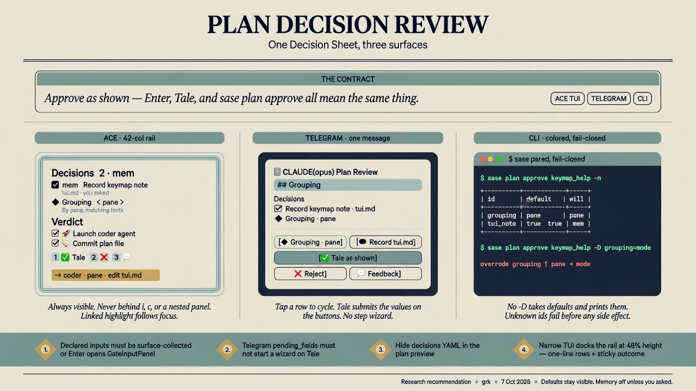

# Plan Decision Review: UX across ACE, Telegram, and the CLI

> **Research query:** Given that tale and epic plans will declare typed,
> defaulted **Plan Decisions** in frontmatter (compiled onto the existing
> `approve` option, never as extra gate options), what is the best possible
> review experience across the TUI, Telegram, and the CLI? The design must
> be intuitive, reliable, and beautiful, and it must serve two jobs: memory
> consent that defaults on only when the human asked, and plan-shaping
> questions the coder can implement from the reviewer's selections.



_Researcher `grk` · 2026-10-07 · UX lead for this swarm. Architecture is
taken from [`research:202610/plan_frontmatter_decisions/plan_frontmatter_decisions.md`](plan_frontmatter_decisions/plan_frontmatter_decisions.md)
(the user agreed with those recommendations). This report decides how the
review feels. Peer reports from this swarm were not read._

## Bottom line

**Ship one Decision Sheet, projected onto three surfaces.** The sheet is
the visible body of the existing `approve` option. It is a short, always-on
list of toggles and 2–5-way choices, each already filled with a default.
The primary action on every surface is the same sentence:

> **Approve as shown.**

Enter in ACE, the sealed **Tale** / **Epic** submit, Telegram's primary
button, `%auto`, and `sase plan approve` with no `-D` all mean that
sentence. Changing a row edits "shown". Omitted values resolve to their
defaults, so an older surface still settles correctly.

Do **not** collect these fields through the generic typed-input wizard.
Today, any declared input on `approve` that is not in
`HOST_COLLECTED_PROPERTIES` makes ACE open `GateInputPanel` on Enter
(`requires_panel` in `gate_input_panel_model.py`) and makes Telegram start
the step flow (`_start_or_submit_gate_selection` in
`sase-telegram` `gate_callbacks.py`). That is a second sitting inside the
sitting. It is the failure mode this feature will hit on day one if the
data path lands without a dedicated surface.

The rest of this report is the surface design that prevents that, and the
visual language that makes the sheet feel like part of SASE rather than a
form bolted onto a gate.

**The recommendation in one screen (ACE, 42-column rail):**

```
┌ Plan Review · CLAUDE(opus) ──────────────────────────────────────────────┐
│ ✏️  Edit plan                          │ keymap_help_overlay.md          │
│                                        │ ---                             │
│ Decisions                      2 · mem │ title: Keymap help overlay      │
│ ☑️  mem  Record keymap conventions     │ …                               │
│     tui.md · ref · you asked           │ ## Grouping                     │
│ ◆   Grouping                    ‹pane› │ How the overlay groups          │
│     By pane, matching the footer       │ bindings. Default: pane.        │
│                                        │                                 │
│ Verdict                                │                                 │
│ ☑️ 🚀 Launch coder agent               │                                 │
│ ☑️ 💾 Commit plan file                 │                                 │
├────────────────────────────────────────┤                                 │
│ → coder · grouping=pane · edit tui.md  │                                 │
│ 1 ✅ Tale   2 ❌ Reject   3 💬 Feedback │                                 │
└────────────────────────────────────────┴─────────────────────────────────┘
  j/k move · Space flip/cycle · ←/→ choice · r reset · Enter Tale as shown
```

Telegram keeps the same sheet on the original message: each decision is a
button that cycles in place, then **✅ Tale**. The CLI prints the same
sheet as a color table and accepts `-D id=value`.

---

## What I take as given

The architecture report is right. I am not reopening it.

| Given | Why it constrains UX |
| --- | --- |
| Frontmatter declares `decisions:`, the host compiles them into typed inputs on `approve` / `commit`. | The query, options, groups, and commands stay sealed. Kind validation pins the tale submit group to label `"Tale"` and icon `"✅"` (`TALE_PLAN_SUBMIT_GROUP`). We cannot add a fourth option named "Approve as shown", and we cannot rename Tale without a kind-validation change. |
| Every decision has a default. `%auto` and Enter take defaults. | 73% of tale approvals and 82% of epic approvals on this host are automatic. Defaults **are** the policy. The reviewer's job is to see them and override. |
| Memory decisions default on only with a verified `requested:` quote of human-written text. | The surface has to show provenance (`you asked` / `not requested` / `quote missing`) or the reviewer cannot tell a real consent from a planner guess. |
| At most five decisions, each a toggle or a 2–5-way choice. | Five is also the ACE enum cycle cap (`_EnumField` in `typed_input_form.py`) and a comfortable Telegram keyboard. Raising the cap later breaks Telegram first. |
| The decision set is frozen for one review. | In-gate edit may retouch `ask` prose. Changing ids, kinds, choice keys, or memory scope goes through feedback. |
| Answers are stamped into the archived plan and a host-written coder block. | After-approval reading (`sase plan show`, the archive, `sase bead read`) is a fourth surface. It has to be as considered as the review. |

I also take the planner rule as given: embed a decision only when you would
defend the default; ask now with `/sase_questions` when the answer changes
the plan you would write.

---

## Where this report leads

The architecture report sketched ACE "always visible", Telegram "Approve as
shown", and CLI `-D`. Those are the right instincts. The live code changes
how they should land.

### 1. The primary action already exists. Do not add a button for it.

Tale's submit group is sealed as **1 ✅ Tale**. Epic's primary singleton is
**Epic**. Adding "Approve as shown" as a new option would fail
`invalid_plan_options`. Relabeling the group would fail `invalid_plan_group`.

**UX:** keep Tale / Epic. Teach the footer and the outcome line to say
**as shown**. On Telegram, the existing primary button is the one-tap
approve; its label may gain a suffix when decisions exist (`✅ Tale` stays,
the message text above it lists what "shown" is).

### 2. The generic input wizard is the enemy of this feature.

ACE `GateInputPanel` and Telegram's `begin_input` step flow are correct for
`coder_prompt`, free-text feedback, and one-off custom-gate fields. They
are wrong for five defaulted bools and enums the reviewer must see **while
reading the plan**.

If we compile decisions as declared inputs and forget to mark them
surface-collected:

- ACE Enter opens a nested modal. Optional fields hide behind
  `► n optional inputs`. Bool fields render as a vim text box
  (`typed_input_form.py` has no `InputType.BOOL` editor; it falls through
  to `_InputCollectionInput`).
- Telegram's `_start_or_submit_gate_selection` starts a 1–5 message wizard
  the moment `pending_fields` is non-empty, even when every field has a
  default. Tapping Tale on a commute would mean five extra messages.

**UX:** collect decisions on the parent surface. Mark their wire names
(`decision_<id>`) as host/surface-collected, the same way
`HOST_COLLECTED_PROPERTIES` already hides `coder_prompt`, `coder_model`,
`wait`, `capacity`, and `epic_launch_mode`. Submit still sends them as
`option_inputs`. An omitted key still means the default.

### 3. The 42-column rail and the 48% narrow dock are the real canvas.

`.gate-review-body > .gate-review-actions` is **docked left, width 42**.
Below 100 columns the same pane docks **bottom at 48% height**
(`styles.tcss`). The architecture ASCII assumed a generous left column.
Forty-two cells, with 1-cell padding, is about 38–40 characters of copy.
On a 24-row terminal the narrow dock is roughly eleven rows.

**UX:** two-line rows on wide ACE; one-line rows on narrow; the outcome
line and the numbered submits are **sticky** at the bottom of the rail,
outside the rail's scroll. A scrolling Decisions list that hides "what
Enter will do" is a failed review.

### 4. Telegram should cycle on the original keyboard.

AND-option toggles already rewrite the same inline keyboard
(`☑️` / `⬜` prefixes, `x{n}` tokens). Decision rows can use the same
pattern: tap cycles a choice or flips a toggle, the button label updates,
Tale submits the values in `GateProgress`. The existing step flow stays
the fallback for secret fields and for custom gates. Plan decisions are
only `bool` and `enum`, so they fit on the original message.

A separate "🎛 Change decisions" button that opens the wizard is a
degraded fallback, not the v1 design.

### 5. GOV.UK's "do not pre-select" applies to memory-off. It does not apply to this review as a whole.

[GOV.UK radios](https://design-system.service.gov.uk/components/radios/)
and [checkboxes](https://design-system.service.gov.uk/components/checkboxes/)
warn that pre-selecting makes people miss a question. That guidance is for
one-shot public forms. SASE plan review is closer to GOV.UK's own
exception: a dense, repeat-use caseworking screen, where the reviewer
returns to the same layout.

We pre-select because `%auto` and Enter must settle. We make the
pre-selection honest:

- The value is **visible** on the rail, the Telegram button, and the CLI
  table.
- The outcome line restates the whole sheet in one sentence.
- A value still on its default is dim. A value the reviewer changed takes
  the accent colour and a trailing `was: <default>`.
- Memory defaults **off** unless the `you asked` chip is lit. An empty
  checkbox is the GOV.UK-compatible case, and it is the common case.

### 6. Exclusive choices are chevrons. Toggles are checkboxes.

GOV.UK: radios for one-of, checkboxes for on/off. ACE already has ☑️/⬜
for AND members. Using the same glyph for a 3-way choice would lie about
exclusivity.

- **Toggle:** `☑️` / `⬜`, Space flips. Same muscle memory as Launch /
  Commit.
- **Choice:** `‹ pane ›` with a `◆` row mark. Space or → cycles forward,
  ← cycles back. This is ACE's existing `_EnumField` cycle, restyled so it
  reads as a radio.

Telegram: a choice button shows the current label (`◆ Grouping · pane`);
tap advances. A toggle button shows ☑️/⬜.

### 7. Hide the `decisions:` YAML in the document preview.

The right-hand pane is a syntax-highlighted markdown dump
(`markdown_document_syntax`). If `decisions:` stays in that dump, the
reviewer sees a YAML block **and** the interactive rail. That is duplicate,
ugly, and easy to confuse with the live values.

**UX:** the preview replaces the `decisions:` block with a one-line marker
(`2 decisions · live values on the left`). Focusing a row scrolls the
document to the first body mention of that id (the validator already
warns when the body never names it) and paints a gutter highlight. After
approval, `sase plan show` and the archived file render a proper table
with `default` beside `answer`.

---

## The shared object: a Decision Sheet

Every surface renders the same record. Keep this shape in sase-core and
project it; do not let ACE, Telegram, and the CLI each invent a summary.

```text
DecisionSheet
  count: 2
  memory_count: 1
  changed_count: 0
  outcome: "coder · grouping=pane · edit tui.md"
  rows:
    - id: tui_note
      kind: toggle
      ask: Record the overlay's keymap conventions in the tui memory note?
      value: true
      default: true
      changed: false
      memory:
        selectors: [tui.md]
        note_kind: reference          # core | reference | web | new
        provenance: requested         # requested | not_requested | quote_missing
      consequence: "edit tui.md"
    - id: grouping
      kind: choice
      ask: How should the overlay group bindings?
      value: pane
      default: pane
      changed: false
      choices:
        - key: pane
          label: By pane, matching the footer hints
        - key: mode
          label: By leader mode; denser, but splits pane actions
      consequence: "By pane, matching the footer hints"
```

`outcome` is a host-written sentence, not planner prose. Rules:

- Start with the follow-up: `coder` (tale with approve on), `commit only`
  (approve off, commit on), `epic`, `reject`, or `feedback`.
- Then each choice as `id=value`.
- Then each on-memory toggle as `edit <selector>`.
- Off-memory toggles are omitted from the sentence (the empty checkbox
  already said no). Put them in the sheet, not in the hero line.

The sentence is the beauty. It is how a reviewer catches a mistaken
default before Enter. It is also what `%auto` writes into the
notification notes, and what `sase plan approve --dry-run` prints in
bold.

---

## ACE / TUI

### Layout

Keep the existing two-pane workbench (`gate-review-shell`, 98% × 98%,
double `$primary` border). Insert a **Decisions** section above the
current **Decision** section, and rename the current section **Verdict**.
Today that title is the literal string `"Decision"` in
`plan_approval_modal.py`. It names the approve/reject/feedback controls.
Once Plan Decisions exist, that word is taken.

Rail structure, top to bottom:

1. Gate actions (`edit_plan` and any others) — already composed.
2. **Decisions** section title, with a right-aligned count chip
   (`2 · mem` when any row is a memory decision; `2 · 1 changed` once the
   reviewer has overridden a default).
3. Decision rows (scrolls with the rail).
4. **Verdict** section title and `GateBranchControls` (unchanged query).
5. **Sticky outcome + numbered submits.** These sit outside
   `VerticalScroll`, docked to the bottom of the left pane, so they
   survive a five-row sheet and a tall edit-plan block.

On `-gate-review-wide` (≥100 cols) the rail stays 42 cells. On
`-gate-review-narrow` it already docks bottom at 48% height. In that
mode:

- Rows collapse to one line.
- The focused row expands to two lines (ask / consequence).
- Outcome + submits remain sticky inside that 48%.
- The document keeps the top 52%.

### Row chrome

**Toggle (wide):**

```
☑️  mem  Record keymap conventions
    tui.md · ref · you asked
```

**Choice (wide):**

```
◆   Grouping                    ‹pane›
    By pane, matching the footer
```

**Toggle (narrow / unfocused):**

```
☑️  mem  Record keymap conventions
```

**Changed choice:**

```
◆   Grouping                    ‹mode›
    By leader mode; denser        was: pane
```

The changed value uses the modal accent (`$primary` on Plan Review). The
`was:` fragment is `$text-muted`. Do not rely on a lone `•` bullet; it is
easy to miss at 42 columns.

**Memory chip.** Pair a three-letter `mem` chip with the 🧠 glyph. Some
terminals render the emoji as a tofu box; the chip still reads. Colour:

| Provenance | Chip | Meaning |
| --- | --- | --- |
| `requested` | `you asked` in green | Quote verified; default may be on |
| `not_requested` | `not requested` dim | Default is off; turning it on is a conscious override |
| `quote_missing` | `quote missing` in warning | Host forced the default off at gate build |

`core` notes get a second chip in warning colour: they cost context on
every later turn. `new` notes get a `new` chip. Existing `reference`
notes stay quiet.

Phrase the toggle so that **yes means do the work**, matching the
architecture grammar. The row label is the `ask` with a trailing `?`
stripped and truncated to the column. The full `ask` is the focused
subtitle when it does not fit.

Do not add a `label:` field to the schema for v1. Five extra keys for
display names are not worth it if `ask` stays ≤80 characters in practice.
If asks routinely overflow 42 columns after soak, add optional `label:`
(≤32) later.

### Keymap

Existing gate keys stay (`default_config.yml` `keymaps.gate`):

| Key | Today | With decisions |
| --- | --- | --- |
| `j` / `k` | next / previous control | Includes decision rows, then verdict toggles, then submits |
| `space` | toggle AND option | Flip a toggle row, or cycle a choice forward |
| `enter` | submit primary | Submits primary **with the sheet as shown** |
| `ctrl+s` | submit focused branch | Unchanged |
| `i` | open GateInputPanel | Still opens the panel for feedback / leftover host fields. Decision fields are surface-collected, so `i` does not become a second Decisions editor. |
| `c` | coder options | Still `coder_prompt` / model / wait / capacity. The sheet values merge into `option_inputs` on that path too. |
| `1`–`3` | numbered branches | Unchanged |

Add (and register in `src/sase/default_config.yml`):

| Key | Action |
| --- | --- |
| `left` / `h` | Cycle the focused choice backward |
| `right` / `l` | Cycle the focused choice forward (same as Space on a choice) |
| `r` | Reset the focused decision to its default |
| `R` | Reset every decision to its default |
| `]` / `[` | Next / previous decision row (skip verdict controls) |

`r` and `R` are free on this modal today. They are the "I was just
looking" keys. Without them, exploring a choice has no undo except
cycling back around.

Footer, when the sheet is non-empty:

```
j/k=Navigate  space=Flip/cycle  enter=Tale as shown  r=Reset  c=Coder options  …
```

The `primary_action_badge` already emphasises Enter. When decisions
exist, its label becomes `Tale as shown` (epic: `Epic as shown`). That
is a presentation string on the badge, not a change to the sealed group
label.

### Bool widget

Give `TypedInputForm` a real bool editor: ☑️/⬜, Space to flip, values
`true` / `false`. Plan Decisions should not depend on this widget — they
have their own rows — but custom gates and `GateInputPanel` currently
render bools as text boxes. Landing the widget in the same epic removes a
class of ugly, and it is the fallback if a stale ACE build ever sees a
decision field through the panel.

### Focus-linked document

When a decision row is focused, the document pane:

1. Searches the plan body for the decision id as a whole word, then for
   the `ask` string.
2. Scrolls that line into view.
3. Adds a left-gutter mark in `$primary` on that block until focus
   moves.

This is the "beautiful" link between the control and the prose that
describes both branches. It is also a gentle enforcer of the validator
warning "id never mentioned in the body": a row that cannot jump
anywhere feels unfinished.

### What Enter sends

`PlanApprovalDecisionsMixin._result_for_selection` and the `c` custom
path currently dismiss with empty `option_inputs` unless
`GateInputPanel` filled them. Both paths must merge the sheet:

```python
option_inputs = merge_decision_inputs(sheet.values(), option_inputs)
```

Programmatic `action_approve` / `action_tale` must do the same. Tests
should cover: Enter with defaults, Enter after one override, `c` then
submit, numbered `1` Tale, and reject/feedback (feedback carries the
sheet as **provisional** defaults for the replan, as the architecture
report already specified).

### Visual snapshots

This is rendered TUI. After the rail exists, capture ACE PNG goldens for:

- wide, two decisions (one memory on, one choice at default)
- wide, one override (accent + `was:`)
- wide, `quote missing` warning chip
- narrow, five one-line rows + sticky outcome
- empty sheet (today's modal, so the rename to Verdict is the only delta)

Read `tui.md` / `tui_screenshot.md` before capturing. `just check` will
not run these; the landing agent has to.

---

## Telegram

### The message is the review

`_format_plan_approval` already builds a careful budget: header, notes,
a properties card from frontmatter, a truncated body, and the plan file
as an attachment. A nested `decisions:` map will currently dump as
indented YAML through `_render_plan_value_lines` and sit in that
properties card under the humanized label "Decisions". That is unreadable
on a phone and it steals budget from the body.

**v1 message layout:**

```
📋 CLAUDE(opus) Plan Review
  _@planner-name_

*Keymap help overlay*
Pressing ? in ACE shows every active binding.

Decisions
☑️ Record keymap conventions · tui.md · you asked
◆ Grouping · pane

━━━━━━━━━━━━━━━━━━━━
goal, size, …          ← existing properties card, with `decisions` stripped
(expandable body)
```

The Decisions card is reserved budget, like `_PLAN_BODY_RESERVE` (900)
and `_PLAN_NOTES_MAX_LENGTH` (800). Give it a hard cap of ~500
characters. Five rows of one line each fit.

When `%auto` already settled, the outbound message is a receipt, not a
keyboard. List each decision as `id = value (auto)` so a commute glance
still shows what happened.

### Keyboard: cycle in place, then Tale

Existing `render_gate_keyboard` already emits AND toggles as per-option
rows and a submit row. Insert the decision rows **above** the verdict
rows:

```
[◆ Grouping · pane                 ]
[☑️ Record keymap conventions      ]
[1 ✅ Tale                          ]
[2 ❌ Reject          3 💬 Feedback ]
```

Tap a choice button: cycle to the next key, edit the button text, answer
the callback with a toast `Grouping → mode`. Tap a toggle: flip ☑️/⬜.
Tap Tale: submit the primary branch with `option_inputs` built from
`GateProgress.decision_values` (missing keys = defaults). **Do not call
`begin_input`.**

Callback tokens must stay inside 64 bytes (`callback_data.py`). Reuse the
compact alphabet already in use (`x{n}`, `s{n}`, `f{n}`, `i{n}…`):

| Token | Meaning |
| --- | --- |
| `d{n}` | Cycle / flip decision index `n` (0–4) |
| `d{n}z` | Reset decision `n` to default (long-press is unavailable; expose reset as a second row only when something has changed) |

When `changed_count > 0`, add one extra row:

```
[↺ Reset defaults]
```

Token `dz`. One extra button is cheaper than a wizard.

Button text is capped in practice around 64 characters. Compose as
`{glyph} {short_ask} · {value}`, truncating `short_ask` first. Memory
toggles keep `mem` in the glyph slot (`☑️ mem · tui.md`).

### Fallback, not default: the step flow

Keep the existing enum keyboard and add a yes/no keyboard for `bool` in
`render_gate_input_keyboard`. That work helps **custom** gates. Plan
Decision review should not enter this flow on Tale.

The only reason to enter the step flow from a plan gate remains:
`coder_prompt` / other host fields the reviewer opened on purpose, or a
stale client that cannot cycle. In that stale-client case, **Skip** on
each optional field already means "keep the default" (`skip_step` drops
the id; the approve command resolves it). Document that, and make the
first wizard prompt say so:

```
📝 Input 1/2
*How should the overlay group bindings?*
enum · default pane
Skip keeps the planner's default.
```

A yes/no keyboard for bool:

```
[✅ Yes]  [⬜ No]
[⏭️ Skip] [✖️ Cancel]
```

Skip and No are different when the default is Yes. Show the default on
the prompt so Skip is meaningful.

### What we refuse on Telegram

- Forcing every approval through N steps.
- Putting decision YAML in the properties card.
- A fourth sealed option.
- Collecting `secret` decision fields (the schema forbids them anyway).

---

## CLI

### `sase plan approve`

The command already has `-n/--dry-run`, `-k/--kind`, `-m/--model`,
`-P/--project`, `-p/--prompt`, `-w/--wait`. Add:

```
-D, --decide ID=VALUE
```

Repeatable. Sorted with the other options per `cli_rules.md`. Long name
`--decide` reads as the human verb; `-D` is free on this parser (`-D` on
`sase gate answer` is `--detach`, a different command).

Value grammar:

| Kind | Accepted | Notes |
| --- | --- | --- |
| toggle | `true`, `false`, `yes`, `no`, `on`, `off` | Case-insensitive. YAML 1.1/1.2 `yes`/`on` hazards apply to **frontmatter authoring**, not to CLI flags. |
| choice | one of the declared keys | Completions list the keys. |

Unknown id, unknown value, or a missing `=` fails **before** any archive
write or coder launch, and prints the sheet with allowed values:

```
sase plan approve: unknown decision 'groupng'
  grouping   choice   pane | mode
  tui_note   toggle   true | false    mem tui.md
```

No `-D` means every default. The command **prints the resolved sheet**
even on the happy path, the way `terraform apply` restates the plan. A
silent approve that flips memory on because of a verified quote would be
correct and still feel like a trick.

`--dry-run` prints the same table in the PLAN-lane palette
(`plan_style` / `plan_field_rows`) and exits 0. Colour:

- default kept: dim
- override: accent
- memory on: `mem` chip
- `quote missing`: yellow warning, value forced false

`sase gate answer -s/--set FIELD=VALUE` already sets declared inputs.
Keep it as the wire-level escape hatch (`-s decision_grouping=mode`).
Humans on the plan command use `-D grouping=mode`. Do not make `-D`
write the `decision_` prefix.

### `sase plan show`

`render_full` already shares the TUI PLAN-lane rows (Title, Goal, Size,
Path, provenance). Add a **Decisions** table under those rows, before
the body:

```
Decisions
  grouping   How should the overlay group bindings?
             default pane · answer mode · decided_by reviewer
  tui_note   Record the overlay's keymap conventions…    mem
             default true · answer true · decided_by auto · you asked
```

Before approval, `answer` is absent and the last column reads `pending`.
`--format json` includes the structured sheet. `--format compact` adds a
single summary column, `2 decisions`, matching how compact already
squeezes phases.

### Completions

`sase plan approve <TAB>` already completes plan names. Extend `-D` to
complete `id=` from the live proposal's payload, then values after `=`.
This is the difference between a flag people use and a flag people look
up.

### Direct / gateless approve

`sase plan approve ./sase_plan_foo.md` with no live gate must run the
same resolver as the gate command. A memory `true` without a verified
quote fails closed here too, with the same table.

---

## Notifications, `%auto`, and the inbox

Plan notes today:

```
Tale ready for review: keymap_help_overlay
```

When the sheet is non-empty:

```
Tale ready for review: keymap_help_overlay · 2 decisions · mem
```

The `mem` token is the glanceable consent warning. Put it on the
notification row, the toast, and the Telegram header.

When `%auto` settles the gate, rewrite the notes to a receipt:

```
Tale auto-approved: keymap_help_overlay
  grouping = pane (auto)
  tui_note = true (auto, you asked) · tui.md
```

If a quote was forced off at gate build, the receipt says so in warning
colour. This is the only way a human who lives in `%auto` ever sees
memory consent. The architecture report's evidence is that this is most
plans.

Do not invent a new notification panel. The existing plan notification
is the surface; we give it a better sentence.

---

## After approval

The review is half the UX. The other half is what the coder, the epic
phases, and a later human `sase plan show` see.

**Archived frontmatter** keeps `ask`, `choices`, `default`, `memory`,
`requested`, plus system `answer` and top-level `decided_by:
reviewer | auto | cli`. That is the audit story in one file.

**Coder prompt block** (host-written, fenced, labelled):

```
Reviewer decisions
- grouping: mode  (planner default was pane)
- tui_note: yes · edit tui.md  (you asked)
```

Overrides lead. Pure defaults can be a single closing line, `other
decisions kept their defaults`, so the coder's attention goes to the
flips.

**Epic `sase bead read`** grows a DECISIONS section under EPIC PLAN, same
sentences. Every phase and the land agent already receive the archived
plan; the section makes the sheet impossible to miss.

**Feedback path.** If the reviewer changed rows and then sent Feedback,
the replan prompt includes those rows as the new recommended defaults.
The Feedback button in ACE may show `(2 changed)` so the reviewer knows
the flips travel. They should not have to retype "use mode grouping" in
the note.

---

## Analogues, and what we take from them

| Analogue | Take | Leave |
| --- | --- | --- |
| [GOV.UK radios / checkboxes](https://design-system.service.gov.uk/components/radios/) | Radios for one-of, checkboxes for on/off. Hints are one short sentence. Pre-select only when the empty state would be dishonest. | One question per page. Our review is one page with ≤5 questions plus a verdict, on purpose. |
| [GitHub issue forms](https://docs.github.com/en/communities/using-templates-to-encourage-useful-issues-and-pull-requests/syntax-for-issue-forms) | YAML ceiling: `id`, `label`/`ask`, `description`, `options`, `default`. Answers become markdown in the issue body. | Free-text and uploads. Our v1 types are bool and enum only. |
| Copier `questions` + `.copier-answers.yml` | Typed questions with defaults; answers stored next to the output. | Wizard pacing. We stay on one screen. |
| Terraform plan / apply | Apply restates the frozen plan. CLI dry-run is first-class. | A separate `plan` file. Our plan **is** the document being read. |
| GitHub Spec Kit `/speckit.clarify` | High-impact questions before planning; medium/low become recorded assumptions. Plan Decisions are recorded assumptions the reviewer can still flip. | A second agent turn to ask them. |
| ACE AND toggles + Telegram AND keyboard | The muscle memory we must reuse. | Using those toggles as extra gate options (sealed query). |
| ACE `_EnumField` | In-place cycle for ≤5 choices; picker above that. Our cap is 5, so we never need the picker for decisions. | The `— select —` sentinel. Decisions always have a default. |

---

## Alternatives considered

| Approach | Why it loses |
| --- | --- |
| Extra AND options, one per decision | Kind validation, 2ⁿ follow-up keys, subset submit without approve. Architecture report already killed this. |
| Nested `GateInputPanel` / Telegram step wizard as the v1 path | Second sitting. Bool-as-text. Optional fields hidden. Breaks "Enter as shown". |
| "Approve as shown" as a new sealed option | Fails kind validation. The existing Tale/Epic button is the primary action. |
| Body checkboxes toggled via `edit_plan` | Untyped, no Telegram keyboard, no `%auto` resolution, fights the freeze rule. |
| Putting the sheet behind `c` (coder options) | 0 of 54 human tale reviews on this host opened those hidden fields (architecture report). A consent control that lives there is invisible. |
| Interactive `sase plan approve --ask` wizard | ACE and Telegram already are the interactive surfaces. The CLI's job is scriptable, coloured, and fail-closed. |
| Showing live YAML in the document pane | Duplicates the rail, ages as the reviewer cycles, looks like authoring residue. |
| Raising the cap above 5 in v1 | Telegram keyboards and the 42-col rail both start to scroll away the outcome line. |

---

## Reliability landmines (implement these or the UX lies)

1. **Surface-collect the wire names.** `decision_<id>` must be in the
   plan modal's host-collected set. Otherwise Enter opens
   `GateInputPanel` (`requires_panel` is true whenever `sections` is
   non-empty).
2. **Telegram submit must skip `begin_input` for this sheet.**
   `_start_or_submit_gate_selection` currently wizards whenever
   `pending_fields` is non-empty. Special-case plan-decision fields, or
   treat optional defaulted fields as already answered.
3. **Merge the sheet on every ACE submit path.** Enter, numbered keys,
   `c` coder-options, and programmatic `action_tale` all dismiss through
   slightly different helpers. One missed merge drops the reviewer's
   overrides on the floor and the coder implements defaults.
4. **Strip `decisions` from Telegram `_ordered_plan_properties`.**
   Otherwise the properties card YAML-dumps the map and crowds out the
   body.
5. **Sticky outcome on narrow ACE.** The 48% bottom dock will clip a
   two-line five-row sheet. One-line rows + sticky outcome, or Enter
   means something the reviewer cannot see.
6. **`c` does not own decisions.** Coder extras stay in
   `ApproveOptionsModal`. The sheet stays on the parent. Both merge.
7. **Reset exists.** Without `r` / `↺`, cycling is a trap.
8. **Visual snapshots and a Telegram formatting test** land with the
   surface phase, not as afterthoughts. This is the kind of UI that
   looks fine in a unit test of the resolver and wrong in a 42-col rail.

---

## Suggested surface implementation order

The architecture epic already orders `core → gate → consumers →
surfaces → policy → guard`. Inside **surfaces**, land in this order so
no surface ever shows a worse review than the one before it:

1. **Resolver + CLI `--dry-run` table.** Invisible to ACE/Telegram, but
   gives every later surface the same `DecisionSheet` object and lets us
   golden the outcome sentence.
2. **Generic bool widget** in `TypedInputForm` (helps custom gates
   immediately).
3. **ACE rail + Verdict rename + sticky outcome + keymap.** This is the
   author's surface; soak it first.
4. **Telegram card + in-place cycling + properties-card strip.** Same
   sheet, commute-scale.
5. **`sase plan show` table + `%auto` receipt notes + coder/bead
   blocks.** Reading after the fact.
6. **Policy / skills**, only once 3–5 are in the build the user actually
   runs. Until then, omitted values still mean defaults, so a lagging
   Telegram is safe.

Ship the feature flag across this sequence, as the architecture report
said. Remove it when ACE, Telegram cycling, and `%auto` receipts have
soaked.

---

## Open questions for you

These are UX calls the architecture report left open, answered here with
a recommendation. Push back on any of them.

1. **Primary-button copy.** I would keep the sealed label `Tale` / `Epic`
   and put "as shown" on the footer badge and the outcome line. Alternative:
   a kind-validation change that retitles the group to `Tale as shown`
   when the sheet is non-empty. I would not do that in v1.
2. **Optional `label:`.** v1 uses truncated `ask`. Add `label:` (≤32)
   only if real plans overflow the 42-col rail.
3. **Telegram reset.** Show `↺ Reset defaults` only after a change,
   rather than always. Always-visible reset is clearer and costs one
   button; I would take always-visible if five decision rows already
   fit.
4. **`%auto` + memory-on.** Architecture recommends letting a verified
   `requested` default apply. The receipt notes make that visible. I
   agree: holding every memory-bearing plan for a human would train
   people to ignore the inbox, and the quote check is the actual
   control.
5. **Narrow ACE: hide unfocused consequences.** Recommended. The
   alternative is shrinking the document below 52%, which makes the
   linked highlight pointless.

---

## Recommended solution

**One Decision Sheet. Approve as shown. Three honest projections.**

**ACE.** Rename today's Decision section to Verdict. Put a Decisions
rail above it, always visible, two-line rows on wide and one-line on
narrow, chevrons for choices, ☑️/⬜ for toggles, memory chips with
provenance, linked document highlight, sticky outcome sentence, Enter
submits the sheet. `r` / `R` reset. Decision wire names are
surface-collected so `i` and `GateInputPanel` stay out of the way.

**Telegram.** Strip `decisions` from the properties YAML. Put a compact
card in the message. Cycle values on the original inline keyboard, then
Tale. No wizard on the primary path. A yes/no keyboard still lands for
generic bool inputs.

**CLI.** `-D/--decide ID=VALUE`, fail-closed, coloured dry-run table,
happy-path reprint of the resolved sheet, `sase plan show` Decisions
section in the PLAN-lane palette, completions for ids and values.

**Inbox.** `Tale ready · 2 decisions · mem`. Auto-receipts list every
value and mark `auto`.

Together:

- **Intuitive:** the controls the reviewer already uses (Space, Enter,
  ☑️, numbered Tale) gain a short list above them. No new gate.
- **Reliable:** sealed query, defaults always settle, omitted means
  default, quote-missing forces off, every submit path merges the sheet,
  older surfaces stay correct.
- **Beautiful:** one outcome sentence, one visual language for
  toggle vs choice vs memory, one Telegram message, one CLI table, and a
  plan preview that does not double as a YAML editor.

That is the review this feature deserves.

---

## Sources

**Prior research (read via `sase artifact read`):**

- `research:202610/plan_frontmatter_decisions/plan_frontmatter_decisions.md`
- `research:202610/plan_frontmatter_decisions/plan_frontmatter_decisions__final.md`

**Verified in this workspace (sase):**

- ACE workbench: `src/sase/ace/tui/modals/plan_approval_modal.py`,
  `plan_approval_gate_data.py` (`HOST_COLLECTED_PROPERTIES`, `"Decision"`
  title), `plan_approval_decisions.py` (branch mixin, empty
  `option_inputs` on programmatic approve), `plan_approval_footer.py`
- Gate controls: `gate_branch_controls.py` (`_resolve_branch` →
  `requires_panel` → `GateInputPanel`), `gate_branch_layout.py` (☑️/⬜),
  `gate_input_panel_model.py` (`requires_panel`)
- Typed inputs: `src/sase/ace/tui/widgets/typed_input_form.py`
  (`_EnumField` ≤5 cycle; bool falls through to text)
- Layout: `src/sase/ace/tui/styles.tcss` (rail width 42, narrow breakpoint
  100, narrow dock 48% height)
- Keymaps: `src/sase/default_config.yml` `keymaps.gate`,
  `src/sase/ace/tui/keymaps/app_keymaps.py` `GateModalKeymaps`
- Plan gate: `src/sase/plan_gate.py` (notes, `automatic_input` `{}` for
  tales), `src/sase/_plan_gate_shared.py` (`TALE_PLAN_SUBMIT_GROUP` =
  `"Tale"` / `"✅"`), `src/sase/notification_gates/kind_validation/plan.py`
  (pinned group), `src/sase/notification_gates/adapters.py`
  (`automatic_input`, `regenerate_previews` no-op)
- CLI: `src/sase/main/parser_plan.py`, `src/sase/main/plan_show_render.py`,
  `src/sase/sdd/_plan_display_rendering.py` `plan_field_rows`,
  `src/sase/main/parser_gate.py` (`-s/--set`)
- Memory / glossary: `sase memory read` of `sase_artifacts.md`, `tui.md`,
  `cli_rules.md`, `sase_flags.md`, `glossary:Sase Gate`,
  `decisions:gates-never-block`, `decisions:single-turn-agents`

**Verified in linked repos (`sase repo open`):**

- sase-telegram: `src/sase_telegram/formatting.py`
  (`_format_plan_approval`, `_ordered_plan_properties`,
  `_render_plan_value_lines`, `render_gate_input_keyboard`),
  `gate_inputs.py`, `inbound_handlers/gate_callbacks.py`
  (`_start_or_submit_gate_selection`), `callback_data.py` (64-byte cap)
- sase-core: `crates/sase_core/src/plan/validate.rs` (closed
  frontmatter field lists, Authoring vs Launch)

**External:**

- [GOV.UK radios](https://design-system.service.gov.uk/components/radios/)
- [GOV.UK checkboxes](https://design-system.service.gov.uk/components/checkboxes/)
- [GitHub issue forms syntax](https://docs.github.com/en/communities/using-templates-to-encourage-useful-issues-and-pull-requests/syntax-for-issue-forms)
- [Copier configuring a template](https://copier.readthedocs.io/en/v9.3.0/configuring/)
- [Terraform apply](https://developer.hashicorp.com/terraform/cli/commands/apply)
