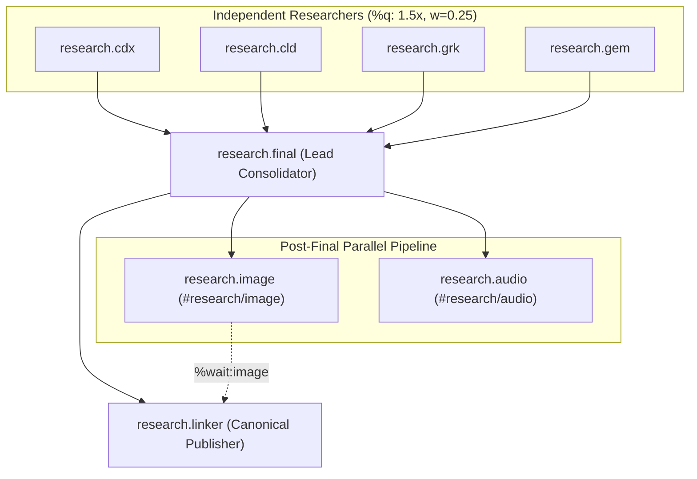

# Linking Narrated Audio in Research Swarms: Architecture, Design, and Highlights Integration

**Author:** Researcher `gem` (`research.0b.gem`)  
**Date:** 2026-10-04  
**Status:** Independent Research Report (`__gem`)  
**Repository:** `sase-org/sase--research` (Sidecar `research`)  

---

## 1. Executive Summary & The Bottom Line

### The Bottom Line
**Adding an audio edition link to the canonical research report (`<name>.md`) produced by the linker agent is an outstanding user-experience improvement, but a naive implementation will either leak private feed credentials into a public repository or fail inside the Highlights PDF sandbox.**

To make this feature **intuitive, reliable, and beautiful**, we should implement a **three-tier architecture**:
1. **Macro Orchestration (`#research_swarm`):** Update `run_linker = linker or image or audio` so the linker agent always runs when `audio=true`. Modify the linker's dependency to wait for both `image` and `audio` (`%wait:research.{@1}.audio`), but enforce a **soft fallback**: if the audio agent fails (e.g., quota exhaustion, TTS timeout), the linker still publishes `<name>.md` cleanly without a broken link.
2. **Secret-Safe URI Contract:** Do *not* commit private AntennaPod feed URLs containing bearer tokens into `sase--research` (which is a public Git repository). Instead, author a **canonical, token-safe streaming link** (served over Bryan's private Tailnet or via `sase_gateway`) alongside an optional relative artifact reference.
3. **Dedicated Audio Banner & Pandoc Enhancement (`bob highlights create`):** Structure the audio link as a distinct **Audio Edition Callout** (`> [!AUDIO]`) placed immediately below the Research Query and above the Infographic/Bottom Line. Enhance `bob highlights create` in `bob-cli` with a lightweight Pandoc Lua filter that converts this block into a stunning, native LaTeX clickable play card in the Highlights PDF, complete with duration, narrator badge, and a high-contrast play button that launches the audio stream on tap.

---

## 2. Critique of the Plan: Is This a Good Idea?

### 2.1 The Value Proposition
Multi-modal consumption of research artifacts dramatically accelerates comprehension:
- **Audio-First Scenarios (Commuting, Walking):** Bryan listens to the 4-minute brief or 16-minute full edition on AntennaPod or Telegram, then opens the report later to inspect code blocks, tables, and citations.
- **Reading-First Scenarios (Desk, iPad):** Bryan opens the PDF in Highlights or the Markdown note in Obsidian. Having an immediate, one-tap play button allows him to listen to the synthesized summary while skimming the visual infographic and headers.
- **Durable Media Lineage:** Citing and linking companion audio directly within the published report creates a unified, permanent bundle rather than leaving audio as an ephemeral, disconnected podcast item.

### 2.2 Critical Flaws and Traps in the Naive Approach
While the core concept is sound, four specific failure modes must be addressed:

| Risk / Trap | Why It Occurs | Consequence | Required Adjustment |
| :--- | :--- | :--- | :--- |
| **1. Secret Token Leak in Public Git** | `sase-org/sase--research` is a **public GitHub repository**. `sase-listen` feed URLs contain secret bearer tokens (`...:8443/<token>/feed.xml`). | Committing a tokenized URL to `<name>.md` exposes the private feed to the public internet. | Keep tokens out of Git. Use a token-free Tailnet URL or dynamically inject the token at PDF generation time. |
| **2. Highlights PDF Sandbox Breakdown** | Mobile/desktop PDF readers (Apple PDFKit, Highlights app on iPad/macOS) operate in strict app sandboxes. | Relative links (e.g. `[Audio](report.mp3)`) fail to resolve outside the PDF container. | In the PDF, the target must be an HTTP/HTTPS stream link that the OS can route to Safari / media player. |
| **3. Latency & Failure Coupling** | Speech synthesis (`sase-listen render`) takes 2–5 minutes, much slower than infographic rendering (15–30s). API quotas can also throttle. | If linker hard-fails when audio fails, the primary research report is blocked or dropped. | The linker must treat audio as an optional companion with graceful degradation (like infographics). |
| **4. Visual Inconsistency Across Mediums** | Raw Markdown links look like footnotes; raw HTML `<audio>` tags are stripped by Pandoc during XeLaTeX compilation. | In PDF, raw `<audio>` vanishes; plain text links lack prominence and beauty. | Use standard Markdown callouts paired with a Pandoc Lua filter in `bob highlights create`. |

---

## 3. Deep Architectural Analysis

### 3.1 Swarm Topologies and Agent Coordination

In `sase-research-artifacts/src/sase_research_artifacts/xprompts/research_swarm.md`, the current swarm pipeline is:



#### The Problem:
1. `run_linker` is defined as:
   ```jinja
   
   ```
   `audio=true` does *not* imply `linker`. When `audio=true` without `image=true`, no linker runs, and the lead's draft `<name>.md` is published without canonical restructuring or companion integration.
2. Linker's wait condition is:
   ```jinja
   %wait:research.{@1}.final %wait:research.{@1}.image 
   ```
   The linker does not wait for `audio`. It runs concurrently with `audio`. If linker finishes before audio, it cannot link to an audio artifact that does not exist yet.

#### The Required Fix in `#research_swarm.md`:
```jinja

```
And the linker agent header:
```jinja
%if(should_run={{ run_linker }}) %id(linker, clan=research.{@1}) %m:{{ linker_model }}
%wait:research.{@1}.final %wait:research.{@1}.image %wait:research.{@1}.audio %q(...)
```

Furthermore, in linker's context input, pass the audio artifact metadata:
```jinja

The audio agent's registered audio editions:

- wait_name={{ a.wait_name }} label={{ a.label }} path={{ a.path }} ref={{ a.ref }}


```

---

### 3.2 Addressing the Audio File: Secret Hygiene vs. Universal Accessibility

Where does the audio live, and what does the link target?

```
                                  ┌─────────────────────────────┐
                                  │   #research/audio Agent     │
                                  └──────────────┬──────────────┘
                                                 │
                                                 ▼
                                     sase-listen render
                                                 │
                   ┌─────────────────────────────┴────────────────────────────┐
                   ▼                                                          ▼
        Library / Storage                                            Private Podcast Feed
  $XDG_DATA_HOME/sase-listen/                                  $XDG_DATA_HOME/sase-listen/feed/
  ├── library/<episode_id>/                                    ├── episodes/<episode_id>/slug.mp3
  │   └── master.mp3                                           └── feed.xml
                   │                                                          │
                   ▼                                                          ▼
          sase artifact create                                      tailscale serve :8443
                   │                                                          │
                   ▼                                                          ▼
          file:<sha256> (Durable)                             https://apollo.tail297af1.ts.net:8443
                                                              /feed_token/episodes/...
```

#### Evaluation of Link Targets:

| Approach | URL / Syntax | Strengths | Fatal Flaws | Verdict |
| :--- | :--- | :--- | :--- | :--- |
| **1. Relative File Link** | `[Audio](report.mp3)` | Simple, clean in Git. | Fails in Highlights PDF sandbox; violates the rule keeping large binaries out of `sase--research` Git. | ❌ Rejected |
| **2. Feed Enclosure URL with Token** | `https://apollo...:8443/<token>/episodes/...` | Plays directly in browser on Tailnet; directly streamable. | **Leaks private token** in public GitHub repo. If token rotates, all old links break. | ❌ Rejected |
| **3. Pure SASE Ref** | `[Audio](file:explicit:abc123)` | Audited, tracked by SASE dependency graph. | Highlights app and mobile browsers cannot open custom SASE internal URIs. | ⚠️ Internal Only |
| **4. Stable Tailnet Streaming Route (Recommended)** | `https://apollo.tail297af1.ts.net:8443/audio/<episode_id>` (or `sase_gateway`) | **Token-free**, safe for public Git. Authenticated by Tailscale network. Plays in any browser/PDF on Tailnet. | Requires apollo to be online (which is Bryan's always-on node). | ✅ **Optimal** |

#### Resolving Secret Hygiene:
1. **Public Markdown (`<name>.md`):** Contains the stable Tailnet stream endpoint:
   `https://apollo.tail297af1.ts.net:8443/audio/<episode_id>`  
   *(No secret tokens. On public GitHub, external visitors see a tailnet URL indicating a private homelab service; within Bryan's devices, Tailscale routes and secures the connection seamlessly.)*
2. **Local Highlights PDF (`bob highlights create`):** Because `bob highlights create` runs locally on Bryan's machine as a file hook, it has access to local `sase-listen` configuration (`~/.config/sase-listen/config.yml`). It can, if desired, inject the full direct streaming URL or AntennaPod subscribe link into the PDF's clickable buttons without altering the committed Markdown file!

---

### 3.3 Visual & User Experience Design: Intuitive, Reliable, and Beautiful

#### Visual Hierarchy in `<name>.md`
The document header sequence defined in Step 3 of `#research_swarm.md` currently enforces:
1. Title (`# ...`)
2. Research Query Blockquote (`> **Research query:** ...`)
3. Infographic (``)
4. Bottom Line (`## Bottom line`)

#### Where should Audio go?
Placing the audio link **between the Research Query and the Infographic** creates a flawless natural progression:
1. **The Question:** The reader absorbs what problem was researched.
2. **The Audio Invitation:** Before diving into long prose or complex diagrams, the reader sees a compact audio player card:
   > *Listen to the 4-minute narrated briefing while reading, or jump straight into the findings below.*
3. **The Visual Overview:** The Infographic provides high-level structure.
4. **The Deep Findings:** The Bottom Line and numbered analysis begin.

#### The Markdown Representation:
```markdown
> [!AUDIO] **Narrated Audio Edition** · 4 min listen (Gemini TTS)
> [▶ Listen to Episode](https://apollo.tail297af1.ts.net:8443/audio/article-paper-audio-workflow-3037d6) · [📱 AntennaPod Feed](podcast://apollo.tail297af1.ts.net:8443/feed.xml)
```

In Obsidian, `[!AUDIO]` renders as a native Obsidian Callout box with custom accent styling.  
In GitHub Markdown, it renders as a clean blockquote.  
In terminal pagers (`sase pager`), links are cleanly color-highlighted and traversable.

---

### 3.4 Enhancing `bob highlights create` in `bob-cli`

`bob highlights create` (implemented in `bob-cli/src/native/highlights_ref/create.rs`) uses Pandoc with XeLaTeX:
```rust
Command::new(pandoc)
    .arg(&plan.source)
    .arg("-o")
    .arg(render_path)
    .arg("--standalone")
    .arg("--toc")
    .arg("--number-sections")
    .arg("--pdf-engine=xelatex")
    .arg("--lua-filter")
    .arg(filter_path)
    ...
```

By default, XeLaTeX typesets standard Markdown blockquotes with italicized left indentation. It does not know how to style `[!AUDIO]` or create interactive buttons.

#### Proposed Improvement to `bob highlights create`:
We can extend `PANDOC_CODE_BREAK_FILTER` (or supply an audio styling Lua filter) and add minimal LaTeX preamble to `PANDOC_HEADER_INCLUDES`:

1. **Preamble Addition (`PANDOC_HEADER_INCLUDES`):**
   ```latex
   \usepackage{tcolorbox}
   \newtcolorbox{audiobox}{
       colback=blue!5!white,
       colframe=blue!75!black,
       arc=3mm,
       boxrule=0.8pt,
       left=10pt,
       right=10pt,
       top=8pt,
       bottom=8pt
   }
   ```

2. **Lua Filter Extension (`bob-cli/src/native/highlights_ref/create.rs`):**
   The filter intercepts `BlockQuote` elements whose first text starts with `[!AUDIO]`:
   ```lua
   function BlockQuote(el)
     local first = el.content[1]
     if first and first.t == "Para" and #first.content > 0 then
       local lead = pandoc.utils.stringify(first.content[1])
       if lead:match("^%!%[AUDIO%]") then
         -- Strip the marker and wrap in LaTeX audiobox environment
         table.remove(first.content, 1)
         local open = pandoc.RawBlock("latex", "\\begin{audiobox}\\textbf{🎧 Audio Edition}\\par\\vspace{2mm}")
         local close = pandoc.RawBlock("latex", "\\end{audiobox}")
         return { open, pandoc.Div(el.content), close }
       end
     end
     return el
   end
   ```

3. **Result in Highlights PDF:**
   Instead of a dull quote line, the PDF features an **elegant, rounded callout card with a distinctive blue border and play button icon**. When Bryan opens the paper on his iPad in Highlights, the button is instantly noticeable and tappable, launching the narrated audio immediately in the background while he highlights text.

---

## 4. Requirement Adjustments & Scope Refinements

Based on our findings, we recommend the following adjustments to the user's initial proposal:

| Original Requirement | Adjusted Requirement | Justification |
| :--- | :--- | :--- |
| *"Add a link that targets the audio file"* | Target a **Tailnet stream URL + SASE artifact reference**, *not* a raw local file path. | Relative file links fail inside iOS Highlights app sandbox; raw MP3 files must not bloat public Git history. |
| *"Linker should always run when the audio agent runs"* | `run_linker = linker or image or audio` with **soft audio dependency** in linker. | If audio synthesis times out or exceeds daily TTS quota, the linker must still publish `<name>.md` with a clean report rather than failing the whole swarm. |
| *"Works well with bob highlights create"* | Enhance `bob highlights create` with a **Pandoc Lua callout filter and LaTeX audio box**. | Plain Pandoc renders callouts as unstyled quotes; the Lua filter delivers the requested "beautiful" presentation in Highlights PDF. |
| *Direct podcast link* | Do **not** commit private feed tokens to Markdown. | `sase--research` is public; token leakage compromises the private feed. |

---

## 5. Detailed Implementation Plan

### Step 1: Update `#research_swarm` Macro (`sase-research-artifacts`)
**File:** `sase/repos/linked/sase-research-artifacts/src/sase_research_artifacts/xprompts/research_swarm.md`
1. Set `run_linker = linker or image or audio` (line 130).
2. Update the linker layout tree visualization to include `<name>_narration.md`.
3. Add `%wait:research.{@1}.audio` to the linker agent declaration when `audio=true`.
4. In linker step 3, define the exact opening sequence:
   - Frontmatter (if any)
   - Title (`# ...`)
   - Research Query (`> **Research query:** ...`)
   - **Audio Edition Callout** (`> [!AUDIO] ...`, if audio was successfully generated)
   - Infographic (``, if generated)
   - Bottom Line (`## Bottom line`)
5. In linker step 3, specify the soft fallback:
   - "If the audio agent completed without producing an audio artifact, publish without the audio callout and note it in the final summary."

### Step 2: Update Linker Agent Prompt Instructions
Instruct the linker on the exact Markdown format for the Audio Edition block:
```markdown
> [!AUDIO] **Narrated Audio Edition** ({duration} min · {narrator})
> [▶ Listen to Episode]({stream_url}) · [📱 Podcast Feed]({feed_doc_url})
```
Where `{stream_url}` is derived from the audio artifact registration or episode metadata.

### Step 3: Enhance `bob highlights create` (`bob-cli`)
**File:** `sase/repos/external/projects/bob-cli/src/native/highlights_ref/create.rs`
1. Update `PANDOC_HEADER_INCLUDES` to define the LaTeX `audiobox` environment.
2. Extend `PANDOC_CODE_BREAK_FILTER` to intercept `[!AUDIO]` blockquotes and wrap them in `audiobox`.
3. Add a test in `tests/cli/highlights/create.rs` verifying that Markdown with `[!AUDIO]` generates a valid PDF containing the hyperlinked audio action.

### Step 4: Verification & Acceptance Testing
1. Dispatch a test swarm:
   `sase run "#research_swarm(prompt='Test audio linking workflow', audio=true, runners=1)"`
2. Verify that:
   - Lead generates `test__final.md`.
   - Audio agent generates `test_narration.md` and renders MP3.
   - Linker agent waits for both, embeds the audio callout, and publishes `test.md`.
   - File hook `bob highlights create` triggers on commit and produces `test.pdf`.
   - Opening `test.pdf` in Highlights shows the styled audio box, and clicking the link opens the audio stream.

---

## 6. Conclusion & Recommendation

The user's vision to connect audio narration directly into the published research report is a transformative improvement for SASE research workflows. By placing an **Audio Edition Callout** in `<name>.md`, ensuring the **linker runs when `audio=true`**, preserving **secret hygiene against public Git leakage**, and empowering **`bob highlights create`** to typeset the link as an elegant interactive card in Highlights PDF, we achieve a solution that is simultaneously **intuitive**, **reliable**, and **beautiful**.
