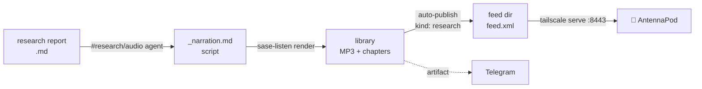

# 🎧 Research → AntennaPod: Private Podcast Setup

> **Goal:** narrate a `research` report with `sase-listen` and have it arrive in AntennaPod on
> the Pixel. Do it by hand once, then let every `#research_swarm(…, audio=true)` do it for you.
>
> **Bottom line:** most of this is already set up on apollo. Five things are missing: a paid
> TTS quota, a **fresh feed token** (the current one leaked), removing a placeholder episode,
> serving the feed, and subscribing on the phone. The swarm automation needs **no extra
> config** because `auto_publish: true` is already on. When you finish, close bead `sase-1ej`,
> which tracks this unfinished rollout.

_Checked live on apollo, 2026-10-02 · sase-listen 0.1.0 · sase-research-artifacts 0.3.0 ·
Tailscale 1.102.3_

---

## Where you stand

|     | Piece             | State (checked on apollo)                                                                                                                    |
| --- | ----------------- | -------------------------------------------------------------------------------------------------------------------------------------------- |
| ✅  | `sase-listen`     | 0.1.0 installed. `sase-listen doctor` passes.                                                                                               |
| ✅  | Feed config       | `base_url: https://apollo.tail297af1.ts.net:8443`, token set, `auto_publish: true`                                                           |
| ✅  | Swarm audio stage | sase-research-artifacts 0.3.0 ships `audio=true` and `#research/audio`. sase-telegram 0.4.24 sends audio.                                    |
| ✅  | Tailnet           | apollo has HTTPS certs and the `funnel` attribute (ports 443, 8443, 10000). `pixel-10-pro-xl` is online.                                     |
| ❌  | Feed served       | Nothing is listening on `:8443`. (`:443` is the tailnet-only `sase_gateway`.)                                                               |
| ❌  | Feed contents     | It has one episode: yesterday's **tone-engine placeholder** (12 min of beeps).                                                               |
| ⚠️  | TTS quota         | On 2026-10-01 the Gemini key was **free tier, 10 requests/day**. One episode needs 9–20 requests.                                           |
| ❌  | Feed token        | The current token was **printed in public bead note `sase-1e3.12` #6**, and the config hasn't changed since. It has to be rotated.          |
| ⚠️  | Secret hygiene    | The chezmoi source `home/dot_config/sase-listen/config.yml` is **untracked**, has the token inline, and the dotfiles repo is **public**.     |

## How it flows



---

## Part 1 · One-time setup on apollo

### 1. Get a narrator quota that can finish an episode

Turn on billing for the Google Cloud project behind `gemini_cli_api_key`: in AI Studio, open
**API keys**, select the key's project, and click **Set up billing**. On the free tier,
yesterday's real render stopped partway through its first episode. Check the quota:

```bash
printf '# Quota check\n\nOne, two, three.\n' > /tmp/quota_check.md
sase-listen render /tmp/quota_check.md -n gemini --no-publish   # exit 0 ✅   exit 4 = still throttled
```

> [!TIP]
> If you don't want to enable billing, set `narrator: openai` in the config. An OpenAI key is
> already detected. At Gemini's current price, an edited ~11-minute edition costs about
> **$0.15**.

### 2. 🔒 Rotate the feed token and move it into `pass`

The secret path is the feed's only password, and the current one is public. Store a fresh token
in `pass` so it never lands in the public dotfiles repo:

```bash
python3 -c 'import secrets; print(secrets.token_urlsafe(24))' \
  | pass insert -m sase_listen_feed_token        # same generator `feed init` uses

chezmoi edit ~/.config/sase-listen/config.yml
#   feed:
#     token: …                                    ← delete this line
#     token_command: pass show sase_listen_feed_token
chezmoi apply && sase-listen feed rebuild && sase-listen doctor   # expect: ok: feed:token (set)
```

`rebuild` matters because `feed.xml` embeds the token in every enclosure URL. After that it's
safe to commit `home/dot_config/sase-listen/` to chezmoi. The Gemini key already uses the same
`pass` pattern.

> [!WARNING]
> Epic `sase-1e3`'s pending landing tale also plans to rotate this token. A second rotation
> after you subscribe would break the phone's URL, so tell it the rotation is done:
> `sase bead note sase-1e3 "Feed token rotated and moved to pass by hand; landing tale must not rotate it again"`.

### 3. Remove the placeholder episode

```bash
sase-listen unpublish commute-audio-from-markdown-fa2598
```

Otherwise the first thing AntennaPod downloads is the tone-engine dry run. The library keeps a
copy.

### 4. Serve the feed to your tailnet

```bash
FEED_URL=$(sase-listen feed --show-url --json | jq -r .url)
TOKEN=$(basename "$(dirname "$FEED_URL")")
sudo tailscale serve --bg --https=8443 --set-path="/$TOKEN" "$HOME/.local/share/sase-listen/feed"

tailscale serve status            # :443 → sase_gateway   :8443/<token> → feed dir
curl -fsS "$FEED_URL" | head -c 200   # should start with <?xml … <rss
```

`--bg` keeps the config across reboots. You need `sudo` because apollo has no Tailscale
operator set.

> [!NOTE]
> **Why `serve` and not `funnel`?** The sase-listen docs default to Funnel, which serves the feed
> on the public internet behind a secret path so the phone doesn't need a VPN. Your phone is now
> on the tailnet, so Serve gives you the same URL with **no public exposure**. If you'd rather not
> keep the VPN on all the time, change one word:
> `sudo tailscale funnel --bg --https=8443 --set-path="/$TOKEN" "$HOME/.local/share/sase-listen/feed"`.
> apollo already has the funnel attribute, and nothing else changes.

## Part 2 · One-time setup on the phone

### 5. Keep Tailscale running in the background

AntennaPod fetches feeds **on the phone**, so the phone itself has to reach apollo.

- **Settings → Network & internet → VPN → Tailscale ⚙ → Always-on VPN: on.** Leave _Block
  connections without VPN_ off.
- **Settings → Apps → Tailscale → App battery usage → Unrestricted.**

### 6. Subscribe in AntennaPod

- **a.** On apollo, run `sase-listen feed --qr`. The QR encodes the full secret URL. Scan it with
  the Pixel camera and tap **Copy**.
- **b.** In AntennaPod, open **☰ → Add podcast → Add podcast by RSS address**, paste the URL, and
  tap **Subscribe**.
- **c.** On the podcast page, open **⚙ settings** and set **Auto download → on** and **New
  episodes action → Add to queue**.
- **d.** Under **Settings → Downloads**, set a feed refresh interval (for example, hourly) and
  turn on **Automatic download**. Restrict it to Wi-Fi if you like.

## Part 3 · First episode, by hand

Run these from the sase checkout (`~/projects/github/sase-org/sase`). `research:` refs only
resolve inside a sase project. From `~` you get `unknown_kind`.

### 7. Render the report you pick

**A · Agent-narrated (recommended). This is the same path `audio=true` uses.**

```bash
sase run "#research/audio @research:<YYYYMM>/<name>/<name>.md"
# shorter cut: "#research/audio(edition=brief) @research:…"   ≈ 4 min instead of ≈ 16
```

The agent writes `<name>_narration.md` next to the report, lints it against the source, and
renders it. Because the script is `kind: research` and `auto_publish` is on, the episode
**publishes to the feed automatically**. The MP3 also shows up in Telegram.

**B · Plain `sase-listen` (no agent, reads the report verbatim)**

```bash
sase-listen render research:<YYYYMM>/<name>/<name>.md --dry-run   # chunks · minutes · $
sase-listen render research:<YYYYMM>/<name>/<name>.md --publish
```

Plain Markdown is `kind: document`, so you have to pass `--publish`. Expect a longer and rougher
episode. A dry run of the commute-audio report came out at **26.5 min, 20 chunks, ≈ $0.36**. It
dropped big tables and read `×`, `→`, and `≈` aloud. It also mangles dollar amounts:
`It costs $4.80 (list $0.08 per 1K) today.` comes out as `It costs 0.08 per 1K) today.`

> [!TIP]
> **Can't decide on a report?** The commute-audio report already has a linted narration script,
> and `sase-1ej` says the cache already holds 8 of its chunks (the dry-run plan has 9), so
> finishing it costs a few cents. Narration files aren't valid `research:` refs, so pass the
> path:
>
> ```bash
> sase-listen render "$(sase repo path research --ensure)/202610/commute_audio_from_markdown/commute_audio_from_markdown_narration.md" -n gemini --publish
> ```

### 8. Confirm delivery

```bash
sase-listen feed       # Episodes: 1 · fresh "Last build"
```

In AntennaPod, pull down to refresh the podcast. The episode should download, and its chapters
appear in the player.

## Part 4 · Automatic from now on

### 9. Launch research swarms with `audio=true`, from apollo

```bash
sase run '#research_swarm(prompt="<topic>", audio=true, image=true)'
```

- `audio=true` adds a `<clan>.audio` agent. It waits for the lead (and the linker, if one runs),
  forks the lead, and runs the same `#research/audio` flow as **7A**. The render auto-publishes,
  and AntennaPod picks the episode up on its next refresh.
- `image=true` is optional. It makes the infographic the episode's cover art, and it implies the
  linker.

> [!IMPORTANT]
> **To keep it hands-off:**
>
> - Launch from **apollo**. The feed directory is local to apollo, so an audio agent dispatched to
>   athena would publish to athena's feed, which nothing serves.
> - Keep billing on (step 1). On a quota error the audio agent exits 4 with a resume hint, and it
>   never switches narrators on its own. Synthesized chunks are cached, so a retry costs only the
>   chunks that are left.
> - The swarm always renders the `full` edition (≈ 16 min). There is no `audio_edition` input
>   yet.

---

## If something's off

| Symptom                                    | Likely cause                                        | Fix                                                        |
| ------------------------------------------ | --------------------------------------------------- | ---------------------------------------------------------- |
| `unknown_kind` resolving `research:…`      | Ran outside a sase project                          | `cd ~/projects/github/sase-org/sase`                       |
| AntennaPod: host not found / timeout       | Tailscale is off on the phone                       | Step 5, or switch to Funnel (step 4 note)                  |
| AntennaPod: 404                            | The token changed after you subscribed              | Re-run step 4, then re-subscribe with `sase-listen feed --qr` |
| `render` exits **4**                       | TTS quota                                           | Step 1, then re-run the same command (chunks are cached)   |
| `render` exits **3**                       | Credentials or config                               | `sase-listen doctor`                                       |
| Rendered, but not in the feed              | Plain Markdown is `kind: document`                  | `sase-listen publish --latest`                             |

## Sources

- **sase-listen** (gh:sase-org/sase-listen @ `d74633a`): `docs/podcast-feed.md`,
  `docs/field-notes.md` (the 2026-10-01 rollout on apollo: free-tier quota, Funnel deliberately
  not opened yet), `docs/configuration.md`, and `docs/cli.md`. In the code, `pipeline.py` makes
  the publish decision (`auto_publish and kind == "research"`) and `cli/feed_cmd.py` shows that
  the QR encodes the unmasked URL.
- **sase-research-artifacts 0.3.0**: `xprompts/research_audio.md`, `xprompts/research_swarm.md`
  (the `audio` / `audio_model` inputs and the `.audio` segment), and the README.
- **Prior research:** `research:202610/commute_audio_from_markdown/commute_audio_from_markdown.md`
  covers why there's a private RSS feed, why port `:8443`, and AntennaPod chapter support.
- **Beads:** `sase-1ej` (the unfinished rollout: quota, Funnel never proposed, 8 cached
  chunks) and the land-triage note on `sase-1e3` (token leaked in `sase-1e3.12` #6; don't commit
  the plaintext chezmoi config).
- **Live checks on apollo:** `sase-listen doctor` / `feed` / `config`, `tailscale status`,
  `tailscale serve status`, and `tailscale funnel status`; `chezmoi verify` and
  `chezmoi git status` on the config; `gh repo view bbugyi200/dotfiles` (public); and a dry-run
  render of a `research:` ref.
