# 🎧 Web Article → AntennaPod with `sase-listen`

> **Bottom line:** run one command on athena (or apollo):
> `sase-listen render <URL> -e full`. It fetches the article, has Gemini write a narration
> script, synthesizes and masters the MP3, and auto-publishes it to the apollo feed your
> AntennaPod already subscribes to. Nothing else needs to be set up.

_Checked live on athena, 2026-10-05 · sase-listen 0.1.0 (includes epic `sase-1g7`) ·
`sase-listen doctor` all ok, `feed:host (apollo via apollo · 11 episodes)`. The Symphony
article was fetched and extracted in a scratch dir (no API calls, nothing published)._

---

## TL;DR: the Symphony article

```bash
URL=https://openai.com/index/open-source-codex-orchestration-symphony/

sase-listen doctor              # expect: ok: feed:host (apollo via apollo · …)
sase-listen render "$URL" -e full
```

Then pull to refresh the **SASE Listen** feed in AntennaPod. The new episode is titled
_"An open-source spec for Codex orchestration: Symphony. (Full)"_. Its notes include the
original openai.com link and the coverage sentence "A full-length narrated adaptation of the
whole article — not a word-for-word reading."

**Cost:** about **$0.19 of Gemini TTS** for roughly 14 minutes of audio, plus one to three
Gemini Pro writer calls. The estimate is scaled from a dry run that cost $0.216 for this
article's 2,398-word verbatim reading. For comparison, the harness-engineering full edition
was 1,996 words, 13.1 minutes, and about $0.18.

### Optional: review the script before paying for audio

```bash
sase-listen script "$URL" -e full -o ~/symphony_full_narration.md   # Gemini writes it (also cached)
$EDITOR ~/symphony_full_narration.md
sase-listen render ~/symphony_full_narration.md --dry-run           # chunk plan + cost, no TTS
sase-listen render ~/symphony_full_narration.md                     # still auto-publishes (kind: article)
```

---

## How it works

```mermaid
flowchart LR
  U["article URL"] -->|"local fetch<br/>(Chrome-impersonating)"| H["page.html"]
  H -->|"Trafilatura +<br/>outline repair"| M["source.md<br/>source.json"]
  M -->|"Gemini writer<br/>+ lint/repair"| S["full_narration.md"]
  S -->|"Gemini TTS, gates,<br/>mastering"| E["library episode<br/>MP3 · chapters · cover"]
  E -->|"tar over SSH<br/>apollo → apollo-do"| A["apollo<br/>feed receive → feed.xml"]
  A -->|"tailscale serve :8443"| P["📱 AntennaPod"]
```



| #   | Stage       | What happens                                                                                                                                                                                                                                                                                                                  |
| --- | ----------- | ----------------------------------------------------------------------------------------------------------------------------------------------------------------------------------------------------------------------------------------------------------------------------------------------------------------------------- |
| 1   | **Fetch**   | Runs on the local machine through `curl_cffi` impersonating Chrome, which gets past the Cloudflare challenge that blocks plain curl or httpx on openai.com. Only `text/html` is accepted. PDFs and pages under 150 extracted words are rejected. No hosted reader ever sees the URL.                                           |
| 2   | **Extract** | Trafilatura converts the page to Markdown and extracts metadata (title, author, date, site). Outline repair re-inserts H2/H3 headings that Trafilatura dropped. Everything is stored in `~/.local/share/sase-listen/sources/<slug>-<urlhash>/`, and later runs reuse it (offline, same script) unless you pass `-r/--refresh`. |
| 3   | **Write**   | For `brief`/`full`, `gemini-3.1-pro-preview` gets the packaged narration guide plus article rules (third person, no added opinions, never speak the URL) and returns only the body. sase-listen adds the frontmatter (`kind: article`, `source: <url>`) and lints the script against the source, including the check that every number appears in the source. It makes up to 3 repair attempts, then caches the script as `<edition>_narration.md` with a `<edition>_writer.json` provenance record. `verbatim` skips the AI and uses deterministic normalization. |
| 4   | **Render**  | This is the same pipeline research reports use: Gemini TTS (`gemini-3.8-flash-tts`, voice Charon), a chunk cache, pacing and silence gates, −16 LUFS mastering, and an MP3 with embedded chapters and a cover. The spoken intro says "…by &lt;author&gt; at &lt;site&gt;, published &lt;date&gt;." The episode lands in `~/.local/share/sase-listen/library/<episode-id>/`. |
| 5   | **Publish** | `kind: article` with `feed.auto_publish: true` means the episode publishes automatically. athena's config says `feed.host: apollo`, so athena is a _remote_ renderer: it streams a tar (MP3, cover, chapters, script, manifest) over SSH to `sase-listen feed receive` on apollo, trying `apollo` first and then `apollo-do`. apollo validates the tar, imports it into its own library, and rebuilds `feed.xml` under a lock. The feed token never leaves apollo. |
| 6   | **Serve**   | apollo's tailnet-only `tailscale serve` exposes `https://apollo.tail297af1.ts.net:8443/<token>/feed.xml`, which AntennaPod polls.                                                                                                                                                                                              |

## Editions

| Edition (`-e`)    | What you get                                                                                                                                                              | Title suffix | Symphony                                         |
| ----------------- | ------------------------------------------------------------------------------------------------------------------------------------------------------------------------- | ------------ | ------------------------------------------------ |
| `brief` (default) | AI briefing: the article's question, answer, deciding evidence, and takeaway. About 600 words in 2–3 chapters (about 4 minutes).                                          | `(Brief)`    | ~4 min                                           |
| `full`            | AI adaptation of every major section, in order. 4–8 chapters, at most 2,400 words and below about 90% of the source's length. It is **not** a transcript.                  | `(Full)`     | ≤ ~2,100 words, ~14 min                           |
| `verbatim`        | The article text itself, read aloud. Code, tables, and figures are omitted. No AI is involved.                                                                            | `(Reading)`  | 2,398 words, 16 min, **1 chapter** (see below)   |

Each edition is a separate episode, because its id comes from the URL plus the edition. You
can publish `brief` and `full` side by side, and re-rendering an edition replaces it in place.

## Caveats for this article (from the live probe)

- **Fetch is fine:** HTTP 200, 2,364 words, author _Alex Kotliarskyi_, site _OpenAI_, date
  2026-04-27.
- **Use `full`, not `verbatim`.** The page's 8 sections are `<h3>` headings and it has no
  `<h2>`. The verbatim normalizer only turns `##` headings into chapters, so a verbatim render
  would be one 16-minute chapter with no chapter skipping (lint W008). Brief and full are
  unaffected because the writer creates its own `##` chapters. This limitation is tracked as
  bead `sase-1gl`.
- **Cosmetic:** the page's metadata title ends in a period, so the episode title reads
  "…Symphony. (Full)".

## Where it runs

- **athena:** works today. This machine has the remote role and publishes via apollo.
- **apollo:** the same command works. It publishes locally because apollo is the feed host.
- **Mac:** not set up yet. Install, config, and credentials are tracked by task `sase-1gc`.
- **Fallback from anywhere:** `ssh apollo '~/.local/bin/sase-listen render <URL> -e full'`.
  This works because URLs don't depend on which machine fetches them. apollo is a small
  droplet, though, so prefer rendering locally.
- **Upgrades:** athena's install is a non-editable directory install from a SASE workspace
  checkout, so it trails master. For example, it lacks `render -g`. To upgrade, run
  `uv tool install --force git+https://github.com/sase-org/sase-listen`, and always upgrade
  apollo first.

## When something goes wrong

| Symptom                                                    | Fix                                                                                                                                                                                                                                                          |
| ---------------------------------------------------------- | ------------------------------------------------------------------------------------------------------------------------------------------------------------------------------------------------------------------------------------------------------------ |
| Bot-challenge / blocked page (exit 1)                      | Save the page from a browser (HTML only), then run `sase-listen render "$URL" -e full -H page.html`.                                                                                                                                                         |
| `Auto-publish to apollo failed (…); queued`                | The episode was built and is safe in the local outbox (`~/.local/state/sase-listen/outbox/`). When apollo is reachable, run `sase-listen publish --pending`.                                                                                                  |
| Exit 4 with Gemini TTS `content_blocked`                   | The TTS safety filter rejected one chunk; this happened once in the harness-engineering run. Reword the offending sentence in the script (`render --json` reports `script_path`, which is `…/sources/<slug>/full_narration.md`), then re-render. Cached chunks are reused. |
| Exit 3 (credentials)                                       | The writer and TTS use `pass show gemini_cli_api_key`, so `pass`/gpg must be unlocked. `sase-listen doctor` names the key source without printing it.                                                                                                       |
| You want a fresh fetch or script                           | Add `-r/--refresh`. This re-fetches the page and re-runs the writer, so it costs writer tokens again.                                                                                                                                                       |
| Don't want it on the phone                                 | Render with `--no-publish`. After the fact, run `sase-listen unpublish <episode-id>`; the library keeps its copy.                                                                                                                                           |

## Sources

- Epic `sase-1g7` and its plan `plan:202610/listen_urls_any_machine.md`.
- sase-listen docs: `docs/web-articles.md`, `docs/multi-machine.md`, `docs/podcast-feed.md`,
  `docs/cli.md`, and `docs/field-notes.md` (the 2026-10-05 harness-engineering rollout).
- sase-listen code: `web/fetch.py`, `web/extract.py`, `web/store.py`, `writer/author.py`,
  `writer/prompt.py`, `pipeline.py` (`load_source`, auto-publish), and `feedhost.py`.
- Phone and feed setup: `research:202610/sase_listen_antennapod_setup.md`.
