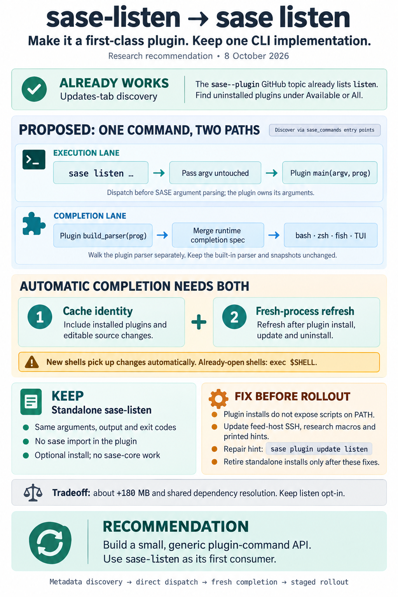

# Making sase-listen a first-class SASE plugin: plugin commands, completion, and the Updates tab

> **Research query:** How should sase-listen become a first-class sase plugin, with sase
> plugins gaining a way to define subcommands so that sase-listen can provide a
> `sase listen` command that works exactly like `sase-listen` but supports sase's CLI
> completion (updated automatically when such a plugin is installed), and with the plugin
> shown on the SASE Admin Center's "Updates" tab (its repo already carries the
> `sase--plugin` GitHub label) so users can manage its installation like other sase
> plugins? Is this plan a good idea, would a different approach be better, which
> requirement adjustments are justified, and what is the recommended solution?



## Bottom line

- **Yes, do it. But reshape the work.** sase-listen belongs in the plugin catalog, on the
  Updates tab, and behind `sase listen`. Keep the standalone `sase-listen` binary and keep
  the rule that sase-listen never imports `sase`. (See the [critique](#critique-of-the-plan).)
- **One of the four requirements is already met.** `sase--plugin` is a GitHub
  repository **topic**, not a label, and it is set on `sase-org/sase-listen`.
  `sase plugin show listen` already shows a **BUILT-IN** row: latest v0.1.1, not
  installed, with the hint `sase plugin install listen`. The Updates tab projects the same
  catalog, so no TUI work is needed for display. (See
  [the catalog and the Updates tab](#catalog-and-installed-status-on-the-updates-tab).)
- **The real work is in three places:**
  - a small, generic plugin-command mechanism;
  - two existing [completion gaps](#how-completion-works-and-its-two-gaps):
    - the grammar cache key ignores plugins;
    - plugin install, update and uninstall never refresh completion;
  - migrating call sites that assume `sase-listen` is on `PATH`, because plugin installs
    do **not** put plugin console scripts on `PATH` (see
    [PATH is the easily missed issue](#path-is-the-easily-missed-issue)).
- **Recommended solution: adopt a generic, metadata-declared `sase_commands`
  plugin-command mechanism, with sase-listen as its first consumer.** (Details in
  [Recommended solution](#recommended-solution).)
  - **Contract.** A new `sase_commands` entry-point group. sase discovers it from metadata
    only, without importing the plugin.
  - **Execution.** sase routes `sase listen …` through a pre-argparse fast path, handing
    the untouched argv to the **plugin's own `main(argv, prog)`** before sase's argparse
    runs. Parity holds by construction, and the call skips the ~0.9 s full-parser build.
  - **Completion.** sase walks the plugin's parser **separately** and merges that subtree
    into the *runtime* completion spec, which feeds bash, zsh, fish and the TUI `:` line.
    It is never grafted into `create_parser()`.
  - **Freshness.** Plugin identity goes into the completion cache key, and a completion
    refresh runs in a fresh child process after every plugin mutation. Together these make
    completion update automatically: immediately for new shells, and after `exec $SHELL`
    for open ones.
  - **Updates tab.** The topic already lists listen, so verify the row, add the
    `sase_commands` capability, and fix the inventory drift. No row work is needed.
  - **sase-listen's side.** About 20 lines of adapter code exposing `main(argv, prog)` and
    `build_parser(prog)`, plus clean-up of the places that assume `sase-listen` is on
    `PATH`. It keeps its standalone `sase-listen` binary, and it still never imports sase.
  - **Pre-rollout fixes.** Before retiring the standalone tools:
    - fix the call sites that assume a `PATH` binary (feed host, research macros, hints,
      buildinfo repair command);
    - record that the "standalone, not a plugin" decision is superseded.

## What exists today

### Catalog and installed status on the Updates tab

- **Discovery.**
  - The catalog is a GitHub search for `topic:sase--plugin` (`plugins/_github_source_gh.py`).
  - Repos owned by `sase-org` are "built-in".
  - The short name is the repo name minus `sase-`, so `sase-listen` becomes `listen`.
  - The Updates tab (`PluginsBrowserPane`) projects this catalog. It has no plugin
    allowlist.
- **Scope filter.** The tab has `outdated / installed / available / all` scopes. An
  uninstalled plugin is not "outdated", so look under Available or All. If a machine's
  catalog cache predates the topic, refresh it with `r` or `sase plugin list -r`.
- **Install.**
  - Installing rebuilds `uv tool install sase --with <full set>` from the uv receipt.
  - `sase plugin install listen -n` already plans `--with sase-listen`.
  - After install, the existing heuristics mark it installed, because `sase-*`
    distribution names already count.
- **mus's report was stale on one point.** It saw "No plugin named 'listen'". That was
  index or cache latency right after the topic was added. Three other researchers and I
  confirmed the row exists.

### How sase dispatches commands

- **`entry.py` order.** Global options are stripped first (`consume_global_options`), then
  legacy root rewriting, then string fast paths (`bead`, `goal`, `completion candidates`,
  `completion ensure`, `run`), then `create_parser(only=parser_only_hint(argv))`. Last
  comes an `if args.command == …` chain ending in `Unknown command`.
- **The command set is closed.** `_COMMAND_REGISTRARS` is a static, lazy registry, and
  `tests/main/test_parser_narrowing.py` asserts that the root choices equal its keys.
- **Unknown names are expensive.** An unknown root word skips narrowing and builds the full
  tree. I measured ~0.87 s, against ~0.11 s for a narrowed command. Without a dedicated
  fast path, `sase listen …` would pay that on every call.

### How completion works and its two gaps

- **One spec feeds every surface.**
  - `completion/build.py` `build_spec()` walks argparse into a `CompletionSpec`.
  - The bash, zsh and fish emitters consume it.
  - The TUI `:` command line feeds the same JSON to the Rust `CommandLineGrammar`.
  - So a plugin subtree that gets into the spec appears everywhere.
- **How shells get the grammar.** Managed installs are thin loaders. They call
  `sase completion ensure <shell>`, which serves a grammar cached under a runtime identity
  key. The TUI spec cache uses the same key.
- **Gap 1: the cache key cannot see plugins.**
  - The key covers sase and sase-core-rs versions and locations, Python, and stat data for
    sase's own `completion/` and `main/` sources.
  - Installing, upgrading or removing a plugin changes none of these, so a cached grammar
    stays "valid".
- **Gap 2: no refresh after plugin mutations.**
  - `sase update` already refreshes stamped completions in a fresh child process
    (`main/update_handler_completion.py`, `_refresh_completions_in_child`).
  - Plugin install, update and uninstall do not.
- **Both gaps must be fixed.**
  - A refresh without the key change rewrites loaders that then hit the old cache.
  - A key change without a refresh only takes effect at a shell's next first `<TAB>`, and
    leaves stamped installs reporting drift.
- **The snapshot gate.** `tests/completion/snapshots/cli_spec.json` is built from
  `create_parser()`. If plugin commands entered `create_parser()`, a developer who has
  listen installed would regenerate a different snapshot than CI.

### sase-listen as a CLI

- **The parser.**
  - `cli/app.py` has `build_parser()` with a hard-coded `prog="sase-listen"`, the
    rich-argparse formatter, and `add_subparsers(dest="command")`.
  - It has 12 commands: render, script, lint, guide, audition, ls, doctor, cache, config,
    feed, publish, unpublish. Some of them are still stubs.
- **The console script.**
  - It targets `sase_listen.cli:main`, which is the `cli/__init__.py` **package**.
  - Since `3f2937d`, that `main` wraps `app.main` with stale-environment diagnostics: an
    `ImportError` becomes exit 3 plus a repair command.
  - `src/sase_listen/cli.py` is a dead file, shadowed by the package.
- **Startup cost.** cld measured `import sase_listen.cli.app` at ~440 ms, because every
  command module is imported eagerly, and `build_parser()` at 6 ms.
- **Program name.** About 48 user-facing strings in 21 files hard-code `sase-listen …`, in
  hints, epilogs and errors. cld counted 57 with a broader pattern.
- **Remote feed host.**
  - `feedhost.py:165` runs
    `ssh <dest> 'export PATH="$HOME/.local/bin:$PATH" …; exec sase-listen …'`.
  - **New since `3f2937d`:** `buildinfo.upgrade_command()` treats any `uv-receipt.toml` in
    `sys.prefix` as "this is the sase-listen uv tool", so it suggests
    `uv tool upgrade sase-listen`.
  - Inside sase's tool env, that advice is **wrong**. The correct command is
    `sase plugin update listen`. No researcher caught this, because it landed after their
    snapshot.
- **The standalone stance.**
  - `AGENTS.md` and decision #1 of `plan:202610/sase_listen.md` say: "standalone tool, not
    a sase plugin … declares no `sase_*` entry points, and does not get the `sase--plugin`
    topic."
  - The topic is already set, so that text is now stale.
- **Weight.** Dependencies include numpy, google-genai, trafilatura, pdfminer.six,
  curl_cffi, lxml and imageio-ffmpeg (a 77 MB bundled ffmpeg). cld measured about +180 MB
  in sase's tool env. `uv pip compile` of sase, sase-listen 0.1.1 and the three sibling
  plugins resolves cleanly (261 pins).

### PATH is the easily missed issue

- **`uv tool install sase --with sase-listen` does not expose `sase-listen` on `PATH`.**
  The receipt's `entrypoints` contain only `from = "sase"`. uv needs a separate
  `--with-executables-from` for that, and uv 0.11.8 supports it.
- **grk got this one wrong.** It said a plugin install "already puts `sase-listen` on the
  sase tool PATH". The binary exists in the tool's `bin/` but is not on the user's `PATH`.
- **Call sites that would break or silently diverge after a plugin-only install:**
  - The feed-host SSH command.
  - The `#research/audio` and research-swarm macros (in sase-research-artifacts). They
    probe for `sase-listen` and otherwise fall back to `uvx sase-listen`. That is a
    *second* copy, possibly a different version.
  - The roughly 50 printed hints.
  - `buildinfo`'s repair command.

## Critique of the plan

### Why it is worth doing

1. **One install and upgrade channel.**
   - sase-listen is currently hand-installed on athena, apollo and the Mac. `sase-1gc`,
     "Finish sase-listen rollout on the Mac", is still open, and today's `3f2937d` exists
     to diagnose drift between machines.
   - As a `--with` plugin, it is managed by the Updates tab and `sase plugin update`.
     `uv tool upgrade sase` also upgrades `--with` packages.
   - This is the strongest practical argument.
2. **Completion and discoverability are net-new.** `sase-listen` has no shell completion
   today. With the [design below](#recommended-solution), `sase listen <TAB>` completes
   all 12 commands, their options and their `choices` (editions, progress modes, feed
   actions). It works in bash, zsh, fish and the TUI `:` line.
3. **The extension point is a real gap, and it is generic.**
   - Today plugins can contribute VCS, workspaces, LLMs, macros, config, task types, file
     hooks, finalizers and dispatch providers, but not a user-facing verb.
   - sase-listen is the first sase-org package that *is* a verb, not a provider.
   - The pattern is well-trodden elsewhere:
     - gh extensions are discovered by a GitHub topic (`gh-extension`), a close analogue of
       `sase--plugin`;
     - Docker CLI plugins use a metadata handshake;
     - llm and datasette have `register_commands`;
     - git and cargo use `<tool>-<cmd>` executables.

### It reverses a recorded decision

So record the reversal.

| Reason the plan chose "standalone" | Does it still hold? | Consequence |
| --- | --- | --- |
| `sase plugin install` doesn't put console scripts on `PATH` | **Yes, still true** (verified) | `sase listen` replaces the need for `PATH`, but the [PATH-dependent call sites](#path-is-the-easily-missed-issue) must be fixed first |
| CI needs no sase or Rust checkouts | **Yes, and it is preserved** | An entry point is packaging metadata; the adapter imports nothing from sase |
| Audio rendering is not shared domain behavior (Rust-boundary litmus) | **Yes** | Nothing moves into sase or sase-core |
| SASE integration lives in sibling plugins | **Yes** | `#research/audio` stays in sase-research-artifacts and delivery stays in sase-telegram; only their CLI-selection line changes |

Record the reversal explicitly:
- In sase, a `decisions` record such as "Plugins may contribute top-level commands through
  metadata-declared entry points", written via `/sase_memory_write`.
- In sase-listen, a rewrite of `AGENTS.md`, `docs/background.md`, `docs/getting-started.md`
  and `docs/sase-integration.md`.

Keep "never import sase". Drop "no `sase_*` entry points / no topic".

### Costs to accept or mitigate

- **Environment weight and resolver coupling.**
  - About +180 MB in sase's env, including bundled ffmpeg.
  - Every future sase pin must co-resolve with listen, or `sase update` fails only for
    listen users.
  - Acceptable **only because it is opt-in**. Never add listen to `plugins.required`.
  - Cheap insurance: a scheduled CI job that co-resolves sase with every `sase-org` plugin.
- **Two copies during migration.** A standalone tool and the plugin can drift. The
  research macros would keep choosing the standalone copy, and the Updates tab says "not
  installed" while a `sase-listen` sits on `PATH`.
- **Behavior parity breaks if sase parses the args.** Both CLIs use
  `add_subparsers(dest="command")`.
  - cdx and cld each reproduced the result independently: after a grafted parse of
    `listen render …`, `ns.command == "render"`, so sase's dispatch loses `listen`.
  - On top of that, sase's parser subclass validation, its default-`list` rewriting, and
    its help formatter would all alter behavior.
- **CLI-rules mismatch.**
  - `cli_rules.md` wants a short alias for every public long option. 36 of listen's 47
    options have none.
  - Forcing compliance is a rewrite, not a mount.
- **Stubs become more visible.** `audition`, `ls` and `cache` still exit 1. That is fine
  if the help text stays honest. It is also a reason to keep `listen` out of compact
  `sase -h`.

### Would I take a different approach

Same destination, different shape. Rules of the shape:

- **The plugin parses and executes.** sase only routes to it, so parity holds by
  construction rather than by testing two parsers.
- **sase owns everything around the command.** That means discovery, name reservation and
  collisions, help listing, completion composition, cache freshness, and install
  lifecycle.
- **Don't hard-code `listen` in sase core.** It would ship fastest, but it couples core to
  an optional tool and needs a sase release for every new plugin verb.
- **Don't build this in sase-core.**
  - Discovering Python distributions, loading entry points and handing off argv is Python
    runtime glue, which `rust-core-required` leaves in the host.
  - The Rust `CommandLineGrammar` is data-driven and picks up the merged spec unchanged.
  - Reopen this only if a non-Python frontend needs the mount table itself.

I considered a cheaper alternative and rejected it:
- **The idea:** skip `sase listen`. Manage listen through Updates, expose `sase-listen` with
  `--with-executables-from`, and generate completion for the bare binary.
- **What it gets right:** it fixes install management.
- **Why it fails:**
  - It gives up the namespace the user asked for and the TUI `:` integration.
  - It collides with existing standalone `~/.local/bin/sase-listen` shims. uv refuses to
    overwrite another tool's executable without `--force`.
  - The receipt would have to preserve the exposure across reinstalls.

## Adjusted requirements

Each adjustment is explicitly called out below; items marked *added* are new requirements.

> **R1 — "label" → "topic"; display is done.** `sase--plugin` is a repository topic and is
> already set. Restate the Updates requirement as: "Installing `listen` from Updates (or
> `sase plugin install listen`) yields a working `sase listen`, a correct installed and
> capability display, and fresh completion with no manual step." Verify this; do not build
> it.

> **R2 — Define "works exactly like `sase-listen`".**
> - **Identical:** argv grammar, defaults, exit codes (0–6, 130), stdout and stderr content
>   and formatting, `--json` payloads, config and env (`SASE_LISTEN_*`, XDG paths and
>   library), progress, and interrupt handling.
> - **Allowed difference:** the displayed program name in usage and hints
>   (`sase listen …`). `--version` keeps identifying the sase-listen build.
> - **Mechanism:** route to the plugin's own `main`. Never re-parse in sase.

> **R3 — Generic mechanism, deliberately narrow.**
> - A plugin may own one top-level subtree, `sase <name> …`. It may not patch built-ins.
> - Built-in names win: every `_COMMAND_REGISTRARS` key, including legacy aliases.
> - If two plugins claim one name, disable that command and name both owners. Do not pick
>   one by entry-point order.
> - Names must match `^[a-z][a-z0-9-]{0,31}$`.
> - `SASE_DISABLE_PLUGINS` and `SASE_DISABLE_PLUGIN_COMMANDS` switch the group off.

> **R4 — sase-listen stays standalone.**
> - One distribution keeps the `sase-listen` console script, has no `sase` dependency or
>   import, and gains one `sase_commands` entry point.
> - No separate `sase-listen-plugin` adapter package.
> - Supersede the old decision in writing (see
>   [It reverses a recorded decision](#it-reverses-a-recorded-decision)).

> **R5 — "Completion updates automatically" means key-based invalidation plus an eager
> refresh.**
> - Any change to the plugin set must invalidate the grammar and the TUI spec, and a new
>   shell must get the new grammar. That covers Updates, `sase plugin …`, `sase update`,
>   and a hand-run `uv tool install --with`.
> - After a managed mutation, sase refreshes stamped installs in a fresh process.
> - **Explicit narrowing:** an *already-open* shell keeps its loaded functions until
>   `exec $SHELL`. Document that rather than adding a per-`<TAB>` Python check.
> - Exported snapshot files (`sase completion zsh > file`) stay unmanaged.

> **R6 — A plugin-only install must not break or fork existing call sites (added).**
> - **Feed host.** The remote command must work without a standalone `sase-listen`.
> - **Research macros.** `#research/audio` and the swarm audio stage should prefer
>   `sase listen`.
> - **Hints.** Printed hints must follow the invoked program name.
> - **Repair command.** `buildinfo.upgrade_command()` must say `sase plugin update listen`
>   inside sase's env.

> **R7 — Plugin subtrees are exempt from `cli_rules.md` (added).** The rules are
> recommended to plugin authors but not enforced. No `list` alias for listen. Record a
> one-line note in `cli_rules.md` via `/sase_memory_write`.

> **R8 — Optional, never required; host-side only (added).** Do not add listen to
> `plugins.required`. Do not move any of this into sase-core.

> **R9 — A helpful miss (added, small).**
> - When `sase <word>` is neither a built-in nor a mounted command, but matches a
>   catalogued plugin's short name in the **offline** catalog cache, print
>   "`listen` is provided by the `sase-listen` plugin — run `sase plugin install listen`".
>   The alternative is argparse's 80-choice error.
> - If the plugin *is* installed but too old to declare the entry point, print
>   `sase plugin update listen`.

## Recommended solution

Adopt a generic, metadata-declared `sase_commands` plugin-command mechanism, with
sase-listen as its first consumer. The [bottom line](#bottom-line) summarizes it; the
details follow.

### The plugin command contract

A `sase_commands` entry point. sase-listen's `pyproject.toml` (in addition to its existing
`[project.scripts]`):

```toml
[project.entry-points."sase_commands"]
listen = "sase_listen.sase_command"
```

The value is a duck-typed module. It needs no sase import, and loading it must be cheap.

| Member | Required | Meaning |
| --- | --- | --- |
| `main(argv: Sequence[str], prog: str) -> int` | yes | Runs the command and returns an exit code |
| `build_parser(prog: str) -> argparse.ArgumentParser` | yes | Full parser, used **only** for completion and help; no side effects |
| `SUMMARY: str` | no | One-line root-help text. If absent, sase uses the distribution's `Summary` metadata, which needs no import |
| `SASE_COMMAND_API: int = 1` | no | Contract version, so sase can reject or adapt future shapes |

```python
# src/sase_listen/sase_command.py — never imports sase
from __future__ import annotations

import argparse
from collections.abc import Sequence

SASE_COMMAND_API = 1
SUMMARY = "Turn Markdown into chaptered, loudness-normalized MP3 audio editions."


def build_parser(prog: str) -> argparse.ArgumentParser:
    from sase_listen.cli.app import build_parser as _build

    return _build(prog=prog)


def main(argv: Sequence[str], prog: str) -> int:
    # The console-script wrapper, not app.main, so the stale-env guard from
    # 3f2937d (exit 3 + repair hint) applies to `sase listen` too.
    from sase_listen.cli import main as _main

    return _main(argv, prog=prog)
```

### Host dispatch through a pre-argparse fast path

Add a new `src/sase/main/plugin_commands.py`:

- **`discover_plugin_commands()`** reads entry-point metadata only, returning name, value,
  distribution and version. It validates names, drops collisions with built-ins, disables
  duplicates, and honors the disable switches.
- **`try_run_plugin_command(name, argv)`** loads the matched entry point and returns
  `int(adapter.main(argv, prog=f"sase {name}"))`.
  - A load failure prints an actionable error naming the distribution and version, with
    `sase plugin update <name>`, then exits 1.
  - A miss returns the [R9](#adjusted-requirements) hint, or `None`.

In `entry.py`, after `consume_global_options`, check
`argv[1] not in _COMMAND_REGISTRARS` and try the plugin path before `create_parser`. The
costs:

- **Built-ins:** one dict lookup.
- **Plugin commands and typos:** about 60 ms of metadata scan.
- **Saved:** about 0.8 s per plugin call, compared with the full-parser path.

Do **not** add plugin names to `parser_only_hint`; the fast path makes that unnecessary.

Behavior to pin with tests:
- `sase -p listen …` still works, because globals are consumed before the command token.
- Everything after `listen`, including `-h`, `--`, and same-spelled flags, belongs to the
  plugin untouched.

### Help

- **Full help (`sase -H`)** gets a "Plugin commands" footer built from metadata: name,
  `SUMMARY` or dist `Summary`, and the owning distribution.
- **Compact `sase -h`** stays curated and does not list plugins.
- `sase listen -h` is listen's own help, with `usage: sase listen …`.

### Completion merges a separately walked subtree into the runtime spec

- **Keep `build_spec()` builtin-only.** The snapshot gate (`completion/snapshot.py`) and
  `test_parser_narrowing` stay hermetic.
- **Add `build_runtime_spec()`.** It equals the builtin spec plus, for each discovered
  command, `_build_command(adapter.build_parser(prog=f"sase {name}"), path=(name,), …)`
  attached as a root child.
  - Promote the private walker to a supported internal seam, with a flag that **disables**
    the `default_child="list"` inference for plugin subtrees.
  - On a load or parser failure, skip that subtree, log it, report it in `sase doctor`,
    and record the omission in the cache, so a broken plugin is not re-imported on every
    keystroke.
- **Switch the consumers to the runtime spec:**
  - `sase completion spec`, which also feeds the TUI command-line cache;
  - `sase completion zsh|bash|fish`;
  - `install_scripts`;
  - runtime grammar generation.
- **Value kinds.**
  - Argparse `choices` already work.
  - For path-like slots, honor a public, string-valued action attribute (e.g.
    `action.sase_completion = "path"`), so plugins never import `sase.completion.kinds`.
    For listen, that covers `render source`, `script source` and `lint script`.
  - Anything else defaults to a text hint.
  - Apply `test_kind_coverage` to the builtin spec only.
- **Run policy.** The default `proc` run policy is fine for `sase listen render` in the TUI
  `:` line, which can use `--progress plain`. Richer `writes`/`stdin` metadata can wait.

### Completion freshness

This implements [R5](#adjusted-requirements).

1. **Identity.**
   - Add a `plugin_commands` record to `runtime_identity()`: a sorted list of
     `{name, value, dist, version, location}`, plus the disable-switch state.
   - For editable providers, extend `source_fingerprint()` with a stat walk of the
     provider's package directory, resolved from `direct_url.json` without importing it.
   - Bump `CACHE_FORMAT_REVISION`.
   - The shell grammar cache and the TUI spec cache share this key, so both follow.
2. **Refresh.**
   - Factor `_refresh_completions_in_child()` (currently in
     `main/update_handler_completion.py`) into a shared helper. It runs the tool's own
     `sase completion refresh --json` in a **fresh process**, so a TUI or updater process
     that predates the install never builds the grammar.
   - Call it after any real change from:
     - `cli_install`, `cli_update` and `cli_uninstall`, which also covers TUI single
       installs because they run that CLI as a proc;
     - the TUI's in-process batch install;
     - the required-plugin install path.
   - It is best-effort, as in `sase update`. A failure never fails the install; report it
     with a retry command.
3. **Out-of-band changes.** Changes made outside sase (manual `uv` or `pip`) are still
   caught by the identity at a new shell's first `<TAB>`.

### Inventory, Updates, and doctor

- **Inventory.** Add `sase_commands` to `plugins/inventory.py` `ENTRY_POINT_GROUPS` as a
  metadata-only (not loaded) group. While there, fix the drift: add `sase_macros` and
  `sase_pager_history`, and retire `sase_xprompts`.
- **Updates tab.** No row work. Show "Commands: `sase listen`" in `sase plugin show` and
  the Updates detail. Optionally, flag "also installed as a standalone uv tool" when
  `~/.local/share/uv/tools/<repo>` exists, to defuse migration confusion.
- **`sase doctor`.** Add a plugin-commands check covering invalid names, collisions with
  built-ins or other plugins, load or `build_parser` failures, API mismatches, and omitted
  completion subtrees.

### sase-listen changes

These changes still add no `sase` import.

1. Add the entry point and `sase_command.py` (see
   [the plugin command contract](#the-plugin-command-contract)).
2. Thread `prog` through `cli.main(argv=None, *, prog="sase-listen")`,
   `app.main(…, prog=…)` and `app.build_parser(prog="sase-listen")`.
   - Record the display name in a leaf module (`invocation.display_prog()`).
   - Replace the roughly 50 hard-coded `sase-listen <cmd>` strings with it.
3. Fix `buildinfo.upgrade_command()`: when the receipt's primary requirement is `sase`,
   return `sase plugin update listen`.
4. Fix the feed-host remote command so it works on a plugin-only host:
   `command -v sase-listen` → `sase-listen`, otherwise `sase listen`, keeping
   `REMOTE_CALL_ENV`. Optionally add a `feed.remote_command` override. Keep the "too old to
   receive" detection working for both forms.
5. Rewrite `AGENTS.md` and the three docs pages. Two install paths exist:
   - `sase plugin install listen`, which gives `sase listen`;
   - `uv tool install sase-listen`, which gives the standalone binary for non-sase users.
6. Add contract tests that need no sase: the entry point is present, the adapter shape is
   right, `main(["--help"], prog="sase listen")` prints `usage: sase listen`, and
   dry-path parity holds between the two prog values.
7. Optional, a win in both modes: lazy-import command modules inside each handler, cutting
   the ~440 ms import for help, completion builds and dispatch. Delete the dead
   `cli.py`.

### Integrations and rollout

- **sase-research-artifacts macros.** CLI selection becomes: `sase listen`, if
  `sase listen render --help` advertises `--generated-cover`; else `sase-listen`; else
  `uvx sase-listen`.
- **Per machine (athena, apollo, Mac):**
  1. `sase plugin install listen`.
  2. `sase listen doctor`.
  3. `uv tool uninstall sase-listen`.
  - Retire the **feed host's** standalone tool last, only after item 4 of
    [sase-listen changes](#sase-listen-changes) ships.
  - `sase-1gc` is the natural home for the Mac step.
- **Version skew is benign either way.**
  - An older sase ignores the unknown entry-point group.
  - A newer sase with an older listen gets the [R9](#adjusted-requirements) "update" hint.
  - Ship host support first anyway, so it can be tested with a fake distribution.

### Acceptance checks

| Area | Evidence |
| --- | --- |
| Parity | Standalone vs `sase listen` for bare (help, exit 2), nested `-h`, `--version`, unknown flags, `config --json`, lint errors, and a tone-engine `render --dry-run`. Normalize only the program name. Check streams, broken pipe and Ctrl-C. No paid TTS. |
| Mechanism | A fake test distribution with a `sase_commands` entry point. Cover dispatch, collisions with built-ins and legacy aliases, duplicate owners, disable switches, unsupported API, broken import or parser, and an unchanged snapshot. |
| Completion | Real bash, zsh and fish for `sase listen <TAB>`, children, `--edition`/`--progress` choices, and paths. The TUI spec contains the subtree. |
| Freshness | With caches warm: install, update, uninstall, disable, same-version reinstall, and an editable source edit. Each time a new shell and the TUI spec change, with sase itself unchanged. Refresh runs in the new interpreter, and a refresh failure is reported but not fatal. |
| Updates | The row appears under Available/All, flips to installed after injection, shows `sase_commands`, and update and uninstall work. |
| Automation | With only the plugin installed (no `PATH` binary), the research macros use `sase listen`, and the feed publish reaches a plugin-only host. |
| Performance | Built-ins and warm completion never import `sase_listen`. `sase listen --help` overhead stays around +60 ms over standalone. |

### Phasing

1. **sase, small and independent:**
   - the R9 catalog hint;
   - the `ENTRY_POINT_GROUPS` drift fix;
   - `docs/plugins.md` listing sase-listen and sase-research-artifacts.
2. **sase, the mechanism:**
   - `plugin_commands.py` (discovery, validation, fast path);
   - the `-H` footer and the doctor check;
   - the inventory group;
   - fake-distribution tests;
   - `docs/plugins.md` (group table, "Command plugin" example, disable switch).
3. **sase, completion:** `build_runtime_spec`, the identity and fingerprint, and the shared
   child-process refresh hook. This can run in parallel with step 4 once step 2's contract
   is frozen.
4. **sase-listen 0.2.0:** adapter, `prog` threading, hints, buildinfo, the feed-host
   fallback, AGENTS and docs, contract tests.
5. **sase-research-artifacts:** the macro CLI-selection order.
6. **Rollout and records:** migrate machines (feed host last), write the superseding
   `decisions` record, and add the `cli_rules.md` exemption note.

## Open questions for Bryan

1. **Feed host.** Should the feed host go plugin-only? If yes, [step 4](#phasing)'s
   remote-command fallback must ship before its standalone tool is removed.
2. **Mac footprint.** Is about +180 MB in sase's tool env acceptable on the Mac? It is
   opt-in per machine. If not, the fallback is to keep listen as a separate uv tool and
   teach Updates to manage it. That is a new install kind plus a cross-venv spec protocol,
   which is much more machinery.
3. **PATH exposure.** Should plugin installs ever expose plugin executables on `PATH`
   (`--with-executables-from`)? I recommend **no** for now, because of the shim conflicts
   and receipt bookkeeping, and because `sase listen` covers the need.
4. **CLI rules.** Do you agree plugin subtrees are exempt from `cli_rules.md` (recommended,
   not enforced)?

## Where the reports disagreed and how I resolved it

| # | Question | Positions | Resolution |
| --- | --- | --- | --- |
| 1 | Who parses the args after `listen`? | **mus, gem:** plugin registers into sase's subparsers, then sase parses and dispatches `args.func`. **cdx, cld, grk:** the plugin parses its own argv. | **Plugin parses.** The `dest="command"` collision was reproduced twice. Listen's `main` also carries bare-invocation, `BrokenPipe` and stale-env behavior that `args.func` skips. |
| 2 | In-process call or exec? | **cld, cdx:** call `main(argv, prog)` in-process. **grk:** Docker-style exec of the console script. | **In-process.** Same parity, no second interpreter, no bin-path resolution. Listen reads `sys.argv` only in a fallback when `argv is None`. Exec is a viable fallback if isolation ever matters; the contract allows adding it later. |
| 3 | How do plugin commands reach help and completion? | **cld:** graft into `create_parser()` with `parents=` behind an `include_plugins` switch. **cdx, grk:** build the builtin spec, walk the plugin parser separately, and merge. | **Separate walk and merge.** `create_parser()`, `test_parser_narrowing` and the snapshot stay builtin-only with no switch to thread through. sase's parser validation and default-`list` postprocessing never touch plugin subtrees. |
| 4 | Where does the plugin's spec come from? | **grk:** hidden `--sase-cli-spec` JSON dump, so sase never imports listen. **Others:** import the plugin's `build_parser`. | **Import `build_parser`**, but only during spec or grammar builds. Those already run once per cache miss, and the TUI spec is built in a subprocess. A JSON dump is a second protocol to version forever. |
| 5 | Group name | `sase_commands` (cld, mus, gem) vs `sase_cli` (cdx, grk) | **`sase_commands`.** It is unambiguous, and its disable switch follows the existing `is_plugin_disabled("commands")` pattern, giving `SASE_DISABLE_PLUGIN_COMMANDS`. |
| 6 | Mount any installed `sase-<cmd>` console script? | **grk:** yes, as a heuristic fallback. | **No.** A name does not prove intent, and it would mount scripts the plugin never offered as commands. Explicit entry points only. Use a catalog-based "install or update" hint instead (see [host dispatch](#host-dispatch-through-a-pre-argparse-fast-path)). |
| 7 | Must `sase listen` follow `cli_rules.md` (add a `list` alias, bare delegates to list)? | **gem:** yes. **cdx, cld, grk:** exempt plugin subtrees. | **Exempt.** `cli_rules.md` only says a group *that has* a `list` child defaults to it; it does not require one. Adding the alias would break "works exactly like `sase-listen`". |
| 8 | Is listen on the Updates tab yet? | **mus:** not found yet. **Others:** yes. | **Yes**, verified live. mus saw the index or cache before propagation. |
| 9 | Where does the completion refresh hook go? | **gem:** `cli_install.py` and friends. **mus:** shared `operations.py`. **cld, cdx:** CLI plus the TUI batch path. | **A shared post-mutation helper that runs in a child process.** Call it from the CLI install, update and uninstall paths, which also covers TUI single installs. Call it separately from the in-process TUI batch path and the required-plugin install path. |
| 10 | Should edits to an editable plugin invalidate completion? | **cld:** defer and document `sase completion refresh`. **cdx:** fingerprint plugin sources. | **Fingerprint cheaply.** For editable command providers (`direct_url.json` `dir_info.editable`), stat-walk the package directory, as sase already does for its own sources. It costs about 1–2 ms, and Bryan develops listen editable. |
| 11 | Any sase-core work? | **cdx:** validation and conflict rules might belong there. **cld, grk:** none. | **None in v1** (see [Would I take a different approach](#would-i-take-a-different-approach)). |
| 12 | Startup claims | **gem:** "sub-10 ms CLI", entry-point scan 11–18 ms, about 250 MB. | gem's figures don't hold. A narrowed command takes ~0.11 s. The scan is ~6 ms plus ~52 ms to import `importlib.metadata`. The env cost cld measured is ~180 MB. |
| 13 | gem's "artifact refs" value-add | **gem:** add `research:`/`plan:` ref support to `render`. | **Already implemented** (`pipeline.py:532`, through `sase artifact read`). Drop it. |
| 14 | Does plugin install expose `sase-listen` on `PATH`? | **grk:** yes. **cdx, cld:** no. | **No** (receipt verified). This is what makes the call-site migration ([R6](#adjusted-requirements)) mandatory. |

## Evidence base

Consolidated report (lead researcher). Date: 2026-10-08. It merges five independent reports
(cdx, cld, grk, mus, gem) with my own verification. Where they disagreed, I re-checked the
code and live state, and I say which position won and why (see
[Where the reports disagreed](#where-the-reports-disagreed-and-how-i-resolved-it)).

- I verified the claims at **sase `88f1046931`** and **sase-listen `3f2937d`**.
  - `3f2937d` landed today: "make multi-machine installs self-diagnosing".
  - It is newer than the `3ae7310` that the other researchers inspected, and it changes two
    details: the adapter target and `buildinfo` (see
    [sase-listen as a CLI](#sase-listen-as-a-cli)).
- Live checks:
  - `sase plugin show listen`;
  - the uv receipt at `~/.local/share/uv/tools/sase/uv-receipt.toml`;
  - `~/.local/bin` symlinks;
  - `uv 0.11.8 tool install --help`;
  - wall-clock timings of the sase CLI.
- I also read the sase-listen plan's decisions (`plan:202610/sase_listen.md`) and the
  `cli_rules.md` memory note.

| Fact | Verified how | Result |
| --- | --- | --- |
| Catalog lists listen | `sase plugin show listen` | BUILT-IN `sase-org/sase-listen`, topics include `sase--plugin`, latest v0.1.1, not installed |
| Unknown root word is slow | `sase listen` vs `sase plugin --help`, timed twice each | ~0.87 s (full parser build, then invalid choice) vs ~0.11 s (narrowed parser) |
| Entry-point scan cost | `importlib.metadata` in sase's tool Python | ~52 ms import, ~6 ms `entry_points(group=…)` scan |
| `--with` plugins do not get `PATH` shims | uv receipt `entrypoints` | Only `from = "sase"` entries; 0 for sase-telegram, whose `sase_job_tg_*` exist only in the tool's `bin/` |
| A standalone listen tool exists here | `~/.local/bin/sase-listen` → `~/.local/share/uv/tools/sase-listen/bin/sase-listen`; `uv tool list` | Separate `sase-listen v0.1.1` tool |
| Cache identity ignores plugins | `completion/runtime_cache_identity.py` | `_DISTRIBUTIONS = ("sase", "sase-core-rs")`; fingerprint covers only `sase/__init__.py`, `completion/`, `main/` |
| Plugin mutations don't refresh completion | `plugins/cli_install.py`, `cli_update.py`, `cli_uninstall.py` | Only `restart_after_plugin_change` (scheduler restart) |
| TUI install paths | `plugins_browser_install_single.py` | Single install runs `sase plugin install <name> --json` as a durable proc. Marked-set (batch) install runs `execute_install_many` **in-process** in a session worker. |
| Inventory drift | `plugins/inventory.py` | `ENTRY_POINT_GROUPS` lists retired `sase_xprompts` and omits `sase_macros` and `sase_pager_history` |
| sase-listen command count | `cli/app.py` and `publish_cmd.py` | 11 modules but 12 commands (`publish_cmd` registers `publish` and `unpublish`) |
| Artifact refs already supported | `sase_listen/pipeline.py:532` | `sase artifact read <ref> "sase-listen render"` via subprocess |

## Discovered issues independent of this feature

- **Inventory drift.** `plugins/inventory.py` `ENTRY_POINT_GROUPS` still lists the retired
  `sase_xprompts` and omits `sase_macros` and `sase_pager_history`. The capability columns
  in `sase plugin list` and `sase version` are therefore wrong. Step 1 of the
  [phasing](#phasing) above fixes it.
- **Latent completion staleness.** Plugin mutations never refresh completion, and the
  runtime key ignores plugins. This is latent for any plugin-affected grammar today, and
  [phasing](#phasing) steps 2–3 fix it.
- **sase-listen `src/sase_listen/cli.py`** is dead code, shadowed by the `cli/` package.
- **`docs/plugins.md` "Available Plugin Packages"** lists nvim, which has no topic and so
  never appears in the catalog. It omits research-artifacts and listen.
