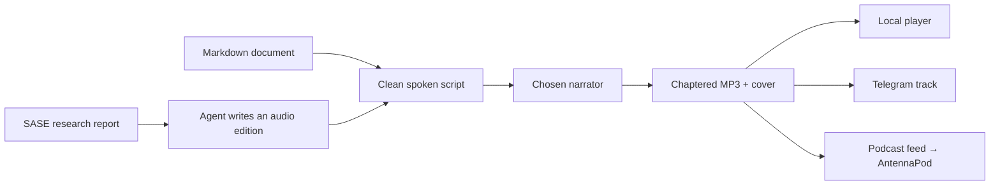

# sase-listen · Your Markdown, on the move

**What installers get from epic sase-1e3**  
Independent research by **cdx** · 1 October 2026

> The intended experience: choose a Markdown document, produce a polished audio episode, and listen during a walk or commute—with chapter navigation and optional delivery to your phone.

**Availability snapshot:** the approved epic is in progress. The public checkout inspected at commit `c35e6e2` contains the package foundation, configuration, and CLI registry; running `render` prints “not implemented yet” and exits 1. PyPI’s metadata endpoint returned HTTP 404 during this investigation. The capabilities below describe the approved target, rather than a verified released product. [Epic][epic] · [Inspected implementation][render] · [PyPI endpoint][pypi]

## The experience, end to end



The package is a **standalone Python CLI**, installed separately with `uv tool install sase-listen`. Local Markdown rendering needs no SASE installation. SASE artifact references, research authoring, and Telegram delivery add integrations around that tool. [Approved design][plan]

| What you want | What provides it | Setup beyond installing sase-listen |
| :--- | :--- | :--- |
| Listen to a local Markdown file | The standalone CLI generates an MP3 | A configured speech provider and credentials; any audio player |
| Hear a carefully adapted SASE research report | `#research/audio`, or `#research_swarm audio=true` | SASE plus the updated **sase-research-artifacts** plugin; **sase-telegram** for Telegram delivery |
| Receive episodes in a podcast app | The CLI builds RSS and publishes selected episodes | An HTTP host, feed setup, and a subscription in AntennaPod; Tailscale Funnel is the planned deployment |

Installing the package itself does not configure a Telegram bot or start a podcast server. The feed’s `auto_publish` setting starts disabled, and the swarm’s `audio` option starts false. [Approved design][plan]

## What makes the resulting audio useful

| User benefit | Planned behavior |
| :--- | :--- |
| **Easy to follow while moving** | One narrator, spoken chapter headings, an AI disclosure, measured pauses, and an outro |
| **Easy to navigate** | Each script chapter becomes an MP3 chapter; the feed also carries Podcasting 2.0 chapter data |
| **Comfortable volume** | Loudness mastering targets −16 LUFS, with long silences shortened |
| **A recognizable episode** | Title, author, duration, and embedded artwork: a generated title card or supplied image/infographic |
| **Control over the voice** | Named narrator profiles, voice auditions, and a pronunciation dictionary |
| **Less repeated work** | Cached speech chunks let interrupted renders reuse completed audio; a local library keeps episodes and their source/script metadata |

The planned default is Gemini 3.8 Flash TTS, initially using Charon; another adapter supports OpenAI-compatible speech endpoints. The offline `tone` engine produces test tones, **not spoken narration**. The proposed MP3 format is mono, 24 kHz, 64 kb/s—about **7.2 MB for fifteen minutes**, calculated from the bitrate. [Approved design][plan]

Telegram delivery uses `sendAudio`, which makes the MP3 a track in Telegram’s music player. Chapter navigation is specifically intended for supporting players such as AntennaPod; the epic does not establish that Telegram exposes the embedded chapters. [Design][plan] · [Telegram API][telegram]

## The important distinction: cleanup versus an audio edition

**For ordinary Markdown**, `render notes.md` runs a deterministic normalizer. It speaks headings and prose, turns lists into sentences, humanizes identifiers, and reads small tables row by row. It drops code fences, equations, bare URLs, source sections, and other unsuitable material; large tables become a description of their columns and row count. These changes are recorded as omissions. Even the `verbatim` edition is therefore a cleaned reading, not a lossless recitation of every byte. [Script contract and normalizer][plan]

**For SASE research**, an agent first writes a companion `<stem>_narration.md`: question and answer first, followed by reasons, comparisons, costs, and caveats. The CLI provides the writing guide and linter, then renders that script. It does not independently summarize an arbitrary document into a sixteen-minute research briefing. The agent is instructed to preserve claims, decisive numbers, uncertainty, and recommendations. [Research-audio workflow][plan]

| Research edition | Intended size | Approximate listening time at 150 words/minute |
| :--- | :--- | :--- |
| **Full**, the default | Up to 2,400 words | 16 minutes |
| **Brief** | About 600 words | 4 minutes |

Actual duration depends on the voice and pauses. The schema also permits digest and unlimited-length verbatim scripts; an automated daily digest is outside this epic. [Approved design][plan]

## What a new user would do

This is the **planned quickstart after release**:

```sh
uv tool install sase-listen
sase-listen config init
# Configure the selected provider's API key.
sase-listen doctor
sase-listen render notes.md --dry-run
sase-listen render notes.md -o commute.mp3
```

The package targets **Python 3.12+ on POSIX**, with Linux and macOS CI planned. It includes a bundled ffmpeg fallback through a dependency. `doctor` checks configuration, media capabilities, credentials, and storage; `audition` compares voices; `ls` browses episodes. `render --json` gives automation a structured result. [Package metadata][package] · [Design][plan]

For SASE research, the intended invocation is `#research/audio @research:…`; new swarms can opt into audio with `#research_swarm audio=true`. For podcast listening, initialize the feed, arrange hosting, publish an episode, and subscribe by URL or QR code. Phone playback can then use downloaded episodes without running sase-listen on the phone. [Approved design][plan]

## Cost, publication, and practical limits

**Speech has a separate usage cost.** Google currently lists Gemini 3.8 Flash TTS paid audio output at $0.00225 per ten seconds through 31 December 2026. That works out to approximately **$0.22 for sixteen minutes of generated speech**, plus text input and any retries; the listed audio rate doubles on 1 January 2027. Agent-written editions also incur the agent’s own usage cost. The tool’s estimates are planning aids, not billing receipts. [Google pricing][pricing]

**The podcast feed is private by secret URL.** The proposed Funnel deployment makes its published feed directory reachable from the internet under an unguessable path. Anyone with that URL can access it; Tailscale documents Funnel as public internet sharing. Hosting is optional, publication is explicit by default, and the apollo rollout requires approval before exposure. [Feed design][plan] · [Tailscale Funnel][funnel]

**Quality checks catch technical failures, with limited factual assurance.** The plan checks pace, silence, duration, chapter metadata, and loudness. Script lint can flag numbers absent from the source. There is no speech-to-text verification gate in this epic, so those checks cannot prove the narrator spoke every word correctly or that an agent preserved every argument. Default cloud narration sends the spoken text to its speech provider. [Quality gates and exclusions][plan]

The initial scope is one-narrator research editions and general Markdown rendering. Two-host conversations, a daily digest, deploying a local Kokoro speech server, and special handling for plans or Obsidian notes remain follow-up work. [Approved design][plan]

---

**Evidence:** independently read the epic, its engine/release phase beads, and the approved plan through audited SASE commands; inspected the public repository and ran its render stub; checked PyPI and the official delivery/pricing documentation. No reports or findings from the other researchers in this swarm were consulted. Implementation and publication may advance after this dated snapshot.

[epic]: https://github.com/sase-org/sase--beads/blob/main/pages/sase-1e3/README.md
[plan]: https://github.com/sase-org/sase--plans/blob/40738ba309c258aea7d6ee6b05c386ec59cfd1f5/202610/sase_listen.md
[render]: https://github.com/sase-org/sase-listen/blob/c35e6e2ce35415f1081216edd21c469feb4040d0/src/sase_listen/cli/render.py#L34-L37
[package]: https://github.com/sase-org/sase-listen/blob/c35e6e2ce35415f1081216edd21c469feb4040d0/pyproject.toml
[pypi]: https://pypi.org/pypi/sase-listen/json
[telegram]: https://core.telegram.org/bots/api#sendaudio
[pricing]: https://ai.google.dev/gemini-api/docs/pricing#gemini-3.8-flash-tts
[funnel]: https://tailscale.com/docs/features/tailscale-funnel
