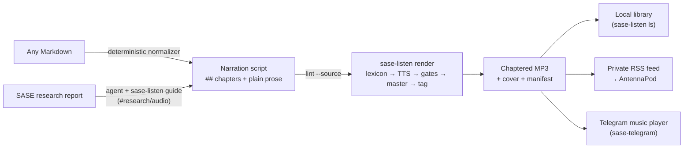

# sase-listen: What You Actually Get When You Install It

**Date:** 2026-10-01 · **Context:** epic `sase-1e3` and its plan, `plan:202610/sase_listen.md`
· **Type:** consolidated research ([about this report](#about-this-report))

## Bottom line

> **In one sentence:** `sase-listen` is a standalone CLI that turns a Markdown file into a
> podcast-grade MP3 and can publish it to a private podcast feed. The MP3 is narrated,
> chaptered, loudness-matched, tagged, and has cover art. The tool **renders** narration
> scripts; it does not write or summarize them.

1. **The install is a renderer, not a SASE plugin.**
   - `uv tool install sase-listen` puts one command on `PATH`.
   - It never imports `sase` and bundles its own ffmpeg.
   - Beyond the install, it needs only a text-to-speech (TTS) API key
     ([setup and requirements](#setup-and-requirements)).
2. **On its own, it reads the whole document.**
   - It cleans any Markdown deterministically, then reads all of it. A median research
     report takes about 19 minutes.
   - The condensed **16-minute "audio edition"** is what makes research listenable, and
     the tool does not write it. A SASE agent writes that script with `#research/audio`,
     or you write it by following `sase-listen guide` ([who writes the
     words](#who-writes-the-words)).
3. **"Research in my ears on a walk" takes three packages**
   ([what each install adds](#what-each-install-adds)).
   - **sase-listen** makes the MP3.
   - **sase-research-artifacts** has an agent write the edition.
   - **sase-telegram** delivers it as a playable track.
4. **You cannot install it yet** ([status](#status-on-2026-10-01)).
   - PyPI returns 404.
   - Only 2 of 12 subcommands work.
   - A repo setting is blocking the 0.1.0 release PR.


## How the pieces fit



The **narration script** (`<stem>_narration.md`) is the contract between writer and
renderer. It has YAML frontmatter, and its body holds only `##` chapters and plain spoken
paragraphs. The renderer never knows whether an agent, a human, or
[the normalizer](#what-the-normalizer-does-to-plain-markdown) wrote it.

## What each install adds

| You install | You get | You still need |
| :--- | :--- | :--- |
| **`sase-listen`** alone | The CLI, MP3s, a local episode library, the feed _files_, and a docs site. Needs no SASE at all | A Gemini or OpenAI key. To listen through the feed on your phone, a static host such as Tailscale Funnel |
| plus upgraded **sase-research-artifacts** | `#research/audio @research:…` from the TUI or a Telegram message, and `#research_swarm audio=true` (off by default). An agent forked from the swarm lead writes, lints, renders, and registers the edition | `sase-listen` on `PATH`. The xprompt falls back to `uvx sase-listen` |
| plus upgraded **sase-telegram** | MP3 and M4A attachments arrive through `sendAudio` as playable tracks with title, performer, and duration, not as documents. A file over 50 MB arrives as a text note instead | The MP3 must ride a completion notification. `#research/audio` handles that with `sase artifact create` |
| The **apollo rollout** (Bryan's setup) | All of the above, configured through chezmoi with a `pass`-backed key. Voice auditions arrive in Telegram, and the feed is served on Funnel `:8443` with `auto_publish: true` | Approval of the gated Funnel exposure |

## The episode you get

| | |
| :--- | :--- |
| **Voice** | One narrator per episode, by default Gemini 3.8 Flash TTS with the voice `Charon` (until auditions pick one) and a calm technical-briefing style. A failure never switches engines silently |
| **Shape** | A spoken AI disclosure opens each episode: _"This is an AI-narrated audio edition of Title, SASE research from date."_ Chapter headings are spoken. There are pauses of 0.5 s between chunks and 1.2 s between chapters, long silences are compressed, and a short outro closes |
| **Format** | MP3, mono, 24 kHz, 64 kb/s CBR, about 0.48 MB per minute. A 16-minute edition is about 7.7 MB |
| **Loudness** | Two-pass `loudnorm` to −16 LUFS and −1.5 dBTP, so episodes match each other at 1.25–1.5× speed |
| **Chapters** | One per `##`: ID3 CHAP/CTOC frames in the file, and Podcasting 2.0 JSON in the feed |
| **Cover** | A 1400×1400 title card generated from a deterministic gradient, the Inter font, and a waveform motif. When the report has an infographic, the infographic is letterboxed over a blurred copy of itself instead |
| **Paper trail** | `library/<episode>/` holds the MP3, the exact `script.md` rendered, the cover, `chapters.json`, and `manifest.json`. The manifest records the source hash, narrator, per-chunk cache keys, gate results, loudness, and the ≈ cost |

## Who writes the words

Each episode renders one of four editions:

| Edition | Length at 150 wpm | Written by | Without SASE? |
| :--- | :--- | :--- | :--- |
| `verbatim` | The whole document: a median report is ≈ 19 min, p90 ≈ 30 min | The deterministic normalizer | ✓ Automatic for any Markdown |
| **`full`** (the SASE default) | ≤ 2,400 words, ≈ 16 min | A SASE agent through `#research/audio` | Only if you write it by following `guide` |
| `brief` | ≈ 600 words, ≈ 4 min | The same, with `edition=brief` | The same |
| `digest` | ≈ 250 words per item | **Nobody yet.** The daily digest is out of scope for this epic | Only a valid schema value |

### Why the agent edition exists

**Fidelity, not length.** A verbatim reading is already commute-sized. The problem is what
it skips. In the originating corpus study, 97 September reports had a recommendation-like
section, and 50 of them (52%) put a table inside it.
[The normalizer drops large tables](#what-the-normalizer-does-to-plain-markdown), so a
verbatim reading would skip the recommendation about half the time.

The guide makes the agent:

- keep every argument-carrying number;
- preserve stated uncertainty;
- never soften or strengthen the recommendation;
- say tables as "the winner, the runner-up, and the deciding numbers".

`lint --source` mechanically flags any number in the script that the report does not
contain.

### What the normalizer does to plain Markdown

- **Structure:**
  - `##` headings become chapters, and deeper headings are spoken.
  - Lists become sentences.
  - Links are read as their anchor text, and images become "Figure: …".
- **Tables:** tables up to 6 rows × 4 columns are read row by row. Larger ones become one
  sentence naming their columns and row count.
- **Dropped, and listed in an omissions report:** code fences, math, Mermaid, footnotes,
  bare URLs, and "Sources" sections.
- **Humanized:** identifiers like `snake_case`, and `§6`, which becomes "section 6".

Even `verbatim` is therefore a cleaned reading, not a word-for-word recitation.

## Setup and requirements

### Planned quickstart

This is the planned quickstart once 0.1.0 is on PyPI:

```sh
uv tool install sase-listen
sase-listen config init                     # then add a key (see below)
sase-listen doctor --online
sase-listen audition --voices Charon,Kore,Iapetus,Sadaltager
sase-listen render notes.md --dry-run       # chapters, minutes, ≈ cost
sase-listen render notes.md -o commute.mp3
sase-listen feed init --base-url https://<host>:8443 --qr
sase-listen publish --latest
```

### Requirements

- **Platform:** Python ≥ 3.12 on Linux or macOS. CI covers Ubuntu with 3.12–3.14 and macOS
  with 3.12. Windows is not targeted.
- **No system ffmpeg and no sudo.** The `imageio-ffmpeg` dependency bundles a static
  ffmpeg 7.0.2 with `libmp3lame` and `loudnorm`.
- **One key:**
  - Gemini reads `SASE_LISTEN_GEMINI_API_KEY`, `GEMINI_API_KEY`, or `GOOGLE_API_KEY`, or
    runs an `api_key_command` such as `pass show …`.
  - OpenAI works with `-n openai`.
  - The free `tone` narrator makes **tone bursts, not speech**. It exists for tests and
    demos.
  - Kokoro is not built in. You add a narrator profile that points the OpenAI-compatible
    engine at a Kokoro-FastAPI server you run yourself.
- **`sase` on `PATH`**, only for `research:…` refs. sase-listen shells out to
  `sase artifact read`.
- **Files** (XDG paths, on macOS too):
  - config: `~/.config/sase-listen/config.yml`;
  - library and feed: under `~/.local/share/sase-listen/`, where only `feed/` is ever
    served;
  - chunk cache: `~/.cache/sase-listen/chunks/`.

## The CLI

Planned versus today:

| Command | What it does for you | Today (`c35e6e2`) |
| :--- | :--- | :--- |
| `render SOURCE` | Turns a script, plain Markdown, or a `research:…` ref into an episode. `--dry-run` shows chapters, words, ≈ minutes, and ≈ cost before anything is spent. Also takes `-n`/`--voice`, `--cover`, `--publish`, and `--json` | stub |
| `script FILE` | Writes the verbatim script and its omissions, so you can edit before rendering | stub |
| `lint SCRIPT [--source R]` | Checks the contract and listenability (leftover Markdown, sentence and chapter length, edition budget), plus number fidelity against the report | stub |
| `guide [--edition E]` | Prints the authoring rules. They ship with the code that enforces them, so they cannot drift | stub; the packaged guide is a placeholder |
| `audition --voices A,B` | Renders the same ~45 s passage in each voice, at ≈ 1¢ per voice | stub |
| `ls [EPISODE]` | Lists the library, or shows one episode's chapters | stub |
| `doctor [--online]` | Checks config, ffmpeg, credentials, writable dirs, disk, and the feed. `--online` adds a one-word live synthesis | ✓ offline checks work; `--online` fails |
| `config [init\|path]` | Shows the effective config with each value's origin, secrets masked. `init` writes a commented starter file | ✓ |
| `cache [prune]` | Shows the chunk-cache size and prunes it (LRU, 2 GB cap) | stub |
| `feed init --base-url URL`, `publish`, `unpublish` | Manage the private feed. `feed init` creates a secret-path feed URL, prints a terminal QR code and the exact `tailscale funnel` command. Episodes are kept for 90 days, up to 200 | stub |

### JSON output and exit codes

Most commands take `--json` and then print exactly one object on stdout, which is the
contract agents use. Exit codes are scriptable:

| Exit code | Meaning |
| :--- | :--- |
| 3 | Configuration or credentials |
| 4 | Synthesis failed |
| 5 | A quality gate failed |
| 6 | Malformed script; `render` refuses unless `--force` |

## Cost

These figures use Gemini 3.8 Flash TTS at $0.0135 per audio minute, which doubles to
$0.027 on 2027-01-01. The rates come from the packaged `pricing.yml`.

| Episode | Today | From 2027-01-01 |
| :--- | ---: | ---: |
| `brief`, 4 min | $0.05 | $0.11 |
| **`full`, 16 min** | **$0.22** | **$0.43** |
| `verbatim`, median report (19 min) | $0.26 | $0.51 |
| `verbatim`, p90 report (30 min) | $0.41 | $0.81 |
| 10 `full` editions a month | ≈ $2 | ≈ $4 |

- **Other engines, for a 16-minute episode:** Flash-Lite costs ≈ $0.14, OpenAI
  `gpt-4o-mini-tts` ≈ $0.24, and a self-hosted Kokoro $0.
- **Not included:** the agent tokens spent writing a `full` or `brief` script.
- **Re-renders are cheap.** The chunk cache is content-addressed:
  - a crashed render pays only for the missing chunks;
  - editing a paragraph re-synthesizes only the affected chunks;
  - changing the voice or style pays for the whole episode again.
- **Use a billed Gemini key.** Free-tier TTS quotas are too low for daily listening.

## Where you will listen

| | Telegram, through sase-telegram | AntennaPod, through the feed |
| :--- | :--- | :--- |
| **How it arrives** | Automatically, with the completion notification | Subscribe once by URL or QR code; episodes then auto-download on Wi-Fi |
| **Playback** | Music player with 0.2–2.5× speed and background play. It resumes long files | A podcast queue, with skip-silence, Android Auto, and speed control |
| **Chapters** | **No** | **Yes**, from ID3 and Podcasting 2.0 |
| **What it needs** | The sase-telegram upgrade. Bot uploads are capped at 50 MB, about 100 minutes | A feed host, such as Tailscale Funnel on `:8443` |

### Feed privacy

**Feed privacy comes from a secret URL, not from access control.**

- Funnel makes the feed directory reachable from the internet under an unguessable path,
  so anyone holding that URL can listen.
- `itunes:block` and `podcast:locked` keep the feed out of podcast directories.
- Publishing is explicit by default: `auto_publish` starts as `false`. When it is turned
  on, only `kind: research` episodes are published automatically.
- On apollo, the Funnel exposure is proposed through a gate before anything goes public.

## Deliberately not in v1

- **No writing inside the tool.** There is no LLM rewrite step; agents or you write the
  scripts.
- **No player, no server, and no Telegram code.**
  - sase-listen only writes files.
  - Funnel or any static server serves them.
  - Telegram delivery lives in sase-telegram.
- **No bundled local voice.** You run Kokoro yourself, and deploying it on athena is a
  follow-up.
- **No audio in git.** Only `<stem>_narration.md` is committed, next to its report.
- **Later ideas:**
  - a two-host "podcast" mode;
  - the daily digest;
  - a speech-to-text (Whisper) quality gate;
  - special handling for plans and Obsidian notes;
  - an `audio` artifact kind.

## Status on 2026-10-01

| Piece | State |
| :--- | :--- |
| **sase-listen `master`** | Only the scaffold (`c35e6e2`): packaging, the config loader, the CLI registry, and a docs skeleton. `--version`, `doctor` (offline checks), and `config` work. `render` and the 9 other commands print "not implemented yet" and exit 1. CI and Docs are green, and the docs site is live with stub pages |
| **Epic `sase-1e3`** | Phase 1 (scaffold) is closed, and phases 2–12 are in progress. Release, then the apollo rollout, come last |
| **PyPI** | 404, so `uv tool install sase-listen` fails today |
| **Release automation** | **Blocked.** The Publish run failed with "GitHub Actions is not permitted to create or approve pull requests". `can_approve_pull_request_reviews` is still `false`, although the scaffold phase was meant to flip it. A release-please branch exists, but no PR |
| **sase-telegram** | `master` is at 0.4.23 and has no `send_audio` yet |
| **sase-research-artifacts** | No `#research/audio` xprompt and no `_narration.md` exclusion yet |

## Worth deciding

1. **Unblock releases.** Flip the workflow permission, or add a `SASE_RELEASE_TOKEN`
   secret, before the release phase. Otherwise there is no 0.1.0 PR to merge (see
   [Release automation](#status-on-2026-10-01) above).
2. **Private Markdown.**
   - Every render except `tone` sends the text to Google or OpenAI.
   - `render --publish` will put _any_ episode into the
     [secret-URL feed](#feed-privacy).
   - The originating research said private notes must stay off cloud engines and out of
     this feed, but the script contract has no `private:` marker to enforce that. Either
     add one or document the rule prominently.
3. **Standalone value.** Outside SASE, users get a strong verbatim reader with podcast
   packaging, but not the [condensed edition](#who-writes-the-words). A documented "bring
   your own LLM" recipe would give PyPI users `full` editions with no new code:
   1. Paste `sase-listen guide` into any chat model.
   2. Save its output as the script.
   3. Run `lint --source`, then `render`.
4. **Fidelity is only partly checked.**
   - The gates check pace, silence, duration, chapters, and loudness, and
     `lint --source` checks numbers.
   - Nothing verifies that the narrator spoke every word correctly, or that the agent
     kept every argument. The speech-to-text gate is
     [deferred](#deliberately-not-in-v1).
5. **The plan's open decisions:**
   - how "SASE" is pronounced (the lexicon leaves it out for now);
   - the default voice (`Charon` until auditions);
   - the gated Funnel exposure.

## About this report

This is consolidated research by the lead researcher. It merges five independent reports
(`__cdx`, `__cld`, `__grk`, `__mus`, `__gem`) with the lead's own verification.

**Lead verified this turn:**

- ran every scaffold subcommand of `sase-org/sase-listen` at `c35e6e2`;
- read the Publish run log, the workflow-permission API, PyPI, and the docs site;
- checked both sibling plugins' `master` branches;
- re-checked the corpus numbers in the originating research.

### Where the reports disagreed

| Question | Resolution |
| :--- | :--- |
| What works today? | `doctor` (offline) works as well as `config`. The lead ran it. cdx and cld said only `config` and `--version` work ([the CLI](#the-cli)) |
| What does a `full` edition cost? | ≈ $0.22 for 16 minutes. The "$0.16" figure in grk and mus is the plan's estimate for a 12-minute script ([cost](#cost)) |
| Does every command take `--json`, as mus and gem say? | Most do, but `guide` prints plain text |
| Is Kokoro a built-in local voice, as gem says? | No. It is a profile you add that points at your own Kokoro-FastAPI server, and deploying one is out of scope |
| Does Telegram show chapters and cover art, as gem says? | The plan sends title, performer, and duration. Telegram's player has no chapters (cld and the originating research) |
| Do swarms publish to the feed automatically, as gem implies? | No. `audio=true` is opt-in and `auto_publish` defaults to off; only the apollo rollout turns it on |
| Was the Publish failure "expected", as grk says? | No. It is a permissions error that blocks the 0.1.0 release PR (cld) |

### Sources

- Epic bead `sase-1e3` (12 phase beads) and `plan:202610/sase_listen.md`: contracts, CLI
  surface, engines, config, feed, and rollout.
- Originating research,
  `research:202610/commute_audio_from_markdown/commute_audio_from_markdown.md`: corpus
  measurements, the delivery comparison, and the private-Markdown rule.
- `gh:sase-org/sase-listen` at `c35e6e2`:
  - ran `--version`, `doctor`, `doctor --online`, `config`, `config init`, and the stubs;
  - read `data/pricing.yml`, `data/lexicon.yml`, `data/guide.md`, and `cli/doctor.py`.
- GitHub and the web:
  - the log of Publish run `36910709733`;
  - the workflow-permissions API;
  - the repo metadata;
  - the PyPI JSON API (404);
  - the docs site (200).
- `origin/master` of sase-telegram and sase-research-artifacts: no audio work yet.
- The five researcher reports in this directory: `__cdx`, `__cld`, `__grk`, `__mus`, and
  `__gem`.
