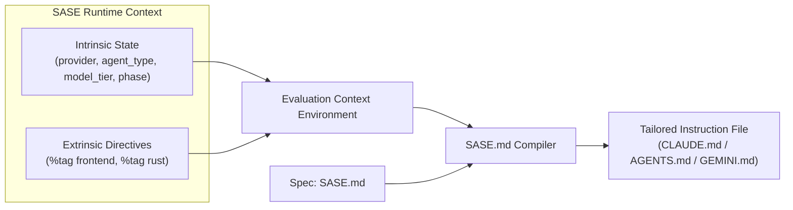
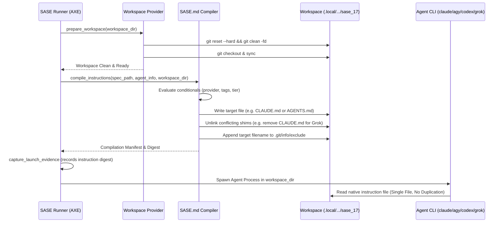

# Dynamic Agent Instruction Architecture: Migrating to `SASE.md`

> **Author:** researcher gem (`research.3n.gem`)  
> **Date:** 2026-10-05  
> **Status:** Research Report & Architectural Proposal  
> **Target:** `SASE.md` Specification, Dynamic Ephemeral Workspace Compilation, and Selective Rendering  

---

## Executive Summary & Bottom Line

The proposal to consolidate all agent instruction files into a single `SASE.md` specification and dynamically compile appropriate, specialized instruction files in ephemeral workspaces before launching SASE agents is **an outstanding architectural evolution**. It directly addresses chronic multi-agent instruction defects that static files cannot solve, reduces version control bloat by 80%, and unlocks granular context specialization.

However, the proposal as originally conceived requires **critical architectural adjustments** regarding workspace isolation, git hygiene, external developer ergonomics, and agent identification mechanisms:

1. **Defects Eliminated Immediately**:
   - **Grok Double-Load**: Grok natively reads `AGENTS.md` and discovers `CLAUDE.md`. Generating *only* `AGENTS.md` and guaranteeing `CLAUDE.md` is absent in Grok workspaces completely eliminates the ~4,300-token duplicate penalty.
   - **Antigravity Double-Load (Empirically Verified)**: In our active session, Antigravity (`agy`) discovered and loaded **both** `AGENTS.md` and `GEMINI.md` into `<user_rules>`, duplicating 283 lines and ~4,300 tokens per call. Generating *only* `GEMINI.md` (or *only* `AGENTS.md`) eliminates this duplication.
   - **Codex Missing `~/AGENTS.md`**: OpenAI Codex CLI walks up only to the git repository root and halts, ignoring `~/AGENTS.md`. Dynamic compilation enables SASE to layer `~/.sase/SASE.md` directly into the workspace's root `AGENTS.md`, making home context visible to Codex for the first time.

2. **Crucial Architectural Refinements (The "Gotchas")**:
   - **The Vanilla Developer Experience**: If `AGENTS.md` and `CLAUDE.md` are completely removed from git, human developers opening raw `claude`, `codex`, Cursor, or Antigravity in the primary checkout will have zero context. We recommend a **Dual-Mode Compilation Strategy**: git tracks `SASE.md`; `sase init` compiles a canonical `AGENTS.md` for the primary checkout (tracked or git-excluded), while ephemeral workspaces compile custom, tailored overlays.
   - **Workspace Preparation & Git Hygiene**: `prepare_workspace` executes `git reset --hard` and `git clean -fd`. Dynamic instruction generation **must** occur *after* workspace clean/sync, immediately prior to process launch, and the generated target file **must** be registered in `.git/info/exclude`. Otherwise, `git clean -fd` destroys it, or `git status` flags it as an untracked file, risking accidental commits.
   - **Two-Tier Agent Identification**: Relying solely on a manual `%tag` directive forces prompt authors into manual tag management. We recommend a **hybrid model**: automatic intrinsic properties (`provider`, `agent_type`, `model_tier`, `workflow_phase`) combined with an optional, explicit `%tag` directive.

3. **8 High-Value Use Cases Unlocked**:
   Beyond the user's initial list, dynamic compilation unlocks:
   - **Role-Based Progressive Disclosure** (stripping commit/linter rules from researchers and planners).
   - **Model-Tier Context Budgeting** (compact 50-line routers for fast/small models like Flash/Haiku vs full routers for Sonnet/Pro).
   - **Provider Operational Adaptation** (injecting Codex streaming caveats or Antigravity print-mode non-interactive rules only where relevant).
   - **Subsystem Scoping** (eradicating the 20 redundant nested instruction files in `src/sase/ace/`, `tools/`, and `demos/tapes/`).
   - **Dynamic Path Injection** (resolving runtime sidecar/linked repo paths without hardcoding ephemeral paths in git).
   - **Unified Home + Project Layering** across all providers.
   - **PR Diff & Git Conflict Elimination** (no more 5-file lockstep diffs on memory updates).
   - **Security Sandboxing** (stripping `/sase_sudo` or privileged commands for untrusted workflows).

---

## 1. Critique of the Plan: Is This a Good Idea?

### 1.1 The Current Problem: Static Duplication and False Parity

Today, the SASE repository maintains five byte-identical root instruction files:
- `AGENTS.md` (OpenAI / Linux Foundation / industry standard)
- `CLAUDE.md` (Anthropic Claude Code standard)
- `GEMINI.md` (Google Antigravity / Gemini CLI standard)
- `OPENCODE.md` (OpenCode standard)
- `QWEN.md` (Alibaba Qwen standard)

In addition, SASE maintains nested copies of these five files in three subdirectories:
- `demos/tapes/` (5 files)
- `src/sase/ace/` (5 files)
- `tools/` (5 files)

Total: **20 static instruction files tracked in git**.

Whenever memory notes, glossary terms, or core rules change, `sase memory init` regenerates all 20 files. This produces massive, redundant git diffs, creates high merge conflict risk across concurrent agent branches, and assumes all providers treat workspace instruction files identically.

In reality, providers do **not** treat workspace instruction files identically. Different CLIs have different discovery algorithms, ancestor walking behaviors, and context limitations. Maintaining static byte-identical copies across all formats actually triggers severe bugs (double loading, missing home files, context waste).

### 1.2 The Verdict: Yes, With Specific Boundary Protections

Migrating from static file duplication to a **single specification (`SASE.md`) compiled dynamically at runtime** is a superior software engineering pattern. It treats agent instructions as **compiled build artifacts** tailored for specific consumers, rather than static source code checked into version control.

However, the pure "ephemeral workspace only" idea has three significant failure modes that must be addressed:

| Risk / Failure Mode | Manifestation | Required Architectural Adjustment |
| :--- | :--- | :--- |
| **1. The Vanilla Developer Blindspot** | Human developer runs raw `claude`, `codex`, or Cursor in the primary repo checkout. If git tracks *only* `SASE.md`, the raw CLI finds no instructions. | `sase init` compiles a canonical baseline `AGENTS.md` for the primary repository checkout. |
| **2. Git Clean & Untracked Churn** | `prepare_workspace` executes `git clean -fd`. Untracked generated files are deleted. If generated post-clean, they dirty `git status`. | Dynamic compilation runs immediately before process launch. Target files are automatically appended to `<workspace>/.git/info/exclude`. |
| **3. Non-Deterministic Auditability** | If instructions vary per run, "what instructions did the agent see?" becomes hard to reproduce. | `capture_launch_evidence()` must record the compiled instruction digest and exact rendered text into run artifacts. |

---

## 2. Analysis of Targeted Bugs & Root Causes

### 2.1 Bug 1: Grok Double-Loads `AGENTS.md` and `CLAUDE.md`

- **Root Cause**: xAI's Grok Build CLI natively searches for `AGENTS.md`. In addition, Grok includes a compatibility scanner that searches for `CLAUDE.md`. When both files are present in the repository root (as is currently the case in all SASE checkouts), Grok loads **both**, injecting duplicate instructions.
- **Current Workaround**: As documented in `docs/agent_providers.md` (line 249): *"SASE accepts the duplication for now rather than suppressing `CLAUDE.md` generation under a Grok provider, which would break any human running `claude` in the same tree."*
- **Solution with `SASE.md`**: When SASE prepares an ephemeral workspace for a Grok agent, the workspace compiler generates **only** `AGENTS.md`. SASE ensures `CLAUDE.md` is deleted or omitted from that workspace clone.
- **Benefit**: Saves ~4,300 tokens on every Grok API call. For a 40-call session, this eliminates ~172,000 redundant context tokens.

### 2.2 Bug 2: Antigravity CLI (`agy` / Gemini) Double-Loads `AGENTS.md` and `GEMINI.md`

- **Empirical Confirmation**: In `agent_instructions_budgeted_router.md`, the author noted that Antigravity double-loading was unverified. **We can now confirm this defect unequivocally.**
- In our active session transcript, the system prompt injected:
  ```markdown
  <RULE[/home/bryan/.../sase_17/AGENTS.md]>
  ... [283 lines of instructions] ...
  </RULE>
  <RULE[/home/bryan/.../sase_17/GEMINI.md]>
  ... [283 identical lines of instructions] ...
  </RULE>
  ```
- **Discovery Mechanism**: As documented in `builtin/skills/agy-customizations/SKILL.md`:
  > *"Directory & Project Rules (Hierarchical): Paths: `GEMINI.md`, `AGENTS.md`, `.agents/rules/*.md`. Deduplication: All customizations are deduplicated by their resolved file paths."*
  Because `AGENTS.md` and `GEMINI.md` have distinct filenames, Antigravity's path deduplicator treats them as separate rule files and loads both!
- **Solution with `SASE.md`**: In ephemeral workspaces prepared for Antigravity, SASE compiles **only** `GEMINI.md` (or only `AGENTS.md`) and unlinks the other.
- **Benefit**: Instantly eliminates 4,300 duplicate tokens on every Antigravity turn.

### 2.3 Bug 3: OpenAI Codex Ignores `~/AGENTS.md`

- **Root Cause**: OpenAI Codex CLI inspects repository rules by starting at the current working directory and walking up directory parents **until it reaches the git repository root (`.git`)**. It explicitly halts at the git repository boundary and never traverses into parent directories or the user's home folder (`~`).
- **Failed Workaround**: SASE attempted to fix this in `src/sase/llm_provider/codex.py` (`_link_home_agents_fallback`) by symlinking `~/AGENTS.md` into `~/.cache/sase/codex_home/<pid>/AGENTS.md` and pointing `CODEX_HOME` there. However, Codex CLI does not use `CODEX_HOME/AGENTS.md` for workspace instructions.
- **Solution with `SASE.md`**: Dynamic compilation solves this at the root. When preparing an ephemeral workspace for Codex, SASE resolves the user's global instructions (`~/.sase/SASE.md` or `~/AGENTS.md`) and **inlines them directly** into the workspace's root `AGENTS.md` under a `# Global User Instructions` section. Codex reads the single unified file from the git root without requiring any upstream traversal.

---

## 3. Selective Rendering: Mechanism Design & Grammar

The user proposed using a `%tag` directive in prompts to tag certain agents and conditionally render parts of the instruction file.

### 3.1 Critique of Pure `%tag` Directives

Relying exclusively on a prompt directive like `%tag <name>` has major drawbacks:
1. **Authoring Burden & Tag Fatigue**: Users launching standard tasks (`sase run "fix test_foo"`) will not remember to type `%tag swe` or `%tag claude`. If tags must be manually specified, most runs will run untagged, receiving either an impoverished default or the bloated kitchen sink.
2. **Duplication of Known System Metadata**: SASE already knows the agent's provider (`claude`, `codex`, `agy`), the model tier (`large`, `small`), the agent type (`planner`, `researcher`, `editor`), and whether plan mode is active (`info.plan=True`). Forcing users to re-declare this via `%tag` violates DRY.

### 3.2 Recommended Solution: Two-Tier Context Evaluation

We recommend a **Two-Tier Context Model** combining **Intrinsic Context Variables** and **Extrinsic User Tags**:



#### Tier 1: Intrinsic Context Variables (Automatic)
The compilation environment automatically exposes:
- `provider`: `"claude" | "codex" | "agy" | "grok" | "qwen" | "opencode"`
- `agent_type`: `"planner" | "research" | "editor" | "swe" | "audit"`
- `tier`: `"large" | "small"`
- `model`: e.g. `"claude-3-5-sonnet"`, `"gemini-1.5-pro"`
- `is_plan`: `bool` (true if planning turn)
- `bead_type`: `"bug" | "feature" | "task" | "epic"` (if bound to a bead)
- `workspace_num`: integer workspace ID

#### Tier 2: Extrinsic Tags (User & Macro Directives)
Prompt directives can pass explicit tags:
- Syntax in prompt: `%tag rust,security` or `%tags [frontend, docs]`
- The compiler merges these into a set: `tags: Set[str]`.
- For convenience, intrinsic properties are also mirrored into `tags` (e.g. `"claude" in tags`, `"research" in tags`).

### 3.3 Syntax & Grammar for `SASE.md`

We strongly recommend **HTML Comment Directives** (`<!-- sase:if ... -->`) rather than raw Jinja2 delimiters (``).

#### Why HTML Comment Directives Win:
1. **Markdown Integrity**: HTML comments are valid Markdown. When viewed in GitHub, VS Code, or grip previews, the conditional directives are invisible comments.
2. **No Linter or Syntax Highlighting Breakage**: Markdown linters and formatters (Prettier, Markdownlint) do not choke on HTML comments, whereas Jinja2 delimiters often break table formatting and code block parsers.
3. **Clean Fallback**: If an external tool reads raw `SASE.md`, it simply treats the directives as comments rather than failing on template syntax.

#### Concrete Syntax Specification:

```markdown
# Structured Agentic Software Engineering (SASE) - Agent Instructions

## 1. Universal Core Rules
<!-- Always rendered for every agent -->
- Before any normal response ending this turn, use your `/sase_final` skill.
- Ephemeral workspaces: do not write workspace numbers into plans.

<!-- sase:if provider == "codex" -->
## Codex Operational Caveats
- `exec_command` yields before completion. Poll with empty input until returncode.
<!-- sase:endif -->

<!-- sase:if agent_type != "research" -->
## Code Modification & Testing
- Read `lint_and_test.md` before changing tracked files.
- Guarded recipes: run `just check` only through `sase tool run`.
<!-- sase:endif -->

<!-- sase:if "rust" in tags or "sase-core" in tags -->
## Rust Core Boundary
- Shared backend behavior belongs in `sase-core`.
- Run litmus test: if web/CLI/TUI must match, it belongs in Rust core.
<!-- sase:endif -->

<!-- sase:if tier == "large" -->
## Reference Memory Catalog
1. `sase/memory/cli_rules.md` - Read before adding CLI subcommands.
2. `sase/memory/dispatch.md` - Read before `%dispatch`.
3. `sase/memory/sase_flags.md` - Read before toggling feature flags.
<!-- sase:else -->
## Reference Memory
- On-demand memory available via `/sase_memory_read`.
<!-- sase:endif -->
```

---

## 4. Eight Additional High-Value Use Cases Unlocked

Consolidating into a dynamically compiled `SASE.md` unlocks eight major architectural capabilities beyond the initial bug fixes:

### 4.1 Use Case 1: Role-Based Progressive Disclosure (Planner vs SWE vs Researcher)
- **Problem**: Today, a researcher agent (like this one) receives 35 lines explaining `/sase_final`, stitch commits, dirty screenshot goldens, and VCS locks. None of this applies to research, which outputs to sidecar artifact repos via `sase artifact create`.
- **Solution**: The compiler strips commit and VCS finalizer blocks for `agent_type == "research"`. Planners receive plan formatting rules and bead hierarchies, while coding agents receive Symvision, linter, and test triggers.

### 4.2 Use Case 2: Model Tier & Context Budget Tuning
- **Problem**: As established in `agent_instructions_budgeted_router.md`, large models (Sonnet, Pro) easily navigate a 100-line router with 10 reference triggers. Small or fast models (Gemini Flash, Haiku, GPT-4o-mini) suffer from instruction dilution and latency when loaded with 283 lines of rules they will never invoke.
- **Solution**: Dynamic compilation allows `tier == "small"` to emit an ultra-compact 40-line minimal contract (just hard invariants), preserving context window and maximizing instruction adherence.

### 4.3 Use Case 3: Subsystem / Subdirectory Scoping (Eliminating 20 Files)
- **Problem**: The repository currently tracks duplicate files in `src/sase/ace/`, `tools/`, and `demos/tapes/` because those subdirectories need specific local rules (e.g. ACE screenshot testing, tape recording guidelines).
- **Solution**: Move subsystem rules into `SASE.md` behind path selectors:
  ```markdown
  <!-- sase:if path.startswith("src/sase/ace") or "ace" in tags -->
  ## ACE Subsystem Guidelines
  ...
  <!-- sase:endif -->
  ```
  When an agent is launched targeting `src/sase/ace`, the compiler injects these rules directly into the root instruction file. All 15 nested instruction files can be deleted.

### 4.4 Use Case 4: Dynamic Sidecar and Linked Repo Path Injection
- **Problem**: Agents are instructed: *"When you need to read or modify files in any repository other than your own workspace checkout, agents MUST use your `/sase_repo` skill first."* However, agents often guess paths or hallucinate sibling directories because they do not know where sidecars actually live on disk.
- **Solution**: The compiler knows the exact resolved paths of all cloned sidecars (`research`, `plans`, `beads`, `sase-core`) for the current machine and workspace. It dynamically renders the live path inventory directly into the instruction file, eliminating path discovery guesswork.

### 4.5 Use Case 5: Unified Home + Project Layering
- **Problem**: Claude Code automatically loads `~/CLAUDE.md` by walking up to `~`. No other provider does this. This means user-specific preferences (editor preferences, terminal habits, local tool paths) are only honored for Claude agents.
- **Solution**: SASE standardizes user preferences in `~/.sase/SASE.md`. During workspace compilation, SASE layers `~/.sase/SASE.md` + `<project>/SASE.md` for *every* provider. Parity is achieved across Claude, Codex, Gemini, Grok, and Qwen.

### 4.6 Use Case 6: Provider-Specific Tooling & Operational Gotchas
- **Problem**: Each provider CLI has idiosyncratic behaviors:
  - Codex: `exec_command` streams partial yields; needs loop polling.
  - Antigravity: running in print-mode has no follow-up event loop.
  - Claude: supports `@import` file inclusion.
- **Solution**: Operational caveats are injected only into that specific provider's compiled instruction file, preventing cross-provider confusion.

### 4.7 Use Case 7: Clean Git History & Zero Merge Conflicts
- **Problem**: Commits that touch memory notes frequently touch 5–20 instruction files in the same PR. When multiple feature branches are in flight, these generated files constantly produce merge conflicts.
- **Solution**: Only `SASE.md` is tracked in git. PR diffs remain small, clean, and meaningful. Merge conflicts on instruction files drop to zero.

### 4.8 Use Case 8: Security & Privilege Scoping
- **Problem**: In multi-agent pipelines or automated scheduled runs, certain agents should not have access to privileged instructions (such as `/sase_sudo` or secrets access).
- **Solution**: The compiler conditionally omits privileged skill documentation and rules unless the agent has an explicit `%tag privileged` or is running under interactive human supervision.

---

## 5. Architectural Implementation Design

### 5.1 Compilation & Lifecycle Flow

The dynamic compilation step must be integrated into the runner lifecycle at the precise boundary between workspace preparation and agent process launch:



### 5.2 File Mapping Strategy

The compiler selects the single target file based on the active provider:

| Provider | Generated File in Ephemeral Workspace | Excluded / Suppressed Files | Notes |
| :--- | :--- | :--- | :--- |
| **`claude`** | `CLAUDE.md` | `AGENTS.md`, `GEMINI.md` | Pure Claude Code target |
| **`grok`** | `AGENTS.md` | `CLAUDE.md` (MUST NOT EXIST) | Eliminates Grok double-load |
| **`agy` (Gemini)** | `GEMINI.md` | `AGENTS.md` (MUST NOT EXIST) | Eliminates Antigravity double-load |
| **`codex`** | `AGENTS.md` | None | Inlines home `~/SASE.md` at root |
| **`opencode`** | `OPENCODE.md` | `AGENTS.md` | Pure OpenCode target |
| **`qwen`** | `QWEN.md` | `AGENTS.md` | Pure Qwen target |

### 5.3 Workspace Git Safety (`.git/info/exclude`)

To ensure that the dynamically compiled instruction file does not interfere with git:
1. `ensure_git_info_exclude_entry(workspace_dir, target_filename)` must be called immediately upon writing the file.
2. SASE's `src/sase/workspace_provider/git_exclude.py` already manages `.sase/` and `/sase/repos/`. Adding the compiled instruction file(s) guarantees:
   - `git status` inside the agent turn is 100% clean.
   - `git add .` or `sase stitch create` will never commit the compiled instruction file.
   - Host finalizers (`builtin@commit`) will not see the ephemeral instruction file as dirty repository state.

### 5.4 Auditability & Reproducibility (`launch_evidence.py`)

In `src/sase/axe/launch_evidence.py`:
- Today: records git blob OIDs of `AGENTS.md` and shims.
- With `SASE.md`: records:
  - `spec_sha`: git blob SHA of `SASE.md`.
  - `compiled_instruction_sha`: SHA-256 of the compiled output.
  - `compilation_context`: `{provider, agent_type, tier, tags, model}`.
  - Stores the full compiled text in the agent's run directory: `artifacts_dir/compiled_instructions.md`.
- This ensures 100% deterministic forensic replay via `sase prompt replay` or `sase repro`.

---

## 6. Implementation Plan & Phased Migration

We recommend a five-phase execution roadmap:

### Phase 1: Spec Parser & Compiler Engine
- Implement `src/sase/instructions/compiler.py` and `models.py`.
- Support HTML comment conditional grammar (`<!-- sase:if <expr> -->`, `<!-- sase:else -->`, `<!-- sase:endif -->`).
- Safe expression evaluator supporting boolean logic (`==`, `!=`, `in`, `not`, `and`, `or`) restricted to context variables (`provider`, `agent_type`, `tier`, `tags`, `path`).
- Unit tests covering all conditional branches and edge cases.

### Phase 2: Runner Launch Integration & Workspace Protection
- Hook compilation into `src/sase/axe/run_agent_runner_launch.py` immediately after `_prepare_workspace_and_repos()`.
- Add `ensure_git_info_exclude_entry()` for the generated instruction file.
- Update `capture_launch_evidence()` in `src/sase/axe/launch_evidence.py` to record the compiled text and metadata.

### Phase 3: Provider-Specific Cleanup (Fixing Grok & Antigravity)
- In the launch hook, implement strict shim suppression:
  - For Grok: unlink `CLAUDE.md` if present in the workspace.
  - For Antigravity: unlink `AGENTS.md` if present in the workspace.
  - For Codex: resolve `~/.sase/SASE.md` and inline into `AGENTS.md`.
- Verify with live test turns on Grok and Antigravity to confirm token reductions.

### Phase 4: Primary Checkout Ergonomics & Migration
- Create `SASE.md` in repository root by unifying `AGENTS.md` with conditional blocks.
- Update `sase init` to compile a baseline `AGENTS.md` for primary checkouts.
- Deprecate and remove tracked provider shims (`CLAUDE.md`, `GEMINI.md`, `QWEN.md`, `OPENCODE.md`) from git tracking.
- Delete the 15 nested instruction files in `demos/tapes/`, `src/sase/ace/`, and `tools/`, migrating their rules into scoped blocks in `SASE.md`.

### Phase 5: Tagging Directive & Macro Support
- Implement `%tag <tag1>,<tag2>` directive in `src/sase/macro/_directive_extract.py`.
- Expose `%tag` in ACE TUI autocompletion and macro documentation.
- Wire directive extraction into `AgentInfo.meta["tags"]`.

---

## Recommended Solution Summary

1. **Adopt `SASE.md` as the single source of truth** for all agent instructions in the repository.
2. **Compile instructions dynamically in ephemeral workspaces** immediately prior to agent process launch.
3. **Use HTML comment conditional directives** (`<!-- sase:if ... -->`) for clean, preview-safe Markdown authoring.
4. **Use a Two-Tier Identification Model**: combine automatic runtime context (`provider`, `agent_type`, `tier`) with explicit user `%tag` directives.
5. **Enforce workspace isolation via `.git/info/exclude`** to prevent dirty git status and accidental commits.
6. **Capture compiled instruction snapshots in launch evidence** for complete auditability.
7. **Maintain a compiled baseline `AGENTS.md` in primary checkouts** to ensure external IDEs and vanilla CLIs continue to function seamlessly.

This architecture solves the Grok, Antigravity, and Codex instruction defects on day one, eliminates 20 redundant git files, and establishes a flexible foundation for progressive context disclosure across all future SASE agent swarms.
