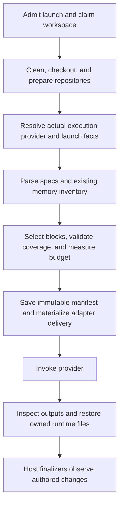

# SASE.md as a launch-time instruction specification

Independent research by **cdx** for `research.3n` · 2026-10-05

**Recommendation:** adopt one authored `SASE.md` specification per instruction scope, backed by the existing memory corpus, and compile it into a provider-specific instruction bundle immediately before each actual provider invocation. The decisive feature is explicit, auditable control over delivery. A filename migration alone does not solve duplication, lost global guidance, or differences in scoped loading.

Use a small declarative Markdown format and a typed launch context. A repeatable `%tag` directive is useful for semantic task labels, but provider identity, model selection, available tools, and execution mode must come from the host. Preserve a universal runtime contract and reference triggers. Keep native instruction filenames as generated interfaces, with an explicit compatibility path for agents launched outside SASE.

## Scope, evidence, and independence

This report independently inspected the primary checkout at `8c8c47f72090f7d28ff9ac6897bea4d3df6bb4c9` and the linked `sase-core` checkout at `ecd2e074b4489c0c326e2137075dfd29be2bc384`. Both were read-only. External documentation was checked on 2026-10-05.

The shared input was read through `sase artifact read`:

`research:202610/agent_instructions_budgeted_router/agent_instructions_budgeted_router.md`

No current swarm peer report, transcript, summary, or findings was consulted. Filenames encountered while locating the explicitly requested shared report were left alone. This is research, not an implementation or an approved SASE plan.

The shared report's historical measurements are its measurements, not fresh measurements in this investigation. In particular, its instruction-size and read-frequency statistics should not become current baselines without remeasurement.

## What SASE already does, and what has changed

The current system is already a generator. It is not five independently maintained root instruction documents:

- `src/sase/amd/constants.py` defines `AGENTS.md` and the `CLAUDE.md`, `GEMINI.md`, `QWEN.md`, and `OPENCODE.md` copies.
- `src/sase/amd/_shared.py:provider_shim_specs` deliberately makes byte-identical copies. Older import shims remain recognizable for migration.
- `src/sase/amd/_template.py` exposes the existing `memory.agents_template` customization, with required core, reference, and web slots.
- `src/sase/amd/_memory.py` renders the sections and validates their structural anchors and expected memory paths.
- `src/sase/main/init_memory/root_rendering.py` and `root_planning_files.py` plan writes, including managed versus custom content and provider copies.
- `src/sase/amd/inventory.py` inventories home, chezmoi, project, and project-subdirectory documents, deliberately pruning linked repositories.

The relevant migration therefore changes the **source contract, launch context, and delivery lifecycle**. It should reuse memory discovery and rendering instead of introducing a second knowledge corpus.

There are instruction files under `tools/`, `src/sase/ace/`, and `demos/tapes/`, in addition to the root files. A root-only migration would omit existing scope semantics.

Two findings refine the prior report:

1. **The Codex home omission is partly addressed in current code.** `src/sase/llm_provider/codex.py:_link_home_agents_fallback` links `~/AGENTS.md` into the temporary Codex home when no native Codex instruction file or override wins. `tests/test_llm_provider_codex_shadow_home.py` covers that fallback and the cases where Codex-specific globals take precedence. This is source/test inspection, not a live provider test. The fallback is conditional and can be disabled with the shadow-home mechanism; it is not explicit composition of all global sources.
2. **Grok duplication remains acknowledged.** `docs/agent_providers.md` says Grok loads both generated project copies, and that `[compat.claude] agents = false` does not suppress it. The current design retains the copies to support a person running Claude in the same tree. Ephemeral, exclusively claimed workspaces give SASE a way to resolve that tradeoff without deleting the user's global files.

The prior report called its proposed trim Python-only. That does not determine the placement of this new feature: the current project instruction explicitly puts new shared backend/domain behavior in `sase_core`.

## Provider evidence: compile for the harness, not the model brand

| Harness | Verified documentation or local evidence | Implication |
| --- | --- | --- |
| Codex | Global instructions live in `CODEX_HOME`; project discovery proceeds from the project root to cwd, picks one candidate per directory, and has a default 32 KiB project-document limit. `AGENTS.override.md` precedes `AGENTS.md`. | Compose SASE global guidance deliberately and inspect shadow-home overrides and configured fallbacks. A generated root file alone cannot control all sources. |
| Claude Code | Current docs describe native `AGENTS.md` support from v2.1.277, with configurable selection of Claude files, AGENTS files, both, or managed-only startup guidance. Ancestor and on-demand descendant loading remain relevant. | The old assumption that Claude invariably requires a duplicate file is no longer universal. Version and settings matter. |
| Grok Build | Docs list AGENTS and Claude filename families plus compatible rule directories. They document `grok inspect`, `--rules`, and skipping Git-ignored instruction files. | One generated filename is insufficient if another recognized alias or rule source remains active. Ignoring runtime files may prevent loading. |
| OpenCode | Docs specify project/global `AGENTS.md`, Claude fallbacks, configurable instruction paths, and switches for Claude compatibility. | Inspect explicit configuration as well as filenames. Do not disable all Claude compatibility merely to eliminate one duplicated instruction source. |
| Antigravity, Qwen, Muse | SASE's constants retain `GEMINI.md` for `agy` and `QWEN.md` for Qwen. This investigation did not verify a complete current discovery contract for these harnesses. | Build conformance fixtures before claiming uniform delivery. Do not infer Antigravity behavior from Gemini CLI documentation or Muse behavior from its model provider. |

Sources: [Codex instruction discovery](https://learn.chatgpt.com/docs/agent-configuration/agents-md), [Claude Code memory](https://code.claude.com/docs/en/memory), [Grok project rules](https://docs.x.ai/build/features/project-rules), [Grok compatibility sources](https://docs.x.ai/build/features/skills-plugins-marketplaces), and [OpenCode rules](https://opencode.ai/docs/rules/).

For Codex, the current SASE shadow home also links native instruction state from the real Codex home. The new design must choose whether that state is supplemental, imported during migration, or excluded when a SASE spec is authoritative; silently inheriting it preserves today's ambiguity.

For Claude, `managed-only` is not evidence of complete discovery isolation: the documented mode still allows some descendant instructions on file reads. Enterprise-managed instructions are a separate authority and should be preserved and identified as external context.

**Important limitation:** these are documentation and source observations. No paid model turns, installed-version conformance probes, or comparison of complete provider prompts was performed. Adapter plans need to prove behavior for the versions actually supported by SASE.

## Is the proposal a good idea?

**Yes, with tighter requirements.** SASE already controls the launch, workspace claim, selected provider, and finalization. Instruction compilation is a natural extension of that control. It can make a global preference apply consistently, remove duplicate generated content, and select relevant guidance without asking the model to interpret conditional prose.

The best benefit is reliable behavior and debuggability. A user can answer “what did this run see, and why?” with a saved compilation manifest rather than reconstructing provider discovery after the fact.

There are significant costs:

- SASE becomes responsible for a compatibility surface currently delegated to each CLI.
- Ephemeral outputs can pollute git status, verification evidence, and finalizer snapshots.
- Conditional sections can hide a prerequisite or create contradictory combinations.
- A custom spec reduces portability for contributors and raw CLI usage.
- A compiler bug can affect every subsequent agent, making validation and rollback part of the feature.
- Startup specialization cannot predict every repository or subsystem an agent will touch later.

The evidence favors a compact contract and map, but does not prove that tag specialization improves SASE task outcomes. The September 29 revision of [Evaluating AGENTS.md](https://arxiv.org/abs/2602.11988v3) finds no general task-success improvement from context files and more than 20% average inference-cost growth; non-standard practices remain a useful category. That is a reason to measure additions rather than automatically ship more context.

[Vercel's Next.js evaluation](https://vercel.com/blog/agents-md-outperforms-skills-in-our-agent-evals) found a compact passive documentation index outperformed its skill approach; skills were often not invoked. That supports retaining visible lookup triggers. It does not establish an optimum SASE line budget or validate an automatic instruction classifier.

My inference from these sources and SASE's architecture is: specialize delivery and optional guidance while keeping prerequisite rules and a broad reference map present.

## Explicit adjustments to the requirements

| Original direction | Recommended adjustment | Reason |
| --- | --- | --- |
| “A single SASE.md file” | One canonical authored filename and schema **per scope**: home, project, and existing subdirectories. Support a project-root-only file later through explicit path sections if desired. | A literal global monolith would mix personal preferences, unrelated projects, and local conventions. |
| “Migrate all existing instruction files” | Migrate authored content, but retain native filenames as generated outputs. Preserve an optional static export for unmanaged agents. | External harnesses do not share a SASE.md loader. |
| “Before launching agents” | Compile after checkout preparation and final provider resolution, before **each provider invocation**, including retries and provider switches. | Queued requests, model aliases, and successor turns are not the resolved invocation. |
| “Render for certain agents” | Match host facts plus explicitly supplied semantic tags. Do not match names, suffixes, tribes, tabs, or model-family guesses. | Operational identity and presentation grouping are not reliable semantic roles. |
| “%tag” | Add repeatable `%tag:<label>` and `%tag(label1, label2)` as launch metadata. Keep it separate from macro `tags:` and project tags. | Existing tag namespaces already mean different things. |
| Provider-specific files | Require each selected logical block to be delivered once across the **effective managed bundle**. Record external contributions separately. | Byte-identical files are not proof of identical effective context. |
| Dynamic customization | Freeze one spec/context snapshot per invocation; do not continually rewrite instructions within an active turn. | Predictability, caching, and postmortems need stable inputs. |
| Budgeted router | Budget the composed home/project startup content and optional sections; keep mandatory rules and reference triggers. | Filtering must not become silent omission or a new encyclopedia. |
| Broad migration | Start with delivery normalization; add conditional blocks after the loading contract works. | This separates two risk surfaces and gives each a measurable outcome. |

The native-file distinction is fundamental: **one source of truth is compatible with several generated interfaces.**

## Agent identification and %tag semantics

Use a typed launch record with independently meaningful fields:

```yaml
provider: codex             # actual executing harness, resolved by host
model: <resolved-model-id>   # recorded; avoid authoring against it initially
mode: managed               # versus an explicit interactive/export profile
project: <project-key>
tags: [research, tui]        # semantic labels, supplied by launch/workflow
capabilities: [web_search]   # facts supplied by the adapter/configuration
```

This is a proposed schema, not current SASE syntax.

The provider field describes the executing adapter. SASE can display one requested provider while executing another: `src/sase/llm_provider/_invoke.py` distinguishes requested and execution provider labels. An instruction selector must use the execution provider.

Prefer `research`, `review`, `tui`, and `docs` over `research.3n.cdx` or `gpt-...`. Labels express what the launch is doing. Provider and capability predicates express how it can do it. Tagging a run `codex` is unnecessary; tagging it `has-browser` is misleading if the configured tools change.

Existing `src/sase/macro/tags.py` defines an enum of macro workflow roles and uses them to choose workflows. Its `tags:` cannot be silently reinterpreted as free-form instruction labels. Use a new field such as `agent_tags` on agent-producing workflow steps; a workflow may also explicitly emit `%tag`. Existing `+project` tags select projects. Tribe/clan/session/tab fields retain their existing purposes.

Recommended launch semantics:

- Normalize labels to a documented lowercase grammar, e.g. `[a-z][a-z0-9_-]*`; reject invalid syntax and deduplicate. Avoid a short `%t` alias, which has migration history.
- Explicit launch labels union with configured workflow defaults. A leading swarm launch context applies to each branch; branch-local labels affect that branch.
- A same-session continuation keeps its semantic labels unless explicitly reset or replaced. A separately launched helper starts from its own defaults and explicit labels; never inherit all ambient parent labels accidentally.
- Recompute provider and capability fields on every invocation. Persist label origin and the resolved set in agent metadata.
- Start with open-ended labels plus warnings for unused labels and completion suggestions from configured selectors. Invalid selector fields are errors. Do not build a global tag registry before real usage demonstrates the need.
- Define an explicit reset operation for continuing sessions, such as `%tag:none`, before promising replacement semantics. Reserve its spelling so it cannot be an ordinary label.
- Labels alter instructional text, not authorization, sandboxing, finalizer selection, or permission to use tools.

Capabilities should report available tools/features, not merely a provider's theoretical support or a guessed model quality tier. An “available browser” field must come from the actual launch configuration. Keep version parsing and version-specific workarounds in adapters, not in authored Markdown predicates.

A formal `%profile` directive is not necessary initially. If users later repeat coherent label bundles, named profiles can expand to defaults without becoming a second selector language.

## A small, readable SASE.md format

I recommend Markdown with YAML frontmatter and explicit, non-nested conditional blocks. Use ordinary prose as the unconditional baseline. Keep the memory corpus outside this file.

Illustrative **proposed** syntax:

````markdown
---
sase_instructions: 1
title: SASE project
---

<!-- sase:memory -->
<!-- Host expands the existing core/reference/web router here. -->

<!-- sase:section
id: research-method
when:
  tags_any: [research]
-->
## Research work

Record evidence and uncertainty. Register completed reports as durable artifacts.
<!-- sase:end -->

<!-- sase:section
id: codex-tool-guidance
when:
  providers: [codex]
-->
## Tool guidance

Use the synchronous handoff procedure supplied by the Codex adapter.
<!-- sase:end -->
````

The exact delimiter is less important than these properties:

- Human-readable content stays Markdown. Metadata is small and declarative.
- Explicit block boundaries make scope independent of heading level and allow line-numbered errors.
- Parse markers with awareness of Markdown fences so quoted examples cannot become active directives.
- Unmarked content is always included; a missing predicate is not accidental exclusion.
- Limit v1 conditions to provider membership, tags-any/tags-all/tags-not, and capabilities-all. Different fields combine with AND. Omitted fields impose no constraint. Reject empty lists and unknown keys.
- Do not accept Python, shell execution, arbitrary Jinja calls, network includes, model-authored classifiers, or recursive include graphs.
- One managed memory slot expands the existing router. Required runtime fragments are provided by SASE and cannot be hidden by a user predicate.
- IDs identify authored blocks within their source scope. Reserve SASE's required IDs. Source provenance travels with every compiled block.

The current generic Markdown template facility can render arbitrary project templates, but its required slots and validation are specifically designed for today's structure. Do not add loosely interpreted `` conditions around those slots and hope the old validator preserves the contract. The new semantics need an explicit AST and coverage validation.

For the first version, avoid generic file inclusion. It creates another source-resolution hierarchy, cycle rules, and cross-repository trust problems. Existing memory routing already supplies modularity. If later needed, introduce a bounded, literal include that remains inside an authorized source root and appears in the manifest.

Keep uppercase root `SASE.md` distinct from the existing generated lowercase `sase/memory/sase.md`. They serve different purposes; case-insensitive filesystem testing should still cover discovery.

### Merge and memory semantics

Resolve sources explicitly: SASE-owned runtime fragments, approved home spec, project spec, and scoped descendant specs. A project can operate without a home spec; absence must be recorded. Do not discover arbitrary ancestor SASE.md files up to the filesystem root and inherit unrelated instructions.

Render a common runtime clause once by its stable SASE-owned identity. Keep home and project inventories separate. In particular, do **not** deduplicate entire `sase.md` notes merely because their filenames match: their project-specific repository and workspace sections differ. Factor shared clauses from scope-specific bindings.

For other authored text, preserve source order and scope. Do not deduplicate unrelated identical strings or treat “later prose wins” as mechanical policy enforcement. Semantic contradictions remain a human review problem. V1 should avoid arbitrary block replacement; explicit override semantics can follow real use cases.

Keep core, reference, and web memory kinds. A conditional section can add research guidance or expand one useful note, but it must not remove the baseline reference triggers. A research agent may unexpectedly edit code; a generic agent may unexpectedly touch the TUI. Labels are not proof that future actions are impossible.

Preserve the existing audited read and write workflows. Compilation should not become a second unaudited memory retrieval engine. The host's normal startup memory loading is distinct from the model's on-demand reads; both need clear provenance, and the latter must remain audited.

### Preserve path scope

Migrate subdirectory documents to sibling SASE.md files initially. Emit a root instruction file plus **local additions** in generated descendant files. Do not repeat the whole root bundle into every child.

Do not hoist every subtree rule into the root prompt. For providers with compatible scoped discovery, use native descendant outputs. For providers without it, supply an always-visible subtree map and require an audited/explicit scope read before work there, or state that strict automatic scope equivalence is unsupported. An eager aggregate of all subtree content is a compatibility option with a visible budget cost, not a silent substitute.

Path-specific behavior depends on file access during the turn, not just launch cwd. Testing root starts and nested starts separately is essential.

## Compile and deliver as a provider-adapter transaction

The lifecycle should be:



A fresh invocation gets a fresh context, even if a successor uses the same workspace. Retrying the same already-prepared invocation can reuse its captured input bytes if its identity and context are unchanged. A provider switch requires a new delivery plan. Avoid changing guidance in the middle of one active turn.

The preparation hook belongs near the resolved `provider.invoke` boundary in `src/sase/llm_provider/_invoke.py`, after `LaunchSelection` has supplied concrete provider/model/effort and after workspace checkout. `src/sase/axe/run_agent_runner_launch.py` prepares workspaces after admission, including deferred allocation. Rendering only when a request is submitted would be too early.

There are additional provider-internal continuations and host finalizer invocations. Scope the delivery lease around every relevant subprocess, with shared preparation infrastructure, rather than assuming the main runner is the sole launch path.

### Provider delivery contract

Add an optional provider metadata/preparation hook, analogous to existing `LLMHookSpec` metadata, describing:

- Preferred native file or injection channel.
- Automatically recognized instruction aliases and known rule sources.
- Global-source handling and available discovery exclusions.
- Path-scope and byte-limit behavior.
- A bounded inspection/probe mechanism and supported-version evidence.

The adapter turns this declaration plus a compiled bundle into argv, environment, and owned file actions. Unknown third-party providers remain on legacy behavior unless they declare support; do not pretend a guessed filename is a conformance contract.

Keep the single-turn protocol mechanically owned by adapters. The audited decision `decisions:adapters-normalize-harnesses` requires that boundary. Project authors can supply workflow guidance; they should not replace provider launch invariants or the host's finalizer contract.

Preferred delivery is one ordinary native file per needed scope, with global material either delivered through a controlled global slot or composed into the root bundle. Choose one placement for each logical block and record it. A common home/project runtime clause must not arrive through both routes.

Direct injection is useful when a provider exposes a reliable channel, but it is not the universal answer. It may promote project text to a stronger message role, leave automatic discovery active, miss subtree loading, or exceed argv limits. SASE's Antigravity adapter already guards an argv transport byte limit. Do not replace an entire harness system prompt to load project instructions.

### The difficult filesystem details

**Generated native files cannot simply all be Git-ignored.** Grok's documented behavior makes that unsafe. Its inspector must prove that the selected output is loaded. Whether `.git/info/exclude` behaves like a tracked `.gitignore` for its discovery is unverified; do not substitute one and assume the problem disappears.

Start with nonignored generated instruction files where necessary. Give the host an exact run-owned path-and-hash manifest so its git scans, final declarations, verification fingerprints, and commits distinguish these outputs from authored changes. A broad “ignore every AGENTS.md” filter would hide genuine work.

Existing workspace setup installs per-clone exclusions for `.sase/` and `/sase/repos/`. Those are useful for a workspace-side manifest pointer, but a copy under an ignored directory is not proof that a native harness discovers it.

Materialization must:

1. Hold the checkout ownership/operation lock and run after reset/clean.
2. Refuse to overwrite unmanaged custom content without a migration or explicit import policy.
3. Suppress or replace only legacy generated aliases whose ownership is established.
4. Stage output files, save previous bytes and hashes, publish all files before invocation, and record a completion marker. Do not claim that several filesystem renames are one atomic operation.
5. Restore/remove runtime outputs after the provider exits and before host commits. Final context and snapshot code must recognize owned overlays while the provider is still running.
6. Restore only when the current bytes match the materialized hash. If an agent changed an output, preserve that evidence and surface a source-edit error instead of deleting its work.
7. Recover interrupted preparation and stale leases at the next claimed-workspace preparation using the durable manifest.

Source-edit instructions should point agents to SASE.md or canonical memory, never to ephemeral native outputs.

Migrate tracked generated aliases out of managed-only repositories where practical. If a repository retains a committed portability export, temporarily overlay it in the managed workspace and restore it with the same manifest discipline. This case is more complex and must have a finalizer fixture.

Never rewrite real home instruction files to specialize a run: other agents may be using them simultaneously. Use per-invocation provider configuration/shadow state and explicitly control inherited native globals. Link or copy authentication/skill state only as appropriate; instruction isolation must not casually disable skills, hooks, or enterprise policy.

### Repositories opened during a turn

The initial compiler should not traverse all linked/sidecar repositories to preload their instructions. That conflicts with SASE's explicit repository-access boundary and bloats context.

When `sase repo open` materializes another checkout, it should report the authoritative instruction source and, when needed, provide a compiled scoped view for the current context. An agent switching cwd cannot assume its harness re-runs startup discovery. Preserve the explicit instruction-read requirement. Implementation should integrate at the open boundary rather than make every launch crawl a fleet of repositories.

## Ownership: Rust semantics, Python host and adapter I/O

Place the new shared domain in `sase-core`, for example an `instruction_spec` module with serde request/response records. This module owns versioned parsing, selectors, source ordering, block identity, coverage, budgets, and compilation results.

Python can load approved source bytes, resolve provider plugins and host paths, pass immutable context to Rust, perform materialization, and invoke providers. Adapter configuration and subprocess behavior remain host responsibilities. Reuse the existing memory inventory/rendering through a thin bridge; do not require an unrelated rewrite of every legacy Python memory renderer.

An illustrative result would contain root/subtree text, selected/skipped block IDs with reasons, coverage and budget diagnostics, source ranges, and an input digest. Delivery actions can remain host plans because provider behavior is plugin-defined.

Expose the binding through `sase_core_rs` with round-trip tests and advance `sase-core-revision.txt` before Python depends on it, as required by the local backend boundary. This is a coordinated two-repository change.

## High-value uses beyond provider fixes and tags

| Use | Practical value | Limit |
| --- | --- | --- |
| Reproducible run context | Store exact source snapshots, selection decisions, output hashes, compiler version, and adapter version. A regression can be traced to instructions instead of guessed. | Store bounded startup context, not a new copy of every reference note. |
| Home/project normalization | A personal rule reaches all supported harnesses; common runtime clauses arrive once. | Preserve genuinely project-specific inventories and preferences. |
| Preview and explain | Show the rendered bundle and why each section matched before launch or from an existing run. | Do not let preview re-resolve a rotating model alias and consume routing state. |
| Actual-tool guidance | Choose workflow advice based on available search/browser/editor tools. | Capabilities inform text; they grant no access. |
| Phase-specific guidance | Research, review, implementation, and recovery can each receive short optional instructions. | Explicit role defaults and labels, not a hidden classifier. |
| Linked-repository context | Opening another checkout can disclose its correct instructions with current labels. | Open on demand through the existing audited interface. |
| Budget attribution | Report which scope/block adds bytes, lines, or estimated tokens and identify duplicate delivery. | Never truncate mandatory rules to make a number pass. |
| Provider conformance upgrades | Test an instruction adapter when a harness version changes instead of depending on undocumented assumptions. | Known versions can still have configuration-dependent behavior. |
| Portable exports | Produce conventional files for raw CLIs, editor assistants, or CI tools from the same authored source. | Export an explicit baseline/profile; do not expose personal home guidance by default. |
| Controlled instruction experiments | Compare baseline versus role-specific optional guidance with the same task cohort. | Record outcome and compliance; reduced prompt size is not proof of better work. |

Avoid adding prompt-keyword retrieval, automatic task classification, learned model-specific “personalities,” or a new memory graph in v1. SASE's audited `decisions:corpus-before-mechanism` records prior costly removal of speculative retrieval. Explicit labels and deterministic predicates address demonstrated needs without reviving that machinery.

## Alternatives and why I would choose this one

| Approach | Assessment |
| --- | --- |
| Keep AGENTS.md canonical and only repair adapters | Lowest-cost way to fix immediate loading problems. Good first delivery step, but existing conditional template semantics and source/output ambiguity remain. |
| Rename all copies to SASE.md and add aliases/symlinks | Reduces authored filenames but does not control automatic loading or global discovery. Some harnesses may load multiple paths. |
| Feed one big SASE.md to every provider | Portable only with adapter support, and it loads nonmatching guidance unless compilation happens first. It also loses native subtree semantics if flattened. |
| Jinja template plus unrestricted launch context | Fast prototype using existing facilities, but turns guidance into a general program with opaque inclusion and fragile validation. |
| Inject everything into system/developer prompts | Useful adapter option; insufficient as a cross-provider architecture and potentially changes instruction authority. |
| Extend memory metadata alone | Good if requirements only concern selecting individual notes. It does not fully address custom non-memory instruction prose, scope migration, or delivery bugs. |
| Small spec + existing memory + adapter delivery | Best balance for the combined request. More code than a rename, but the complexity corresponds to actual loading and launch differences. |

The cheaper adapter-only option is a legitimate stopping point if the only demonstrated need is the two provider bugs. I recommend the small spec because the request also includes maintained, explicit conditional instruction sections. Build it only after delivery normalization proves useful.

## Migration sequence and acceptance criteria

This is an implementation recommendation for later authorization, not a `sase plan propose` handoff or changes performed in this turn.

**First, normalize and inspect delivery.** Inventory root/home/subdirectory and provider-specific custom sources. Build the ownership manifest and adapter fixtures. Fix Grok duplication and make Codex global composition explicit with today's source model. Capture a baseline effective bundle for each supported provider.

**Second, introduce the source spec.** Add v1 parsing/compilation in Rust and bindings. Migrate a generated project and home source in an opt-in path. Preserve core/reference/web rendering. Compare old and new logical content and maintain a source map; do not judge equivalence solely by generated-file hashes.

**Third, add explicit labels and a few conditional sections.** Extend the directive registry, launch wires, fan-out, metadata persistence, continuation handling, workflow steps, and editor completion. Start with one research block and one provider-specific example. The current Rust directive scanner obtains aliases from the shared editor registry; do not create a second parser for %tag.

**Fourth, migrate remaining managed sources and exports.** Review custom provider-only differences before grouping them into predicates. Update source discovery, init/check behavior, inventory/doctor, documentation, and the meaning of legacy template overrides. Any future canonical memory or generated instruction changes must use the memory-write authorization workflow. Keep unrelated corpora and sidecars intact.

**Finally, measure and retire compatibility deliberately.** A valid SASE.md becomes authoritative for that scope; without one, legacy behavior remains during migration. If both contain independently authored content, error with a reconciliation report rather than silently concatenating them. Preserve a snapshot and reversible per-scope migration record.

For budgets, retain the prior report's project-router target of roughly 100 formatted lines and 1,600 estimated tokens as a starting objective, not a proven optimum. Establish a separate ratchet for the composed startup bundle and report adapter/native external overhead separately. Attribute costs by block and reserve headroom. On overflow, fail with actionable attribution; do not silently delete matching sections.

Required tests and evidence:

- Parsing rejects malformed metadata, missing ends, unknown fields, unsupported schema versions, nested blocks, and duplicate IDs; fenced examples remain literal.
- Selectors behave correctly for untagged, multi-tag, unsupported capability, and actual-provider-switch cases.
- Universal rules and every baseline reference trigger survive all supported contexts. All-false optional predicates still produce a valid router.
- Home/project composition does not repeat shared runtime clauses and does preserve distinct scope inventories.
- Nested starts and root-to-subtree file access preserve local instructions without repeating parent content.
- Adapter fixtures cover native global overrides, configured fallback names, compatible rule directories, custom instruction lists, and duplicate recognized filenames.
- Grok inspection sees the intended runtime file, including a fixture that demonstrates the Git-ignore failure mode.
- Workspace reuse, deferred allocation, concurrent distinct workspaces, failed materialization, provider error, killed runner, and output tampering leave recoverable state.
- Final context, verification fingerprints, and host commits exclude unchanged owned outputs while preserving real SASE.md edits and changed runtime outputs as evidence.
- Raw CLI/export behavior is documented and tested separately from managed runs.
- Before/after scenario probes cover a simple code edit, linked-repo access, memory access, research artifact registration, TUI work, and long-command handoff.

Use local deterministic fixtures first. Provider inspectors or recorded instruction-loading events are stronger than asking a model what it remembers. Where no inspection channel exists, use a small explicitly authorized smoke suite with unique sentinel clauses and review the loaded-context evidence. Require “exactly once” delivery evidence for managed clauses; do not require that arbitrary external enterprise guidance be identical across harnesses.

Track missing/duplicate clauses, source-to-output reproducibility, lookup-trigger coverage, finalizer compliance, and a matched task sample's outcomes. Context size and startup latency are secondary but useful. Re-run conformance only when adapter/configuration/provider-version changes justify it.

## Evidence index

Local source references are relative to the repositories noted at the start of this report:

- SASE: `src/sase/amd/{constants.py,_shared.py,_template.py,_memory.py,inventory.py}`; `src/sase/main/init_memory/{root_rendering.py,root_planning_files.py}`.
- SASE launch/delivery: `src/sase/axe/run_agent_runner_launch.py`, `run_agent_runner_setup_workspace.py`; `src/sase/llm_provider/{_invoke.py,_hookspec.py,codex.py,agy.py}`; `tests/test_llm_provider_codex_shadow_home.py`.
- Existing label meanings: `src/sase/macro/tags.py`, `src/sase/axe/run_agent_directive_metadata.py`.
- Rust launch integration: `crates/sase_core/src/agent_launch/{wires.rs,directive_scan.rs}` and `crates/sase_core/src/editor/directive/metadata.rs`.
- Backend requirements: the supplied project instructions and `docs/rust_backend.md`.
- Audited memory context: `sase_artifacts.md`, `macros.md`, `glossary:agent_instruction_file`, `glossary:agent`, `decisions:adapters-normalize-harnesses`, `decisions:host-owned-completion`, and `decisions:corpus-before-mechanism`.
- External primary sources are linked beside their claims above. Current-doc behavior remains subject to installed-version verification.

## Recommended solution

Adopt **one authored SASE.md format per scope, compiled from explicit launch facts and existing memory into one stable, auditable provider bundle per invocation**.

Implement delivery normalization first. Then add a small declarative spec in Rust and repeatable %tag metadata for semantic roles. Keep provider identity and capabilities host-owned. Preserve universal prerequisites, reference triggers, and subtree scope. Make generated files an owned runtime interface with exact cleanup and finalizer handling; retain a deliberate export path for unmanaged agents.

This architecture is a good fit for SASE because it already owns workspaces and provider launches. Its success criterion should be that every managed instruction reaches the intended agent once, with a reproducible explanation—not merely that AGENTS.md has been renamed.
