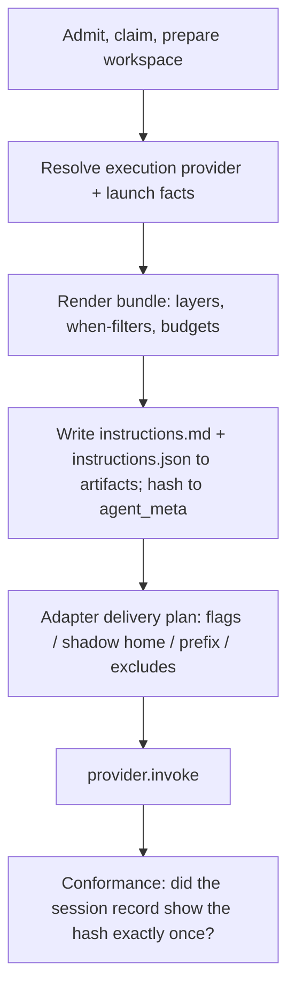

# SASE.md and Per-Invocation Instruction Delivery: Consolidated Report

> **Research request:** Migrate every agent instruction file to a single `SASE.md` that
> defines a spec for the agent instruction file. SASE would use that spec to build the
> right instruction file dynamically in each ephemeral workspace before launching an
> agent there. The goals are:
>
> - fix the provider-loading bugs from the `agent_instructions_budgeted_router` research
>   (Grok reads both `AGENTS.md` and `CLAUDE.md`; Codex never reads `~/AGENTS.md`);
> - render some parts only for some agents, perhaps through a new `%tag` directive;
> - surface use cases the request missed.
>
> The request also asks for a critique, justified requirement changes, and a
> recommended solution.

_Lead consolidation · 2026-10-05 · merges the `cdx`, `cld`, `grk`, `mus`, and `gem`
reports in this directory, plus new verification by the lead. sase checkout
`63ff816627`. Installed CLIs: Claude Code 2.1.289, codex-cli 0.160.0, grok 1.0.46, agy
1.2.17, Muse 1.4.2._

## Bottom line

**Build it, but not as stated.** All five researchers agree on the core idea. SASE
should author instructions in one place and specialize them for each agent at launch.
SASE already owns the workspace, the provider choice, and the finalizer, and it already
generates the files. What it lacks is control over the last step: which bytes each
provider CLI actually loads. Today that step is left to chance.

**The premise is out of date, and the real bugs are worse.** The lead's verification
found:

| Request says | What is true on 2026-10-05 | Evidence |
| --- | --- | --- |
| Grok reads both `AGENTS.md` and `CLAUDE.md` | **Grok has loaded no instruction file in SASE workspaces since about 2026-09-10.** Grok 1.0.46 loads project rules only in a *trusted* folder, and SASE never grants trust. The double load is what would come back if trust were granted. | `grok inspect` in a workspace prints `Project trusted: no`, `Project Instructions (0)`. Every Grok workspace session from ISO week 38 through 41 (465 sessions) recorded `agents_md_files: []`. Installed docs: "Startup loading requires folder trust (`--trust` or an interactive grant)." |
| Codex never reads `~/AGENTS.md` | **Codex does read it in SASE runs.** SASE's shadow `CODEX_HOME` links it in. The real Codex bug is that the shared SASE contract arrives **twice**. | A 2026-10-05 rollout has one 21 KB instruction block. The home H1 comes first, then `--- project-doc ---`, and "SASE Final Declaration" appears twice. |
| _(not mentioned)_ | **Claude also gets the contract twice**, and the two copies disagree. `~/CLAUDE.md` lists `chezmoi` as "the" linked repo, while the project file lists six `sase-*` repos. | Both files appear in this lead session's own injected context. |
| _(not mentioned)_ | **Muse and Grok never get the home layer** (tailnet, Obsidian, chezmoi). Only Claude and Codex runs see it, about 56% of runs. | Muse session: zero home H1s. SASE passes `--no-foreign-personal-context` to Muse. |

**Recommendation in one sentence:** render one **instruction bundle** per provider
invocation from layered memory, using a small optional `SASE.md` *composition spec*.
Target it with a closed set of host-known **launch facts**, not `%tag`. Each provider
adapter delivers it **exactly once** through an explicit channel rather than by writing
files into the workspace. Record it as provenance, and check it continuously against
what each provider actually loaded.

The [recommended solution](#recommended-solution) is phased. Phase 0 is a few days of
stopgaps, including a one-flag Grok fix. Phase 1 is the bundle renderer and adapter
delivery. Later phases untrack the generated files, add audiences, and add labels only
on demand.

## 1. Verified current state

### 1.1 The pipeline

- **Generation.** `sase memory init` renders root `AGENTS.md` from memory notes through
  `src/sase/amd/templates/AGENTS.template.md`. It then writes byte-identical
  `CLAUDE.md`, `GEMINI.md`, `QWEN.md`, and `OPENCODE.md` (`PROVIDER_SHIM_FILES`,
  `src/sase/amd/constants.py`).
- **Home layer.** The home layer (`~/AGENTS.md` and copies, 74 lines, 3.9 KB) is
  generated through chezmoi, with a hostname `.tmpl` switch.
- **Nested files.** `tools/`, `src/sase/ace/`, and `demos/tapes/` have hand-written
  `AGENTS.md` files, each with four copies.
- **Size and churn.** There are **20 tracked instruction files**. The root file is 285
  lines and 17.4 KB. In the last 60 days, **111 commits** touched root `AGENTS.md`.
- **Provider text outside the files.** Adapters already send provider-specific text
  outside these files:
  - Claude: `_SINGLE_TURN_DIRECTIVE` via `--append-system-prompt`;
  - Codex: `developer_instructions`;
  - Antigravity: `_AGY_PRINT_MODE_DIRECTIVE` as a prompt prefix;
  - Muse: a prefix from `_muse_directive.py`, because "Muse has no append-system-prompt
    flag".

  This text is hand-maintained Python that memory review never sees.
- **Snapshot.** `capture_instruction_snapshot` (`src/sase/axe/launch_evidence.py:166`)
  records which instruction files are **on disk**, not which ones the provider
  **loaded**. Today it would claim Grok saw `AGENTS.md`.

### 1.2 What each provider actually loads

Run shares come from cld's count of 7,007 sase-project runs over 30 days.

| Provider | Share | Home layer | Project file | Nested files | Confidence |
| --- | ---: | --- | --- | --- | --- |
| Codex | 31% | ✅ via shadow `CODEX_HOME` (only if no native `~/.codex/AGENTS*.md` exists) | ✅ | ❌ (cwd is the repo root) | **Verified** (rollout) |
| Muse | 29% | ❌ (`--no-foreign-personal-context`) | ✅ once (`--trust-workspace`) | unknown | Verified (session log) |
| Claude | 25% | ✅ `~/CLAUDE.md` as an ancestor | ✅ | ✅ lazily, on read | **Verified** (lead context) |
| Grok | 13% | ❌ | **❌ since about 2026-09-10** (×2 before) | ❌ | **Verified** (inspect, 1,053 session records, installed docs) |
| agy | 0.9% | ❌ | ×2 likely (`AGENTS.md` + `GEMINI.md`) | lazily | Vendor-documented. gem reported seeing both in its own context, but agy transcripts don't record rules, so this is not independently verified. |
| OpenCode | ~0 | ❌ | `AGENTS.md`; **`OPENCODE.md` is never read** | — | Docs only |
| Qwen | 0 | ❌ | ×2 (`QWEN.md` + `AGENTS.md`) | — | Docs only |

Grok detail:

- `~/.grok/trusted_folders.toml` trusts only the primary checkout. Sessions in that
  checkout kept loading two files.
- By ISO week, workspace sessions went from 230 two-file loads (wk 34) to a mixed week
  37 (82 two-file, 117 zero), then zero-only from week 38 on.
- cld found a correlated drop in Grok's final-declaration rate for non-research runs,
  from 60% (62/104) to 26% (43/163). Claude and Codex moved six points or less. This is
  a correlation, not proven cause, but it is the strongest signal that instruction
  delivery matters behaviorally.

### 1.3 Provider facts that constrain the design

These were checked on 2026-10-05 against official docs and installed CLIs.

- **Claude Code**
  - `CLAUDE.md` is delivered "as a user message after the system prompt". The
    project-root file is re-read after compaction.
  - `claudeMdExcludes` takes absolute-path globs at any settings layer, including
    `--settings`. It also applies to `AGENTS.md`. Only managed-policy files can't be
    excluded.
  - Native `AGENTS.md` (v2.1.277+) is ignored in the default mode if any `CLAUDE.md`
    exists in cwd **or any ancestor**. `~/CLAUDE.md` is an ancestor of every workspace,
    so this applies on athena.
  - `--append-system-prompt-file` exists, and since v2.1.283 it combines with
    `--append-system-prompt`.
  - **Subagents.** Built-in subagents other than Explore and Plan load the `CLAUDE.md`
    hierarchy. The docs don't say whether they inherit appended system-prompt text, and
    most likely they don't. `--append-subagent-system-prompt-file` (v2.1.261+, `-p`
    only) is the documented channel to them.
- **Codex**
  - The global file is the first non-empty of `$CODEX_HOME/AGENTS.override.md` and
    `AGENTS.md`.
  - Project files load from the root down to cwd, at most one per directory.
  - `project_doc_max_bytes` defaults to 32 KiB.
  - **No documented knob disables project `AGENTS.md` discovery.**
  - `developer_instructions` adds to instructions; it does not replace them.
- **Grok 1.0.46**
  - Project files load only in trusted folders.
  - Every matching name in a directory loads, so `AGENTS.md` and `CLAUDE.md` both load.
  - Gitignored files are skipped.
  - `[compat.claude] agents = false` (`GROK_CLAUDE_AGENTS_ENABLED`) does **not**
    suppress a generic top-level `CLAUDE.md`. That makes cld's proposed env-var guard
    ineffective.
  - `--rules <TEXT>` appends to the system prompt. `extra_rule_dirs` loads "regardless
    of folder trust, the repository's `.gitignore`".
- **Antigravity**
  - Loads `GEMINI.md`, `AGENTS.md`, and `.agents/rules/*.md`, deduplicated only by
    resolved path.
  - Limits are 24 KB per file and a 20k-token rules budget.
  - It has no system-prompt flag.
- **The `AGENTS.md` standard** has no mechanism for conditional or per-agent sections.
  SASE would be designing this itself.

## 2. Critique: is this a good idea?

**Yes, on direction. Several specifics need to change.**

### 2.1 What the plan gets right

1. **It targets the faulty layer.** The content, memory notes with
   core/reference/webs, is healthy. The *projection* is broken: static copies that each
   CLI reads by its own changing rules. A static home file can't know whether a project
   file will also load, so only a per-launch render can remove the home/project
   duplication for every provider at once.
2. **Audience targeting is real demand that already exists in hiding.** Examples:
   - the four adapter directives;
   - per-provider Jinja in skills (`sase_questions.md`);
   - prose exceptions in the shared contract, such as "Unless your prompt explicitly
     forbids creating beads (epic phase workers, for example…)".

   Making these explicit makes them reviewable and budgetable.
3. **It fits decided architecture.** `decisions:adapters-normalize-harnesses` makes
   each adapter conform its CLI to SASE's contract. Instruction loading is exactly such
   a harness difference. It also resolves the router report's objection to
   adapter-injected text, that it would be "invisible to memory review": the injected
   text is now *rendered from* memory.

### 2.2 What it gets wrong or leaves out

1. **"Construct the file in the workspace" is the wrong delivery mechanism.** cld, cdx,
   and grk independently found several failure modes:
   - **The files are tracked.** The finalizer baseline is captured at bootstrap
     (`run_agent_runner_bootstrap.py:326`), and staging is `git add -A`. A rewritten
     `AGENTS.md` becomes a commit.
   - **Untracking and ignoring them breaks Grok and Codex.** Grok skips gitignored
     files. It is untested whether that includes `.git/info/exclude`, which is what
     gem's and mus's designs rely on. Codex cannot suppress a project `AGENTS.md` that
     is present at all.
   - **Ancestors still load.** `~/CLAUDE.md` loads for Claude regardless of what is
     written in the workspace.
   - **Reused workspaces keep stale files.** Prep stashes only non-ignored files. Any
     launch path that skips regeneration inherits the previous agent's file. The
     finalizer follow-ups (`declaration_recovery.py:83`, `commit_repair_conflict.py:409`)
     call `provider.invoke` directly.
   - **"Before launch" is too early.** The execution provider is final only at
     `_invoke.py:436`, after routing and `A || B` fallback.
   - **The agent, or a hostile upstream repo, can edit its own instructions.**

   Writing files should be a *fallback channel* for a provider that has nothing else.
2. **A single `SASE.md` holding the instruction text would recreate the problem the
   router research just solved.** It would bring back the 283-line encyclopedia and
   bypass:
   - per-note `type:`;
   - audited `sase memory read`;
   - web strands;
   - `[[links]]`;
   - `/sase_memory_write` routing.

   Four of five researchers reject the monolith; only gem adopts it. The useful single
   file is a **composition spec**: layers, slots, conditions, and budgets. The content
   stays in notes.
3. **`%tag` is a burned name and the wrong primary mechanism.** History:
   - `%tag`/`%t` shipped in April 2026;
   - it became `%group`/`%g` on 2026-05-10 (`5ebfc3e658`);
   - tribes replaced groups on 2026-07-17 (`01661d3c9b`).

   **`%t` is now an alias for `%tribe`** (`_directive_types.py:110`), and legacy
   `tag`/`tags` metadata is still read as a tribe (`core/agent_tribe.py:246-260`). See
   [§4](#4-identifying-agents-launch-facts-first-not-tag).
4. **There is no verification.** The Grok regression went unnoticed for about four
   weeks, because nothing compares "what SASE meant to send" with "what the provider
   loaded". Without a conformance check, the new design will drift the same way.
5. **"Single" has to mean one *format* across several *scopes*:**
   - a packaged base, owned by SASE;
   - a home layer, owned by the user through chezmoi;
   - a project layer;
   - path scopes.

   A literal global monolith would mix personal preferences, unrelated projects, and
   local conventions.
6. **Humans and outside tools need an answer.** `docs/agent_providers.md` keeps
   `CLAUDE.md` precisely so a human running `claude` in the tree still works.
   `sase-org/sase` is public, and `sase tmux-agent` launches raw CLIs.

## 3. Requirement adjustments

_Each of these changes the request as stated._

> **R1. Deliver, don't write.** SASE runs receive SASE-owned instructions **only**
> through each adapter's explicit channel. In SASE runs, no SASE-owned file loads
> natively. Repo-owned files, such as an upstream `AGENTS.md` in a foreign repo, still
> load natively and are never copied.

> **R2. `SASE.md` is an optional composition spec, not the content store.** It is
> layered over a packaged default spec. It declares layout, layer order, conditional
> blocks, and budgets. Memory notes stay the content and gain a `when:` frontmatter key.
> The generated `sase/memory/sase.md` contract note is **retired into the packaged
> base**. That removes the name collision and makes the shared contract render once by
> construction.

> **R3. One format, several scopes.** The scopes are a packaged base, a home spec
> (`~/.config/sase/SASE.md`, managed by chezmoi), an optional project `SASE.md`, and
> path-scoped notes. The spec never discovers arbitrary ancestor files.

> **R4. Render per provider invocation, not per workspace launch.** Rendering happens
> at the `_invoke.py` boundary and in the finalizer follow-up and fallback
> re-invocations. One invocation gets one frozen render.

> **R5. Audiences come from launch facts first. There is no `%tag`.** Free-form labels
> wait until a real section needs one. When they arrive, they are declared in macro
> frontmatter, with a prompt directive under a fresh name as an escape hatch. Labels
> change instruction text only, never permissions, sandboxing, or finalizers.

> **R6. Exactly-once delivery is a tested invariant and a deliverable.** A conformance
> check reads each provider's own session record. It asserts that the bundle hash
> appears exactly once and that no SASE-owned native file loaded.

> **R7. Generated instruction files stop being committed in SASE-managed repos.** This
> follows from R1 plus one fact: Codex, at 31% of runs, cannot suppress a present
> project `AGENTS.md`. A committed full file would keep the duplicate and block every
> audience-specific *removal* for Codex. Humans get gitignored local projections, and
> public repos may commit a small hand-written stub.

> **R8. Budgets apply per audience.** The router's ratchet (≤100 lines and ≤1,600 tokens
> for the project layer) applies to each rendered audience in a matrix. The
> provider-effective total is reported separately.

> **R9. Hard rules and reference triggers are unconditional.** A `when:` can add text,
> or drop optional text from an audience. It can never hide the runtime contract or the
> baseline read triggers. "This agent is a researcher" does not prove it won't touch
> code.

## 4. Identifying agents: launch facts first, not `%tag`

### 4.1 The options

| Option | Verdict | Reasoning |
| --- | --- | --- |
| **Closed launch facts** (table below) | **Adopt in v1** | Every concrete conditional the five researchers found keys on something SASE already knows: provider (adapter directives), role (lean monitor and gate turns), phase-worker (the bead rule), tribe or macro (research vs. code), commit method (rollover text), and host (home layer). No new syntax is needed, and facts can't be forgotten or mistyped at launch. |
| Macro-declared labels (`traits:` in macro frontmatter) | **Adopt later**, when a section needs a label no fact provides | The macro knows the agent's job. `#research_swarm` declaring `traits: [research]` reaches every member, and no one has to type anything per prompt. "trait" is unused in `src/` and `docs/`. |
| Prompt escape hatch (`%trait:x`) | Only after traits exist | Useful for experiments. It must go through the shared Rust directive registry and editor metadata (`crates/sase_core/src/agent_launch/directive_scan.rs`, `editor/directive/metadata.rs`), not a second parser. |
| `%tag` (the request's instinct; kept by gem and cdx) | **Reject the name** | `%t` already means `%tribe`, legacy `tag` metadata is read as a tribe, and "tag" already names macro tags, `+project` tags, and others. Hand-typed tags also drift: gem's own critique notes users "will not remember to type `%tag swe`". |
| Reuse tribe as the label mechanism (grk) | Reject as the mechanism; keep it as one fact | A tribe is single-valued and drives presentation (TUI panels, styling). Making it the instruction selector would couple display to behavior. |
| Agent names or ids (`research.3n.cdx`) | Reject | Ephemeral identities that can't be tested in CI (mus). |

This follows `decisions:corpus-before-mechanism`: ship the label mechanism only once a
real section needs it.

### 4.2 Launch-fact schema

The schema is closed and validated. Unknown keys and unknown values are errors.

| Fact | Source today | Example values |
| --- | --- | --- |
| `mode` | new | `sase` (launched run), `interactive` (human projection or `tmux-agent`), `export` (committed stub) |
| `provider` | **execution** provider label (`_invoke.py`), never the requested one | `claude`, `codex`, `grok`, `muse`, `agy`, plugin names |
| `model`, `size`, `effort` | launch selection | `opus`, `large`, `high` (record only at first; don't author against them) |
| `role` | `agent_session_role`, plus `subagent` for the Claude subagent channel | `root`, `plan`, `code`, `epic`, `commit`, `monitor`, `gate`, `subagent` |
| `phase_worker` | `phase_bead_id` present | `true` |
| `tribe`, `clan` | agent metadata | `research`, `research.3n` |
| `macros` | resolved macro names and `MacroTag` roles | `research_swarm`, `pr` |
| `commit_method` | `SASE_COMMIT_METHOD` | `pr`, `commit`, `propose` |
| `vcs`, `project`, `host` | runner state, hostname, or the `%dispatch` target | `github`, `sase`, `athena` |
| `flags` | SASE feature flags | staged rollouts, A/B variants |
| `capabilities` | *later*; adapter-reported tools actually configured | `web_search` |
| `traits` | *deferred*; macro frontmatter | `read_only` |

Semantics, mostly from cdx:

- Labels persist across same-session continuations. Separately launched helpers start
  from their own defaults and never inherit ambient parent labels.
- Provider and capabilities are recomputed on every invocation.
- Both the resolved set and the origin of each value are recorded in agent metadata.

## 5. Design

### 5.1 Layers

The bundle is composed in a fixed order and deduplicated by section id. A clause stated
in an earlier layer is never repeated by a later one.

| # | Layer | Source | Owner |
| ---: | --- | --- | --- |
| 1 | **Package** | Runtime contract (final declaration, `/sase_repo`, memory routing), today's four adapter directives as provider-conditional sections, and the current project's repo inventory rendered from facts | `sase`, versioned |
| 2 | **Plugins** | Hook-contributed sections, e.g. `sase-github` VCS rules when `vcs: github` | plugin |
| 3 | **Home** | Home memory (tailnet, Obsidian, chezmoi). Host-conditional sections replace the chezmoi hostname `.tmpl`. | user |
| 4 | **Project** | Project memory notes (core inlined; reference as one-line triggers; webs), plus an optional project `SASE.md` layout | project repo |
| 5 | **Launch** | Optional live facts (bead or epic context, clan isolation rules), placed last so the stable prefix stays cache-friendly | runtime |
| — | **Repo-owned** | Upstream `AGENTS.md` or `CLAUDE.md` in foreign repos | upstream; loaded natively, never copied |

### 5.2 The `SASE.md` format

The researchers proposed five syntaxes:

- gem: `<!-- sase:if expr -->` with an expression evaluator;
- cdx: comment-delimited blocks with YAML `when:`;
- cld: Jinja with an `audience()` function;
- mus: `::: only(...)` fences;
- grk: note frontmatter plus Jinja `launch.*`.

**Resolution:** use **declarative `when:` maps everywhere, with no free expressions**,
and one evaluator shared by notes and `SASE.md`.

- **Notes, the primary surface.** Most conditional content is a note, so the main
  authoring surface is frontmatter:

  ```yaml
  ---
  type: reference
  description: Read before changing the SASE TUI…
  when:
    role: [root, code, plan]       # OR within a key
    not: { tribe: [research] }     # AND across keys; `not` negates
  ---
  ```

  A reference note whose `when:` does not match loses only its *trigger line*. Any
  agent can still read it with `sase memory read`.
- **`SASE.md`, for layout and non-note prose.** It uses explicit block markers that a
  Markdown parser can locate with line-numbered errors, and that are inert inside code
  fences:

  ````markdown
  ---
  sase_instructions: 1
  extends: sase:base
  ---

  <!-- sase:slot core -->
  <!-- sase:slot reference -->

  <!-- sase:section id=phase-worker-beads
  when: { phase_worker: true }
  -->
  Do not create beads; record `PROPOSED FOLLOW-UP:` notes on your phase bead.
  <!-- sase:end -->
  ````

Why declarative maps rather than Jinja expressions or gem's evaluator:

- **They validate.** A closed schema can check every key and value, so
  `provider: codx` is an error rather than a branch that is silently false.
- **They can be enumerated.** The checker can render and budget every reachable
  audience.
- **Rust and the LSP can read them** without embedding a template engine.

Jinja can stay *inside* the SASE-owned packaged base, where it is already the engine
(`mdtemplates.py`, `StrictUndefined`).

Further rules:

- Nesting, includes, shell, network, and model-authored classifiers are not supported.
- Unmarked content is always included.
- Every SASE-owned required slot must be present.
- No provider CLI discovers `SASE.md`, so its markers never leak into a model's context.
  This answers grk's "a Markdown DSL will leak" objection.

### 5.3 Delivery per provider

| Provider | Explicit channel | Native SASE files to neutralize in SASE runs | Notes |
| --- | --- | --- | --- |
| **Claude** | `--append-system-prompt-file <bundle>`, next to the existing `--append-system-prompt` | `claudeMdExcludes` via `--settings` for `~/CLAUDE.md` and any remaining project projection | **Subagents:** pass a `role: subagent` render via `--append-subagent-system-prompt-file`, so subagents get the repo and memory rules without `/sase_final`. Today they inherit the full `CLAUDE.md`, *including* "use `/sase_final` before ending the turn", which is wrong for a subagent. **Verify** inheritance on the installed version. The channel moves from a user message to the system prompt, so measure adherence. |
| **Codex** | Write the bundle as `AGENTS.md` in the **existing** per-run shadow `CODEX_HOME`, replacing today's `~/AGENTS.md` symlink | Project `AGENTS.md` can't be suppressed, so the workspace must not contain a full generated one (R7). Before R7 lands, use **complement mode**: the shadow-home file carries only what the native project file lacks. | Merges natively with a foreign repo's own `AGENTS.md`. Keep the bundle under 32 KiB and fail loudly over it; truncation is not reported. Decide explicitly whether a user's native `~/.codex/AGENTS.md` is merged or excluded; today it silently wins. |
| **Grok** | `--rules <bundle text>` | Keep workspaces **untrusted**. That is already what stops native project loading, and it also keeps project hooks and MCP off in foreign repos. **Do not** pass `--trust`: it would bring back the `AGENTS.md`+`CLAUDE.md` double load. | `GROK_CLAUDE_AGENTS_ENABLED=0` does not suppress a top-level `CLAUDE.md`, so don't rely on it. The bundle is about 21 KB, well under the 128 KiB per-argument limit on Linux. |
| **Muse** | Prompt prefix on the existing `_muse_directive.py` path | None once files are untracked (R7) | Muse has no system-prompt flag. Keep the prefix out of the user-visible prompt history. |
| **agy** | Prompt prefix on the existing print-mode wrapper | The `GEMINI.md` + `AGENTS.md` double load disappears under R7 | 120 KiB argv guard; 24 KB per file and a 20k-token rules budget. |
| **Qwen** | `--append-system-prompt` (per cld; unverified by the lead) | — | — |
| **OpenCode** | `instructions:` in a generated config, or a prompt prefix | — | — |
| **Plugin providers** | New hook `llm_instruction_delivery(bundle) -> DeliveryPlan`, defaulting to a prompt prefix | — | Unknown providers keep the legacy behavior until they declare support (cdx). |

**The general rule:** when a provider can suppress native discovery, deliver the full
bundle explicitly. When it can't, remove the SASE-owned native file from the tree (R7).
During migration, deliver only the complement. Never let both arrive.

### 5.4 Lifecycle, provenance, and failure



- **Render point.** Render immediately before `provider.invoke` in `_invoke.py`, and in
  both finalizer follow-up paths. A retry of the same invocation may reuse the same
  render. A provider switch needs a new one.
- **Provenance.** Write `instructions.md` (the render) and `instructions.json` (facts,
  selected and skipped section ids with reasons, budget, input digests, compiler
  version) to `$SASE_ARTIFACTS_DIR`. Export `SASE_INSTRUCTIONS_FILE` so an agent can
  re-read its own instructions. This replaces `capture_instruction_snapshot`.
- **Preview.** `sase instructions render --as <agent|facts>` and `--matrix`. Preview
  must not consume rotating model-alias state (cdx).
- **Failure policy.** Malformed specs, unknown keys, and over-budget audiences fail in
  `sase instructions check` (CI and pre-commit), not at launch. If a render fails at
  runtime anyway, use the last-known-good bundle for that project and audience and send
  a loud notification. Fail closed only if no such bundle exists. Never launch silently
  with no instructions.

### 5.5 Path scope and nested files

Only Claude sees the three nested `AGENTS.md` files today. Codex, Grok, and Muse start
at the repo root.

gem proposed hoisting them into the root render when the launch "targets" a path. Reject
that: path relevance is decided by which files the agent touches *during* the turn, not
by the launch cwd.

Instead, convert each nested file into a **path-scoped reference note**:

```yaml
paths: [src/sase/ace/**]
```

Its one-line trigger ("before editing under `src/sase/ace/`, read …") appears in every
render. That works for every provider. Merge `tools/AGENTS.md`'s duplicated Symvision
text into `symvision.md`.

### 5.6 Humans, home files, and the public repo

- **Interactive use.** `sase instructions sync` replaces `sase memory init` for
  instruction files. It renders `mode: interactive` into **gitignored** `AGENTS.md` and
  `CLAUDE.md` in primary checkouts and in `~`, and never writes into workspaces.
  `sase tmux-agent` should launch through the same delivery hook with
  `mode: interactive`, so it doesn't depend on files at all.
- **Public repo.** Optionally commit a tiny hand-written `AGENTS.md` stub of 10–15 lines
  (how to build and test, and that full instructions are generated by SASE). It must not
  tell a non-SASE tool to "use `/sase_final`". In SASE runs it is either excluded
  (Claude) or a negligible native load (Codex, Muse, agy). Don't commit a full `export`
  projection: suppressing it per provider is impossible for Codex and agy.

### 5.7 Rust/Python boundary

There were three positions:

- cdx: everything in `sase-core`;
- cld: schema and evaluator in `sase-core`, composition in Python;
- grk and mus: Python only.

The prior router consolidation said "Python-only", but that covered a static generator.
This feature adds a **launch-fact schema, a `when:` evaluator, and possibly a new
directive** that the LSP must validate and complete. A TUI or web "what will agent X
see?" preview must also match the launch path. That passes the core-memory litmus test,
and `decisions:rust-core-required` applies.

**Adopt cld's split:**

- **`sase-core`:** the schema, the evaluator, spec parsing and validation, and any
  directive.
- **Python, behind a thin binding adapter:** Markdown composition. The memory renderer
  is Python today, and `sase-core` has no instruction rendering.
- **Adapters (Python host I/O):** delivery.

Moving the `sase-core-revision.txt` pin is part of the work.

## 6. High-value use cases the request missed

These are merged from all five reports and ranked by the lead. Skeptical notes are
inline.

1. **Restore Grok's instructions and give every provider the home layer.** Grok gets
   nothing today. Muse and Grok never see tailnet, Obsidian, or chezmoi knowledge.
2. **Exactly-once delivery.** Removes the roughly 790-token contract duplication on
   every Claude and Codex call (cld's measurement), and the contradictory "linked
   repositories" lists.
3. **One reviewable source for everything SASE tells a model.** Fold in the four adapter
   directives and the rollover-macro "no direct commit" text. Today these drift
   separately and bypass memory review.
4. **Lean renders by role.**
   - Monitor and gate turns, about 12.5% of runs per cld, need the contract, not the
     full trigger catalog.
   - Phase workers get the bead rule as a rule rather than an "unless" clause.
   - **Claude subagents** get a subagent render without `/sase_final` (new, from the
     lead).
5. **Research vs. code audiences.** In the router report's audit month, research runs
   opened decision records 51 times, against 20 for all other runs combined. Research
   runs don't need lint triggers. This settles the decisions-roster debate per audience.
6. **Accurate provenance and preview.** Answer "what exactly did this agent see?" with a
   hash and a stored render. Today's snapshot records disk files.
7. **Continuous conformance.** Turn a silent four-week regression into a same-day alert,
   and give provider-version upgrades a test.
8. **A host-aware home layer.** Retire the chezmoi hostname `.tmpl`. `%dispatch` to
   apollo or mac renders with the target's own facts and can omit unsafe home content
   (mus).
9. **Plugin-contributed sections.** `sase-github`, `sase-telegram`, and
   `sase-research-artifacts` ship their own instructions, shown only when active.
10. **Foreign and OSS repos.** Deliver the SASE contract without touching upstream
    files. On system-prompt channels it also outranks repo-supplied text, which gives
    partial resistance to prompt injection.
11. **Measured instruction experiments.** Flag-gated variants (`when: {flags: …}`)
    scored on `memory_reads.jsonl` triggers and finalizer compliance. This is the
    "success is behavioral" loop the router report asked for.
12. **No more regeneration churn.** Ends the 111 commits in 60 days and the merge
    conflicts on 20 generated files. Memory edits take effect at the next launch.
13. **Instruction disclosure on `sase repo open`.** Opening a linked repo reports its
    authoritative instruction source, without preloading every linked repo at launch
    (cdx).

**Considered and rejected or limited:**

- **"Security and privilege scoping" by hiding `/sase_sudo` text (gem).** Hiding
  instructions is not an access control. Permissions belong in the gates.
- **Hoisting subsystem rules into the root render by launch path (gem).** See §5.5.
- **Model-tier renders (gem, mus, cld).** Allow at most two densities, and never below
  the hard rules.
- **Live sidecar paths in instructions (gem).** Low value. Agents already get paths
  from `sase repo open`, and ephemeral paths must not leak into plans.
- **Automatic task classifiers and prompt-keyword retrieval.** Rejected by
  `corpus-before-mechanism`.

## 7. Where the researchers disagreed, and how this report resolves it

| Question | Positions | Resolution and basis |
| --- | --- | --- |
| Grok's real behavior | gem, grk, and mus: double load. cld: zero loads since 09-10, cause unconfirmed. | **Zero loads; cause confirmed.** Installed Grok docs require folder trust, `grok inspect` shows the workspace untrusted, and SASE never grants it. |
| Codex and `~/AGENTS.md` | Request and prior report: never. gem: the shadow home "fails". cdx and grk: a conditional fallback. cld: works. | **Works** (rollout verified). It is conditional on no native Codex global existing. gem's claim is wrong. The real bug is the duplicate contract. |
| Antigravity double load | gem: verified in its own context. Prior report and cld: unverified. | **Likely.** Vendor docs plus gem's self-report; transcripts can't confirm it. R7 removes it by construction. |
| What `SASE.md` holds | gem: all content. mus: a unified index source. cdx: a per-scope spec over memory. cld: an optional composition spec. grk: no `SASE.md` at all. | **Optional composition spec over memory notes** (R2, R3). The name is acceptable once `sase/memory/sase.md` is retired. |
| Delivery mechanism | gem and mus: write files in the workspace plus `.git/info/exclude`. cdx: run-owned files with a manifest and restore. grk: keep tracked `AGENTS.md` and reconcile shims. cld: explicit channels. | **Explicit channels** (R1). Every file-writing variant fails at least one of: Grok's trust and gitignore rules, Codex's inability to suppress, workspace reuse, or the finalizer baseline. |
| Keep a committed full `AGENTS.md`? | grk: yes. gem: compile a baseline in the primary checkout. cld: untrack, plus a stub. | **Untrack, plus an optional stub** (R7). The decisive fact is that Codex can't suppress a present project `AGENTS.md`. |
| Labels | gem and cdx: add `%tag`. cld: facts, then `traits`. grk: facts plus tribe. mus: a closed provider axis only. | **Facts first, `traits` later, never `%tag`** (§4). |
| Selector syntax | Five variants | **Declarative `when:` maps with a shared evaluator** (§5.2). |
| Rust boundary | cdx: all. cld: split. grk and mus: Python. | **Split** (§5.7). |
| Render failure | cdx: fail with attribution. cld: last-known-good. | **Fail at check time; last-known-good plus a notification at runtime** (§5.4). |

## 8. Alternatives considered

| Option | Verdict |
| --- | --- |
| Per-invocation bundle + adapter delivery + optional `SASE.md` composition spec | **Adopt.** Fixes every observed loading bug structurally, enables audiences, and follows `adapters-normalize-harnesses`. |
| Adapter-only fixes, no spec (Phase 0 and Phase 1 without audiences) | A **legitimate stopping point** if only the bugs matter (cdx). It doesn't deliver conditional sections. |
| The request as literally stated: render files into each workspace | Fallback channel only. Fatal for Grok and Codex (§2.2). |
| Monolithic `SASE.md` holding all text | Reject. Undoes core/reference/webs and audited reads. |
| Keep committed full `AGENTS.md` + launch projector (grk) | Reject as the end state. It is a reasonable migration intermediate in complement mode. |
| Provider-native conditionals (`.claude/rules` `paths:`, Codex overrides, agy triggers) | Reject as primary. Not uniform, and no audience concept beyond paths. |
| Inject *everything* by replacing provider system prompts | Reject. Changes harness behavior well beyond instructions. |
| Free-form `%tag` | Reject the name. Defer labels (§4). |

## 9. Risks and mitigations

| Risk | Mitigation |
| --- | --- |
| A channel's semantics differ: system prompt vs. user message, compaction, subagents | Conformance check plus before/after `/sase_final` compliance and trigger-read metrics. Each provider gets its own feature flag and rollback. |
| Double load during migration | Turn on explicit delivery **per provider** in the same release that removes or suppresses that provider's native SASE file. Use complement mode until then. |
| Audience sprawl makes behavior unpredictable | Closed facts only, R9 unconditional hard rules, `--matrix` rendering and budgets, and a TUI preview. |
| Provider CLI updates change discovery or flags (as Grok's trust gate did) | Conformance in `sase doctor` and in a scheduled smoke job. Assert against provider records, not against what SASE wrote. |
| A compiler bug affects every agent | Check-time validation, last-known-good fallback, and per-provider flags. |
| Version skew on `%dispatch` machines | Bundle schema version in `instructions.json`. Dispatch refuses mismatched major versions. |
| Prompt-cache sharing across concurrent agents drops | Small effect. Keep the package, home, and project prefix stable and put launch facts last. |

## 10. Recommended solution

**Build per-invocation instruction bundles.** Compose layered memory through an optional
`SASE.md` composition spec, target audiences with closed launch facts, and have each
provider adapter deliver the bundle exactly once through an explicit channel. Record
every bundle as provenance and verify it with a conformance check.

### Phase 0: stopgaps (days, independent of the redesign)

1. **Grok.** Pass the current rendered project instructions plus the home layer through
   `--rules`, and keep workspaces untrusted. That fixes the zero load without
   reintroducing the double load. File a bug bead with the measurements above.
2. **Conformance check, first version.** Add `sase doctor instructions`. It parses the
   latest session per provider:
   - Codex rollout headers;
   - Grok `prompt_context.json` `agents_md_files` and `grok inspect`;
   - Muse `session.jsonl`;
   - Claude transcripts.

   It reports how many copies of the home and project content each provider received.
3. **Optional cleanup.** Stop generating `OPENCODE.md` (never read) and `QWEN.md`
   (doubles). Keep `CLAUDE.md` until Phase 1, because `~/CLAUDE.md` blocks Claude's
   native `AGENTS.md` mode.

### Phase 1: bundle renderer and adapter delivery (one epic, a feature flag per provider)

1. **Renderer.** Package base, then the plugin hook, home layer, and project layer.
   Dedupe by section id. Retire `sase/memory/sase.md` into the package base.
2. **Delivery.** Add the delivery hook for each provider (§5.3), invoked at `_invoke.py`
   and from both finalizer follow-up paths. Codex runs in complement mode until
   Phase 2.
3. **Adapter directives.** Fold the four adapter directives into package sections
   conditional on `provider`.
4. **Provenance.** `instructions.md`/`.json`, the hash in `agent_meta`,
   `SASE_INSTRUCTIONS_FILE`, and `sase instructions render`. Replace
   `capture_instruction_snapshot`.
5. **Conformance.** Upgrade the check to assert exactly one bundle hash per invocation.

### Phase 2: stop committing generated files

1. Untrack and gitignore the 20 generated instruction files. Optionally add the
   public-repo stub.
2. Add `sase instructions sync` for gitignored human projections, and route
   `sase tmux-agent` through the delivery hook.
3. Convert the nested files to path-scoped reference notes, and drop the chezmoi
   hostname `.tmpl` in favor of `host` facts.
4. Update docs and memory, each through `/sase_memory_write`:
   - the `glossary:agent-instruction-file` invariant ("same contents in every filename"
     becomes "one bundle, delivered once per invocation");
   - `docs/agent_providers.md` ("Instruction double-load");
   - `docs/init.md`.

### Phase 3: audiences

1. Put the launch-fact schema, the `when:` evaluator, and `SASE.md` parsing in
   `sase-core`, with LSP validation and completion.
2. Support project and home `SASE.md` overrides. They replace `memory.agents_template`,
   which appears unused outside the packaged defaults.
3. Add `sase instructions check --matrix`, which enforces the router ratchet per
   audience.
4. Ship the first conditionals with measured value:
   - lean monitor and gate renders;
   - the phase-worker bead rule;
   - the subagent render;
   - research vs. code decision density;
   - commit-method text.

### Phase 4: labels, only on demand

Add `traits:` in macro frontmatter when a real section needs a label that no fact
provides. Add a prompt escape hatch through the shared Rust directive registry after
that. Never `%tag`.

### Governance

Write a decision record, roughly "Instructions Are Rendered Per Invocation And Delivered
By Adapters", extending `adapters-normalize-harnesses`. It should record:

- R1, R4, R6, and R9;
- the facts-first audience rule;
- the reopen conditions:
  - a provider loses every explicit channel;
  - the conformance check can no longer observe a provider's loaded context.

### Success criteria

- Every provider's session record shows the bundle hash **exactly once**, and no
  SASE-owned native file loaded.
- Grok and Muse runs contain the home layer.
- Grok's final-declaration rate recovers. Compare against the 60% pre-regression
  baseline.
- Workspace `git status` is never dirtied by instruction files. Memory edits produce no
  instruction-file commits.
- Every audience render contains the hard rules and baseline triggers (matrix check).
- Raw CLIs in a primary checkout and `sase tmux-agent` still get a complete projection.

### What would change this recommendation

- **An explicit channel measurably lowers compliance** for a provider, and reverting
  its flag restores it. Then fall back to native-file delivery for that provider alone.
- **Claude subagents can't receive the subagent render**, and need content that only
  native `CLAUDE.md` provides. Then keep a native projection for Claude and exclude only
  `~/CLAUDE.md`.
- **Real outside contributors appear on `sase-org/sase`.** Then a committed `export`
  projection becomes worth its suppression cost.
- **A provider ships a reliable discovery-disable switch.** Codex in particular. R7
  could then be relaxed for that provider.

## Appendix: evidence index

**Lead verification (2026-10-05):**

- **Grok**
  - `grok inspect` in a sase workspace.
  - `~/.grok/trusted_folders.toml`.
  - A tally of 1,053 `prompt_context.json` files by ISO week.
  - Installed docs: `~/.grok/docs/user-guide/12-project-rules.md` (trust, filename
    list, gitignore, `extra_rule_dirs`) and `05-configuration.md` (compat cells).
  - `src/sase/llm_provider/grok.py` (no trust flag).
- **Codex:** rollout `2026-10-05T02-06-42`, whose instruction block contains both the
  home and project content and the final-declaration block twice.
- **Muse:** a 2026-10-04 `session.jsonl` with no home content.
  `muse_provider.py:336-342` passes `--trust-workspace` and
  `--no-foreign-personal-context`.
- **Antigravity:** the builtin `agy-customizations` skill and its rules docs.
  Transcripts don't record loaded rules.
- **Claude:** this session's own injected context (both files, conflicting repo lists).
  The `code.claude.com` memory, settings, sub-agents, and CLI reference pages.
- **Codex docs:** `learn.chatgpt.com` AGENTS.md guide and config pages. Some config
  details came only from a summarizer and are marked unverified above.
- **sase source**
  - `src/sase/macro/_directive_types.py:110` (`"t": "tribe"`);
  - commits `5ebfc3e658` and `01661d3c9b`;
  - `core/agent_tribe.py:246-260`;
  - `launch_evidence.py:166`;
  - `_invoke.py:436`, `declaration_recovery.py:83`, `commit_repair_conflict.py:409`;
  - `run_agent_runner_bootstrap.py:326`;
  - `workspace_provider/git_exclude.py:44`;
  - `default_config.yml` (`memory.agents_template: null`).
- **Measurements:** sizes, the 20 tracked files, and 111 commits in 60 days, all from
  the sase checkout.

**From the researcher reports (not re-measured by the lead):**

- run shares (7,007 runs);
- the final-declaration rate split;
- the 790-token duplication count;
- monitor and gate share;
- decision-read counts (via the router report);
- the CI `sase init memory --no-commit` drift-masking concern. The step exists in
  `ci.yml:57` and `master-gate.yml:135`; its masking effect is unverified.

**Prior work:**
`research:202610/agent_instructions_budgeted_router/agent_instructions_budgeted_router.md`.
Its statements "Codex … never sees the home file" and "Grok loads `AGENTS.md` and
`CLAUDE.md` both" are superseded by §1.2.
