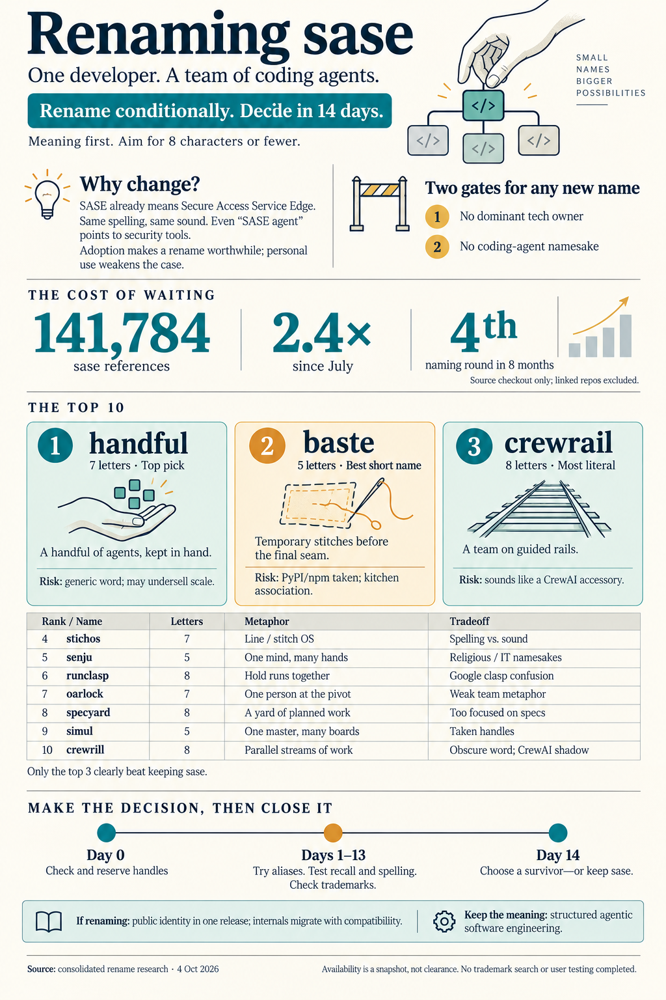

# Renaming sase: Should You, and to What?

> **Research query:** Help pick the best possible new name for sase, whose name conflicts with the Secure Access
> Service Edge (SASE) project. How well a name matches what sase is and does matters most, up to around 8 characters,
> with bonus points for shorter names. Critique the rename plan in general (is it a good idea?), rank the 10 best names
> to consider, and recommend whether to move forward with the rename.

## Bottom line

**Rename, but put the decision on a clock.** The new name has to pass two gates:

1. **No dominant tech owner.** SASE [fails this gate](#the-diagnosis-holds), and so does `canton`.
2. **No namesake among agent tools.** Most of the obvious metaphors [fail this gate](#consolidated-graveyard).

- **Top pick: [`handful`](#handful) (7).** Runners-up: **[`baste`](#baste) (5)** and **[`crewrail`](#crewrail) (8)**.
- **Give the decision two weeks.** If no finalist survives the tests in the
  [decision procedure](#recommendation-and-two-week-decision-procedure), keep `sase` and write a decision record that
  says so. Then stop reopening the question. This is the [fourth naming round in eight months](#critique-of-the-plan-itself),
  and the [cost of renaming](#the-cost-is-measured-and-compounding) has more than doubled since the last one.
- **All four researchers say rename** (cld only conditionally). Their 40 proposed names do not overlap at all.
  [Verification](#where-the-researchers-disagreed-and-what-verification-showed) eliminated two of the eight top-two
  picks outright: `sennit` and `canton`. It also overturned most of gem's "completely clean" claims.

## Is renaming a good idea

### The diagnosis holds

_All four reports agree; verified._

- **Same spelling, same sound.** Gartner coined Secure Access Service Edge in 2019, and the industry pronounces it
  "sassy". The README teaches exactly that pronunciation, and the getting-started guide says _"yes, really"_.
- **It is a category, not a competitor.** There is a Gartner Magic Quadrant for it, with roughly $15–18B of 2026
  spend by different estimates. Every major security vendor publishes a "What is SASE?" page. The bare word will
  never be yours.
- **The vocabularies are converging on your words.** In networking, "SASE agent" already means the endpoint client
  (Check Point, Versa, Prisma Access Agent). In 2026, vendors started shipping "agentic AI with Prisma SASE" and
  Cisco's "AI-Aware SASE" with MCP visibility. Adding "agent" or "agentic" to a search now points at the wrong
  industry. PyPI even lists `prisma-sase` next to `sase`.
- **The name is borrowed.** It comes from the methodology in Hassan et al. (arXiv:2509.06216). As that paper gets
  cited, readers may assume this tool is its reference implementation.

### The counter-evidence

_From cld; worth keeping in view._

- Searches with context already work: `sase coding agents Claude Code`, `sase cli github`, and `sase.sh` all surface
  the repo.
- Inside the coding-agent niche, `sase` has no namesake.
- Legal risk is low, because SASE is a generic industry term rather than one company's mark.
- The repo has about 5 stars, so there is little outside brand equity to lose.

**Net:** the cost is moderate today and rising. This is a strategic problem, not an emergency.

### The real risk is the replacement

Collectively, the researchers found about 70 apt words that are already coding-agent or agent tools. They are listed
in the [consolidated graveyard](#consolidated-graveyard).

The lead's checks show the land-grab is happening week by week:

| PyPI name | Description | Published |
| --- | --- | --- |
| `annals` | "Annals for AI agents" | 2026-10-04 (today) |
| `waymark` | "Distributed & durable background events in Python" | 2026-10-02 |
| `reeve` | "Lifetime persistent memory for LLMs" | 2026-08 |
| `platoon` | "Build and train systems of agents" | 2025-10 |

**Clearance is perishable.** Reserve handles the day you decide, not the week after.

### The cost is measured and compounding

These counts are from this checkout (`git grep -i sase`). The July numbers are from the `sawi` decision report.

| Metric | 2026-07-28 | 2026-10-04 | Growth |
| --- | ---: | ---: | ---: |
| Tracked files | 5,728 | 12,994 | 2.3× |
| Files mentioning `sase` | 4,610 | 10,762 | 2.3× |
| Occurrences of `sase` | 59,130 | 141,784 | 2.4× |
| Distinct `SASE_*` identifiers | 360 | 703 | 2.0× |
| Tracked paths containing `sase` | 2,720 | 5,908 | 2.2× |

About 2,000 commits landed in the last 30 days. These counts leave out several things:

- sase-core and the six linked or plugin repos
- the chezmoi config repo
- `~/.sase` state on athena, apollo, and the Mac
- the `sase-org` org, `sase.sh`, and the PyPI distributions

For scale, the February 2026 rename from gai to sase touched about 520 files (cld). The project's rename tooling
(token-aware rewrites, terminology guards, legacy aliases) makes this feasible. It is still an epic, and **every
month of indecision costs more than any naming mistake except picking a colliding name.**

### Critique of the plan itself

**What is right:**

- **The timing.** The project is alpha, and `sase.sh` was registered on 2026-05-06, so it has no accrued SEO.
- **The priorities.** "Meaning over length, up to about 8 characters" is the right ordering.
- **Researching before renaming.** The `sawi` round showed why: the diagnosis was right, but the proposed name was
  not.

**What is wrong or missing:**

1. **There is no stopping rule.** The rounds so far:
   - gai → sase (February 2026)
   - a Specyard/PatchTower shortlist (June 22)
   - `sawi`, rejected (July 28)
   - this round (October 4)

   Every round diagnosed the problem correctly, and none closed it. The plan needs a deadline and a defined "no"
   outcome more than it needs more candidates.
2. **The criteria lack a niche-collision gate** (cld). Without one, the natural shortlist (bosun, jig, reins, yoke,
   keel, braid) is _worse_ than `sase`. Today, someone searching for sase lands on a networking vendor. Under one of
   those names, they would land on a competitor.
3. **The audience question has not been asked.** The only benefit of renaming is that people who don't already know
   the tool can find it.
   - If sase is mainly your own system and the public docs are a courtesy, the benefit is small and the epic is large.
   - If you want adoption, the collision is a permanent tax.

   The answer to this question should decide the rename more than any candidate does. The public docs site, PyPI
   releases, blog, and plugin ecosystem suggest you want adoption, which is why this report leans yes.
4. **Do not spend the rename on a lateral move** (the lesson from `sawi`; cld and grk). A name that is merely quieter
   does not justify editing 140k references.
5. **Keep the lineage, but drop the acronym.** gem proposes a "bifurcated brand" that keeps SASE as the methodology
   name. Do keep _"structured agentic software engineering"_ as a lowercase tagline and credit Hassan et al. in the
   acknowledgements. But do not keep the four letters in the branding, even as a methodology label. The acronym is
   exactly what collides. Do not invent a new acronym either.
6. **Do not end up with two permanent names, but phase the internals.** The researchers disagreed here: cdx would keep
   some internals, grk wants no half-rename, and cld wants the brand first with internals behind fallbacks. The
   resolution:
   - **Flip everything user-visible in one release:** the CLI, the PyPI dist, the GitHub org, the domain, the
     README, and the docs.
   - **Migrate the internals on a schedule** behind read-old, write-new fallbacks: `SASE_*` variables, `~/.sase`,
     `.sase` files, `sase_<N>` workspaces, and `import sase`.
   - **Never rewrite historical bead IDs.**
   - **Rename the Rust crate and binding in lockstep** with the `sase-core-revision.txt` CI pin.

## What the name has to carry

The README pitch is: _"One developer. A team of coding agents. Tracked, reviewable, repeatable work."_ A good name
should evoke at least two of these ideas:

1. One human directing many agents in parallel.
2. Structure and durability: work state lives outside any chat (Patches, beads, goals, artifacts, receipts).
3. A neutral layer above Claude Code, Codex, Antigravity, Qwen, OpenCode, Muse, and Grok Build.

The word is not just a brand. It is also:

- the CLI (`sase run`)
- the PyPI dist and Python import
- the Rust crate and binding (`sase_core`, `sase-core-rs`)
- the state and config directories (`~/.sase`, `~/.config/sase`)
- the prefix of 703 `SASE_*` environment variables
- a file extension (`.sase`)
- a bead-ID prefix (`sase-1eq`)
- a skill prefix (`sase_*`)
- a plugin prefix (`sase-github`)
- the GitHub org (`sase-org`) and the domain (`sase.sh`)

You type it hundreds of times a day. Length therefore matters more here than for most brands, but meaning still comes
first. That matches your own weighting.

## Ranked top 10

Handles were checked by the lead on 2026-10-04. "Free" means HTTP 404 on the exact name. Domain status is a DNS
lookup: NXDOMAIN means no DNS record, which suggests but does not prove the name is unregistered.

| # | Name | Len | Say | Core metaphor | PyPI | npm | crates | GitHub org | `.sh` / `.dev` | Agent namesake |
| -: | --- | -: | --- | --- | --- | --- | --- | --- | --- | --- |
| 1 | [`handful`](#handful) | 7 | HAND-ful | As many agents as one person can hold | free | taken | free | `handful-org` free | open / open | none |
| 2 | [`baste`](#baste) | 5 | BAYST | Temporary stitches before the final seam | taken (0.1.0, 2022) | taken | free | `baste-org` free | open / reg | none |
| 3 | [`crewrail`](#crewrail) | 8 | CREW-rail | A team on guided rails | free | free | free | free | open / open | none (CrewAI shadow) |
| 4 | [`stichos`](#stichos) | 7 | STICK-oss | A line/row; reads as "stitch OS" | free | free | free | `stichos-org` free | open / open | none |
| 5 | [`senju`](#senju) | 5 | SEN-joo | Thousand hands, one mind | free | free | free | `senju-org` free | open / reg | none |
| 6 | [`runclasp`](#runclasp) | 8 | RUN-clasp | A clasp holding runs together | free | free | free | free | open / open (.com open) | none |
| 7 | [`oarlock`](#oarlock) | 7 | OAR-lock | The fulcrum that lets one person row | free | free | free | `oarlock-org` free | open / open | none (small unrelated repos) |
| 8 | [`specyard`](#specyard) | 8 | SPEC-yard | A yard of specced, parallel work | free | free | free | org exists (2026-05, empty) | open / open | none |
| 9 | [`simul`](#simul) | 5 | SIM-ul | A chess simul: one master, many boards | taken | taken | taken | taken | open / reg | none (Simular is a near-name) |
| 10 | [`crewrill`](#crewrill) | 8 | CREW-rill | Parallel streams of crew work | free | free | free | free | open / open (.com open) | none (CrewAI shadow) |

### handful

**#1 · `handful` — recommended.**

_"A handful of agents."_ This is the most honest one-word description of the premise. "A handful" is as many agents
as one person can actually supervise, which is sase's real operating point.

- **The idiom works for you.** "A handful" also means hard to manage, which coding agents are, and this tool keeps
  them in hand.
- **The Latin works too.** _Manipulus_, "a handful", named the Roman maniple: a small unit able to act independently
  inside a larger formation, much like isolated parallel workspaces.
- **It keeps sase's wit.** "Sassy" becomes "handful" without the collision.
- **It is plain English,** so you can say and spell it on first hearing. That fixes the "yes, really" problem.
- **CLI shape:** `handful run`, `handful tui`, `~/.handful`, `HANDFUL_HOME`, `handful-github`.

**Handles:**

- PyPI and crates are free.
- npm is held by a small, active Svelte utility library. That does not matter much for a Python CLI.
- The bare `handful` GitHub org has been dormant since 2017, but `handful-org` (matching `sase-org`) is free.
- `handful.sh` and `handful.dev` show no DNS records.

**Risks:**

- It is a generic word, so you will never own the bare-word search. No single tech owner dominates it either,
  though, so `handful agents` or `handful cli` is ownable.
- "Only a handful?" undersells scale.
- Puns are easy ("handful is a handful").
- It is 7 letters against 4. Shell completion or a personal alias absorbs most of that.

### baste

**#2 · `baste` — best short name, best fit with the existing vocabulary.**

Basting means quick, provisional stitches that hold pieces in alignment before the permanent seam. That maps closely
onto agents producing drafts in isolated workspaces before host-owned completion makes the permanent stitch. It
completes the Patch/stitch/bead/strand family, and at 5 letters it is the shortest strong name.

**Handles:**

- PyPI has one 0.1.0 release from 2022 ("a simple wrapper around fabric"). That makes it a PEP 541 candidate, but plan
  on a `baste-cli` dist.
- npm is taken by a 2022 JSX templating package. crates is free.
- `baste-org` is free. `baste.sh` is open, but `.dev`, `.com`, and `.io` are registered.

**Risks:**

- Many people think of the kitchen first ("baste a turkey").
- Slang "baste" means to thrash someone.
- The metaphor names the provisional step rather than the durable record, so the tagline has to carry "tracked,
  reviewable".

### crewrail

**#3 · `crewrail` — most literal fit.**

Crew (the agent team) plus rail (structure and a guided path) covers both halves of the pitch. It is easy to say and
spell.

**Handles:** all three registries and both GitHub names are free. `.sh`, `.dev`, and `.io` are open, but the .com
has been parked since March 2026.

**Risks:**

- "Crew" means CrewAI to this audience, and search engines already read "crewrail" as CrewAI guardrails. You would
  have to lead with a descriptor.
- It sits at the length ceiling.

### stichos

**#4 · `stichos` — the cleanest handles.**

Greek for a line or row of verse. It sits next to stitch and strand, and it reads almost unavoidably as "stitch OS".
Every registry is free, and so are `stichos-org`, `.sh`, `.dev`, and `.io`.

**The catch:** it repeats sase's own defect.

- Spelling and sound diverge: STICK-oss vs. STEE-khoss, and people will write "stitchos".
- The meaning needs a gloss.
- It says little about one human directing many agents.

### senju

**#5 · `senju` — best "one mind, many hands" image.**

千手, "thousand hands", as in Senju Kannon, who helps everyone at once. It is short and easy to say. Every registry
is free, as are `senju-org` and `senju.sh`.

**Risks:**

- It borrows a religious epithet.
- Naruto has a Senju clan, and sase already has "clans".
- NRI's Senju Family is an established Japanese IT-operations and job-scheduling suite, which is adjacent in Japan.
- It is opaque to most Western developers.

### runclasp

**#6 · `runclasp` — best handle position.**

A clasp joins and holds runs, handoffs, and evidence. It is the only finalist with every handle free, including .com.

**Risks:** the meaning is less immediate than the top five. Spoken aloud, "run clasp" leads to Google's
`clasp run`.

### oarlock

**#7 · `oarlock` — clear, slightly clunky.**

The fulcrum that lets one person row. It is obvious to say and spell. All registries, `oarlock-org`, `.sh`, and
`.dev` are free, and the only namesakes are small unrelated repos (an Elixir billing SDK and a harbor-board app). The
metaphor is about leverage rather than a team or a record, and it is easy to forget.

### specyard

**#8 · `specyard` — the June pick, still clean.**

All registries are free, and `.sh` and `.dev` are open. A `specyard` GitHub org was created on 2026-05-16 with no
repos; check whether it is yours. It names one capability (specs and plans) and sounds like a Spec Kit peer, so it
undersells supervision.

### simul

**#9 · `simul` — best metaphor on the list, weakest handles.**

In a chess simul, one master walks a ring of boards and makes one move at each. That is precisely one human visiting
many _single-turn_ agents in isolated workspaces.

It is kept on the list because you weight fit above everything else. The problems:

- PyPI is taken by a 2025 parallelism library, which is an adjacent dev tool.
- npm, crates, GitHub, and `.dev` are all taken, so it would need a `simul-cli` dist.
- `simul run` sounds like running a simulation.
- Simular, a funded computer-use-agent startup, is a near-name.

### crewrill

**#10 · `crewrill` — clean compound.**

Crew plus rill (a small stream): parallel streams of work. Every handle is free, including .com. Most people won't
know "rill", the double r at the boundary slows spelling, and it shares crewrail's CrewAI shadow.

### Honorable mentions

- `runspur`: every handle free, but the fit is weaker and it sounds like a running app.
- `dimity`: clean, but the metaphor is thin.
- `workjig`: clean, but industrial and obviously coined.
- `decurion`: Roman "commander of ten"; all registries free, but obscure.

### Where sase itself ranks

Between #3 and #4.

- **Where it wins:** typing, handles it already owns, and no namesake in the niche.
- **Where it loses:** the networking collision and the gap between spelling and sound.
- **Against the list:** only `handful`, `baste`, and `crewrail` clearly beat it. #4 and #5 beat it on collision but
  bring obscurity or pronunciation problems with them. Names #6–#10 are not worth a 140k-reference epic unless
  [the testing below](#recommendation-and-two-week-decision-procedure) surprises you.

## Recommendation and two-week decision procedure

**Move forward with the rename, conditionally and on a deadline.** Take `handful`, `baste`, and `crewrail` into
testing.

1. **Day 0: reserve the cheap handles** for all three: the GitHub orgs and the `.sh`/`.dev` domains. Claim PyPI with
   the first real release under the new name; PEP 541 lets empty placeholder projects be reclaimed.
2. **Days 1–7: live with each name.**
   - Run `alias handful=sase` (and the same for the others).
   - Rewrite the README tagline with each candidate.
   - Say _"I run my coding agents with ___"_ out loud.
   - Say each name once to 3–5 developers. Later, ask them to spell it and guess what it does.
3. **Check LLM priors.** Ask two or three models "what is the ___ CLI?" You want a neutral answer, not a confident
   wrong product.
4. **Run a knockout trademark search** on USPTO and EUIPO, classes 9 and 42, for the survivor.
5. **Day 14: decide.**
   - **If a finalist survives,** open the rename epic. Phase 1 flips the public identity in one release:
     - a `sase` CLI alias with a deprecation notice
     - a final `sase` PyPI release that depends on the new dist
     - the GitHub org rename (GitHub redirects repo URLs)
     - 301 redirects from `sase.sh`

     Phase 2 migrates the internals behind fallbacks, as described in item 6 of the
     [critique of the plan](#critique-of-the-plan-itself).
   - **If none survives,** keep `sase`. Record it in the decisions memory web as "sase stays; reopen only if
     \<condition\>". Stop teaching the "sassy" pronunciation, which is exactly how the networking term is said.

## Where the researchers disagreed and what verification showed

| Researcher | Top picks | Lead verification (2026-10-04) |
| --- | --- | --- |
| cdx | crewrail, runclasp, runspur | All three registries are free (confirmed). `crewrail.com` is registered and parked (March 2026). Searching "crewrail" returns CrewAI guardrail content and a `CrewRailGuard` class in PyPI `agenticrail`, so the name reads like a CrewAI accessory. `runclasp` has every handle free, including .com, but "run clasp" lands on Google's `clasp run`, the Apps Script CLI. |
| cld | handful, simul, orderly | **`handful` confirmed:** two searches found no agent or dev-tool namesake; PyPI and crates are free; `.sh` and `.dev` are NXDOMAIN. `simul`: PyPI is taken by "a Python library for parallelism" (2025), which is an adjacent dev tool, and npm, crates, and GitHub are taken too. `orderly`: every registry and `.sh`/`.dev` are taken. |
| grk | stichos, sennit, dimity | **`stichos` confirmed clean.** **`sennit` fails:** [rave-soft/sennit](https://github.com/rave-soft/sennit) is "a terminal-first AI coding agent with real multi-agent orchestration", [steven3002/sennit](https://github.com/steven3002/sennit) is agent memory that is portable across agents via MCP, and crates.io is taken. `dimity` is clean, but its fit is thin. |
| gem | baste, canton, mortar | **The "completely clean" claims were not registry-checked, and most fail.** `baste`: PyPI and npm are taken, though no agent namesake exists. **`canton` fails:** PyPI, npm, and crates are taken, and **Canton Network** (Digital Asset's institutional blockchain) runs its own AI-agent ecosystem, with agent payments and agent identity. That is a dominant tech owner in an adjacent agent space, which is the SASE problem again. `mortar`, `coterie`, `dowel`, `stave`, and `tally` all have registry or domain conflicts. |

### Other disagreements resolved

- **Is "keep `sase`" an acceptable outcome?**
  - cld: yes, as a fallback.
  - grk: only if no ownable word exists.
  - cdx and gem: proceed with the rename.

  **Resolution:** keeping sase beats a lateral move. It must be a recorded decision with a reopen condition, though,
  not an open-ended pause.
- **Real words or coined compounds?** cdx favors compounds such as `crewrail` and `runclasp`, which clear registries
  easily. grk, cld, and gem favor real words. **Resolution:** a clean real word wins on recall and on saying or
  spelling it after hearing it once. Compounds are the dependable fallback.
- **Textile vocabulary?** grk and gem lean into stitch, patch, strand, and bead. cdx warns that the loom family is
  occupied. **Resolution:** the craft family suits the product, and a word from it is fine if that exact word is
  clean. The loom and rope words specifically (`weft`, `warp`, `loom`, `heddle`, `selvage`, `raddle`, `clew`,
  `braid`, `sennit`, `tenter`) have already been harvested.

## Consolidated graveyard

**Direct coding-agent or agent-tool namesakes:**

- **Team and leadership words:** bosun, jig, reins/rein, yoke, braid, keel, muster, drover, musher, gaffer, brigade,
  flotilla, sortie, cadre, corral, tutti, bottega, kibitz, posse, maestro, troupe, galley, bullpen, pitwall, kelpie
- **Craft, structure, and governance words:** skep, sennit, weft, heddle, selvage, halyard, clew, tenter, cairn,
  atelier, cohort, guild, chorus, consort, plumb, rigor, plinth, vise, rivet, gantry
- **Crew and run compounds:** crewhelm, crewlet, crewrig, runyard, runweft, runlace, runkeep, taskloom, taskrail,
  taskhelm, taskweft
- **Found during lead verification:** reeve, annals, platoon, agentry, fettle (devcontainer scaffolding for solo
  developers, 2026)

**Dominated by a big owner, or a near-twin:**

- conductor, crew (CrewAI), warp, swarm, fleet, orca, loom, stig (DISA STIG)
- canton (Canton Network), orderly (Orderly Network), quilt (Quilt Data), sloyd (sloyd.ai)
- ropewalk ([ropewalk.ai](https://ropewalk.ai/), an AI creative platform with MCP tools)
- treadle, which is one letter away from [threadle](https://github.com/threadle-sh/threadle), an AI coding-session
  inspector

**Meaning or tone problems:**

| Name | Problem |
| --- | --- |
| `sawi` | Means "doomed" in Filipino |
| `thole` | Scots for "suffer, endure" |
| `teamster` | Union name, and the union campaigns against automation |
| `jehu` | Byword for a driver "who driveth furiously" |
| `crewel` | Pronounced "cruel" |
| `coping` | Reads as self-deprecating |
| `simul` | Read as "simulation" |
| `stichos` | Spelling does not match sound (it still ranks; see [its entry above](#stichos)) |

## Method and limits

**Date:** 2026-10-04 · **Type:** lead consolidation of four independent reports
([cdx](sase_rename_new_name_shortlist__cdx.md), [cld](sase_rename_new_name_shortlist__cld.md),
[grk](sase_rename_new_name_shortlist__grk.md), [gem](sase_rename_new_name_shortlist__gem.md)), plus lead
verification. The lead re-ran registry, DNS, and web namesake checks on about 80 names and re-measured the
rename surface in the repo.

- **Lead checks (2026-10-04):**
  - registries: the PyPI JSON API (with summary and last-upload date for taken names), the npm registry, and the
    crates.io API
  - GitHub: the users API via `gh`
  - domains: DNS NS lookups via 1.1.1.1 for `.sh`, `.dev`, `.com`, and `.io`, covering about 80 names
  - namesakes: web searches for about 15 finalists
- **Inherited from the researchers:** the remaining evidence comes from their registry, DNS, RDAP, and web checks.
  cld's niche audit covered about 150 names.
- **Repo measurements** come from this workspace checkout only. The linked repos were not counted.
- **Not done:** trademark searches, registrar pricing or WHOIS, social-handle checks, real user testing, or LLM-prior
  testing. NXDOMAIN does not guarantee a domain is available, and a 404 on a registry does not grant any rights.

## Sources

**Source reports and prior project research:**

- The source reports in this directory: [cdx](sase_rename_new_name_shortlist__cdx.md),
  [cld](sase_rename_new_name_shortlist__cld.md), [grk](sase_rename_new_name_shortlist__grk.md), and
  [gem](sase_rename_new_name_shortlist__gem.md)
- Prior rounds: [June 2026 consolidated rename research](../../202606/sase_rename_research_consolidated.md) and
  [July 2026 sawi decision](../../202607/sawi_rename_decision/sawi_rename_decision.md)
- In-repo: `README.md` and `docs/getting_started.md` (the "sassy" pronunciation)

**The SASE collision:**

- [Cisco: What is SASE](https://www.cisco.com/site/us/en/learn/topics/security/what-is-secure-access-service-edge-sase.html)
- [Cisco Umbrella: pronunciation](https://umbrella.cisco.com/secure-access-service-edge-sase/what-is-sase)
- [IBM: SASE](https://www.ibm.com/think/topics/sase)
- [SDxCentral: Gartner SASE 2026](https://www.sdxcentral.com/news/gartner-sase-2026-rankings-netskope-leads-cato-networks-leaps-and-palo-alto-networks-falls/)
- [Palo Alto: Agentic AI with Prisma SASE](https://www.paloaltonetworks.com/blog/2026/03/agentic-ai-with-prisma-sase/)
- [Cisco: AI-Aware SASE](https://investor.cisco.com/news/news-details/2026/Cisco-Redefines-Security-for-the-Agentic-Era-with-AI-Defense-Expansion-and-AI-Aware-SASE/default.aspx)
- Check Point SASE Agent
- [Hassan et al., arXiv:2509.06216](https://arxiv.org/abs/2509.06216)

**Namesakes found during lead verification:**

- [rave-soft/sennit](https://github.com/rave-soft/sennit) and [steven3002/sennit](https://github.com/steven3002/sennit)
- [Canton Network ecosystem](https://www.cantonecosystem.com/) and
  [first private AI agent payment on Canton](https://www.cantor8.io/official-blog/worlds-first-private-ai-agent-payment-settles-on-canton-network)
- [agenticrail (CrewRailGuard)](https://pypi.org/project/agenticrail/0.3.2/)
- [google/clasp](https://github.com/google/clasp)
- [ropewalk.ai](https://ropewalk.ai/) and [threadle](https://github.com/threadle-sh/threadle)
- PyPI: [annals](https://pypi.org/project/annals/), [reeve](https://pypi.org/project/reeve/),
  [platoon](https://pypi.org/project/platoon/), [waymark](https://pypi.org/project/waymark/),
  [simul](https://pypi.org/project/simul/), and [baste](https://pypi.org/project/baste/)

**Finalist conflicts** (via cld):

- [Simular](https://www.simular.ai/articles/simular-raises-21-5m-to-build-autonomous-computer-agents)
- [Orderly Network](https://orderly.network/docs/home)
- NRI Senju Family
- [CrewAI](https://github.com/crewAIInc/crewAI)

**Orchestrator landscape:**

- [Augment: open-source agent orchestrators](https://www.augmentcode.com/tools/open-source-agent-orchestrators)
- [awesome-agent-orchestrators](https://github.com/andyrewlee/awesome-agent-orchestrators)
- [OpenAlternative: AI coding agent orchestrators 2026](https://openalternative.co/blog/best-ai-coding-agent-orchestrators)

**Naming and migration guidance:**

- [USPTO likelihood of confusion](https://www.uspto.gov/trademarks/search/likelihood-confusion)
- [PEP 541](https://peps.python.org/pep-0541/)
- [Google site-move guidance](https://developers.google.com/search/docs/crawling-indexing/site-move-with-url-changes)
