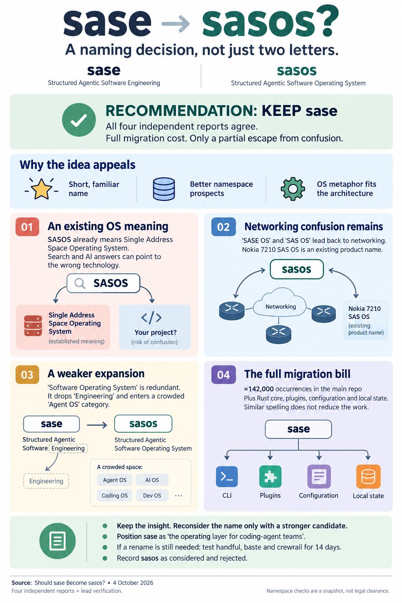

# Should `sase` Become `sasos`?

> **Research query:** Should "sase" (Structured Agentic Software Engineering) be renamed to "sasos" (Structured
> Agentic Software Operating System)? Using the `sase_rename_new_name_shortlist.md` research for context and
> inspiration, help decide whether to proceed, and end with a recommendation (rename or no rename) and its
> justification.

## Bottom line

**Do not rename `sase` to `sasos`.** All four researchers reached this answer independently, and lead verification
supports it. The diagnosis behind the idea is sound: `sase` really is a damaged public name. And the "operating
system" framing really does fit the architecture ([see below](#as-architecture-language-it-fits)). But `sasos` is the
wrong fix:

1. **It lands on an existing OS term.** _SASOS_ already means **Single Address Space Operating System**. That is
   the top search result for the bare string. It is the answer two frontier models gave from memory. And it is still
   used in current systems research (SOSP '25). See the [collision inventory](#consolidated-collision-inventory) and
   the [LLM priors](#llm-priors).
2. **It does not leave the stem it is fleeing.** Readers who know SASE will parse it as "SASE OS" or "SAS OS". Both
   readings point back toward networking: Fortinet's "SASE on a single OS", Versa's VOS, and Nokia's 7210 SAS OS.
3. **The new expansion is worse than the old one.** "Software Operating System" is redundant, because every OS is
   software. It drops "Engineering", the most accurate word in the current name. It overclaims, since sase is a
   user-space tool. And it joins a crowded, hype-loaded "Agent OS" category
   ([details](#as-the-product-name-it-does-not)).
4. **It costs the same as a clean break.** That means about 142k occurrences in this repo, plus sase-core, the
   plugins, config, and state ([the full rename price](#the-full-rename-price)). In return it removes only part of the
   problem. That makes it the same lateral move the July `sawi` decision rejected: _"trades a loud collision for a
   quiet one without buying ownership."_

**Instead:** keep `sase`, and use the OS idea for free as positioning ("the operating layer for coding-agent teams").
Record `sasos` as considered and rejected. If you still want out of SASE, spend the one rename you get on a shortlist
finalist that passes [both gates](#the-bar-a-rename-must-clear). The [recommendation](#recommendation) below gives the
full justification and next steps.

## What sasos gets right

The proposal deserves a careful answer, because its strengths are real (cdx, cld; lead-verified where marked):

- **It escapes the Gartner category's exact string.** "sasos agent" means nothing in networking. "SASE agent"
  already means an endpoint client.
- **Its namespace is better than `sase`'s.** PyPI, npm, and crates.io all return 404 for `sasos`, and so does the
  GitHub org name `sasos-org`. Lead RDAP checks found **no registration record** for `sasos.ai`, `.dev`, `.io`, or
  `.org`, which is stronger evidence than the researchers' NXDOMAIN results.
- **No coding-agent tool uses the name.** A GitHub search turns up only tiny unrelated repos, the largest with 7★.
- **It is short and keeps continuity.** At 5 characters it is well under the shortlist's ~8-character ceiling.
  Existing users would see why it changed.
- **The OS metaphor fits the internals** (see [Is Operating System the right word](#is-operating-system-the-right-word)).
  The project already calls itself an "operating layer". Lead verification found that phrase in the title of blog post
  [00], _"The Missing Operating Layer for Coding Agents"_.
- **No harmful foreign meaning.** In Hungarian, _sasos_ is roughly "with eagles". Unlike `sawi` ("doomed" in
  Filipino), it carries no tone problem.

`sasos` is a better word than `sawi`. The question is not whether it beats `sawi`, though. It is whether it justifies
a full rename. It does not.

## The bar a rename must clear

The October shortlist set these criteria. Any replacement must pass them:

| Criterion | `sase` (stay) | `sasos` |
| --- | --- | --- |
| **Gate 1:** no dominant tech owner | ❌ Gartner SASE: same spelling, same sound | ⚠️ No commercial owner, but SASOS (the OS term) dominates the bare string, and the name reads as "SASE OS" |
| **Gate 2:** no namesake among agent tools | ✅ | ✅ for the exact string; ⚠️ the _expansion_ lands in a crowded "Agent OS" category |
| **LLM-prior test:** "what is ___?" gets a neutral answer | ❌ Networking | ❌ Single-address-space OS, or SAS |
| **Don't invent a new acronym** | n/a | ❌ |
| **Don't spend the rename on a lateral move** | n/a | ❌ Edit distance 1 from the name being left |
| Can people say and spell it after one hearing? | ⚠️ Needs the "sassy" gloss | ⚠️ SASS-oss / SAY-soss / SAS-O-S / "sassy OS" |
| Accuracy of the expansion | ✅ | ❌ Redundant, and it overclaims |
| Length | 4 | 5 |
| Handles | ✅ Owns PyPI, `sase-org`, `sase.sh` | ✅ Registries and org free; bare GitHub user and `.com` taken |
| Switching cost | None | Full |

The shortlist's explicit advice applies directly: _"Keep the lineage, but drop the acronym… do not keep the four
letters in the branding… Do not invent a new acronym either"_ and _"Do not spend the rename on a lateral move."_
`sasos` breaks both rules. It is a new acronym, and it keeps three of the four colliding letters.

## Collisions

**Smaller than SASE, but pointing the wrong way.**

### Consolidated collision inventory

| Meaning | Field | Weight | Source / verification |
| --- | --- | --- | --- |
| **Single Address Space Operating System** | OS research: Opal, Mungi, Nemesis, Sombrero, Angel; Dartmouth's SASOS project (1993–96); current CHERI/Unikraft work | **High.** It is the dominant meaning of the exact string, and it sits in the very field the new name claims | All four reports. **Lead:** a bare web search for `sasos` returns Acronym Finder and Wikipedia's SASOS entries first |
| **"SASE OS" reading** | Networking: Fortinet's "single-vendor SASE platform built on a single operating system, FortiOS"; Versa Unified SASE on VOS | **Medium-high.** It sends readers who know SASE straight back to the old collision | cld |
| **Nokia 7210 SAS OS** | Carrier Ethernet switch firmware ("SAS" = Service Access Switch) | Low-medium. The string is "SAS OS" rather than "SASOS", but it sounds identical and it is networking again | gem. **Lead:** confirmed in Nokia's own release-note titles |
| **SASOS (AI brand)** | `sasos.in`: _"SASOS — Openhour: The Store That Runs Itself"_, an autonomous AI-run retail format in Kerala | Low-medium. It is not a coding tool, but it is an exact-name AI-autonomy brand | cdx. **Lead:** confirmed the page title and description |
| **SASOS trademark application** | SAS OneSource, Inc., USPTO serial 88657846 (2019), classes 35/36/42 including IT consulting. **Abandoned 2020** (no statement of use) | Low. It is dead, but it shows that "SAS + OS" is a coinage others reach for | **Lead** (via the Furm aggregator; not an official USPTO knockout search) |
| **ASOS** | UK fashion retailer. `sasos` = `s` + `asos`. ASOS plc holds US class 9/42 registrations and has fought near-marks such as OSOS | Low for a dev CLI, but ASOS litigates | grk. **Lead:** the ASOS-vs-OSOS dispute is confirmed. grk called it "one transposition" away; it is actually a one-letter prefix |
| SAS prefix | SAS Institute, Azure Shared Access Signatures | Low; it shapes guesses | cld (an LLM guessed SAS/Azure) |
| SASO / SASOs | Saudi Standards body; Second Amendment Sanctuary Ordinances; Ohio Statewide Arts Service Organizations | Noise | cld, grk; appears in the lead's bare search |
| Other SASOS uses | South African Surgical Outcomes Study (2014 cohort); a 2016 PLOS ONE cloud-scheduling algorithm; a leather-jacket brand | Noise | grk, cdx, cld; the lead confirmed the surgical study |

None of these rivals Gartner SASE (a ~$18B 2026 market with a Magic Quadrant). The problem is where they sit. The
dominant prior meaning of `sasos` is a kind of operating system. The proposed expansion also says "Operating System".
So a search for `sasos operating system`, or a model asked "what is SASOS?", resolves to the wrong thing **by
construction**.

### LLM priors

From cld, using one prompt per model in clean contexts:

| Model | "What is SASOS?" | Guess for a dev tool named `sasos` |
| --- | --- | --- |
| Codex CLI (default model) | Single Address Space Operating System | A tool "for building, running, or debugging such systems" |
| Claude Sonnet 5.5 | Single-address-space OS ("Opal and Angel") | Tooling for SAS (Statistical Analysis System) or Azure Shared Access Signatures |
| Claude Haiku 4.5 | No reliable knowledge | Static analysis / security operations (speculation) |
| Haiku 4.5, with this machine's SASE context loaded | n/a | "Related to SASE (Secure Access Service Edge)" |

For comparison, `handful`, the shortlist's #1, got a neutral answer. This matters more each year, because developers
increasingly ask an assistant "what is X?" before they search for it.

### Pronunciation

There is no settled reading: SASS-oss, SAH-sohs, SAY-soss, SAS-O-S, or "sassy OS". The most natural gloss, "sassy
OS", keeps the old collision and adds a hyped phrase. The name also contains "SOS", a distress call, which is an odd
note for a dependability tool. None of the researchers tested this with real listeners.

## Is Operating System the right word

The answer is yes as architecture language, and no as the product's name.

### As architecture language it fits

The mapping comes from cld and cdx, using the project glossary and decision records:

| OS concept | sase today |
| --- | --- |
| init / service manager | **sase service**: a systemd user unit or launchd agent that supervises daemon and oneshot procs |
| Process table | **Procs**: durable records with logs and kill |
| cron / scheduler | **Scheduler (AXE)** → routines → jobs |
| Process isolation | Numbered **workspaces**, one agent per workspace |
| Syscall / privilege boundary | **Host-owned completion**: agents declare, and host finalizers act |
| Preemptible, non-blocking tasks | **Single-turn agents**; gates never block |
| Admission control | **Holds**, tool-run admission |
| Memory hierarchy | **Core** memory (always resident) vs. **reference** memory (paged in on demand) |
| Device drivers | Provider and VCS **plugins** |

This would make an excellent explainer diagram. The OS framing also has real precedent: AIOS (arXiv:2403.16971),
Agno AgentOS, and Letta's "memory as an OS". An objection that "it isn't a kernel, so it can't say OS" is too strict
for _prose_.

### As the product name it does not

- **The expansion does not parse well.** In "Structured Agentic Software Operating System", every OS is software. So
  "Software" is either redundant, or it means "an OS for agentic software", which is not what sase is. It also drops
  "Engineering". sase is built around Patches, review, PRs, CI, and workspaces, so "Engineering" is the most accurate
  word in the current name.
- **It overclaims to the audience most likely to adopt the tool.** sase is a Python/Rust user-space CLI and TUI
  running on Linux and macOS. Naming it an OS invites the "that's not an operating system" reply from systems-literate
  developers. Those are the HN and lobste.rs readers you would hope to attract, and they already know SASOS as the
  kernel term.
- **The category is crowded and currently signals hype.** These are the "Agent OS" occupants the researchers
  verified:

  | Project | Stars / status |
  | --- | --- |
  | `nearai/ironclaw` | 12.6k★ |
  | AIOS | 6.4k★ |
  | `buildermethods/agent-os` | 5.5k★, aimed at Claude Code and Cursor users, so it targets your users |
  | `rivet-dev/agentos` | 4.7k★ |
  | `openagents-org/openagents` | 4.2k★ |
  | Agno AgentOS | Active platform |
  | Rabbit OS3 | Productized |
  | Agent OS papers | Two 2026 arXiv papers |
  | `agentos` package name | Taken on PyPI, npm, and crates |

  Microsoft's November 2025 "agentic OS" post drew enough backlash that replies were locked. Among developers, the
  phrase is a skepticism trigger.

### Two possible motives and why sasos serves neither

_Lead addition._ None of the reports asked _why_ "OS" appeals now. There are two plausible motives, and they pull in
opposite directions:

1. **Escaping the SASE collision.** `sasos` solves only part of this (see [Collisions](#collisions)). It keeps the
   stem, the sound family, and the "sassy" gloss.
2. **Signalling scope beyond software engineering.** sase now drives research swarms, Markdown-to-podcast audio
   (`sase-listen`), Gmail and Obsidian-vault skills, goals, and home-server work. "Operating system" may feel truer
   than "engineering" for that reason. But the new expansion keeps **"Software"**, which re-narrows the scope that
   "OS" was meant to widen (cld's "scope contradiction"). Meanwhile the work sase actually tracks is still software
   engineering: all three enabled projects (`sase`, `bob-cli`, `actstat`) are software repos (lead-verified via
   `sase project list`).

So whichever motive applies, the backronym is the wrong tool. If scope is the driver, the honest fix is a non-acronym
name. If collision is the driver, the fix is a name that leaves `SAS*` behind.

## The full rename price

These were measured on 2026-10-04 at commit `aa8b98ffd5`, excluding `sase/repos/`. The cdx, cld, and grk
measurements agree to within method noise:

| Surface | Count |
| --- | ---: |
| Tracked files | 13,020 |
| Files mentioning `sase` (case-insensitive) | ~10,780 (83%) |
| Occurrences of `sase` | ~141,900 |
| Tracked paths containing `sase` | 5,911 |
| Distinct `SASE_*` identifiers | 625–703, depending on the regex (lead: 703 raw tokens, 625 word-bounded; grk: 657) |
| Console scripts in `pyproject.toml` | 69 (lead) |
| `sase_*` plugin entry-point groups | 6 (lead). Renaming them breaks plugin discovery unless aliased |
| sase-core: files / occurrences | 594 / 12,712 (cld) |
| Commits in the last 30 days | ~2,000 |

The counts above leave out a lot of surface:

- the five other linked plugin repos and the chezmoi config repo
- `~/.sase` state on three machines
- the `sase-org` org, `sase.sh`, and the PyPI dist
- generated `/sase_*` skills, `sase_<N>` workspaces, and bead-ID prefixes
- the `sase-core-revision.txt` lockstep pin

The rename surface has more than doubled since July (59k occurrences then), and it is still growing.

**`sasos` is not cheaper than any other name.** `sase` is not a substring of `sasos`, so every token changes. The
resemblance helps only people who already know the name, which today means mostly you. It actually makes the
read-old/write-new migration window **harder**. `SASE_HOME` and `SASOS_HOME`, `~/.sase` and `~/.sasos`, and the
`sase` and `sasos` binaries would sit side by side, two letters apart. That is easy to mistype and hard to catch in
review (cld).

## Recommendation

**No rename.** **Do not open a `sase` → `sasos` epic.**

**Justification:** a rename this large is a one-shot spend. It should buy a name that _removes_ the collision problem,
not one that shrinks it while adding new ones. `sasos` removes the exact Gartner string, but it brings four problems
with it:

1. An exact-string collision with an established OS term, in the very field the name claims.
2. A "SASE OS" / "SAS OS" reading that networking already uses.
3. Confident wrong answers from LLMs.
4. An expansion that is redundant, drops the most accurate word, and overclaims into a hyped category.

It costs exactly as much as a clean break. The project's own July precedent (`sawi`) and October guidance (the
shortlist) both warn against this shape of rename. All four independent researchers and the lead verification
confirm those warnings rather than overturning them.

**What to do instead:**

1. **Take the OS idea where it is free.**
   - Lead with _"sase — the operating layer for coding-agent teams"_ in the README. Keep "tracked, reviewable,
     repeatable engineering work" near the first mention.
   - Turn the [OS concept mapping](#as-architecture-language-it-fits) into an architecture explainer.

   This captures nearly all of the rhetorical value, with no migration and no overclaim in the name.
2. **Stop teaching "sassy".** `README.md:23` and `docs/getting_started.md:11` currently teach the exact pronunciation
   of the networking term. This is a cheap, partial mitigation that is worth doing whatever else you decide.
3. **Close the naming question on a clock.** This is the fifth naming round in eight months: gai→sase, Specyard,
   `sawi`, the shortlist, and now `sasos`. Pick one:
   - Run the shortlist's 14-day procedure on `handful`, `baste`, and `crewrail` now.
   - Record "sase stays; reopen only if \<condition\>".
4. **Record that `sasos` was considered and rejected**, with the reason: it collides with SASOS, reads as "SASE OS",
   and its expansion overclaims. That keeps it from returning as a sixth round. This would be a decisions-web record,
   written through `/sase_memory_write`.

## What would change the answer

`sasos` becomes defensible only if **all** of these turn out true (synthesized from cld and cdx):

1. **Listener test.** You say the name once to 3–5 developers. They do not read it as "SASE OS" or "single address
   space", they spell it correctly, and they pronounce it consistently.
2. **Positioning commitment.** You decide that "OS" is where sase is headed, and you are willing to defend the claim
   publicly. Ideally you would also replace the weak word in the expansion ("Software").
3. **Legal and handle clearance.** A knockout trademark search comes back clean, and `sasos.sh` is confirmed
   registrable.
4. **The finalists fail.** Every shortlist finalist (`handful`, `baste`, `crewrail`) fails its 14-day test, and you
   still want out of SASE.

Even then, compare `sasos` against _staying_. Its edge would be a smaller collision and better handles. Its costs
would be a weaker expansion and about 155k edits.

## Corrections and resolved disagreements

The four reports agree on the verdict. These are the places where evidence or reasoning needed correcting:

| Claim | Report | Resolution |
| --- | --- | --- |
| `sasos` causes a "left ring finger triple-strike stutter" | gem | **Overstated.** Neither `sase` nor `sasos` contains a consecutive same-finger bigram on QWERTY. `sase` is all left hand; `sasos` alternates hands once. The real ergonomic cost is +1 character, plus `sase`/`sasos` confusion during migration. |
| SAS Institute "aggressively protects its trademarks" (_SAS v. World Programming_) | gem | **Weak.** That case concerned copyright and licensing of software functionality, not trademark. Treat the SAS Institute risk as speculative. |
| SASOS = "Smell Agent Symbiosis Organism Search" | gem | **Use cdx's sourced version:** a 2016 PLOS ONE simulated-annealing plus symbiotic-organisms-search hybrid for cloud task scheduling. Either way, it is noise. |
| Nokia 7210 "SAS-OS" | gem | **Confirmed** as "7210 SAS OS" in Nokia's release notes. It is a real but niche networking echo. |
| ASOS is "one transposition away" | grk | It is a **one-letter prefix** (`s`+`asos`). The practical point stands. |
| `sasos.sh`, `.dev`, `.io`, `.ai`, `.org` are "FREE" | gem; cld (NXDOMAIN) | **Lead RDAP:** no registration record for `.ai`, `.dev`, `.io`, or `.org`. There is no RDAP service for `.sh`, so its availability is still unconfirmed at the registry. `sasos.com` has been registered since 2000 and is parked with Afternic. |
| `sasos` vs. `sawi`: better or worse? | cld says better; grk says "more lateral" | **Both are true.** `sasos` is a better word than `sawi` (no bad meaning, and a more apt metaphor than "Work Interface"). It is more lateral as an identity, because it keeps the colliding stem. |
| Numeric scorecards (`sasos` 1.8/5, etc.) | gem | Subjective, and not relied on here. |
| Trademark clearance | none of the four ran one | The lead found only one USPTO `SASOS` application, and it is abandoned. **A formal USPTO/EUIPO knockout search (classes 9 and 42) has still not been done.** |

## Method and limits

**Date:** 2026-10-04 · **Type:** lead consolidation of four independent reports
([cdx](should_sase_become_sasos__cdx.md), [cld](should_sase_become_sasos__cld.md),
[grk](should_sase_become_sasos__grk.md), [gem](should_sase_become_sasos__gem.md)), plus lead verification ·
**Context:** the [October 2026 name shortlist](../sase_rename_new_name_shortlist/sase_rename_new_name_shortlist.md)
and the [July 2026 `sawi` decision](../../202607/sawi_rename_decision/sawi_rename_decision.md)

- **Researchers:** four independent reports. Each covered web collisions, registry and DNS handle checks, and repo
  measurements. cld also ran LLM-prior prompts against Codex, Sonnet 5.5, and Haiku 4.5.
- **Lead verification (2026-10-04):**
  - a bare web search for `sasos`
  - Nokia 7210 SAS OS documentation
  - `sasos.in` (fetched)
  - the USPTO `SASOS` application, via an aggregator
  - the ASOS-vs-OSOS dispute and the South African Surgical Outcomes Study
  - RDAP for `sasos.{com,ai,dev,io,org,sh}`
  - `SASE_*` identifier counts, console scripts, and entry-point groups from `pyproject.toml`
  - `sase project list`
  - "operating layer" usage in the docs
  - the July `sawi` decision
- **Not done:**
  - a formal USPTO/EUIPO trademark knockout search
  - `.sh` registry availability
  - social handles
  - real developer listening tests
  - LLM-prior tests beyond cld's single prompts
- A registry 404 or a missing RDAP record grants no rights to a name.

## Sources

**Source reports and prior project research**

- This directory: [cdx](should_sase_become_sasos__cdx.md), [cld](should_sase_become_sasos__cld.md),
  [grk](should_sase_become_sasos__grk.md), [gem](should_sase_become_sasos__gem.md)
- [October 2026 name shortlist](../sase_rename_new_name_shortlist/sase_rename_new_name_shortlist.md)
- [July 2026 `sawi` rename decision](../../202607/sawi_rename_decision/sawi_rename_decision.md)
- In-repo: `README.md` and `docs/getting_started.md` (the "sassy" pronunciation),
  `docs/blog/posts/why-coding-agents-need-orchestration.md` ("The Missing Operating Layer for Coding Agents"),
  `docs/blog/posts/structured-agentic-software-engineering.md`, and `pyproject.toml`

**SASOS and near-collisions**

- [Wikipedia: Single address space operating system](https://en.wikipedia.org/wiki/Single_address_space_operating_system)
- [Acronym Finder: SASOS](https://www.acronymfinder.com/Single-Address-Space-Operating-System-(SASOS).html)
- [Dartmouth SASOS project (1993–1996)](https://www.cs.dartmouth.edu/~dfk/research/project/sasos/index.html)
- [µFork: POSIX fork within a single-address-space OS (SOSP '25)](https://arxiv.org/pdf/2509.09439)
- [Nokia 7210 SAS OS Software Release Notes](https://documentation.nokia.com/cgi-bin/dbaccessfilename.cgi/3HE09537AAAAV7.0.R1_V1_7210%20SAS%20OS%20Software%20Release%20Notes_7.0R1.pdf)
- [SASOS (Openhour)](https://sasos.in/)
- [SASOS trademark application 88657846 (abandoned)](https://furm.com/trademarks/sasos-88657846)
- [Law360: ASOS beats rival's "Osos" TM](https://www.law360.com/articles/2376522/asos-beats-rival-s-osos-tm-over-clothing)
- [South African Surgical Outcomes Study (NCT02141867)](https://clinicaltrials.gov/study/NCT02141867)
- [PLOS ONE 2016 SASOS scheduling algorithm](https://pmc.ncbi.nlm.nih.gov/articles/PMC4922590/)
- [Wikipedia: SASO](https://en.wikipedia.org/wiki/SASO)

**"SASE OS" and the SASE collision**

- [Fortinet: what differentiates Fortinet Unified SASE](https://www.fortinet.com/blog/business-and-technology/what-differentiates-fortinet-unified-sase-from-other-sase-solutions)
- [Versa VOS datasheet](https://versa-networks.com/documents/datasheets/versa-vos.pdf)
- [Cisco: What is SASE](https://www.cisco.com/site/us/en/learn/topics/security/what-is-secure-access-service-edge-sase.html)
- [Palo Alto: Agentic AI with Prisma SASE (2026-03-23)](https://www.paloaltonetworks.com/blog/2026/03/agentic-ai-with-prisma-sase/)
- [Hassan et al., "Agentic Software Engineering" (arXiv:2509.06216)](https://arxiv.org/abs/2509.06216)

**The "Agent OS" landscape**

- [AIOS (arXiv:2403.16971)](https://arxiv.org/abs/2403.16971)
- [Agno AgentOS](https://docs.agno.com/agent-os/introduction)
- [buildermethods/agent-os](https://github.com/buildermethods/agent-os)
- [rivet-dev/agentos](https://github.com/rivet-dev/agentos)
- [nearai/ironclaw](https://github.com/nearai/ironclaw)
- [The Agent Operating System (arXiv:2608.03214)](https://arxiv.org/abs/2608.03214)
- [The Verge: Microsoft "agentic OS" backlash](https://www.theverge.com/tech/825022/microsoft-windows-40-year-anniversary-agentic-os-future)

**Registries (2026-10-04)**

- [PyPI `sasos`](https://pypi.org/pypi/sasos/json), [npm `sasos`](https://registry.npmjs.org/sasos), and
  [crates.io `sasos`](https://crates.io/api/v1/crates/sasos): all 404
- RDAP via [rdap.org](https://rdap.org/): `sasos.com` registered since 2000-06-16; `.ai`, `.dev`, `.io`, and `.org`
  have no record; `.sh` has no RDAP service
