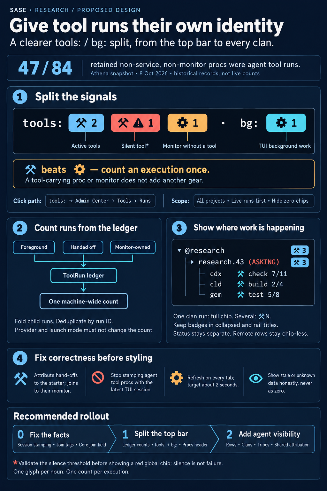

# `tools:` / `bg:` split and tool-run visibility in tribes and clans

> **Research query:** Agent-created procs from `sase tool` are not linked to the TUI
> session, yet they show as blue gears under `procs:`. How should SASE count them with
> the existing `sase tool` icon in a new `tools:` section of the TUI's second
> status-indicator row, rename the remaining gear section to `bg:` for TUI-linked
> background processes, and make running tools clearer in agent tribe panels and nodes
> (agent clan nodes included), so that the result is intuitive, reliable and beautiful?
> Critique the plan, call out any justified requirement adjustments, and end with a
> recommended solution.



## Bottom line

**Build it.** Today the blue `procs:` gear is mostly agents' `sase tool run check`
executions, not work the TUI is doing. On athena, 47 of the 84 non-service,
non-monitor proc rows in the retained store are agent tool runs. The `⚒` identity
already exists everywhere else. Promoting it to the top bar fixes a real category
error.

Taken literally, the request would ship four bugs. Adjust it as follows:

1. **`tools:` counts live ToolRuns from the ledger, not `tool-run` procs.** Whether a
   `sase tool run` creates a proc depends on the agent's LLM provider and the launch
   mode. During my research
   [the only live run on the machine was owned by a monitor](#whether-a-tool-run-becomes-a-proc).
   A proc-based `tools:` would have shown nothing, while the old orange gear still
   showed it.
2. **Fix attribution before adding badges.** Every Claude- or muse-agent `check`
   escalates into a proc-owned run. Today that run shows a `⚒` chip on **no** Agents
   row: [the starter row ignores owned runs, and the owner proc has no row](#row-attribution-has-a-hole).
   This is a regression. The chip rules landed on 2026-09-27, and inline escalation
   landed three days later and made proc-owned runs the common case. Clan and tribe
   rollups built on today's matcher would inherit the hole.
3. **Monitors cannot stay in `bg:`.** By your own definition they are agent-created and
   not TUI-linked. 27 of 32 retained monitors exist only to carry a ToolRun (adopt or
   join). Use one rule, [**"⚒ beats ⚙"**](#where-orange-monitors-go): an execution is
   drawn once, as `⚒`. An orange `⚙` remains only for a monitor that is not carrying a
   tool run, and it moves into `tools:`.
4. **Two reliability fixes come along:**
   - [The live ToolRun snapshot only refreshes while the Agents tab is showing](#the-snapshot-is-agents-tab-only).
   - Agent-submitted `tool-run` procs are
     [stamped with whichever TUI session started most recently](#session-mis-stamping),
     so they drop out of every count after a TUI restart.

**Target picture:**

```text
tools: [⚒ 2][⚒⚠ 1][⚙ 1] · bg: [⚙ 1] · stash: [≡ 2] · inbox: ⚑1 ✉18   ← everything at once
tools: [⚒ 3] · stash: [≡ 2] · inbox: ⚑1 ✉18                         ← the common case
⌂ @research · 5 [R3 W2] ⚒3 ⚙1                                         ← tribe title
▸ research.43 (RUNNING) ×5 [R3 W2] ⚒3                                ← clan, ≥2 runs
▸ toobig-7f (RUNNING) ×3 [R2 D1] ⚒ check 9/11                         ← clan, 1 run
    cdx (RUNNING) ⚒ check 7/11                                        ← concrete row
```

`[…]` stands for the existing filled-chip grammar, not literal brackets.

The full recommendation is in [Recommended solution](#recommended-solution).

## Is this a good idea

**Yes.** Today the blue gear answers "are my agents running `just check`?" while
claiming to answer "is my TUI busy?". Splitting the two makes both answers truthful, and
it costs no new vocabulary.

The weaknesses of the literal plan are scope and fact problems, not direction problems:

| # | Literal plan | Problem | Correction |
| --- | --- | --- | --- |
| C1 | `tools:` counts `tool-run` procs | Depends on provider and mode. Foreground and monitor-adopted runs would be missing, and switching an agent's model would change the count. | Count live ToolRuns from the ledger glance (A1). |
| C2 | Orange monitor chip silently stays in the renamed group | Monitors are agent-created and survive restarts, so by your criterion they are not `bg:`. 84% of them carry a ToolRun, so one check would show as `⚒` **and** `⚙`. | "⚒ beats ⚙"; leftover monitors move to `tools:` (A3). |
| C3 | `bg:` = "TUI-associated" by construction | Still true only in practice. The lane is "everything else" (`sase proc run`, gate/sudo answers, Telegram launches, and so on). | Define it precisely and say so in the tooltip (A4). |
| C4 | Tribe and node clarity treated as styling | The real blocker is attribution. The dominant run kind lands on no row. | Fix attribution first (A6). Clans and tribes then fall out of it. |
| C5 | Silent on freshness | The snapshot refreshes on the Agents tab only. | Tab-independent probe (A7). |
| C6 | Silent on session attribution | Tool procs are mis-stamped and vanish after a restart. | Stamp `session_id=None` for tool-run procs unless the submitter *is* a TUI (A7). |
| C7 | Silent on stuck runs | A silent or zombie ledger row would inflate `⚒` with no explanation. | A separate red `⚒⚠ N` chip, using the existing vocabulary (A5). |

The A1–A8 corrections are spelled out in
[Requirement adjustments](#requirement-adjustments).

### Approaches I rejected

- **Keep one `procs:` group with a third `⚒` chip.** Cheaper, but `procs:` would keep
  meaning "everything durable", which is what you are trying to stop teaching. It also
  gives the wrong click target.
- **A new top-level Activity tab.** Duplicates Runs and Procs, and is far larger than
  the problem.
- **A `TOOLING` status word, or a spinning `⚒`.** Status is lifecycle, it would fight
  the clan status-mirroring rule, and it would add repaint loops (`tui_perf`).

## Requirement adjustments

- **A1 — `tools:` = live ToolRuns, machine-wide.**
  - Counts every ledger run in `created` or `running` on this machine, with live child
    runs folded into a live parent.
  - Includes every mode: escalated, `-d`, `-H`, the TUI catalog, monitor adopt and join,
    and foreground.
  - Independent of project filter, tribe selection and session.
  - *Why:* one noun, one glyph (D1), independent of provider and mode. You asked about
    "procs created by agents"; the *run* is the thing those procs exist to execute.
- **A2 — TUI-launched tools are tools too.** Catalog `r` and `: tool run` produce
  ToolRuns that are independent of the TUI. Who launched a run is metadata; it does not
  decide its icon.
- **A3 — "⚒ beats ⚙"; leftover monitors move to `tools:`.**
  - A proc that carries a live run is never drawn as a gear in the top bar. That covers
    a `tool-run` proc, an adopt or join monitor, and an `ace` proc that owns a run.
  - An orange `⚙ N` in `tools:` counts only monitors that are **not** carrying a run.
- **A4 — `bg:` = "this TUI session's background work and other non-tool procs".**
  - It counts gear-eligible active rows minus tool-run carriers, minus monitors, minus
    updates and services.
  - The tooltip names the initiators.
  - **Naming caveat.** The glossary already says "background command" for `!` oneshot
    service procs. Those are *not* in this lane: they are service rows and live on the
    Services tab. Keep `bg:`, because it is short, matches the micro-label style, and is
    your choice. The tooltip must say "TUI background work". Rename to `tui:` only if
    the collision bites.
- **A5 — Silent runs get their own red chip.**
  - `⚒⚠ N` in `#FF5F5F`, in `tools:` and in tribe titles.
  - The amber "past typical duration" signal stays row-only.
- **A6 — Fix attribution, then roll up to clans and tribes.** Hand-off runs show on the
  starter, and joined runs on their monitor. Local clans and tribe titles get rollups.
  Remote rows stay chip-less (D15).
- **A7 — Correctness fixes are in scope.** Without these the new indicator would be
  wrong in the common case:
  - a tab-independent glance probe;
  - tool-run proc session stamping;
  - join-monitor tagging;
  - a join field on the glance.
- **A8 — Respect the Rust boundary narrowly.**
  - The join relationship is a ledger fact that other frontends would need, so it goes
    into the `sase-core` glance wire.
  - Lane colors, chip layout, and run-to-node placement for Textual rows stay in Python,
    as today.
  - If a second frontend later needs per-agent tool counts, lift the attribution into
    core then. Do not do it pre-emptively ("no mechanism before its corpus").

## What is true today

Everything in this section was verified against the code and live state.

### The icon and gear hues

- **The icon.** `TOOL_RUN_GLYPH = "⚒"` and `TOOL_RUN_ACCENT = "#87D7FF"`
  (`src/sase/tool/view_vocabulary.py:21-24`).
  - It is already used by the Agents row chip, the identity-header chip, the `⚒ Runs`
    card and the Procs-pane `⚒ <label>` marker.
  - The "sticky footer above deck panels" in the request is the deck-switcher segment
    `tools ⚒N M` (`tool_runs/deck.py:137-166`).
  - Silent runs use `⚒⚠` in `#FF5F5F`, always paired with the word "silent".
- **The gear hues.**
  - Blue (TUI work): `#48CAE4` (`proc_gear_chips.py:23`).
  - Orange (monitors): `#FFAF5F` (`monitor_state.py:16`).
  - Green: updates.
  - Tribe titles use a fourth gear hue, `#5FD7FF`, for named procs.
  - Three gear hues is already the limit, so a glyph change is the only distinction
    that scales.

### Which row holds the indicators

Row 1 is `UsageHeader` and row 2 is `TopBar`, which holds the tabs and the right-aligned
indicator cluster (`_app_layout.py:112-113`). Today the cluster is
`procs · updates · overrides · stash · inbox` (`widgets/top_bar.py:28,55-59`). Your
"2nd row" is therefore exactly where `procs:` lives now, so no placement change is
needed. mus read "2nd row" as the per-tab `load:/model:/project:` row; that is a
misreading ([corrected below](#factual-corrections-to-individual-reports)).

### Whether a tool run becomes a proc

This is how `sase tool run` becomes (or doesn't become) a proc:

| Path | Execution owner | Proc created | Shown today |
| --- | --- | --- | --- |
| Agent, provider with a sync ceiling (Claude, muse): plain `sase tool run X` | `tool-run` proc, detached (**inline escalation**) | yes, `origin="tool-run"`, tags `tool-run`, `tool-run:<id>`, `tool-run-detached` | **blue ⚙** |
| Agent, other providers | none (foreground) | no | nothing in top bar |
| Agent `sase tool run -d` | `tool-run` proc | yes | blue ⚙ |
| Human shell `-H`, or the TUI catalog `r` (runs `-H` in-process) | `tool-run` proc | yes | blue ⚙ |
| `sase monitor start -- sase tool run …` (adopt) | monitor | no new proc beyond the monitor | orange ⚙ |
| Monitor joining a detached run (`sase tool _join`) | still the `tool-run` proc | monitor proc, **untagged** | blue ⚙ **plus** orange ⚙ for one execution |
| `: tool run X` from the Command Line | `origin="ace"` proc owning a foreground run | yes | blue ⚙ |

Evidence for the rows above:

- Inline escalation requires `SASE_AGENT` plus a provider sync budget
  (`tool/inline_escalation.py:57-82`).
  - In-tree, only Claude (`llm_provider/claude.py:153`) and muse (`muse_provider.py:72`)
    export a budget. Other providers do so only through the plugin hook.
  - Escalation submits `detached=True` (`inline_escalation.py:108-115`).
- Adopt monitors get `owner_tags(run_id)` (`monitor/start_launch.py:343`). The join
  branch leaves `proc_tags = []` (`:276`).

**Live census of the retained proc store (179 rows, athena, 2026-10-08):**

| origin | rows | session-stamped | notes |
| --- | --- | --- | --- |
| `service-host` | 63 | 0 | excluded from gears |
| `tool-run` | 47 | 47, across **7** distinct TUI sessions | all `tool:check`, all `tool-run-detached`, so all inline escalation |
| `ace` | 37 | 37 | the TUI's real work |
| `monitor` | 32 | 0 | 16 `_adopt` (tagged), 11 `_join` (untagged), 5 other |

The single live ToolRun during this research was `check`, owned by a monitor, with
`launch_mode=handoff` and a `--plan` agent. A proc-based `tools:` count would have shown
**zero** for it.

### The blue lane is a catch-all

`proc_gear_lane` (`_proc_observer_models.py:227`) returns:

- `"monitor"` for monitor origin;
- `None` for service rows;
- `"update"` for update rows;
- `"proc"` for **everything else**.

Nothing reads the `tool-run` origin or tag. `docs/ace.md` still promises that the blue
chip is the TUI's own procs.

### Session mis-stamping

`submit_handoff_run` stamps `session_id = resolve_session_ref(None)`
(`tool/handoff_launch.py:100-104`). In an agent process that resolves to
`latest_session()`, the most recently started live TUI (`sessions/registry.py:206-211`).

`ProcProjection.active_rows` drops rows whose session is not live
(`_proc_observer_models.py:314-321`). Each TUI restart creates a new session id, so
still-running agent tool procs **vanish from the count after every restart**. With two
TUIs open, the newer one claims all of them.

The fallback to the latest session is deliberate for Telegram-approved epics. The fix
must therefore be scoped to tool-run submission.

### Restart policy is already right

`collect_restart_blockers` lists "Independent durable commands, tool runs, monitors,
oneshots, and service daemons" as non-blockers (`update_restart.py:192`). Tests pin
`origin="tool-run"` rows as non-blocking even when they carry this TUI's session.

This change is about **meaning**, not guards. Do not reuse the new classifier to decide
whether a restart is safe.

### Row attribution has a hole

`select_live_runs` (`tool_runs/attribution.py:117-172`) applies exclusive rules:

1. A monitor row takes its owned runs.
2. A named-proc row takes its owned runs.
3. A session container takes **owner-less** runs whose `agent` is a member.
4. A concrete turn takes **owner-less** runs whose `agent` matches.
5. Clans and remotes get nothing (`:134`).

`tool-run` procs are never Agents-tab nodes. Every escalated or `-d` run is therefore
attributed to nobody. The identity header disagrees, because `node_live_runs`
(`summaries.py:274`) matches by agent **or** owner. So the header shows the run while
the row does not.

Session containers also miss member monitors' owned runs. That is narrower than the
plan's own §3.3 table, which says "most severe live chip of its members".

### The snapshot is Agents-tab-only

The glance loader applies snapshots and runs its drift probe only while
`current_tab == "agents"` (`tool_runs/loader.py:135,154,184`). It also waits for the
first Agents load. That is fine for rows. It is fatal for a global chip.

### Container grammar already exists

- Clan and session container rows already append `⚙N` (monitors) and gate counts after
  the clan count chip (`_agent_list_render_agent.py:240-275`).
- Tribe titles already append named-proc `⚙N`, monitor `⚙N` and gate badges after the
  metrics (`_display_panel_titles.py:189-221`).

A `⚒N` count on containers is therefore native grammar, not a new invention.

### Prior decisions this touches

All from `plan:202609/tool_runs_tui_surfaces.md`:

- **D1** — `⚒` means ToolRun everywhere. The request applies D1 to the top bar.
- **D3** — no run counts on *agent rows*. Kept: concrete rows keep chip + `+N`.
  Containers use the existing container count grammar.
- **§3.3** — clan and tribe get no chip in v1. **Reopened** by explicit request.
- **D15** — no chips on remote rows, because the ledger is machine-local. **Kept.**
- **§6** — a top-bar `⚒N` was deferred until it gained a capacity meaning. **Reopened.**
  Tool runs are *already* counted in the top bar, anonymously and mislabeled as blue
  gears, so this reclassifies an existing count rather than adding one.

## Where the reports disagreed

Where the reports disagree, this report says which position won and why. Where a report
is factually wrong, [the corrections below](#factual-corrections-to-individual-reports)
correct it.

| Question | cdx | cld | grk | mus | gem | **Resolution** |
| --- | --- | --- | --- | --- | --- | --- |
| What `tools:` counts | live ToolRuns | live ToolRuns | live ToolRuns | tool-run **procs** | live ToolRuns | **Live ToolRuns.** mus is refuted by [the proc-creation table](#whether-a-tool-run-becomes-a-proc) and by the live monitor-owned run. |
| Where orange monitors go | new `mon:` group | into `tools:`, "⚒ beats ⚙" | stay in `bg:` | stay (implicit) | stay in `bg:` | **cld.** [See below](#where-orange-monitors-go). |
| How strict `bg:` is | explicit TUI evidence only | "everything else", explained in tooltip | everything else | exclude tool runs only | exclude tool runs only | **Everything else**, honestly labeled (A4). cdx's strict version needs producer metadata that doesn't exist. Census: in practice the remainder is 100% `ace`. |
| Silent runs in the top bar | don't redden the whole count | separate red `⚒⚠ N` chip | whole chip red | n/a | whole chip red | **Separate chip.** Healthy runs keep their count, and the red chip appears only when relevant. |
| Clan with ≥2 runs | `⚒N` | primary chip + `+N` | `⚒N` | `⚒N` | `⚒N` | **`⚒N`.** The rendered mockup shows `⚒ check 7/11+2` reads as stage arithmetic, and container rows already use glyph+count. |
| Clan with 1 run | full chip | full chip | full chip | `⚒1` | `⚒1` | **Full chip**, in the same slot as `⚒N`, so the position never jumps. |
| Attribution of hand-off runs to the starter | needed | needed (rule 3) | needed (fallback) | only via member proc rows (which don't exist) | owner-less only (misses the dominant case) | **Needed.** cld's ordered rules ([Agents-tab attribution](#agents-tab-attribution-comes-first)). |
| Where shared logic lives | sase-core | Python + one core wire field | Python | Python | Python | **Python for presentation and attribution, core for the join fact.** See [A8](#requirement-adjustments). |
| Clicking `tools:` | Admin Center Tools › Runs | same | same | Procs tab | same | **Admin Center Tools › Runs, all projects, live first.** |
| Ordering of `tools:` and `bg:` | tools first | tools first | bg first | bg first | tools first | **tools first.** It is the frequent signal; `bg:` is usually hidden. |
| Feature flag | — | none | none | none | — | **None** (see [Feature flags](#feature-flags)). |

### Where orange monitors go

**Why "⚒ beats ⚙" in `tools:`, and not `mon:` or `bg:`:**

- Leaving monitors in `bg:` contradicts the definition you gave for `bg:`. It also
  double-draws one execution as `⚒1` plus `⚙1` for the most common monitor kind.
- A `mon:` group (cdx) is precise. But after deduplication it would carry only the rare
  non-tool monitor (about 16%), so a whole labeled group would appear and disappear for
  an edge case.
- "⚒ beats ⚙" keeps the request's binary: TUI-linked work goes in `bg:`, independent
  agent work goes in `tools:`. It also keeps a check's glyph **stable across its
  lifecycle**: escalated proc, then joined by a monitor, is still `⚒ 1`.

If an orange `⚙` under a `tools:` label feels wrong in practice, the fallback is cdx's
conditional `mon:` group. Nothing else in the design changes.

### Factual corrections to individual reports

- **grk**
  - The table maps "soft-ceiling escalation" to a monitor owner and calls foreground the
    usual agent path. Both are wrong. Escalation submits a detached `tool-run` proc
    (`inline_escalation.py:108-115`). For Claude and muse agents that path is the norm:
    47 of 47 retained tool procs.
- **gem**
  - The monitor hue is `#FFAF5F`, not `#FF8700`.
  - Tribe titles use `⚙`, not `⊛`, for monitors. `⊛` is the finalizer chip.
  - gem's clan matcher only takes owner-less runs, so it would show nothing for escalated
    runs.
  - Escalation needs a provider sync budget, not just `SASE_AGENT`.
  - gem's tribe count sums runs by `agent` without folding child runs or deduplicating.
- **mus**
  - "2nd row" already *is* the top-bar cluster
    ([see which row holds the indicators](#which-row-holds-the-indicators)), so no
    placement adjustment is needed.
  - Monitors *were* in the `procs:` group, as the orange chip.
  - Opening the Procs tab from `tools:` points at the inventory, not at the runs.

## Design

### One glyph per noun

| Glyph | Fill | Means | Where |
| --- | --- | --- | --- |
| `⚒` | `#87D7FF` | live tool run | top bar `tools:`, titles, clan rows, row chips, headers, cards |
| `⚒⚠` | `#FF5F5F` | silent tool run (no activity for 60 s or more; "silent is not lost") | same |
| `⚙` | `#FFAF5F` | monitor turn **not** carrying a tool run (top bar); monitor node (rows and titles) | `tools:`, titles, monitor rows |
| `⚙` | `#48CAE4` | TUI background work | `bg:`, Procs header |

Chips keep `icon_count_chip`: ` {glyph} {n} ` in bold `#1a1a1a` on the hue, hidden at
zero.

**Rendered mockup.** I rendered this with the project rasterizer
(`visual_render.render_svg_to_png`) to check legibility:

- `⚒` on sky blue is clearly distinct from `⚙` on cyan, because the glyph and the
  lightness both differ.
- Adjacent `⚒ 2` and `⚒⚠ 1` chips read cleanly.
- If a real-terminal review finds the two blues blur together, darken only the top-bar
  fill one step (grk suggests `#5FA8D3`). Do not introduce a new hue family.

### Top bar

```text
full     tools: [⚒ 2][⚒⚠ 1][⚙ 1] · bg: [⚙ 1] · updates: … · stash: [≡ 2] · inbox: ⚑1 ✉18
common   tools: [⚒ 3] · stash: [≡ 2] · inbox: ⚑1 ✉18
compact  [⚒ 2][⚒⚠ 1][⚙ 1] · [⚙ 1] · [≡ 2] · ⚑1 ✉18
```

- **Order.** `tools` comes first, then `bg`, then the rest unchanged. Hide each chip at
  zero, and hide a group only when all of its chips are zero.
- **Width.** `bg: ` saves 3 cells over `procs: `. `tools: [⚒ N]` adds about 12. The
  existing full/compact density machinery handles it. Do not add a density tier or
  allow wrapping.
- **`tools:` tooltip.** Persistent and supplementary; the same information is reachable
  by keyboard through the Tools pane.

  ```text
  3 live tool runs on athena
    ⚒⚠ test   0y9--mon                    silent 4m
    ⚒  check  sase-1id.5--1               7/11 · 20m
    ⚒  check  toobig-7f.plan_decisions.0  9/11 · 31m
  1 monitor not running a tool: acme--mon
  Click to open Admin Center › Tools
  ```

  List at most 5 runs, silent first, then oldest, using the existing chip text.
- **`bg:` tooltip.** For example: "2 TUI background tasks · 1 from `sase proc run` ·
  Click to open the Procs tab".
- **Clicks.**
  - `tools:` runs the existing `open_tool_runs_panel`, showing **all projects, live
    first**. A project-filtered view would show fewer runs than the chip claims.
  - `bg:` keeps opening the Procs tab.
  - No keymap change, so `default_config.yml` is untouched.
- **Uncertainty.** Never show a false zero.
  - Before the first load, the chip is hidden.
  - On a transient read failure, keep the last snapshot (the loader already does this)
    and mark the chip dim with `?` once it is stale for more than about 10 s.
  - If the binding is missing, ToolRun surfaces are already disabled. Fall back to
    counting distinct `tool-run:<id>` tags on active procs as a dimmed lower bound, with
    the tooltip "ledger unavailable — counting tool procs".
  - If the glance is `truncated` (more than 200 rows), render `⚒ 200+`. This is
    practically unreachable, but it is free.

### Procs-tab header must move in lockstep

`Procs · this session  [⚙ bg][⚒ n][⚙ mon][⚙ upd]`

- `⚒` here counts tool-run **procs**. It is an inventory chip: dim `⚒ 0` when empty,
  matching the "none, not unknown" rule for this header.
- It can legitimately be smaller than the top-bar `⚒`, because foreground runs have no
  proc. Its tooltip says so.
- Keep the invariant that the blue chip equals the top-bar `bg:` count.
- The Procs tab keeps listing tool procs with their `⚒ <label>` marker. The inventory
  doesn't change; only the summaries do.

### Agents-tab attribution comes first

Build a `run_id → node` map **once per snapshot generation**, then reuse it for rows,
clan rows, titles and headers. Never scan per row inside a render.

The rules are exclusive and applied in order:

1. **Owner has a node.** A monitor row takes runs with `owner_kind=monitor`. A
   named-proc row takes runs with `owner_kind=proc` when that proc is a visible node.
   This is existing behavior.
2. **Joined monitor** (new). The monitor that joined the run gets the chip, bypassing
   the node's `since_ts` guard (the run predates the monitor). Requires P0b or P0c
   ([Phase-0 fact fixes](#phase-0-fact-fixes)).
3. **Hand-off starter** (new). Runs with `owner_kind=proc`, `launch_mode=handoff` and
   `agent` set, whose owner has no node, go to the starter's concrete row. This fixes
   every escalated `check`.
4. **Owner-less run** goes to the concrete row whose name equals `agent`. Existing.
5. **Session container** = the union of its members' selections, including member
   monitors' owned and joined runs. This widens today's owner-less-only rule to match
   plan §3.3.
6. **Local clan container** = the union over the clan's **actual members** for this
   generation (`runtime_children`), never a name-prefix guess.
   - Deduplicate by `run_id` and fold children.
   - Use the existing generation and start guards for reused names.
   - Remote clans get nothing (D15).

Rollups union run ids. They never sum rendered badges, so a run shown on both a child
and its container counts once.

Collapse never changes a count. An explicit filter changes the represented membership.

Do not use `status_display_source` to find a clan's tools. It points at the member that
owns the status word (for example an ASKING agent), not the members running tools.

### Agents-tab presentation

- **Concrete rows.** Unchanged grammar, now visible for escalated runs:
  `cdx (RUNNING) ⚒ check 7/11`. The variants `starting`, `stopping`, elapsed time, `+N`
  and `⚒⚠ … silent 4m` all stay.
  - Status stays a lifecycle word. `⚒` is activity, not status.
  - Reserve at least `⚒N` when the row is narrow; truncate the label first.
- **Clan and session-container rows.** Use one slot, after the count chip `×N [R… W…]`
  and before the monitor `⚙N` and gate badges:
  - 0 runs: nothing.
  - 1 run: the full chip, `⚒ check 9/11`, which mirrors "one running member shows its
    status".
  - 2 or more: `⚒N` in bold `#87D7FF`, plus `⚒⚠M` in red when any run is silent.
  - Clan status precedence is untouched, so `▸ research.43 (ASKING) ⚒2` is correct and
    useful: one member needs you while others run tools.
  - Show the badge whether the row is collapsed or expanded, as session containers
    already do.
  - Include the chip token in the render-cache key.
- **Tribe panel titles.**
  - Add `⚒N` (and `⚒⚠M`) right after the metric chip, before named-proc `⚙`, monitor
    `⚙` and gate badges: `⌂ @research · 5 [R3 W2] ⚒3 ⚙1`.
  - Add them to the collapsed and rail titles (`rail_panel_title`). A collapsed panel
    hides its rows, so the title is the only signal left.
  - Keep them out of `metric_items`, so status counts still sum to lanes.
  - Do not recolor the border.
  - Titles keep counting monitor **nodes**: titles count nodes, the top bar counts
    executions. Applying "⚒ beats ⚙" to titles too is optional polish.
- **Selection headers.**
  - Give clans and tribes the same `⚒`/`⚒N` header chip through the same selector, and
    give clans a `Tool runs` field.
  - A clan or tribe drill-down opens Admin Center › Tools › Runs scoped to the member run
    ids. It must never reveal a blank clan deck.
  - A historical clan Runs card can wait.
- **Remote rows** stay chip-less, with "ToolRun history lives on `<machine>`" (D15). A
  mixed local/remote clan shows only its local subset, with tooltip copy saying so.

### What not to do

- Don't classify by `session_id`, labels such as `tool:`, or command prefixes. Use
  `origin`, then the exact `tool-run`/`tool-run:<id>` tags.
- Don't tint `⚒` with the blue-gear hue; that re-merges the lanes. Don't use `⚙` for
  tools.
- Don't tick the top-bar chip every second. Progress updates on glance refresh, and
  elapsed time is minute-quantized.
- Don't stat or open the ToolRun store from any render or navigation path.
- Don't project `tool-run` procs as Agents-tab nodes. The tree would fill with anonymous
  `_adopt` and `_join` rows.

## Data, refresh and reliability

### Classifier

Changes to `_proc_observer_models.py`:

- `is_tool_run_carrier(row)` is true when `origin == "tool-run"`, or the tags contain
  `tool-run`/`tool-run:<id>`, or a join tag (P0b).
- Add a `"tool"` gear lane.
  - Monitor rows keep precedence for their lane, but count as orange only when they are
    not carriers.
  - Service and update precedence is unchanged.
- `ProcGearLanes` gains `tool_procs` and `bare_monitors`, computed in the same single
  pass.
- **Optional:** also subtract an `ace` proc that is the `owner_id` of a live glance run
  (the `: tool run` case). This is a pure in-memory lookup.

### Count source

- The `tools:` count is a pure function of the app-level glance snapshot: live and
  silent counts after child-fold, plus up to 5 labels.
- The `bg:` and orange counts stay tag-based. They remain correct even when the ledger
  is unreadable, and they can never double-count a tool.

### Refresh

- Run the stat-only drift probe (at most once every 2 s) on **every tab**.
  - Do not wait for the first Agents load before the global chip's first glance.
  - Keep the `NavigationGate` and prompt deferrals, off-thread loads, `spawn_pump_free`,
    and the 250 ms busy timeout (`tui_perf`).
- Applying one published generation does the following:
  - Update the top-bar chip on all tabs.
  - On Agents, patch only changed rows, clan rows (new: these are never patched today)
    and the titles of panels whose `⚒` counts changed.
  - On switching back to Agents, do one reconcile.
  - When a badge appears or disappears, invalidate width caches.
  - Preserve selection and scroll position.
- **Target:** a start, stop or settle shows up everywhere within about 2 s. Measure this
  rather than promise it.

### Phase-0 fact fixes

- **P0a.** In `handoff_launch.py`, stamp `session_id` only when the submitter is itself
  a live registered TUI session (the catalog `r` path). Otherwise use `None`. Do not
  touch the generic `resolve_session_ref` fallback that Telegram relies on.
- **P0b.** Tag join monitors in `monitor/start_launch.py`'s join branch with
  `tool-run-join:<id>`.
  - Use a distinct prefix so `tool-run:<id>` keeps meaning "owner".
  - Teach the Procs pane's `tool_run_id_for_task` to read it, so Enter opens the run.
  - Only the Procs pane reads these tags today, so this is low risk.
- **P0c.** In `sase-core`, add `joined_monitor_ids` to the `tool_run_live_glance` wire.
  The join is already recorded through `tool_run_join`.
  - Mirror it in `ToolRunGlance` (`core/tool_run_views.py:98`).
  - Add binding round-trip tests.
  - Move sase's `sase-core-revision.txt` pin past the core commit.
  - Until this lands, rule 3 ([Agents-tab attribution](#agents-tab-attribution-comes-first))
    covers joined runs on the starter's row, which is an acceptable interim state.

### Silent and zombie runs

- The TUI never reconciles runs (plan D4).
- Every escalation already calls `reconcile_unsettled_tool_runs(reap_orphans=True)`, so
  orphans are reaped on the next agent run.
- Before shipping the red top-bar chip, measure how often a healthy long `check` stage
  crosses the 60 s silence threshold. If it is common, show silent runs in the tooltip
  only, rather than as a red chip that flickers.

## Implementation plan

**Phase 0 — facts** (small): P0a, P0b, P0c, as in
[Phase-0 fact fixes](#phase-0-fact-fixes).

**Phase 1 — top bar** (lands atomically):

- Classifier and lanes.
- New `widgets/tools_indicator.py` (`ToolsIndicator`, `GROUP_LABEL="tools"`,
  `CLICK_ACTION="open_tool_runs_panel"`).
- `ProcIndicator` becomes `bg:` with the blue chip only. Keep its widget id and class
  name to limit churn.
- `top_bar.py`: group ids and the docstrings that say "five".
- Tab-independent probe in `loader.py` and `_event_countdown.py`. `_proc_action_observer`
  feeds both indicators.
- Procs-header chip in `procs_pane_selection.py`.
- Docs and help: the `docs/ace.md` sections Proc Indicator, Top-Bar Indicators, Procs
  Tab and Monitors, plus the `?` help text and tooltips (per `src/sase/ace/CLAUDE.md`).

**Phase 2 — Agents tab:**

- Attribution rules 2, 3, 5 and 6, plus the per-generation map, in `attribution.py`.
- The clan path in `_append_tool_run_chip` and the render-cache key.
- `header_chip.py` and `summaries.py`: local clans get a chip and a field.
- `_display_panel_titles.py` and `rail_panel_title`.
- An optional `⚒ N live tool runs` line in tribe and clan Summary cards.

### Feature flags

None. Phase 1 replaces a mislabeled count with a correct one; its Off branch is the bug.
Phase 2 is additive. Under `sase_flags`, a `beta` flag is warranted only if the work is
split so that a landed phase exposes half a surface. Each phase above is complete on its
own.

### Tests that must change on purpose

- `test_busy_cluster_renders_all_labels_wide` (`"procs:"`).
- `test_remote_and_clan_have_no_chip_or_field`: split it, keeping remotes and inverting
  local clans.
- `test_lane_totals_preserved`.
- The Procs-header equality test.
- The explicit "clans never match" assertions in `test_tool_runs_glance.py`.

### New acceptance cases

These are proposed, not run.

1. **Classification.**
   - Escalated, `-d`, `-H`, catalog and `: tool run` rows never land in blue.
   - Adopt and join monitors are never orange while they carry a run.
   - Update and service precedence holds.
2. **Execution identity.**
   - Nested runs, joins and repeated display locations count once.
   - Parallel roots count separately.
   - A live child with a settled parent stays visible.
3. **Attribution matrix.** Escalated run on starter, `-d`, adopt, join, session member,
   clan with 1 and with N runs, ASKING clan with tools, remote clan.
4. **Membership.**
   - Collapse preserves counts.
   - Reused names and session promotion don't leak or drop runs.
   - Merged tribe panels deduplicate ids.
5. **Refresh.**
   - A count started while on Services appears without visiting Agents.
   - Restarting the TUI keeps `⚒ N` (the ledger is session-free).
   - The last settle removes all badges together.
6. **Uncertainty.** Busy store, missing binding and truncation never produce a false
   exact zero.
7. **Visual.** PNG goldens for the top bar at 80, 120 and 160 columns, with tools, bg,
   monitors, updates, stash and inbox all populated, plus collapsed and expanded clan
   rows and a tribe title with live and silent runs.
   - Existing clan and tribe goldens contain no live runs, so add them.
   - Inspect the results; don't batch-accept.

### Follow-up beads worth filing at plan time

- A backend reconcile job for silent runs (plan §6).
- A `⚒ N/cap` gauge once tool admission exists (E7).

## Open questions with my defaults

1. **Orange monitors.** Default: `tools:` with "⚒ beats ⚙". Fallback: a conditional
   `mon:` group (see [Where orange monitors go](#where-orange-monitors-go)).
2. **`bg:` strictness.** Default: "everything that isn't a tool, monitor, update or
   service", labeled honestly. Strict alternative: `ace` origin plus session workers
   only. That drops `sase proc run` and gate/sudo-answer procs from the top bar.
3. **The `bg:` label versus `!` "background commands".** Default: keep `bg:` with
   tooltip copy. Alternative: `tui:`.
4. **Silent in the top bar.** Default: a red `⚒⚠ N` chip, provided the measurement in
   [Silent and zombie runs](#silent-and-zombie-runs) shows silence is rare for healthy
   runs.
5. **`tools:` scope.** Default: machine-wide. Alternative: current project, which would
   disagree with the ledger and with the all-projects Agents view.

## Recommended solution

1. **Fix the facts ([Phase 0](#phase-0-fact-fixes)).**
   - Tool-run procs carry no TUI session unless a TUI submitted them.
   - Join monitors are tagged `tool-run-join:<id>`.
   - The core glance exposes `joined_monitor_ids`, with the sase pin bumped.
2. **Split the top bar by noun ([Phase 1](#implementation-plan)).**
   - `tools:` comes first. It shows a filled `⚒ N` (`#87D7FF`) for live ToolRuns from
     the ledger, machine-wide, with children folded. A red `⚒⚠ N` shows for silent
     runs. An orange `⚙ N` shows only for monitors carrying no run. Clicking opens Admin
     Center › Tools › Runs (all projects, live first).
   - `procs:` becomes `bg:`, a blue `⚙ N` for this TUI session's own background work,
     described exactly in its tooltip.
   - One shared "⚒ beats ⚙" helper guarantees no execution is ever drawn twice.
   - The glance probe becomes tab-independent: still stat-only, off-pump, at most once
     every 2 s.
   - The Procs header gains a `⚒` inventory chip so the two surfaces never contradict
     each other.
3. **Make `⚒` land where the work is ([Phase 2](#implementation-plan)).**
   - Attribute hand-off runs to their starter and joined runs to their monitor. That
     restores the missing chip for every Claude and muse agent's `check`.
   - Session containers and local clans roll up member runs by run id, with collapse
     never changing a count. One run shows its full chip; several show `⚒N`. Both sit
     in the same slot as the existing `⚙N` and gate badges, and clan status precedence
     is untouched.
   - Tribe titles, including collapsed and rail titles, gain `⚒N`/`⚒⚠N` right after
     the metrics.
   - Remote rows stay chip-less (D15).
4. **Later.** Turn `⚒ N` into a `⚒ N/cap` gauge when tool admission lands, and add a
   backend reconcile job for silent runs.

The result:

- **Intuitive:** one glyph per noun, and an execution keeps its glyph regardless of
  provider or hand-off mode.
- **Reliable:** ledger-sourced, survives restarts, fresh on every tab, never a false
  zero.
- **Beautiful:** no new hues, animation or statuses. The same `⚒` identity repeats at
  three scales: a filled global chip, a restrained container count, and an explanatory
  leaf chip.

## Sources and method

_Lead researcher consolidation · 2026-10-08 · sase master `3412a9f1bd`_

**Inputs.** This report merges five independent reports: cdx, cld, grk, mus and gem
(sibling files in this directory). I also checked their claims against the code and
against live state on athena: the proc store census, the live ToolRun glance, and a
rendered Rich mockup of the proposed chips. How disagreements were resolved, and which
reports were factually wrong, is in [Where the reports disagreed](#where-the-reports-disagreed).

- Swarm reports (this directory): `__cdx`, `__cld`, `__grk`, `__mus`, `__gem`.
- Prior design: `plan:202609/tool_runs_tui_surfaces.md` (D1, D3, D4, D15, §3.3, §6).
- Code at sase `3412a9f1bd`. Cited inline: `_proc_observer_models.py`,
  `tool/handoff_launch.py`, `tool/inline_escalation.py`, `sessions/registry.py`,
  `monitor/start_launch.py`, `tool_runs/{attribution,loader,row_chip,summaries,snapshot,deck}.py`,
  `widgets/{top_bar,proc_indicator,_agent_list_render_agent}.py`,
  `actions/agents/_display_panel_titles.py`, `update_restart.py`,
  `tool/view_vocabulary.py`, `proc_gear_chips.py`, `monitor_state.py`.
- Live probes (read-only, athena, 2026-10-08):
  - census of `~/.sase/procs/procs.jsonl` (179 rows);
  - `tool_run_live_glance()` (1 live run, monitor-owned, not truncated);
  - a Rich mockup rasterized with `visual_render.render_svg_to_png`.
- Glossary: Oneshot Service Proc ("background command"), Proc, Sase Monitor, Tool Run.
