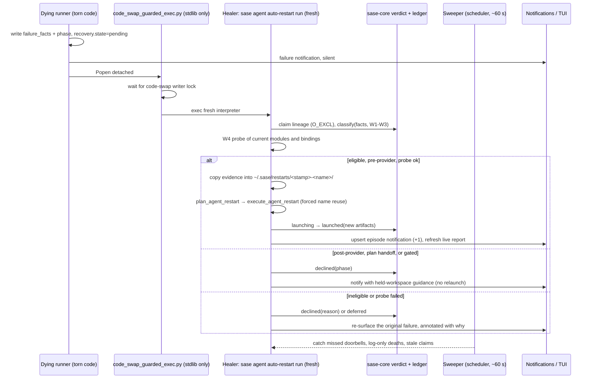

# Auto-Restarting Agents Killed by a Live sase Update

> **Research query:** Several sase agents failed with
> `ImportError: cannot import name 'auto_launch_prefix' from 'sase.monitor.continuation_delivery'`
> because sase was updated while they were running. How should sase support live updates
> by detecting errors like this (and which error patterns should it check for?) and
> restarting each failed agent exactly once, the way `,x` dismiss-and-edit followed by an
> unmodified `<ctrl+g><enter>` submit would, with a thorough notification and an
> intuitive, reliable, and beautiful design? Critique the plan, call out any justified
> requirement changes, and end with a recommended solution.


## Bottom line

**Yes, build automatic recovery, but as a safety net and not as literally specified. Ship a
[prevention fix](#prevention-track) first, because today's incident was a bug in sase's own
anti-skew code.**

1. **Today's incident: five agents, one bug site, zero LLM work lost.** All five crashed
   inside `refresh_runner_code_after_wait()`, the function that exists to survive a code
   swap during a `%wait`. It notices that sase's HEAD moved. Then, *before* its
   `os.execv`, it lazily imports modules from the new tree. The old in-memory code asked
   for `auto_launch_prefix`, which `9fd8a081f4` had just deleted. Reordering to "exec
   first, reconcile after" prevents the whole class. **Current master still has this
   shape.** See [what actually happened](#what-actually-happened).
2. **[One more agent is still at risk.](#still-live-right-now)**
   `chop.refresh_docs.sase.9_780508.2` booted on the vulnerable revision and is waiting on
   `.1`. It will die the same way when `.1` finishes. Relaunching it by hand now (`,x`,
   then submit) is free, because it has not started its model turn.
3. **The broader problem is real and recurring.**
   [About 43 skew failures](#how-big-is-the-problem) on athena since July: ~4.8% of failed
   agents, about 3.5 a week. There were 33 journaled `sase dev update` runs between Oct 6
   and Oct 9. Recovery is worth automating.
4. **The literal spec needs [four corrections](#requirement-adjustments):**
   - **"Exactly once" becomes "at most once per lineage",** enforced by a durable ledger.
   - **`,x` replay applies only to agents that died before their model turn.** About half
     of historical skew deaths happened *after* the turn finished, during finalizers,
     successor spawn, or plan handoff. A fresh replay there would redo hours of work and
     strand the finished diff.
   - **A matching error pattern is not evidence of skew.** Recovery needs a signature, an
     independent witness that sase changed during the run, and a fresh-process health
     probe ([which patterns to match](#which-error-patterns-to-match)).
   - **An automated `,x` deletes the evidence.** Forced name reuse wipes the old artifact
     directory, dismissed bundle, and notifications. The user never saw the failure, so
     the evidence must be copied out first.
5. **Recommended shape: an out-of-process
   [Update-Skew Healer](#recommended-architecture).**
   - **Trigger:** the dying runner rings a doorbell through the stdlib-only
     `code_swap_guarded_exec.py` bootstrap, which waits for any in-flight update to
     finish. A scheduler sweep backstops it.
   - **Decision:** the classifier and an at-most-once ledger live in `sase-core`.
   - **Relaunch:** through the same `plan_agent_restart` / `execute_agent_restart` seam the
     provider drain already uses.
   - **Feedback:** [one grouped, live-updating `↻` notification](#one-notification-per-update-episode)
     per update episode, in the amber accent the Updates panel already uses for "running
     code is stale".

## What actually happened

Everything in this section is verified.

**Trigger:**
`ImportError: cannot import name 'auto_launch_prefix' from 'sase.monitor.continuation_delivery'`

### Five agents, one crash site

Reconstructed from `~/.sase/workflows/202610/*ace-run-261009_*.txt` and
`~/.sase/logs/dev_update.jsonl`. Every traceback runs `run_agent_runner.main` →
`_run_agent` (line 232) → `refresh_runner_code_after_wait` →
`_reconcile_prompt_with_live_auto_state` → `ImportError`.

| Agent | Project | Refresh line (boot → current) | Died | Runner age |
| --- | --- | --- | --- | --- |
| `0yz` | bob-cli | `d7c4958 → 9fd8a08` | 11:57 | 6m |
| `research.46.final` | sase | `9c5000f → 9fd8a08` | 12:05 | 34m |
| `research.46.image` | sase | `9c5000f → 9fd8a08` | 12:36 | 1h05m |
| `toobig-7h.test_justfile_lint.0` | sase | `9c5000f → 9fd8a08` | 12:40 | 4h34m |
| `sase-1j1.6` (epic phase, bead-bound) | sase | `9c5000f → 63a8f7a` | 13:37 | 4h04m |

All five were still parked in `%wait`. None had started its provider turn, so for this
incident `,x` plus an unchanged submit was exactly the right repair.

### Mechanism

- **Every process imports from live checkouts.** The global `sase` is a uv tool whose
  `.pth` files point into the editable checkouts, `sase_core_rs` included (cld).
  - Modules imported at boot stay at the boot revision for the life of the process.
  - Deferred, function-local imports read whatever is on disk now.
- **The fatal import existed for about six hours.**
  - `auto_launch_prefix` itself was added on Sep 15 (`61febdcc68`).
  - The refresh path started importing it in `7e87589fb5` (Oct 9, 05:41), which was
    installed with `9c5000f2d` at 08:10.
  - `9fd8a081f4` removed the symbol (11:49), and it was installed at 11:53.
  - Any runner that booted between 08:10 and 11:53 and had a `%wait` resolve after 11:53
    was doomed.
- **The fifth agent (`sase-1j1.6`) woke after a later update (13:33).** It died for the
  same reason, because its boot code still carried the import.
- **The traceback is misleading.** It prints the *new* on-disk source at the failing line
  numbers, because `linecache` re-reads the file (cld).
- **Preloading would not have helped.** `preload_post_gate_modules()` runs inside
  `launch_agent_run`, which is *after* the dependency wait and refresh
  (`run_agent_runner_launch.py:350`). Adding `sase.monitor` to the preload set, as grk and
  gem propose, would not have prevented this crash.

### Still live right now

Measured on athena 13:40–14:00 EDT (see
[evidence gathered](#evidence-gathered-for-this-consolidation)).

- **Master still has the bug shape.** `_reconcile_prompt_with_live_auto_state` performs
  three function-local imports between "HEAD moved" and `execv`:
  - `sase.autonomy.record`
  - `sase.axe.agent_meta`
  - `sase.macro._directive_edit_core`

  `refresh_runner_code_after_wait` also lazily imports `sase.agent.multi_prompt_macros`.
  The next rename of any of these names re-creates today's incident.
- **11 live agents booted before 11:53.** I parsed the refresh path at each one's boot
  revision and checked every function-local import against master:
  - **9 are safe at the refresh step:** `sase-1ih.*`, `sase-1i5.*` and `sase-1ip.land`,
    booted Oct 8 or early Oct 9. Every name they import still resolves.
  - **`chop.refresh_docs.sase.9_780508.2` is not.** It booted at 10:03 on `9c5000f2d`, is
    `%wait`-ing on `.1`, and carries the `auto_launch_prefix` import. It will fail when
    `.1` finishes.
  - **`chop.refresh_docs.sase.9_780508.1` never reaches this code.** It is queued for a
    runner slot with no dependency wait, and the refresh runs only after `%wait`. It still
    runs stale code, though, so any later lazy import could hit post-provider skew.

Where the evidence contradicts the individual peer reports, see
[corrections to the individual reports](#corrections-to-the-individual-reports).

## How big is the problem

- **cld's corpus:** 905 failed agents from July to today. 43 de-duplicated skew failures,
  bucketed heuristically by lifecycle phase from traceback frames:

  | Phase at death | Count |
  | --- | --- |
  | Pre-provider (bootstrap, wait-refresh, workspace prep) | 14 |
  | **Post-provider** (finalizers, successor spawn, `invoke_agent` after the provider exited) | **17** |
  | Plan handoff | 4 |
  | Workflow Python steps | 3 |
  | Unclassified | 5 |

- **My independent scan agrees on magnitude.** I scanned failed `done.json` records plus
  dismissed bundles, 1,559 records, counted more broadly. It found **44** skew-signature
  hits:

  | Signature family | Hits |
  | --- | --- |
  | `cannot import name … from 'sase.agent.detached_child'` | 7 |
  | `… from 'sase.ace.patch.models'` | 5 |
  | `wire schema mismatch` | 5 |
  | `… from 'sase.xprompt.queue_directive'` | 4 |
  | `wire is stale` | 3 |
  | `written by a newer or unknown sase version` | 3 |

  Today's five are absent from this scan, because their `done.json` records are gone; the
  rows were dismissed or relaunched by hand.
- **Exposure is high.** There were 33 journaled `sase dev update` runs between Oct 6 and
  Oct 9, and most also swapped `sase-core-rs`. Every long-lived agent is exposed.
- **Most failures are not skew, and those must never match.** From cld's corpus:

  | Failure | Count |
  | --- | --- |
  | Provider exit 1 | 105 |
  | Commit-finalizer failures | ~90 |
  | Workspace preparation | 47 |
  | `%queue` directive errors | 21 |
  | Disk full | — |

## Critique: is this a good idea?

**Verdict: yes, as the second line of defense.** It turns a recurring manual chore (spot the
red row, `,x`, `<ctrl+g><enter>`, once per agent and per update) into something sase owns.

### What the request gets right

- **The goal.** Updating while agents run is the right thing to support. The alternative,
  blocking updates until agents finish, stalls updates for hours and was rejected by every
  report.
- **The budget.** One automatic attempt bounds cost and surprise.
- **The analog.** `,x` plus an unchanged submit is the right mental model *and* the right
  semantics:
  - Forced name reuse keeps `%wait:<name>` dependents and swarm names intact.
  - `R` (retry) would be the wrong verb: it allocates a new name and leaves the corpse
    (grk).
- **The notification.** Silent relaunch would hide spend and erode trust.

### What needs to change

1. **It treats a symptom whose cause is cheap to remove.** Today's incident is 100%
   preventable (P0, see the [prevention track](#prevention-track)). An auto-restarter
   that silently absorbs skew would hide that.
2. **`,x` replay is wrong after the model turn.**
   - A failed runner holds its workspace ("Workspace #0 held (visible failed run)"), so a
     post-provider death leaves a finished, uncommitted diff behind.
   - `,x` dismisses the row, which releases that workspace, then relaunches from origin and
     pays for the whole run again.
   - In finalizer-stage deaths, a commit may already exist.
3. **A pattern is not evidence.** `cannot import name 'X' from 'sase.Y'` is also what a
   genuine bug on master looks like. Restarting it burns the one attempt on a guaranteed
   repeat.
4. **Recovery cannot run in the dying process or in the TUI.**
   - The torn interpreter is the hazard. For example, `spawn_retry_agent` lazily imports
     `sase.agent.detached_child`, the module that broke five agents on 09-24 (cld).
   - ACE may be closed, may itself be stale, and covers neither Telegram nor mobile.
5. **Too early is as bad as never.** Relaunching mid-update boots into a half-updated tree
   and wastes the attempt. The corpus contains `partially initialized module` and
   stale-wheel signatures from exactly this.
6. **An automated `,x` destroys evidence.** `wipe_agent_name_for_reuse` intentionally
   removes artifact dirs, dismissed bundles, notifications and registry rows
   (`agent/names/_wipe.py`). The `~/.sase/restarts/` recovery bundle keeps only
   `agent_meta.json`, `raw_prompt.md`, `rewritten.md`, `restart.json` and `execution.md`.
   It keeps no traceback and no error report.
7. **N agents means N alarms.** Five red rows, then five restart toasts, is noise.
   Separately, `_severity_from_keywords` (`_toasts.py:109`) turns any note containing
   "fail" or "error" into an error toast.
8. **Do not puppet the TUI.** Synthesizing `,x` and `<ctrl+g><enter>` would race the
   user's prompt bar. The headless twin already exists, and the provider drain already
   composes it.

### Would I take a different approach?

Not a different feature: the same feature, inside a layered plan.

1. **Prevent:** exec-first refresh, plus tests that forbid late first-imports.
2. **Recover:** this healer, for the residue.
3. **Make it structural:** pin each process to an immutable release, so updating while
   agents run is *supported by construction*. Recovery then remains only for
   cross-process data-format skew.

| Rejected alternative | Why |
| --- | --- |
| Add `cannot import name` to `llm_provider.retry.*.error_patterns` | Runs in the torn interpreter, never sees runner-level deaths such as today's, and has no witness. |
| ACE-driven automatic `,x`, including gem's countdown toast | Needs ACE open, is itself skew-prone, races the prompt bar, and leaves Telegram/mobile out. |
| In-process `importlib.reload` | Old references and extension modules survive reload (cdx experiment). |
| Lock updates for an agent's lifetime | Stalls updates for hours. |
| Proactively restart every live agent on update | Wasteful; most agents survive updates. |
| Unbounded or backoff retries | A real bug on master would loop and burn money. |

## Requirement adjustments

Each change to your requirements is called out explicitly here.

| # | Your requirement | Adjusted requirement | Why |
| --- | --- | --- | --- |
| A1 | Restart exactly once | **At most one automatic restart per lineage,** claimed in a durable ledger before any mutation. A replacement that fails again is reported and never retried. | True exactly-once is impossible across crashes without risking duplicates. Failing closed is the safe reading of your intent. |
| A2 | Dismiss and relaunch like `,x` | **Phase-aware.** Pre-provider deaths: automatic `,x` semantics, always with forced name reuse. Post-provider deaths: v1 notifies with the held workspace intact; resume-in-place comes later. Plan handoff or open gate: ask. | `,x` is right for 14 of 43 historical cases and harmful for about 21. It is right for 5 of 5 today. |
| A3 | Detect error patterns | **Signature ∧ witness ∧ probe** ([which error patterns to match](#which-error-patterns-to-match)). | Rules out real bugs on master, which look identical. |
| A4 | *(new)* | **Quiescence gate.** Act only after any in-flight update releases the code-swap writer lock and a fresh interpreter passes the health probe. | Otherwise the one attempt is wasted on a half-updated tree. |
| A5 | Thorough notification per restart | **One upserted notification per update episode,** with a live report and one +1 per agent. Per-agent failure notifications go out silently and are superseded. Escalations stay loud. | One story instead of N alarms. |
| A6 | *(new)* | **Prevention ships first:** the [P0 refresh fix](#prevention-track) plus an import-firewall test. | It prevents 100% of today's incident at near-zero cost. |
| A7 | *(new)* | **Preserve evidence before the wipe:** copy `error_report.md`, the traceback, the runner-log tail and the failure facts into the recovery bundle, and link it from the replacement and the notification. | You must always be able to see why sase restarted something you never saw fail. |
| A8 | *(new)* | **User intent wins, plus a storm breaker and a kill switch.** Skip killed, user-dismissed, mid-`,x`, gated and question-holding agents. Pause on mass breakage. Add a permanent config switch. | Automation must never fight the user, and mass breakage is more likely a real bug. |
| A9 | "Similar to `,x` + `<ctrl+g><enter>`" | **Implement it headlessly** through `plan_agent_restart` / `execute_agent_restart`, the same prompt rewrite (`prepare_kill_and_edit_prompt`), with no TUI key synthesis. | Works with ACE closed and keeps one seam for `,x`, `sase agent restart`, drain and the healer. |

## Which error patterns to match

### Principles

1. **Use structured facts at the catch site; treat regexes as the fallback.** The runner
   holds the live exception, so it should persist a `failure_facts` block containing:
   - the exception type chain, bounded, with cycle detection
   - `ImportError.name` and `.path`
   - the missing symbol
   - the last frame's file
   - the lifecycle phase

   Regexes over `error` + `traceback` + log tail remain only for legacy rows and log-only
   deaths.
2. **Scope by origin.** The missing module or symbol must belong to a **managed
   distribution**, meaning one `sase dev update` swaps: `sase`, the editable `sase-*`
   plugins, or `sase_core_rs`. Its path must resolve under that distribution's root, never
   the agent's workspace. Agents working on the sase repo itself raise ImportErrors from
   *workspace* code all day; those must never match.
3. **Always require three signals:** a signature, a witness, and a probe.
4. **Gate by phase.** A Tier 1–3 match only *authorizes* a relaunch for pre-provider
   deaths ([what the automated `,x` does](#what-the-automated-dismiss-and-edit-does)).

### Signature catalog

| Tier | Signature (managed origin only) | Corpus | v1 action |
| --- | --- | ---: | --- |
| **1: Torn Python code** | `ImportError: cannot import name '<sym>' from '<managed mod>'` | ~30 | Recover |
| | `ModuleNotFoundError: No module named '<managed mod>'` | 2 | Recover |
| | `AttributeError: module '<managed mod>' has no attribute '<x>'` (module target only) | rare | Recover |
| | `cannot import name … from partially initialized module '<managed mod>'` | 1 (+logs) | Recover **only if** the probe passes; otherwise it is a real circular import |
| | `SyntaxError` / `IndentationError` in a file under a managed root | — | Recover only if the file now compiles (it was read mid-checkout) |
| **2: Rust binding / wire skew** | `sase_core_rs is importable but does not expose binding '<x>'` | ≥9 logs | Recover after the probe shows the binding |
| | `<x> wire schema mismatch: got N, expected M` / `wire is stale` | 8 | Recover after the probe |
| | `No module named 'sase_core_rs'` / partially-initialized `sase_core_rs` | logs | Recover after the probe |
| **3: Data-format skew** | `was written by a newer or unknown sase version`; `uses a format this process does not understand` | 3 | Recover with a witness. Fold the `llm_provider.retry.sase` entry into this feature over time. |
| **4: Usually a real bug** | Signature-mismatch `TypeError` (unexpected keyword, missing argument); `NameError` in a managed module | 3 | **Diagnose only.** v2 could add a `TypeError` case when `git diff boot..HEAD` touches the callee. |

Keep the catalog shaped by **families, not symbols**. Yesterday's `auto_launch_prefix` is
gone today, so a symbol list rots immediately (grk).

### Witnesses, and a correction to the health probe

| ID | Witness | Notes |
| --- | --- | --- |
| **W1** | **Persisted boot identity ≠ current identity.** The runner writes `code_identity` (sase SHA, plugin SHAs, core build) and `booted_at` into `agent_meta.json` at boot. | **Primary.** `_STARTUP_CODE_IDENTITY` already exists in memory (`run_agent_runner.py`) but is not persisted. |
| W2 | Dev-update journal shows an `updated` row between boot and failure | **Secondary only.** It missed the 11:53–13:33 HEAD move. |
| W3 | File-level proof: the symbol or module exists at the boot revision and not at HEAD, or the reverse | Strongest "why". `git log -S <sym> boot..HEAD` also names the **culprit commit** (`9fd8a08` today), which makes the best notification headline and episode key. |
| W4 | **Health probe** in a fresh interpreter | Doubles as the quiescence gate (~0.3–1 s). |

**Probe the current code, not the missing symbol.** cld proposed that W4 check "the same
import now succeeds". For removal-type skew such as today's,
`from sase.monitor.continuation_delivery import auto_launch_prefix` will *never* succeed on
master. That rule would decline exactly the incident this feature exists for.

Use cdx's formulation instead. Import, in a fresh interpreter, the *current* versions of
every managed module on the failing traceback plus the target module, then verify
`sase_core_rs` bindings. For addition-type skew, where a new caller meets a cached old
module, the probe may also assert that the symbol exists at HEAD.

**Decision rules:**

| Tier | Recover when |
| --- | --- |
| 1 | signature ∧ (W1 ∨ W2) ∧ W4 |
| 2 | signature ∧ W4, after quiescence |
| 3 | signature ∧ (W1 ∨ W2) |
| 4 | Decline; annotate the row instead |

W3 strengthens the "why" in every tier.

### Never restart

| Failure | Why not |
| --- | --- |
| Provider errors, 429s, usage limits, auth, context overflow | Owned by `llm_provider.retry` and the provider drain; avoid a second retry engine |
| User kill, SIGTERM, explicit cancel, rejected plan, completed gate or monitor handoff | User intent |
| OOM, SIGKILL, timeout, disk full, permission failures, `MemoryError`, `RecursionError` | A fresh process repeats them |
| Directive and macro errors, unknown aliases | Deterministic: the same prompt fails again |
| Commit-finalizer, publish and gate-dispatch failures | Reconcile the operation's own receipt; never replay the prompt |
| Workspace or linked-repo materialization failures | Environmental; a different feature should own them |
| Tool, pytest, `just check` and monitor *command* failures, and any ImportError from a workspace or third-party module | Agent work product, not harness |
| "Runner exited without recording an error" with no signature in the log tail | No evidence |
| Anything `plan_agent_restart` refuses | Multi-segment or fan-out prompts, containers, missing `raw_prompt.md`, hard-disabled provider |

## Recommended architecture

### Components

1. **Boot identity and phase breadcrumbs (runner).**
   - Persist `code_identity` and `booted_at` (W1).
   - Write a phase marker as the runner crosses each boundary:
     `booting → waiting → preparing → provider_running → provider_done → finalizing`.
   - This replaces the traceback-frame heuristics cld had to use.
2. **Failure facts (runner).** Extend `record_runner_error`, the loop-level failure
   writer, and `handle_workflow_error`. The facts module must be **imported at boot and
   use only the stdlib**, so the failure path never performs a lazy import itself.
3. **Doorbell (runner, best effort).** When facts look skew-shaped:
   - set `recovery.state = "pending"` in `done.json`
   - send the completion notification with `silent=True`
   - `Popen` the stdlib-only `dev_update/code_swap_guarded_exec.py`, detached, targeting
     `sase agent auto-restart run -a <artifacts_dir>`

   The bootstrap blocks until any update releases the writer lock, then execs a
   **fresh** interpreter. That gives quiescence for free and guarantees the healer never
   runs torn code.
4. **Healer (`sase agent auto-restart run`, fresh process).** Steps, in order:
   1. Claim the ledger entry.
   2. Classify through the core verdict.
   3. Run the probe; on failure mark `deferred`.
   4. Plan through `plan_agent_restart`; its refusals become decline reasons.
   5. Write the evidence bundle.
   6. Execute.
   7. Record the outcome.
   8. Upsert the episode notification.
5. **Sweeper (scheduler job, ~60 s).**
   - Catches missed doorbells, log-only deaths (pre-`main` import crashes write no
     `done.json`), and stale claims.
   - Covers agents booted on old code that has no breadcrumbs: signature fallback + W2 or
     the refresh log line + W4.
   - Re-surfaces any `pending` failure whose healer died, so nothing is silently
     swallowed.
   - Delegates the actual work to a fresh `sase agent auto-restart run` subprocess,
     because the long-lived service may itself be stale (cdx).
6. **Ledger** (`~/.sase/agent_auto_restart/`, outside any artifact directory a wipe
   could remove). Detailed under [at-most-once ledger](#at-most-once-ledger).

### Flow



### What the automated dismiss-and-edit does

This is what an automated `,x` does, exactly.

- **Rewrite.** `prepare_kill_and_edit_prompt` rewrites the stored `raw_prompt.md`. This
  covers forced name reuse, session attachment, role suffix, `phase_bead_id`, and clan
  membership.
  - "Unmodified" therefore means *the exact prompt `,x` would seed*, not raw bytes (mus).
  - The task body is never touched.
  - The model and provider are never changed.
  - Live autonomy (`%auto`) follows the live record, as the refresh path does.
- **Force name reuse, even for unnamed prompts.** `sase agent restart` already does this
  (`0yz` stays `0yz`), so `%wait` dependents and bead claims bind to the replacement.
- **Copy evidence before the wipe** ([A7](#requirement-adjustments)).
- **Execute through the drain's seam.** Call `execute_agent_restart`: dismiss the failed
  row, apply forced reuse, then `launch_agents_from_cwd` from `~` through normal
  admission, holds and capacity. Never use a privileged lane.
- **Order the batch.** Dependencies go before dependents (topological over `%wait`);
  otherwise least progress first, as the drain does.
- **Accept macro re-expansion.** Replay re-expands launch-time macros, including `$()`
  substitutions. That is identical to the manual flow you described, so it is acceptable,
  but it is not proof of zero side effects (cdx).
- **Make dependents follow the successor.** Wait-watch already follows
  `retried_as_timestamp` chains (`wait_watch/_classify.py::_follow_retry_chain`).
  - Name-based waits bind through forced reuse.
  - Timestamp- and ref-based waits need explicit tests, because the wipe removes the
    original artifact directory.
- **Remote rows** recover only on the owning machine.

### At-most-once ledger

- **Key:** the lineage root: `retry_chain_root_timestamp` if present, else the agent's own
  artifacts timestamp. The replacement's `agent_meta.json` carries `auto_restart_of` and
  `auto_restart_root`, so a second failure finds the existing entry and stops.
- **States:**
  `claimed → declined | deferred | launching(planned_name, plan_digest) → launched(new_artifacts) → settled(ok | failed)`.
- **Write order:** the ledger records the claim *before* any mutation. Any uncertainty
  resolves toward "attempt spent, notify".
- **Crash rule (cld):** if the healer dies in `launching`, the sweeper **adopts** any
  agent named `planned_name` whose artifacts are newer than the claim. It never
  re-launches, because forced reuse would wipe the replacement it just launched.
- **Budget scope:** one automatic restart per lineage. A manual `,x` starts a fresh
  lineage, so a later incident can auto-recover again.

### Code placement (Rust boundary rule)

| Lives in | What |
| --- | --- |
| **sase-core** | `failure_facts` wire; `classify_agent_failure(facts, witnesses) -> RecoveryVerdict { tier, signature, phase, mode, reason, witnesses }`; ledger record wire and state machine; episode-id derivation; status projection so `↻ restarting` looks identical in TUI, CLI, mobile and Telegram. Bump `sase-core-revision.txt`. |
| **sase (Python)** | Stdlib-only fact capture in the runner; doorbell; healer and sweeper orchestration through `sase.agent.restart`; evidence bundle; notification sender; TUI presentation; CLI. |

grk argued for a Python-only v1 to move faster. The project's boundary rule says that a
verdict every frontend must render identically is core logic, so the classifier goes in
core. The runner-side fact capture stays pure Python, so the dying process never needs a
new binding.

## User experience

**Intuitive, reliable, beautiful.**

**The mental model in one sentence:** *If a sase update breaks a running agent, sase puts it
back once, under the same name, and tells you exactly what it did and why.*

### Visual language: reuse what you already taught yourself

The Updates panel already renders "running code is stale; restart" as **`↻`** in
`UPDATE_CAUTION_ACCENT` (`#FFAF5F`): see `update_panel_state.py` and `update_accents.py`.
Use that exact glyph and accent for recovery everywhere: the notification icon and color,
the row chip, and the header line.

That rules out gold (`#C9A227`, grk) and sky blue (`#38BDF8`, gem). Amber `↻` already
means "sase changed under running code", and one consistent vocabulary is what makes this
feel designed rather than bolted on. Red stays reserved for things that need you.

### Agents tab

- **While recovery is pending or deferred**, the failed row renders amber `↻ RESTARTING`
  instead of red `FAILED`, with a dim hint. Either:
  - `sase updated 9c5000f → 9fd8a08 · restarting once the update settles`, or
  - `↻ waiting for sase update to finish`.
- **After a relaunch**, the old row disappears exactly as it does after `,x`. The
  replacement appears under the **same name** with a `↻` chip, reusing the `↻N` fragment
  style. Its identity header gains one line, and a key on that line opens the preserved
  error report:

  ```text
  ↻ Auto-restarted after sase update 9c5000f → 9fd8a08
    was: ImportError · cannot import name 'auto_launch_prefix' (sase.monitor.continuation_delivery)
    broke 12:04 refreshing after %wait · before its model turn · nothing lost
  ```

- **When recovery is declined**, the row is a normal `FAILED` plus one dim reason, such
  as:
  - `auto-restart skipped — already restarted once`
  - `auto-restart skipped — no sase update during this run (looks like a real bug)`
  - `not restarted — died after its model turn; workspace #3 held with its changes`
- **No new keymap.** `,x` stays the manual path. Update the `?` help modal to mention the
  behavior.

### One notification per update episode

| Field | Value |
| --- | --- |
| `sender` | `agent.auto-restart` |
| `icon` / `color` | `↻` / `#FFAF5F` |
| `tags` | `sase-update`, `auto-restart`, the tier id |
| `dedup_key` | `agent-auto-restart:<episode>`. The episode is the **culprit commit** from W3 when known (`sase@9fd8a08` groups all five of today's deaths, including the one that woke after 13:33); otherwise the target revision set. |
| Upsert | `upsert_notification`. Each later agent adds a +1 and refreshes the title; the per-agent silent failure rows are retired via `supersedes`. |
| `action` | `ViewReport` with a **live** `report_path` (`~/.sase/agent_auto_restart/episodes/<episode>.json`) and an embedded snapshot, so Telegram and mobile get it free. |
| `files` | Each agent's preserved `error_report.md` and the evidence bundle. |

Notes for today's incident, written once per episode:

```text
↻ Restarted 5 agents after sase update 9fd8a08
sase changed while they waited: their in-memory code asked the new files for auto_launch_prefix, which 9fd8a08 ("feat(autonomy): structural inheritance of live record…") removed.
• research.46.final, research.46.image, toobig-7h.test_justfile_lint.0, sase-1j1.6 (sase) — relaunched under the same names
• 0yz (bob-cli) — relaunched under the same name
Nothing was lost: all 5 broke while refreshing after %wait, before their model turn.
Each agent gets one automatic restart. If one breaks again you will get a normal failure notice and sase will not retry it.
```

**Copy rules:**

- **`notes[0]` never contains "fail" or "error".** The keyword heuristic would otherwise
  paint a successful recovery red. Exception text belongs in note 2 or later.
- **State the cost honestly.** Pre-provider replays cost nothing extra. If a later version
  ever replays post-provider work, the note must say that it spends a fresh agent turn.
- **Single-agent episodes** read
  `↻ Restarted research.46.final after sase update 9fd8a08`.

**The live report** uses only existing `ChopReport` blocks:

- **headline** (tone `ok`): `5 agents restarted · 0 left alone`
- **kv:**
  - Update: `9c5000f → 9fd8a08`
  - Culprit: commit subject
  - Roots changed
  - Witnesses fired: `boot fingerprint + file-level proof`
- **rows:** `Agent | Project | Broke during | Signature | Action | Now`. The **Now**
  column stays live (RUNNING / DONE / FAILED) because the healer and sweeper keep
  rewriting the report.
- **bullets:** "Left alone", each with its reason.
- **text:** "Why this happened", in two plain sentences.
- **divider**, then one dim line pointing at the prevention track.

### Toasts and escalations

- **Toasts:** exactly one per episode (`↻ sase update: restarted 5 agents`), at
  *information* severity. Never toast each +1, and never steal prompt-bar focus.
- **Escalations** go to the Errors tab via `ViewErrorReport` at normal error severity:

| Situation | Title |
| --- | --- |
| Declined: post-provider | `research.46.final broke after its model turn during a sase update — workspace #3 held with its changes. Review, then ,x to relaunch.` |
| Declined: other reason, or probe failed | `Couldn't restart research.46.final automatically — <reason>. Press ,x on it to retry by hand.` |
| The replacement broke again | The normal failure notification, plus `This was its automatic restart after sase update 9fd8a08 — not retrying.` |
| Storm breaker tripped | `Auto-restart paused: 13 agents broke within one update — this looks like a real bug, not an update race.` |

### CLI, `sase dev update` hint, config

**CLI.** Add a `sase agent auto-restart` group. Read the `cli_rules` memory before
implementing it: subcommands sorted alphabetically, short aliases, and a bare invocation
defaulting to `list`.

| Command | Purpose |
| --- | --- |
| `list` | Show ledger entries |
| `resume` | Re-arm after the storm breaker trips |
| `run (-a DIR \| NAME)` | The doorbell target; also usable by hand |
| `scan [-j] [-n] [-s DURATION]` | Replay the catalog over history; essential for tuning |
| `show NAME` | Every witness, the verdict, and the bundle path |

**`sase dev update` hint.** When live runners hold advisory reader slots, add one line:
`3 running agents are still on 9c5000f. If this update breaks one, sase restarts it once
automatically (sase agent auto-restart list).`

**Config.** Turning the feature on or off is a permanent user choice, so it is a config field, not a
flag:

```yaml
agent:
  auto_restart:
    enabled: true
    post_provider: notify      # v1; `resume` once resume mode lands
    quiescence_seconds: 30
    storm: {max_per_episode: 12, max_per_30m: 20}   # initial values; tune with `scan`
```

Use a `beta` flag (`agent_auto_restart`, created with `sase flag new`) only as epic
scaffolding while phases land, and delete it before the epic lands, per the flags note.

## Prevention track

1. **P0: fix the refresh path (ship now, tiny).**
   - In `refresh_runner_code_after_wait`, **exec first and reconcile after**: move
     `_reconcile_prompt_with_live_auto_state` into the refreshed pass, which already
     re-extracts directives with consistent code.
   - Hoist `read_local_macros_path` and the local-macros helpers to module scope.
   - Add an **import-firewall test**:
     1. Install a `sys.meta_path` finder that raises on any `sase.*` import after the
        identity check.
     2. Mock `os.execv`.
     3. Assert the function reaches `execv`.

   This prevents 100% of today's incident class.
2. **P1: make post-provider skew a CI failure.** Run a fake-provider agent end to end
   under an import-recording hook, and fail if any `sase.*` module is *first* imported
   after the provider exits and is missing from the preload set. That turns
   `preload_post_gate_modules`'s hand-kept allowlist into a test-enforced invariant
   covering the 17 post-provider cases. Also consider re-exec at further safe boundaries,
   as gem suggests (before plan handoff and before follow-up dispatch).
3. **P2: release pinning (structural; separate epic).**
   1. `sase dev update` materializes each root at its new SHA into an immutable
      `~/.local/share/sase/releases/<id>/`. `git worktree add --detach` makes this cheap,
      and the Rust `.so` is built into the release.
   2. It then atomically renames `releases/current`.
   3. Each editable `.pth` becomes an `import _sase_release_pin` line that resolves
      `current` once, at interpreter start.
   4. Old releases are garbage-collected once unmapped.

   This eliminates Tiers 1–2. Tier 3, an old process reading newer data, remains correct
   behavior, and the healer remains its net. cdx's "immutable runtime generations" is the
   same idea, and it is mus's "atomic install" made concrete for editable checkouts.

## Rollout and validation

| Phase | Scope | Exit criterion |
| --- | --- | --- |
| 0 | P0 refresh fix + import-firewall test | Today's incident cannot recur for newly booted runners |
| 1 | **Facts and verdicts, observation only:** boot `code_identity`, phase breadcrumbs, `failure_facts`, core `classify_agent_failure`, `sase agent auto-restart scan -n` | Corpus replay: today's 5 and about 14 historical rows classify as relaunch; **zero** hits among the ~860 non-skew failures |
| 2 | **Healer, ledger and sweeper,** relaunch mode only, behind the beta flag: evidence bundle, ordering, skip rules, storm breaker | Replaying today's 5 brings them back under their own names within ~1 min of the update finishing |
| 3 | **Doorbell and UX:** guarded-exec doorbell, `↻ RESTARTING` projection, episode notification + live report, toast rules, `dev update` hint; remove the flag; config switch | One notification and one information toast for a 5-agent episode; no red toasts |
| 4 | **Post-provider resume mode:** `RetryHandoff.from_artifacts`, held-workspace claim transfer, a short "verify and re-declare" continuation prompt; behind `post_provider: resume`; sunset `llm_provider.retry.sase` | Replaying 2026-09-24 (`spawn_agent_session_successor` ×5) resumes with each finished diff intact |
| 5 | P1 + P2 prevention (separate epic) | Tier 1–2 skew becomes impossible |

**Tests that matter:**

- **Incident replay:** the 9c5000f/9fd8a08 refresh traceback produces a relaunch verdict,
  and the probe passes even though the symbol is gone.
- **Negative fixtures:** the same ImportError with no revision change is declined with "no
  sase update during this run". So are:
  - a workspace ImportError from an agent testing the sase repo
  - a quoted traceback in a transcript
  - provider 429s
  - killed agents
  - directive errors
- **Crash windows:** the healer dies after claim, before launch, and after launch. A host
  restart never grants a second allowance or creates a duplicate.
- **User race:** a manual `,x` or dismissal during healer preparation wins.
- **Waits:** dependents follow the replacement for name, timestamp, ref, session and clan
  waits.
- **Flag:** both states tested while the flag exists.

## How the peer reports compare

### Corrections to the individual reports

| Report | Claim | What the evidence shows |
| --- | --- | --- |
| gem | `61febdcc6` *added* the symbol after the agents booted, and `followup.py` failed | Wrong direction and wrong frame. The symbol was removed. Every crash was in the refresh path. |
| grk | Lazy import in `llm_provider._invoke`; preloading `sase.monitor` would have stopped it; `<ctrl+g>` only opens `$EDITOR` | The crash frame was the refresh path, and preload runs after the wait. `<ctrl+g><enter>` is `submit_active_pane` (`_prompt_input_bar_g_prefix_dispatch.py`), so the user's description is right. |
| mus | Monitor supervisors / continuation delivery; atomic installs would shrink the window | Wrong frame. Updates are git fast-forwards of editable checkouts, so there is no install tree to swap atomically. The equivalent is release pinning ([prevention track](#prevention-track)). |
| cld | Four failures | Five. `sase-1j1.6` died at 13:37, after cld's analysis. |
| cdx | Inferred the refresh caller from history | Correct; now confirmed by all five tracebacks. |
| cld | The dev-update journal is an independent witness (W2) | Useful but **incomplete**. HEAD moved `9fd8a081f → 6f6754f97` between 11:53 and 13:33 with no journal row. |

### Where the reports disagreed

| Question | Positions | Resolution |
| --- | --- | --- |
| Root cause | cdx inferred the refresh caller; cld verified it; gem reversed the direction; grk and mus blamed other frames | **Refresh path**, verified in 5 of 5 tracebacks |
| Where recovery runs | gem: in the runner, with ACE as fallback; everyone else: out of process | **Out of process.** The runner only rings a stdlib-only doorbell. |
| Relaunch engine | grk and mus: `sase agent restart` as-is; cld: restart plus evidence copy; cdx: new non-destructive attempt-ID mode | **Restart seam plus evidence copy in v1.** cdx's immutable attempt identity is the right long-term model but a large registry change. |
| Phase scope | grk: always full redo; gem: progress-aware; mus: launch failures only; cdx: pre-execution only; cld: relaunch, resume or ask | **v1 automatic only pre-provider** (100% of today); post-provider notifies; resume in phase 4 |
| Detection | gem: regex plus mtime; mus: typed `VersionSkewError`; cld and cdx: signature plus witness | **Structured facts (regex fallback) ∧ witness ∧ probe.** The persisted boot identity is mus's version stamp. |
| Health probe | cld: "the same import succeeds"; cdx: "the current caller and runtime work" | **cdx.** cld's form would decline today's incident. |
| Prevention | grk and gem: preload `sase.monitor`; cld: exec-first; mus: atomic installs; cld and cdx: immutable releases | **Exec-first now** (preload runs after the wait, so it would not have helped); release pinning later |
| `TypeError` signatures | gem: include; cdx and cld: diagnose only | **Exclude in v1** |
| Classifier location | grk: Python v1; cdx and cld: sase-core | **sase-core**, per the boundary rule |
| Notification | gem: per-agent toast with a countdown; the others: grouped | **One upserted episode notification** with a live `ViewReport` |
| Color | grk: gold; gem: sky blue; cld and cdx: amber/neutral | **The existing `↻` + `#FFAF5F` update accent** |
| Budget scope | grk: per hop; mus: per row; cdx: per launch unit; cld: per lineage | **Per lineage root;** a manual `,x` starts a new lineage |
| Flag vs config | Broad agreement | **Permanent config switch;** beta flag only as epic scaffolding |

## Recommended solution

**Do these two things now:**

1. **Ship [P0](#prevention-track).** Exec first in `refresh_runner_code_after_wait`, add
   the import-firewall test, and hoist the remaining lazy imports.
2. **Relaunch `chop.refresh_docs.sase.9_780508.2` by hand** before `.1` finishes. It has
   not started its model turn.

**Then build the [Update-Skew Healer](#recommended-architecture) as one epic:**

- **Evidence first.** Persist the boot code identity, phase breadcrumbs and stdlib-only
  `failure_facts`, and classify them in `sase-core` with a family-based catalog. A
  restart requires a managed-origin **signature**, an independent **witness** that sase
  changed during the run, and a fresh-interpreter **probe of the current code**.
- **Out of process.** The dying runner only rings a doorbell through
  `code_swap_guarded_exec.py`, which waits out any update. A fresh healer process, plus a
  ~60 s sweeper, does the work.
- **At most once.** An `O_EXCL` ledger keyed by lineage root, claimed before any
  mutation, adopting rather than re-launching after a crash, with a storm breaker
  ([at-most-once ledger](#at-most-once-ledger)).
- **Automated `,x`, only where it is safe.** For agents that died before their model
  turn: `plan_agent_restart` → copy evidence into the recovery bundle →
  `execute_agent_restart` with forced name reuse, through normal admission, dependencies
  first. For later deaths: notify with the held workspace intact, then add resume-in-place
  once it has soaked.
- **One calm, beautiful story per update** ([user experience](#user-experience)).
  - One upserted `↻` notification in the amber update accent.
  - A live report whose "Now" column tracks each replacement.
  - One information toast.
  - Same-name replacement rows with a `↻` provenance line.
  - Loud escalations only when something needs you.
- **Long term,** pin each process to an immutable release, so updating sase while agents
  run is supported by construction, not recovered after the fact.

## Open questions for you

1. **Post-provider deaths:** is "notify with the workspace held" acceptable for v1? cld
   would auto-resume immediately. I would wait until resume mode has soaked.
2. **Name reuse:** should sase *always* force name reuse, even for prompts without `%id`?
   That keeps waiters and bead claims correct, and the evidence is copied before the wipe.
3. **Repeat failures:** if a *different* later update breaks a replacement, should it get
   its own restart? I recommend no for v1.
4. **Release pinning (P2):** do you want it? It changes how `sase dev update` installs.
   It is what turns "recovered" into "supported". See the
   [prevention track](#prevention-track).

## Evidence gathered for this consolidation

Consolidated report by the lead researcher, 2026-10-09. It merges five independent reports
(`cdx`, `cld`, `grk`, `mus`, `gem`) with my own re-verification against sase master
`dd5f0e5780`. I also checked live state on athena: runner logs, the `sase dev update`
journal, the live agent roster, and the failure corpus, all measured 13:40–14:00 EDT.

- **Runner logs:** `~/.sase/workflows/202610/gh_{sase-org__sase,bobs-org__bob-cli}_ace-run-261009_{080616,093229,112913,112914,115056}.txt`.
  Each contains the refresh line, the traceback frames, and "Workspace #0 held (visible
  failed run)".
- **Symbol history:** `git log -S auto_launch_prefix` →
  - `61febdcc68` (Sep 15): symbol added
  - `7e87589fb5` (Oct 9 05:41): the refresh path starts importing it
  - `9fd8a081f4` (Oct 9 11:49): symbol removed
- **Update timeline:** `~/.sase/logs/dev_update.jsonl`, 33 rows since Oct 6. Installs of
  interest: `9c5000f2d` at 08:10, `9fd8a081f` at 11:53, `63a8f7a62` at 13:33. HEAD moved
  `9fd8a081f → 6f6754f97` without a journal row.
- **Live exposure:** `sase agent list -j` showed 11 live agents booted before 11:53. For
  each boot revision, I parsed the function-local imports in
  `run_agent_runner_refresh.py` (AST) and resolved them against master.
- **Corpus:** an independent signature scan of failed `done.json` records and dismissed
  bundles found 44 hits, consistent with cld's 43 of 905.
- **Code checked on master:**
  - `axe/run_agent_runner_refresh.py`, `axe/run_agent_runner_launch.py:350` (preload
    placement), `axe/source_skew.py` (`_PRELOAD_PACKAGES = ("sase.sdd", "sase.bead")`)
  - `agent/_restart_execute.py`, `agent/names/_wipe.py`, `agent/relaunch_prompt.py`,
    `agent/provider_drain.py` (composes `plan_agent_restart` / `execute_agent_restart`)
  - `agent/wait_watch/_classify.py`
  - `notifications/models.py` (`icon`, `color`, `silent`, `dedup_key`, `plus_ones`),
    `notifications/store.py::upsert_notification`
  - `ace/tui/actions/agents/_toasts.py::_severity_from_keywords`,
    `ace/tui/update_panel_state.py` + `widgets/update_accents.py` (`↻`, `#FFAF5F`)
  - `ace/tui/widgets/_prompt_input_bar_g_prefix_dispatch.py` (`<ctrl+g><enter>` =
    `submit_active_pane`)
  - `default_config.yml` (`llm_provider.retry.sase` entry)
- **Peer reports:** `update_skew_agent_auto_restart__{cdx,cld,grk,mus,gem}.md` in this
  directory. The cld corpus counts and phase split, cdx's import-skew experiment, and the
  W1–W4 witness framing originate there.
