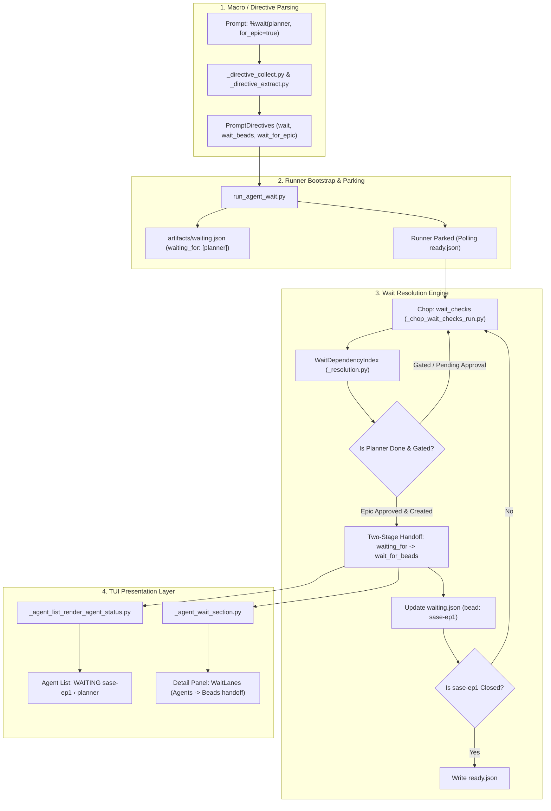
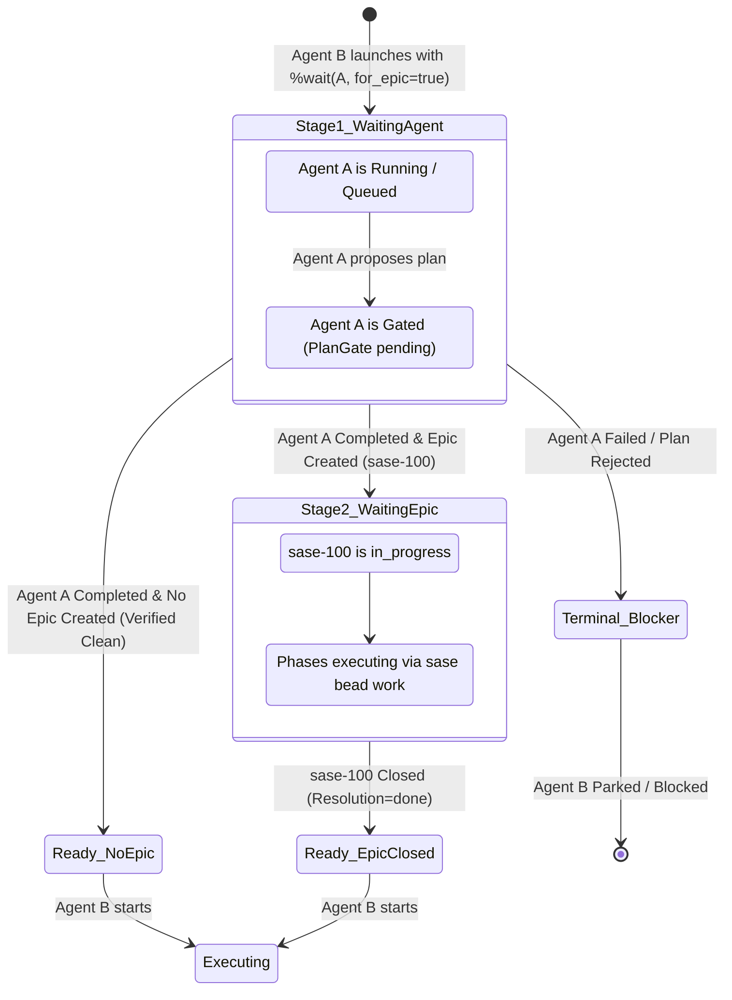

# Research & Architecture Evaluation: Dynamic Epic Waiting in `%wait` (`for_epic`)

**Researcher:** `research.3v.gem`  
**Date:** October 2026  
**Scope:** Design analysis, requirements critique, architectural audit, and implementation roadmap for adding `for_epic=<true|false>` to the SASE `%wait` directive.

---

## 1. Executive Summary

### 1.1 The Problem
In Structured Agentic Software Engineering (SASE), multi-stage autonomous workflows often feature a two-phase lifecycle:
1. **Epic Formulation:** An exploratory or planning agent (e.g. `planner`) designs an architectural change, specifies phases, and submits an epic plan.
2. **Post-Epic Execution:** A downstream agent (e.g. integration tester, documentation updater, release packager) needs to execute *after the entire multi-phase epic has landed and closed*.

Under current SASE mechanics, a user or script cannot queue the downstream agent concurrently with or immediately after the planning agent. If the downstream agent uses `%wait:planner`, it unblocks as soon as the planner finishes drafting the plan—long before any implementation phases run. To actually wait for the epic to finish, the user must wait for the planner to run, wait for plan approval, manually inspect the newly minted epic bead ID (e.g. `sase-a1`), and only then author and launch the downstream agent with `%wait(bead=sase-a1)`.

This creates an unwanted human-in-the-loop synchronization barrier and disrupts unattended pipelining.

### 1.2 The Proposal Under Review
The user proposes adding a `for_epic=<true|false>` keyword input to the `%wait` directive:
- **Invocation & Default:** Default to `true` when an agent name is provided; raise diagnostic errors/warnings if used without an agent name.
- **Behavior:** The launched agent waits for the specified agent *and* subsequently waits for any epic bead that this agent may (or may not) create.
- **Linking:** Leverage artifact/bead linking infrastructure between the creating agent and the created epic bead.
- **TUI Visibility:** Make the dynamic transition transparent and visually distinct when the agent ceases waiting for the progenitor agent and begins waiting for the resulting epic bead.

### 1.3 High-Level Verdict & Summary of Critique
| Proposal Aspect | Feasibility | Verdict | Recommended Adjustment |
| :--- | :--- | :--- | :--- |
| **Concept:** Dynamic Agent-to-Epic Wait Handoff | High | **Strongly Endorsed** | Essential capability that unlocks true multi-stage autonomous pipelines. |
| **Syntax:** `for_epic=<true\|false>` on `%wait` | High | **Approved** | Support both `for_epic=true` and boolean flag `for_epic`. |
| **Default:** Defaulting to `true` when agent name provided | High | **Rejected (Dangerous)** | **MUST remain opt-in (`default=false`)**. Defaulting to `true` silently breaks existing review agents, notification agents, and multi-agent coordination pipelines. |
| **Semantics:** "May or May Not Create" | Medium | **Refined** | A pure silent pass-through if no epic is created can trigger destructive runs on unmigrated code. Require explicit handling for plan rejections, failures, and clean no-epic completions. |
| **Linking Infrastructure:** "Already set up" | High | **Partially True (Requires Completion)** | Raw attribution (`Issue.created_by`) exists in SQLite, but the formal *artifact link projection* (`agent produced bead`) and agent-side metadata mirroring need implementation. |
| **Timing/Gating Gap:** Asynchronous Plan Approval | High | **Critical Gotcha Identified** | Epic beads do not exist at planner process exit; they are instantiated when the `PlanGate` resolves. The wait engine must track the gate state machine to avoid premature unblocking. |

---

## 2. Architectural Audit of Existing SASE Infrastructure

To design this cleanly, we performed an exhaustive audit across the SASE codebase:



### 2.1 Directive Parsing & Validation
- **Location:** `src/sase/macro/_directive_types.py`, `_directive_collect.py`, `_directive_extract.py`, `directive_diagnostics.py`.
- **Current Behavior:**
  - `_KNOWN_DIRECTIVES` includes `"wait"` (alias `"w"`).
  - In `_directive_collect.py` (lines 130–162), `%wait` validates against `supported_keys = {"agent", "bead", "hood", "proc", "time", "unit"}`. Any unknown keyword triggers a `DirectiveError`.
  - Positional arguments (`%wait:planner` or `%wait(planner)`) populate `collected.seen_multi["wait"]`.
- **Extension Point:**
  - Add `"for_epic"` to `supported_keys` in `_directive_collect.py`.
  - Add a mapping/list on `PromptDirectives`: `wait_for_epic: dict[str, bool]` (or a per-target wait spec tuple).
  - Enforce in validation: if `for_epic` is supplied, at least one agent wait target must be present in the directive. If passed alongside `bead=`, `proc=`, `unit=`, or standalone without an agent name, raise a helpful `DirectiveError`.

### 2.2 Runner Parking & the Two-Stage Wait Precedent
- **Location:** `src/sase/axe/run_agent_wait.py`, `run_agent_wait_deps.py`, `run_agent_wait_markers.py`.
- **Current Behavior:**
  - Parked runners write `waiting.json` into their `artifacts_dir`:
    ```json
    {
      "waiting_for": ["planner"],
      "wait_for_beads": [],
      "patch_name": "...",
      "timestamp": "..."
    }
    ```
  - The runner process polls `ready.json` (written by `wait_checks`) with an in-process fallback check.
- **Precedent for Two-Stage Waits:**
  - In `run_agent_wait.py` (lines 252–262), SASE already implements a two-stage sequential wait for combined dependency and duration waits (`%wait:agent %wait(time=10m)`):
    ```python
    # Stage 1: Wait for dependencies
    # Stage 2: When dependencies resolve, compute post_dependency_wait_until,
    # rewrite waiting.json, and continue sleeping.
    waiting_data["wait_until"] = post_dependency_wait_until
    write_waiting_marker(artifacts_dir, waiting_data)
    ```
  - This provides a proven, battle-tested architectural pattern for transitioning an agent's wait state in place!

### 2.3 The Wait Checks Chop & Dependency Resolution
- **Location:** `src/sase/scripts/_chop_wait_checks_run.py`, `src/sase/core/wait_dependency_resolution/`.
- **Current Behavior:**
  - The `wait_checks` lumberjack chop periodically scans every active `waiting.json`.
  - It builds a `WaitDependencyIndex` and resolves agent completion via `initial_dependencies_resolved` and `dependency_resolution_status`.
  - For bead waits (`wait_for_beads`), it queries `closed_bead_ids_for_waits` against the project's SQLite bead store (`closed_bead_ids_for_project`).
  - Once all conditions in `waiting.json` are met, it writes `ready.json` to release the parked runner.

### 2.4 Bead Store Attribution vs. Artifact Link Projections
- **Location:** `src/sase/bead/model.py`, `src/sase/bead/attribution.py`, `src/sase/artifact_links/projection/`.
- **Attribution In SQLite:**
  - In `Issue` (`src/sase/bead/model.py` line 295): every bead stores `created_by: str`.
  - When an epic bead is created via `sase bead create` or plan approval `create_and_launch_epic_from_plan` (`src/sase/bead/epic_from_plan.py` line 150), `created_by` is stamped with the acting agent name or the plan's `proposed_by` frontmatter.
  - Epics are unambiguously distinguished by `issue.tier == BeadTier.EPIC` (or SQLite `tier = 'epic'`).
- **The Artifact Link Graph Gap:**
  - SASE's link registry (`sase/memory/sase_artifacts.md`) reserves the relation `produced-by` (inverse `produced`, written by projection).
  - However, in `src/sase/artifact_links/projection/`:
    - `_agent_bead.py` only projects `implements` edges for agents that *work on* a bead (from `agent_meta.json`'s `bead_id`, `epic_bead_id`, `phase_bead_id`).
    - `_agent_wait_bead.py` projects `awaits` edges from `wait_for_beads`.
    - **No projection rule currently emits `agent:<name> produced bead:<id>`.**
  - Therefore, the user's remark that "infrastructure is already set up" is true at the SQLite / attribution layer, but the formal artifact link graph projection does not yet bridge `agent -> produced -> bead`.

### 2.5 Plan Approval Lifecycle & The Gating Asynchrony
- **Location:** `src/sase/plan_gate.py`, `src/sase/main/plan_approve_handler.py`, `src/sase/core/dismissed_agent_completion.py`.
- **Key Insight:**
  - When an agent proposes an epic plan, the agent turn finishes immediately with a `PlanGate` / `EpicApproval` notification gate (Decision `gates-never-block`: a gate never blocks an agent; continuation is host-owned).
  - While awaiting human review (or auto-approval), the planner agent's outcome is `GATE_OUTCOME` (`"gated"`).
  - In `src/sase/core/dismissed_agent_completion.py`:
    `WAIT_SUCCESS_OUTCOMES = frozenset({"completed", "noop", "epic_approved", "plan_committed"})`.
  - `"gated"` is NOT in `WAIT_SUCCESS_OUTCOMES`.
  - **Crucial consequence:** While the plan gate is pending, the planner is considered unresolved. Only when the gate is approved does its outcome become `"epic_approved"`, and only then does `create_and_launch_epic_from_plan` allocate the epic bead ID in SQLite.

---

## 3. Deep Critique of the Proposal

### 3.1 Critique Point 1: Why Defaulting to `for_epic=true` is Dangerous
The user suggested:
> *"This input would default to `true` when a sase agent name is provided as an argument alongside it..."*

We strongly recommend **against** defaulting to `true` on ordinary `%wait:agent` directives.

#### Why it must be strictly opt-in (`default=false`):
1. **Breaks Review and Pipeline Agents:**
   Many agents are designed to inspect the planner's work *before* or *independent of* the epic's implementation. For example:
   - A plan-review agent: `%i:plan_reviewer %wait:planner Review the plan proposed by planner`.
   - A metrics/notification agent: `%i:notify %wait:planner Post summary of drafted plan to chat`.
   - A follow-up triage agent: `%i:triage %wait:investigator File tickets based on investigator findings`.
   If `%wait:planner` implicitly defaulted to `for_epic=true`, the reviewer agent would be frozen until the entire epic is finished—creating an impossible deadlock where the reviewer waits for the epic to be completed before reviewing the plan to start it!
2. **Unintended Blocking on Unrelated Epic Creation:**
   If a generic development agent (e.g. `refactor_core`) creates an epic bead for discovered backlog work (`sase bead create -T plan(...) --tier epic`) while performing its normal tasks, a downstream unit test runner `%wait:refactor_core` would suddenly stall waiting for that future backlog epic to close.
3. **Backward Compatibility:**
   Across hundreds of existing macros, tests, and user prompts, `%wait:agent` has always meant: *"unblock when this provider turn's process reaches a terminal success outcome."* Changing this default alters the core contract of SASE scheduling.

**Recommendation:** `for_epic` must be an explicit parameter.
- Default remains `for_epic=false` for standard `%wait:agent`.
- Enabled via `%wait(agent, for_epic=true)` or boolean flag shorthand `%wait(agent, for_epic)`.

---

### 3.2 Critique Point 2: The "May or May Not Create" Problem & Strictness Semantics
The user requested:
> *"Namely, when `for_epic=true`, the sase agent that is launched from that prompt should wait for the agent specified by the `%wait` directive AND should also wait for any epic bead that this agent may or may not create."*

What should happen across all edge cases?

| Scenario | Agent Outcome | Epic Created? | Permissive Policy (`for_epic=true`) | Recommended Policy (`strict` vs `permissive`) |
| :--- | :--- | :--- | :--- | :--- |
| **A. Happy Path** | `epic_approved` / `completed` | Yes (`sase-100`) | Handoff wait to `sase-100` | **Handoff wait to `sase-100`** |
| **B. Clean Non-Epic** | `completed` | No | Immediately unblocks | **Configurable:** By default, log a visible notice in TUI/artifacts: `No epic created by <agent>; wait satisfied.` If `strict_epic=true`, fail/block. |
| **C. Plan Rejected** | `plan_rejected` | No | Blocks/fails | **Terminal Blocker:** Do NOT unblock downstream. Post notification `Plan for <agent> rejected; wait aborted.` |
| **D. Agent Crashed** | `failed` / `killed` | No | Blocks/fails | **Terminal Blocker:** Standard SASE failure propagation. |
| **E. Multiple Epics** | `completed` | Multiple (`sase-1`, `sase-2`) | Ambiguous | **Track All:** Downstream waits for `wait_for_beads: [sase-1, sase-2]`. Both must close before downstream unblocks. |
| **F. Plan Gate Pending**| `gated` | Not yet | Must NOT unblock | **Hold State:** Downstream remains waiting for `<agent>` until the gate resolves. |

#### Why Permissive Fallthrough Needs Guardrails
If a user launches `deploy_service` with `%wait(database_migration, for_epic=true)`, and `database_migration` silently crashes or finishes without creating the migration epic, allowing `deploy_service` to run immediately could cause severe runtime breakage.
Therefore, the resolution engine must verify that the progenitor agent succeeded with a valid completion outcome before treating a "no epic created" result as satisfied.

---

### 3.3 Critique Point 3: The Asynchronous Gate Window (The Hidden Race Condition)
This is the most critical technical nuance of the implementation:
1. Agent A is an epic planner. Agent A finishes executing its prompt and proposes a plan via `PlanGate`.
2. Agent A's process exits. Its local turn is done.
3. At this exact moment, **no epic bead exists in the bead store**.
4. The human takes 15 minutes to review and approve the plan in the TUI.
5. Upon approval, `create_and_launch_epic_from_plan` runs and writes epic bead `sase-100` to SQLite.

**The Danger:**
If the wait resolution engine evaluates Agent B naively:
- It sees Agent A's process is no longer running.
- It queries SQLite for epics created by Agent A.
- It finds zero epics.
- If it assumes "Agent A is done and created no epic", it writes `ready.json` and launches Agent B immediately!

**The Solution:**
Agent A's outcome while awaiting plan review is `"gated"` (via `SubmittedPlanArtifact`). The wait resolution engine must treat a gated agent as **unresolved**. Only when the gate is approved (`outcome == "epic_approved"`) does Agent A resolve, at which point `sase-100` is guaranteed to exist in SQLite.

---

## 4. Architectural Design & Implementation Specification

### 4.1 Directive Syntax & Parser (`src/sase/macro/`)

#### Directive Contract
We support parenthesized keyword arguments and flag shorthand:
- Explicit: `%wait(agent_name, for_epic=true)`
- Flag: `%wait(agent_name, for_epic)` (defaults to `true`)
- Opt-out: `%wait(agent_name, for_epic=false)`

#### Diagnostics & Validation Rules
1. `for_epic` requires an agent name.
   - Authoring `%wait(bead=sase-12, for_epic=true)` raises:
     `DirectiveError: 'for_epic=' keyword on %wait is only valid for agent dependencies, not bead/proc/time waits.`
   - Authoring `%wait(for_epic=true)` without an agent name or prior agent context raises:
     `DirectiveError: 'for_epic=' requires an explicit agent name or preceding agent in the launch group.`
2. Non-boolean values raise:
   `DirectiveError: 'for_epic=' requires a boolean value ('true' or 'false').`

#### Data Model (`src/sase/macro/_directive_types.py`)
```python
@dataclass
class PromptDirectives:
    # Existing fields...
    wait: list[str] = field(default_factory=list)
    wait_for_epic: dict[str, bool] = field(default_factory=dict)
```
When `%wait(foo, for_epic=true)` is parsed:
- `wait` contains `["foo"]`
- `wait_for_epic["foo"] = True`

---

### 4.2 Bead Attribution & Artifact Link Graph

#### Authoritative Source: Bead Store Query
In `src/sase/bead/store_locator.py` / `src/sase/bead/wait_status.py`, add a helper:
```python
def find_epic_beads_for_agent(
    project_name: str,
    agent_name: str,
) -> tuple[str, ...]:
    """Query local and project bead stores for epic plan beads created by agent_name.
    
    Matches issue.created_by == agent_name and issue.tier == BeadTier.EPIC.
    Also checks issues where design plan frontmatter proposed_by == agent_name.
    """
```

#### Durable Artifact Link Projection
Implement a new projection rule in `src/sase/artifact_links/projection/_agent_bead.py`:
- **Rule ID:** `agent-created-bead`
- **Source Ref:** `agent:<global_agent_name>`
- **Relation:** `produced` (target `bead:<epic_id>`)
- **Inverse:** `bead:<epic_id>` `produced-by` `agent:<global_agent_name>`
- **Trigger:** Evaluated during incremental index scans whenever new beads are committed.

This satisfies the requirement that formal, auditable artifact links connect the agent to its created epic bead.

---

### 4.3 The Two-Stage Wait Resolution State Machine



#### State 1: Agent Wait
- `waiting.json` records:
  ```json
  {
    "waiting_for": ["planner"],
    "wait_for_beads": [],
    "wait_for_epic": {
      "planner": true
    },
    "stage": "agent"
  }
  ```
- Runner and `wait_checks` poll Agent `planner`.
- If `planner` is in `WAIT_SUCCESS_OUTCOMES` (e.g. `"epic_approved"`, `"completed"`):
  - Resolution engine calls `find_epic_beads_for_agent(project, "planner")`.

#### Transition Point: The Dynamic Handoff
- If one or more epic beads are discovered (e.g. `["sase-100"]`):
  - Runner or `wait_checks` transitions the wait state.
  - `waiting.json` is atomically updated:
    ```json
    {
      "waiting_for": [],
      "wait_for_beads": ["sase-100"],
      "wait_for_epic_handoff": {
        "sase-100": {
          "source_agent": "planner",
          "handed_off_at": "2026-10-06T16:50:00Z"
        }
      },
      "stage": "epic"
    }
    ```
  - `agent_meta.json` is updated with `wait_for_beads: ["sase-100"]`.
  - A TUI toast / status message is emitted:
    `"Handoff: <Agent B> finished waiting for <planner>; now waiting for epic <sase-100>"`

#### State 2: Epic Wait
- Normal bead resolution takes over:
  - `wait_checks` monitors `sase-100` via `closed_bead_ids_for_waits`.
  - When `sase-100` is closed, `ready.json` is written.
  - Agent B launches.

---

### 4.4 TUI Design: Intuitive, Reliable, and Beautiful

The user specifically requested:
> *"We will also want to make it very clear to the user in the TUI somehow when an agent has stopped waiting for the agent it specified via the `%wait` directive and is now waiting for the epic bead that agent created instead... Make sure you design this feature so it is intuitive, reliable, and (last but not least) beautiful!"*

Here is the exact visual specification across the two primary TUI panels:

#### 1. Agent List Status Column (`_agent_list_render_agent_status.py`)
In the main agent roster, the status text communicates both the current blocker and its lineage:

- **Stage 1 (Waiting for Agent):**
  ```text
  WAITING  planner ➔ [epic]
  ```
  - Styling: `WAITING` in bold Amethyst (`#AF87FF`).
  - `planner` in soft violet.
  - Glyphs: `➔` (`#8787AF`) and `[epic]` in dim cyan (`#5FAFAF`), indicating that it is waiting for `planner` specifically to produce an epic.

- **Stage 2 (Handoff Complete — Waiting for Epic Bead):**
  ```text
  WAITING  sase-100 ‹ planner
  ```
  - Styling: `sase-100` rendered in bead color with status badge (e.g. Gold `#FFAF00` for `in_progress`).
  - Glyphs: `‹` in dim Amethyst (`#875FD7`), followed by `planner` in dim violet (`#767676`).
  - **Visual impact:** At a glance, the user immediately sees:
    1. The agent is waiting on bead `sase-100`.
    2. `sase-100` originated from `planner`.
    3. The agent is no longer blocked on `planner`'s process.

- **Stage 1 Fallthrough (No Epic Created, Agent Succeeded):**
  - If no epic was created, it cleanly transitions to unblocked without visual glitching.

#### 2. Detail Header & Wait Section (`_agent_wait_section.py`)
In the prompt inspect / detail panel (right pane), `WaitLane` renders structured provenance:

```text
╭─ Wait Dependencies ────────────────────────────────────────────────────────╮
│ Agents:  planner   [DONE]  ✓ epic produced                                  │
│ Epic:    sase-100  [IN PROGRESS]  (handed off from planner at 16:50)        │
│          ├─ Phases: 3 total · 1 active · 2 pending                          │
│          └─ Model:  claude-sonnet-4-6                                       │
╰─────────────────────────────────────────────────────────────────────────────╯
```

When Stage 1 is active:
```text
╭─ Wait Dependencies ────────────────────────────────────────────────────────╮
│ Agents:  planner   [RUNNING] ➔ waiting for epic creation                    │
╰─────────────────────────────────────────────────────────────────────────────╯
```

#### 3. TUI Interactive Toasts
When the handoff occurs while the TUI is open, dispatch an info toast:
```text
ℹ Handoff: downstream-agent is now waiting for epic sase-100 (created by planner)
```

---

## 5. Comparative Trade-Off Analysis

| Criteria | Alternative 1: User Pre-Declares Epic Tag (`#my-epic`) | Alternative 2: Clan Wait on Epic Clan | Recommended: Dynamic Agent-to-Epic Handoff (`for_epic=true`) |
| :--- | :--- | :--- | :--- |
| **User Ergonomics** | Poor. User must invent and synchronize a tag between prompts. | Moderate. Requires epic clan naming conventions that don't exist before launch. | **Superb.** User only needs to name the planner agent in `%wait`. |
| **Pipeline Autonomy**| High. | High. | **High.** Full unassisted progression. |
| **Implementation Complexity**| Moderate. Needs a tag registry. | High. Tribe/clan binding changes. | **Low-Medium.** Builds directly on existing `waiting.json` two-stage wait & SQLite queries. |
| **Failure Transparency**| Low. Stalls forever if tag is never published. | Low. Clan waits can hang on zero members. | **High.** Clear state transition, explicit handoff tracking, and terminal blocker handling. |

---

## 6. Implementation Plan & Recommended Phases

### Phase 1: Macro & Directive Support
1. Update `PromptDirectives` in `src/sase/macro/_directive_types.py` to store `wait_for_epic: dict[str, bool]`.
2. Update `_directive_collect.py` to admit `for_epic` in `supported_keys` when `name == "wait"`.
3. Add validation in `_directive_values.py`: ensure `for_epic` is boolean and paired with an agent wait target.
4. Add comprehensive unit tests in `tests/test_macro_wait_directives.py`.

### Phase 2: Bead Store Query & Artifact Link Projection
1. Implement `find_epic_beads_for_agent(project, agent_name)` in `src/sase/bead/store_locator.py`.
2. Add projection rule `agent-created-bead` in `src/sase/artifact_links/projection/_agent_bead.py` to project `agent:<name> produced bead:<id>` rows into the artifact link store.
3. Test bead query against SQLite schemas and cross-project locator snapshots.

### Phase 3: Wait Engine Handoff Logic
1. In `src/sase/axe/run_agent_wait.py`, extend `waiting_data` schema to accept `wait_for_epic`.
2. In `src/sase/scripts/_chop_wait_checks_run.py` and `src/sase/core/wait_dependency_resolution/_resolution.py`:
   - When evaluating an agent dependency with `for_epic=true`:
     - If agent is unresolved or gated, hold.
     - If agent is completed/epic_approved, query for its created epic beads.
     - If epic bead is found and unclosed: update `waiting.json` to swap agent target for bead target (`wait_for_beads = [epic_id]`).
     - If epic bead is found and closed: mark resolved.
     - If no epic bead found and agent completed cleanly: mark resolved (with diagnostic log).
3. Test two-stage transition in `tests/test_run_agent_wait.py`.

### Phase 4: TUI Polish & Presentation
1. In `_agent_list_render_agent_status.py`, add the `sase-100 ‹ planner` glyph styling for handed-off waits.
2. In `_agent_wait_section.py`, render the dedicated `Epic:` handoff lane in the prompt inspection detail pane.
3. Add toast notification in `AgentWaitActionsMixin` when a dynamic handoff event is observed.
4. Verify visual styling across both light and dark themes.

---

## 7. Conclusion

The proposed `for_epic` capability addresses a genuine bottleneck in SASE's autonomous agent pipelining. By transitioning a wait dependency dynamically from a progenitor planner agent to the epic bead it instantiates, SASE eliminates human-in-the-loop bead ID transcription.

With the crucial requirement adjustment that **`for_epic` must remain strictly opt-in** and the inclusion of **asynchronous gate-awareness**, the design is robust, architecturally sound, and ready for implementation.
