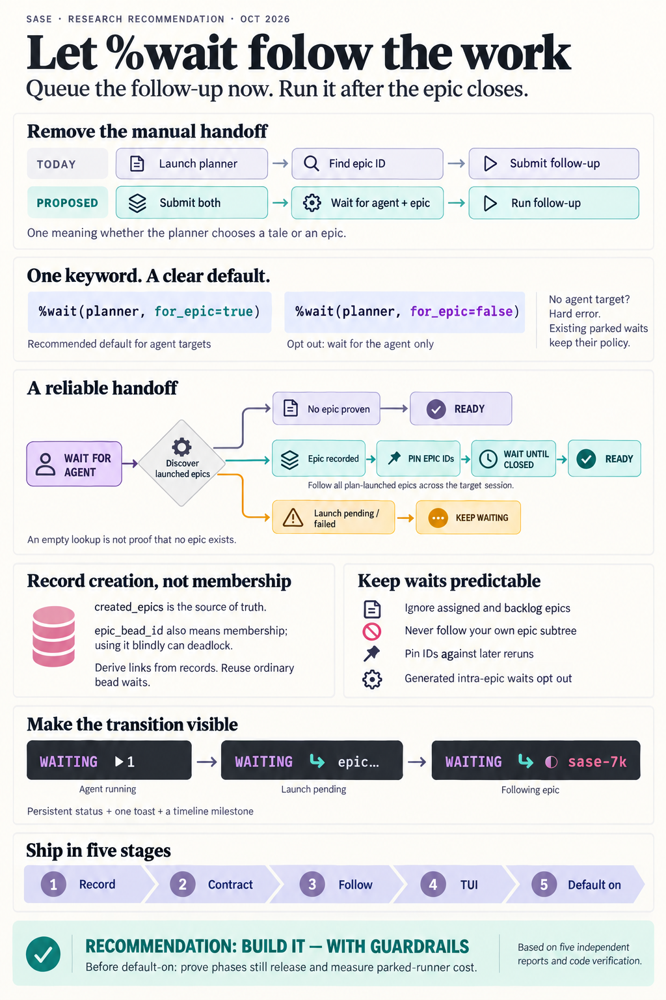

---
audio:
  edition: brief
  duration_s: 275.6
  chapter_count: 3
  episode_id: let-a-wait-follow-an-agent-into-its-epic-d63632
---

# `%wait(…, for_epic=)`: Let a Wait Follow an Agent Into the Epic It Launches

> **Research query:** How should SASE add a `for_epic=<true|false>` keyword to the
> `%wait` directive — defaulting to true when an agent name is given, and erroring or
> warning when used without one — so a launched agent waits for that agent and also for
> any epic bead it creates, letting users launch follow-ups before the epic's ID exists?
> Design it to be intuitive, reliable, and beautiful, with consistent agent-to-epic
> links and a clear TUI signal when the wait hands off to the epic; critique the plan,
> call out justified requirement adjustments, and end with a recommended solution.

<div class="listen">

♫ **Brief audio edition** · 5 min · 3 chapters ·
[Narration script](wait_follows_agent_into_epic_narration.md)

</div>



## Bottom line

1. **Build it.** All five researchers agree, and so do I. Today the motivating flow
   takes two steps. You launch a planner, watch until its epic bead exists, copy the ID,
   and only then launch the follow-up with `%wait(bead=…)`. SASE already knows
   everything needed to do that hand-off itself. `docs/axe.md` even documents the gap:
   _"A wait on an epic-approved planner waits for that planner, not for the host-owned
   epic it launched."_
2. **Keep your default (`for_epic` on for agent targets), with guardrails.** This is
   where the researchers split. `cld` and `cdx` back the default. `grk`, `mus`, and
   `gem` reject it. I side with the default, and
   [the objections table](#why-default-on-survives-the-objections) explains why the
   objections mostly don't hold up against the code. The deciding fact is that **today
   `%wait:planner` already waits for the implementation when the planner picks a tale**,
   because the tale's coder runs inside the planner's session. When the planner picks an
   epic, the wait stops at the launch. The planner makes that choice after you have
   typed the wait. With the default on, the meaning of `%wait:planner` no longer depends
   on a tier decision you can't see. SASE's own epic machinery already uses this rule
   internally: it pairs every phase-agent wait with a phase-bead closure wait.
3. **The link you assumed exists only partly.** Attribution exists: `proposed_by` on
   plans and `created_by` on beads. What does not exist is a link reliable enough for
   scheduling.
   - The one per-run record, `epic_bead_id` in `agent_meta.json`, is
     [**overloaded**](#the-overloaded-field-and-the-links). For a planner it means "the
     epic I launched". For every phase and land worker it means "the epic I belong to".
   - A design that reads it naively **deadlocks every epic**. Phase 2's generated
     `%w:<epic>.1` would follow phase 1 into the parent epic, which cannot close until
     phase 2 finishes.
   - No artifact-link relation records "agent created bead".
4. **Mechanism.**
   - Record the epics a run launched, at the moment each epic becomes durable.
   - Resolve every armed target through one small
     [state machine](#the-follow-state-machine):
     `AGENT → LAUNCHING → FOLLOWING | NONE | BLOCKED`.
   - When it reaches `FOLLOWING`, [**promote**](#promotion-and-pinning) the target into
     an ordinary, pinned bead wait on the epic(s), with provenance recorded. Every piece
     of existing bead-wait machinery then applies unchanged.
5. **TUI.** Use one new glyph: [a teal `↪`](#presentation), in the colour `EPIC CREATED`
   already uses. Rows read `WAITING ▶1` → `WAITING ↪ epic…` → `WAITING ↪ ◐ sase-7k`. The
   detail panel tells the story in place, the way tribe bindings already do
   (`@review → name ✓`). Add one coalesced toast and a timeline milestone. Raise a red,
   actionable blocker only when something is actually wrong.

Requirement adjustments are called out in
[Requirement adjustments](#requirement-adjustments) (A1–A10). The recommended solution
is in [Recommended solution](#recommended-solution).

## Is this a good idea

**Yes.** In order of importance:

1. **It fixes a meaning mismatch, not just a chore.** "Wait for the planner" quietly
   means "wait for the implementation" when the planner picks a tale, and "wait for the
   launch" when it picks an epic. An epic is the one way an agent's work leaves its
   session. Following it closes that gap.
2. **It removes a human sync step.** You type the follow-up next to the planner and
   forget about it. A parked waiter holds no workspace, since its claim is deferred.
3. **The building blocks exist.** Promotion into a bead wait reuses closure semantics,
   fail-closed store reads, sidecar sync hints, `awaits` projection, run-now, and `w`
   editing. The tribe-binding UI gives the hand-off display a proven pattern to copy.

**Be precise about what "earlier" means** (`mus`). The follow-up still _starts_ when the
epic closes, exactly as with the manual `%wait(bead=…)`. What moves earlier is
_authoring and submission_. That is the real win, and it is the one you described.

**What the request under-specifies:**

- **"May or may not create" needs an explicit end to discovery.** An empty lookup must
  mean "proven none", never "not yet known" (`cdx`).
- **"Any epic" must exclude epics the agent was _assigned_ to.** That is the
  `epic_bead_id` trap above (see
  [the overloaded field](#the-overloaded-field-and-the-links)). It should also exclude
  backlog epics the agent merely filed; see [A6](#requirement-adjustments).
- **The links don't exist yet** at the precision a scheduler needs. They should be
  _derived from_ the new record, not be the record.

**Would I take a different approach?** I'd keep your surface — one keyword on `%wait`,
on by default — and change the mechanism. I considered and rejected:

- a new target kind, `%wait(epic_of=planner)` or `epic=planner`;
- a mini-language inside `bead=`;
- a synthetic `planner--epic` session member;
- hood or `@epic` tribe waits, which bind to the wrong entity or race between two
  planners;
- pre-allocating epic IDs;
- requiring `sase var` output, which gives no proof of absence;
- stateless re-derivation on every check, which a rerun of the agent could redirect.

## Requirement adjustments

_Called out explicitly, as A1–A10._

| #       | Your requirement                                    | Adjustment                                                                                                                                                                                                                                                                                                         | Why                                                                                                                                                 |
| ------- | --------------------------------------------------- | ------------------------------------------------------------------------------------------------------------------------------------------------------------------------------------------------------------------------------------------------------------------------------------------------------------------ | --------------------------------------------------------------------------------------------------------------------------------------------------- |
| **A1**  | Default `true` "when an agent name is provided"     | Kept, for agent-shaped targets: positional names, `agent=`, bare `%wait`, `%repeat` chains, sessions, clans, workflows, and bound `@tribe`s. **Not** for `<base>--plan` rows. Explicit `for_epic=true` on a `--plan` row is an error that hints "use `%wait:<base>`".                                              | A `--plan` row deliberately releases at submission. Following it is just `%wait:<base>`.                                                            |
| **A2**  | "Error and/or diagnostic warnings" without an agent | **Hard error, both places, with identical wording.** Raise a `DirectiveError` at launch and an Error-severity diagnostic in the Rust editor (LSP and prompt bar). This applies to `true` and `false` alike, and also covers non-boolean values and true/false conflicts across occurrences.                        | `%wait` already hard-fails bad keywords. A warn-and-ignore path would be inconsistent.                                                              |
| **A3**  | (implicit) The default applies everywhere           | Apply the default **at launch** and persist the effective policy as a positive list, `wait_for_epics_of`. A marker without that field **never** follows.                                                                                                                                                           | Parked waiters and old artifacts keep their meaning. There is no flag-day flip mid-wait.                                                            |
| **A4**  | (unspecified) Generated waits                       | `sase bead work` emits `%w(<phase-agents>, for_epic=false)` for intra-epic sequencing. Approval "Wait for" agents, `%repeat` chains, mobile and fork prefills, and bare-`%wait` rewrites keep the default, because the user authored them.                                                                         | Intra-epic waits already pair agent and bead closure, so following would be redundant. Explicit `false` makes the generated prompt self-describing. |
| **A5**  | "wait for any epic bead the agent creates"          | Follow **every** qualifying epic from **every member run** of the resolved entity. That includes a tale coder that later proposes its own epic. Wait for **all** of them.                                                                                                                                          | The epic is launched by a _session member_, and a session can launch more than one.                                                                 |
| **A6**  | "any epic"                                          | Qualifying means: epic-tier plan beads **materialized by `sase bead work` on the run's behalf**, whether a host-approved launch of the plan it proposed or its own `sase bead work` call. **Not** an assigned epic (a worker's `epic_bead_id`), and **not** an unlaunched epic bead filed with `sase bead create`. | Following an assigned epic deadlocks. Following a backlog epic parks indefinitely on work nobody is doing.                                          |
| **A7**  | "may or may not create"                             | "None" must be **proven**. If a run has a launch reservation (outcome `epic_approved` or `epic_launch_argv.json`) but no recorded epic, it is `LAUNCHING`, not `NONE`.                                                                                                                                             | This closes the fallback/`skip` race (`grk`) and the back-fill-failure gap.                                                                         |
| **A8**  | (unspecified) Failure handling                      | A failed or lost launch **fails closed**. The waiter stays parked and gets one terminal-blocker notification with the resume command. An epic that never closes reuses the land-agent failure blocker.                                                                                                             | This matches the "a wait dependency never self-resolves" contract.                                                                                  |
| **A9**  | (unspecified) Re-runs, self-reference               | **Pin** after follow: later runs of the same name cannot redirect it. **Never follow** an epic whose subtree contains the waiter's own bead; record a diagnostic instead.                                                                                                                                          | The pin keeps behavior predictable; the subtree rule makes deadlock structurally impossible.                                                        |
| **A10** | "make the links consistent"                         | The run's epic record is **authoritative**, and links are **derived** from it: `awaits` comes free after promotion, and a new `bead:<epic> produced-by agent:<creator>` edge comes from extending `produced-by` to bead sources. The scheduler never reads the link graph.                                         | The graph is projection-lagged and covers only published agents.                                                                                    |

## Where the reports disagreed and how I resolved it

| #   | Question                        | Positions                                                                                                                                                    | Resolution                                                                                                                                                                                                                                                                                                                                     |
| --- | ------------------------------- | ------------------------------------------------------------------------------------------------------------------------------------------------------------ | ---------------------------------------------------------------------------------------------------------------------------------------------------------------------------------------------------------------------------------------------------------------------------------------------------------------------------------------------- |
| 1   | **Default**                     | On: `cld`, `cdx` (new, user-authored targets only). Off: `grk`, `mus`, `gem`.                                                                                | **On, with guardrails, staged** ([below](#why-default-on-survives-the-objections)).                                                                                                                                                                                                                                                            |
| 2   | **Spelling**                    | `epic=` (`mus`); bare `for_epic` flag (`grk`, `gem`); `for_epic=true\|false` (`cdx`, `cld`).                                                                 | **`for_epic=true\|false` only.** `epic=` reads like a bead ID next to `bead=`. A bare token would reserve a word in the agent-name positional space. With the default on, the spelling people actually type is `for_epic=false`.                                                                                                               |
| 3   | **Scope of the keyword**        | Per occurrence (`cdx`, `cld`, `grk`); whole directive (`mus`, which is the same thing).                                                                      | **Per `%wait(...)` occurrence**; it applies to every agent target in that occurrence. The same target set to `true` in one occurrence and `false` in another is an error.                                                                                                                                                                      |
| 4   | **Target kinds**                | All agent-shaped targets (`cld`); exact agents and sessions only in v1 (`cdx`, `grk`).                                                                       | **Uniform rule:** follow the epics launched by _the members of whatever entity the existing resolver selected_. That covers an agent, a session, a clan, a workflow, or a bound tribe. **Exclude** `<base>--plan` rows and hood/bead/proc/unit/time waits.                                                                                     |
| 5   | **Plan rejected**               | Release (`mus`); blocker (`gem`); keep the existing predicate (`cdx`, `cld`, `grk`).                                                                         | **Existing predicate.** `plan_rejected` already doesn't satisfy a named wait; `for_epic` doesn't change that.                                                                                                                                                                                                                                  |
| 6   | **Which epics count**           | `created_by` query (`gem`); provenance in the bead transaction (`cdx`); ledger file (`cld`); meta list (`grk`); `epic_bead_id` back-fill everywhere (`mus`). | **Epics materialized from a plan on the run's behalf**, recorded on the creating run at the durable point, with independent fallbacks ([Recording the epics a run launched](#recording-the-epics-a-run-launched)). **Never** a worker's inherited `epic_bead_id`. **Not** backlog epic beads filed with `sase bead create`.                    |
| 7   | **Sealing "no epic"**           | An explicit sealed output record in the bead transaction (`cdx`); session barrier plus an AWAITING state (`cld`); creation-settled table (`grk`).            | **Reuse what exists.** The session barrier already seals the main path, because the launch monitor is a session member. Add one `LAUNCHING` state for reservations without a recorded epic. That avoids `cdx`'s new cross-store protocol while keeping its key invariant: an empty result counts as "none" only when no launch is outstanding. |
| 8   | **Where the logic lives**       | Rust reducer (`cdx`); Python next to today's resolver (`cld`, `grk`).                                                                                        | **A small pure reducer in sase-core** (the precedent is `agent_hold_deadlock.rs`), fed by a Python fact collector inside today's Python resolver. CLI, TUI, Telegram, and AXE must agree on it, so it passes the core-boundary litmus test. It stays tiny.                                                                                     |
| 9   | **Promote or keep separate**    | Promote into `wait_for_beads` (`cld`, `grk`); keep authored and derived conditions apart (`cdx`).                                                            | **Promote, with provenance.** Append the IDs to `wait_for_beads` to reuse the bead machinery. Pin the target in `resolved_deps`. Record `{target, members, epics, since}` so renderers and edits can tell derived waits from authored ones. Never discard the authored `%wait`.                                                                |
| 10  | **Notification**                | None (`grk`); one toast (`cld`, `cdx`, `gem`).                                                                                                               | **One coalesced toast, only when the TUI sees the transition live.** The persistent row is the real signal. Use the inbox only for blockers.                                                                                                                                                                                                   |
| 11  | **Glyph and colour**            | Gold `★` (`grk`); teal `↪` (`cld`); text stage (`cdx`); `➔`/`‹` (`gem`).                                                                                     | **Teal `↪`.** It is unused, single-width, reads as "continues into", and matches `EPIC CREATED`. `★` has no epic precedent.                                                                                                                                                                                                                    |
| 12  | **Canceled or superseded epic** | Release, matching `bead=` (`cdx`, `cld`).                                                                                                                    | **Release, and show the resolution loudly.** Consistent with today's bead waits.                                                                                                                                                                                                                                                               |
| 13  | **Feature flag**                | None (`cld`, `grk`); sunset flag if needed (`cdx`).                                                                                                          | **No flag if it lands as one epic** ([Delivery plan](#delivery-plan)). `for_epic=false` is a permanent user choice, not a deprecated branch.                                                                                                                                                                                                   |

### Why default-on survives the objections

| Objection                                                                           | Why it doesn't hold, or how it's contained                                                                                                                                                                                                                                       |
| ----------------------------------------------------------------------------------- | -------------------------------------------------------------------------------------------------------------------------------------------------------------------------------------------------------------------------------------------------------------------------------- |
| "A reviewer `%wait:planner` would be frozen until the epic lands" (`gem`)           | A bare planner name already doesn't release until _after_ approval, so a plan reviewer must already wait on `planner--plan`. `--plan` rows never follow (A1).                                                                                                                    |
| "An agent that files a backlog epic would trap its waiter for weeks" (`gem`, `grk`) | Only epics **materialized from a plan** on the run's behalf are followed. Backlog `sase bead create` epics are not (A6).                                                                                                                                                         |
| "It silently changes every existing wait" (`grk`, `mus`, `gem`)                     | The policy is applied at launch and **persisted**. Markers without it never follow (A3). Behavior changes only for waits whose target actually launched an epic, which is exactly where today's behavior is surprising. For every other target, `NONE` equals today's predicate. |
| "Generated waits would deadlock the epic machinery" (`cld`, `cdx`)                  | Avoided structurally: workers' `epic_bead_id` is never read as "created" (A6). Intra-epic generated waits emit explicit `for_epic=false`, since they already pair with bead waits (A4). A subtree guard covers the rest ([Safety](#safety)).                                     |
| "Bugs in a default path hurt everyone" (`mus`)                                      | Ship opt-in first in the same epic, then flip the default in the last phase behind regression tests ([Delivery plan](#delivery-plan)).                                                                                                                                           |

The one real cost: anyone who wants "start once the epic is _launched_" must now write
`for_epic=false`. On the main path that releases at `EPIC CREATED`, so the epic exists
by then. Combined with the new `{{ agents["planner"].created_epic }}` variable, it also
covers `mus`'s proposed "early start with the ID" mode. No third value is needed.

## What the code does today

_Verified by the lead against sase `8e4543bd43` and linked sase-core `fa390362`. Paths
are repo-relative to sase unless marked `sase-core:`._

### The planner lifecycle

This is the fact the reports disagreed on most.

| Step           | What happens                                                                                                                                                                                                                                                                                                                 | Evidence                                                                                                                      |
| -------------- | ---------------------------------------------------------------------------------------------------------------------------------------------------------------------------------------------------------------------------------------------------------------------------------------------------------------------------- | ----------------------------------------------------------------------------------------------------------------------------- |
| Propose        | `sase plan propose` stamps `proposed_by`. For phase and land agents it also stamps `parent_bead`. It archives the plan, writes `.sase_plan_pending`, and SIGTERMs the **model's** process group.                                                                                                                             | `src/sase/main/plan_propose_handler.py:52-60, 163-172, 254`                                                                   |
| Review         | The runner survives. It clears the kill flag and opens a **plan gate turn** in the session. While the plan is in review, the `<base>--plan` row has **no `done.json`**.                                                                                                                                                      | `src/sase/axe/run_agent_exec_plan.py:78-160`; `src/sase/core/wait_dependency_resolution/_submitted_plans.py:20-63`            |
| Approve (epic) | The accepted-plan path ends with outcome `epic_approved`. The host's approval action starts the epic launch.                                                                                                                                                                                                                 | `src/sase/axe/run_agent_exec_plan_accept.py` (`action == "epic"` → `epic_approved`); `src/sase/_plan_approval_epic.py:22-104` |
| Launch         | A **monitor member in the planner's own lane** runs `sase bead work <plan> --artifacts-dir <planner artifacts>`. Its statuses are `EPIC APPROVED` → `EPIC CREATED`. If the lane can't be resolved, it falls back to a leased **proc**, which is _not_ a session member. Approval modes are `launch`, `detached`, and `skip`. | `src/sase/bead/epic_launch.py:151-262` (statuses at `:228-229`); `_plan_approval_epic.py:38-45`                               |
| Create         | The epic bead is created with `created_by` set to the plan's `proposed_by`. Then **`bead_id: <epic>` is committed into the plan file**, and only after that do phases launch.                                                                                                                                                | `src/sase/bead/epic_from_plan.py` (~`:202-236`)                                                                               |
| Back-fill      | `finish_epic_launch` → `_update_epic_launch_metadata` writes `epic_bead_id` into the planner's `agent_meta.json`. The write is best-effort, an unlocked read-modify-write, and swallows every exception. It happens only after a successful launch, and only when `--artifacts-dir` was passed.                              | `src/sase/bead/epic_launch.py:415-481`                                                                                        |

What that means for `%wait:planner` today:

- **Main path.** The session wait doesn't resolve until the monitor member stops at
  `EPIC CREATED`, and by then the back-fill has run. The wait therefore releases **after
  the epic exists and its phases have launched, but long before it closes.**
- **Fallback, `detached`, and `skip` paths.** The wait can release on `epic_approved`
  before any epic ID is recorded.

`grk`'s race ("unblocks before back-fill") is real only on these paths, not the main
one.

**Corrections to two reports:**

- `mus` says the planner is dead at proposal and that "STATE C" (agent finished, epic
  unknown) is the dominant, unbounded state. Only the _model_ is killed. The bare
  session name stays unresolved through the whole review, because the gate turn blocks
  it.
- `gem` says the planner's outcome is `gated` during review. In practice the
  submitted-plan row has no terminal outcome at all, and the session is blocked by its
  gate member. The practical conclusion, "never treat review as no-epic", is still
  correct.

### Wait semantics and precedent

- **Named waits succeed** on `completed`, `noop`, `epic_approved`, or `plan_committed`
  (`src/sase/core/dismissed_agent_completion.py:33-35`). `EPIC APPROVED` and
  `EPIC CREATED` both map to `epic_approved` (`:46-54`). A `plan_rejected` outcome does
  not satisfy a named wait (`docs/axe.md:249-258`).
- **Sessions resolve as a chain.** A session is resolved when every effective member is
  resolved and every declared shell hand-off already has its successor
  (`src/sase/core/wait_dependency_resolution/_index_entities.py`).
  `confirm_dependency_resolution` re-scans to catch a successor that appeared late
  (`_confirmation.py:23`).
- **Tale asymmetry.** A tale's coder is a session member (`<base>--code`,
  `src/sase/plan_chain.py:66`), so `%wait:planner` waits for tale _implementation_. For
  an epic it waits only for the _launch_.
- **Epics already use "agent AND bead".** `sase bead work` renders each phase dependency
  as `%w:<phase-agent>` **plus** `%w(bead=<phase-id>)`, and the land agent waits on
  every phase agent and every phase bead (`src/sase/bead/work_prompt.py:197-238`).
  `docs/beads.md:2725-2730` gives the reason: _"Requiring both conditions prevents a
  phase that delegated to a child epic from releasing dependents merely because its
  original agent finished."_ Your feature is this same rule, applied where the bead ID
  isn't known in advance.
- **Bead waits mean closed.** The ID must have status `closed`, and a missing or
  unreadable store fails closed (`src/sase/bead/wait_status.py`).
  - An epic with any open descendant cannot close, except by `--force` with resolution
    `canceled` or `superseded`. So "top epic closed" already means "whole tree done",
    including nested child epics (`docs/beads.md:170-175`).
- **Release paths.** Four paths read the same marker and must all agree:
  1. the runner's initial check;
  2. the parked runner polling `ready.json`, with its own resolution fallback every 60 s
     (`src/sase/axe/run_agent_wait.py:40`);
  3. the AXE `wait_checks` chop, which has an fs trigger;
  4. the TUI and CLI status displays.

  `waiting.json` is rewritten in place at runtime: TUI `w` edits do it under a
  per-artifact lock, and the 2-stage dependency-then-time wait does it too.
  `resolved_deps` already exists as a pin list
  (`src/sase/axe/run_agent_wait_deps.py:162`).

### The overloaded field and the links

- Phase and land workers inherit `epic_bead_id` from `SASE_EPIC_BEAD_ID`
  (`src/sase/axe/run_agent_directive_metadata.py:41-47, 183-192`). The code itself calls
  this "the overloaded field".
- When a phase worker delegates to a child epic, the back-fill overwrites the worker's
  parent `epic_bead_id` with the child's ID. This is a latent bug that affects
  `wait_own_bead_ids` and the `implements` projection (`cld`).
- The **`implements`** link is projected from `bead_id`, `epic_bead_id`, and
  `phase_bead_id`, all under one relation. "Created" therefore can't be told apart from
  "works on".
- The **`awaits`** link is projected from `wait_for_beads`.
- The **`produced-by`** relation is restricted to stitch → agent
  (`sase-core: crates/sase_core/src/artifact_link/relation.rs:145-157`).
- **No relation means "agent created bead".** Projection also works only from
  _published_ agent metadata, and planners are often unpublished (`cld`). The link graph
  therefore can't gate a scheduler. All five reports agree on this.
- There is a reservation hint worth reusing: `start_epic_launch_monitor` writes
  `epic_launch_argv.json` into the planner's artifacts **before** the monitor or proc
  starts (`src/sase/bead/epic_launch.py:89-104`).

### Grammar and editor surfaces

- `%wait(...)` accepts exactly `agent`, `bead`, `hood`, `proc`, `time`, and `unit`. Any
  other keyword raises `DirectiveError`
  (`src/sase/macro/_directive_collect.py:130-162`).
- Duplicate keywords within one occurrence are rejected. The colon form never takes
  keywords.
- The Rust editor metadata already has `DirectiveValueRole::Bool` (used by
  `%if(should_run=)`,
  `sase-core: crates/sase_core/src/editor/directive/metadata.rs:366-379`) and
  `WAIT_KEYWORDS` (`:547`). `mus` is right only narrowly: `for_epic` would be `%wait`'s
  first _boolean_ keyword.
- **Machine-generated agent waits** — this list matters for the default:
  - `sase bead work` phase and land segments (`work_prompt.py`);
  - plan-approval "Wait for" extra waits, which are user-specified but rendered by
    `_extra_wait_lines` (`work_prompt.py:267-274`; grammar in `src/sase/wait_spec.py`);
  - `%repeat` chains (`src/sase/agent/repeat_launcher.py:195`);
  - mobile "wait for" prefills (`src/sase/integrations/_mobile_agent_summary.py:94`);
  - TUI fork-action `%w:` prefills;
  - bare-`%wait` rewrites in multi-prompts.

### TUI vocabulary

- **Agent row.** The row renders `WAITING` in amethyst with status-count tokens. A
  single bead wait renders `◐ sase-7k`, with the ID in `#FF87D7`; an unresolvable wait
  shows a red `!` (`src/sase/ace/tui/wait_status_presentation.py`).
- **Detail lanes.** `_agent_wait_section.py` renders `[agents]`, `[tribes]`, `[beads]`,
  `[hoods]`, `[time]`, and `[capacity]`. A tribe binding narrates in place:
  `@review → name ✓`, or `(next launch)` while unbound.
- **Colours and glyphs.**
  - `EPIC CREATED` is teal `#5FD7AF` (`_workflow_render.py:52`).
  - `grk`'s claimed gold `★E` epic badge does **not** exist; `★` appears only in
    priority and "current" badges.
  - `↳` already means a retry or reason line. `↪` is unused.
- **Jinja precedent.** `{{ agents["p--plan"].plan_file }}` is synthesized for a
  waited-on planner row (`src/sase/agent/output_variable_context.py:253`).

## Recommended design

### Grammar and validation

```text
%wait:planner                          # planner, then every epic it launches (default)
%wait(planner, reviewer)               # both targets follow
%wait(planner, for_epic=false)         # release when planner finishes, even if it launched an epic
%wait(planner, time=30m)               # follow, then a 30m floor after everything resolves
%wait(planner) %wait(bead=sase-87.2)   # follow planner AND require sase-87.2 closed
%wait(a, b, for_epic=false) %wait:c    # a and b agent-only; c follows
```

| Case                                                                    | Result and message (same text at launch and in the editor)                                                                                                                |
| ----------------------------------------------------------------------- | ------------------------------------------------------------------------------------------------------------------------------------------------------------------------- |
| No agent target in the occurrence                                       | Error: `%wait(for_epic=…) needs an agent target in the same %wait — e.g. %wait(planner, for_epic=false). bead=, hood=, proc=, unit=, and time= waits never launch epics.` |
| Value is not `true`/`false` (case-insensitive, like `%if(should_run=)`) | Error: `Invalid %wait for_epic= value 'yes': use true or false.`                                                                                                          |
| Same target `true` in one occurrence, `false` in another                | Error: `Conflicting for_epic= for %wait target 'planner'.`                                                                                                                |
| `for_epic=true` on `planner--plan`                                      | Error, hint: `%wait:planner already waits through approval; --plan rows release at submission.`                                                                           |
| Colon form                                                              | Never takes keywords, so it always gets the default. Opting out needs the parenthesized form.                                                                             |

**Editor:**

- Add a `for_epic` `DirectiveKeywordSpec` with `DirectiveValueRole::Bool` and dedicated
  suggestions:
  - `true` — _"Also wait for any epic these agents launch (default)"_
  - `false` — _"Release when these agents finish, even if they launched an epic"_
- Add a `wait_directive_diagnostics` pass next to the `%queue` one.
- Update the two keyword-tuple contract tests (`tests/test_macro_directive_contract.py`
  and sase-core `editor_completion/tests/surfaces.rs`).

### Effective policy and persistence

| Where                                     | Field                                                                    | Written by                                   | Purpose                                                                    |
| ----------------------------------------- | ------------------------------------------------------------------------ | -------------------------------------------- | -------------------------------------------------------------------------- |
| `PromptDirectives`, `PromptWaitDirective` | `wait_for_epics_of: list[str]` (positive)                                | the parser, after applying defaults          | the effective policy; it must survive `_format_wait_directive` round-trips |
| `agent_meta.json`, `waiting.json`         | `wait_for_epics_of`                                                      | the runner at launch; the ops/TUI edit paths | which targets are armed; an absent field means never follow                |
| `waiting.json`                            | `wait_epic_follows: [{target, state, members, epic_ids, since, reason}]` | the chop or the runner fallback              | one persisted stage that the TUI, CLI, and Telegram all read without I/O   |
| `waiting.json`, `agent_meta.json`         | `wait_for_beads` (plus followed IDs); `resolved_deps` (plus target)      | promotion                                    | reuse the bead machinery; pin the target                                   |
| the creator's `agent_meta.json`           | `created_epics: [{bead_id, project, plan_ref, created_at, via}]`         | `sase bead work`                             | the authoritative run → epic record                                        |

Mirror the new fields in the Rust scan wires: `WaitingMarkerWire` and `AgentMetaWire`.
Add them to the typed-launch `WaitTargetWire` and the portable publication whitelists,
then move `sase-core-revision.txt`.

### Recording the epics a run launched

**Writer.** In `create_and_launch_epic_from_plan`, write `created_epics` immediately
after `plan_link_committed` and before `launch_work`. That is the first point at which
the epic can no longer be rolled back.

- Write it through the locked per-artifact meta updater, never the unlocked
  read-modify-write.
- Thread the callback in from `cli_work_entry`, so the function's interface stays
  narrow.
- When an agent runs `sase bead work` itself, default `--artifacts-dir` to
  `$SASE_ARTIFACTS_DIR`.

**Readers, in priority order,** for each member run:

1. `created_epics`.
2. The `bead_id:` frontmatter of the plan this run proposed, located through
   `plan_path.json` or `sdd_plan_path`. This is durable, committed before launch, and
   independent of the meta write.
3. **Legacy only:** `epic_bead_id`, if the run carries **no** `phase_bead_id` or
   `epic_plan_ref`. This keeps pre-feature planners working without ever confusing them
   with workers.

**Un-overload the field.** `_update_epic_launch_metadata` stops overwriting a worker's
inherited `epic_bead_id`. It writes `created_epics` instead, and keeps setting
`epic_bead_id` only on non-worker rows, which preserves today's planner UI. This also
fixes the child-epic overwrite bug.

**Links ([A10](#requirement-adjustments)):**

- Extend `produced-by` in sase-core to allow `bead` sources, giving
  `bead:sase-7k produced-by agent:<creator>`.
- Project it from `created_epics` when a run is published, and from epic-tier plan beads
  whose `created_by` is an agent global name. The bead-store path means unpublished
  planners still get the edge.
- `awaits` from the waiter to the epic appears automatically after promotion.
- None of this sits on the wait's critical path.

### The follow state machine

Evaluate each armed target **after** the existing predicate resolves its entity **and**
the confirmation pass has re-scanned membership. Then gather per-member facts:

- **E** — recorded epics
  ([Recording the epics a run launched](#recording-the-epics-a-run-launched));
- **R** — a launch reservation: outcome `epic_approved`, an `EPIC APPROVED` status, or
  `epic_launch_argv.json`;
- **S** — settlement of that reservation: the monitor/proc outcome, or the
  epic-completion handoff record.

```text
                agent predicate unresolved
  AGENT ◄────────────────────────────────────── (as today; row shows ▶/✓ counts)
    │ resolved + confirmed
    ├── no member has R, union(E) empty ───────────────► NONE       → released as today
    ├── some R pending with E empty ───────────────────► LAUNCHING  → keep parked ("epic…")
    │        └─ past grace (e.g. 10 min) ─► one terminal-blocker notification, still parked
    ├── some R settled failed/skipped with E empty ────► BLOCKED    → parked, red, resume hint
    └── union(E) non-empty (after subtree guard) ──────► FOLLOWING  → promote + pin (see below)
```

- **Main path.** The monitor is a session member, so the target can't resolve before
  `EPIC CREATED`. By then `created_epics` exists, and the target goes straight from
  `AGENT` to `FOLLOWING`.
- **When `LAUNCHING` appears.** Only on the proc fallback, in `detached`/`skip` approval
  modes, after a lost meta write, or in the confirmation-window race (`cld`). A later
  manual `sase bead work <plan>` is picked up through the plan's `bead_id:`.
- **Where the code goes.** A pure reducer (facts → state, epics, diagnostics) lives in
  sase-core. A Python adapter in `src/sase/core/wait_dependency_resolution/` collects
  the facts. All four release paths listed under
  [Wait semantics and precedent](#wait-semantics-and-precedent) call the same adapter,
  so they agree by construction.

### Promotion and pinning

The chop or the runner fallback promotes **under the same per-artifact lock the TUI uses
for edits**, with a compare-and-set check:

1. Re-read the marker.
2. Abort if the target is no longer armed or present (for example, because the user
   edited the wait).
3. Append the epic IDs to `wait_for_beads` in both files.
4. Add the target to `resolved_deps`.
5. Write the `FOLLOWING` entry in `wait_epic_follows`.

Release then flows through the ordinary path: all dependencies including the followed
beads, then the time floor, then capacity, then holds. Never write `ready.json` from the
promotion write itself; the next evaluation through the normal confirmation pass does
that.

Once the epics are pinned in the waiter's own marker, the target's artifacts can be
pruned or dismissed without affecting the wait.

### Safety

- **Deadlock guard.** Skip epic `E` if any of the waiter's own beads (`bead_id`,
  `epic_bead_id`, `phase_bead_id`) equals `E` or starts with `E.`. IDs are hierarchical,
  so this is a prefix check. Record a diagnostic.
- **Cycle check (best effort).** At promotion, if any member of epic `E`'s clan already
  awaits the waiter — for example through the approval "Wait for" field — show a red
  `cycle` blocker. Never release on a timeout.
- **An epic that never closes.** Extend `_chop_wait_checks_terminal.py`. If the followed
  epic's land agent (clan `<epic>`) fails terminally, upsert one notification naming the
  waiter, the epic, and the land agent.
- **Cross-project and remote.**
  - Full bead IDs already route to their owning project's store.
  - `%dispatch` + `%wait` combinations are unchanged.
- **Cost.** Following lengthens how long waiters stay parked. A waiter on an
  epic-launching agent now parks for the epic's whole duration instead of releasing at
  `EPIC CREATED`, and parked runners are resident processes with a 60 s fallback poll.
  Compared with the manual flow, the extra time is only the planner and review phase.
  - **Lead's note:** an earlier athena host-resource investigation found parked-runner
    overhead significant. Confirm that the runner diet has landed before the default
    flip widens parking.

### Presentation

Make the hand-off obvious, calm, and beautiful.

**Agent row.** `↪` is bold `#5FD7AF`, the same colour as `EPIC CREATED`. Bead tokens
reuse the existing glyphs, and the ID keeps `#FF87D7`.

```text
WAITING ▶1              planner running (default follow adds no row noise)
WAITING ↪ epic…         planner done; epic approved, launch in flight (dim teal "epic…")
WAITING ↪ ◐ sase-7k     following planner's epic
WAITING ↪ ◐ sase-7k 2/5 …with cached phase progress, dim (polish phase)
WAITING ↪ ◐2            two followed epics
WAITING ▶1 ↪ ◐1         one target still running, one already following
WAITING ↪ !             follow blocked (launch failed/lost, cycle) — red, like reserved-tribe "!"
```

**Detail `Wait:` block.** The hand-off is narrated **in the `[agents]` lane**, the way
`@review → name ✓` already reads. Followed epics are not repeated in `[beads]`;
provenance filters them out.

```text
Wait: [agents] planner ▶ · then any epic it launches
Wait: [agents] planner ✓ ↪ epic launching… · approved 14:02
Wait: [agents] planner ✓ ↪ sase-7k ◐ in progress · 2/5 phases · since 14:32
      [beads]  sase-87.2 ○
Wait: [agents] planner ✓ ↪ sase-7k ! epic launch failed · resume: sase bead work …
Wait: [agents] research ✓ · agent only                       (explicit for_epic=false)
```

The epic ID jumps to the bead, and the agent name jumps to the agent, using the existing
affordances. A cold cache shows a neutral pending token and never claims the bead is
missing.

**Signals:**

- **Row change.** `▶1` → `↪ ◐ sase-7k` is the primary, persistent signal.
- **One coalesced toast**, only when the live TUI observes `FOLLOWING`: _"reviewer now
  waits on epic sase-7k (launched by planner)"_. Several waiters following the same epic
  share one toast.
- **Timeline milestone** `EPIC FOLLOW` at `since`.
- **Inbox entries only for blockers.** A routine hand-off is never an inbox item; that
  would spam research swarms.

**Wait modal (`w`):**

- Each agent target gets a `↪ epic` toggle chip, on by default. It is disabled for
  `--plan` rows, with the reason shown.
- `PromptWaitDirective` gains the policy, so kill-and-relaunch rewrites emit
  `%wait(a, b)` + `%wait(c, for_epic=false)`.
- If the toggle gets a key, update `src/sase/default_config.yml`.

**Performance (`tui_perf`):**

- Renderers read only the persisted `wait_epic_follows` and existing cached bead
  statuses, with no disk I/O in render paths.
- A stage change invalidates the wait cache and goes through `patch_row()`, not a full
  rebuild.
- Phase progress (`2/5`) comes from the existing background bead-status enrichment.

**Other surfaces:**

- `sase agent list -j` exports `wait_for_epics_of` and `wait_epic_follows`.
- The `sase agent wait` rows and the tribe and Telegram summaries read "waits on
  planner's epic sase-7k".
- Put the token logic beside `wait_status_presentation.py` so every surface shares it.

**Jinja.** The waiter's prompt is rendered _after_ release, so synthesize
`{{ agents["planner"].created_epic }}` (the first followed epic) and `.created_epics`
(all of them). This mirrors `agents["p--plan"].plan_file`, and lets the follow-up say
"review what landed in `@bead:{{ agents["planner"].created_epic }}`" without anyone
copying an ID. Avoid the name `epic_bead_id` here, since it is the overloaded field.

**Docs:**

- `docs/macros.md`: the wait section, the completion matrix, and a note next to the
  `@epic` tribe so the two are never confused.
- `docs/axe.md`: rewrite the "epic-approved planner" sentence.
- `docs/ace.md`: the wait tokens and lanes.
- `docs/beads.md`: the generated `for_epic=false`.
- `CHANGELOG`: the default change.

## Edge cases

_Merged from the researcher reports._

| Scenario                                                  | Behavior                                                                                   |
| --------------------------------------------------------- | ------------------------------------------------------------------------------------------ |
| Target finishes with no plan, a tale, or `plan_committed` | `NONE`: released exactly as today                                                          |
| A tale's coder later proposes an epic                     | Session member, so it is followed (A5)                                                     |
| Plan in review                                            | `AGENT` (the session is unresolved); never inferred as "none"                              |
| Plan rejected                                             | Today's rule: stays parked until a later successful run                                    |
| Epic approved; monitor path                               | `AGENT` until `EPIC CREATED`, then `FOLLOWING`                                             |
| Proc fallback, `detached`, `skip`, or lost meta write     | `LAUNCHING`. Picked up through the plan's `bead_id:`; past grace, one blocker notification |
| Launch fails or is declined                               | `BLOCKED`, with the resume command                                                         |
| Several epics (one run, or several members)               | Wait for **all** of them                                                                   |
| Nested child epics                                        | Covered, because the top epic can't close before them                                      |
| Epic closed `canceled` or `superseded`                    | Released; the toast and lane show the resolution                                           |
| Same name re-run after the follow                         | Ignored (pinned)                                                                           |
| A phase or land worker as target                          | Its inherited parent epic is never followed. A child epic it _launched_ is followed        |
| Waiter inside the followed epic's subtree                 | Not followed; diagnostic (A9)                                                              |
| `planner--plan` target                                    | Releases at submission; nothing to follow (A1)                                             |
| Intra-epic generated waits                                | Explicit `for_epic=false` (A4)                                                             |
| `%repeat:k`                                               | Run k follows run k−1's epic; document this                                                |
| Epic in another project                                   | Already handled by full-ID routing                                                         |
| Marker predates the feature                               | Never follows (A3)                                                                         |
| Wait edited mid-check                                     | Compare-and-set aborts a stale promotion                                                   |
| Epic reopened after release                               | No re-park, matching bead waits                                                            |
| TUI run-now                                               | Releases immediately, as today                                                             |

## Delivery plan

_One epic, no feature flag._

| Phase           | What ships                                                                                                                                                                                | Visible?         |
| --------------- | ----------------------------------------------------------------------------------------------------------------------------------------------------------------------------------------- | ---------------- |
| **1. Record**   | `created_epics` writer at the durable point; readers with fallbacks; agent-run `sase bead work` attribution; `epic_bead_id` un-overloaded (bug fix); `produced-by` bead-source projection | No (links only)  |
| **2. Contract** | Parser and keyword; diagnostics in Python and Rust; completion; persistence fields and wires; modal policy round-trip; **default `false`**                                                | Opt-in           |
| **3. Follow**   | The reducer in sase-core plus the Python adapter, called from every release path; promotion and pin; `LAUNCHING`/`BLOCKED` notifications; deadlock and cycle guards                       | Opt-in, complete |
| **4. Beauty**   | Row tokens, the narrated lane, the toast, the timeline milestone, the modal chip, CLI/Telegram parity, Jinja variables, phase progress, visual snapshots                                  | Yes              |
| **5. Flip**     | Default `true` for user-authored agent targets; `sase bead work` emits `for_epic=false`; docs and CHANGELOG                                                                               | Yes              |

**Why no flag.** Every phase is complete and safe on its own. Phase 5 happens inside the
same epic, after its regression tests are green. `for_epic=false` is a permanent choice,
so it is a keyword, not a flag.

- If phases 2–3 must land with partially exposed behavior, use one `beta` flag as epic
  scaffolding, per `sase_flags`, and remove it before landing.
- A global "never follow by default" preference would be a config field, not a flag.

**Tests that would actually catch the bugs** (merged from all reports):

- **Parser:**
  - with and without an agent target; `true`/`false`/garbage; a duplicate keyword;
  - colon-form opt-out impossible; an occurrence applying to all its targets;
  - a cross-occurrence conflict; `--plan` rejection;
  - Python/Rust message parity; logical-unit rewrites keep the policy.
- **Recording:** writes at the durable point; a worker's `epic_bead_id` is preserved; a
  child epic is recorded on the phase worker; agent-run `sase bead work` attribution.
- **Resolver**, one test per [edge-case](#edge-cases) row. Especially:
  - **an epic's land agent and dependent phases still release under the default**;
  - a `skip`-mode or proc-fallback `LAUNCHING` does not release;
  - a re-run doesn't redirect a pinned follow;
  - the initial check, the chop, the fallback, and the TUI status agree on identical
    snapshots.
- **TUI:** snapshot goldens for each row and lane state (narrow width, cold cache,
  multiple epics, blocked); no render-path I/O; a stage change patches only its row.
- **Links:** `awaits` after promotion; `produced-by` from the bead store for an
  unpublished planner; a worker gets `implements` without `produced-by`.
- **Jinja:** `created_epic` exists only after release.

Regression homes:

- `tests/test_directives_wait.py`
- `tests/test_run_agent_wait_deps_initial.py`
- `tests/test_run_agent_wait_fallback.py`
- `tests/test_wait_dependency_release_confirmation.py`
- `tests/test_axe_chop_wait_checks_submitted_planners.py`
- `tests/artifact_links/test_agent_wait_bead_projection.py`
- the wait section, list, and modal tests under `tests/ace/tui/`

## Risks and open questions

**Risks:**

- **The `LAUNCHING` display is the hard UI.** If `↪ epic…` ever looks idle, users will
  press run-now. Show the approval time and the launch monitor status.
- **Longer parking** (see [Safety](#safety)). Measure before the flip.
- **People who wanted "start at launch"** must learn `for_epic=false`. Completion text,
  the modal chip, and the docs carry that.

**Open questions for you:**

| #   | Question                                                                                              | Recommendation                                                                            |
| --- | ----------------------------------------------------------------------------------------------------- | ----------------------------------------------------------------------------------------- |
| Q1  | Should a canceled or superseded followed epic release the waiter, or park it?                         | Release, loudly (consistent with `bead=`).                                                |
| Q2  | Should `sase agent wait` gain `--for-epic/--no-for-epic`?                                             | Yes, as a follow-up, so the imperative and declarative waits agree.                       |
| Q3  | The approval dialog's flat "Wait for" grammar inherits the default. Does it need an opt-out spelling? | Inherit for now and edit later with `w`. Add `agent-only=<name>` only if it is asked for. |
| Q4  | Should Telegram show the hand-off?                                                                    | Show it in the status text, never as a push message.                                      |

## Recommended solution

Ship **`for_epic=true|false` as a per-occurrence keyword on `%wait(...)`, on by default
for user-authored agent targets.** Underneath, it is an _epic follow-through_ that
**promotes** an agent wait into a pinned bead wait.

1. **Record first.**
   - `sase bead work` writes `created_epics` into the creating run's `agent_meta.json`
     under lock, right after the plan-link commit and before phases launch.
   - Read it with fallbacks: plan `bead_id:` frontmatter, then legacy planner
     `epic_bead_id`.
   - Stop overloading `epic_bead_id`.
   - Derive the `produced-by` link from the record.
2. **Parse strictly.**
   - The keyword is valid only with an agent target in the same occurrence.
   - Identical hard errors at launch and in the editor.
   - Apply the default at launch and persist it as `wait_for_epics_of`; markers without
     the field never follow.
   - `--plan` rows never follow.
   - Generated intra-epic waits emit `for_epic=false`.
3. **Resolve once, everywhere.**
   - A small sase-core [reducer](#the-follow-state-machine) maps member facts to
     `AGENT → LAUNCHING → FOLLOWING | NONE | BLOCKED`, after the existing predicate and
     the confirmation pass.
   - Promote under lock with compare-and-set: append the epics to `wait_for_beads`, pin
     the target in `resolved_deps`, and record provenance.
   - "None" counts only when it is proven. Failed launches fail closed. Never follow
     into your own subtree.
4. **Make the hand-off visible.**
   - Row: `WAITING ▶1 → WAITING ↪ epic… → WAITING ↪ ◐ sase-7k`.
   - Lane: `[agents] planner ✓ ↪ sase-7k ◐ 2/5 phases · since 14:32`.
   - Also: one coalesced toast, an `EPIC FOLLOW` milestone, a `↪ epic` chip in the wait
     modal, and `{{ agents["planner"].created_epic }}` for the follow-up's prompt.
5. **Ship as one epic in [five phases](#delivery-plan):** record, contract, follow,
   beauty, then flip the default. Gate the flip on a regression test proving that an
   epic's own phases and land agent still release.

You get what you asked for: launch the follow-up next to the planner and forget about
it. It waits through approval, launch, and every phase. It changes behavior only where
today's behavior was the surprise, and it can never deadlock the epic machinery.

## Sources and method

_Consolidated report · 2026-10-06 · merges independent research from `cdx`, `cld`,
`grk`, `mus`, and `gem`, plus the lead's own verification against sase `8e4543bd43` and
linked sase-core `fa390362`. Paths are repo-relative to sase unless marked
`sase-core:`._

- **Researcher reports (this directory):**
  - `wait_follows_agent_into_epic__cdx.md`: sealed output discovery; producer binding;
    compare-and-set; external precedents (Temporal child-workflow start recording,
    Airflow zero-length maps).
  - `__cld.md`: ledger; promotion; the `↪` token; the deadlock analysis; the A1–A9
    adjustments.
  - `__grk.md`: creation-settled table; the "row must name the ID" rendering insight;
    the alternatives.
  - `__mus.md`: precise "earlier" framing; vacuous-release diagnostics; the cycle guard.
  - `__gem.md`: end-to-end architecture walk; the reviewer and backlog objections.
- **Lead verification (sase `8e4543bd43`):**
  - `src/sase/main/plan_propose_handler.py`
  - `src/sase/axe/run_agent_exec_plan.py`, `run_agent_exec_plan_accept.py`
  - `src/sase/core/wait_dependency_resolution/{_submitted_plans,_index_entities,_confirmation,_types}.py`
  - `src/sase/core/dismissed_agent_completion.py`
  - `src/sase/_plan_approval_epic.py`
  - `src/sase/bead/{epic_launch,epic_from_plan,work_prompt}.py`
  - `src/sase/axe/{run_agent_directive_metadata,run_agent_wait,run_agent_wait_deps}.py`
  - `src/sase/macro/_directive_collect.py`, `src/sase/wait_spec.py`
  - `src/sase/agent/{repeat_launcher,output_variable_context}.py`
  - `src/sase/ace/tui/{wait_status_presentation.py,widgets/prompt_panel/_agent_wait_section.py,widgets/prompt_panel/_workflow_render.py}`
  - `docs/axe.md:249-258`, `docs/beads.md:170-175, 2715-2774`
- **Lead verification (sase-core `fa390362`):** `artifact_link/relation.rs`,
  `editor/directive/metadata.rs`, and the module inventory (no Rust wait resolver;
  `agent_hold_deadlock.rs` precedent).
- **SASE memory consulted:** `macros.md`, `sase_flags.md`, `tui.md` → `tui_perf.md`.
