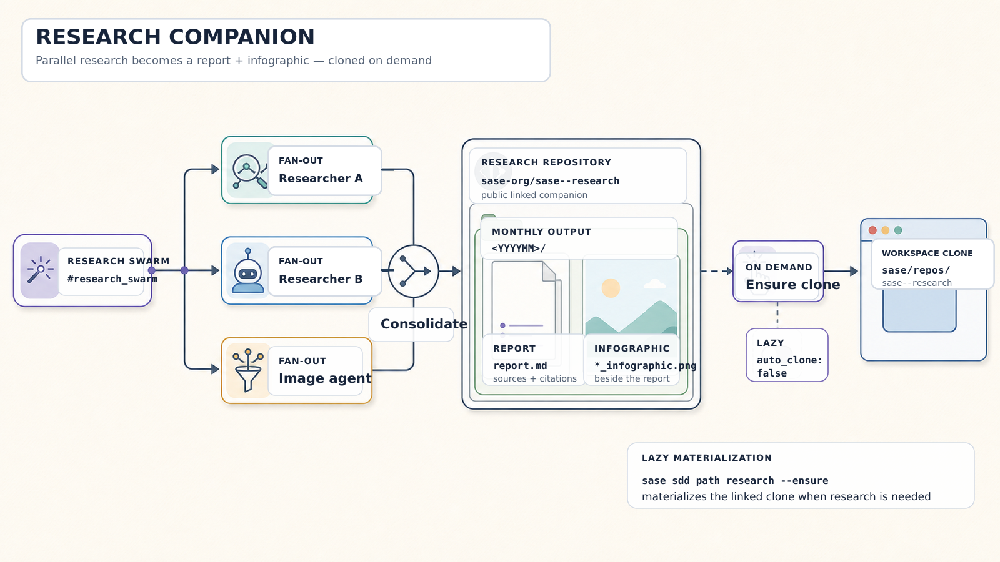

# SASE Research

This public sidecar repository stores durable research for its SASE-managed source repository. It is cloned lazily
when research is requested, keeping exploratory findings and generated media separate from implementation plans.

## Directory Layout

- `<YYYYMM>/*.md` stores research notes organized by month.
- `<YYYYMM>/*_infographic.png` stores generated infographics beside the reports they explain.
- `<YYYYMM>/<topic>/` may store research-swarm drafts such as `<topic>__a.md`, `<topic>__b.md`, and the consolidated
  `<topic>.md` report.
- `assets/` stores generated explanatory media used by this README.

Research should record the question, evidence, alternatives, and a clear recommendation. Follow-up work from
`#research/more` extends the existing report and preserves its established organization and source conventions.

## Commands

- `sase repo path research --ensure` materializes this clone and prints its root.
- `sase plan search --kind research` lists durable research artifacts.
- `#research`, `#research/more`, and `#research_swarm` create or extend research under the current month.
