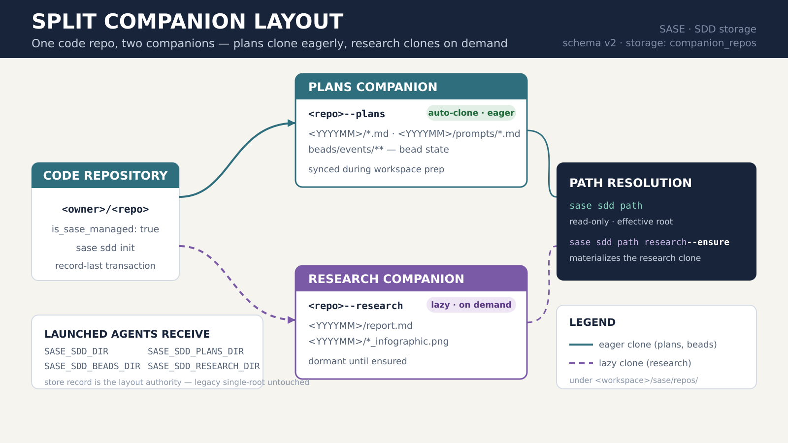

# Split Plans / Research Companion Layout

*Phase 7 smoke-test report — 2026-07-11*

## Question

How does SASE now store SDD artifacts once a managed GitHub project has been split into
**plans** and **research** companion repositories, and how do consumers resolve each kind?

## Summary

Newly initialized or migrated managed GitHub projects no longer keep SDD content in a single
`<repo>--sdd` store. They use a **schema-version 2** store record with `storage: companion_repos`
that names two public companions and their remotes:

- `<owner>/<repo>--plans` — approved plans, prompt snapshots, and bead state.
- `<owner>/<repo>--research` — durable research reports and generated media.

That store record — **not** clone or remote existence — is the layout authority. Legacy
single-root records are untouched and keep working.

## Layout

| Kind       | Migrated path                                | Cloned            |
| ---------- | -------------------------------------------- | ----------------- |
| `plans`    | `<workspace>/sase/repos/<repo>--plans`       | Eagerly (default) |
| `beads`    | `<workspace>/sase/repos/<repo>--plans/beads` | With plans        |
| `research` | `<workspace>/sase/repos/<repo>--research`    | Lazily, on demand |

- **Plans companion** keeps monthly directories at its root (`<YYYYMM>/*.md`,
  `<YYYYMM>/prompts/*.md`) with `beads/` beside them. It is synchronized during normal
  workspace preparation and owns bead state (`beads/events/**`).
- **Research companion** keeps `<YYYYMM>/` directories at its root, storing each report
  next to its `*_infographic.png`. It stays dormant until a consumer runs
  `sase sdd path research --ensure` (or another operation ensures that kind).

## Resolution

`sase sdd path` is a read-only resolver; `-e/--ensure` clones or synchronizes the companion
backing the selected kind. Launched agents receive `SASE_SDD_DIR` plus `SASE_SDD_PLANS_DIR`,
`SASE_SDD_RESEARCH_DIR`, and `SASE_SDD_BEADS_DIR`.

```bash
sase sdd path                     # effective root for the current project
sase sdd path research            # research root (read-only, no clone)
sase sdd path research --ensure   # materialize the research clone, print its root
```

## Initialization & migration

Split initialization is a single **record-last transaction**:

1. Serialize setup and preflight both public repository names.
2. Create or adopt each repository and clone it at the linked-repository location.
3. Write deterministic per-repository README and infographic assets, then commit and push drift.
4. Only after **both** repositories succeed, write the schema-version 2 split store record.

Legacy artifacts move separately through `sase sdd migrate` (`--check` / `--diff` are read-only).
The apply path takes the materialization lock, detects destination conflicts, pushes both
repositories, and retires the local legacy clone only after success. In-tree legacy sources are
retained; a failed transaction leaves no positive record, so the next write simply retries.

## Recommendation

Treat the store record as authoritative: resolve every path through `sase sdd path` rather than
assuming a fixed directory, and let research stay lazy — only `--ensure` when research is actually
needed. Deprecated `sdd.storage` / `sdd.version_controlled` keys are ignored and stripped;
`sase doctor` reports where to remove them.



## Sources

- `docs/sdd_storage.md` — provider policy, split companions, offline behavior.
- `sase/repos/sase--research/README.md` — research companion layout conventions.
- `src/sase/sdd/assets/{plans,research}-directory-map.png.prompt.md` — companion directory maps.
- Commits `4c40d5af8`, `0bbd3cb50`, `4976cdbd8`, `75ee0fb6a`, `ccdd10482` (sase-5q.2–5q.5).
